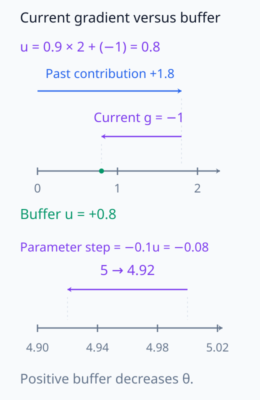
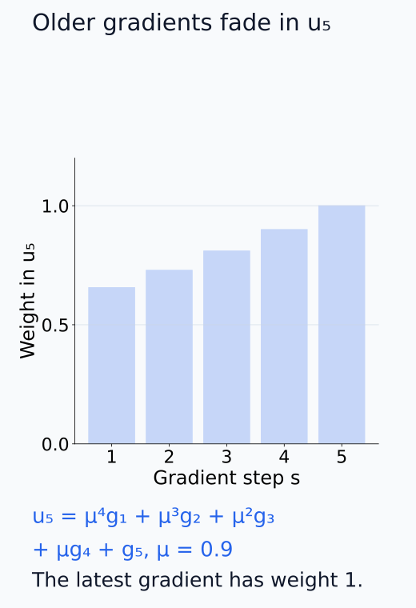
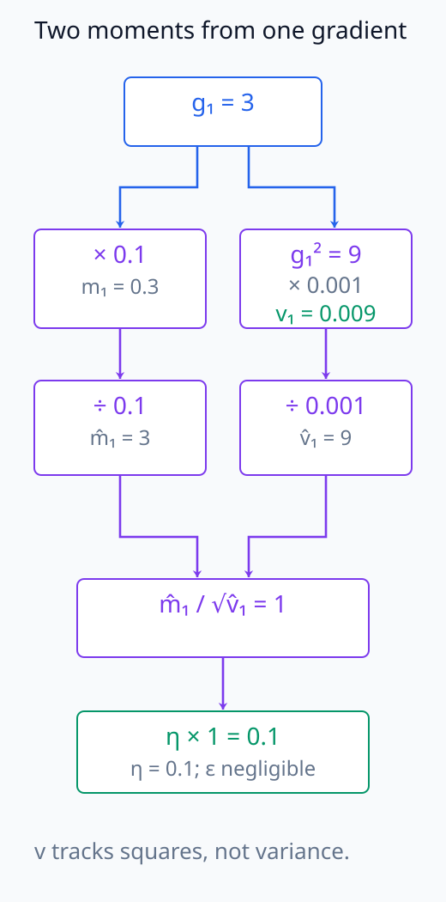
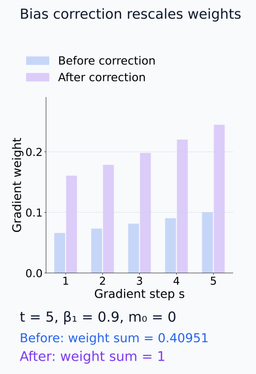
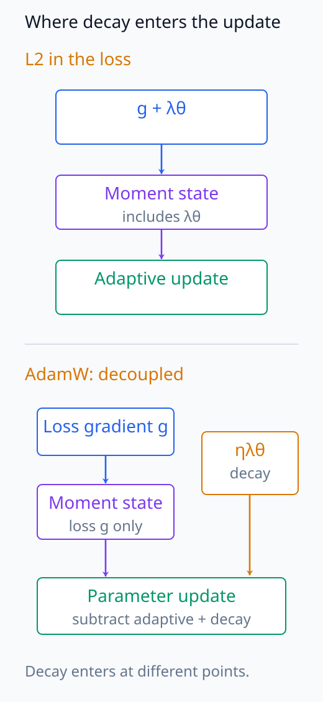
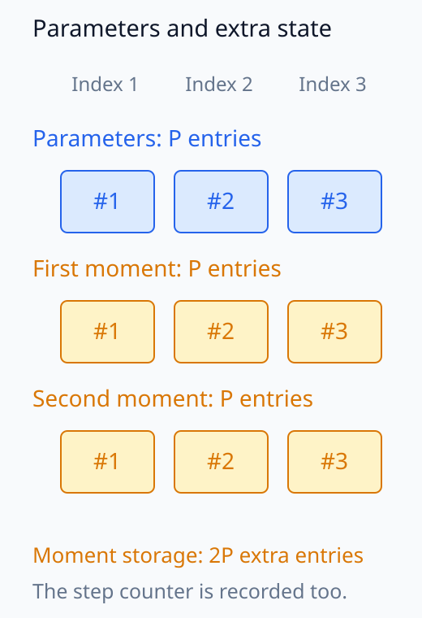
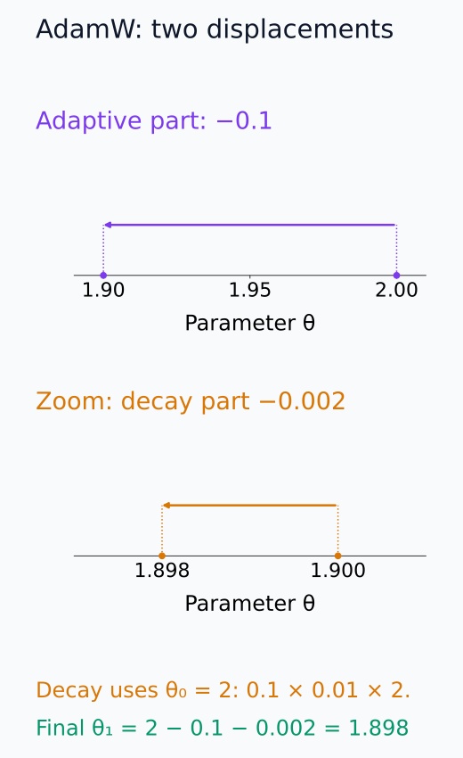
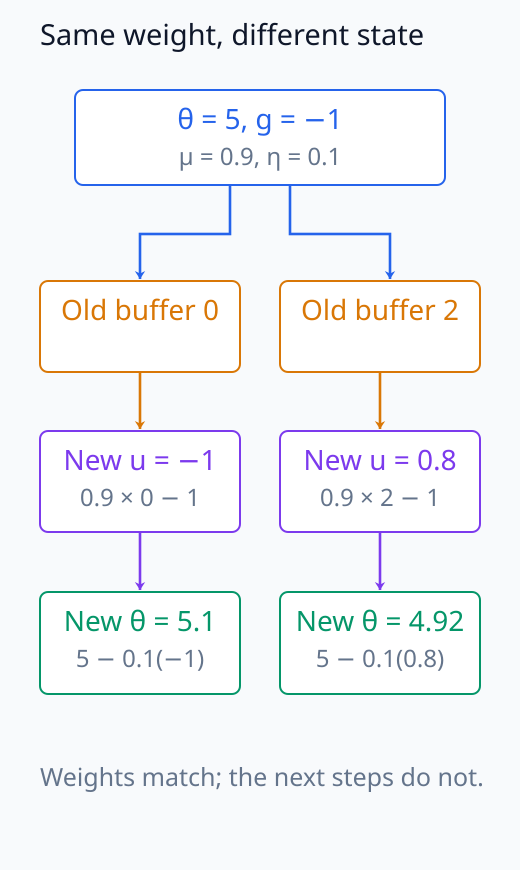

# N05-08. momentum, AdamW와 optimizer state

## 이 단원이 필요한 이유

gradient descent는 현재 gradient만 사용한다. momentum은 이전 gradient 방향을 buffer에 누적하고, Adam은 gradient의 first moment와 second moment estimate를 parameter마다 저장한다. AdamW는 loss gradient update와 weight decay를 분리한다.

따라서 학습 checkpoint는 weight만으로 끝나지 않는다. 같은 weight에서 재개해도 optimizer state와 step이 다르면 다음 update가 달라진다. 이 단원은 scalar parameter 하나로 momentum과 AdamW의 첫 step을 계산한다.

## 학습 목표

이 단원을 마치면 다음을 할 수 있다.

- momentum buffer를 갱신하고 parameter update를 계산할 수 있다.
- Adam의 first·second moment와 bias correction을 계산할 수 있다.
- AdamW의 adaptive update와 decoupled weight decay를 구분할 수 있다.
- parameter와 optimizer state의 저장량 차이를 설명할 수 있다.
- checkpoint 비교에서 step과 optimizer state가 필요한 경우를 판단할 수 있다.

## 선수지식 확인

- 선수 단원: [N05-07 gradient descent와 mini-batch](N05-07-gradient-descent-mini-batch.md)
- 확인 질문: $\theta_{t+1}=\theta_t-\eta g_t$를 수치로 계산할 수 있는가?
- 확인 질문: exponential moving average가 이전 상태와 새 값을 섞는 방식임을 설명할 수 있는가?

## 기호와 용어

| 기호·용어 | Common spoken reading | 의미 | shape·범위 |
|---|---|---|---|
| $g_t$ | `g sub t` | step $t$의 gradient | parameter와 같은 shape |
| $u_t$ | `u sub t` | momentum buffer | parameter와 같은 shape |
| $m_t$ | `m sub t` | Adam first moment estimate | parameter와 같은 shape |
| $v_t$ | `v sub t` | Adam second raw moment estimate | parameter와 같은 shape, nonnegative |
| $\hat m_t$ | `m hat sub t` | bias-corrected first moment | parameter와 같은 shape |
| $\hat v_t$ | `v hat sub t` | bias-corrected second moment | parameter와 같은 shape |
| $\beta_1,\beta_2$ | `beta one and beta two` | Adam의 decay coefficient | $[0,1)$ |
| $\lambda$ | `lambda` | weight decay coefficient | $\lambda\ge0$ |

## 핵심 개념 1. momentum은 gradient history를 상태로 가진다

이 단원은 다음 momentum convention을 사용한다.

\[
u_t=\mu u_{t-1}+g_t,
\qquad
\theta_t=\theta_{t-1}-\eta u_t
\]

$u_t$는 이전 buffer와 현재 gradient를 합친다. library에 따라 $(1-\mu)$ factor, dampening과 Nesterov 계산의 배치가 다르므로 식과 구현을 함께 확인해야 한다.

여기서는 $u_0=0$, $0\le\mu<1$로 두고 $g_t$를 update 전의 $\theta_{t-1}$에서 계산한다. 두 step을 펼치면 $u_2=\mu g_1+g_2$다. 과거 gradient의 영향은 더 오래될수록 $\mu$가 반복해서 곱해져 작아진다. 현재 gradient가 음수여도 과거의 양수 기여가 더 커 buffer가 양수이면 parameter는 계속 감소할 수 있다. momentum buffer는 현재 gradient 그 자체가 아니다.

아래 그림에서 현재 gradient의 부호와 실제 buffer·parameter 이동을 구분한다.

<figure class="lesson-figure" markdown="1">

<figcaption>u_prev = 2, μ = 0.9, g = −1이면 이전 기여 1.8에 −1을 더해 u = 0.8을 만든다. 아래 parameter 눈금에서는 θ = 5, η = 0.1의 update −0.08을 표시했다. gradient와 parameter 눈금의 단위가 다르다.</figcaption>

</figure>

아래 그림에서 오래된 gradient에 붙은 가중치를 최근 값과 비교한다.

<figure class="lesson-figure" markdown="1">

<figcaption>u₀ = 0에서 다섯 step을 펼친 가중치다. 가로축은 gradient가 계산된 step이며, 현재 step 5에서 오래된 값일수록 μ가 더 많이 곱해진다. buffer 자체를 현재 gradient 하나로 볼 수 없는 이유다.</figcaption>

</figure>

## 핵심 개념 2. Adam은 두 moment estimate를 저장한다

Adam의 상태 update는

\[
m_t=\beta_1m_{t-1}+(1-\beta_1)g_t
\]

\[
v_t=\beta_2v_{t-1}+(1-\beta_2)g_t^2
\]

이다. $g_t^2$는 elementwise square다. 0에서 시작한 moving average는 초기값 쪽으로 치우치므로

\[
\hat m_t=\frac{m_t}{1-\beta_1^t},
\qquad
\hat v_t=\frac{v_t}{1-\beta_2^t}
\]

로 correction한다. Adam update의 adaptive 부분은

\[
\Delta_t^{\mathrm{Adam}}
=\eta\frac{\hat m_t}{\sqrt{\hat v_t}+\epsilon}
\]

이다.

$m_0=v_0=0$에서 첫 moment를 펼치면 $m_t=(1-\beta_1)\sum_{s=1}^t\beta_1^{t-s}g_s$다. gradient에 붙은 가중치의 합은 $1-\beta_1^t$이므로 이를 분모로 나누어 초기의 빠진 가중치를 보정한다. second moment도 같은 논리로 $1-\beta_2^t$를 사용한다. gradient 분포가 계속 바뀌는 실제 학습에서 이 correction이 현재 gradient를 정확히 추정한다고 보장하는 것은 아니다.

$v_t$는 gradient 제곱의 평균이지 평균에서 뺀 편차의 제곱 평균, 즉 variance가 아니다. adaptive 비율은 각 좌표의 signed first moment를 그 좌표의 제곱 크기에서 얻은 scale로 나눈다. $\epsilon>0$은 분모가 0이 되는 것을 막는다. 이때도 $m_t$가 과거 값을 포함하므로 update 방향을 현재 $g_t$의 부호만으로 정할 수 없다.

아래 그림에서 first·second moment와 각 correction 분모를 차례로 추적한다.

<figure class="lesson-figure" markdown="1">

<figcaption>m₀ = v₀ = 0, β₁ = 0.9, β₂ = 0.999인 첫 step이다. signed gradient와 제곱을 서로 다른 상태에 넣고 각각 다른 분모로 correction한다. 작은 ε를 무시한 adaptive 이동량은 0.1이다.</figcaption>

</figure>

아래 그림에서 가중치 합이 correction 전후에 어떻게 바뀌는지 확인한다.

<figure class="lesson-figure" markdown="1">

<figcaption>first moment를 다섯 step까지 펼친 예다. 각 step의 왼쪽 막대는 correction 전 가중치, 오른쪽 막대는 1 − 0.9⁵로 나눈 가중치다. 합이 0.40951에서 1이 되지만 gradient들이 실제로 같아진다는 뜻은 아니다.</figcaption>

</figure>

## 핵심 개념 3. AdamW는 weight decay를 분리한다

AdamW의 한 step을 단순화하면

\[
\theta_t
=\theta_{t-1}
-\eta\frac{\hat m_t}{\sqrt{\hat v_t}+\epsilon}
-\eta\lambda\theta_{t-1}
\]

이다. 마지막 항은 loss gradient에 섞이지 않고 parameter에 직접 적용된다. adaptive optimizer에서 loss에 $L_2$ penalty를 더하는 방식과 decoupled weight decay는 같은 update가 아니다.

loss에 $\lambda\|\theta\|_2^2/2$를 더하면 gradient에 $\lambda\theta$가 추가되고 이 항까지 moment와 adaptive scale에 들어간다. AdamW에서는 이 항을 moment 계산에 넣지 않고 기존 parameter에 $1-\eta\lambda$를 곱하는 효과로 분리한다. $0<\eta\lambda<1$일 때 decay 부분만 보면 parameter를 0 쪽으로 줄인다. 전체 update에는 gradient 항도 있으므로 모든 parameter의 절댓값이 반드시 줄어드는 것은 아니다.

아래 그림에서 moment 안으로 들어가는 항과 밖에서 적용되는 항을 구분한다.

<figure class="lesson-figure" markdown="1">

<figcaption>위쪽 L2 경로는 λθ를 loss gradient에 더한 뒤 moment와 adaptive scale을 계산한다. 아래 AdamW 경로는 loss gradient만 moment로 보내고, λθ에 η를 곱한 decay를 parameter update에서 따로 뺀다. 같은 λ라도 일반적으로 같은 결과가 아니다.</figcaption>

</figure>

## 핵심 개념 4. optimizer state도 checkpoint의 일부다

Adam 계열은 parameter 원소마다 $m_t$와 $v_t$를 저장하고 step도 기록한다. parameter가 $P$개면 이 두 tensor만으로도 대략 $2P$개의 state 원소가 추가된다. mixed precision 학습은 master weight나 scaler state를 더 가질 수 있다.

inference에는 weight가 핵심이지만 학습을 같은 trajectory에서 재개하려면 optimizer, scheduler, step과 random state가 필요하다.

아래 그림에서 parameter 위치와 두 state 위치의 대응을 센다.

<figure class="lesson-figure" markdown="1">

<figcaption>P = 3인 경우를 배열 위치로 표시했다. parameter의 각 위치에 first·second moment 위치 하나씩이 대응해 state 원소가 6 = 2P개 추가된다. step 기록은 별도이며 moment는 forward parameter가 아니다.</figcaption>

</figure>

## 예제 1. momentum 첫 step

$\theta_0=2$, target $0.5$와 $L=(\theta-0.5)^2$를 사용하면 $g_1=3$이다. $u_0=0$, $\mu=0.9$, $\eta=0.1$이면

\[
u_1=0.9\cdot0+3=3,
\qquad
\theta_1=2-0.1\cdot3=1.7
\]

이다. 첫 step에서는 이전 gradient가 없으므로 buffer가 현재 gradient와 같다.

## 예제 2. AdamW 첫 step

$\beta_1=0.9$, $\beta_2=0.999$이면

\[
m_1=0.1\cdot3=0.3,
\qquad
v_1=0.001\cdot9=0.009
\]

이다. bias correction 뒤에는 $\hat m_1=3$, $\hat v_1=9$다. $\eta=0.1$, $\lambda=0.01$이고 $\epsilon$을 무시할 만큼 작다고 하면 adaptive update는 0.1, decay update는 0.002다.

\[
\theta_1^{\mathrm{AdamW}}=2-0.1-0.002=1.898
\]

이다.

아래 그림에서 서로 다른 확대 눈금을 확인한 뒤 두 이동량을 읽는다.

<figure class="lesson-figure" markdown="1">

<figcaption>위 눈금은 adaptive 항으로 2에서 1.9로 이동한 결과다. 아래는 1.9 부근을 확대해 decay 0.002를 표시했다. 아래 화살표가 길어 보이는 것은 다른 확대 눈금 때문이며 최종값은 1.898이다.</figcaption>

</figure>

## 실행 실습

### 실행 환경과 원본

- 환경: Python 3.12, PyTorch 2.13.0 CPU, NumPy 2.5.3
- 확인일: 2026-10-01
- 구성요소 등급: `Stable core`
- 예제 ID: `n05_08_adamw_state`
- 코드 원본: `labs/N05/n05_08_adamw_state.py`
- 테스트: `tests/N05/test_n05_08.py`
- 실행 명령: `.venv\Scripts\python.exe -m labs.N05.n05_08_adamw_state`

### 자원 예산

예제는 scalar parameter 1개와 update 1회를 사용한다. optimizer 식은 tensor 연산으로 직접 구현하며 hard timeout은 10초다.

### 실제 코드와 실행 결과

site build는 아래 위치에 원본 코드와 실제 실행 결과를 삽입한다.

<!-- N05_EXAMPLE: n05_08_adamw_state -->

### 상태와 update 검사

테스트는 gradient 3, momentum buffer 3, Adam moment와 bias correction을 확인한다. adaptive update 0.1과 decay update 0.002를 분리한 뒤 최종 parameter 1.898을 검산한다.

## 구현을 읽을 때 확인할 항목

optimizer 이름만으로 정확한 update를 단정하지 않는다. epsilon의 위치, weight decay 적용 순서, foreach·fused 구현과 momentum convention을 확인한다. 같은 수학식을 병렬 kernel로 구현한 경우에는 수치 오차 범위 안에서 결과가 일치하는지 test한다.

## 모델 해석과의 연결

두 training checkpoint의 weight 차이는 그 구간의 gradient만 반영하지 않는다. 이전 step에서 누적된 optimizer state, learning-rate schedule과 batch order가 함께 작용한다.

학습 동역학을 분석할 때 weight snapshot만 있으면 representation 변화는 관찰할 수 있다. 특정 update가 왜 일어났는지 재생하려면 optimizer state와 data order가 더 필요하다.

아래 그림에서 다른 buffer를 가진 두 checkpoint의 다음 값을 비교한다.

<figure class="lesson-figure" markdown="1">

<figcaption>momentum convention, θ = 5, g = −1, μ = 0.9, η = 0.1을 모두 맞췄다. 이전 buffer만 0과 2로 다르면 새 buffer는 −1과 0.8, 다음 parameter는 5.1과 4.92가 된다. weight만으로 다음 update를 재생할 수 없다.</figcaption>

</figure>

## 흔한 오해

### 오해 1. optimizer state는 학습 가능한 parameter다

$m_t$와 $v_t$는 update를 계산하는 상태다. forward model의 parameter로 gradient를 받아 학습되는 값과 구분해야 한다.

### 오해 2. AdamW의 weight decay는 Adam loss에 $L_2$ penalty를 더한 것과 같다

adaptive scaling이 있는 Adam에서는 두 update가 일반적으로 다르다. AdamW는 decay를 loss-gradient update에서 분리한다.

### 오해 3. weight 파일만 있으면 학습을 같은 위치에서 재개할 수 있다

같은 prediction에서 시작할 수는 있다. 다음 update를 재현하려면 moment, step, scheduler와 random state가 필요하다.

## 연습문제

### 1. momentum buffer

$u_{t-1}=2$, $g_t=-1$, $\mu=0.9$이면 $u_t$는 얼마인가?

해설 보기

$u_t=0.9\cdot2-1=0.8$이다.

### 2. momentum update

앞 문제에서 $\theta_{t-1}=5$, $\eta=0.1$이면 새 parameter는 얼마인가?

해설 보기

$\theta_t=5-0.1\cdot0.8=4.92$다.

### 3. first moment

$m_0=0$, $g_1=4$, $\beta_1=0.9$일 때 $m_1$과 $\hat m_1$을 구하라.

해설 보기

$m_1=0.1\cdot4=0.4$이고 $\hat m_1=0.4/(1-0.9)=4$다.

### 4. state 크기

parameter가 1000개인 float tensor 하나에 Adam의 first·second moment를 같은 dtype으로 저장한다. moment state 원소 수는 몇 개인가?

해설 보기

각 moment tensor가 1000개 원소를 가지므로 합계는 2000개다. step과 framework별 추가 state는 별도다.

### 5. checkpoint 목적

inference 배포와 exact training resume에 필요한 artifact가 다른 이유를 설명하라.

해설 보기

inference는 forward에 필요한 model weight와 config를 사용한다. exact resume는 다음 update를 정해야 하므로 optimizer·scheduler state, step, random state와 data order가 더 필요하다.

### 6. 주장 비판

두 checkpoint 사이 weight가 크게 변한 layer가 그 구간에서 가장 큰 gradient를 받았다는 결론을 평가하라.

해설 보기

weight 변화는 gradient뿐 아니라 moment, adaptive scaling, weight decay와 learning rate의 결과다. 저장된 optimizer state와 step별 기록 없이 gradient 크기를 역으로 확정할 수 없다.

## 근거와 갱신 경계

moment estimate와 bias correction은 [Adam: A Method for Stochastic Optimization](https://arxiv.org/abs/1412.6980), decoupled decay는 [Decoupled Weight Decay Regularization](https://arxiv.org/abs/1711.05101)을 따른다. 실제 library의 option과 kernel은 버전에 따라 달라질 수 있으므로 이 단원은 명시한 식을 기준 계산으로 사용한다.

## 단원 요약

- momentum은 이전 gradient 방향을 buffer에 누적한다.
- Adam은 first·second moment와 step을 optimizer state로 저장한다.
- bias correction은 0에서 시작한 moment의 초기 편향을 보정한다.
- AdamW는 adaptive update와 weight decay를 분리한다.
- training resume에는 weight보다 많은 상태가 필요하다.

## 통과 기준

다음 질문에 자료를 보지 않고 답할 수 있으면 통과한다.

- momentum buffer와 parameter update를 계산할 수 있는가?
- Adam의 두 moment와 bias correction을 계산할 수 있는가?
- AdamW의 두 update 항을 구분할 수 있는가?
- optimizer state의 크기를 parameter 수와 연결할 수 있는가?
- weight-only checkpoint의 해석 한계를 설명할 수 있는가?

## 다음 단원

- [N05-09 PyTorch tensor, shape와 dtype](N05-09-pytorch-tensor-shape-dtype.md)

## 집필자 점검표

- [x] 학습 목표가 관찰 가능한 행동으로 작성됐다.
- [x] momentum convention을 명시했다.
- [x] Adam moment와 bias correction을 분리했다.
- [x] AdamW의 adaptive update와 decay를 분리했다.
- [x] 모든 문제에 해설이 있다.
- [x] 모델 해석 주장의 강도를 구분했다.
- [x] 용어집과 표기 규칙을 따랐다.
- [x] Common spoken reading이 실제 영어 학술 발화이며 한글 음역이나 기계적 직역을 포함하지 않는다.
- [x] 선수지식 밖의 내용을 몰래 요구하지 않는다.
- [x] 내부 링크와 수식 렌더링을 확인했다.
- [x] Markdown에 실행 코드를 손으로 복제하지 않았다.
- [x] 코드 원본·테스트 경로·자원 예산·확인일을 기록했다.
- [x] shape·수치·gradient test가 있다.
