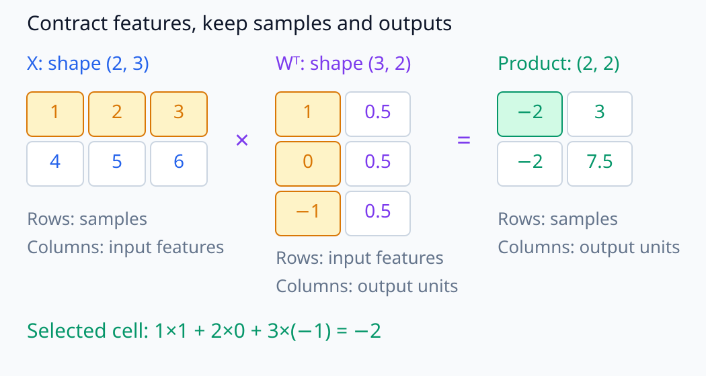
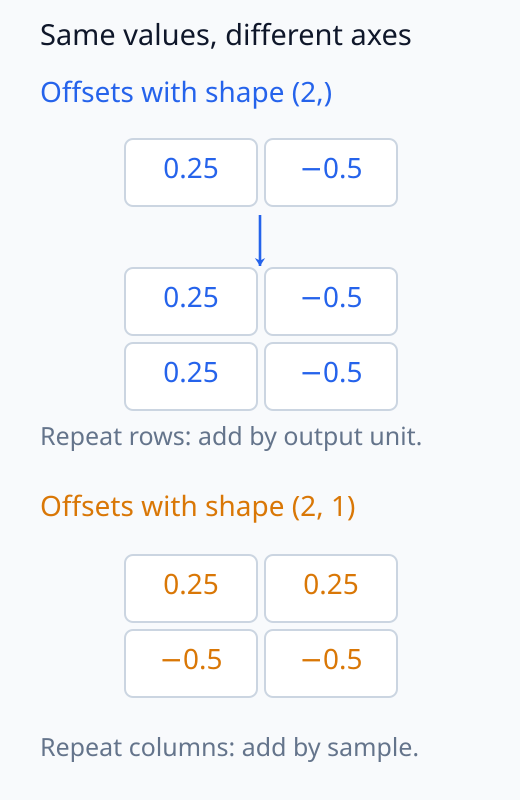
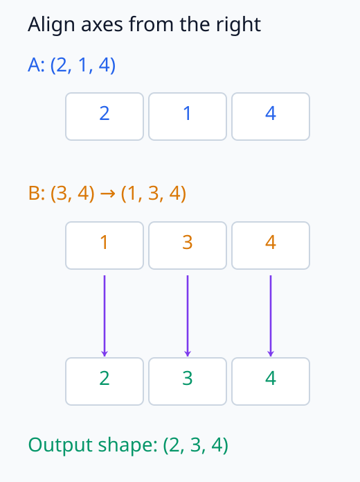
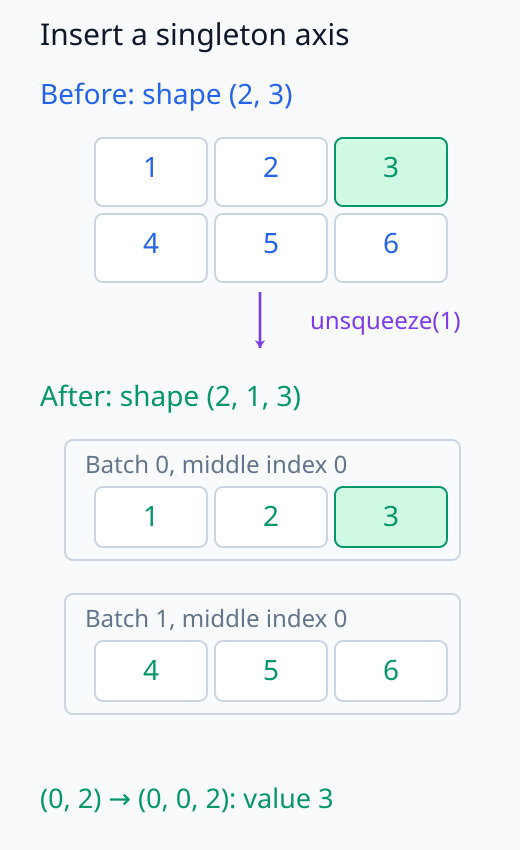
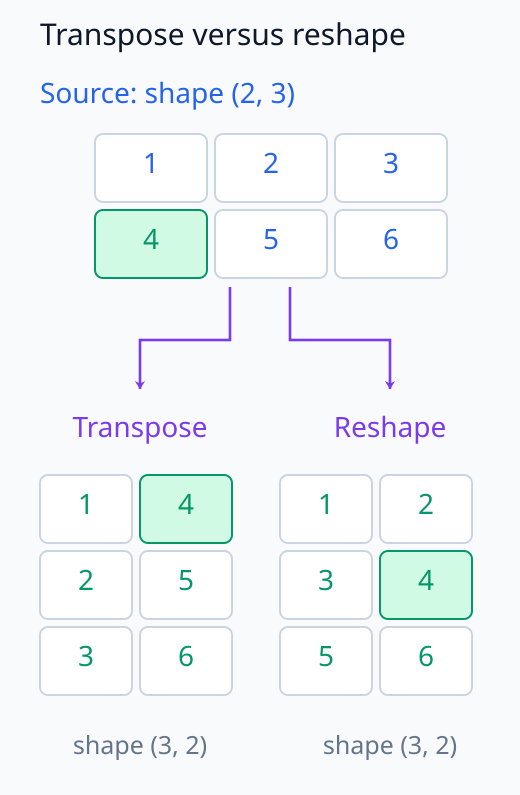
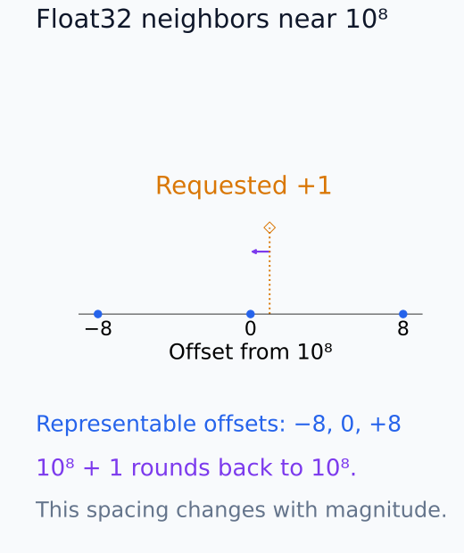
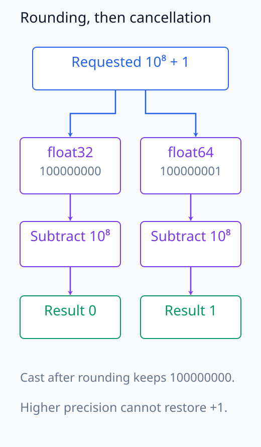

# N05-09. PyTorch tensor, shape와 dtype

## 이 단원이 필요한 이유

수식의 vector와 matrix는 코드에서 tensor가 된다. 같은 기호라도 batch axis를 붙이거나 singleton axis를 넣으면 연산 규칙이 달라진다. dtype은 수학적 값의 근사 방식과 memory 크기를 정한다.

이 단원은 affine layer를 `matmul`, transpose와 broadcast로 계산한다. `unsqueeze`로 shape를 바꾸고 float32와 float64의 cancellation 차이도 확인한다.

## 학습 목표

이 단원을 마치면 다음을 할 수 있다.

- PyTorch tensor의 shape와 axis 의미를 수식에 대응시킬 수 있다.
- matrix multiplication의 contracting dimension을 검산할 수 있다.
- trailing-axis 규칙으로 broadcasting 가능 여부를 판단할 수 있다.
- `unsqueeze`, transpose와 reshape의 역할을 구분할 수 있다.
- dtype에 따른 반올림 차이를 해석할 수 있다.

## 선수지식 확인

- 선수 단원: [N05-08 momentum, AdamW와 optimizer state](N05-08-momentum-adamw-optimizer-state.md)
- 확인 질문: $(B,d)(d,h)$의 결과 shape를 구할 수 있는가?
- 확인 질문: float32가 모든 실수를 정확히 저장하지 못하는 이유를 설명할 수 있는가?

## 기호와 용어

| 기호·용어 | Common spoken reading | 의미 | shape·범위 |
|---|---|---|---|
| `shape` | `shape` | axis 길이를 순서대로 적은 tuple | 예: `(B, d)` |
| `dtype` | `data type` | 원소의 수치 표현 형식 | 예: `float32` |
| $\mathbf X$ | `X` | row-batch 입력 | $\mathbb R^{B\times d_{\mathrm{in}}}$ |
| $\mathbf W$ | `W` | output unit을 행으로 쌓은 weight | $\mathbb R^{d_{\mathrm{out}}\times d_{\mathrm{in}}}$ |
| $\mathbf b$ | `b` | output axis에 더하는 bias | $\mathbb R^{d_{\mathrm{out}}}$ |
| `unsqueeze` | `unsqueeze` | 길이 1인 axis를 넣는 연산 | 원소 수는 유지 |
| broadcasting | `broadcasting` | 호환되는 axis에서 tensor를 확장해 연산하는 규칙 | trailing axis부터 비교 |

## 핵심 개념 1. shape는 axis 의미와 함께 읽는다

입력을 행 batch로 두면 affine layer는

\[
\mathbf Y=\mathbf X\mathbf W^\top+\mathbf b
\]

이다. shape 흐름은

\[
(B,d_{\mathrm{in}})(d_{\mathrm{in}},d_{\mathrm{out}})
\longrightarrow(B,d_{\mathrm{out}})
\]

이다. 코드의 `inputs @ weight.T`에서 `.T`가 weight의 두 axis를 바꾼다.

수축되는 input axis에서는 대응하는 값들을 곱해 더하고 batch와 output axis는 남긴다. $B$와 $d_{\mathrm{out}}$이 우연히 같은 숫자여도 두 axis가 같은 뜻은 아니다. 위 식의 첫 axis는 sample이고 둘째 axis는 output unit이다. shape의 숫자를 확인한 뒤 각 axis가 어느 입력에서 왔는지도 확인해야 한다.

아래 그림에서 선택한 sample 행과 output 열의 feature 대응을 추적한다.

<figure class="lesson-figure lesson-figure--wide" markdown="1">

<figcaption>예제 1의 bias를 더하기 전 행렬곱이다. X의 한 sample 행과 Wᵀ의 한 output 열이 feature 세 위치에서 대응해 −2를 만든다. 결과의 행은 sample, 열은 output unit이다.</figcaption>

</figure>

## 핵심 개념 2. broadcasting은 뒤 axis부터 맞춘다

$(B,d_{\mathrm{out}})$ tensor에 $(d_{\mathrm{out}},)$ bias를 더하면 마지막 axis가 일치한다. bias에는 batch axis가 없으므로 각 batch row에 같은 vector를 더한다.

두 axis를 뒤에서 비교할 때 크기가 같거나 한쪽이 1이거나 한쪽 axis가 없으면 broadcast할 수 있다. broadcast는 수학적 반복을 표현하지만 구현이 실제 data copy를 만들지 않을 수도 있다.

비교할 때 없는 앞쪽 axis를 길이 1로 보면 결과의 각 axis 길이를 정하기 쉽다. $(d_{\mathrm{out}},)$ bias는 $(1,d_{\mathrm{out}})$처럼 맞춰져 batch 방향으로 반복된다. 반대로 sample마다 숫자 하나를 더하려면 $(B,1)$로 두어 output 방향으로 반복시킨다. $(B,)$만 쓰면 마지막 axis와 맞추므로, $B=d_{\mathrm{out}}$일 때 코드가 실행돼도 의도한 sample별 덧셈이 아닐 수 있다.

아래 그림에서 같은 숫자가 반복되는 방향을 행·열로 비교한다.

<figure class="lesson-figure" markdown="1">

<figcaption>(0.25, −0.5)를 output별 숫자로 놓으면 같은 행이 각 sample에 반복된다. sample별 숫자로 놓으려면 (2, 1)이 필요해 각 행 안에서 같은 숫자가 반복된다. B와 d_out이 둘 다 2라서 잘못된 방향도 실행될 수 있다.</figcaption>

</figure>

아래 그림에서 오른쪽부터 맞춘 각 axis의 길이를 판정한다.

<figure class="lesson-figure" markdown="1">

<figcaption>둘째 tensor의 없는 앞쪽 axis를 1로 맞춰 (1, 3, 4)로 비교한다. 각 열에서 크기가 같거나 한쪽이 1이면 더 큰 길이를 쓰므로 결과는 (2, 3, 4)다. 전체 원소 수만 비교하는 규칙이 아니다.</figcaption>

</figure>

## 핵심 개념 3. shape 연산은 원소 배치를 해석한다

`unsqueeze(1)`은 $(B,d)$를 $(B,1,d)$로 바꾼다. 새 axis 길이는 1이고 원소 수는 같다. transpose는 axis 순서를 바꾼다. reshape는 같은 원소를 다른 axis 길이로 묶되 총 원소 수를 유지해야 한다.

shape가 같다는 사실만으로 axis 의미가 같아지지는 않는다. `(B, T, d)`와 `(T, B, d)`는 원소 수가 같아도 batch와 token 위치가 바뀐다.

transpose와 reshape는 결과 shape가 같다고 같은 값을 같은 위치에 놓는다고 보장하지 않는다. 두 행이 $(1,2,3)$과 $(4,5,6)$인 matrix를 전치하면 첫 행은 $(1,4)$가 된다. 반면 행 순서로 나열한 여섯 값을 $(3,2)$로 다시 묶으면 첫 행은 $(1,2)$다. axis의 역할을 교환하려는 경우와 순서대로 나열된 원소를 다시 묶으려는 경우를 구분한다.

아래 그림에서 길이 1인 새 index를 추가해 같은 원소를 다시 읽는다.

<figure class="lesson-figure" markdown="1">

<figcaption>기존 batch 두 위치 각각에 길이 1의 중간 axis를 넣는다. 새 axis의 index는 0 하나뿐이며, (0, 2)의 값 3은 (0, 0, 2)로 읽는다. 원소 복제는 일어나지 않는다.</figcaption>

</figure>

아래 그림에서 같은 숫자 4가 두 shape 연산 뒤에 놓이는 위치를 비교한다.

<figure class="lesson-figure" markdown="1">

<figcaption>source의 둘째 행 첫 위치에 있던 4를 추적한다. transpose에서는 첫째 행 둘째 위치, 행 순서 reshape에서는 둘째 행 둘째 위치가 된다. shape가 (3, 2)로 같아도 위치 대응은 다르다.</figcaption>

</figure>

## 핵심 개념 4. dtype은 수치 결과에 들어간다

float32와 float64는 같은 실수를 서로 다른 정밀도로 근사한다. 큰 수와 작은 수를 함께 계산하면 작은 값이 반올림으로 사라질 수 있다. 연산 순서도 결과에 영향을 준다.

dtype 차이를 모델의 개념 차이로 해석하면 안 된다. 먼저 같은 수학 함수가 허용 오차 안에서 일치하는지 검사해야 한다.

부동소수점은 크기가 달라도 일정한 절대 간격으로 모든 수를 저장하는 방식이 아니다. 큰 수 주변에서는 표현 가능한 이웃 값의 간격도 커져 작은 증가량이 같은 값으로 반올림될 수 있다. 그런 값들을 나중에 빼면 큰 부분만 소거되고 작은 증가량은 돌아오지 않는다. 이미 float32에서 사라진 값을 float64로 옮겨도 복구되지 않으며, 높은 precision도 처음부터 계산에 사용했을 때 반올림을 줄일 수 있을 뿐 정확한 실수 연산은 아니다.

아래 그림에서 원하는 증가량과 저장 가능한 이웃 값의 간격을 구분한다.

<figure class="lesson-figure" markdown="1">

<figcaption>실제 float32에서 10⁸의 이웃 값은 8 간격이다. 주황 표식은 원하는 증가량 +1, 파란 점은 저장 가능한 값이다. +1을 더해도 가장 가까운 저장값이 원래 10⁸이므로 그 증가량이 남지 않는다.</figcaption>

</figure>

## 예제 1. affine shape와 값

\[
\mathbf X=\begin{bmatrix}1&2&3\\4&5&6\end{bmatrix},
\quad
\mathbf W=\begin{bmatrix}1&0&-1\\0.5&0.5&0.5\end{bmatrix},
\quad
\mathbf b=(0.25,-0.5)
\]

이면 $\mathbf X\mathbf W^\top$의 shape는 $(2,2)$다. bias를 broadcast하면

\[
\mathbf Y=\begin{bmatrix}-1.75&2.5\\-1.75&7.0\end{bmatrix}
\]

이다.

## 예제 2. cancellation

$(10^8,1,-10^8)$을 순서대로 더하면 float32 예제는 0을, float64 예제는 1을 낸다. float32에서 $10^8+1$을 저장하는 순간 1이 사라진다. 이 예제는 실수 덧셈의 결합법칙이 유한정밀도 계산에서 그대로 유지되지 않음을 보인다.

아래 그림에서 반올림이 일어난 시점과 이후 cast·뺄셈의 결과를 확인한다.

<figure class="lesson-figure" markdown="1">

<figcaption>같은 덧셈을 float32에서는 10⁸로, 처음부터 float64로 계산하면 100000001로 저장한다. 이후 10⁸을 빼면 각각 0과 1이다. float32에서 반올림된 10⁸을 나중에 float64로 cast해도 저장값은 그대로다.</figcaption>

</figure>

## 실행 실습

### 실행 환경과 원본

- 환경: Python 3.12, PyTorch 2.13.0 CPU, NumPy 2.5.3
- 확인일: 2026-10-01
- 구성요소 등급: tensor 계산은 `Stable core`, broadcasting 구현은 framework semantics
- 예제 ID: `n05_09_tensor_shape_dtype`
- 코드 원본: `labs/N05/n05_09_tensor_shape_dtype.py`
- 테스트: `tests/N05/test_n05_09.py`
- 실행 명령: `.venv\Scripts\python.exe -m labs.N05.n05_09_tensor_shape_dtype`

### 자원 예산

예제는 batch 2, input dimension 3, output dimension 2와 parameter 8개를 사용한다. training step은 0이고 hard timeout은 10초다.

### 실제 코드와 실행 결과

<!-- N05_EXAMPLE: n05_09_tensor_shape_dtype -->

### shape·수치·gradient 검사

테스트는 affine output $(2,2)$, `unsqueeze` output $(2,1,3)$과 input gradient를 확인한다. cancellation 결과는 dtype별로 따로 검사한다.

## 모델 해석과의 연결

activation 분석에서 가장 흔한 오류는 batch, token, head와 feature axis를 바꾸는 것이다. hook 결과를 저장할 때 tensor name과 shape만 기록하지 말고 axis schema를 함께 기록해야 한다.

precision을 바꾼 뒤 attribution 값이 달라졌다면 먼저 수치 오차와 threshold 민감도를 검사한다. 차이가 재현된다는 사실만으로 모델이 다른 feature를 사용했다고 결론낼 수 없다.

## 흔한 오해

### 오해 1. 원소 수가 같으면 elementwise 연산이 된다

PyTorch는 broadcast 규칙에 따라 axis를 맞춘다. 원소 수만 같은 `(2,3)`과 `(6,)`은 elementwise 덧셈에 호환되지 않는다.

### 오해 2. `unsqueeze`는 값을 복제한다

`unsqueeze`는 길이 1인 axis를 넣는다. 원소 수와 값은 유지된다.

### 오해 3. 높은 precision 결과가 실수의 정확한 값이다

float64도 유한정밀도 근사다. 다만 float32보다 더 많은 유효 숫자를 저장한다.

## 연습문제

### 1. matmul shape

`X.shape=(4,3)`, `W.shape=(5,3)`일 때 `X @ W.T`의 shape를 구하라.

해설 보기

`W.T`는 `(3,5)`이므로 결과는 `(4,5)`다.

### 2. bias broadcast

shape `(4,5)` tensor에 shape `(5,)` bias를 더할 때 어느 axis로 반복되는가?

해설 보기

길이 5가 마지막 axis와 맞고 같은 bias가 네 batch row에 적용된다.

### 3. unsqueeze

shape `(2,3)`에 `unsqueeze(0)`과 `unsqueeze(1)`을 각각 적용한 shape를 적어라.

해설 보기

각각 `(1,2,3)`과 `(2,1,3)`이다.

### 4. broadcast 판단

`(2,1,4)`와 `(3,4)`는 broadcast 가능한가?

해설 보기

가능하다. 뒤에서부터 4와 4가 같고 1과 3은 한쪽이 1이며 첫 tensor의 2에 대응하는 axis가 둘째 tensor에는 없다. 결과 shape는 `(2,3,4)`다.

### 5. dtype 실험

float32 tensor를 float64로 cast하면 이미 사라진 정보가 복구되는가?

해설 보기

복구되지 않는다. cast는 현재 float32 값을 더 넓은 표현에 옮긴다. 원래 입력을 float64로 만들어 계산해야 반올림 시점을 늦출 수 있다.

### 6. 주장 비판

두 hook tensor의 shape가 같으므로 같은 표현이라는 결론을 평가하라.

해설 보기

shape는 원소 배치만 말한다. hook 위치, axis 의미, 값과 basis가 다를 수 있으므로 같은 표현이라는 결론은 나오지 않는다.

## 근거와 갱신 경계

broadcast 판단은 [PyTorch broadcasting semantics](https://docs.pytorch.org/docs/stable/notes/broadcasting.html)의 trailing-axis 규칙을 따른다. 수학적 affine map과 framework의 memory layout을 같은 개념으로 취급하지 않는다.

## 단원 요약

- tensor shape는 axis 의미와 함께 읽어야 한다.
- matrix multiplication은 맞닿는 dimension을 수축한다.
- broadcasting은 trailing axis부터 호환성을 검사한다.
- shape 변환과 dtype 변환은 서로 다른 연산이다.
- finite precision은 값과 gradient에 수치 오차를 만든다.

## 통과 기준

- affine 계산의 모든 shape를 적을 수 있는가?
- broadcast 가능 여부와 결과 shape를 판단할 수 있는가?
- `unsqueeze`, transpose와 reshape를 구분할 수 있는가?
- dtype 차이의 수치 효과를 설명할 수 있는가?
- axis schema 없는 activation 비교를 비판할 수 있는가?

## 다음 단원

- [N05-10 autograd, JVP와 VJP](N05-10-autograd-jvp-vjp.md)

## 집필자 점검표

- [x] 학습 목표가 관찰 가능한 행동으로 작성됐다.
- [x] shape와 axis 의미를 구분했다.
- [x] broadcasting 규칙을 명시했다.
- [x] dtype별 수치를 검산했다.
- [x] 모든 문제에 해설이 있다.
- [x] 모델 해석 주장의 강도를 구분했다.
- [x] 용어집과 표기 규칙을 따랐다.
- [x] Common spoken reading이 실제 영어 학술 발화이며 한글 음역이나 기계적 직역을 포함하지 않는다.
- [x] 선수지식 밖의 내용을 몰래 요구하지 않는다.
- [x] 내부 링크와 수식 렌더링을 확인했다.
- [x] Markdown에 실행 코드를 손으로 복제하지 않았다.
- [x] 코드 원본·테스트 경로·자원 예산·확인일을 기록했다.
- [x] shape·수치·gradient test가 있다.
