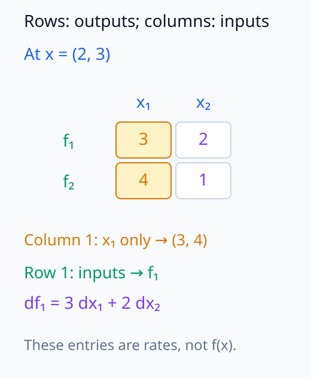
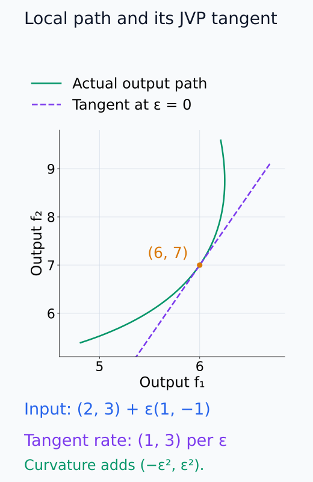
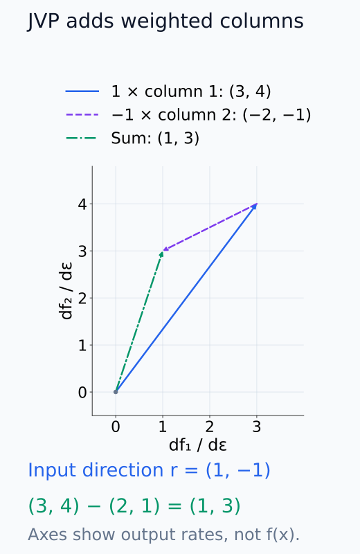
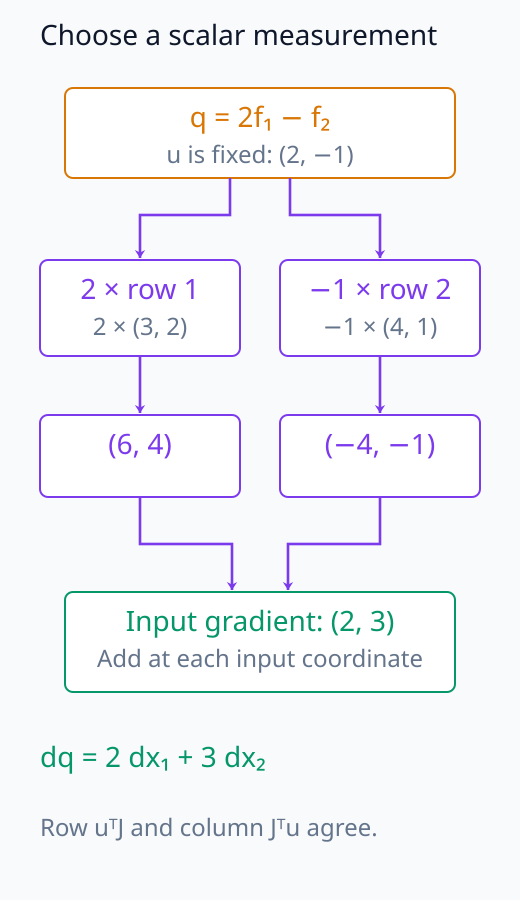
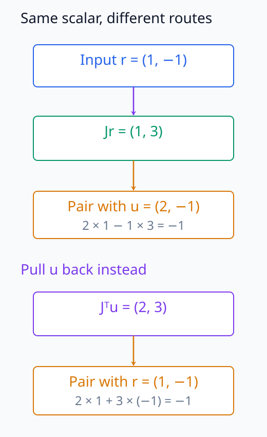
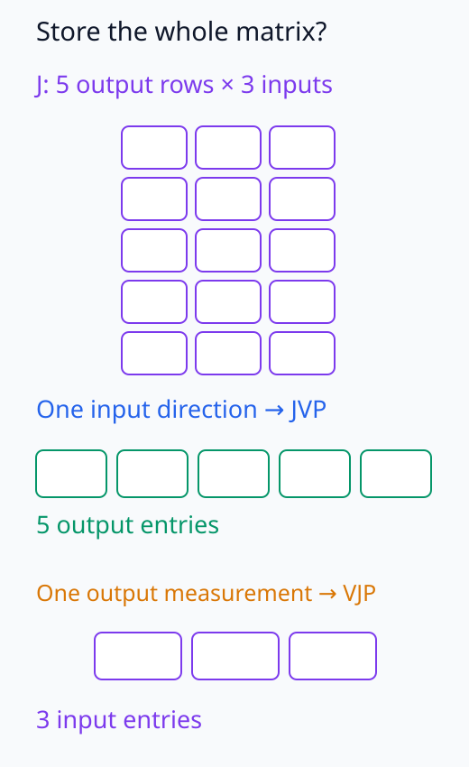

# N05-10. autograd, JVP와 VJP

## 이 단원이 필요한 이유

full Jacobian은 입력과 출력 차원을 모두 펼친다. 실제 신경망 분석은 Jacobian 자체보다 특정 입력 방향을 보낸 JVP나 특정 출력 방향을 당겨 온 VJP를 자주 계산한다. backpropagation은 scalar loss의 VJP다.

이 단원은 $\mathbb R^2\to\mathbb R^2$ 함수의 Jacobian을 손으로 구하고 `torch.func`의 JVP·VJP와 대조한다. 이어서 N05-01~10의 tensor, forward, loss, backward와 update를 한 흐름으로 점검한다.

## 학습 목표

- Jacobian의 row와 column 의미를 설명할 수 있다.
- 입력 tangent에서 JVP를 계산할 수 있다.
- 출력 cotangent에서 VJP를 계산할 수 있다.
- forward mode와 reverse mode의 선택 기준을 설명할 수 있다.
- N05-01~10의 계산 단계를 하나의 학습 loop로 연결할 수 있다.

## 선수지식 확인

- 선수 단원: [N05-09 PyTorch tensor, shape와 dtype](N05-09-pytorch-tensor-shape-dtype.md)
- 선수 단원: [M03-13 JVP와 VJP](../../part-1-foundations/M03/M03-13-jvp-vjp.md)
- 확인 질문: $2\times2$ matrix와 vector의 곱을 계산할 수 있는가?
- 확인 질문: gradient가 scalar-output 함수의 derivative임을 설명할 수 있는가?

## 기호와 용어

| 기호·용어 | Common spoken reading | 의미 | shape·범위 |
|---|---|---|---|
| $f$ | `f` | vector-valued function | $\mathbb R^n\to\mathbb R^m$ |
| $J_f(\mathbf x)$ | `the Jacobian of f at x` | input 변화와 output 변화를 잇는 derivative matrix | $\mathbb R^{m\times n}$ |
| $\mathbf r$ | `r` | input tangent direction | $\mathbb R^n$ |
| $J_f\mathbf r$ | `J f times r` | Jacobian-vector product, JVP | $\mathbb R^m$ |
| $\mathbf u$ | `u` | output cotangent | $\mathbb R^m$ |
| $\mathbf u^\top J_f$ | `u transpose times J f` | vector-Jacobian product, VJP | $\mathbb R^n$ |
| autograd | `automatic differentiation` | 계산 그래프에서 derivative product를 계산하는 체계 | framework 기능 |

## 핵심 개념 1. Jacobian은 모든 일차 민감도를 모은다

$f:\mathbb R^n\to\mathbb R^m$의 Jacobian은

\[
J_f(\mathbf x)_{ij}=\frac{\partial f_i}{\partial x_j}
\]

이다. row $i$는 output $f_i$의 input gradient이고 column $j$는 input $x_j$ 방향이 모든 output에 미치는 일차 변화를 모은다.

미분 가능한 현재 점에서는 $f(\mathbf x+\Delta\mathbf x)-f(\mathbf x)\approx J_f(\mathbf x)\Delta\mathbf x$다. 각 row에서 input 성분의 변화량에 해당 편미분을 곱해 더한다. 그래서 input index는 합으로 사라지고 output index가 남는다. Jacobian은 함수값을 모은 matrix가 아니라 그 평가점에서의 변화 계수를 모은 matrix다.

## 핵심 개념 2. JVP는 입력 방향을 앞으로 보낸다

입력 tangent $\mathbf r$에 대한 JVP는

\[
J_f(\mathbf x)\mathbf r
\]

이다. input dimension에서 시작해 output dimension의 directional derivative를 얻는다. input 방향이 적고 output이 많을 때 forward-mode product가 유용하다.

입력을 $\mathbf x+\varepsilon\mathbf r$로 움직이고 $\varepsilon=0$에서 미분하면 $\left.d f(\mathbf x+\varepsilon\mathbf r)/d\varepsilon\right|_{\varepsilon=0}=J_f(\mathbf x)\mathbf r$다. $\mathbf r$의 여러 성분을 동시에 움직인 효과를 한 번에 더한다. $\mathbf r$을 두 배로 하면 JVP도 두 배가 되므로 방향만 비교하려면 길이 조건도 맞춰야 한다. 좌표축 방향을 하나씩 넣으면 Jacobian의 각 column을 얻지만, 관심 방향 하나의 계산에 모든 column을 저장할 필요는 없다.

## 핵심 개념 3. VJP는 출력 방향을 뒤로 당긴다

output cotangent $\mathbf u$에 대한 VJP는

\[
\mathbf u^\top J_f(\mathbf x)
\]

이다. output의 scalar combination $\mathbf u^\top f(\mathbf x)$을 input으로 미분한 gradient와 같다. scalar loss에서는 $m=1$이므로 reverse mode 한 번으로 많은 parameter의 gradient를 얻는다.

여기서 $\mathbf u$는 미분 중 고정한 출력 가중치다. 각 output row의 미분값을 $u_i$로 가중해 더하면 input 성분별 계수가 남는다. 행 형태의 미분을 쓰면 $\mathbf u^\top J_f$, gradient를 열벡터로 쓰면 $J_f^\top\mathbf u$다. 둘은 같은 계수를 다른 방향으로 배열한 표기이며 framework가 같은 input shape로 반환하는 gradient와 대응한다.

특정 output 하나를 고르면 그 위치만 1인 $\mathbf u$를 사용한다. 두 output의 차이를 고르면 해당 위치의 가중치를 1과 $-1$로 둔다. 즉 VJP는 output vector를 입력 변화로 역변환하는 연산이 아니라, 선택한 scalar 측정의 미분을 input으로 전달하는 연산이다.

## 예제 1. Jacobian 손계산

\[
f(x_1,x_2)=
\begin{bmatrix}
x_1x_2\\
x_1^2+x_2
\end{bmatrix}
\]

라 하자. Jacobian은

\[
J_f(x_1,x_2)=
\begin{bmatrix}
x_2&x_1\\
2x_1&1
\end{bmatrix}
\]

이다. $(x_1,x_2)=(2,3)$에서는 output $(6,7)$과

\[
J_f=\begin{bmatrix}3&2\\4&1\end{bmatrix}
\]

를 얻는다.

아래 행렬 그림에서는 출력 row와 입력 column이 묶는 민감도를 구분한다.

<figure class="lesson-figure" markdown="1">

<figcaption>평가점 (2, 3)에서 출력 row와 입력 column을 분리했다. 첫 column의 (3, 4)는 x₁만 조금 움직일 때 두 output의 일차 변화율이고, 첫 row의 (3, 2)는 f₁의 두 입력 민감도다.</figcaption>
</figure>

## 예제 2. JVP와 VJP

$\mathbf r=(1,-1)$이면

\[
J_f\mathbf r=(1,3)
\]

이다. $\mathbf u=(2,-1)$이면

\[
\mathbf u^\top J_f=(2,3)
\]

이다. 두 vector가 우연히 비슷한 숫자를 가져도 서로 다른 공간과 방향을 나타낸다.

아래 좌표 그림에서는 입력 경로에 대응하는 실제 output 경로와 접선을 비교한다.

<figure class="lesson-figure" markdown="1">

<figcaption>입력을 (2, 3) + ε(1, −1)로 움직인 실제 output 경로와 ε = 0에서의 접선이다. 접선의 ε당 변화는 JVP (1, 3)이며, 실제 경로에는 (−ε², ε²)가 더해져 유한 이동에서 차이가 난다.</figcaption>
</figure>

이어지는 벡터 그림에서는 입력 방향의 두 성분이 가중한 Jacobian column을 더한다.

<figure class="lesson-figure" markdown="1">

<figcaption>첫 column (3, 4)을 1배, 둘째 column (2, 1)을 −1배 한 뒤 head-to-tail로 더했다. 이 좌표축은 output 변화율 성분이며 원래 입력점이나 output 함수값의 위치가 아니다.</figcaption>
</figure>

아래 도식에서는 고정한 scalar 측정의 미분이 input으로 전달되는 과정을 따라간다.

<figure class="lesson-figure" markdown="1">

<figcaption>u = (2, −1)를 고정하면 선택한 scalar는 2f₁ − f₂다. 예제의 점에서 output row를 각각 가중해 (6, 4)와 (−4, −1)을 얻고, input 위치별로 더해 (2, 3)을 만든다. output 값을 역변환한 것이 아니다.</figcaption>
</figure>

아래 두 경로 도식에서는 앞으로 보내는 경로와 뒤로 당기는 경로의 scalar 측정값을 대조한다.

<figure class="lesson-figure" markdown="1">

<figcaption>위 경로는 입력 방향을 output으로 보낸 뒤 u로 측정하고, 아래 경로는 u를 input 미분으로 당겨 온 뒤 r로 측정한다. 두 결과는 모두 scalar −1이다. 중간 vector가 같은 공간에 있거나 서로 inverse라는 뜻은 아니다.</figcaption>
</figure>

## 실행 실습

### 실행 환경과 원본

- 환경: Python 3.12, PyTorch 2.13.0 CPU, NumPy 2.5.3
- 확인일: 2026-10-01
- 구성요소 등급: JVP·VJP 수학은 `Stable core`, `torch.func` API는 framework interface
- 예제 ID: `n05_10_jvp_vjp`
- 코드 원본: `labs/N05/n05_10_jvp_vjp.py`
- 테스트: `tests/N05/test_n05_10.py`
- 실행 명령: `.venv\Scripts\python.exe -m labs.N05.n05_10_jvp_vjp`

### 자원 예산

예제는 2차원 input과 output만 사용한다. full Jacobian은 원소 4개이며 parameter와 training step은 0이다. hard timeout은 10초다.

### 실제 코드와 실행 결과

<!-- N05_EXAMPLE: n05_10_jvp_vjp -->

### product 검사

테스트는 `jacrev`의 Jacobian을 손계산 값과 비교한다. `jvp`와 `vjp` 결과도 explicit matrix product와 각각 대조한다.

## full Jacobian을 만들지 않는 이유

input과 output이 크면 Jacobian 원소 수는 $mn$이다. JVP와 VJP는 관심 방향의 product만 계산한다. 모델 해석에서는 target logit의 input gradient, activation 방향의 출력 효과와 Hessian-vector product처럼 product 형태가 memory를 줄인다.

`torch.func`의 세부 API 상태는 framework version에 따라 바뀔 수 있다. 이 책의 CPU 환경에서는 2.13.0을 test했고, 2026-10-01에 current stable 공식 문서의 `jvp`, `vjp`와 `jacrev` 정의를 다시 확인했다.

아래 배열 그림에서는 전체 matrix와 방향별 product의 결과 위치 수를 비교한다.

<figure class="lesson-figure" markdown="1">

<figcaption>문제 1과 같은 n = 3, m = 5의 shape를 위치로 표시했다. full Jacobian은 15개 민감도를 놓지만, 방향 하나의 JVP 결과는 output 5개, 측정 하나의 VJP 결과는 input 3개다. 실제 연산 비용을 원소 수와 같다고 가정하는 그림은 아니다.</figcaption>
</figure>

## 모델 해석과의 연결

input attribution의 gradient는 선택한 scalar output에서 input으로 가는 VJP다. activation steering 방향을 다음 layer output으로 밀어 보는 local 분석은 JVP로 표현할 수 있다.

두 product는 현재 point의 local linearization이다. finite intervention이 크거나 activation이 saturation 영역을 지나면 실제 output 변화와 달라질 수 있다.

## 흔한 오해

### 오해 1. JVP와 VJP는 transpose 표기만 다른 같은 vector다

JVP는 input-space vector를 output space로 보내고 VJP는 output-space covector를 input 쪽으로 당긴다. input과 output dimension이 다르면 shape부터 다르다.

### 오해 2. autograd는 symbolic derivative 식을 항상 만든다

PyTorch는 실행한 tensor 연산의 graph와 derivative rule을 사용해 수치 product를 계산한다. full symbolic 식이나 full Jacobian을 자동으로 저장한다는 뜻이 아니다.

### 오해 3. gradient 방향의 intervention은 실제 변화와 정확히 같다

gradient는 작은 변화의 일차 근사다. finite step에는 curvature와 다른 경로의 nonlinear effect가 들어간다.

## 연습문제

### 1. Jacobian shape

$f:\mathbb R^3\to\mathbb R^5$의 Jacobian, JVP와 VJP shape를 적어라.

해설 보기

Jacobian은 $(5,3)$, JVP는 길이 5, VJP는 길이 3이다.

### 2. JVP 계산

$J=\begin{bmatrix}1&2\\3&4\end{bmatrix}$, $r=(2,-1)$일 때 $Jr$을 구하라.

해설 보기

$(1\cdot2+2(-1),3\cdot2+4(-1))=(0,2)$다.

### 3. VJP 계산

앞의 $J$와 $u=(1,-1)$에 대해 $u^\top J$를 구하라.

해설 보기

$(1,-1)J=(-2,-2)$다.

### 4. mode 선택

scalar loss와 parameter 백만 개의 gradient를 구할 때 reverse mode가 적합한 이유를 설명하라.

해설 보기

output dimension이 1이므로 VJP 한 번으로 모든 parameter 방향의 gradient를 얻는다. full Jacobian row를 따로 만들 필요가 없다.

### 5. target 선택

언어 모델에서 어느 scalar를 backward 시작점으로 기록해야 gradient attribution을 재현할 수 있는가?

해설 보기

target token logit, 두 token의 logit difference 또는 loss처럼 선택한 scalar를 명시해야 한다. 서로 다른 target은 다른 VJP를 만든다.

### 6. 주장 비판

JVP가 큰 방향은 큰 finite intervention에서도 가장 큰 output 변화를 준다는 결론을 평가하라.

해설 보기

JVP는 현재 point의 local derivative다. step 크기, curvature와 경로 변화 때문에 finite intervention 순위가 달라질 수 있다.

## N05-01~10 누적 확인과제

다음 순서를 하나의 계산 기록으로 작성한다.

1. batch 2인 affine model의 tensor shape와 dtype을 선언한다.
2. forward prediction과 mean cross-entropy 또는 squared-error loss를 계산한다.
3. 계산 그래프에서 loss까지의 의존경로를 그린다.
4. parameter gradient를 손계산과 autograd로 대조한다.
5. learning rate를 적용해 한 step 갱신한다.
6. momentum 또는 AdamW를 선택하고 저장할 optimizer state를 적는다.
7. input tangent 하나의 JVP 또는 output cotangent 하나의 VJP를 계산한다.
8. 관찰한 gradient를 인과 효과로 확대하지 않고 주장 범위를 적는다.

통과 기록에는 code 실행, 수치 assertion, shape assertion과 해석 문장을 분리한다.

## 근거와 단계 검토

- [torch.func API](https://docs.pytorch.org/docs/stable/func.api.html)의 JVP·VJP·`jacrev` 정의를 확인했다.
- N05-01~10의 tensor, activation, loss, backpropagation, mini-batch와 optimizer state는 `Stable core` 분류를 유지한다.
- framework API와 kernel은 수학 정의와 분리한다. `torch.func`의 current stable 문서는 API 변동 가능성을 명시하므로 local pinned test를 정답 근거로 함께 보존한다.
- 이 범위는 외부 model config를 요구하지 않는다. 공개 config 비교는 Transformer component가 시작되는 N05-11 이후에 적용한다.

## 단원 요약

- Jacobian은 vector function의 모든 일차 민감도를 모은다.
- JVP는 input tangent를 output 방향 변화로 보낸다.
- VJP는 output cotangent를 input 쪽으로 당긴다.
- reverse-mode backpropagation은 scalar loss의 VJP다.
- product 계산은 full Jacobian materialization을 피한다.

## 통과 기준

- Jacobian, JVP와 VJP의 shape를 적을 수 있는가?
- 작은 함수의 두 product를 손으로 계산할 수 있는가?
- forward mode와 reverse mode를 선택할 수 있는가?
- `torch.func` 결과를 explicit product와 대조할 수 있는가?
- N05-01~10의 학습 계산을 한 흐름으로 설명할 수 있는가?

## 다음 단원

- [N05-11 token과 tokenizer](N05-11-token-tokenizer.md)

## 집필자 점검표

- [x] 학습 목표가 관찰 가능한 행동으로 작성됐다.
- [x] JVP와 VJP의 방향과 shape를 구분했다.
- [x] full Jacobian과 product 계산을 구분했다.
- [x] N05-01~10 누적 확인과제를 포함했다.
- [x] 모든 문제에 해설이 있다.
- [x] 모델 해석 주장의 강도를 구분했다.
- [x] 용어집과 표기 규칙을 따랐다.
- [x] Common spoken reading이 실제 영어 학술 발화이며 한글 음역이나 기계적 직역을 포함하지 않는다.
- [x] 선수지식 밖의 내용을 몰래 요구하지 않는다.
- [x] 내부 링크와 수식 렌더링을 확인했다.
- [x] Markdown에 실행 코드를 손으로 복제하지 않았다.
- [x] 코드 원본·테스트 경로·자원 예산·확인일을 기록했다.
- [x] shape·수치·gradient test가 있다.
