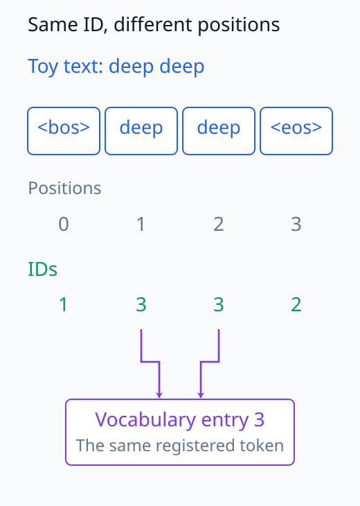
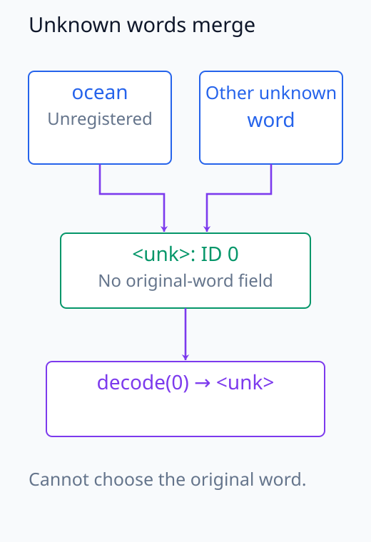
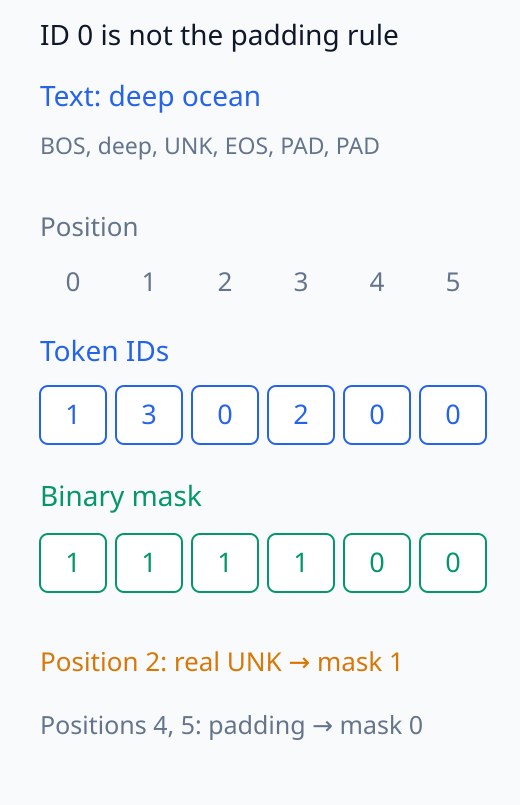
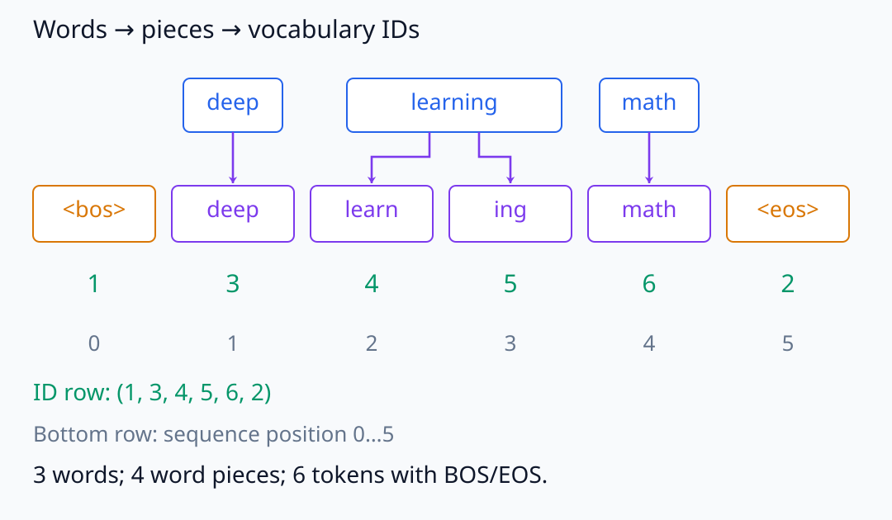
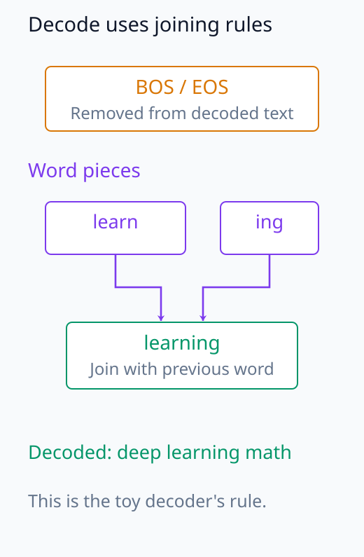

# N05-11. token과 tokenizer

## 이 단원이 필요한 이유

언어 모델은 문자열을 바로 matrix에 넣지 않는다. tokenizer가 문자열을 token sequence로 나누고 vocabulary의 integer ID로 바꾼다. 같은 문장도 tokenizer가 다르면 sequence length와 token 경계가 달라진다.

이 단원은 고정된 toy vocabulary로 `deep learning math`를 여섯 token으로 바꾼다. 실제 tokenizer의 학습 알고리즘을 재현하는 대신 segmentation, special token, unknown token과 decode의 경계를 분명히 한다.

## 학습 목표

- text, token, token ID와 vocabulary를 구분할 수 있다.
- 고정 규칙으로 문자열을 token sequence로 바꿀 수 있다.
- special token과 unknown token의 역할을 설명할 수 있다.
- token count와 character·word count가 다른 이유를 설명할 수 있다.
- token-level 분석의 결과를 문자열 수준 주장으로 확대하지 않을 수 있다.

## 선수지식 확인

- 선수 단원: [N05-10 autograd, JVP와 VJP](N05-10-autograd-jvp-vjp.md)
- 확인 질문: sequence의 position과 token ID를 구분할 수 있는가?
- 확인 질문: finite set의 원소를 integer index에 대응시킬 수 있는가?

## 기호와 용어

| 기호·용어 | Common spoken reading | 의미 | shape·범위 |
|---|---|---|---|
| $\mathcal V$ | `script V` | tokenizer vocabulary | finite set |
| $V$ | `V` | vocabulary size | $V=\lvert\mathcal V\rvert$ |
| $t_i$ | `t sub i` | position $i$의 token | $t_i\in\mathcal V$ |
| $a_i$ | `a sub i` | token $t_i$의 integer ID | $\{0,\ldots,V-1\}$ |
| $T$ | `T` | token sequence length | positive integer |
| attention mask | `attention mask` | 실제 token과 padding 위치를 구분하는 indicator | $\{0,1\}^T$ |

## 핵심 개념 1. tokenizer는 문자열과 ID 사이의 규칙이다

encoder를

\[
\operatorname{encode}(s)=(a_1,\ldots,a_T)
\]

로 쓴다. $T$는 문자열 길이와 같지 않다. 자주 쓰는 문자열 조각은 한 token이 되고 낯선 문자열은 여러 token으로 나뉠 수 있다.

decode는 ID를 token 문자열로 바꾼 뒤 tokenizer 규칙에 따라 합친다. normalization과 unknown mapping 때문에 모든 tokenizer에서 완전한 역함수가 보장되는 것은 아니다.

문자열을 조각으로 나누는 segmentation과 각 조각을 ID로 바꾸는 조회는 다른 단계다. token $t_i$는 vocabulary에 등록된 조각이고 $a_i$는 그 조각의 row 번호이며, $i$는 이번 sequence 안의 위치다. 같은 token이 두 번 나타나면 ID는 같아도 위치는 다르다. vocabulary의 ID 번호를 일관되게 바꾸어도 segmentation 자체는 바뀌지 않는다.

ID에서 등록된 token을 찾는 것은 가능해도 입력 문자열까지 되돌리는 것은 별도 문제다. 서로 다른 미등록 조각을 같은 `<unk>`로 보내면 이미 구분 정보가 사라진다. 따라서 encode와 decode를 서로 반대 방향으로 수행한다는 사실만으로 원문 복원을 보장하지 않는다.

아래 그림에서는 두 position이 같은 vocabulary entry를 가리키는 관계를 본다.

<figure class="lesson-figure" markdown="1">

<figcaption>본문의 반복 token 구분을 deep deep으로 표시했다. BOS 뒤 두 deep은 position 1과 2에 있지만 vocabulary ID는 모두 3이다. 위치는 sequence의 자리, ID는 table에서 찾을 row 번호다.</figcaption>
</figure>

아래 합류 도식에서는 미등록 문자열의 구분 정보가 사라지는 합류 지점을 본다.

<figure class="lesson-figure" markdown="1">

<figcaption>ocean과 다른 미등록 word는 모두 같은 unknown 표시로 합쳐진다. ID 0에서 등록된 token인 &lt;unk&gt;를 찾을 수는 있지만 어느 원문 word였는지는 고를 수 없다.</figcaption>
</figure>

## 핵심 개념 2. special token도 vocabulary 원소다

`<bos>`와 `<eos>`는 sequence 경계를 표시한다. `<unk>`는 vocabulary에 없는 조각을 나타낸다. 모델은 이 token도 다른 token처럼 ID로 받고 embedding row를 조회한다.

padding과 attention mask는 별도 개념이다. padding ID가 존재해도 mask가 어떤 position을 계산에서 제외할지 정한다. decoder-only model은 padding token을 정의하지 않는 경우도 있다.

BOS와 EOS는 원문의 단어 수와 별개로 sequence 위치를 차지한다. ID sequence의 길이를 셀 때는 이 위치도 포함하며, special token을 제거하는 decode에서는 그 문자열을 원문에 붙이지 않을 수 있다. `<unk>` 역시 미등록 문자열을 담아 두는 공간이 아니라 그 조각을 구분할 수 없다는 표시다.

길이가 다른 sequence를 같은 길이의 batch로 만들면 짧은 sequence 뒤에 padding ID를 넣을 수 있다. 이 단원의 binary mask에서는 실제 위치에 1, padding 위치에 0을 두어 길이와 유효 위치를 따로 표현한다. ID의 값이 0이라서 mask가 0인 것은 아니다. 이 mask는 실제 token 여부를 표시하며, 뒤에서 배우는 causal mask의 과거/미래 허용 관계와도 구분한다.

아래 위치별 배열에서는 같은 ID 0에 서로 다른 mask 값이 붙는 위치를 비교한다.

<figure class="lesson-figure" markdown="1">

<figcaption>toy의 deep ocean을 길이 6으로 맞추면서 padding ID로 0을 쓴 경우다. 실제 &lt;unk&gt; position 2도 ID 0이지만 mask는 1이다. 마지막 두 padding position은 ID가 같아도 mask 0이며, 과거/미래 causal 관계를 표시한 mask가 아니다.</figcaption>
</figure>

## 예제. 고정 vocabulary로 encoding

toy vocabulary를 다음처럼 둔다.

| token | ID |
|---|---:|
| `<unk>` | 0 |
| `<bos>` | 1 |
| `<eos>` | 2 |
| `deep` | 3 |
| `learn` | 4 |
| `ing` | 5 |
| `math` | 6 |

`learning`을 `learn`, `ing`으로 나누는 고정 규칙을 적용하면

\[
(\texttt{<bos>},\texttt{deep},\texttt{learn},\texttt{ing},\texttt{math},\texttt{<eos>})
\]

와 ID $(1,3,4,5,6,2)$를 얻는다. attention mask는 여섯 위치 모두 1이다.

아래 그림에서는 word 경계와 token·ID·position의 대응을 따라간다.

<figure class="lesson-figure lesson-figure--wide" markdown="1">

<figcaption>위의 원문 word에서 가운데 token으로 내려간다. learning은 두 조각으로 갈라지고 BOS/EOS가 양끝 position을 차지해 길이는 6이다. token 아래 첫 숫자는 vocabulary ID, 둘째 숫자는 이번 sequence의 0-based position이다.</figcaption>
</figure>

아래 decode 그림에서는 special token 처리와 조각 결합을 분리해 본다.

<figure class="lesson-figure" markdown="1">

<figcaption>이 toy decoder는 BOS/EOS를 제거하고 ing를 직전 word에 붙인다. encode 예제의 learn과 ing가 learning이 되지만, 이는 이 tokenizer의 결합 규칙이며 모든 tokenizer의 원문 복원 보장을 뜻하지 않는다.</figcaption>
</figure>

## 실행 실습

### 실행 환경과 원본

- 환경: Python 3.12, PyTorch 2.13.0 CPU, NumPy 2.5.3
- 확인일: 2026-10-01
- 구성요소 등급: `Stable core`; toy segmentation은 `Instructional reference`
- 예제 ID: `n05_11_toy_tokenizer`
- 코드 원본: `labs/N05/n05_11_toy_tokenizer.py`
- 테스트: `tests/N05/test_n05_11.py`
- 실행 명령: `.venv\Scripts\python.exe -m labs.N05.n05_11_toy_tokenizer`

### 자원 예산

vocabulary 7개, sequence length 6과 batch 1을 사용한다. model parameter와 training step은 0이다.

### 실제 코드와 실행 결과

<!-- N05_EXAMPLE: n05_11_toy_tokenizer -->

### 검사

테스트는 segmentation, ID, decode와 unknown token을 확인한다. toy 규칙은 BPE나 unigram tokenizer 학습을 흉내 내지 않는다.

## 공개 모델과의 대조

Pythia 공개 tokenizer config는 GPT-NeoX tokenizer를 가리키고 `<|endoftext|>`를 BOS, EOS와 unknown token으로 설정한다. 이 사실은 toy vocabulary의 special token 선택을 정당화하지 않는다. 같은 역할도 model family마다 ID와 문자열이 다르므로 model의 tokenizer artifact를 함께 고정해야 한다.

## 모델 해석과의 연결

token activation을 비교하려면 text span과 token position의 대응을 저장해야 한다. 두 tokenizer에서 position 5는 다른 문자열 조각을 나타낼 수 있다.

한 token의 attribution을 단어 전체의 attribution으로 합칠 때 aggregation rule이 필요하다. subword 수가 다른 표현을 단순 합이나 평균으로 비교하면 estimand가 달라진다.

## 흔한 오해

### 오해 1. token은 단어다

token은 tokenizer vocabulary의 원소다. 한 단어가 여러 token으로 나뉘거나 공백·구두점이 token 일부에 포함될 수 있다.

### 오해 2. token ID의 크기에 의미가 있다

ID는 vocabulary row를 찾는 index다. ID 6이 ID 3보다 의미가 크다는 순서 관계는 없다.

### 오해 3. decode는 항상 원문을 복원한다

normalization, unknown mapping과 special token 처리에 따라 정보가 사라질 수 있다.

## 연습문제

### 1. 길이

예제 문장의 word 수와 special token을 포함한 token 수를 적어라.

해설 보기

word는 3개이고 token은 6개다. `learning`이 둘로 갈라지고 BOS·EOS가 추가됐다.

### 2. unknown token

toy tokenizer로 `deep ocean`을 encode하면 token은 무엇인가?

해설 보기

`<bos>`, `deep`, `<unk>`, `<eos>`다.

### 3. ID 의미

token ID에 Euclidean distance를 적용해 의미 유사도를 판단해도 되는가?

해설 보기

안 된다. ID는 범주 index다. 의미 유사도는 embedding이나 다른 representation에서 정의해야 한다.

### 4. mask

padding 두 위치를 붙여 length 8로 만들면 attention mask의 마지막 두 값은 무엇인가?

해설 보기

padding을 제외하는 convention에서는 0, 0이다. 앞의 실제 token 위치는 1이다.

### 5. 재현성

model weight만 공개하고 tokenizer files를 공개하지 않으면 어떤 문제가 생기는가?

해설 보기

문자열을 같은 ID sequence로 바꾸지 못해 입력과 출력 token의 의미를 재현할 수 없다.

### 6. 주장 비판

두 prompt가 같은 token 수이므로 같은 언어 구조를 가진다는 결론을 평가하라.

해설 보기

token 수는 tokenizer segmentation의 결과다. 구문과 의미의 동일성을 보장하지 않는다.

## 단원 요약

- tokenizer는 text를 vocabulary token과 ID sequence로 바꾼다.
- token 경계는 word나 character 경계와 같지 않다.
- special token과 unknown token도 vocabulary row를 가진다.
- tokenizer artifact는 model 입력 재현에 필요하다.
- token-level 해석에는 text span 대응이 필요하다.

## 통과 기준

- text, token과 ID를 구분할 수 있는가?
- toy example을 encode하고 decode할 수 있는가?
- special token과 mask를 구분할 수 있는가?
- tokenizer가 분석 단위를 바꾸는 이유를 설명할 수 있는가?
- token 수에 근거한 과도한 주장을 비판할 수 있는가?

## 다음 단원

- [N05-12 embedding과 unembedding](N05-12-embedding-unembedding.md)

## 집필자 점검표

- [x] 학습 목표가 관찰 가능한 행동으로 작성됐다.
- [x] text, token, ID와 position을 구분했다.
- [x] toy tokenizer의 한계를 명시했다.
- [x] 모든 문제에 해설이 있다.
- [x] 모델 해석 주장의 강도를 구분했다.
- [x] 용어집과 표기 규칙을 따랐다.
- [x] Common spoken reading이 실제 영어 학술 발화이며 한글 음역이나 기계적 직역을 포함하지 않는다.
- [x] 선수지식 밖의 내용을 몰래 요구하지 않는다.
- [x] 내부 링크와 수식 렌더링을 확인했다.
- [x] Markdown에 실행 코드를 손으로 복제하지 않았다.
- [x] 코드 원본·테스트 경로·자원 예산·확인일을 기록했다.
- [x] shape·수치·gradient test가 있다.
