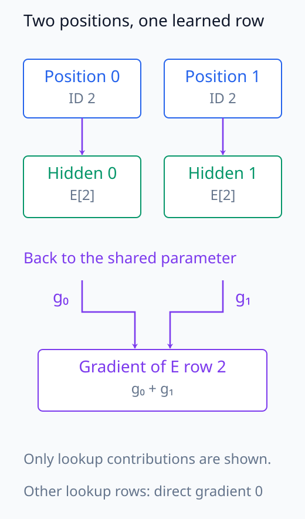
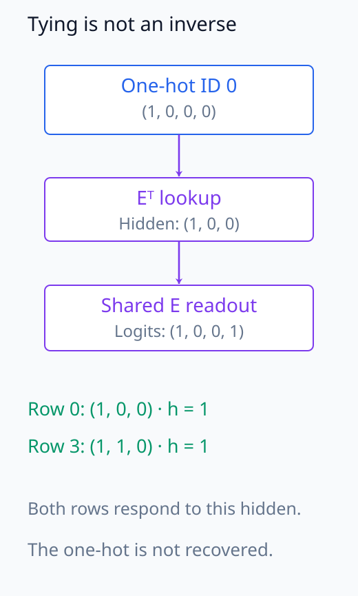
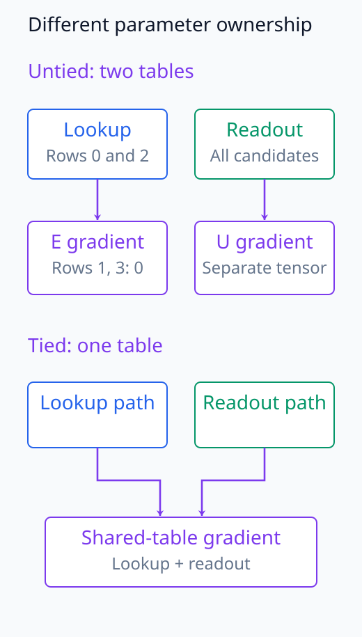
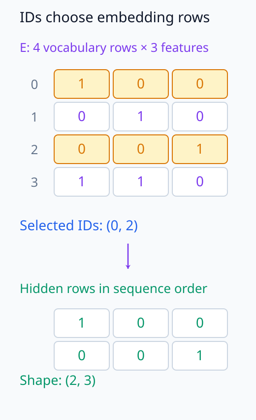
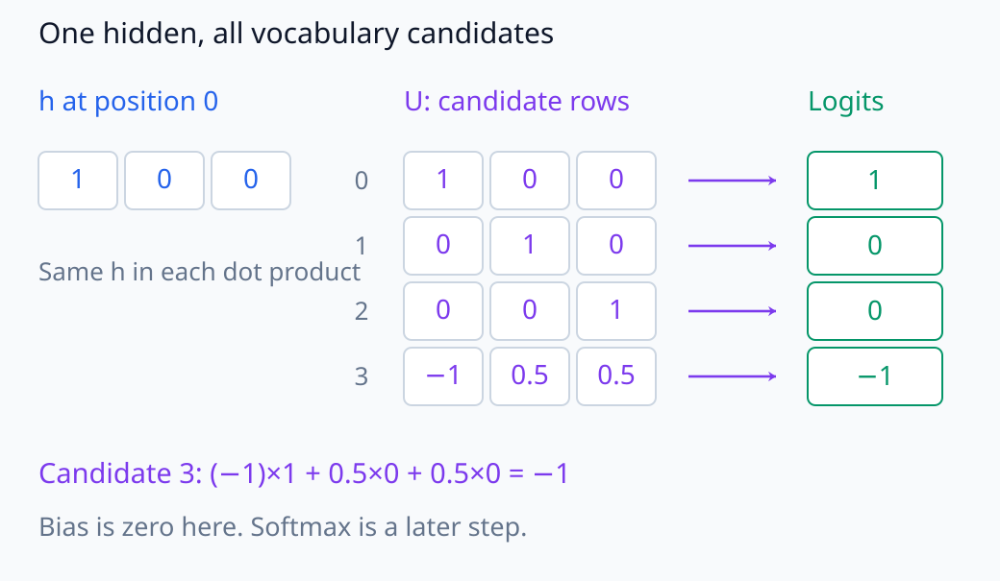
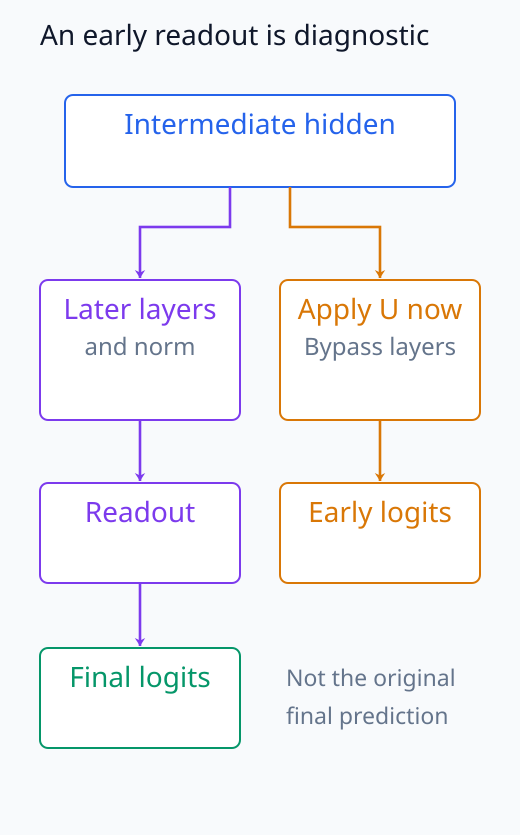

# N05-12. embedding과 unembedding

## 이 단원이 필요한 이유

token ID는 범주 index다. embedding table은 각 ID를 연속 vector로 바꾸고, unembedding은 마지막 hidden vector를 vocabulary logit으로 바꾼다. 두 행렬의 row와 column을 정확히 알아야 token별 activation과 logit을 연결할 수 있다.

## 학습 목표

- token ID lookup을 embedding matrix의 row 선택으로 표현할 수 있다.
- embedding과 unembedding의 shape를 검산할 수 있다.
- hidden state에서 vocabulary logit을 계산할 수 있다.
- weight tying과 untied weight를 구분할 수 있다.
- 선택된 embedding row의 gradient sparsity를 설명할 수 있다.

## 선수지식 확인

- 선수 단원: [N05-11 token과 tokenizer](N05-11-token-tokenizer.md)
- 확인 질문: integer index로 matrix row를 선택할 수 있는가?
- 확인 질문: $(T,d)(d,V)$의 결과 shape를 구할 수 있는가?

## 기호와 용어

| 기호·용어 | Common spoken reading | 의미 | shape·범위 |
|---|---|---|---|
| $\mathbf E$ | `E` | embedding matrix | $\mathbb R^{V\times d}$ |
| $a_t$ | `a sub t` | position $t$의 token ID | $\{0,\ldots,V-1\}$ |
| $\mathbf h_t$ | `h sub t` | token embedding 또는 hidden state | $\mathbb R^d$ |
| $\mathbf U$ | `U` | unembedding matrix | $\mathbb R^{V\times d}$ |
| $\mathbf z_t$ | `z sub t` | vocabulary logit vector | $\mathbb R^V$ |
| weight tying | `weight tying` | $\mathbf U$와 $\mathbf E$가 parameter를 공유하는 선택 | architecture option |

## 핵심 개념 1. embedding은 row lookup이다

token ID $a_t$의 embedding은

\[
\mathbf h_t=\mathbf E[a_t]
\]

이다. sequence ID tensor가 $(B,T)$이면 embedding output은 $(B,T,d)$다. ID의 숫자 크기는 vector 크기나 의미 순서를 나타내지 않는다.

길이 $V$의 one-hot vector $\mathbf e_{a_t}$를 ID $a_t$ 위치만 1로 두면, 열벡터 표기에서 lookup은 $\mathbf h_t=\mathbf E^\top\mathbf e_{a_t}$와 같다. 다만 실제로 one-hot 전체를 만들 필요 없이 해당 row를 고르면 된다. ID 숫자를 weight에 곱하는 연산이 아니라 범주 하나를 선택하는 연산이다. 같은 ID는 이 단계에서 같은 row를 받으며 문맥에 따른 변화는 이후 계산에서 생긴다.

lookup 경로에서 선택되지 않은 row는 출력에 들어가지 않아 직접 gradient가 0이다. 같은 ID가 여러 위치에 있으면 각 위치에서 돌아온 gradient를 하나의 row에 더한다. 위치마다 activation은 별도로 존재하지만 학습 parameter는 공유된 row 하나다.

아래 그림에서는 서로 다른 hidden 위치의 gradient가 하나의 lookup row로 합쳐지는 지점을 본다.

<figure class="lesson-figure" markdown="1">

<figcaption>같은 ID 2가 두 position에 있다고 하자. 각 position의 hidden은 따로 존재하지만 lookup parameter는 E의 row 2 하나다. 돌아온 두 gradient는 그 row에서 합쳐지고, 다른 row의 직접 lookup 기여는 0이다.</figcaption>
</figure>

## 핵심 개념 2. unembedding은 hidden을 logit으로 보낸다

\[
\mathbf z_t=\mathbf U\mathbf h_t+\mathbf b
\]

이며 row-batch 표기에서는 $\mathbf H\mathbf U^\top+\mathbf b$다. output의 마지막 axis 길이는 vocabulary size $V$다. softmax는 그다음에 적용한다.

$\mathbf b\in\mathbb R^V$이고 token 후보 $k$의 점수는 $z_{tk}=\sum_{j=1}^d U_{kj}h_{tj}+b_k$다. hidden 성분 $j$를 합하고 vocabulary 후보 $k$를 남긴다. embedding이 ID 하나로 row 하나를 고른다면 unembedding은 같은 hidden을 모든 후보의 row와 비교해 점수 $V$개를 만든다. 점수는 확률도 원문 token의 복원 결과도 아니다.

embedding 뒤의 hidden은 여러 층에서 변할 수 있고 unembedding도 별도로 학습될 수 있다. 이름의 접두사가 반대여도 두 계산이 서로의 역함수라는 뜻은 아니다. 심지어 $\mathbf U=\mathbf E$여도 bias와 중간층을 제외하고 두 map을 바로 합친 결과는 $\mathbf E\mathbf E^\top\mathbf e_{a_t}$다. 이는 row 사이의 dot product를 모은 값이지 일반적으로 원래 one-hot을 돌려주는 identity map이 아니다.

아래 합성 경로에서는 같은 table을 두 번 사용해도 one-hot이 복원되지 않는 이유를 실제 row로 확인한다.

<figure class="lesson-figure" markdown="1">

<figcaption>실습 E를 U로도 사용하는 tying 비교이며 bias와 중간층을 제외했다. E row 0과 row 3 모두 첫 성분이 1이므로 hidden (1, 0, 0)은 두 후보에 logit 1을 준다. 원래 one-hot (1, 0, 0, 0)으로 돌아오지 않는다.</figcaption>
</figure>

## 핵심 개념 3. tying은 공유 선택이다

weight tying은 보통 unembedding weight를 embedding weight와 공유한다. shape가 같다는 사실만으로 parameter가 자동 공유되지는 않는다. Pythia 공개 config는 `tie_word_embeddings: false`를 사용하므로 두 weight를 구분한다.

두 독립 parameter에 같은 초기 숫자를 넣는 것과 하나의 parameter를 두 위치에서 사용하는 것은 다르다. 독립 parameter는 서로 다른 gradient로 값이 갈라질 수 있다. tying에서는 입력 lookup과 출력 점수 계산에서 돌아온 gradient를 같은 table에 누적한다. bias를 제외한 weight 원소 수는 untied의 $2Vd$에서 tied의 $Vd$로 줄어든다.

입력 batch에서 등장하지 않은 token도 출력 vocabulary 후보에는 포함된다. 따라서 tied table에서는 해당 row의 lookup gradient가 0이어도 unembedding 경로의 gradient가 남을 수 있다. 선택된 row에만 직접 gradient가 모인다는 설명은 lookup 경로에 한정하며, 공유 table의 전체 gradient나 optimizer update와 혼동하지 않는다.

아래 두 경로 도식에서는 gradient가 누적되는 parameter의 소유권을 비교한다.

<figure class="lesson-figure" markdown="1">

<figcaption>윗부분은 같은 shape여도 서로 다른 parameter를 쓰는 untied 경로다. 아랫부분은 하나의 table로 두 경로의 gradient가 합쳐진다. 입력에서 쓰지 않은 row도 출력 후보에는 있으므로 공유 table의 gradient가 반드시 0인 것은 아니다.</figcaption>
</figure>

## 예제

$V=4$, $d=3$인 table에서 ID $(0,2)$를 고르면 embedding row 0과 2가 hidden이 된다. 실습의 unembedding을 적용한 logit은

\[
\begin{bmatrix}1&0&0&-1\\0&0&1&0.5\end{bmatrix}
\]

이다. shape는 $(2,4)$다. 이 실습은 embedding과 unembedding을 공유하지 않고 table의 다른 사용 경로도 두지 않는다. 따라서 target loss를 backward하면 선택되지 않은 embedding row 1과 3의 gradient는 0이다.

아래 lookup 그림에서는 ID 두 개가 고른 table row와 sequence 위치를 연결한다.

<figure class="lesson-figure" markdown="1">

<figcaption>ID (0, 2)가 선택한 row를 주황색으로 표시했다. 아래 hidden의 첫 position은 E의 row 0, 둘째 position은 row 2다. ID 2를 row에 곱한 것이 아니라 row의 세 성분을 함께 골랐다.</figcaption>
</figure>

이어지는 readout 그림에서는 같은 hidden이 모든 vocabulary 후보에 점수를 주는 과정을 본다.

<figure class="lesson-figure lesson-figure--wide" markdown="1">

<figcaption>실습의 첫 hidden (1, 0, 0)을 모든 U row에 같은 방식으로 넣는다. 각 row는 vocabulary 후보 하나이고, feature 세 위치를 합해 logit 하나를 만든다. 이 네 숫자는 확률이 아니다.</figcaption>
</figure>

## 실행 실습

### 실행 환경과 원본

- 환경: Python 3.12, PyTorch 2.13.0 CPU, NumPy 2.5.3
- 확인일: 2026-10-01
- 구성요소 등급: `Stable core`; tying은 architecture option
- 예제 ID: `n05_12_embedding_unembedding`
- 코드 원본: `labs/N05/n05_12_embedding_unembedding.py`
- 테스트: `tests/N05/test_n05_12.py`
- 실행 명령: `.venv\Scripts\python.exe -m labs.N05.n05_12_embedding_unembedding`

### 자원 예산

vocabulary 4, sequence length 2, model dimension 3과 parameter 28개를 사용한다. training update는 없다.

### 실제 코드와 실행 결과

<!-- N05_EXAMPLE: n05_12_embedding_unembedding -->

### 검사

테스트는 lookup row, logit shape, probability 합과 embedding gradient row를 확인한다.

## 모델 해석과의 연결

embedding geometry는 입력 table의 vector 관계를 나타낸다. residual stream의 후반 representation과 같은 공간이라고 단정하려면 basis와 transform을 확인해야 한다.

logit lens는 intermediate hidden에 unembedding을 적용한다. 원래 model이 그 지점에서 직접 token을 예측했다는 뜻은 아니며 normalization과 후속 layer를 생략한 diagnostic이다.

아래 branch 그림에서는 diagnostic이 생략한 원래 forward 경로를 확인한다.

<figure class="lesson-figure" markdown="1">

<figcaption>왼쪽은 intermediate hidden이 후속 layer를 거쳐 최종 readout에 도달하는 원래 경로다. 오른쪽은 같은 지점에 U를 직접 적용하는 diagnostic branch다. 후속 layer와 normalization을 생략한 early logit이 원래 forward의 결정 완료를 뜻하지 않는다.</figcaption>
</figure>

## 흔한 오해

### 오해 1. embedding ID가 가까우면 의미도 가깝다

ID는 row index다. vector distance는 embedding row에서 계산한다.

### 오해 2. unembedding은 embedding의 역함수다

unembedding은 hidden을 logit으로 보내는 learned linear map이다. 일반적인 matrix inverse가 아니다.

### 오해 3. shape가 같으면 weight가 공유된다

parameter object를 공유하도록 구현하거나 config로 tying해야 한다.

## 연습문제

### 1. shape

$V=100$, $d=16$, ID batch shape가 `(2,5)`일 때 embedding output shape는?

해설 보기

`(2,5,16)`이다.

### 2. parameter 수

embedding과 unembedding을 공유하지 않고 bias가 없으면 parameter 수는?

해설 보기

$2Vd=3200$개다.

### 3. logit shape

hidden shape `(2,5,16)`과 $U\in\mathbb R^{100\times16}$에서 logit shape는?

해설 보기

`(2,5,100)`이다.

### 4. gradient row

한 batch에 ID 7이 한 번도 없었다. embedding row 7의 직접 lookup gradient는?

해설 보기

그 batch의 lookup 경로에서는 0이다. tying이나 다른 사용 경로가 있다면 별도 기여가 생길 수 있다.

### 5. tying

weight tying의 장점 한 가지와 해석상 주의점 한 가지를 적어라.

해설 보기

parameter 수를 줄인다. 입력 embedding 변화와 output classifier 변화가 같은 parameter에 묶이므로 역할을 분리해 해석하기 어렵다.

### 6. 주장 비판

intermediate logit lens의 top token이 정답이므로 model이 이미 답을 결정했다는 결론을 평가하라.

해설 보기

diagnostic projection의 결과다. 후속 layer가 representation과 최종 logit을 바꿀 수 있으므로 결정 완료를 보장하지 않는다.

## 단원 요약

- embedding은 token ID로 matrix row를 고른다.
- unembedding은 hidden state를 vocabulary logit으로 보낸다.
- weight tying은 두 map의 parameter를 공유하는 선택이다.
- lookup gradient는 사용된 row에 직접 모인다.
- logit lens는 diagnostic이며 원래 forward의 중간 출력과 같지 않다.

## 통과 기준

- embedding과 unembedding shape를 적을 수 있는가?
- 작은 table에서 lookup과 logit을 계산할 수 있는가?
- tying 여부를 config에서 확인할 수 있는가?
- gradient가 모이는 row를 설명할 수 있는가?
- logit lens 주장의 한계를 설명할 수 있는가?

## 다음 단원

- [N05-13 위치정보와 RoPE](N05-13-position-information-rope.md)

## 집필자 점검표

- [x] 학습 목표가 관찰 가능한 행동으로 작성됐다.
- [x] embedding과 unembedding shape를 검산했다.
- [x] tying과 inverse를 구분했다.
- [x] 모든 문제에 해설이 있다.
- [x] 모델 해석 주장의 강도를 구분했다.
- [x] 용어집과 표기 규칙을 따랐다.
- [x] Common spoken reading이 실제 영어 학술 발화이며 한글 음역이나 기계적 직역을 포함하지 않는다.
- [x] 선수지식 밖의 내용을 몰래 요구하지 않는다.
- [x] 내부 링크와 수식 렌더링을 확인했다.
- [x] Markdown에 실행 코드를 손으로 복제하지 않았다.
- [x] 코드 원본·테스트 경로·자원 예산·확인일을 기록했다.
- [x] shape·수치·gradient test가 있다.
