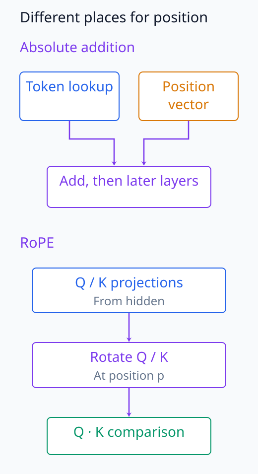
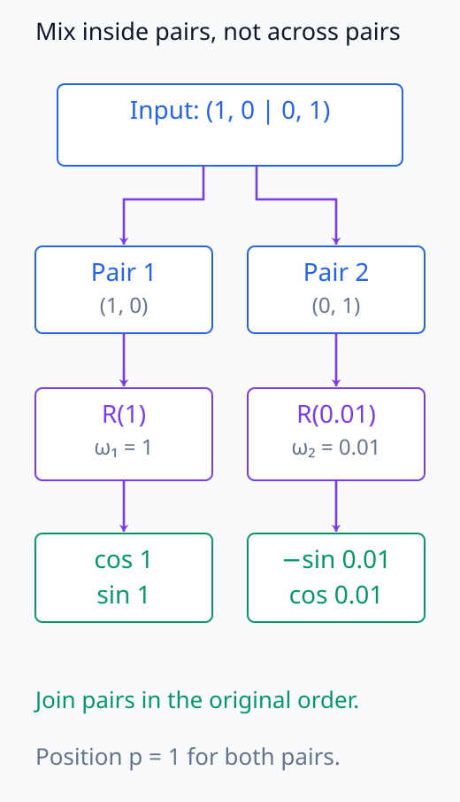
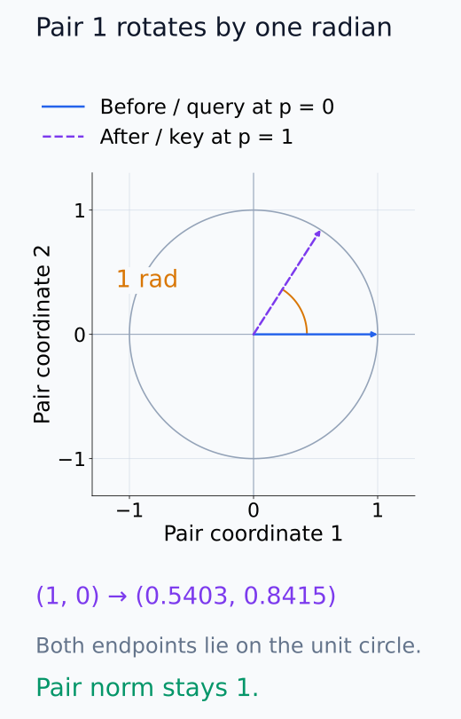
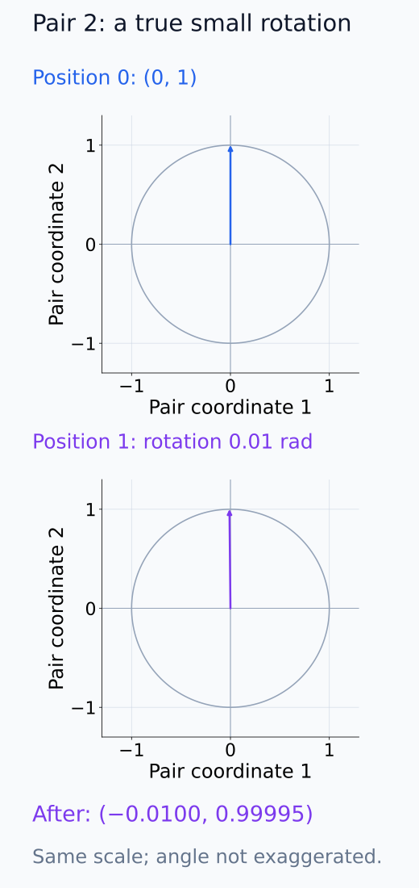
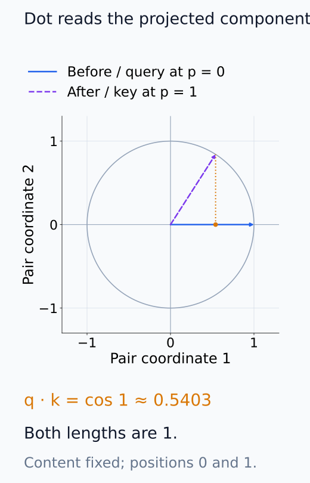
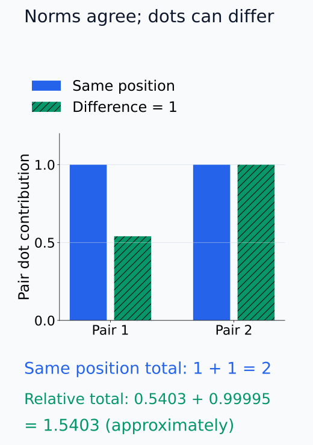
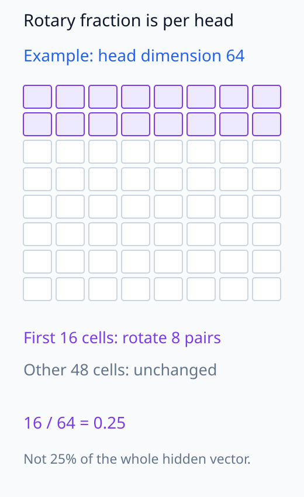

# N05-13. 위치정보와 RoPE

## 이 단원이 필요한 이유

self-attention의 token 집합 계산만으로는 sequence 순서를 구분하기 어렵다. model은 absolute embedding을 더하거나 query와 key를 position-dependent하게 회전해 순서 정보를 넣는다. N05 기준 모델은 RoPE를 사용한다.

## 학습 목표

- content representation과 position information을 구분할 수 있다.
- 2차원 vector의 rotation을 계산할 수 있다.
- RoPE가 feature pair마다 다른 frequency를 쓰는 방식을 설명할 수 있다.
- rotation이 norm과 same-position dot product를 보존함을 확인할 수 있다.
- Pythia config의 rotary fraction을 전체 hidden dimension과 구분할 수 있다.

## 선수지식 확인

- 선수 단원: [N05-12 embedding과 unembedding](N05-12-embedding-unembedding.md)
- 선수 단원: [M02-03 내적, 길이와 각도](../../part-1-foundations/M02/M02-03-inner-product-length-angle.md)
- 확인 질문: 2차원 rotation matrix를 vector에 곱할 수 있는가?

## 기호와 용어

| 기호·용어 | Common spoken reading | 의미 | shape·범위 |
|---|---|---|---|
| $p$ | `p` | token position | nonnegative integer |
| $\omega_j$ | `omega sub j` | feature pair $j$의 angular frequency | positive scalar |
| $R(p\omega_j)$ | `R of p omega sub j` | position $p$의 rotation matrix | $\mathbb R^{2\times2}$ |
| RoPE | `R o P E` | rotary position embedding | query·key pair rotation |
| rotary fraction | `rotary fraction` | head dimension 중 RoPE를 적용하는 비율 | $[0,1]$ |

## 핵심 개념 1. 위치정보를 넣는 방식은 여러 가지다

learned absolute position embedding은 token embedding에 position vector를 더한다. sinusoidal encoding은 고정 frequency의 sine·cosine vector를 더한다. RoPE는 attention의 query와 key feature pair를 회전한다.

세 방식은 position을 표현하지만 parameter, extrapolation과 attention score에 들어가는 경로가 다르다.

embedding lookup만 보면 같은 token ID는 어느 위치에서도 같은 vector를 받는다. absolute 방식은 여기에 위치별 vector를 더해 이후 층의 입력을 바꾼다. RoPE는 입력 embedding에 별도 vector를 더하는 대신, 뒤에서 배우는 query와 key의 비교에 들어갈 vector를 위치에 따라 회전한다. content 값이 무엇인지와 어느 위치에서 비교하는지를 서로 다른 계산으로 넣는 방식이다.

아래 계산 경로에서는 position 정보가 더해지거나 회전으로 들어가는 위치를 비교한다.

<figure class="lesson-figure" markdown="1">

<figcaption>위 경로의 absolute 방식은 embedding과 position vector를 더한 값을 다음 계산에 보낸다. 아래 RoPE 경로는 Q/K projection 뒤, dot product 전에 위치별 회전을 넣는다. 두 위치정보를 동시에 적용하라는 구조도가 아니다.</figcaption>
</figure>

## 핵심 개념 2. RoPE는 2차원 pair를 회전한다

\[
R(\theta)=
\begin{bmatrix}
\cos\theta&-\sin\theta\\
\sin\theta&\cos\theta
\end{bmatrix}
\]

이고 position $p$의 pair $\mathbf x_j$에는 $R(p\omega_j)\mathbf x_j$를 적용한다. rotation은

\[
\|R(\theta)\mathbf x\|_2=\|\mathbf x\|_2
\]

를 만족한다.

pair $\mathbf x_j=(a,b)$의 회전 후 성분은 $(a\cos(p\omega_j)-b\sin(p\omega_j),\ a\sin(p\omega_j)+b\cos(p\omega_j))$다. 같은 pair 안의 두 좌표를 섞지만 다른 pair와는 섞지 않는다. position이 한 칸 늘면 pair $j$의 각도는 $\omega_j$만큼 늘고, frequency가 다른 pair는 다른 속도로 돈다. 벡터의 각 성분에 같은 숫자를 더하는 연산이 아니다.

$R(\theta)^\top R(\theta)=I$이므로 회전 후 길이의 제곱은 $\mathbf x^\top R^\top R\mathbf x=\mathbf x^\top\mathbf x$다. 여러 pair에도 이 결과를 각각 더할 수 있다. 일부 차원만 회전하고 나머지를 그대로 두어도 전체 norm은 유지되지만 방향은 달라질 수 있다.

아래 pair 도식에서는 어떤 두 성분끼리 회전하고 어느 경계를 넘지 않는지 따라간다.

<figure class="lesson-figure" markdown="1">

<figcaption>예제의 네 좌표를 두 pair로 나눠 각각 회전한 뒤 같은 순서로 합친다. p = 1에서 첫 pair는 1 rad, 둘째 pair는 0.01 rad를 쓴다. pair 내부 두 성분은 섞이지만 두 pair 사이의 성분을 교환하지 않는다.</figcaption>
</figure>

## 핵심 개념 3. attention dot product는 상대 위치를 담는다

같은 frequency pair에서

\[
(R(p\omega)\mathbf q)^\top(R(r\omega)\mathbf k)
=\mathbf q^\top R((r-p)\omega)\mathbf k
\]

이다. absolute position 회전 두 개의 차이가 dot product에 들어간다. 이것이 RoPE가 relative displacement를 attention score에 반영하는 핵심 구조다.

전치한 회전은 반대 각도의 회전이므로 $R(p\omega)^\top=R(-p\omega)$다. 이를 key의 회전과 합성하면 $R(-p\omega)R(r\omega)=R((r-p)\omega)$가 된다. query와 key가 같은 position이면 차이가 0이 되어 원래 dot product가 남고, 서로 다른 position이면 상대 각도가 남는다. 두 vector의 norm이 같게 유지되는 것만으로 서로의 dot product까지 유지되는 것은 아니다.

상대 위치만 남는다는 설명은 content vector $\mathbf q,\mathbf k$를 고정한 이 회전 항에 관한 성질이다. 실제 모델의 query와 key는 입력과 앞선 층의 계산에 따라서도 달라진다. 따라서 전체 attention score나 모델 출력이 오직 position 차이로만 정해진다는 뜻은 아니다.

## 예제

두 pair의 frequency를 $(1,0.01)$로 두고 vector $(1,0,0,1)$을 position 0과 1에서 회전한다. position 0은 그대로이고 position 1은

\[
(\cos1,\sin1,-\sin0.01,\cos0.01)
\]

이 된다. norm은 두 position 모두 $\sqrt2$다. 같은 position으로 두 vector를 회전하면 dot product 2가 유지되고 position 차이가 1이면 약 1.5403이 된다.

아래 단위원에서는 첫 pair의 방향과 길이를 함께 비교한다.

<figure class="lesson-figure" markdown="1">

<figcaption>첫 pair의 원래 vector와 p = 1의 회전 결과가 같은 단위원에 닿는다. 방향은 1 rad만큼 바뀌지만 pair norm은 1이며, 좌표값은 약 (0.5403, 0.8415)다.</figcaption>
</figure>

둘째 pair를 그린 아래 두 패널은 작은 회전각을 과장하지 않고 같은 눈금으로 비교한다.

<figure class="lesson-figure" markdown="1">

<figcaption>두 패널은 같은 축 눈금을 쓴다. 0.01 rad의 작은 회전은 실제 크기로 표시해 거의 같은 방향으로 보인다. 둘째 pair는 (0, 1)에서 약 (−0.0100, 0.99995)로 바뀌며 pair norm은 1이다.</figcaption>
</figure>

아래 사영 그림에서는 상대 위치가 달라진 key를 query 방향으로 읽는다.

<figure class="lesson-figure" markdown="1">

<figcaption>첫 pair의 content를 고정하고 query position 0, key position 1을 비교했다. 두 norm은 1이지만 query 방향으로 읽는 key의 성분은 cos 1 ≈ 0.5403이다. 같은 position으로 함께 회전한 경우의 dot product 1과 다르다.</figcaption>
</figure>

두 pair의 dot product 기여는 아래 막대에서 따로 읽고 합할 수 있다.

<figure class="lesson-figure" markdown="1">

<figcaption>왼쪽 막대는 같은 position, 오른쪽 막대는 position 차이 1의 기여다. 각 pair의 dot product를 합하면 2와 cos 1 + cos 0.01 ≈ 1.5403이 된다. 각 vector norm √2가 같다는 사실과 서로의 dot product 보존은 다른 조건이다.</figcaption>
</figure>

## 실행 실습

### 실행 환경과 원본

- 환경: Python 3.12, PyTorch 2.13.0 CPU, NumPy 2.5.3
- 확인일: 2026-10-01
- 구성요소 등급: `Instructional reference`
- 예제 ID: `n05_13_rope`
- 코드 원본: `labs/N05/n05_13_rope.py`
- 테스트: `tests/N05/test_n05_13.py`
- 실행 명령: `.venv\Scripts\python.exe -m labs.N05.n05_13_rope`

### 자원 예산

sequence length 2와 model dimension 4를 사용한다. parameter와 training step은 0이다.

### 실제 코드와 실행 결과

<!-- N05_EXAMPLE: n05_13_rope -->

### 검사

테스트는 회전값, norm 보존, same-position dot product와 relative-position dot product를 확인한다.

## 공개 config 대조

Pythia의 공개 training config는 `pos-emb: rotary`, `rotary-pct: 0.25`를 기록한다. Hugging Face config도 `rotary_pct: 0.25`, base 10000을 기록한다. Pythia가 head dimension 전체에 RoPE를 적용한다고 쓰면 틀린다. N05 tiny 기준 구현은 계산을 단순하게 보여주기 위해 네 차원 전체를 회전한다.

아래 head 내부 배열에서는 rotary fraction을 차원 수로 센다.

<figure class="lesson-figure" markdown="1">

<figcaption>문제의 head dimension 64를 위치 셀로 표시하면 0.25는 16차원, 즉 8개 pair다. 나머지 48차원은 이 회전을 적용하지 않는다. 셀의 첫 16개 강조는 개수 설명이며 실제 pairing convention을 지정한 배열은 아니다.</figcaption>
</figure>

## 모델 해석과의 연결

RoPE 뒤의 query·key activation에는 content와 position-dependent rotation이 함께 들어 있다. 다른 position의 vector를 직접 cosine 비교하면 rotation 효과가 포함된다.

position effect를 제거하거나 정렬하는 분석은 사용한 RoPE convention, rotary dimension과 frequency를 알아야 한다. norm 보존만으로 semantic content가 보존됐다고 결론낼 수 없다.

## 흔한 오해

### 오해 1. RoPE는 token embedding에 vector를 더한다

기준 RoPE는 query와 key feature pair를 회전한다. absolute position embedding addition과 계산 위치가 다르다.

### 오해 2. rotation이 norm을 보존하므로 representation이 같다

norm은 같지만 방향과 다른 vector와의 dot product가 달라진다.

### 오해 3. 모든 model이 모든 head dimension을 회전한다

rotary fraction과 pairing convention은 architecture마다 다르다. config와 implementation을 확인해야 한다.

## 연습문제

### 1. position 0

$R(0)\mathbf x$는 무엇인가?

해설 보기

$R(0)$은 identity matrix이므로 $\mathbf x$다.

### 2. quarter turn

$R(\pi/2)(1,0)$을 구하라.

해설 보기

$(0,1)$이다.

### 3. norm

rotation 뒤 norm이 유지되는 이유를 적어라.

해설 보기

$R^\top R=I$이므로 $\|R\mathbf x\|^2=\mathbf x^\top R^\top R\mathbf x=\|\mathbf x\|^2$다.

### 4. rotary dimension

head dimension 64와 rotary fraction 0.25이면 회전 대상 차원 수는?

해설 보기

$64\cdot0.25=16$차원이다. 구현은 pair를 만들 수 있는 짝수 차원을 요구한다.

### 5. config 비교

tiny 실습과 Pythia의 rotary fraction 차이를 어떻게 기록해야 하는가?

해설 보기

tiny 실습은 4차원 전체, Pythia는 head dimension의 25%에 적용한다고 구분한다.

### 6. 주장 비판

RoPE 전후 norm이 같으므로 attention score가 같다는 결론을 평가하라.

해설 보기

score는 query와 key의 dot product다. 서로 다른 position rotation은 상대 각도를 바꾸므로 norm이 같아도 score가 달라질 수 있다.

## 근거와 갱신 경계

정의와 relative-position 성질은 [RoFormer](https://arxiv.org/abs/2104.09864)을 따른다. Pythia 비교는 [공개 training config](https://github.com/EleutherAI/pythia/blob/main/models/14M/pythia-14m.yml)의 rotary 설정을 확인했다. 이 단원은 이후 attention 계산에서 query와 key에 RoPE를 적용할 준비만 한다.

## 단원 요약

- position information은 token order를 계산에 넣는다.
- RoPE는 feature pair를 position-dependent angle로 회전한다.
- rotation은 norm과 same-position dot product를 보존한다.
- query·key dot product에는 relative displacement가 들어간다.
- rotary fraction과 convention은 config에서 확인해야 한다.

## 통과 기준

- 세 position 방식의 계산 위치를 구분할 수 있는가?
- 2차원 RoPE rotation을 계산할 수 있는가?
- norm 보존과 relative dot product를 설명할 수 있는가?
- rotary fraction에서 적용 dimension을 구할 수 있는가?
- RoPE activation 비교의 주의점을 설명할 수 있는가?

## 다음 단원

- [N05-14 query, key와 value](N05-14-query-key-value.md)

## 집필자 점검표

- [x] 학습 목표가 관찰 가능한 행동으로 작성됐다.
- [x] absolute addition과 rotary 계산을 구분했다.
- [x] norm과 dot product를 검산했다.
- [x] 공개 config와 tiny 실습 차이를 기록했다.
- [x] 모든 문제에 해설이 있다.
- [x] 모델 해석 주장의 강도를 구분했다.
- [x] 용어집과 표기 규칙을 따랐다.
- [x] Common spoken reading이 실제 영어 학술 발화이며 한글 음역이나 기계적 직역을 포함하지 않는다.
- [x] 선수지식 밖의 내용을 몰래 요구하지 않는다.
- [x] 내부 링크와 수식 렌더링을 확인했다.
- [x] Markdown에 실행 코드를 손으로 복제하지 않았다.
- [x] 코드 원본·테스트 경로·자원 예산·확인일을 기록했다.
- [x] shape·수치·gradient test가 있다.
