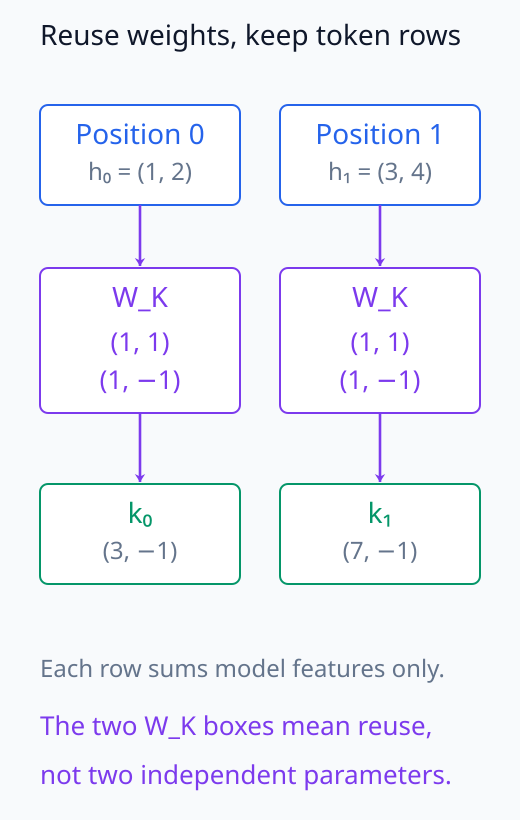
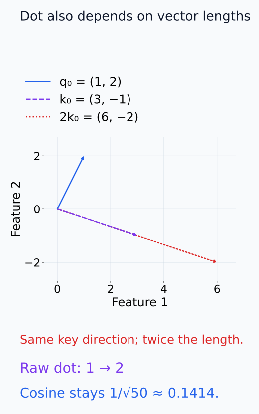
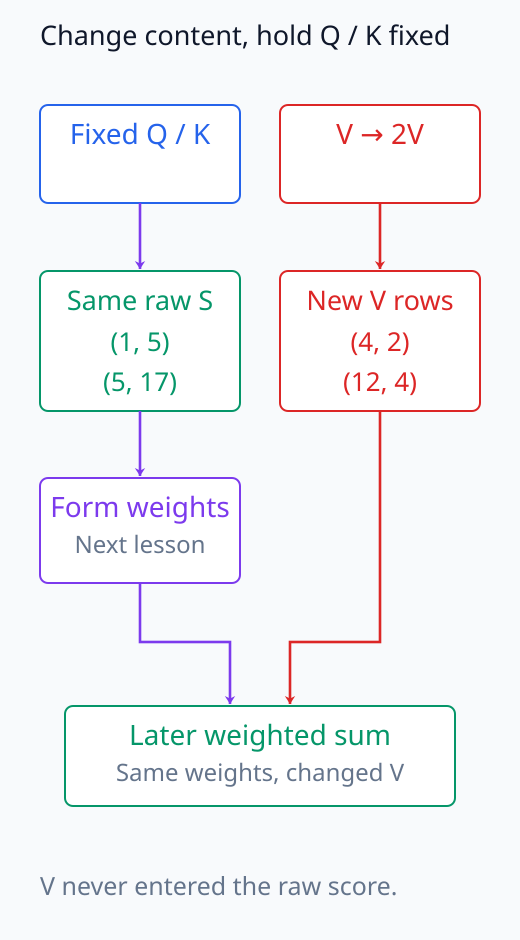
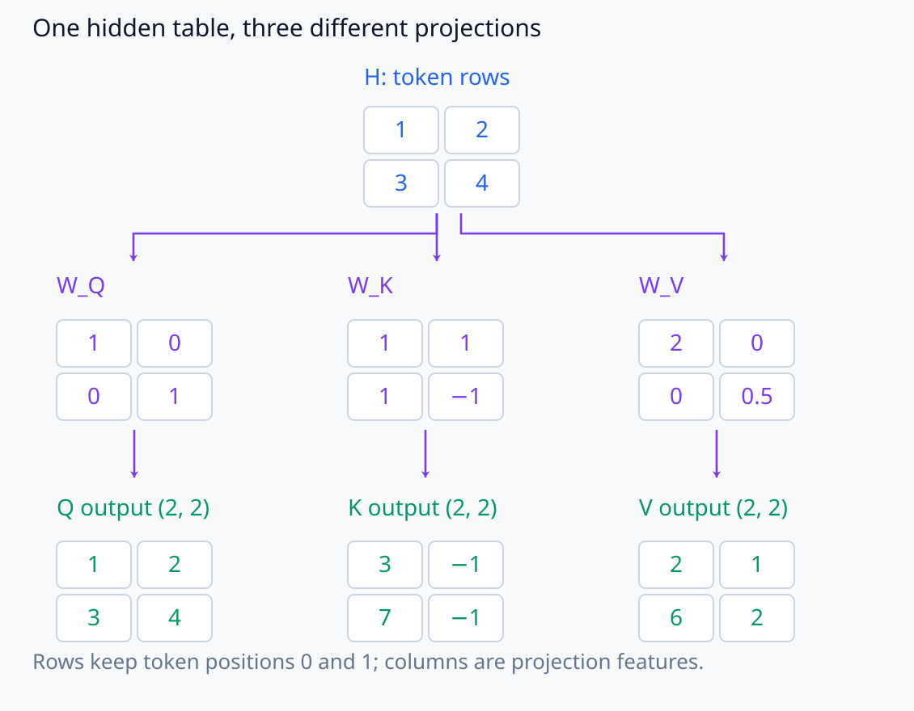
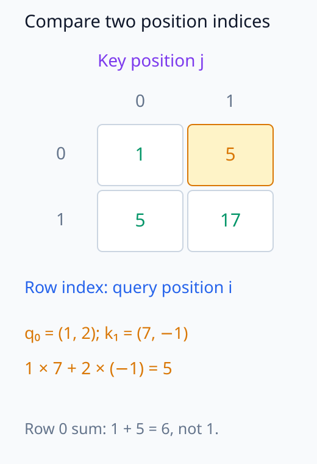
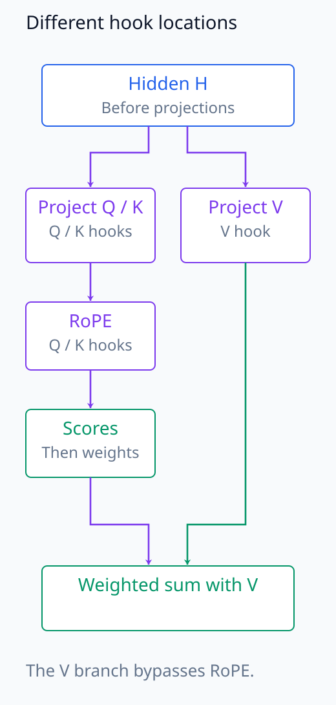

# N05-14. query, key와 value

## 이 단원이 필요한 이유

self-attention은 같은 hidden state에서 query, key와 value를 서로 다른 linear projection으로 만든다. query-key dot product는 어느 source position을 참고할지 정하는 score를 만들고 value는 가중합할 content를 제공한다.

## 학습 목표

- Q·K·V projection의 shape를 계산할 수 있다.
- query-key score matrix의 row와 column을 설명할 수 있다.
- value가 score 계산과 output 계산에서 맡는 역할을 구분할 수 있다.
- Q·K·V activation hook 위치를 구분할 수 있다.
- 큰 attention score를 설명과 동일시하지 않을 수 있다.

## 선수지식 확인

- 선수 단원: [N05-13 위치정보와 RoPE](N05-13-position-information-rope.md)
- 확인 질문: row-batch affine map의 shape를 계산할 수 있는가?

## 기호와 용어

| 기호·용어 | Common spoken reading | 의미 | shape·범위 |
|---|---|---|---|
| $\mathbf H$ | `H` | token hidden states | $\mathbb R^{T\times d_{model}}$ |
| $\mathbf Q$ | `Q` | query projection | $\mathbb R^{T\times d_k}$ |
| $\mathbf K$ | `K` | key projection | $\mathbb R^{T\times d_k}$ |
| $\mathbf V$ | `V` | value projection | $\mathbb R^{T\times d_v}$ |
| $S_{ij}$ | `S sub i j` | query position $i$와 key position $j$의 raw score | scalar |

## 핵심 개념 1. 세 projection

\[
\mathbf Q=\mathbf H\mathbf W_Q^\top,
\quad
\mathbf K=\mathbf H\mathbf W_K^\top,
\quad
\mathbf V=\mathbf H\mathbf W_V^\top
\]

이다. 같은 $\mathbf H$를 사용해도 서로 다른 weight로 계산하므로 세 tensor를 별개의 역할로 구분한다. 특정 입력에서는 값이 우연히 같을 수 있다. 이 단원은 bias를 생략한다.

$\mathbf W_Q,\mathbf W_K$의 shape는 $(d_k,d_{model})$, $\mathbf W_V$의 shape는 $(d_v,d_{model})$이다. projection마다 model feature axis를 합하고 token position axis는 남긴다. 아직 서로 다른 token의 값을 섞는 단계가 아니며 모든 position에 같은 projection weight를 적용한다. Q와 K는 dot product를 위해 같은 feature 길이를 가져야 하지만 V의 길이는 달라도 된다.

query는 참고할 대상을 평가하는 쪽, key는 평가받는 쪽, value는 그 대상으로부터 가져올 값이다. 세 이름은 별도 token 집합을 뜻하지 않는다. 각 hidden row에서 세 vector를 모두 만들고 다음 score 계산에서 query row 하나와 여러 key row를 연결한다.

아래 key 경로에서는 같은 weight를 token row마다 재사용하는 계산을 펼친다.

<figure class="lesson-figure" markdown="1">

<figcaption>실습의 key projection을 token row마다 펼쳤다. 두 경로의 W_K는 같은 weight이고, 각 경로는 자기 hidden의 두 feature만 사용한다. token별 weight가 따로 있는 것도, 여기서 서로의 hidden을 더한 것도 아니다.</figcaption>
</figure>

## 핵심 개념 2. score matrix

raw score는

\[
\mathbf S=\mathbf Q\mathbf K^\top,
\qquad
S_{ij}=\mathbf q_i^\top\mathbf k_j
\]

이다. row $i$는 query position $i$가 모든 key position을 평가한 값이고 column $j$는 key position $j$가 여러 query에 받은 score다.

$S_{ij}=\sum_{k=1}^{d_k}q_{ik}k_{jk}$에서는 feature index $k$가 사라지고 두 position index $i,j$가 남는다. 그래서 $(T,d_k)(d_k,T)$의 결과가 $(T,T)$이다. $S_{ij}$와 $S_{ji}$는 query와 key의 역할을 바꾼 다른 비교이므로 일반적으로 같지 않다. 아래의 작은 예제에서 두 값이 같아도 score matrix의 일반적인 대칭성을 뜻하지 않는다.

raw score는 음수가 될 수 있고 한 row의 합이 1일 필요도 없다. 또 dot product는 각도뿐 아니라 두 vector의 길이에도 의존하므로 자동으로 cosine similarity가 되는 것은 아니다. 다음 단원에서 scaling·mask·softmax를 거쳐 이 점수를 가중합에 사용할 weight로 바꾼다.

value는 이 score에 들어가지 않는다. mask와 softmax 뒤 attention weight가 value row를 가중합한다.

Q와 K를 고정한 채 V만 바꾸면 score는 유지되고 전달할 값이 바뀐다. 반대로 projection 전의 H를 바꾸면 세 경로가 함께 바뀔 수 있다. 어떤 값을 고정했는지에 따라 개입의 의미가 다르다. 큰 weight를 받은 위치도 value가 작거나 다른 위치의 value와 상쇄되면 output에서의 변화가 작을 수 있으므로 참고 비중과 전달 내용은 따로 확인한다.

아래 좌표 그림에서는 key의 방향을 유지한 채 길이만 바꾸어 dot과 cosine을 비교한다.

<figure class="lesson-figure" markdown="1">

<figcaption>실습의 q₀, k₀에 길이 비교를 위해 2k₀를 덧그렸다. key 방향은 같지만 norm이 두 배라 raw dot은 1에서 2로 커진다. 두 norm으로 나눈 cosine은 모두 1/√50 ≈ 0.1414다.</figcaption>
</figure>

별도 value 경로를 그린 아래 도식에서는 Q/K를 고정한 비교의 의미를 확인한다.

<figure class="lesson-figure" markdown="1">

<figcaption>Q/K를 고정하고 실습 V만 2V로 바꾼 비교다. raw S와 그다음의 weight 계산은 같지만 가중합에 들어갈 value row는 (4, 2), (12, 4)로 바뀐다. H를 바꾸는 개입이라면 Q/K/V 모두 달라질 수 있어 이 비교와 다르다.</figcaption>
</figure>

## 예제

\[
\mathbf H=\begin{bmatrix}1&2\\3&4\end{bmatrix}
\]

에 실습 weight를 적용하면

\[
\mathbf Q=\begin{bmatrix}1&2\\3&4\end{bmatrix},
\quad
\mathbf K=\begin{bmatrix}3&-1\\7&-1\end{bmatrix},
\quad
\mathbf V=\begin{bmatrix}2&1\\6&2\end{bmatrix}
\]

이고 raw score는

\[
\mathbf Q\mathbf K^\top=
\begin{bmatrix}1&5\\5&17\end{bmatrix}
\]

이다.

아래 세 projection 그림에서는 실습 weight에서 output으로 내려가며 실제 숫자를 읽는다.

<figure class="lesson-figure lesson-figure--wide" markdown="1">

<figcaption>세 가지 실습 weight와 projection 결과를 위에서 아래로 읽는다. 모두 같은 H를 받지만 서로 다른 feature 계산을 한다. 결과의 두 row는 token position 0과 1로 그대로 남으며 아직 token 사이를 섞지 않았다.</figcaption>
</figure>

이어지는 score 배열에서는 한 query와 한 key가 만나는 셀을 확인한다.

<figure class="lesson-figure" markdown="1">

<figcaption>주황 셀은 query position 0과 key position 1의 비교다. 두 feature를 합하면 1×7 + 2×(−1) = 5가 되고 두 position index만 남는다. row 0의 합은 6이므로 아직 합이 1인 attention weight가 아니다.</figcaption>
</figure>

## 실행 실습

### 실행 환경과 원본

- 환경: Python 3.12, PyTorch 2.13.0 CPU, NumPy 2.5.3
- 확인일: 2026-10-01
- 구성요소 등급: `Stable core`
- 예제 ID: `n05_14_qkv`
- 코드 원본: `labs/N05/n05_14_qkv.py`
- 테스트: `tests/N05/test_n05_14.py`
- 실행 명령: `.venv\Scripts\python.exe -m labs.N05.n05_14_qkv`

### 자원 예산

sequence length 2, model dimension 2, head 1과 projection parameter 12개를 사용한다.

### 실제 코드와 실행 결과

<!-- N05_EXAMPLE: n05_14_qkv -->

### 검사

테스트는 Q·K·V와 score의 shape·값을 손계산에 대조한다.

## RoPE와 projection 순서

N05 기준 계산은 Q와 K를 projection한 뒤 feature pair에 RoPE를 적용한다. V에는 이 rotation을 적용하지 않는다. 공개 implementation을 읽을 때 projection, head reshape와 RoPE 순서를 확인해야 한다.

아래 경로에서는 RoPE를 거치는 tensor와 거치지 않는 tensor의 hook 위치를 구분한다.

<figure class="lesson-figure" markdown="1">

<figcaption>projection 전 H, projection 뒤 Q/K/V, RoPE 뒤 Q/K는 서로 다른 hook 위치다. 왼쪽은 Q/K에만 회전을 넣고 score와 weight로 이어지며, 오른쪽 V는 그 회전을 거치지 않고 나중의 가중합에 들어간다.</figcaption>
</figure>

## 모델 해석과의 연결

Q·K·V hook은 서로 다른 질문에 답한다. Q·K는 score 형성, V는 전달할 content와 연결된다. projection 전 residual state를 Q나 V라고 부르면 intervention 위치를 잘못 지정하게 된다.

큰 raw score는 scaling, mask와 다른 key score를 거쳐 probability가 된다. score 하나만으로 output 기여를 판단할 수 없다.

## 흔한 오해

### 오해 1. query는 현재 token이고 key는 과거 token이다

각 position에서 Q·K·V를 모두 만든다. causal mask가 미래 key를 가릴 뿐 projection 역할을 position 종류로 나누지 않는다.

### 오해 2. value가 attention score를 결정한다

기준 dot-product attention에서 score는 Q와 K로 만든다. V는 weight 뒤의 가중합 대상이다.

### 오해 3. Q·K·V shape가 같으면 값도 같다

별도 weight가 다른 linear map을 만든다.

## 연습문제

### 1. projection shape

$H:(5,8)$, $W_Q:(4,8)$이면 Q shape는?

해설 보기
$(5,4)$다.

### 2. score shape

Q와 K가 모두 `(5,4)`이면 score shape는?

해설 보기
$(5,5)$다.

### 3. score 성분

$q_i=(1,2)$, $k_j=(3,-1)$의 raw score를 구하라.

해설 보기
$1\cdot3+2(-1)=1$이다.

### 4. row 의미

score matrix의 둘째 row는 무엇을 모으는가?

해설 보기
둘째 query position이 모든 key position에 준 score를 모은다.

### 5. hook 선택

전달 content를 바꾸는 intervention에는 Q와 V 중 어느 tensor가 직접적인가?

해설 보기
V다. Q를 바꾸면 주로 weight 선택 경로가 바뀐다.

### 6. 주장 비판

가장 큰 QK score의 token이 output을 설명한다는 결론을 평가하라.

해설 보기
mask·softmax, V와 output projection을 보지 않았으므로 output 기여 결론은 나오지 않는다.

## 근거와 갱신 경계

projection과 score 정의는 [Attention Is All You Need](https://arxiv.org/abs/1706.03762)를 따른다. fused QKV implementation은 같은 linear map을 한 kernel로 계산할 수 있지만 수학적 역할은 분리한다.

## 단원 요약

- Q·K·V는 같은 hidden state의 서로 다른 projection이다.
- QK transpose가 position-by-position score matrix를 만든다.
- score row는 한 query가 모든 key를 평가한 값이다.
- V는 attention weight가 섞을 content다.
- score 관찰만으로 output 기여를 정할 수 없다.

## 통과 기준

- Q·K·V shape를 계산할 수 있는가?
- score matrix를 손으로 계산할 수 있는가?
- score row와 column을 설명할 수 있는가?
- QK 경로와 V 경로를 구분할 수 있는가?
- hook 위치에 맞는 주장을 할 수 있는가?

## 다음 단원

- [N05-15 causal scaled dot-product attention](N05-15-causal-scaled-dot-product-attention.md)

## 집필자 점검표

- [x] 학습 목표가 관찰 가능한 행동으로 작성됐다.
- [x] Q·K·V의 shape와 역할을 구분했다.
- [x] score 값을 검산했다.
- [x] 모든 문제에 해설이 있다.
- [x] 모델 해석 주장의 강도를 구분했다.
- [x] 용어집과 표기 규칙을 따랐다.
- [x] Common spoken reading이 실제 영어 학술 발화이며 한글 음역이나 기계적 직역을 포함하지 않는다.
- [x] 선수지식 밖의 내용을 몰래 요구하지 않는다.
- [x] 내부 링크와 수식 렌더링을 확인했다.
- [x] Markdown에 실행 코드를 손으로 복제하지 않았다.
- [x] 코드 원본·테스트 경로·자원 예산·확인일을 기록했다.
- [x] shape·수치·gradient test가 있다.
