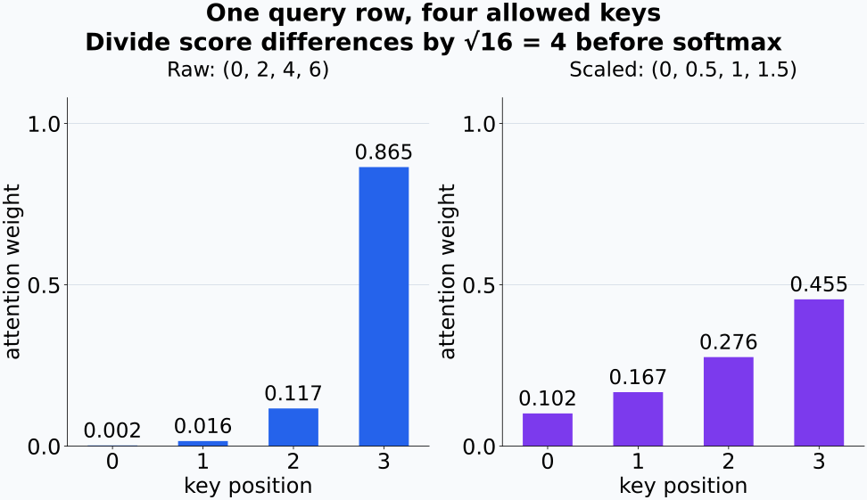
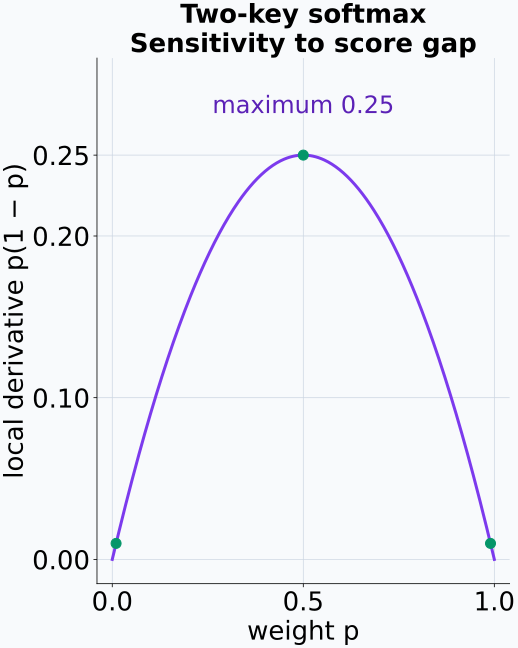
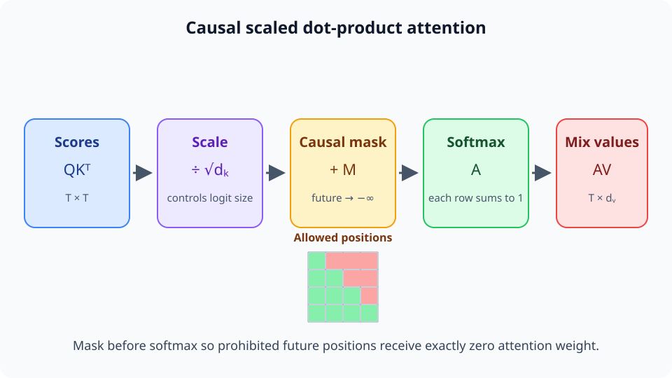
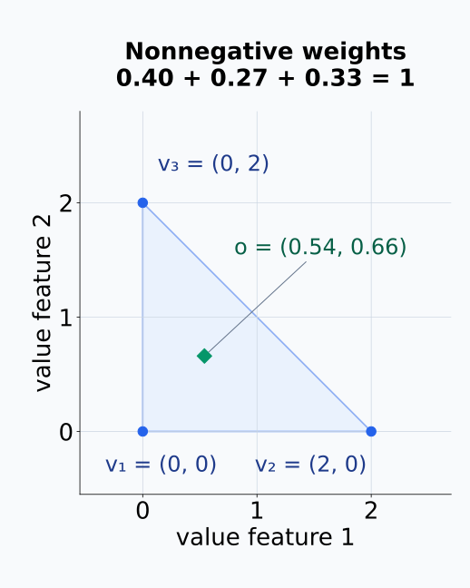
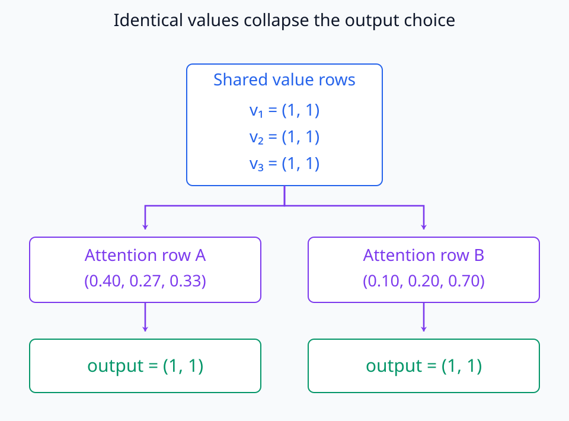
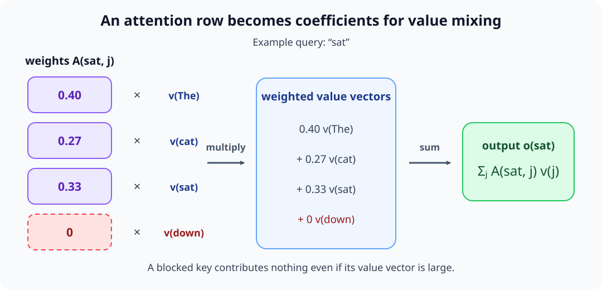
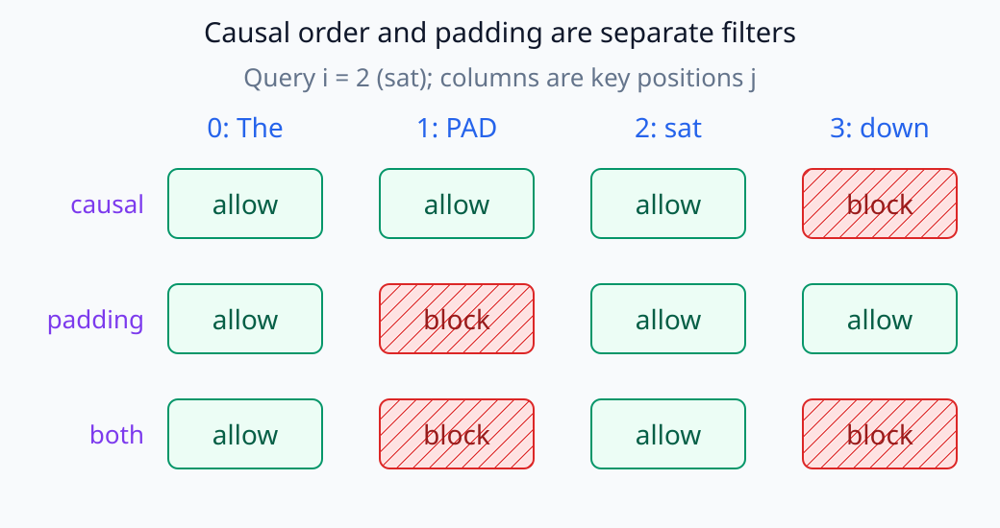
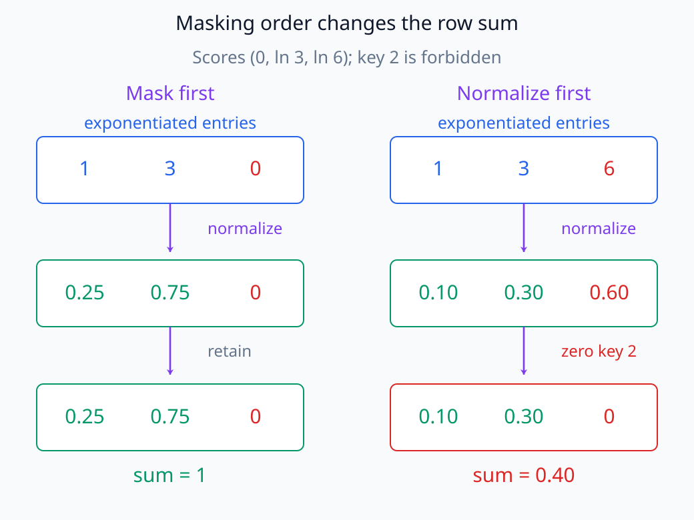

# N05-15. causal scaled dot-product attention

## 이 단원이 필요한 이유

attention output은 QK score 하나로 정해지지 않는다. score를 head dimension으로 scale하고, causal mask로 미래 위치를 제외하고, softmax로 정규화한 뒤 value를 가중합해야 한다. 이 순서를 알아야 attention map과 실제 output을 구분해 해석할 수 있다.

## 학습 목표

- scaled dot-product attention을 순서대로 계산할 수 있다.
- causal mask가 막는 score 위치를 표시할 수 있다.
- attention weight의 행 합과 output shape를 검산할 수 있다.
- attention weight와 value-weighted output의 주장을 구분할 수 있다.
- mask를 적용하는 시점이 잘못된 코드를 찾을 수 있다.

## 선수지식 확인

- 선수 단원: [N05-14 query, key와 value](N05-14-query-key-value.md)
- 확인 질문: QK transpose의 row와 column이 가리키는 position을 설명할 수 있는가?

## 기호와 용어

| 기호·용어 | Common spoken reading | 의미 | shape·범위 |
|---|---|---|---|
| $d_k$ | `d sub k` | 한 key 또는 query head의 dimension | positive integer |
| $S_{ij}$ | `S sub i j` | scaled attention score | scalar |
| $M_{ij}$ | `M sub i j` | 허용 여부를 나타내는 additive mask | $0$ 또는 $-\infty$ |
| $A_{ij}$ | `A sub i j` | query $i$가 value $j$에 주는 attention weight | $[0,1]$ |
| $\mathbf O$ | `O` | value를 가중합한 attention output | $\mathbb R^{T\times d_v}$ |

## 핵심 개념 1. scale

한 head의 score는

\[
\mathbf S=\frac{\mathbf Q\mathbf K^\top}{\sqrt{d_k}}
\]

이다. $d_k$가 커질 때 dot product의 크기가 함께 커지는 효과를 완화한다. 분모는 model dimension $d_{model}$이 아니라 해당 head의 query-key dimension이다.

query와 key의 모든 성분이 평균 0, 분산 1이고 서로 독립이라는 단순한 가정을 두자. 한 성분의 곱은 평균 0이고 제곱의 기댓값은 두 성분의 제곱 기댓값을 곱한 1이다. 독립인 곱 $d_k$개를 더하면 dot product의 분산은 $d_k$가 된다. score를 $\sqrt{d_k}$로 나누면 분산은 그 제곱인 $d_k$로 나뉘어 1이 된다. 이 계산은 scaling의 동기를 보이는 기준 가정이며 실제 학습된 성분들이 정확히 독립이라는 주장은 아니다.

scale을 생략해 같은 행 안의 score 차이가 지나치게 커지면 softmax가 한 위치에 거의 몰릴 수 있다. 이처럼 probability가 0이나 1에 가까워진 구간에서는 score에 대한 softmax의 local derivative가 작아진다. 모든 score에 같은 큰 상수를 더하는 것은 softmax를 바꾸지 않으므로 절댓값만으로 집중도를 판단하지 않는다. scaling은 head의 weight를 균등하게 만드는 규칙이 아니라 score 차이의 scale을 조절하는 규칙이다.

아래 그림에서는 같은 query의 네 score를 4로 나누기 전후의 weight를 비교한다.

<figure class="lesson-figure lesson-figure--wide" markdown="1">

<figcaption>네 key를 모두 허용한 구성 계산이다. score (0,2,4,6)을 그대로 쓰면 마지막 key의 weight가 약 0.865이고, √16=4로 나누면 약 0.455다. 두 경우 모두 행 합은 1이며 scaling 뒤에도 네 weight가 같지는 않다.</figcaption>
</figure>

두 key만 있는 경우에는 weight가 양 끝에 가까워질수록 score 차이에 대한 국소 변화율이 줄어든다.

<figure class="lesson-figure" markdown="1">

<figcaption>두 key의 score 차이를 g라 두면 한 weight는 p=exp(g)/(1+exp(g))이고 변화율은 p(1−p)다. p=0.5에서 0.25로 가장 크며 p=0.01이나 0.99에서는 0.0099로 작아진다. 여러 key의 전체 Jacobian 대신 두 key의 경우만 그렸다.</figcaption>
</figure>

<figure class="lesson-figure lesson-figure--wide" markdown="1">

<figcaption>score 계산, 크기 조절, 미래 위치 차단, 행별 정규화, value 혼합은 순서가 고정된 서로 다른 연산이다.</figcaption>
</figure>

앞의 네 단계에서는 sequence 위치 사이의 $T\times T$ 관계를 다룬다. 마지막에만 attention weight와 value가 곱해져 $T\times d_v$ output이 된다. 따라서 mask는 value vector를 지우는 연산이 아니라 softmax에 들어가기 전의 score를 바꾸는 연산이다.

## 핵심 개념 2. causal mask

왼쪽에서 오른쪽으로 생성하는 decoder에서 query position $i$는 미래 key position $j>i$를 볼 수 없다. additive mask를

\[
M_{ij}=\begin{cases}
0,&j\le i,\\
-\infty,&j>i
\end{cases}
\]

로 두면 masked score는 $\widetilde{\mathbf S}=\mathbf S+\mathbf M$이다. softmax 전에 $-\infty$가 된 위치의 probability는 0이 된다.

행 $i$는 정보를 받는 query 위치이고 열 $j$는 참조하는 key 위치다. 따라서 허용 영역은 주대각선을 포함한 아래쪽 삼각형이다. 이 행·열 convention을 반대로 구현하면 과거를 막고 미래를 허용하는 정반대 mask가 만들어질 수 있으므로 작은 $3\times3$ 행렬로 먼저 검사한다.

금지 위치의 score를 $-\infty$로 보내면 지수값은 극한에서 0이 된다. 따라서 softmax의 분모에는 허용된 score의 지수값만 남으며 금지 위치의 weight는 0이다. 금지 score를 단지 0으로 바꾸면 지수값은 $e^0=1$이므로 차단되지 않는다.

실제 floating-point 구현은 $-\infty$ 대신 매우 작은 유한값을 쓰기도 한다. 유한값의 지수는 수학적으로 양수이므로 차단을 보장하려면 수치상 0으로 소거되는지 또는 별도의 제외 처리를 하는지 확인해야 한다. 허용 위치가 있는 행에서 금지 weight가 0이고 허용 weight의 합이 1이라는 것이 기준 mask의 검산 조건이다.

<figure class="lesson-figure lesson-figure--wide" markdown="1">

<figcaption>행은 query, 열은 key다. sat 행의 미래 key down은 일반 score 0.4에서 마스킹된 −∞로, 다시 attention weight 0으로 바뀐다.</figcaption>
</figure>

보라색 테두리는 query `sat`의 한 행을 세 단계에 걸쳐 추적한다. 이 행에서 `The`, `cat`, `sat`은 현재 또는 과거라서 남고, `down`은 미래라서 빗금으로 표시된다. 금지 위치는 색뿐 아니라 빗금, $-\infty$, 0이라는 수치로도 구분된다. 이처럼 token 이름과 행·열 의미를 함께 적어야 아래쪽 삼각형이 왜 허용 영역인지 읽을 수 있다.

## 핵심 개념 3. softmax와 value 가중합

\[
A_{ij}=\frac{\exp(\widetilde S_{ij})}
{\sum_{r=1}^{T}\exp(\widetilde S_{ir})},
\qquad
\mathbf O=\mathbf A\mathbf V
\]

이다. softmax는 각 query row에서 계산하므로 $\sum_j A_{ij}=1$이다. output row $\mathbf o_i$는 허용된 value row들의 convex combination이다.

행 $i$를 고정한 채 key index만 합한다. 각 지수값을 그 행의 같은 합으로 나누므로 weight 합이 1이 되며, 다른 query 행의 score는 이 정규화에 들어가지 않는다. padding이 없는 causal self-attention에서는 자기 위치가 허용되어 분모에 적어도 한 양수 항이 남는다. 모든 위치를 금지한 행에는 이 식으로 확률분포를 정의할 수 없으므로 padding과 함께 쓰는 구현은 그런 행의 처리도 따로 정해야 한다.

query 위치 $i$의 output을 직접 쓰면

\[
\mathbf o_i
=
\sum_{j\le i} A_{ij}\mathbf v_j
\]

이다. 같은 attention weight라도 $\mathbf v_j$가 다르면 output은 달라진다. 반대로 큰 value vector가 있더라도 해당 위치의 weight가 0이면 그 query output에는 들어오지 않는다. attention pattern과 attention output을 분리해야 하는 이유다.

convex combination은 음이 아닌 계수의 합을 1로 맞춘 가중합이다. 모든 value row가 같다면 weight 분포가 달라도 output은 그 공통 vector다. 행렬곱에서는 key/value의 위치 axis를 합하고 query 위치와 value feature axis를 남겨 $(T,T)(T,d_v)$에서 $(T,d_v)$를 얻는다. weight가 feature 좌표를 바꾸는 것이 아니라 같은 feature 좌표를 여러 source 위치에서 모으는 계산이다.

같은 가중합을 두 feature의 좌표계에 놓으면 output이 value들이 만드는 삼각형 안에 놓이는 모습을 볼 수 있다.

<figure class="lesson-figure" markdown="1">

<figcaption>v₁=(0,0), v₂=(2,0), v₃=(0,2)에 계수 0.40·0.27·0.33을 적용한 구성 예시다. output은 (0.54,0.66)이며 파란 삼각형의 내부에 있다. 축은 token 위치가 아니라 value vector의 두 feature 좌표다.</figcaption>
</figure>

value가 모두 같을 때에는 서로 다른 attention row도 같은 output으로 이어진다.

<figure class="lesson-figure lesson-figure--wide" markdown="1">

<figcaption>세 value를 (1,1)로 고정했다. 서로 다른 두 weight row의 계수 합이 각각 1이므로 output은 둘 다 (1,1)이다. output이 같다는 관찰만으로 어떤 attention row를 사용했는지 복원할 수 없는 경우다.</figcaption>
</figure>

<figure class="lesson-figure lesson-figure--wide" markdown="1">

<figcaption>sat의 attention row는 허용된 value vector 세 개의 계수가 되며, 미래 위치 down의 value는 weight가 0이라 output에 기여하지 않는다.</figcaption>
</figure>

여기서 $0.40,0.27,0.33$은 vector의 좌표가 아니라 서로 다른 value vector 앞에 붙는 scalar 계수다. 세 weighted vector를 더한 결과가 query `sat`의 output row 하나다. attention map만 보면 어느 위치를 얼마나 참조했는지는 알 수 있지만, 실제로 어떤 방향의 정보가 더해졌는지는 value vector까지 보아야 한다.

## 예제

N05-14의 Q·K·V를 사용하면 scaled score는 약

\[
\mathbf S=
\begin{bmatrix}
0.7071&3.5355\\
3.5355&12.0208
\end{bmatrix}
\]

이다. 첫 query의 미래 score를 가리면 첫 attention row는 $(1,0)$이 된다. 둘째 query는 두 key를 모두 볼 수 있어 약 $(0.000206,0.999794)$를 얻는다. 따라서 output은

\[
\mathbf O\approx
\begin{bmatrix}
2&1\\
5.9992&1.9998
\end{bmatrix}
\]

이다.

## 실행 실습

### 실행 환경과 원본

- 환경: Python 3.12, PyTorch 2.13.0 CPU, NumPy 2.5.3
- 확인일: 2026-10-01
- 구성요소 등급: `Stable core`
- 예제 ID: `n05_15_causal_attention`
- 코드 원본: `labs/N05/n05_15_causal_attention.py`
- 테스트: `tests/N05/test_n05_15.py`
- 실행 명령: `.venv\Scripts\python.exe -m labs.N05.n05_15_causal_attention`

### 자원 예산

sequence length 2, head dimension 2와 head 1개를 사용한다. 모델 다운로드나 학습은 없다.

### 실제 코드와 실행 결과

<!-- N05_EXAMPLE: n05_15_causal_attention -->

### 검사

테스트는 masked score의 $-\infty$, attention row sum, 첫 query의 미래 probability와 output 수치를 확인한다.

## 구현에서 보이는 다른 mask 표현

구현은 boolean mask를 `masked_fill`에 넘기거나, 매우 작은 유한값을 score에 더하거나, causal option이 있는 fused kernel을 쓸 수 있다. 기준식과 같게 동작하는지는 mask 문자열만으로 판단하지 않고 허용된 key가 있는 행의 금지 weight와 행 합을 검사한다. 유한 대체값은 dtype과 score 범위에 따라 금지 weight를 작은 양수로 남길 수도 있다.

padding mask는 sequence의 무효 token을 제외하고 causal mask는 시간 순서를 제한한다. 둘은 동시에 적용할 수 있지만 같은 개념은 아니다.

두 조건은 같은 query가 참조할 key에 각각 적용한 뒤 함께 만족하는 위치만 남긴다.

<figure class="lesson-figure lesson-figure--wide" markdown="1">

<figcaption>한 query 행만 고정한 예시다. i=2인 sat에서 PAD는 과거 위치지만 무효 token이라 제외하고, down은 유효 token이지만 미래라 제외한다. 마지막 행은 두 허용 조건의 교집합이다. PAD 자체를 query로 사용하는 행의 처리는 이 그림에 포함하지 않았다.</figcaption>
</figure>

## 모델 해석과의 연결

attention weight $A_{ij}$는 query $i$가 value position $j$를 섞는 계수다. 그러나 최종 logit에 미친 영향은 value vector, output projection, residual addition과 이후 layer에 달려 있다. attention weight가 크다는 사실은 연결 강도에 관한 관찰이지 인과적 설명의 완결이 아니다.

mask를 바꾸는 intervention은 모델이 이용할 수 있는 정보 경로 자체를 바꾼다. 특정 attention weight만 관찰하는 것보다 강한 조작이므로 원래 모델의 동작과 intervention 뒤 동작을 구분해 보고해야 한다.

## 흔한 오해

### 오해 1. mask는 softmax 뒤에 곱하면 같다

softmax 뒤에 0을 곱하면 남은 weight의 합이 1이 아니게 된다. 다시 정규화하지 않는 한 같은 연산이 아니다.

정규화의 분모에 금지 key가 들어갔는지 두 계산 경로를 나란히 확인한다.

<figure class="lesson-figure lesson-figure--wide" markdown="1">

<figcaption>금지 key 2의 지수값을 먼저 0으로 두면 분모는 1+3=4다. 전체 1+3+6=10으로 정규화한 뒤 마지막 weight만 지우면 남는 합은 0.40이다. 오른쪽의 남은 두 값을 다시 0.40으로 나누면 왼쪽과 같아지지만, 그 추가 연산 없이 두 경로가 같지는 않다.</figcaption>
</figure>

### 오해 2. scale은 sequence length로 한다

기준식의 분모는 $\sqrt{d_k}$다.

### 오해 3. attention weight가 곧 token 기여도다

weight는 value를 섞기 전 계수다. value와 downstream 경로를 제외한 기여도 결론은 성립하지 않는다.

## 연습문제

### 1. scale 계산

$d_k=16$이면 raw score를 무엇으로 나누는가?

해설 보기
$\sqrt{16}=4$로 나눈다.

### 2. causal mask

길이 3인 sequence에서 query index 1이 볼 수 없는 zero-based key index는?

해설 보기
미래인 index 2다. index 0과 1은 허용된다.

### 3. 첫 row

causal self-attention의 첫 query row에서 padding이 없다면 attention weight는 어떻게 되는가?

해설 보기
자기 위치만 허용되므로 첫 key에 1, 나머지 미래 key에 0이다.

### 4. output shape

$A:(5,5)$, $V:(5,8)$이면 output shape는?

해설 보기
$AV:(5,8)$이다.

### 5. 코드 진단

masked position의 softmax probability가 0.2라면 가장 먼저 무엇을 확인해야 하는가?

해설 보기
mask가 softmax 전에 score에 적용됐는지와 mask 방향이 올바른지 확인한다.

### 6. 주장 비판

어떤 head가 한 token에 weight 0.9를 주므로 그 token이 예측의 원인이라는 주장을 평가하라.

해설 보기
attention pattern은 관찰됐지만 value, output projection과 downstream 경로를 검사하지 않았고 인과 intervention도 없으므로 원인이라고 결론낼 수 없다.

## 근거와 갱신 경계

scaled dot-product attention 식은 [Attention Is All You Need](https://arxiv.org/abs/1706.03762)의 정의를 따른다. fused attention kernel의 API와 mask 표현은 바뀔 수 있으므로 구현별 문서를 따로 확인한다.

## 단원 요약

- QK score를 $\sqrt{d_k}$로 나눈다.
- causal mask는 softmax 전에 미래 score를 제외한다.
- softmax는 각 query row를 probability distribution으로 만든다.
- attention output은 weight와 value의 행렬곱이다.
- attention weight만으로 최종 예측의 인과 기여를 확정할 수 없다.

## 통과 기준

- scaled score를 손으로 계산할 수 있는가?
- causal mask의 허용 영역을 표시할 수 있는가?
- attention row sum과 output shape를 검산할 수 있는가?
- mask 적용 순서 오류를 찾을 수 있는가?
- attention pattern과 인과 설명을 구분할 수 있는가?

## 다음 단원

- [N05-16 MHA, MQA와 GQA](N05-16-mha-mqa-gqa.md)

## 집필자 점검표

- [x] 학습 목표가 관찰 가능한 행동으로 작성됐다.
- [x] scale·mask·softmax·value 가중합 순서를 설명했다.
- [x] 모든 문제에 해설이 있다.
- [x] 모델 해석 주장의 강도를 구분했다.
- [x] 용어집과 표기 규칙을 따랐다.
- [x] Common spoken reading이 실제 영어 학술 발화이며 한글 음역이나 기계적 직역을 포함하지 않는다.
- [x] 선수지식 밖의 내용을 몰래 요구하지 않는다.
- [x] 내부 링크와 수식 렌더링을 확인했다.
- [x] Markdown에 실행 코드를 손으로 복제하지 않았다.
- [x] 코드 원본·테스트 경로·자원 예산·확인일을 기록했다.
- [x] shape·수치·mask test가 있다.

