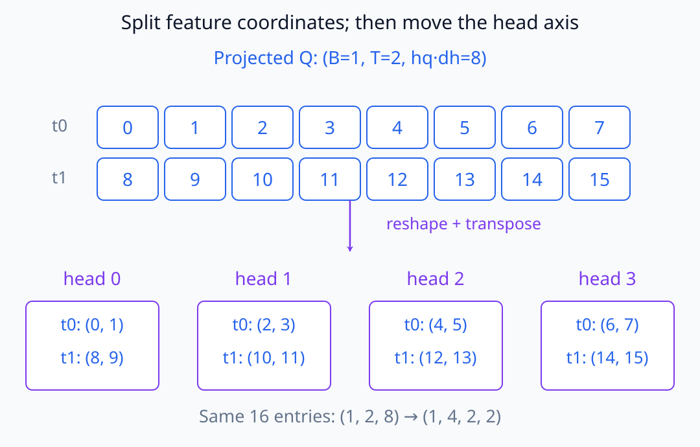
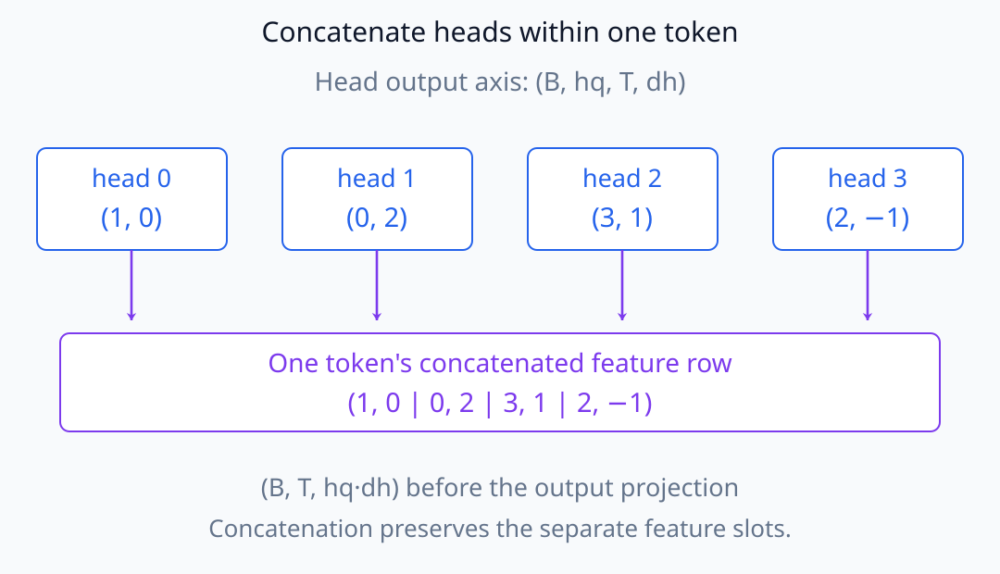
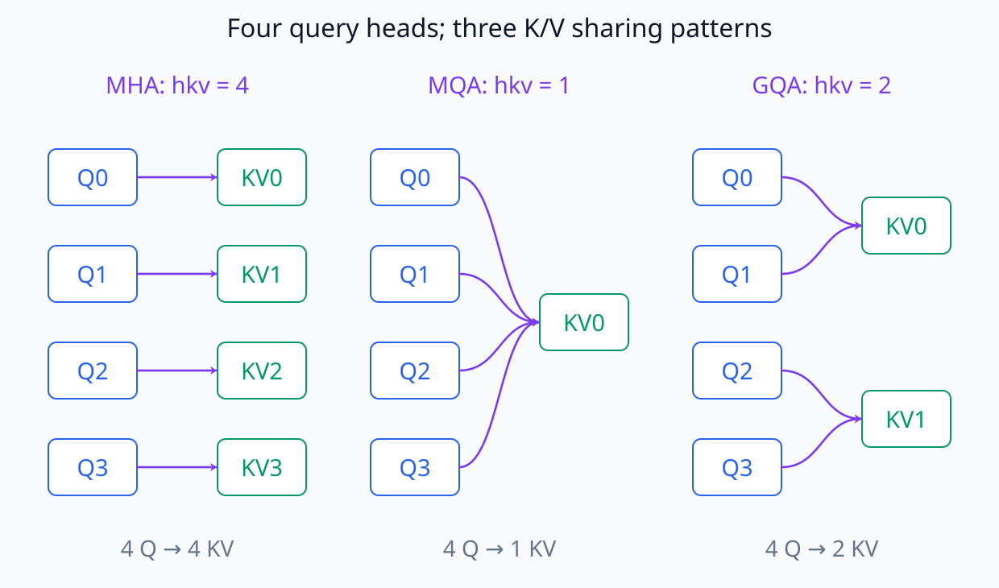
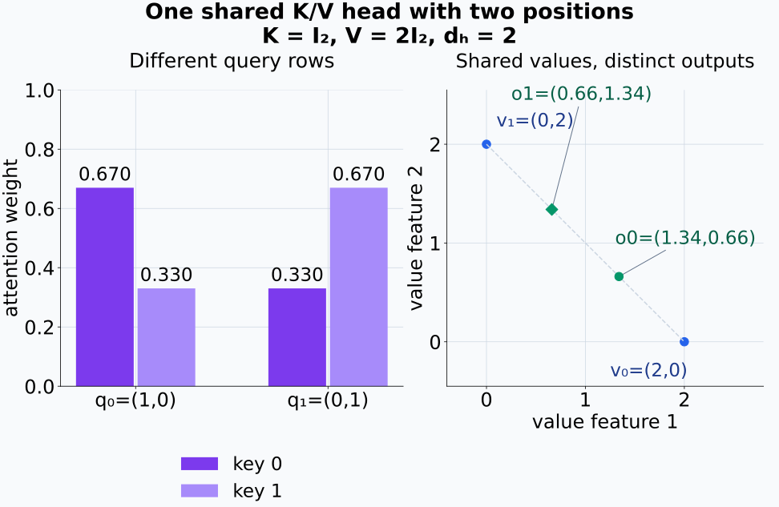
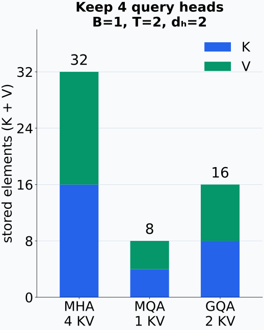
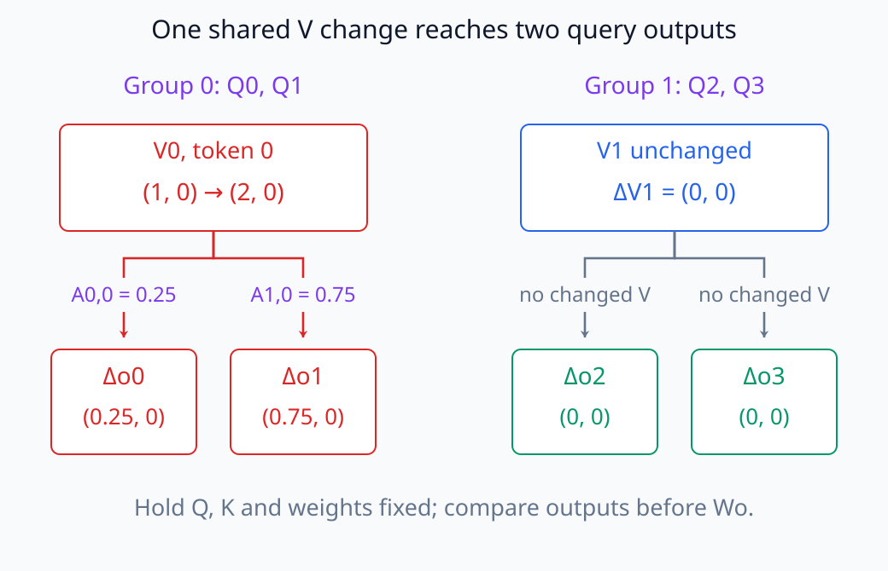

# N05-16. MHA, MQA와 GQA

## 이 단원이 필요한 이유

여러 attention head가 항상 같은 수의 query, key와 value head를 갖는 것은 아니다. MQA와 GQA는 key-value head를 공유해 생성 시 KV cache와 memory bandwidth를 줄인다. 이 차이를 알아야 모델 config, cached tensor shape와 head별 activation을 정확히 읽을 수 있다.

## 학습 목표

- MHA·MQA·GQA의 query head와 key-value head 수를 구분할 수 있다.
- 각 방식의 Q·K·V shape를 계산할 수 있다.
- query head에 key-value head가 어떻게 배정되는지 표시할 수 있다.
- KV cache element 수를 비교할 수 있다.
- head 공유를 head importance와 혼동하지 않을 수 있다.

## 선수지식 확인

- 선수 단원: [N05-15 causal scaled dot-product attention](N05-15-causal-scaled-dot-product-attention.md)
- 확인 질문: 한 attention head의 query-key score와 value 가중합을 계산할 수 있는가?

## 기호와 용어

| 기호·용어 | Common spoken reading | 의미 | shape·범위 |
|---|---|---|---|
| $h_q$ | `h sub q` | query head 수 | positive integer |
| $h_{kv}$ | `h sub k v` | key-value head 수 | $h_{kv}\mid h_q$ |
| $d_h$ | `d sub h` | head dimension | positive integer |
| MHA | `multi-head attention` | query head마다 별도 K·V head를 쓰는 구조 | $h_{kv}=h_q$ |
| MQA | `multi-query attention` | 모든 query head가 한 K·V head를 공유하는 구조 | $h_{kv}=1$ |
| GQA | `grouped-query attention` | query head group마다 K·V head를 공유하는 구조 | $1<h_{kv}<h_q$ |

## 핵심 개념 1. head axis

batch-first 표기에서 projection과 reshape 뒤 tensor를

\[
\mathbf Q\in\mathbb R^{B\times h_q\times T\times d_h},
\qquad
\mathbf K,\mathbf V\in\mathbb R^{B\times h_{kv}\times T\times d_h}
\]

로 쓴다. 각 query head가 사용할 K·V head를 얻으려면 key-value head를 head axis에서 반복하거나 같은 storage를 broadcast한다.

이 단원에서는 key와 value의 head dimension을 같은 $d_h$로 둔다. Q projection의 마지막 feature 길이는 $h_qd_h$이고 이를 길이 $d_h$인 head별 묶음으로 나눈 뒤 head axis를 token axis 앞으로 옮긴다. K와 V는 $h_{kv}d_h$에서 같은 과정을 수행한다. 원소 수를 유지하는 reshape와 axis 순서를 바꾸는 transpose를 구분해야 한다.

아래의 인덱스 예시는 원소 값이 바뀌는 것이 아니라 같은 token의 feature 묶음이 head별 위치로 옮겨지는 것을 보여 준다.

<figure class="lesson-figure lesson-figure--wide" markdown="1">

  
  <figcaption>0~15를 순서대로 놓은 projection 예시다. feature를 두 개씩 나누고 head 축을 앞으로 옮겨도 각 head에서 첫째 token과 둘째 token의 원소가 섞이지 않는다.</figcaption>
</figure>

각 query head는 한 head의 $T\times T$ attention weight와 $T\times d_h$ output을 계산한다. 여러 head의 output은 token별로 feature 방향에 이어 붙인 뒤 output projection으로 보낸다. K·V를 공유해도 query head별 계산과 output 위치가 사라지는 것은 아니다.

이어 붙일 때도 고정한 token의 head output을 같은 행에 모은다.

<figure class="lesson-figure lesson-figure--wide" markdown="1">

  
  <figcaption>한 token의 head output을 예시 수치로 놓았다. 네 head의 두 좌표를 이어 붙여 길이 8의 feature 행을 만든 뒤 output projection에 넣는다.</figcaption>
</figure>

## 핵심 개념 2. 세 공유 방식

$h_q=4$일 때 배정은 다음과 같다.

- MHA: K·V head `0, 1, 2, 3`을 query head `0, 1, 2, 3`에 각각 배정한다.
- MQA: K·V head `0`을 네 query head가 모두 공유한다.
- GQA에서 $h_{kv}=2$: query head `0, 1`은 K·V head `0`, query head `2, 3`은 K·V head `1`을 쓴다.

GQA의 group size는 $g=h_q/h_{kv}$다. 이 배정은 query head 수가 key-value head 수로 나누어떨어질 때 단순한 contiguous group으로 표현된다.

세 방식의 차이는 아래에서 query 수가 아니라 화살표가 도착하는 K·V 묶음의 수로 나타난다.

<figure class="lesson-figure lesson-figure--wide" markdown="1">

  
  <figcaption>query head 네 개는 모두 유지된다. MHA는 각각 다른 K·V를, MQA는 하나의 K·V를, 이 GQA 예시는 두 query씩 같은 K·V를 사용한다.</figcaption>
</figure>

같은 group의 query head는 동일한 key와 dot product를 계산하지만 query vector는 각 head의 projection에서 나온다. query가 다르면 같은 key에 대한 score와 softmax weight도 달라질 수 있다. 따라서 value를 공유한다고 head output까지 같아지는 것은 아니다. 공유하는 것은 K·V의 값과 parameter 경로이며, 어느 위치를 얼마나 참고하는지는 각 query에서 계산한다.

아래에서는 두 key 위치를 모두 허용한 작은 계산으로 공유와 output 동일성이 다른 조건임을 확인한다.

<figure class="lesson-figure lesson-figure--wide" markdown="1">

  
  <figcaption>같은 K와 V를 쓰지만 query가 (1,0)과 (0,1)이면 두 위치의 가중치가 뒤바뀐다. 두 output도 각각 약 (1.34,0.66)과 (0.66,1.34)로 다르다. mask 없이 공유 관계만 분리한 예시다.</figcaption>
</figure>

## 핵심 개념 3. KV cache 비용

한 layer에서 K와 V를 모두 저장하는 element 수는

\[
2BT h_{kv}d_h
\]

이다. 같은 $B,T,d_h$라면 MQA는 MHA의 $1/h_q$, GQA는 MHA의 $h_{kv}/h_q$만큼의 K·V element를 저장한다. 실제 byte 수는 여기에 dtype당 byte를 곱한다.

K 하나의 원소 수는 네 axis 길이를 곱한 $BTh_{kv}d_h$이고 같은 shape의 V까지 저장해 2배가 된다. 이 식은 공유 K·V를 cache에 한 번씩 저장하는 경우의 비용이다. 계산을 위해 펼친 복사본을 별도로 보관하면 그 저장량은 추가된다. query head별 score 계산, 다른 activation이나 model weight의 memory까지 이 식으로 줄어든다고 해석하지 않는다.

## 예제

$B=1$, $T=2$, $h_q=4$, $d_h=2$일 때 K와 V를 합친 element 수는 다음과 같다.

| 방식 | $h_{kv}$ | K·V shape 각각 | K+V element 수 |
|---|---:|---|---:|
| MHA | 4 | $(1,4,2,2)$ | 32 |
| MQA | 1 | $(1,1,2,2)$ | 8 |
| GQA | 2 | $(1,2,2,2)$ | 16 |

계산에 사용할 때는 모두 $(1,4,2,2)$에 대응되도록 공유한다. 논리적 확장은 필요하지만 반드시 메모리를 복사해야 하는 것은 아니다.

저장량은 펼쳐진 논리적 shape가 아니라 따로 저장한 K·V head 수를 세어 비교한다.

<figure class="lesson-figure" markdown="1">

  
  <figcaption>예제의 B=1, T=2, head dimension=2를 고정했다. 파란 K와 초록 V를 합친 높이는 각각 32, 8, 16이며 query head 수는 세 방식 모두 4다.</figcaption>
</figure>

## 실행 실습

### 실행 환경과 원본

- 환경: Python 3.12, PyTorch 2.13.0 CPU, NumPy 2.5.3
- 확인일: 2026-10-01
- 구성요소 등급: `Common modern variant`
- 예제 ID: `n05_16_attention_head_sharing`
- 코드 원본: `labs/N05/n05_16_attention_head_sharing.py`
- 테스트: `tests/N05/test_n05_16.py`
- 실행 명령: `.venv\Scripts\python.exe -m labs.N05.n05_16_attention_head_sharing`

### 자원 예산

batch 1, sequence length 2, query head 4와 head dimension 2를 사용한다. 생성이나 학습은 없다.

### 실제 코드와 실행 결과

<!-- N05_EXAMPLE: n05_16_attention_head_sharing -->

### 검사

테스트는 세 방식의 논리적 확장 shape, MQA·GQA의 공유 관계와 K+V element 수를 확인한다.

## 모델 config를 읽는 법

구현은 `num_attention_heads`와 `num_key_value_heads` 같은 이름으로 $h_q$와 $h_{kv}$를 기록한다. 두 값이 같으면 MHA, key-value head가 1이면 MQA, 그 사이라면 GQA다. 다만 field 이름과 tensor axis 순서는 architecture마다 다를 수 있으므로 model code를 함께 확인한다.

## 모델 해석과의 연결

GQA에서 query head별 Q activation은 서로 다르지만 같은 group의 head들은 K·V activation을 공유한다. 따라서 `attention head 2의 value vector`라는 표현은 독립된 value projection을 뜻하지 않을 수 있다. hook tensor의 head axis가 query head인지 key-value head인지 먼저 확인해야 한다.

head를 ablate할 때도 Q 경로, attention weight, 공유 K·V 경로와 output slice를 구분해야 한다. 공유 K·V head 하나를 바꾸면 여러 query head가 동시에 영향을 받으므로 단일 query head intervention과 같은 조작이 아니다.

가중치를 고정하고 공유 value 하나만 바꾸면, 그 value를 읽는 query마다 변화량이 각자의 가중치만큼 전달된다.

<figure class="lesson-figure lesson-figure--wide" markdown="1">

  
  <figcaption>첫 group의 token 0 value를 (1,0)에서 (2,0)으로 바꾼 예시다. Q·K와 attention weight를 고정하면 output projection 이전의 두 query output은 각각 (0.25,0), (0.75,0)만큼 변한다. 다른 K·V group의 직접 변화는 0이다.</figcaption>
</figure>

## 흔한 오해

### 오해 1. GQA는 attention head 수를 줄인다

query head 수는 유지하면서 key-value head 수를 줄이는 구조다.

### 오해 2. 반복된 K·V tensor는 서로 다른 parameter에서 왔다

논리적 반복은 같은 K·V head를 여러 query head가 공유한다는 뜻이다.

### 오해 3. MQA가 언제나 더 정확하다

MQA는 cache와 bandwidth 이점이 있지만 품질과 속도는 architecture, training과 implementation에 따라 평가해야 한다.

## 연습문제

### 1. 방식 판정

$h_q=8$, $h_{kv}=8$인 attention은 어느 방식인가?

해설 보기
query head마다 K·V head가 하나씩 있으므로 MHA다.

### 2. group size

$h_q=16$, $h_{kv}=4$인 GQA의 group size는?

해설 보기
$16/4=4$다. query head 네 개가 K·V head 하나를 공유한다.

### 3. shape

$B=2$, $T=32$, $h_q=8$, $h_{kv}=2$, $d_h=64$일 때 K shape는?

해설 보기
$(2,2,32,64)$다.

### 4. cache element

앞 문제에서 한 layer의 K와 V를 합친 element 수는?

해설 보기
$2\times BTh_{kv}d_h=2\times2\times32\times2\times64=16{,}384$다.

### 5. 배정

$h_q=8$, $h_{kv}=2$일 때 query head 6이 사용하는 K·V head index는?

해설 보기
group size가 4이므로 query head 4~7은 K·V head 1을 쓴다. 답은 1이다.

### 6. intervention 해석

GQA의 K·V head 하나를 바꾸고 query head 하나만 개입했다고 보고해도 되는가?

해설 보기
안 된다. 그 K·V head를 공유하는 query head group 전체의 score 또는 value 경로가 영향을 받는다.

## 근거와 갱신 경계

MHA 정의는 [Attention Is All You Need](https://arxiv.org/abs/1706.03762)를, GQA의 구조와 품질·속도 비교 근거는 [GQA: Training Generalized Multi-Query Transformer Models from Multi-Head Checkpoints](https://arxiv.org/abs/2305.13245)를 따른다. 모델별 field 이름, fused kernel과 cache layout은 변경 가능성이 큰 구현 세부사항이다.

## 단원 요약

- MHA·MQA·GQA는 query head가 K·V head를 공유하는 정도가 다르다.
- Q head 수와 K·V head 수는 별도 축으로 읽어야 한다.
- KV cache 크기는 $h_{kv}$에 비례한다.
- GQA는 여러 query head를 K·V head 하나에 묶는다.
- 공유 K·V 개입은 query head 하나보다 넓은 경로를 바꾼다.

## 통과 기준

- config에서 MHA·MQA·GQA를 판정할 수 있는가?
- Q·K·V shape를 계산할 수 있는가?
- query-to-KV head 배정을 표시할 수 있는가?
- KV cache element 수를 비교할 수 있는가?
- 공유 head intervention의 범위를 설명할 수 있는가?

## 다음 단원

- [N05-17 residual stream](N05-17-residual-stream.md)

## 집필자 점검표

- [x] 학습 목표가 관찰 가능한 행동으로 작성됐다.
- [x] MHA·MQA·GQA의 shape과 공유 구조를 구분했다.
- [x] 모든 문제에 해설이 있다.
- [x] 모델 해석 주장의 강도를 구분했다.
- [x] 용어집과 표기 규칙을 따랐다.
- [x] Common spoken reading이 실제 영어 학술 발화이며 한글 음역이나 기계적 직역을 포함하지 않는다.
- [x] 선수지식 밖의 내용을 몰래 요구하지 않는다.
- [x] 내부 링크와 수식 렌더링을 확인했다.
- [x] Markdown에 실행 코드를 손으로 복제하지 않았다.
- [x] 코드 원본·테스트 경로·자원 예산·확인일을 기록했다.
- [x] shape·공유 관계·resource test가 있다.
