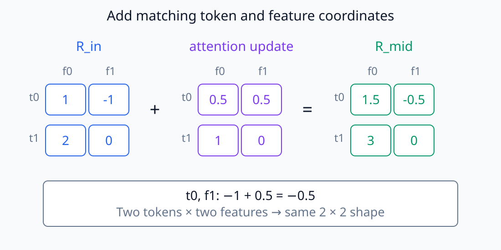
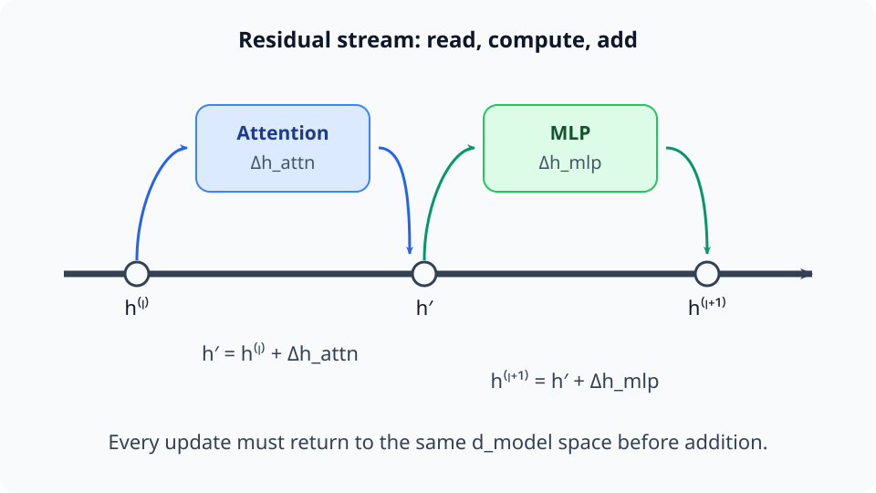
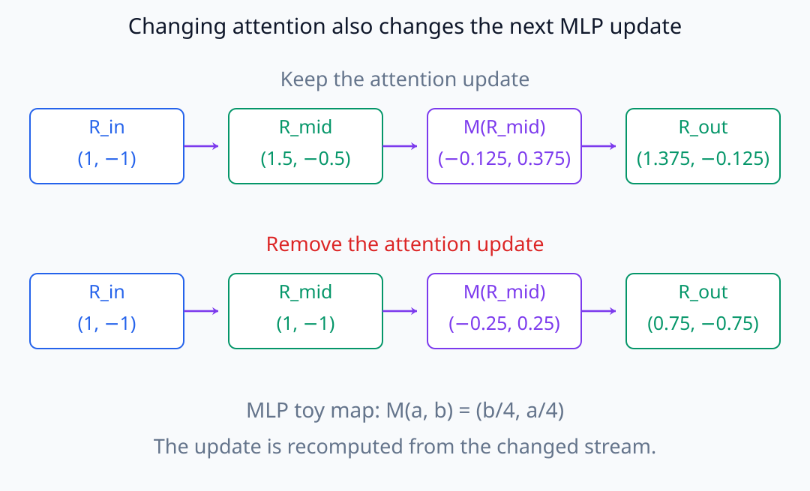
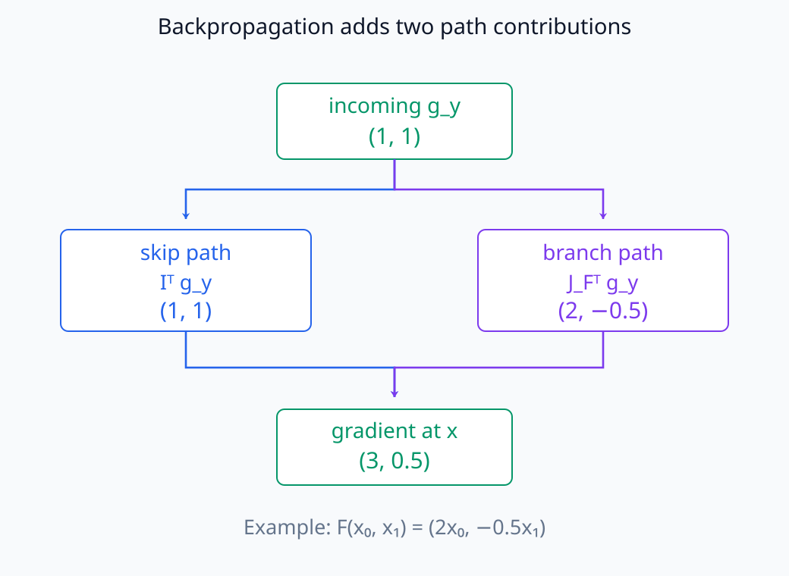
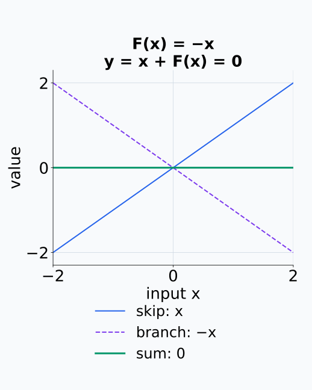
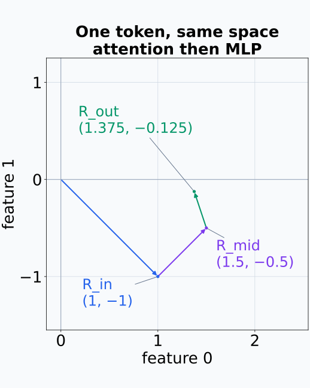
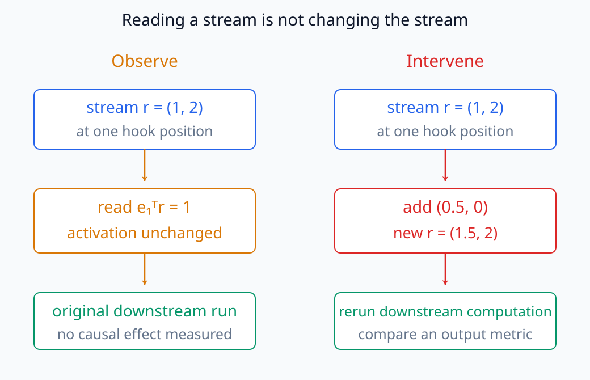

# N05-17. residual stream

## 이 단원이 필요한 이유

Transformer block의 attention과 MLP는 새 hidden state를 처음부터 만드는 대신 같은 residual stream에 update를 더한다. 어느 activation을 관찰하거나 바꿨는지 말하려면 block input, sublayer output과 덧셈 뒤 stream을 구분해야 한다.

## 학습 목표

- residual update 식을 tensor shape과 함께 계산할 수 있다.
- attention·MLP output이 stream에 더해지는 순서를 추적할 수 있다.
- skip path가 gradient에 주는 항을 식으로 확인할 수 있다.
- residual stream 위치와 sublayer 내부 activation을 구분할 수 있다.
- stream decomposition의 관찰과 인과 주장을 구분할 수 있다.

## 선수지식 확인

- 선수 단원: [N05-16 MHA, MQA와 GQA](N05-16-mha-mqa-gqa.md)
- 확인 질문: attention output의 마지막 dimension이 residual input과 같아야 하는 이유를 설명할 수 있는가?

## 기호와 용어

| 기호·용어 | Common spoken reading | 의미 | shape·범위 |
|---|---|---|---|
| $\mathbf R^{(l)}$ | `R at layer l` | layer $l$ 입구의 residual stream | $\mathbb R^{B\times T\times d_{model}}$ |
| $\Delta\mathbf R_A$ | `attention update` | attention sublayer가 stream에 더하는 update | residual과 같은 shape |
| $\Delta\mathbf R_M$ | `MLP update` | MLP sublayer가 stream에 더하는 update | residual과 같은 shape |
| skip path | `skip path` | sublayer를 거치지 않고 항등적으로 이어지는 경로 | identity map |
| residual addition | `residual addition` | stream과 update의 원소별 덧셈 | shape-preserving |

## 핵심 개념 1. 같은 공간에 더한다

정규화 위치를 잠시 생략하면 한 block은

\[
\mathbf R_{mid}=\mathbf R_{in}+A(\mathbf R_{in}),
\qquad
\mathbf R_{out}=\mathbf R_{mid}+M(\mathbf R_{mid})
\]

로 적을 수 있다. $A$는 attention sublayer, $M$은 MLP sublayer다. 두 update가 더해지려면 $A$와 $M$의 최종 output dimension이 $d_{model}$이어야 한다.

`residual stream`은 별도의 module 이름이라기보다 block 사이를 이어 가며 update가 누적되는 표현 경로를 가리킨다.

덧셈은 같은 sample·token·feature 위치의 두 값을 합한다. 이어 붙이는 concatenation과 달리 axis 길이는 늘지 않으며 최종 update의 batch와 token axis도 stream과 맞아야 한다. attention 내부에서는 여러 head를 이어 붙이고 MLP 내부에서는 더 넓은 hidden dimension을 사용할 수 있지만, stream에 쓰기 전에는 projection으로 $d_{model}$ 좌표에 돌아온다. 내부 계산의 폭과 residual stream의 폭을 구분한다.

아래의 덧셈은 행과 열이 같은 원소끼리만 연결된다.

<figure class="lesson-figure lesson-figure--wide" markdown="1">

<figcaption>예제의 attention 덧셈이다. token 0의 feature 1에서 −1과 0.5를 합쳐 −0.5를 얻으며, 다른 행이나 열의 값을 끌어오지 않는다. 결과의 token 수와 feature 수는 모두 그대로다.</figcaption>
</figure>

## 핵심 개념 2. update를 따라가는 법

$\mathbf R_{mid}$를 볼 때는 attention output만 본 것이 아니다. 이전 stream과 attention update의 합을 본 것이다. 마찬가지로 $\mathbf R_{out}$은 입력, attention update와 MLP update가 누적된 결과다. 단, MLP update 자체도 $\mathbf R_{mid}$에 의존하므로 세 항을 독립적인 고정 vector처럼 취급하면 안 된다.

### 시각적 직관: 공통 공간을 읽고 다시 같은 공간에 쓴다

<figure class="lesson-figure lesson-figure--wide" markdown="1">

<figcaption>굵은 가로선은 같은 d_model 공간을 유지하는 residual stream이고, attention과 MLP는 현재 stream을 읽어 update를 계산한 뒤 같은 공간에 더한다.</figcaption>
</figure>

그림에서 attention과 MLP를 우회하는 가로 경로가 skip path다. 위쪽 branch는 이전 stream을 지우고 새 상태로 교체하지 않는다. branch가 계산한 $\Delta\mathbf R$을 기존 상태에 더한다. 따라서 hook 이름이 `attention output`인지 `residual post`인지에 따라 관찰하는 tensor의 의미가 달라진다.

한 block의 출력은 계산이 끝난 뒤에는

\[
\mathbf R_{out}
=
\mathbf R_{in}
+
\Delta\mathbf R_A
+
\Delta\mathbf R_M
\]

처럼 쓸 수 있다. 그러나 $\Delta\mathbf R_M=M(\mathbf R_{in}+\Delta\mathbf R_A)$이므로 attention update를 바꾸면 MLP update도 일반적으로 달라진다. 이 식은 최종 tensor의 덧셈 관계를 보여 주지만 component 사이의 독립성을 뜻하지 않는다.

attention update를 제거했을 때 뒤 MLP의 값도 다시 계산되는 모습을 예제의 선형 block으로 비교한다.

<figure class="lesson-figure lesson-figure--wide" markdown="1">

<figcaption>실습의 첫 token에 M(a,b)=(b/4,a/4)를 적용했다. attention update를 제거하면 MLP 입력이 (1,−1)로 돌아가므로 MLP update도 (−0.25,0.25)로 달라진다. 마지막 stream은 각 행의 R_mid와 M(R_mid)를 더한 값이다.</figcaption>
</figure>

## 핵심 개념 3. gradient의 skip term

단순 residual map $\mathbf y=\mathbf x+F(\mathbf x)$의 Jacobian은

\[
\frac{\partial\mathbf y}{\partial\mathbf x}
=\mathbf I+J_F(\mathbf x)
\]

이다. 역전파에는 sublayer Jacobian 경로뿐 아니라 identity path의 항이 있다. 이것이 gradient가 항상 안정적이라는 보장은 아니지만, skip path를 제거한 $J_F$만의 연쇄와는 다른 계산이다.

여러 residual block을 합성하면 gradient에는 각 block의 $\mathbf I+\mathbf J_{F_l}$가 연쇄적으로 나타난다. identity 항은 변화가 그대로 전달되는 경로를 제공하지만, 나머지 Jacobian과의 합이 상쇄되거나 여러 층의 곱에서 커질 가능성은 남는다. residual connection의 존재와 안정적인 최적화 결과를 같은 명제로 취급하지 않는다.

loss에서 돌아오는 열벡터 gradient를 쓰면 $\nabla_{\mathbf x}\mathcal L=\nabla_{\mathbf y}\mathcal L+J_F(\mathbf x)^\top\nabla_{\mathbf y}\mathcal L$이다. 첫 항은 skip path, 둘째 항은 branch에서 돌아온 기여이며 갈라진 경로의 미분을 더하는 규칙과 같다. 예를 들어 $F(\mathbf x)=-\mathbf x$이면 두 항이 상쇄되고 출력도 0이 된다. 기존 stream을 수식에 더한다고 그 정보가 출력에 그대로 보존되는 것은 아니다.

gradient가 입력에 도착하는 두 경로의 합을 수치로 따라가면 identity 항의 위치가 분명해진다.

<figure class="lesson-figure lesson-figure--wide" markdown="1">

<figcaption>별도의 선형 예시 F(x₀,x₁)=(2x₀,−0.5x₁)다. incoming gradient (1,1)은 skip에서 그대로, branch에서 (2,−0.5)로 돌아오고 입력에서 합쳐 (3,0.5)가 된다.</figcaption>
</figure>

상쇄 반례에서는 두 경로가 존재해도 최종 함수가 입력 변화에 반응하지 않는다.

<figure class="lesson-figure" markdown="1">

<figcaption>F(x)=−x이면 파란 skip 값과 보라 branch 값이 모든 입력에서 상쇄된다. 초록 output은 y=0인 수평선이며 전체 derivative도 0이다.</figcaption>
</figure>

## 예제

실습은 두 token의 2차원 stream에 선형 attention update와 MLP update를 차례로 더한다.

\[
\mathbf R_{in}=
\begin{bmatrix}1&-1\\2&0\end{bmatrix},
\quad
\Delta\mathbf R_A=
\begin{bmatrix}0.5&0.5\\1&0\end{bmatrix}
\]

이면 $\mathbf R_{mid}=\begin{bmatrix}1.5&-0.5\\3&0\end{bmatrix}$다. MLP update를 더한 최종 stream은

\[
\mathbf R_{out}=
\begin{bmatrix}1.375&-0.125\\3&0.75\end{bmatrix}
\]

이다.

첫 token의 두 덧셈을 같은 좌표계에 놓으면 update가 새 벡터로 교체하는 연산이 아니라 현재 위치에서의 이동으로 보인다.

<figure class="lesson-figure" markdown="1">

<figcaption>첫 token은 (1,−1)에서 attention update (0.5,0.5)를 더해 (1.5,−0.5)로, MLP update (−0.125,0.375)를 더해 (1.375,−0.125)로 이동한다. 축은 layer가 아니라 두 feature 좌표다.</figcaption>
</figure>

## 실행 실습

### 실행 환경과 원본

- 환경: Python 3.12, PyTorch 2.13.0 CPU, NumPy 2.5.3
- 확인일: 2026-10-01
- 구성요소 등급: `Stable core`
- 예제 ID: `n05_17_residual_stream`
- 코드 원본: `labs/N05/n05_17_residual_stream.py`
- 테스트: `tests/N05/test_n05_17.py`
- 실행 명령: `.venv\Scripts\python.exe -m labs.N05.n05_17_residual_stream`

### 자원 예산

batch 1, sequence length 2, model dimension 2와 block 1개에 해당하는 계산만 수행한다.

### 실제 코드와 실행 결과

<!-- N05_EXAMPLE: n05_17_residual_stream -->

### 검사

테스트는 두 residual addition의 값과 input stream에 대한 loss gradient를 손계산에 대조한다.

## 모델 해석과의 연결

residual stream을 특정 방향으로 projection하면 그 방향의 성분이 layer를 따라 어떻게 바뀌는지 관찰할 수 있다. 이때 layer 사이 차이는 해당 구간의 update와 연결되지만, projection 값 하나가 독립된 의미 단위임을 자동으로 보장하지 않는다.

stream에 vector를 더하거나 component output을 제거하는 것은 실제 activation을 바꾸는 intervention이다. 반면 stream을 읽어 plot만 만드는 것은 관찰이다. 두 증거를 같은 강도로 보고하지 않는다.

아래는 같은 hook 위치에서 수치를 읽는 동작과 activation을 바꾸는 동작을 나란히 놓은 것이다.

<figure class="lesson-figure lesson-figure--wide" markdown="1">

<figcaption>관찰은 r=(1,2)의 첫 좌표 1을 읽어도 원래 실행을 바꾸지 않는다. 개입은 (0.5,0)을 더해 r=(1.5,2)로 바꾼 뒤 downstream 계산과 평가값의 변화를 확인하는 조작이다. 행동 효과 수치는 이 그림에서 가정하지 않는다.</figcaption>
</figure>

## 흔한 오해

### 오해 1. residual stream은 attention output이다

attention output은 stream에 더하는 update다. 덧셈 뒤 stream은 이전 stream 항을 포함하지만 update와 상쇄될 수 있으므로 이전 정보의 보존까지 자동으로 보장하지는 않는다.

### 오해 2. layer output을 component별 고정 vector의 합으로만 보면 충분하다

뒤 component의 update는 앞에서 갱신된 stream에 의존한다. 계산 순서를 함께 봐야 한다.

### 오해 3. identity path가 있으므로 gradient vanishing은 불가능하다

Jacobian에 identity term이 생기지만 전체 network의 normalization, sublayer Jacobian과 loss curvature가 여전히 영향을 준다.

## 연습문제

### 1. shape 조건

residual이 `(2,5,8)`이면 attention output projection의 최종 shape는?

해설 보기
원소별로 더해야 하므로 `(2,5,8)`이다.

### 2. 한 번의 update

$r=(1,2)$, attention update가 $(-0.5,1)$이면 덧셈 뒤 stream은?

해설 보기
$(0.5,3)$이다.

### 3. 두 번의 update

앞 결과에 MLP update $(2,-1)$을 더하라.

해설 보기
$(2.5,2)$다.

### 4. Jacobian

$F(x)=2x$이고 $y=x+F(x)$이면 $dy/dx$는?

해설 보기
$1+2=3$이다. 1은 skip path의 derivative다.

### 5. hook 위치

attention이 stream에 쓴 update만 저장하려면 덧셈 전후 stream 중 하나만 저장해도 충분한가?

해설 보기
두 stream의 차이를 취하면 update를 얻을 수 있지만 normalization이나 다른 연산이 사이에 없는지 확인해야 한다. 가장 직접적인 위치는 attention output projection 뒤, residual addition 전이다.

### 6. 주장 비판

한 방향의 residual projection이 커졌으므로 그 feature가 행동의 원인이라는 주장을 평가하라.

해설 보기
방향 성분의 변화는 관찰이다. 행동과의 인과 관계에는 해당 방향을 조작하고 적절한 대조군과 output 변화를 확인하는 절차가 필요하다.

## 근거와 갱신 경계

residual connection을 둔 Transformer block은 [Attention Is All You Need](https://arxiv.org/abs/1706.03762)에 근거한다. residual stream을 component update가 쓰고 읽는 공통 공간으로 분석하는 표기는 [A Mathematical Framework for Transformer Circuits](https://transformer-circuits.pub/2021/framework/index.html)를 참고한다. module 이름과 hook 위치는 구현마다 다르다.

## 단원 요약

- attention과 MLP는 같은 residual stream에 update를 더한다.
- sublayer output과 덧셈 뒤 stream은 다른 activation이다.
- residual Jacobian에는 identity path 항이 있다.
- 뒤 update는 앞에서 갱신된 stream에 의존한다.
- stream 관찰과 stream intervention은 서로 다른 증거다.

## 통과 기준

- residual update를 shape과 함께 계산할 수 있는가?
- block 안의 stream 위치를 순서대로 표시할 수 있는가?
- residual Jacobian의 identity term을 설명할 수 있는가?
- component output과 stream을 구분할 수 있는가?
- 관찰과 intervention 주장을 구분할 수 있는가?

## 다음 단원

- [N05-18 LayerNorm, RMSNorm과 residual 순서](N05-18-layernorm-rmsnorm-residual-order.md)

## 집필자 점검표

- [x] 학습 목표가 관찰 가능한 행동으로 작성됐다.
- [x] residual update와 gradient path를 연결했다.
- [x] 모든 문제에 해설이 있다.
- [x] 모델 해석 주장의 강도를 구분했다.
- [x] 용어집과 표기 규칙을 따랐다.
- [x] Common spoken reading이 실제 영어 학술 발화이며 한글 음역이나 기계적 직역을 포함하지 않는다.
- [x] 선수지식 밖의 내용을 몰래 요구하지 않는다.
- [x] 내부 링크와 수식 렌더링을 확인했다.
- [x] Markdown에 실행 코드를 손으로 복제하지 않았다.
- [x] 코드 원본·테스트 경로·자원 예산·확인일을 기록했다.
- [x] shape·수치·gradient test가 있다.

