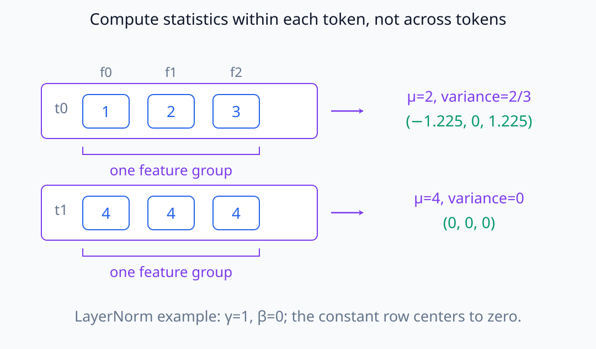
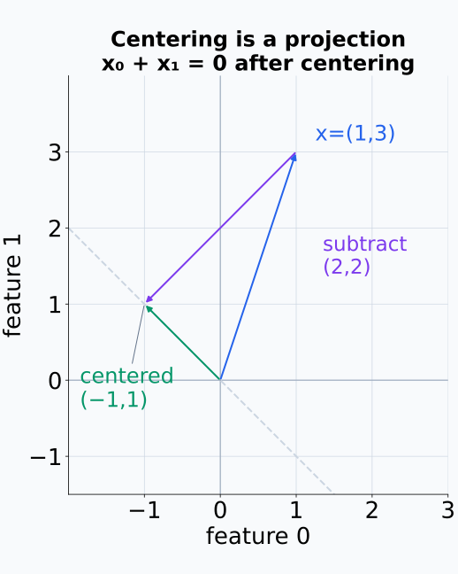
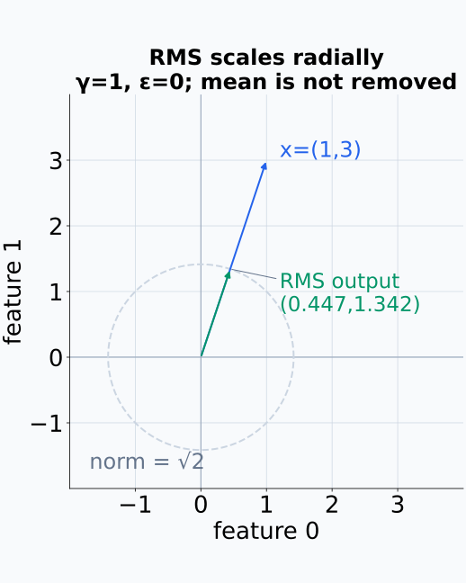
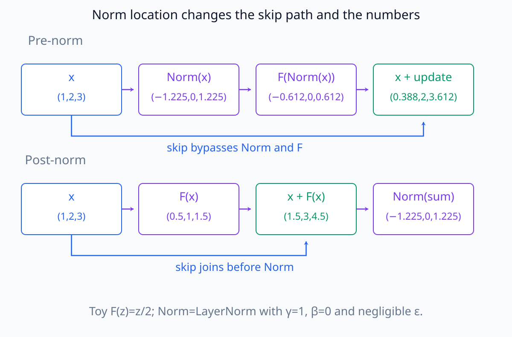
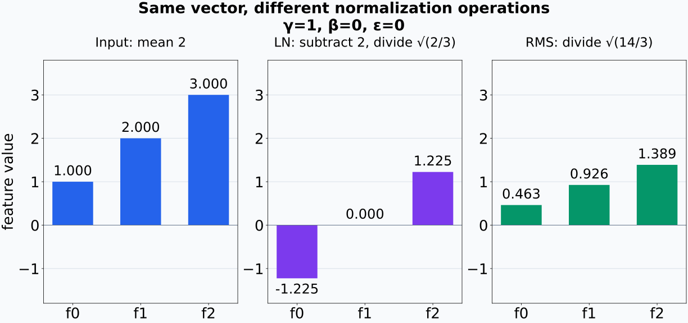
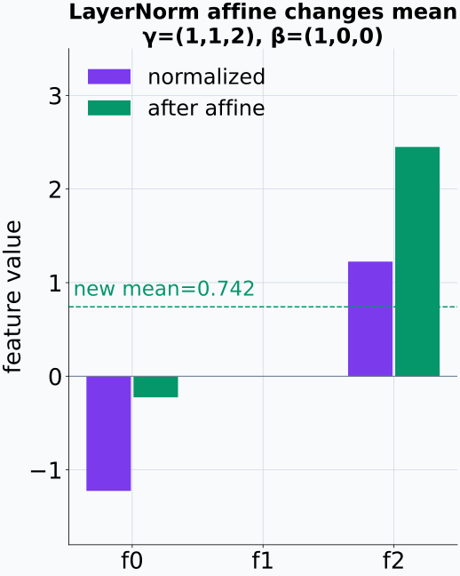
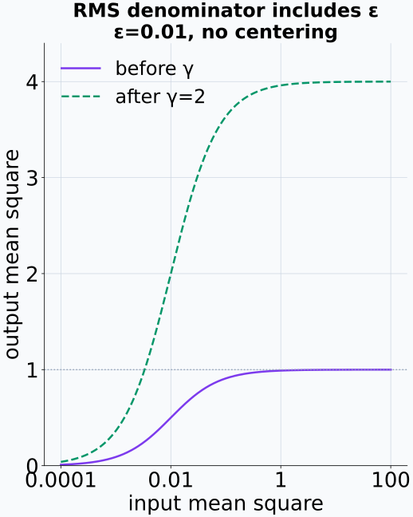
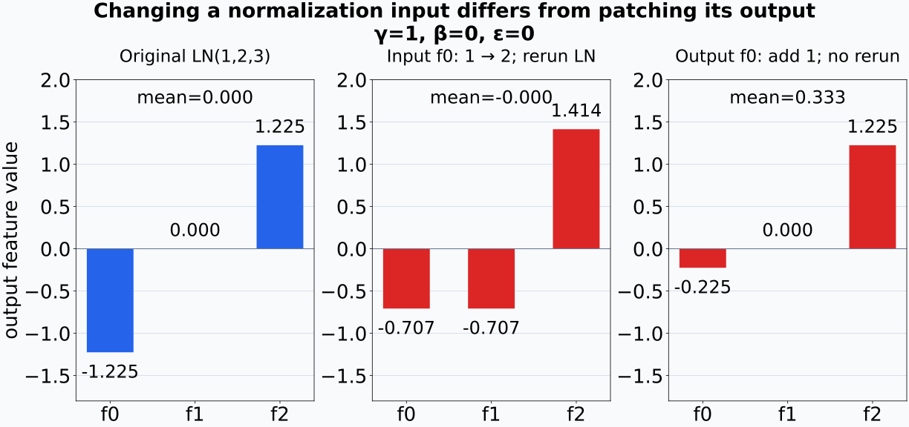

# N05-18. LayerNorm, RMSNorm과 residual 순서

## 이 단원이 필요한 이유

normalization의 종류와 위치는 block의 수식, activation scale과 hook 의미를 바꾼다. `norm output`, `residual input`과 `block output`을 같은 것으로 취급하면 모델 구조를 잘못 읽게 된다.

## 학습 목표

- LayerNorm과 RMSNorm을 작은 vector에 계산할 수 있다.
- centering 유무와 학습 parameter를 구분할 수 있다.
- pre-norm과 post-norm block 식을 순서대로 쓸 수 있다.
- normalization axis와 output shape를 확인할 수 있다.
- 서로 다른 norm 위치의 activation을 직접 비교할 때의 한계를 설명할 수 있다.

## 선수지식 확인

- 선수 단원: [N05-17 residual stream](N05-17-residual-stream.md)
- 확인 질문: sublayer output과 residual addition 뒤 stream을 구분할 수 있는가?

## 기호와 용어

| 기호·용어 | Common spoken reading | 의미 | shape·범위 |
|---|---|---|---|
| $\mu$ | `mu` | 한 token vector의 feature mean | scalar |
| $\sigma^2$ | `sigma squared` | feature variance | nonnegative scalar |
| $\operatorname{RMS}(\mathbf x)$ | `the root mean square of x` | feature 제곱평균의 제곱근 | nonnegative scalar |
| $\boldsymbol\gamma$ | `gamma` | feature별 learned scale | $\mathbb R^{d_{model}}$ |
| pre-norm | `pre-norm` | sublayer 전에 normalization하는 순서 | architecture choice |
| post-norm | `post-norm` | residual addition 뒤 normalization하는 순서 | architecture choice |

## 핵심 개념 1. LayerNorm

feature dimension이 $d$인 token vector $\mathbf x$에 대해

\[
\mu=\frac1d\sum_{j=1}^{d}x_j,
\qquad
\sigma^2=\frac1d\sum_{j=1}^{d}(x_j-\mu)^2
\]

로 두면

\[
\operatorname{LN}(\mathbf x)
=\boldsymbol\gamma\odot
\frac{\mathbf x-\mu\mathbf 1}{\sqrt{\sigma^2+\epsilon}}
+\boldsymbol\beta
\]

이다. centering과 rescaling을 모두 한다. 보통 각 token의 마지막 feature axis에서 통계를 계산한다.

여기서 $\boldsymbol\beta\in\mathbb R^d$는 feature별 learned shift이고 $\epsilon>0$은 분모를 보호하는 작은 상수다. 평균과 variance는 한 token의 $d$개 성분으로 계산하며 다른 sample이나 token의 값을 섞지 않는다. variance의 분모 $d$는 이 성분들의 제곱편차 평균을 뜻한다. 모집단 variance의 불편 추정량을 구하는 문제가 아니므로 $d-1$로 바꾸지 않는다.

통계를 묶는 범위는 아래에서 한 행을 감싼 feature group으로 표시했다.

<figure class="lesson-figure lesson-figure--wide" markdown="1">

<figcaption>두 token의 feature 세 개를 각각 묶는다. 첫 행의 평균은 2, 둘째 행의 평균은 4이며 서로 섞지 않는다. γ=1, β=0, ε>0에서 상수 행은 centering 뒤 0이 된다.</figcaption>
</figure>

centering한 vector의 성분 합은 0이고 공통 분모로 나눈 뒤에도 mean은 0이다. 그러나 feature마다 다른 $\gamma_j$를 곱하고 $\beta_j$를 더하면 최종 mean은 달라질 수 있다. 모든 입력 성분이 같으면 centered vector와 variance가 모두 0이 되어 위 식의 출력은 $\boldsymbol\beta$다. 정규화 중간 값의 성질과 learned affine 변환 뒤 성질을 구분한다.

2차원에서 mean을 빼는 단계만 떼어 보면 평균 방향을 제거한 위치로 이동한다.

<figure class="lesson-figure" markdown="1">

<figcaption>x=(1,3)에서 μ=2를 두 좌표 모두 빼면 (−1,1)이 된다. 보라 화살표는 (−2,−2)의 이동이고 점선은 두 좌표 합이 0인 직선이다. 이후의 variance rescaling은 아직 적용하지 않았다.</figcaption>
</figure>

## 핵심 개념 2. RMSNorm

\[
\operatorname{RMS}(\mathbf x)
=\sqrt{\frac1d\sum_{j=1}^{d}x_j^2+\epsilon},
\qquad
\operatorname{RMSNorm}(\mathbf x)
=\boldsymbol\gamma\odot\frac{\mathbf x}{\operatorname{RMS}(\mathbf x)}
\]

이다. mean을 빼지 않으므로 일반적으로 output mean은 0이 아니다. bias 사용 여부는 구현에 따라 다르지만 기준 RMSNorm 식은 learned scale을 사용한다.

위 분모는 제곱평균에 $\epsilon$을 더한 regularized RMS다. $\epsilon=0$일 때 통상적인 root mean square와 같으며 입력이 0이 아니어야 나눗셈을 할 수 있다. 이 경우 learned scale을 적용하기 전에는 출력의 제곱평균이 1이고 Euclidean norm은 $\sqrt d$다. 양의 $\epsilon$을 넣으면 제곱평균은 1보다 작아지고, learned scale 뒤에는 feature별 배율에 따라서도 달라진다. RMSNorm은 한 vector에 공통 분모를 쓰지만 그 mean을 제거하지 않는다.

RMS로 나누는 단계는 원점에서의 방향을 유지한 채 길이를 바꾼다.

<figure class="lesson-figure" markdown="1">

<figcaption>γ=1, ε=0인 2차원 예시다. (1,3)을 RMS √5로 나누면 약 (0.447,1.342)가 된다. mean은 제거하지 않고 Euclidean norm은 1이 아니라 √2인 점선 원 위에 놓인다.</figcaption>
</figure>

## 핵심 개념 3. residual 순서

하나의 sublayer $F$에 대한 대표식은 다음과 같다.

\[
\text{pre-norm:}\quad
\mathbf y=\mathbf x+F(\operatorname{Norm}(\mathbf x))
\]

\[
\text{post-norm:}\quad
\mathbf y=\operatorname{Norm}(\mathbf x+F(\mathbf x))
\]

연산 순서가 다르므로 weight가 같아도 일반적으로 같은 함수가 아니다. 원래 Transformer는 post-norm 식을 사용했고 현대 decoder에는 pre-norm 계열도 널리 쓰인다. 실제 모델은 config와 forward code로 확인한다.

pre-norm에서는 $F$가 정규화된 입력을 받지만 skip path의 $\mathbf x$는 정규화하지 않은 채 더한다. post-norm에서는 $F$가 원래 입력을 받고 덧셈한 결과 전체를 정규화한다. 따라서 pre-norm의 덧셈 뒤 stream은 normalized vector일 필요가 없다. post-norm의 skip 항도 마지막 Norm을 통과하므로 backward 경로를 단순한 identity 항으로만 읽을 수 없다.

두 순서를 같은 toy sublayer에 적용하면 skip이 합쳐지는 위치와 최종 수치가 함께 달라진다.

<figure class="lesson-figure lesson-figure--wide" markdown="1">

<figcaption>F(z)=z/2, γ=1, β=0인 LayerNorm을 사용하고 ε는 무시할 만큼 작다고 둔 예시다. pre-norm의 원래 x는 Norm을 우회해 마지막에 더해지지만 post-norm에서는 합 전체가 Norm에 들어간다.</figcaption>
</figure>

## 예제

$\mathbf x=(1,2,3)$, $\gamma=1$, $\beta=0$이고 작은 $\epsilon$만 둔다. LayerNorm은 mean 2를 빼므로 약

\[
(-1.2247,0,1.2247)
\]

이 된다. RMSNorm은 mean을 빼지 않아 약

\[
(0.4629,0.9258,1.3887)
\]

이다. 두 결과는 shape가 같지만 보존하는 정보와 scale 기준이 다르다.

예제의 같은 feature 좌표를 비교하면 centering 유무가 부호와 크기에 어떻게 드러나는지 볼 수 있다.

<figure class="lesson-figure lesson-figure--wide" markdown="1">

<figcaption>예제의 x=(1,2,3)을 같은 축 범위로 그렸다. LayerNorm은 mean 2를 뺀 뒤 scale하고 RMSNorm은 양수 성분을 공통 분모로 나눈다. 비교를 위해 γ=1, β=0, ε=0으로 이상화했다.</figcaption>
</figure>

## 실행 실습

### 실행 환경과 원본

- 환경: Python 3.12, PyTorch 2.13.0 CPU, NumPy 2.5.3
- 확인일: 2026-10-01
- 구성요소 등급: `Common modern variant`
- 예제 ID: `n05_18_normalization_order`
- 코드 원본: `labs/N05/n05_18_normalization_order.py`
- 테스트: `tests/N05/test_n05_18.py`
- 실행 명령: `.venv\Scripts\python.exe -m labs.N05.n05_18_normalization_order`

### 자원 예산

batch 1, token 2개, model dimension 3의 normalization과 단일 sublayer 순서만 계산한다.

### 실제 코드와 실행 결과

<!-- N05_EXAMPLE: n05_18_normalization_order -->

### 검사

테스트는 LayerNorm output mean, RMSNorm output의 mean square와 pre-norm·post-norm output 차이를 확인한다.

## epsilon과 learned scale

$\epsilon$은 variance나 mean square가 매우 작을 때 0으로 나누는 것을 막는다. 구현마다 기본값과 제곱근 안팎의 위치가 다를 수 있으므로 수치 재현에는 정확한 식이 필요하다. $\gamma$를 적용한 최종 output의 RMS는 일반적으로 1이 아니다. `normalized`라는 말이 모든 feature의 절댓값이나 norm이 고정된다는 뜻은 아니다.

정규화 중간 값에 learned affine을 적용한 경우와 ε가 작지 않은 경우를 따로 비교한다.

<figure class="lesson-figure" markdown="1">

<figcaption>x=(1,2,3)의 정규화 중간 값에 γ=(1,1,2), β=(1,0,0)을 적용했다. 초록 점선으로 표시한 최종 mean은 약 0.742로 0이 아니다.</figcaption>
</figure>

<figure class="lesson-figure" markdown="1">

<figcaption>RMSNorm의 분모에 ε=0.01을 넣었다. 입력 제곱평균이 ε보다 작으면 정규화 뒤 제곱평균도 1보다 훨씬 작다. 모든 feature에 γ=2를 곱하면 제곱평균은 다시 네 배가 된다.</figcaption>
</figure>

## 모델 해석과의 연결

pre-norm 모델의 sublayer input hook은 normalized activation을 보고, residual stream hook은 normalization 전 stream을 볼 수 있다. 둘의 coordinate와 scale이 다르므로 이름만 `hidden state`라고 맞춰 직접 비교하면 안 된다.

normalization 입력의 한 좌표를 바꾸고 Norm을 다시 계산하면 mean이나 공통 denominator도 바뀌어 다른 출력 좌표까지 달라질 수 있다. 반면 normalization 뒤 tensor의 한 좌표를 직접 patch하면 Norm을 다시 계산하는 것이 아니다. 두 개입은 서로 다른 계산 위치를 바꾸며, 후자의 tensor는 원래 정규화가 만든 성질을 만족하지 않을 수도 있다.

아래에서는 같은 feature 하나를 정규화 전과 후에 바꾼 결과를 비교한다.

<figure class="lesson-figure lesson-figure--wide" markdown="1">

<figcaption>원래 x=(1,2,3)에서 입력의 첫 좌표를 2로 바꾸고 LayerNorm을 다시 계산하면 세 출력 좌표가 모두 변한다. 반면 기존 output의 첫 좌표에 1을 더하면 나머지 두 좌표는 그대로이며 mean은 0.333이 된다. γ=1, β=0, ε=0인 계산이다.</figcaption>
</figure>

## 흔한 오해

### 오해 1. RMSNorm도 mean을 0으로 만든다

RMSNorm은 제곱평균으로 scale하지만 centering하지 않는다.

### 오해 2. pre-norm과 post-norm은 식을 보기 좋게 바꾼 표기다

normalization과 nonlinear sublayer의 합성 순서가 다르므로 함수와 gradient path가 달라진다.

### 오해 3. normalization 뒤 각 token의 Euclidean norm은 항상 1이다

learned scale을 적용하기 전 RMS가 약 1이라는 것과 Euclidean norm 1은 다르다. dimension $d$에서는 RMS 1이면 norm은 $\sqrt d$다.

## 연습문제

### 1. LayerNorm mean

$x=(2,4,6)$의 feature mean은?

해설 보기
$(2+4+6)/3=4$다.

### 2. RMS

$x=(3,4)$이고 $\epsilon=0$이면 RMS는?

해설 보기
$\sqrt{(9+16)/2}=\sqrt{12.5}$다. Euclidean norm 5와 다르다.

### 3. centering

$x=(1,2,3)$에서 mean을 빼는 방식은 LayerNorm과 RMSNorm 중 어느 것인가?

해설 보기
LayerNorm이다.

### 4. pre-norm 순서

$x$, Norm, $F$와 덧셈 기호만 써 pre-norm 식을 적어라.

해설 보기
$y=x+F(\operatorname{Norm}(x))$다.

### 5. axis 진단

input shape가 `(batch, sequence, model)`일 때 token별 LayerNorm의 통계 axis는?

해설 보기
마지막 model feature axis다. batch나 sequence를 함께 평균내지 않는다.

### 6. hook 비교

normalization 전 residual과 normalization 뒤 sublayer input의 cosine similarity가 낮아졌다고 feature가 사라졌다고 말할 수 있는가?

해설 보기
바로 말할 수 없다. centering·rescaling과 learned scale이 좌표값을 바꿨으므로 같은 위치의 표현과 행동을 추가로 검사해야 한다.

## 근거와 갱신 경계

LayerNorm 정의는 [Layer Normalization](https://arxiv.org/abs/1607.06450), 원래 Transformer의 residual 순서는 [Attention Is All You Need](https://arxiv.org/abs/1706.03762), RMSNorm 정의는 [Root Mean Square Layer Normalization](https://arxiv.org/abs/1910.07467)에 근거한다. epsilon, bias와 norm 위치는 모델 config와 구현을 확인해야 하는 architecture-specific 항목이다.

## 단원 요약

- LayerNorm은 centering과 rescaling을 한다.
- RMSNorm은 mean을 빼지 않고 root mean square로 scale한다.
- pre-norm과 post-norm은 normalization의 계산 위치가 다르다.
- epsilon과 learned scale 때문에 이상화한 정규화 성질을 그대로 가정하면 안 된다.
- hook activation을 비교하기 전에 normalization 전후 위치를 확인한다.

## 통과 기준

- 두 normalization을 작은 vector에 계산할 수 있는가?
- centering 유무를 설명할 수 있는가?
- pre-norm·post-norm 식을 쓸 수 있는가?
- normalization axis와 shape를 확인할 수 있는가?
- norm 위치가 다른 activation 비교의 한계를 말할 수 있는가?

## 다음 단원

- [N05-19 dense MLP, SwiGLU와 expert routing](N05-19-dense-mlp-swiglu-expert-routing.md)

## 집필자 점검표

- [x] 학습 목표가 관찰 가능한 행동으로 작성됐다.
- [x] LayerNorm·RMSNorm과 residual 순서를 구분했다.
- [x] 모든 문제에 해설이 있다.
- [x] 모델 해석 주장의 강도를 구분했다.
- [x] 용어집과 표기 규칙을 따랐다.
- [x] Common spoken reading이 실제 영어 학술 발화이며 한글 음역이나 기계적 직역을 포함하지 않는다.
- [x] 선수지식 밖의 내용을 몰래 요구하지 않는다.
- [x] 내부 링크와 수식 렌더링을 확인했다.
- [x] Markdown에 실행 코드를 손으로 복제하지 않았다.
- [x] 코드 원본·테스트 경로·자원 예산·확인일을 기록했다.
- [x] normalization invariant와 순서 test가 있다.

