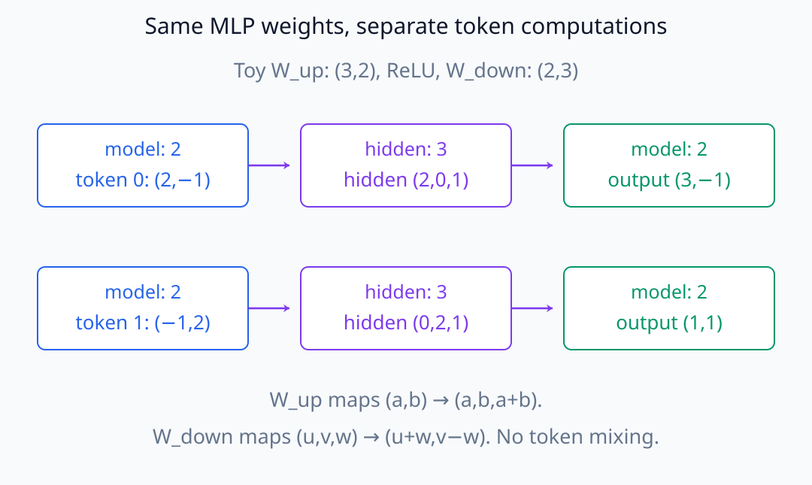
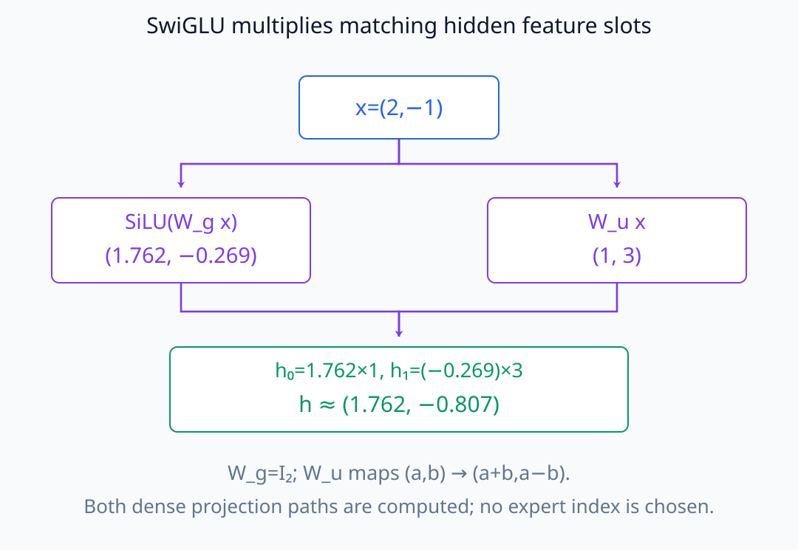
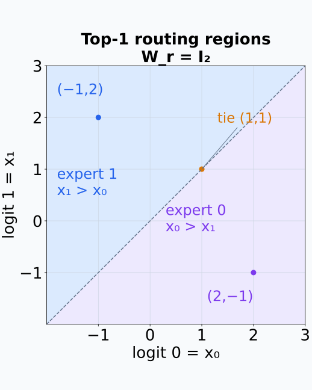
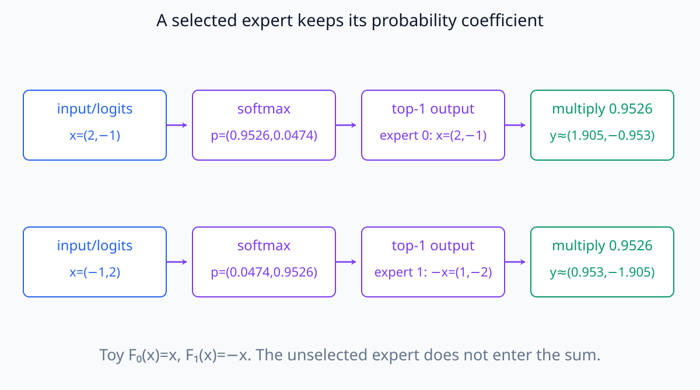
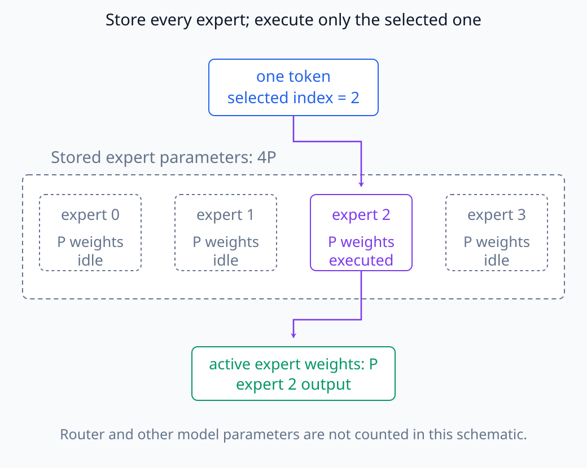
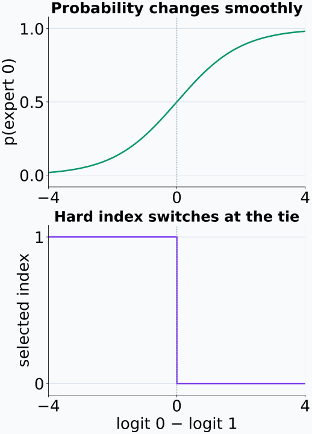

# N05-19. dense MLP, SwiGLU와 expert routing

## 이 단원이 필요한 이유

Transformer의 token별 feed-forward 계산은 모두 같은 parameter를 쓰는 dense MLP일 수도 있고, router가 선택한 expert만 쓰는 sparse MoE일 수도 있다. SwiGLU의 gate와 MoE router를 같은 `gate`라는 말로 뭉뚱그리면 서로 다른 계산을 혼동한다.

## 학습 목표

- dense MLP와 SwiGLU의 forward 식과 shape를 계산할 수 있다.
- SwiGLU의 두 input projection 역할을 구분할 수 있다.
- top-1 expert routing의 probability와 선택 결과를 계산할 수 있다.
- dense parameter 수와 token당 활성화되는 expert parameter를 구분할 수 있다.
- router score 관찰과 expert의 인과 기여를 구분할 수 있다.

## 선수지식 확인

- 선수 단원: [N05-18 LayerNorm, RMSNorm과 residual 순서](N05-18-layernorm-rmsnorm-residual-order.md)
- 확인 질문: token별 linear projection과 elementwise activation의 shape를 계산할 수 있는가?

## 기호와 용어

| 기호·용어 | Common spoken reading | 의미 | shape·범위 |
|---|---|---|---|
| $d_{ff}$ | `d sub f f` | feed-forward hidden dimension | positive integer |
| $\operatorname{SiLU}$ | `sigh-loo` | $z\,\sigma(z)$인 activation | elementwise |
| $\odot$ | `elementwise product` | 같은 shape tensor의 원소별 곱 | shape-preserving |
| $p_e(\mathbf x)$ | `the routing probability for expert e` | router가 expert $e$에 주는 probability | $[0,1]$ |
| top-1 routing | `top-one routing` | token마다 가장 높은 expert 하나를 선택하는 규칙 | discrete selection |
| expert | `expert` | MoE에서 선택적으로 실행되는 feed-forward subnetwork | architecture-specific |

## 핵심 개념 1. dense MLP

기본 feed-forward layer는 token마다 같은 parameter를 적용한다.

\[
\operatorname{MLP}(\mathbf x)
=\mathbf W_{down}\,\phi(\mathbf W_{up}\mathbf x+\mathbf b_{up})
+\mathbf b_{down}
\]

row-vector convention에서는 weight transpose 위치가 바뀐다. 입력과 출력은 $d_{model}$, 중간 activation은 $d_{ff}$ dimension이다. `dense`는 모든 token이 같은 MLP parameter 전체를 사용한다는 뜻이다.

$\mathbf W_{up}$은 $(d_{ff},d_{model})$, $\mathbf W_{down}$은 $(d_{model},d_{ff})$ shape다. 첫 projection은 model 좌표들을 섞어 hidden feature를 만들고 activation은 그 위치마다 적용하며 둘째 projection은 hidden feature를 다시 stream 좌표로 섞는다. 이 식은 다른 token 위치를 직접 합하지 않는다. 같은 weight를 쓰더라도 입력 vector가 다르면 각 token의 hidden 값과 update도 달라질 수 있다.

같은 weight로 두 token을 계산한 아래 예시에서도 행 사이의 화살표는 없다.

<figure class="lesson-figure lesson-figure--wide" markdown="1">

<figcaption>bias가 없는 별도의 ReLU toy MLP다. 두 token에 같은 up·down weight를 쓰지만 hidden 값과 output은 다르다. model dimension 2에서 hidden dimension 3으로 갔다가 다시 2로 돌아온다.</figcaption>
</figure>

## 핵심 개념 2. SwiGLU

SwiGLU는 중간 표현을 두 projection의 원소별 곱으로 만든다.

\[
\mathbf h=\operatorname{SiLU}(\mathbf W_g\mathbf x)
\odot(\mathbf W_u\mathbf x),
\qquad
\mathbf y=\mathbf W_d\mathbf h
\]

$\mathbf W_g$ 경로는 SiLU를 거친 gate, $\mathbf W_u$ 경로는 gate가 조절할 content를 만든다. 두 projection output은 모두 $d_{ff}$여야 한다.

같은 hidden 위치의 두 숫자를 곱해 $\mathbf h$를 만들고 $\mathbf W_d$로 $d_{model}$에 돌아온다. bias를 제외하면 gate와 content에 각각 $d_{model}d_{ff}$개, down projection에 같은 수의 weight가 있어 총 $3d_{model}d_{ff}$개다. ordinary MLP의 두 projection과는 parameter 수부터 다르다. SwiGLU는 같은 폭의 MLP에 scalar activation만 교체한 계산이 아니다.

gate가 한 위치의 값을 0으로 만들 수 있어도 dense projection 자체에서 expert를 선택해 건너뛰는 것은 아니다. feature별 content를 조절하는 곱과 다음 절의 subnetwork 선택을 구분한다.

실습의 첫 token에서는 두 projection의 같은 hidden 위치를 곱한다.

<figure class="lesson-figure lesson-figure--wide" markdown="1">

<figcaption>x=(2,−1)에 대한 실습의 중간 계산이다. SiLU gate 약 (1.762,−0.269)와 content (1,3)을 위치별로 곱한다. 음수 gate도 가능하며 expert index를 고르는 단계는 없다.</figcaption>
</figure>

## 핵심 개념 3. expert routing

$E$개 expert가 있을 때 router는

\[
\mathbf p(\mathbf x)=\operatorname{softmax}(\mathbf W_r\mathbf x),
\qquad
e^*=\operatorname*{argmax}_e p_e(\mathbf x)
\]

를 계산한다. 단순한 top-1 예에서는

\[
\mathbf y=p_{e^*}(\mathbf x)F_{e^*}(\mathbf x)
\]

로 선택된 expert output만 사용한다. 실제 MoE에는 capacity, load balancing, dropped token과 통신 같은 추가 규칙이 있을 수 있다.

SwiGLU gate는 한 MLP 내부의 featurewise multiplication이고, MoE router는 여러 parameterized subnetwork 중 실행 경로를 정한다.

router matrix의 shape는 $(E,d_{model})$이고 expert마다 logit 하나를 만든다. softmax의 합은 모든 expert에 대해 1이지만 위 toy 식은 선택한 하나의 probability만 사용한다. 그 계수는 일반적으로 1보다 작으며 선택했다는 이유로 자동으로 1로 바뀌지 않는다. 선택된 expert의 출력에 어떤 계수를 곱하거나 다시 정규화하는지는 별도의 설계 선택이다.

expert를 바꾸지 않는 입력 구간에서는 선택 index가 그대로이고 probability와 expert output은 입력에 따라 변한다. 최대 후보가 바뀌는 경계에서는 hard 선택이 바뀐다. 같은 expert index가 나온 사실과 같은 forward 값이 나온 사실은 서로 다르다. 동점일 때에는 어떤 index를 택할지도 정해야 계산을 재현할 수 있다.

coordinate axis를 router weight로 쓰면 선택 경계가 두 logit이 같은 직선으로 나타난다.

<figure class="lesson-figure" markdown="1">

<figcaption>W_r=I₂인 예제다. x₀>x₁인 영역은 expert 0, x₁>x₀인 영역은 expert 1을 선택한다. (1,1)은 동점이어서 tie-breaking 규칙이 필요하다.</figcaption>
</figure>

## 예제

두 expert의 router weight를 coordinate axis로 두고 token $(2,-1)$을 넣으면 logits는 $(2,-1)$이다. softmax probability는 약 $(0.9526,0.0474)$이므로 expert 0을 선택한다. token $(-1,2)$는 반대로 expert 1을 선택한다. 같은 batch 안에서도 token별 경로가 달라질 수 있다.

선택 뒤에도 probability 계수를 남겨 두는 실습의 계산을 끝까지 따라간다.

<figure class="lesson-figure lesson-figure--wide" markdown="1">

<figcaption>실습의 F₀(x)=x와 F₁(x)=−x를 사용했다. 선택한 expert의 output에 약 0.9526을 곱하므로 expert output 자체와 최종 routed output은 다르다. 선택을 이유로 계수를 1로 바꾸지 않았다.</figcaption>
</figure>

## 실행 실습

### 실행 환경과 원본

- 환경: Python 3.12, PyTorch 2.13.0 CPU, NumPy 2.5.3
- 확인일: 2026-10-01
- 구성요소 등급: dense SwiGLU는 `Common modern variant`, expert routing은 `Architecture-specific`
- 예제 ID: `n05_19_mlp_routing`
- 코드 원본: `labs/N05/n05_19_mlp_routing.py`
- 테스트: `tests/N05/test_n05_19.py`
- 실행 명령: `.venv\Scripts\python.exe -m labs.N05.n05_19_mlp_routing`

### 자원 예산

token 3개, model dimension 2, hidden dimension 2와 expert 2개를 사용한다. training이나 dispatch 통신은 없다.

### 실제 코드와 실행 결과

<!-- N05_EXAMPLE: n05_19_mlp_routing -->

### 검사

테스트는 SwiGLU shape·수치, router probability row sum, top-1 expert index와 routed output을 확인한다.

## parameter와 계산량을 구분하기

MoE는 전체 expert parameter를 모두 저장하지만 token마다 일부 expert만 활성화할 수 있다. 따라서 total parameter count와 token당 실행 parameter 수는 다르다. dense MLP와 MoE를 비교할 때 parameter, FLOP, memory traffic, communication과 quality를 따로 기록해야 한다.

저장된 네 expert 가운데 한 token의 실행 경로만 활성화한 경우를 아래에 표시했다.

<figure class="lesson-figure lesson-figure--wide" markdown="1">

<figcaption>각 expert에 P개 weight가 있는 네-expert 개념도다. expert weight 4P를 저장하되 이 token은 expert 2의 P개만 실행한다. router와 다른 model parameter는 이 비교에서 제외했다.</figcaption>
</figure>

hard `argmax`의 선택 index는 동점이 없는 구간에서 국소적으로 일정하며 선택 경계에서 불연속일 수 있다. 이 index만으로 router를 조정할 연속적인 gradient를 얻지는 못한다. 실제 학습은 선택된 gate probability와 auxiliary loss 등을 통해 router를 학습한다. 이 단원의 toy routing은 그 전체 학습 알고리즘을 재현하지 않는다.

두 logit 차이를 연속적으로 바꾸면 probability와 hard index가 서로 다르게 반응한다.

<figure class="lesson-figure" markdown="1">

<figcaption>위는 expert 0 probability, 아래는 선택 index다. 같은 expert를 유지하는 구간에서도 probability는 변한다. 동점에서는 첫 index 0을 선택하도록 정한 toy 규칙이며 실제 router 학습 전체를 그린 것은 아니다.</figcaption>
</figure>

## 모델 해석과의 연결

SwiGLU hidden activation을 분석할 때 gate projection, up projection과 elementwise product 뒤 activation은 서로 다른 hook 위치다. expert model에서는 router logits, routing probability, 선택 index와 expert 내부 activation도 구분해야 한다.

한 expert가 특정 token에서 자주 선택됐다는 관찰은 그 expert가 해당 행동에 필요하다는 증거가 아니다. routing을 바꾸거나 expert output을 개입하고 load와 대조군을 통제해야 인과 주장을 할 수 있다.

## 흔한 오해

### 오해 1. SwiGLU는 expert를 선택한다

SwiGLU는 한 MLP 안에서 두 dense projection을 feature별로 곱한다. discrete expert 선택이 아니다.

### 오해 2. MoE는 parameter가 적어서 빠르다

전체 parameter는 매우 클 수 있다. token당 일부 expert만 계산해 conditional computation을 얻는다.

### 오해 3. router probability가 높은 expert가 의미를 독점한다

선택 빈도나 probability만으로 expert 내부 계산과 downstream 인과 효과를 알 수 없다.

## 연습문제

### 1. SwiGLU shape

$x:(7,8)$, $W_g$와 $W_u$가 각각 `(16,8)`이면 원소별 곱 직전 두 projection의 shape는?

해설 보기
row-vector convention에서 둘 다 `(7,16)`이다. shape가 같아야 원소별 곱을 할 수 있다.

### 2. output shape

앞 결과에 $W_d:(8,16)$을 적용하면 output shape는?

해설 보기
`(7,8)`이다. residual stream에 더할 수 있는 model dimension으로 돌아온다.

### 3. router probability

expert logits가 $(0,0)$이면 두 probability는?

해설 보기
softmax 결과는 $(0.5,0.5)$다.

### 4. tie

top-1 routing에서 같은 최대 logit이 둘이면 수학식만으로 선택 expert가 유일한가?

해설 보기
유일하지 않다. 구현의 tie-breaking 규칙이 필요하다. PyTorch `argmax`는 같은 최댓값 중 첫 index를 반환한다.

### 5. parameter 해석

expert가 8개이고 token당 1개만 실행하면 전체 expert parameter의 1/8만 저장해도 되는가?

해설 보기
아니다. 일반적으로 8개 expert parameter를 모두 저장하되 그 token의 forward에서는 하나만 선택해 계산한다.

### 6. 주장 비판

수학 token이 expert 3으로 자주 route되므로 expert 3이 수학 능력의 원인이라는 주장을 평가하라.

해설 보기
선택 빈도에 관한 상관 관찰이다. 입력 분포, router confidence, expert output 개입과 행동 대조가 없으므로 인과 결론은 성립하지 않는다.

## 근거와 갱신 경계

Transformer feed-forward sublayer는 [Attention Is All You Need](https://arxiv.org/abs/1706.03762), SwiGLU 식은 [GLU Variants Improve Transformer](https://arxiv.org/abs/2002.05202), top-1 routing의 대표 설계는 [Switch Transformers](https://arxiv.org/abs/2101.03961)에 근거한다. expert capacity, auxiliary loss와 dispatch kernel은 architecture와 구현에 따라 달라진다.

## 단원 요약

- dense MLP는 모든 token에 같은 feed-forward parameter를 적용한다.
- SwiGLU는 SiLU gate projection과 content projection을 원소별로 곱한다.
- MoE router는 token마다 실행할 expert를 선택한다.
- 전체 parameter와 token당 활성화되는 parameter는 다르다.
- routing 관찰만으로 expert의 인과 역할을 결론낼 수 없다.

## 통과 기준

- dense MLP와 SwiGLU의 shape를 계산할 수 있는가?
- SwiGLU gate와 expert router를 구분할 수 있는가?
- top-1 routing을 손으로 계산할 수 있는가?
- total parameter와 active parameter를 구분할 수 있는가?
- routing 관찰에 맞는 주장 강도를 선택할 수 있는가?

## 다음 단원

- [N05-20 decoder block과 architecture diff](N05-20-decoder-block-architecture-diff.md)

## 집필자 점검표

- [x] 학습 목표가 관찰 가능한 행동으로 작성됐다.
- [x] dense·SwiGLU·expert routing을 구분했다.
- [x] 모든 문제에 해설이 있다.
- [x] 모델 해석 주장의 강도를 구분했다.
- [x] 용어집과 표기 규칙을 따랐다.
- [x] Common spoken reading이 실제 영어 학술 발화이며 한글 음역이나 기계적 직역을 포함하지 않는다.
- [x] 선수지식 밖의 내용을 몰래 요구하지 않는다.
- [x] 내부 링크와 수식 렌더링을 확인했다.
- [x] Markdown에 실행 코드를 손으로 복제하지 않았다.
- [x] 코드 원본·테스트 경로·자원 예산·확인일을 기록했다.
- [x] shape·수치·routing test가 있다.
