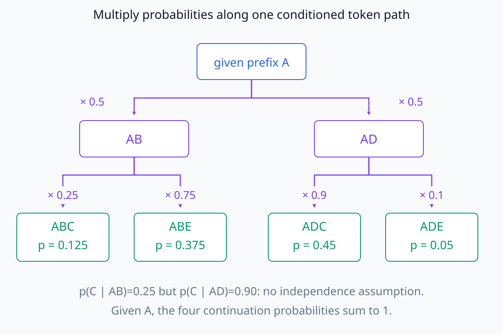
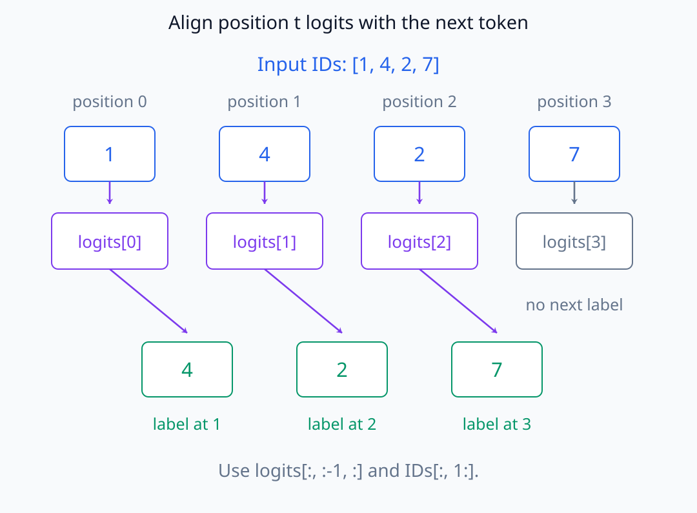
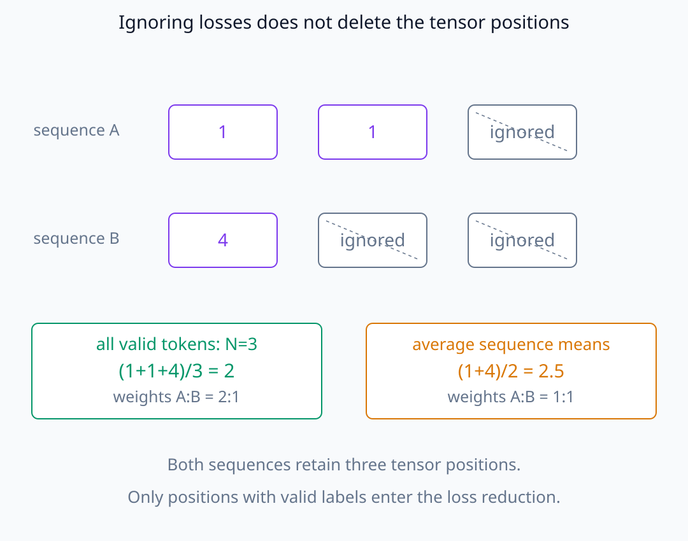
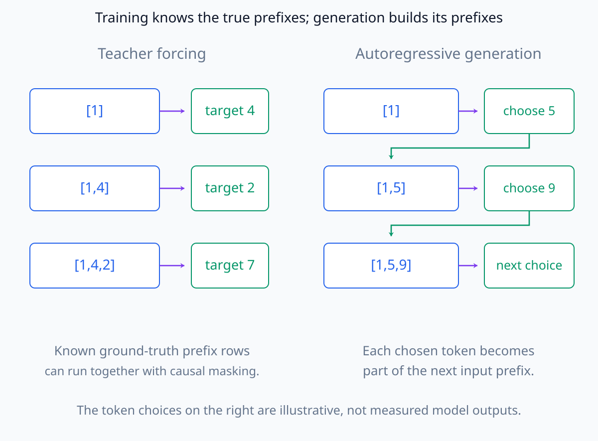

# N05-21. 언어모델 목적함수

## 이 단원이 필요한 이유

decoder가 각 position에서 vocabulary logit을 만들더라도 어떤 label과 비교하는지 정해야 학습 문제가 된다. causal language modeling은 현재까지의 token으로 다음 token을 예측하며, training에서는 정답 prefix를 한 번에 입력해 여러 position의 loss를 병렬 계산한다.

## 학습 목표

- sequence probability를 conditional probability의 곱으로 분해할 수 있다.
- input logit과 next-token label의 shift를 표시할 수 있다.
- token별 negative log-likelihood와 mean loss를 계산할 수 있다.
- teacher forcing과 autoregressive generation을 구분할 수 있다.
- loss 감소와 내부 메커니즘 설명을 동일시하지 않을 수 있다.

## 선수지식 확인

- 선수 단원: [N05-20 decoder block과 architecture diff](N05-20-decoder-block-architecture-diff.md)
- 확인 질문: shape `(B,T,V)`인 logit에서 한 position의 vocabulary distribution을 만드는 축은 어느 것인가?

## 기호와 용어

| 기호·용어 | Common spoken reading | 의미 | shape·범위 |
|---|---|---|---|
| $x_{<t}$ | `x before t` | position $t$보다 앞선 token prefix | token sequence |
| $p_\theta(x_t\mid x_{<t})$ | `p theta of x t given x before t` | prefix가 주어졌을 때 다음 token의 model probability | $[0,1]$ |
| $\ell_t$ | `loss at position t` | position $t$ logit과 다음 token target의 negative log-likelihood | nonnegative scalar |
| teacher forcing | `teacher forcing` | training에서 ground-truth prefix를 model input으로 쓰는 방식 | training procedure |
| label shift | `label shift` | position $t$ logit을 token $t+1$ label과 맞추는 정렬 | one-token offset |

## 핵심 개념 1. autoregressive factorization

token sequence $x_1,\ldots,x_T$의 model probability는 chain rule로

\[
p_\theta(x_1,\ldots,x_T)
=\prod_{t=1}^{T}p_\theta(x_t\mid x_{<t})
\]

로 분해한다. 시작 token이나 첫 token 처리 방식은 dataset convention에 따라 달라질 수 있다.

첫 항의 $x_{<1}$은 빈 prefix이며 별도 시작 token을 조건으로 둘 수도 있다. 이 곱은 token이 서로 독립이라는 가정이 아니다. 앞에서 관측한 모든 token을 조건에 넣어 결합확률을 나눈 것이다. 로그를 취하면 곱이 conditional log probability의 합이 되므로 negative log-likelihood 학습에서는 각 예측 위치의 loss를 합할 수 있다.

아래의 작은 token tree에서는 같은 다음 token도 prefix에 따라 다른 probability를 받는다.

<figure class="lesson-figure lesson-figure--wide" markdown="1">

<figcaption>A가 이미 주어진 조건부 예시다. AB에서 C의 확률은 0.25, AD에서는 0.90이므로 독립을 가정하지 않는다. ABC 경로의 continuation 확률은 0.5×0.25=0.125이며 네 leaf 확률의 합은 1이다.</figcaption>
</figure>

## 핵심 개념 2. shifted cross entropy

입력 `[1, 4, 2, 7]`을 넣었을 때 첫 세 position의 logits를 labels `[4, 2, 7]`과 비교한다. 마지막 input position의 logit은 sequence 밖의 다음 label이 주어지지 않았으므로 이 짧은 예의 loss에서 제외한다.

각 target에 대해

\[
\ell_t=-\log p_\theta(x_{t+1}\mid x_{\le t})
\]

이고 유효 token $N$개의 mean loss는

\[
\mathcal L=\frac1N\sum_{t\in\mathcal I}\ell_t
\]

이다. padding이나 무시할 label이 있으면 $\mathcal I$에 포함하지 않는다.

앞 절은 예측할 token의 위치 $t$로 확률을 적었고, 이 절은 logit을 낸 위치 $t$로 loss를 적는다. 현재 위치까지 읽은 $x_{\le t}$가 다음 token $x_{t+1}$의 조건이 되므로 한 칸 shift한다. 같은 input ID를 같은 위치의 target으로 쓰면 이미 입력에서 본 token을 맞추는 다른 학습 문제가 된다.

logit 행에서 다음 label로 향하는 화살표를 따라 한 칸 차이를 확인한다.

<figure class="lesson-figure lesson-figure--wide" markdown="1">

<figcaption>그림의 position은 코드처럼 0부터 센다. logits[0], logits[1], logits[2]는 각각 label 4, 2, 7과 비교한다. 마지막 logit은 이 입력 밖의 다음 label이 없으므로 loss에서 제외한다.</figcaption>
</figure>

$\mathcal I$는 label이 있는 유효 예측 위치의 집합이며 $N=|\mathcal I|>0$이다. 제외하는 것은 그 위치의 loss이지 입력 tensor의 axis를 자동으로 삭제하는 것이 아니다. batch 전체 유효 token으로 평균하면 긴 sequence가 더 많은 항을 기여한다. sequence별 평균을 다시 같은 비중으로 평균하는 것과는 가중치가 다르다.

같은 loss 값도 무엇을 하나의 평균 단위로 삼는지에 따라 결과가 달라진다.

<figure class="lesson-figure lesson-figure--wide" markdown="1">

<figcaption>sequence A의 유효 loss는 1과 1, B의 유효 loss는 4인 별도 예시다. 유효 token 전체 평균은 2지만 sequence 평균을 같은 비중으로 합치면 2.5다. ignored 위치를 loss에서 빼도 tensor의 세 위치는 남는다.</figcaption>
</figure>

## 핵심 개념 3. teacher forcing

training에서는 각 position이 앞선 ground-truth token을 받는다. causal mask 덕분에 미래 label은 볼 수 없지만 모든 position의 forward를 병렬 계산할 수 있다.

generation에서는 정답 다음 token이 없다. model이 선택한 token을 sequence 뒤에 붙이고 다시 다음 distribution을 계산한다. training input distribution과 생성 중 model-generated prefix가 다를 수 있다는 점도 구분해야 한다.

training의 입력에는 뒤쪽 정답 token도 들어 있지만 위치 $t$의 logit을 계산하는 경로에는 causal mask로 들어오지 못한다. 뒤쪽 위치를 동시에 계산하는 것과 앞쪽 위치가 뒤쪽 정보를 사용하는 것은 다른 문제다. 정답 prefix를 미리 알기 때문에 training에서는 여러 행을 함께 계산할 수 있고, generation에서는 새로 선택한 token이 다음 행의 입력이 된다.

아래에서는 알려진 정답 prefix와 앞서 선택한 token으로 생긴 prefix를 구분한다.

<figure class="lesson-figure lesson-figure--wide" markdown="1">

<figcaption>왼쪽은 정답 sequence [1,4,2,7]의 prefix를 사용하며 각 행은 causal mask 아래 함께 계산할 수 있다. 오른쪽의 5와 9는 설명용 선택값으로, 새 token을 정한 뒤에야 다음 prefix를 알 수 있다는 순서를 보여 준다. 실제 model 생성 결과는 아니다.</figcaption>
</figure>

## 예제

두 position에서 정답 token probability가 각각 0.5와 0.25라면 mean negative log-likelihood는

\[
-\frac12(\log 0.5+\log 0.25)
=-\log\sqrt{0.125}
\approx1.0397
\]

이다. probability가 낮은 정답이 loss를 더 크게 만든다.

## 실행 실습

### 실행 환경과 원본

- 환경: Python 3.12, PyTorch 2.13.0 CPU, NumPy 2.5.3
- 확인일: 2026-10-01
- 구성요소 등급: `Stable core`
- 공통 구현: `labs/N05/tiny_decoder.py`
- 예제 ID: `n05_21_language_model_objective`
- 코드 원본: `labs/N05/n05_21_language_model_objective.py`
- 테스트: `tests/N05/test_n05_21.py`
- 실행 명령: `.venv\Scripts\python.exe -m labs.N05.n05_21_language_model_objective`

### 자원 예산

batch 1, sequence length 4, dimension 4, vocabulary 16과 parameter 300개의 model에서 forward·backward 한 번을 실행한다.

### 실제 코드와 실행 결과

<!-- N05_EXAMPLE: n05_21_language_model_objective -->

### 검사

테스트는 label shift, prediction logit shape, mean cross entropy와 embedding gradient가 유한한지 확인한다.

## 합산 방식과 비교 조건

`sum` loss와 `mean` loss는 gradient scale이 다르다. mean을 쓰더라도 sequence마다 유효 token 수가 다르면 어떤 분모를 썼는지 기록해야 한다. perplexity는 보통 mean token NLL의 지수이므로 tokenizer와 평가 corpus가 다른 수치를 직접 비교하면 안 된다.

## 모델 해석과의 연결

한 token의 loss나 logit difference는 분석 target을 명확하게 만든다. gradient attribution을 계산할 때 전체 sequence mean loss인지 특정 position logit인지에 따라 출발 cotangent가 달라진다.

loss가 감소했다는 사실은 model이 objective를 더 잘 최적화했다는 증거다. 어떤 회로나 표현을 사용했는지는 activation, intervention과 대조군을 추가로 확인해야 한다.

## 흔한 오해

### 오해 1. 같은 position의 input ID를 같은 position의 label로 쓴다

causal next-token objective에서는 현재 position logit을 다음 token label과 맞춘다.

### 오해 2. teacher forcing은 미래 token을 attention으로 보여준다

ground-truth sequence를 입력하지만 causal mask가 각 position에서 미래 위치를 차단한다.

### 오해 3. cross entropy가 낮으면 생성 문장이 항상 좋다

평균 token likelihood와 특정 생성의 유용성·정확성은 다른 평가 대상이다.

## 연습문제

### 1. label shift

input IDs가 `[3, 8, 5]`이면 loss에 쓰는 labels는?

해설 보기
`[8, 5]`다. 첫 두 position의 logits와 맞춘다.

### 2. logit slice shape

원래 logits가 `(2,6,100)`이면 마지막 position을 제외한 prediction logits shape는?

해설 보기
`(2,5,100)`이다.

### 3. token loss

정답 probability가 0.1이면 negative log-likelihood는?

해설 보기
$-\log 0.1\approx2.3026$이다.

### 4. mean loss

유효 token loss가 1, 2, 3이면 mean은?

해설 보기
$(1+2+3)/3=2$다.

### 5. teacher forcing

training의 position 3 input prefix에 model이 앞서 잘못 예측한 token을 넣는가?

해설 보기
일반적인 teacher forcing에서는 넣지 않는다. dataset의 ground-truth prefix를 사용한다.

### 6. 해석 target

특정 정답 token의 evidence를 분석하려면 sequence mean loss와 해당 position logit 중 어느 target이 더 직접적인가?

해설 보기
해당 position의 정답 logit이나 정답-대안 logit difference가 더 직접적이다. 선택한 target이 답하는 질문을 명시해야 한다.

## 근거와 갱신 경계

causal factorization과 decoder masking은 [Attention Is All You Need](https://arxiv.org/abs/1706.03762), 공개 autoregressive 모델 구조는 [GPT-NeoX-20B](https://arxiv.org/abs/2204.06745)를 참고했다. padding label, reduction과 vocabulary convention은 dataset·framework별 구현 항목이다.

## 단원 요약

- causal LM은 sequence probability를 prefix-conditioned next-token probability의 곱으로 나타낸다.
- logit과 label은 한 token만큼 shift한다.
- token NLL을 명시한 유효 집합에서 합하거나 평균한다.
- teacher forcing은 ground-truth prefix를 쓰되 causal mask를 유지한다.
- loss target과 해석 target을 분명히 기록해야 한다.

## 통과 기준

- autoregressive factorization을 쓸 수 있는가?
- logit과 label을 올바르게 shift할 수 있는가?
- token NLL과 mean loss를 계산할 수 있는가?
- training과 generation의 prefix를 구분할 수 있는가?
- 분석 질문에 맞는 scalar target을 고를 수 있는가?

## 다음 단원

- [N05-22 causal inference와 KV cache](N05-22-causal-inference-kv-cache.md)

## 집필자 점검표

- [x] 학습 목표가 관찰 가능한 행동으로 작성됐다.
- [x] factorization·label shift·teacher forcing을 연결했다.
- [x] 모든 문제에 해설이 있다.
- [x] 모델 해석 주장의 강도를 구분했다.
- [x] 용어집과 표기 규칙을 따랐다.
- [x] Common spoken reading이 실제 영어 학술 발화이며 한글 음역이나 기계적 직역을 포함하지 않는다.
- [x] 선수지식 밖의 내용을 몰래 요구하지 않는다.
- [x] 내부 링크와 수식 렌더링을 확인했다.
- [x] Markdown에 실행 코드를 손으로 복제하지 않았다.
- [x] 코드 원본·테스트 경로·자원 예산·확인일을 기록했다.
- [x] shift·loss·gradient test가 있다.

