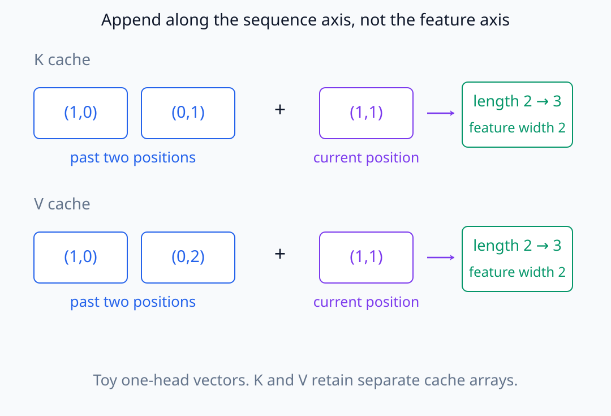
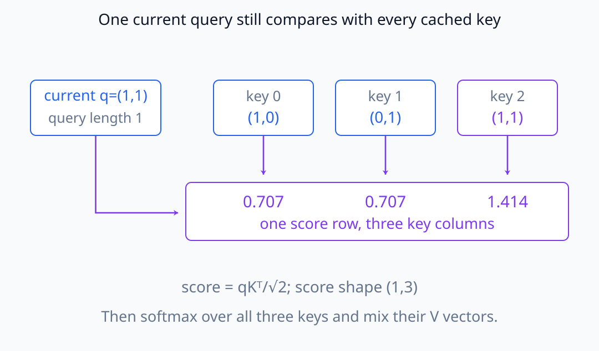
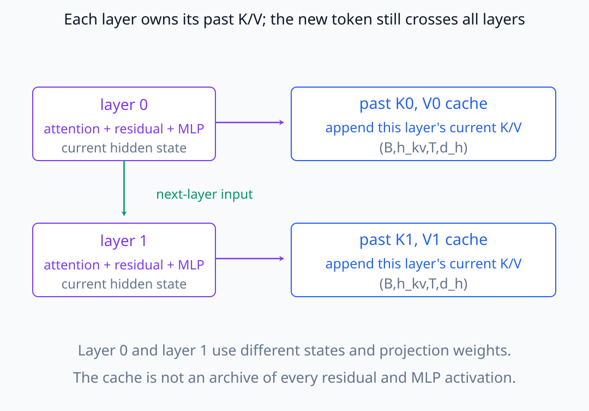
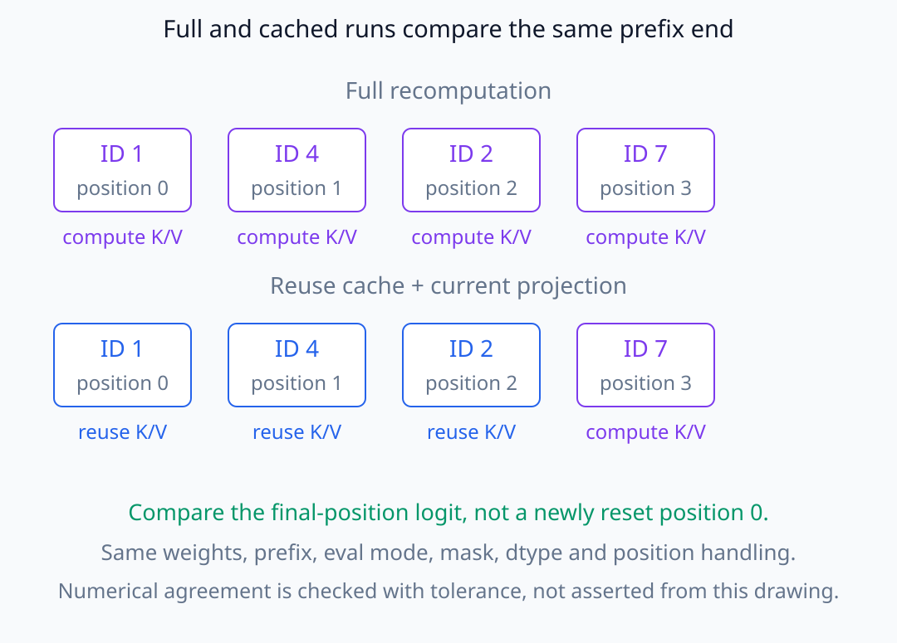
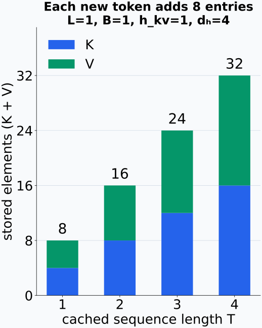

# N05-22. causal inference와 KV cache

## 이 단원이 필요한 이유

autoregressive generation에서 매 단계마다 이전 token의 key와 value를 다시 계산할 필요는 없다. KV cache는 layer별 과거 K·V를 저장해 현재 token의 projection만 추가한다. 이 단원의 `inference`는 causal language model의 추론 실행을 뜻하며 인과추론의 causal effect와는 다른 용어다.

## 학습 목표

- cache 없는 전체 재계산과 tokenwise cached inference를 구분할 수 있다.
- layer별 K·V cache shape를 계산할 수 있다.
- 새 key·value를 sequence axis에 추가하는 식을 쓸 수 있다.
- 같은 model에서 cached logit과 full causal logit을 대조할 수 있다.
- cache를 activation evidence나 model memory와 혼동하지 않을 수 있다.

## 선수지식 확인

- 선수 단원: [N05-21 언어모델 목적함수](N05-21-language-model-objective.md)
- 확인 질문: causal mask 아래 과거 position의 representation이 미래 token에 의존하지 않는 이유를 설명할 수 있는가?

## 기호와 용어

| 기호·용어 | Common spoken reading | 의미 | shape·범위 |
|---|---|---|---|
| $K_{<t}^{(l)}$ | `cached keys before t at layer l` | layer $l$의 과거 key cache | $B\times h_{kv}\times(t-1)\times d_h$ |
| $V_{<t}^{(l)}$ | `cached values before t at layer l` | layer $l$의 과거 value cache | 같은 cache shape |
| $q_t$ | `the query at time t` | 현재 token의 query | $B\times h_q\times1\times d_h$ |
| prefill | `prefill` | prompt 전체를 처리해 initial cache를 만드는 단계 | inference stage |
| decode step | `decode step` | 보통 새 token 하나를 넣어 다음 logit을 얻는 단계 | inference stage |
| KV cache | `key-value cache` | 재사용할 layer별 과거 key와 value | runtime state |

## 핵심 개념 1. cache update

position $t$의 current projection을 $k_t,v_t$라고 하면

\[
K_{\le t}=\operatorname{concat}(K_{<t},k_t),
\qquad
V_{\le t}=\operatorname{concat}(V_{<t},v_t)
\]

로 sequence axis에 붙인다. 현재 query는

\[
\operatorname{Attention}(q_t,K_{\le t},V_{\le t})
\]

만 계산하면 된다. cache는 layer마다 별도로 유지한다.

새 $k_t,v_t$의 sequence 길이는 각각 1이고 concat 뒤 길이는 $t$다. head나 feature를 새로 늘리는 연산이 아니다. 현재 query는 한 위치지만 비교할 key는 과거와 현재의 $t$개이므로 head별 score의 두 위치 axis는 $(1,t)$가 된다. 과거 query output을 다시 만들 필요는 없어도 현재 query의 과거 key 비교와 value 합은 남는다.

아래에서는 feature가 두 개인 작은 벡터로, cache 길이가 늘어나는 방향을 확인한다.

<figure class="lesson-figure lesson-figure--wide" markdown="1">

<figcaption>과거 두 위치 뒤에 현재 위치를 붙이면 K와 V의 sequence 길이가 각각 2에서 3으로 늘어난다. 각 벡터의 feature 수는 여전히 2다. 두 배열은 서로 합치는 것이 아니라 따로 갱신한다.</figcaption>
</figure>

같은 key 예시에 현재 query를 대입하면, 한 행에 세 개의 비교 결과가 생긴다.

<figure class="lesson-figure lesson-figure--wide" markdown="1">

<figcaption>현재 q=(1,1)을 세 key와 내적하고 √2로 나누면 score는 약 (0.707,0.707,1.414)다. query 길이는 1이지만 비교하는 key가 세 개이므로 score shape는 (1,3)이다. 이어지는 softmax와 value 가중합도 필요하다.</figcaption>
</figure>

각 layer는 서로 다른 hidden state와 projection weight에서 K·V를 만든다. 한 layer의 cache를 다른 layer에 그대로 쓰지 않는다. 새 token 역시 attention만 계산하는 것이 아니라 해당 layer의 residual·MLP를 거쳐 다음 layer로 가며, 그곳의 새 K·V도 만들어 cache에 붙인다.

layer 사이로 넘어가는 현재 hidden state와, 각 layer가 따로 갱신하는 cache를 나누어 보자.

<figure class="lesson-figure lesson-figure--wide" markdown="1">

<figcaption>아래로 향하는 화살표는 현재 token의 다음 layer 입력이고, 오른쪽 화살표는 해당 layer에서 만든 현재 K·V의 cache 추가를 표시한다. cache에 모든 residual·MLP activation을 저장하는 것은 아니다.</figcaption>
</figure>

## 핵심 개념 2. full과 cached 결과

dropout을 끄고 position 처리, mask, dtype와 weight가 같다면 cached inference는 full causal forward의 각 position logit과 같은 수학 함수를 계산해야 한다. 실제 hardware와 kernel에서는 연산 순서 차이로 작은 floating-point 차이가 생길 수 있으므로 tolerance로 비교한다.

과거 위치는 미래 token을 참조하지 않고 normalization과 MLP도 각 token에 적용한다. 그러므로 같은 prefix의 끝에 token을 추가해도 이미 계산한 과거 hidden과 각 layer의 K·V는 바뀌지 않는다. 이 의존 관계 때문에 저장된 값을 재사용할 수 있다. 미래를 함께 보는 attention이라면 새 token이 과거 representation을 바꿀 수 있어 같은 근거를 사용할 수 없다.

비교하는 두 실행에는 동일한 token prefix를 넣어야 한다. 다른 prompt에서 만든 cache는 shape가 같아도 같은 state가 아니다. RoPE를 쓰는 새 token의 위치도 cache 누적 길이에 맞아야 하며, 매번 짧은 입력의 첫 위치로 돌려놓으면 full forward와 다른 회전을 계산한다.

아래 두 실행은 같은 네 token의 마지막 위치를 비교한다. 재사용 여부가 달라도 token의 위치는 바뀌지 않는다.

<figure class="lesson-figure lesson-figure--wide" markdown="1">

<figcaption>위쪽은 네 위치의 K·V를 다시 계산하고, 아래쪽은 과거 세 위치의 K·V를 재사용한다. 새 token ID 7은 두 실행 모두 position 3에 있다. 마지막 위치 logit의 일치는 같은 실행 조건에서 tolerance로 검사해야 한다.</figcaption>
</figure>

## 핵심 개념 3. cache 비용

layer $L$개, K·V head $h_{kv}$개, 누적 길이 $T$, head dimension $d_h$, batch $B$와 element당 byte $s$일 때 단순 cache byte는

\[
2LBTh_{kv}d_hs
\]

이다. sequence length에 선형으로 늘며 MQA·GQA는 $h_{kv}$를 줄여 cache를 작게 만든다.

## 예제

실습의 cache shape는 layer마다 `(1,1,T,4)`다. token을 하나씩 넣으면 sequence axis 길이가 `1, 2, 3, 4`로 증가한다. 길이 4에서 K와 V를 합친 element 수는 $2\times1\times1\times4\times4=32$다.

K와 V가 각각 추가하는 원소 수를 쌓아 보면 선형 증가를 확인할 수 있다.

<figure class="lesson-figure" markdown="1">

<figcaption>이 설정에서는 위치마다 K에 4개, V에 4개를 저장해 총 8개씩 늘어난다. 길이 4의 32개는 원소 수이며 byte 수가 아니다. 각 원소가 4 byte라면 이 단순 cache의 용량은 128 byte다.</figcaption>
</figure>

## 실행 실습

### 실행 환경과 원본

- 환경: Python 3.12, PyTorch 2.13.0 CPU, NumPy 2.5.3
- 확인일: 2026-10-01
- 구성요소 등급: `Common modern variant`
- 공통 구현: `labs/N05/tiny_decoder.py`
- 예제 ID: `n05_22_kv_cache`
- 코드 원본: `labs/N05/n05_22_kv_cache.py`
- 테스트: `tests/N05/test_n05_22.py`
- 실행 명령: `.venv\Scripts\python.exe -m labs.N05.n05_22_kv_cache`

### 자원 예산

batch 1, sequence length 4, layer 1, head 1, dimension 4와 parameter 300개를 사용한다. full forward 한 번과 tokenwise forward 네 번만 실행한다.

### 실제 코드와 실행 결과

<!-- N05_EXAMPLE: n05_22_kv_cache -->

### 검사

테스트는 cached logits와 full causal logits의 수치 일치, cache length 증가와 최종 K·V shape를 확인한다.

## prefill과 decode

긴 prompt는 보통 한 번의 prefill로 처리해 K·V를 채운다. 이후 decode step에서는 새 token만 입력하고 cache를 갱신한다. cache가 있다고 attention의 과거 K·V 읽기가 사라지는 것은 아니다. 과거 token의 projection을 다시 계산하지 않는 것이다.

cache API는 dynamic, static, sliding-window와 quantized 형태로 달라질 수 있다. 수학적 비교에서는 저장된 position 범위, mask와 position ID가 같은지 먼저 확인한다.

## 모델 해석과의 연결

KV cache는 inference 중 저장된 attention projection이다. 장기기억이나 학습된 parameter 자체가 아니다. prompt를 바꾸거나 cache를 지우면 runtime state도 바뀐다.

cached run과 full run의 activation을 비교할 때 현재 token의 residual과 K·V cache를 분리해야 한다. cache를 patch하는 intervention은 특정 layer의 과거 information path를 바꾸므로 단순한 입력 token 제거와 같은 조작이 아니다.

## 흔한 오해

### 오해 1. KV cache는 모든 과거 activation을 저장한다

기본 cache는 attention에 재사용할 key와 value를 layer별로 저장한다. residual stream이나 MLP activation 전체를 저장하는 것은 아니다.

### 오해 2. cache를 쓰면 attention 계산이 없어진다

현재 query와 누적 K 사이 score, softmax와 V 가중합은 계속 계산한다.

### 오해 3. cache는 training에도 항상 켜야 한다

teacher-forced training은 전체 sequence를 병렬 계산하며 cache는 일반적으로 inference 최적화다. training에서 무심코 재사용하면 gradient graph와 sequence 처리에 문제가 생길 수 있다.

## 연습문제

### 1. cache shape

$B=2$, $h_{kv}=4$, $T=10$, $d_h=8$이면 한 layer의 K cache shape는?

해설 보기
$(2,4,10,8)$이다.

### 2. element 수

앞 조건에서 한 layer의 K와 V를 합친 element 수는?

해설 보기
$2\times2\times4\times10\times8=1{,}280$개다.

### 3. update axis

새 key를 cache의 어느 axis에 붙이는가?

해설 보기
sequence length axis다. 표기 `(B,h,T,d_h)`에서는 뒤에서 둘째 axis다.

### 4. query shape

한 token decode에서 query sequence length는 보통 얼마인가?

해설 보기
1이다. K·V의 sequence length는 과거와 현재를 합친 누적 길이다.

### 5. 결과 불일치 진단

cached logits가 full logits와 크게 다르면 무엇을 먼저 확인해야 하는가?

해설 보기
position offset, causal mask, K·V를 붙인 axis와 model의 eval 상태·weight 일치를 먼저 확인한다.

### 6. 해석 범위

cache에서 한 layer의 value를 0으로 만들면 입력 token을 삭제한 것과 같은가?

해설 보기
아니다. 해당 layer attention의 과거 value 전달 경로만 바꾸며 다른 layer의 cache와 현재 residual에는 정보가 남을 수 있다.

## 근거와 갱신 경계

causal attention의 기본식은 [Attention Is All You Need](https://arxiv.org/abs/1706.03762), 현재 cache shape와 update contract는 [Hugging Face Transformers caching 문서](https://huggingface.co/docs/transformers/v5.6.0/cache_explanation)를 확인했다. cache class와 API는 라이브러리 버전에 따라 바뀌므로 본문의 수학적 상태와 분리해 다룬다.

## 단원 요약

- KV cache는 layer별 과거 key와 value를 sequence axis에 저장한다.
- decode step은 현재 query와 누적 K·V를 사용한다.
- cached inference는 같은 조건의 full causal forward와 수치적으로 일치해야 한다.
- cache memory는 length, layer, K·V head와 head dimension에 선형으로 증가한다.
- KV cache는 runtime state이지 학습된 장기기억이나 전체 activation dump가 아니다.

## 통과 기준

- full recomputation과 cached inference를 구분할 수 있는가?
- cache shape와 byte 수를 계산할 수 있는가?
- cache update 식을 쓸 수 있는가?
- full·cached logits를 tolerance 아래 대조할 수 있는가?
- cache intervention의 범위를 설명할 수 있는가?

## 다음 단원

- [N05-23 decoding과 생성](N05-23-decoding-generation.md)

## 집필자 점검표

- [x] 학습 목표가 관찰 가능한 행동으로 작성됐다.
- [x] full causal inference와 KV cache를 대조했다.
- [x] 모든 문제에 해설이 있다.
- [x] 모델 해석 주장의 강도를 구분했다.
- [x] 용어집과 표기 규칙을 따랐다.
- [x] Common spoken reading이 실제 영어 학술 발화이며 한글 음역이나 기계적 직역을 포함하지 않는다.
- [x] 선수지식 밖의 내용을 몰래 요구하지 않는다.
- [x] 내부 링크와 수식 렌더링을 확인했다.
- [x] Markdown에 실행 코드를 손으로 복제하지 않았다.
- [x] 코드 원본·테스트 경로·자원 예산·확인일을 기록했다.
- [x] cache shape·length·logit equivalence test가 있다.
