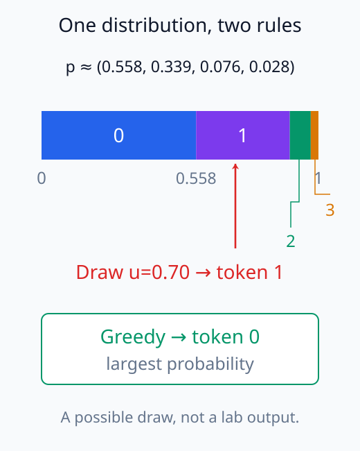
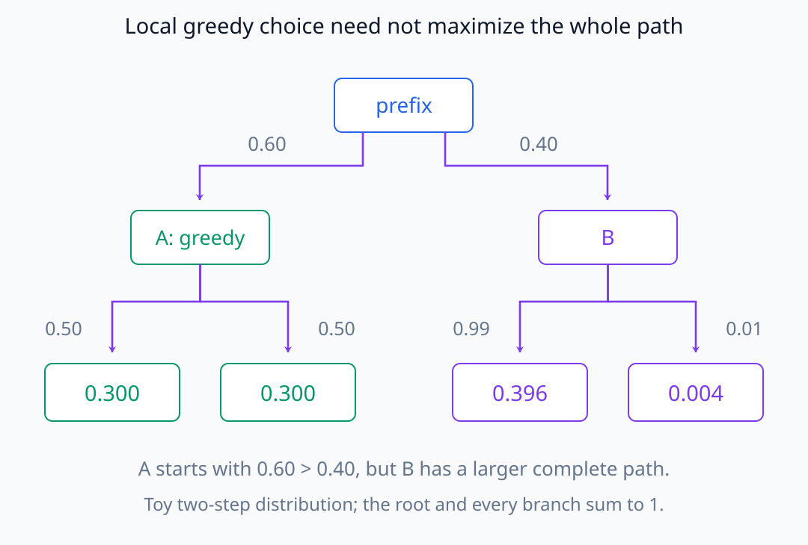
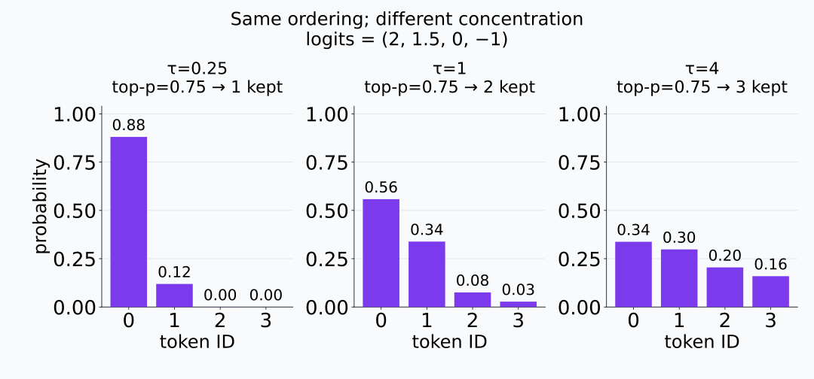
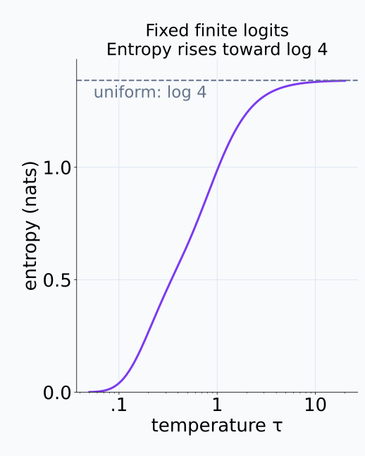
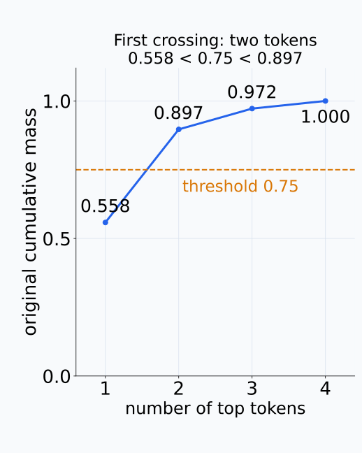
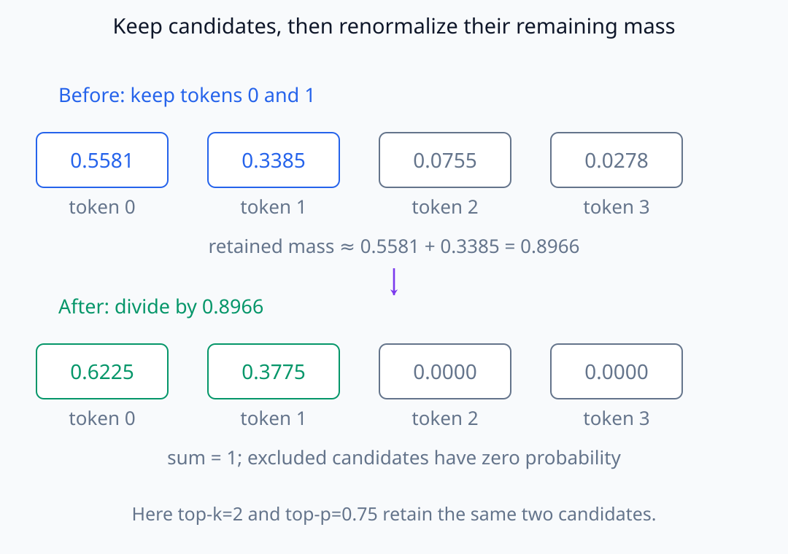

# N05-23. decoding과 생성

## 이 단원이 필요한 이유

같은 model과 prompt도 token 선택 규칙에 따라 다른 문자열을 만든다. logit, probability distribution, 후보 절단과 실제 sample을 구분해야 model 변화와 decoding randomness를 혼동하지 않는다.

## 학습 목표

- greedy decoding과 categorical sampling을 계산할 수 있다.
- temperature가 probability entropy에 주는 영향을 설명할 수 있다.
- top-k와 top-p 후보 집합을 만들고 다시 정규화할 수 있다.
- seed·prompt·decoding parameter를 재현 조건으로 기록할 수 있다.
- 생성 차이를 model 내부 변화의 증거로 과대해석하지 않을 수 있다.

## 선수지식 확인

- 선수 단원: [N05-22 causal inference와 KV cache](N05-22-causal-inference-kv-cache.md)
- 확인 질문: 마지막 position의 logit을 vocabulary probability로 바꾸는 축을 설명할 수 있는가?

## 기호와 용어

| 기호·용어 | Common spoken reading | 의미 | shape·범위 |
|---|---|---|---|
| $\tau$ | `temperature` | logit scale을 조절하는 양수 | $\tau>0$ |
| $\arg\max_i z_i$ | `arg max over i of z sub i` | 가장 큰 logit의 token index | discrete index |
| top-k | `top k` | logit이 큰 $k$개 token만 남기는 절단 | $1\le k\le V$ |
| top-p | `top p` | 누적 probability가 기준을 넘는 최소 상위 집합을 남기는 절단 | $0<p\le1$ |
| categorical sample | `a categorical sample` | 정규화된 token probability에서 뽑은 index | random variable |

## 핵심 개념 1. greedy와 sampling

greedy decoding은

\[
x_{t+1}=\operatorname*{argmax}_i z_i
\]

를 선택한다. 같은 logit과 tie-breaking 규칙에서는 결정적이다. sampling은

\[
x_{t+1}\sim\operatorname{Categorical}(\mathbf p)
\]

로 token을 뽑는다. probability가 가장 큰 token도 매번 선택된다는 보장은 없다.

greedy는 현재 prefix에서 가장 큰 다음 token probability를 고르는 규칙이다. 그 선택 뒤의 모든 prefix와 probability 곱을 비교하지 않으므로 전체 sequence probability가 가장 큰 문자열을 찾는다고 보장하지 않는다. sampling에서는 선택한 token이 다음 prefix에 들어가 후속 distribution도 바뀔 수 있다. 같은 weight라도 처음의 random draw가 다르면 이후 생성 경로가 달라질 수 있다.

확률을 길이로 나눈 구간에 놓으면, 최댓값 선택과 무작위 추출의 차이를 볼 수 있다.

<figure class="lesson-figure" markdown="1">

<figcaption>예제의 probability를 순서대로 길이로 놓았다. greedy는 가장 넓은 token 0 구간을 고른다. 반면 0부터 1 사이에서 뽑은 u=0.70은 token 1의 구간에 들어간다. 이 draw는 규칙을 보여 주기 위한 예시다.</figcaption>
</figure>

현재 단계의 최댓값을 고르는 것과 전체 경로의 곱을 비교하는 것도 다르다.

<figure class="lesson-figure lesson-figure--wide" markdown="1">

<figcaption>이 작은 분포에서는 처음에 A의 0.60이 B의 0.40보다 크다. 그러나 A 아래 경로는 각각 0.60×0.50=0.300이고, B 아래 가장 큰 경로는 0.40×0.99=0.396이다. 첫 greedy 선택만으로 전체 경로의 최대 확률을 보장할 수 없다.</figcaption>
</figure>

## 핵심 개념 2. temperature

\[
p_i(\tau)=
\frac{\exp(z_i/\tau)}{\sum_j\exp(z_j/\tau)}
\]

이다. $0<\tau<1$이면 logit 차이가 확대돼 distribution이 더 뾰족해지고, $\tau>1$이면 더 평평해진다. 양의 temperature는 logit 순서를 바꾸지 않으므로 greedy argmax 자체는 같다.

확률 비는 $p_i(\tau)/p_j(\tau)=\exp((z_i-z_j)/\tau)$다. 양의 logit 차이를 더 큰 temperature로 나누면 비가 1에 가까워져 후보 간 상대 차이가 줄어든다. 고정된 유한 logit vector에서는 temperature를 높일수록 softmax entropy가 감소하지 않는다. 모든 logit이 같으면 처음부터 uniform이라 변화가 없다. $\tau$가 무한히 커지면 uniform에 가까워지고 0 쪽으로 줄면 최대 logit 후보에 집중한다. 동점 최대값이 여러 개이면 그 후보들에 질량이 나뉜다.

같은 네 logit을 유지하고 temperature만 바꾼 세 분포를 비교해 보자.

<figure class="lesson-figure lesson-figure--wide" markdown="1">

<figcaption>세 경우 모두 token 0부터 3까지의 순서는 같다. 다만 질량의 집중도가 달라져 같은 top-p=0.75에서도 남기는 후보가 1개, 2개, 3개가 된다. 작은 막대 위 0.00은 반올림한 표시이며 정확한 확률이 0이라는 뜻은 아니다.</figcaption>
</figure>

집중도의 변화를 entropy로 묶어 보면 다음 곡선이 된다.

<figure class="lesson-figure" markdown="1">

<figcaption>고정된 logits=(2,1.5,0,−1)의 entropy를 자연로그 단위로 표시했다. temperature가 커지면 네 후보의 균등분포 entropy인 log 4에 가까워진다. 가로축은 로그 눈금이다.</figcaption>
</figure>

## 핵심 개념 3. top-k와 top-p

top-k는 고정된 후보 수를 남긴다. top-p 또는 nucleus sampling은 원래 probability가 큰 순서로 더해 누적 질량이 $p$ 이상이 되는 최소 집합을 남긴다. 두 방식 모두 제외된 logit을 $-\infty$로 만든 뒤 남은 후보를 다시 정규화해 sampling한다.

남긴 후보 집합을 $\mathcal C$라고 하면 그 안의 새 확률은 기존 $p_i$를 $\sum_{j\in\mathcal C}p_j$로 나눈 값이며 밖은 0이다. 예제의 두 후보는 원래 질량이 약 0.8966이고 이를 분모로 나누어 합을 1로 맞춘다. top-p의 기준 $p$는 유지할 원래 질량의 하한이지 최종 sampling probability의 합이 아니다. threshold를 넘긴 마지막 token까지 포함하므로 남은 질량은 기준보다 클 수 있다.

양의 temperature는 순서를 유지해 top-k 후보는 바꾸지 않지만 probability 질량은 바꾼다. 따라서 temperature 뒤에 top-p를 적용하면 그 temperature에서 얻은 확률로 누적 집합을 정해야 한다.

누적 질량 곡선에서 기준선을 처음 넘는 위치가 남길 후보 수를 정한다.

<figure class="lesson-figure" markdown="1">

<figcaption>첫 token의 질량 약 0.558은 기준 0.75에 못 미친다. 둘째 token까지 더하면 약 0.897로 처음 넘으므로 두 token을 남긴다. 기준을 넘긴 둘째 token을 잘라내지는 않는다.</figcaption>
</figure>

## 예제

logits가 $(2,1.5,0,-1)$이면 softmax는 약

\[
(0.5581,0.3385,0.0755,0.0278)
\]

이다. greedy token은 index 0이다. top-k에서 $k=2$이면 앞의 두 token만 남고, top-p에서 $p=0.75$이면 첫 token의 질량만으로 부족하므로 둘째 token까지 남는다. 다시 정규화한 distribution은 둘 다 약 $(0.6225,0.3775,0,0)$이다.

남은 질량과 다시 정규화한 확률을 두 줄로 비교하자.

<figure class="lesson-figure lesson-figure--wide" markdown="1">

<figcaption>원래 확률에서 token 0·1의 질량 약 0.8966만 남긴다. 각 확률을 그 질량으로 나누면 두 값이 약 0.6225·0.3775가 되어 합이 1이다. 제외된 token 2·3의 최종 sampling probability는 0이다.</figcaption>
</figure>

## 실행 실습

### 실행 환경과 원본

- 환경: Python 3.12, PyTorch 2.13.0 CPU, NumPy 2.5.3
- 확인일: 2026-10-01
- 구성요소 등급: `Stable core`와 decoding-specific policy
- 예제 ID: `n05_23_decoding`
- 코드 원본: `labs/N05/n05_23_decoding.py`
- 테스트: `tests/N05/test_n05_23.py`
- 실행 명령: `.venv\Scripts\python.exe -m labs.N05.n05_23_decoding`

### 자원 예산

vocabulary 4의 단일 logit vector만 사용한다. model forward와 반복 생성은 없다.

### 실제 코드와 실행 결과

<!-- N05_EXAMPLE: n05_23_decoding -->

### 검사

테스트는 temperature별 entropy 순서, top-k·top-p의 후보 수와 재정규화, greedy·seeded sample 결과를 확인한다.

## 반복 생성의 상태

실제 generation loop는 선택한 token을 input에 추가하고, 종료 조건까지 KV cache를 갱신한다. 재현에는 model revision, tokenizer, prompt bytes, chat template, seed, temperature, top-k, top-p, 최대 token 수와 stopping rule이 필요하다.

`temperature=0`을 softmax 식에 직접 넣으면 0으로 나누게 된다. library가 이 표현을 greedy decoding의 별칭으로 받는지는 API 규칙이다. 수학적으로는 greedy와 positive-temperature sampling을 분리해 쓴다.

## 모델 해석과의 연결

한 번의 sampled completion 차이는 model probability가 달라졌다는 증거가 아니다. 같은 logits에서도 random draw가 달라질 수 있다. intervention 전후를 비교하려면 가능한 경우 같은 prompt, seed와 decoding 설정을 고정하고 logit이나 probability 변화도 함께 측정한다.

greedy output이 같더라도 대안 token의 logit margin은 달라질 수 있다. 문자열 일치만으로 내부 또는 distribution 수준의 동등성을 결론내리지 않는다.

## 흔한 오해

### 오해 1. temperature가 높은 model은 지식이 적다

temperature는 보통 decoding 때 logit을 변환하는 설정이다. 같은 model weight에서도 바꿀 수 있다.

### 오해 2. top-p는 항상 같은 수의 후보를 남긴다

distribution의 집중도에 따라 nucleus 크기가 달라진다.

### 오해 3. seed를 같게 하면 모든 환경에서 문자열이 보장된다

model·tokenizer·kernel·dtype·sampling 구현과 실행 순서가 함께 같아야 한다. seed는 필요한 조건 중 하나다.

## 연습문제

### 1. greedy

logits가 $(0.2,1.1,0.7)$이면 greedy index는?

해설 보기
가장 큰 1.1의 index 1이다.

### 2. temperature와 순서

양의 temperature로 나눈 뒤 logit의 대소 순서가 바뀌는가?

해설 보기
바뀌지 않는다. 같은 양수로 나누므로 argmax는 유지된다.

### 3. top-k

vocabulary 10에서 $k=3$이면 sampling 직전 probability가 0보다 큰 token은 최대 몇 개인가?

해설 보기
3개다. 경계의 같은 logit 처리 방식에 따라 구현 세부는 확인해야 한다.

### 4. top-p

내림차순 probability가 $(0.6,0.25,0.1,0.05)$이고 $p=0.8$이면 남는 최소 후보는?

해설 보기
첫째와 둘째 token이다. 누적 질량이 $0.6+0.25=0.85$로 처음 0.8 이상이 된다.

### 5. 재현 기록

sampling 결과 비교에서 seed 외에 최소 세 항목을 적어라.

해설 보기
예를 들어 model revision, tokenizer·chat template, prompt, temperature, top-k·top-p와 stopping rule을 기록한다.

### 6. 결과 해석

intervention 뒤 sampled answer 한 개가 달라졌다면 intervention의 인과 효과가 입증됐는가?

해설 보기
아니다. sampling 변동과 구분하려면 paired seed, 반복 sample이나 distribution-level metric과 적절한 대조군이 필요하다.

## 근거와 갱신 경계

nucleus sampling의 정의와 동기는 [The Curious Case of Neural Text Degeneration](https://arxiv.org/abs/1904.09751)에 근거한다. sampling API의 filter 순서, tie 처리와 random generator는 framework version에 따라 달라질 수 있다.

## 단원 요약

- greedy는 최대 logit index를 고르고 sampling은 probability에서 token을 뽑는다.
- temperature는 distribution의 집중도를 바꾼다.
- top-k는 후보 수, top-p는 누적 probability 질량으로 절단한다.
- 후보 절단 뒤 probability를 다시 정규화한다.
- output 비교에는 model 조건과 decoding randomness를 함께 통제해야 한다.

## 통과 기준

- greedy와 sampling을 계산할 수 있는가?
- temperature와 entropy의 관계를 설명할 수 있는가?
- top-k·top-p 후보를 만들 수 있는가?
- 생성 재현 조건을 열거할 수 있는가?
- output 차이를 올바른 증거 수준으로 해석할 수 있는가?

## 다음 단원

- [N05-24 Chain-of-thought의 관찰 지위](N05-24-chain-of-thought-observation-status.md)

## 집필자 점검표

- [x] 학습 목표가 관찰 가능한 행동으로 작성됐다.
- [x] greedy·temperature·top-k·top-p를 계산했다.
- [x] 모든 문제에 해설이 있다.
- [x] 모델 해석 주장의 강도를 구분했다.
- [x] 용어집과 표기 규칙을 따랐다.
- [x] Common spoken reading이 실제 영어 학술 발화이며 한글 음역이나 기계적 직역을 포함하지 않는다.
- [x] 선수지식 밖의 내용을 몰래 요구하지 않는다.
- [x] 내부 링크와 수식 렌더링을 확인했다.
- [x] Markdown에 실행 코드를 손으로 복제하지 않았다.
- [x] 코드 원본·테스트 경로·자원 예산·확인일을 기록했다.
- [x] probability·entropy·sampling test가 있다.

