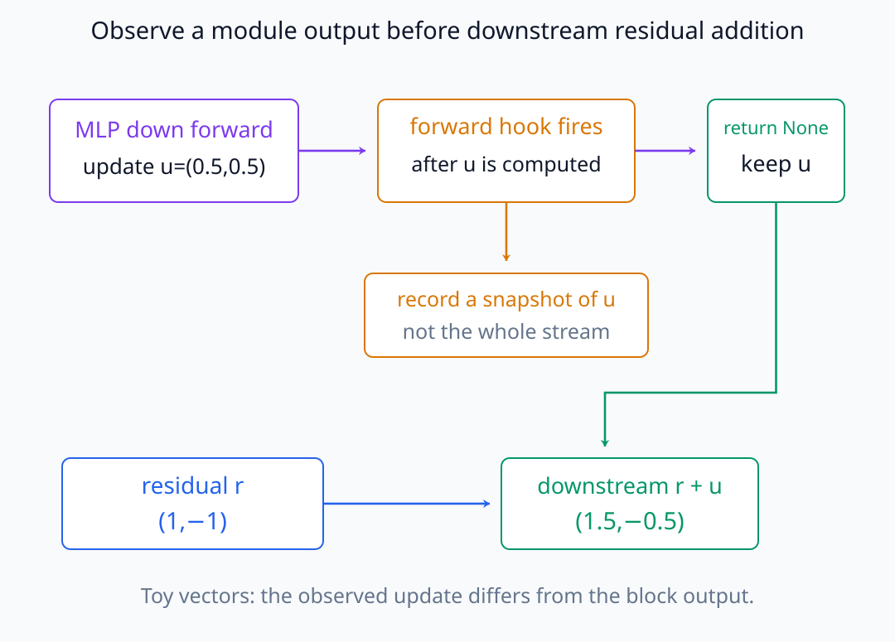
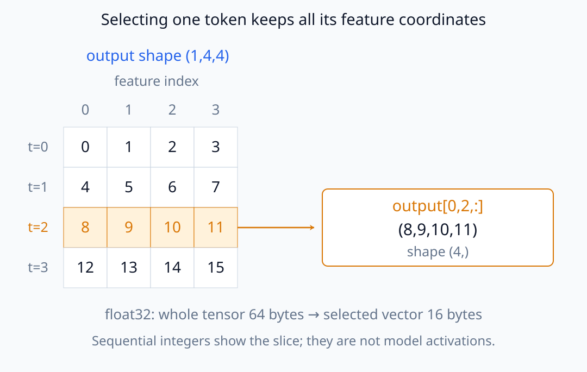
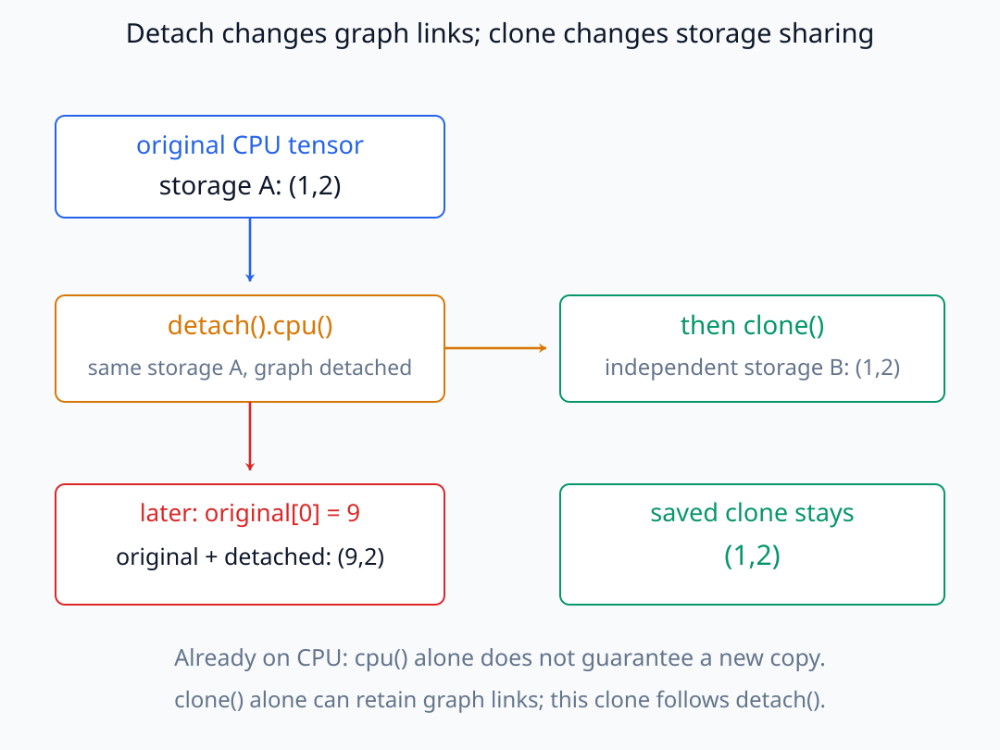
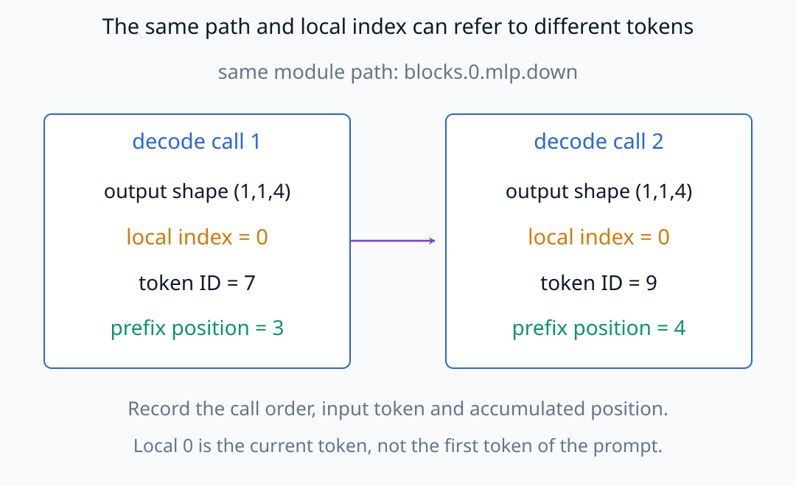
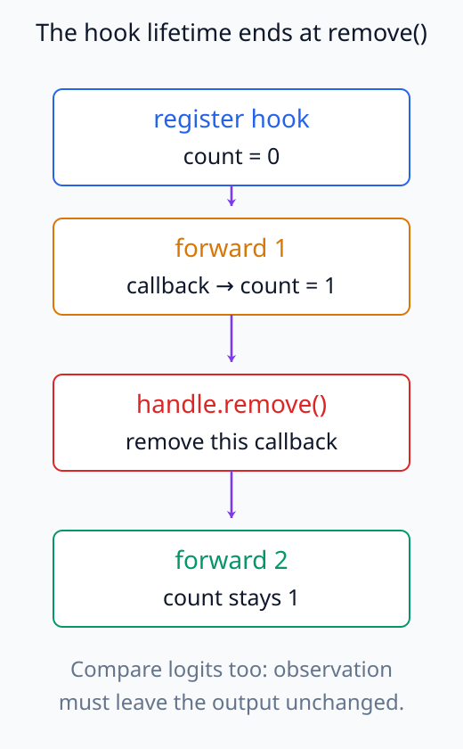

# N05-25. hook과 activation 수집

## 이 단원이 필요한 이유

white-box 분석은 원하는 module의 activation을 정확한 layer·token·component에서 수집해야 시작할 수 있다. hook은 기존 forward code를 다시 쓰지 않고 중간 output을 관찰하게 해주지만, 위치·수명·gradient와 저장량을 명시하지 않으면 잘못된 tensor를 모으기 쉽다.

## 학습 목표

- forward hook이 호출되는 시점을 설명할 수 있다.
- module path, layer와 token index를 지정해 activation을 수집할 수 있다.
- `detach`, `clone`과 device 이동의 목적을 구분할 수 있다.
- hook handle을 제거하고 호출 횟수로 확인할 수 있다.
- activation shape·dtype·byte 수와 provenance를 기록할 수 있다.

## 선수지식 확인

- 선수 단원: [N05-24 Chain-of-thought의 관찰 지위](N05-24-chain-of-thought-observation-status.md)
- 확인 질문: residual stream, attention update와 MLP update 중 어느 activation을 원하는지 계산 위치로 설명할 수 있는가?

## 기호와 용어

| 기호·용어 | Common spoken reading | 의미 | shape·범위 |
|---|---|---|---|
| forward hook | `forward hook` | module forward가 output을 계산한 뒤 호출되는 callback | runtime callback |
| module path | `module path` | model 안에서 대상 module을 식별하는 이름 | string |
| $a_{l,t}$ | `the activation at layer l and token t` | 지정 layer·token의 activation vector | $\mathbb R^d$ |
| detach | `detach` | tensor를 현재 autograd graph에서 분리하는 연산 | tensor operation |
| handle | `hook handle` | 등록한 hook을 나중에 제거하는 객체 | removable handle |
| provenance | `provenance` | activation의 model·input·위치·조건 기록 | metadata |

## 핵심 개념 1. forward hook의 계약

PyTorch module-specific forward hook은 해당 module의 `forward()`가 output을 계산한 뒤 호출된다. 기본 callback은 module, positional input tuple과 output을 받는다. 값을 반환하면 output을 바꿀 수도 있으므로 관찰용 hook은 아무것도 반환하지 않는다.

hook은 module object에 붙는다. 같은 class의 다른 instance에는 자동으로 붙지 않는다. shared module이 여러 번 호출되면 한 forward에서도 hook이 여러 번 실행될 수 있다.

관찰용 hook의 실행 시점과 residual addition의 위치를 나누어 보자.

<figure class="lesson-figure lesson-figure--wide" markdown="1">

<figcaption>작은 벡터 예시에서 hook은 계산된 update u=(0.5,0.5)를 관찰한다. 반환값 None으로 u를 유지한 뒤 residual r=(1,−1)에 더하면 stream은 (1.5,−0.5)다. down output과 addition 뒤 block output을 같은 관찰값으로 취급하지 않는다.</figcaption>
</figure>

## 핵심 개념 2. 최소 activation만 저장하기

output shape가 $(B,T,d)$이고 batch 0의 token $t$만 필요하면

\[
a_t=\text{output}[0,t,:]
\]

만 저장한다. float32 vector의 byte 수는 $4d$다. 전체 batch·sequence·layer를 무조건 저장하면 실험 질문과 무관한 disk·memory를 쓴다.

숫자를 순서대로 채운 배열에서 선택하는 행과 남기는 feature를 확인하자.

<figure class="lesson-figure lesson-figure--wide" markdown="1">

<figcaption>batch 0의 t=2 행을 선택하면 feature 0·1·2·3은 모두 남는다. shape (1,4,4)의 float32 전체는 64 bytes이고 선택한 shape (4,) vector는 16 bytes다. 배열의 0부터 15는 slice를 설명하는 숫자이며 실제 model activation이 아니다.</figcaption>
</figure>

관찰용 사본은 보통 `output[...].detach().cpu().clone()`으로 만든다. `detach`는 graph 참조를 끊고, `cpu`는 accelerator memory에서 옮기며, `clone`은 이후 storage 변경과 분리된 사본을 만든다.

이 세 연산은 서로 대신할 수 없다. `detach`한 tensor는 원래 tensor와 storage를 공유하므로, gradient 연결이 없다는 사실만으로 저장 값이 이후 변경에서 보호되지는 않는다. 이미 CPU에 있는 tensor에는 `cpu()`가 새 사본을 만들지 않는다. 마지막 `clone()`이 선택한 값을 별도 storage에 복사하여 그 시점의 관찰값을 보존한다. 반대로 `clone()`만 하면 값은 복사해도 autograd 연결은 남을 수 있다.

이미 CPU에 있는 값의 storage가 나중에 바뀌는 경우를 비교해 보자.

<figure class="lesson-figure lesson-figure--wide" markdown="1">

<figcaption>처음 값 (1,2)을 담은 storage A에서 graph 연결만 끊으면 storage는 공유한다. 이후 A의 첫 값이 9로 바뀌면 detached 값도 (9,2)다. 그 전에 clone한 storage B는 (1,2)를 유지한다. 이 그림은 storage 공유를 설명하는 예시이며 실습에서 model activation을 수정하는 절차가 아니다.</figcaption>
</figure>

이렇게 분리한 사본은 값 분석에 쓰는 기록이다. 그 사본에서 원래 activation으로 거슬러 올라가는 gradient를 계산하려는 용도로는 쓸 수 없다. 다음 단원의 gradient 수집에서는 계산 그래프에 연결된 원래 activation과 기록용 사본을 구분한다.

## 핵심 개념 3. 수명과 provenance

등록 결과인 handle에 `remove()`를 호출하지 않으면 이후 forward에도 hook이 남는다. 실험마다 다음을 기록한다.

- model ID·revision과 weight hash
- module path, layer, token과 component 의미
- input ID·attention mask·position
- train/eval, dtype, device와 gradient mode
- activation shape, dtype, byte 수와 저장 transformation
- hook 호출 횟수와 제거 여부

module path는 어느 객체를 관찰했는지를 알려 주지만, 여러 호출 중 어느 결과인지는 알려 주지 않는다. shared module을 두 번 쓰거나 generation의 여러 step에서 같은 module을 호출하면 같은 path에 서로 다른 activation이 쌓인다. 따라서 호출 순서와 해당 입력을 함께 기록해야 layer·token의 의미를 복원할 수 있다. cache를 사용하는 step의 길이 1짜리 output에서 local token index 0은 전체 prefix의 첫 token이 아니라 현재 처리한 token을 가리킨다.

같은 path와 local index를 기록해도 호출 시점이 다르면 가리키는 token이 달라진다.

<figure class="lesson-figure lesson-figure--wide" markdown="1">

<figcaption>예시의 두 decode 호출은 같은 path에서 shape (1,1,4)를 내지만 token ID와 누적 position은 다르다. local index 0만으로 prompt의 첫 token이라고 판정하지 않는다. 호출 순서와 입력 token을 함께 기록한다.</figcaption>
</figure>

## 예제

실습은 `blocks.0.mlp.down`에 hook을 붙이고 output shape `(1,4,4)`에서 token index 2의 vector 네 개만 저장한다. float32이므로 저장량은 $4\times4=16$ bytes다. hook을 제거한 뒤 같은 forward를 다시 실행해 호출 횟수가 1에서 늘지 않고 logits도 변하지 않는지 확인한다.

등록·호출·제거 순서에 따라 callback 횟수가 어떻게 유지되는지 확인한다.

<figure class="lesson-figure" markdown="1">

<figcaption>첫 forward 뒤 callback 횟수는 1이다. 해당 handle을 remove한 뒤 두 번째 forward를 수행해도 이 callback의 횟수는 늘지 않아야 한다. 관찰용 hook이므로 logits 불변성도 함께 검사한다.</figcaption>
</figure>

## 실행 실습

### 실행 환경과 원본

- 환경: Python 3.12, PyTorch 2.13.0 CPU, NumPy 2.5.3
- 확인일: 2026-10-01
- 구성요소 등급: PyTorch-specific observation API
- 공통 구현: `labs/N05/tiny_decoder.py`
- 예제 ID: `n05_25_activation_hook`
- 코드 원본: `labs/N05/n05_25_activation_hook.py`
- 테스트: `tests/N05/test_n05_25.py`
- 실행 명령: `.venv\Scripts\python.exe -m labs.N05.n05_25_activation_hook`

### 자원 예산

parameter 300개의 model에서 sequence length 4 forward를 두 번 수행하고 activation 16 bytes만 선택한다. disk에는 저장하지 않는다.

### 실제 코드와 실행 결과

<!-- N05_EXAMPLE: n05_25_activation_hook -->

### 검사

테스트는 full hook output shape, 선택 activation shape·byte·gradient 상태, output 불변성과 handle 제거 뒤 호출 횟수를 확인한다.

## hook 위치를 검증하는 법

module 이름만 믿지 말고 input·output shape와 계산 그래프를 확인한다. MLP의 `down` output은 residual에 더하기 전 update지만 block 전체 output은 addition 뒤 stream이다. attention module이 tuple을 반환하면 hook output도 tuple일 수 있다.

가능하면 작은 deterministic input에서 hook tensor를 수동 forward나 trace와 대조한다. module이 fused되거나 compiled되면 기대한 Python hook이 보존되는지도 별도 검사한다.

## 모델 해석과의 연결

activation 수집은 관찰이다. class label을 activation에서 예측할 수 있거나 특정 방향과 상관이 있어도 model이 그 정보를 행동에 사용한다는 결론은 나오지 않는다. 후속 단원에서 gradient와 intervention을 결합한다.

token index는 tokenizer 결과와 special token을 기준으로 기록한다. 문자열의 `세 번째 단어`와 tensor의 token index 2가 항상 같은 대상을 가리키지 않는다.

## 흔한 오해

### 오해 1. hook을 달면 자동으로 output을 바꾸지 않는다

callback이 output을 반환하면 바꿀 수 있다. 관찰용 hook은 반환값과 in-place mutation을 피하고 output 불변성을 검사한다.

### 오해 2. `detach`하면 원래 model tensor가 삭제된다

수집 사본의 autograd 연결을 끊는 것이며 model forward tensor 자체를 제거하지 않는다.

### 오해 3. 모든 layer와 token을 저장해야 나중에 분석할 수 있다

질문에 필요한 slice와 statistic을 먼저 정해야 자원과 다중비교를 통제할 수 있다.

## 연습문제

### 1. byte 계산

float32 activation vector dimension이 768이면 token 하나는 몇 bytes인가?

해설 보기
$768\times4=3{,}072$ bytes다.

### 2. hook 시점

forward hook은 기본적으로 module output 계산 전과 후 중 언제 호출되는가?

해설 보기
output을 계산한 후다. 계산 전에는 forward pre-hook을 사용한다.

### 3. 호출 횟수

같은 hooked module을 한 forward에서 두 번 재사용하면 hook은 몇 번 호출될 수 있는가?

해설 보기
두 번 호출될 수 있다. module 호출마다 실행되므로 횟수를 확인해야 한다.

### 4. detach

분석용 activation을 오래 저장하면서 backward graph 전체를 붙잡지 않으려면 무엇을 하는가?

해설 보기
필요한 slice를 `detach`하고 필요하면 CPU로 옮겨 clone한다.

### 5. 위치 구분

MLP down projection output과 residual addition 뒤 block output은 같은가?

해설 보기
아니다. 전자는 stream에 더할 update이고 후자는 이전 stream과 update의 합이다.

### 6. 주장 범위

hook으로 수집한 activation에서 품사 label을 95% 복원했다. model이 품사를 사용한다고 결론내릴 수 있는가?

해설 보기
복원 가능한 정보가 있다는 증거다. 행동에 기능적으로 사용한다는 결론에는 control probe와 intervention 같은 추가 검사가 필요하다.

## 근거와 갱신 경계

hook 호출 시점, 반환값에 의한 output 변경과 removable handle 계약은 [PyTorch `nn.Module` 공식 문서](https://docs.pytorch.org/docs/stable/generated/torch.nn.Module.html)를 확인했다. module path, compiled execution과 fused component는 model·framework version별 구현 항목이다.

## 단원 요약

- forward hook은 대상 module output이 계산된 뒤 호출된다.
- layer·token·component를 지정해 필요한 activation만 저장한다.
- detach, CPU 이동과 clone은 서로 다른 목적을 갖는다.
- handle을 제거하고 호출 횟수와 output 불변성을 검사한다.
- activation 관찰은 정보 사용이나 인과 기여의 충분한 증거가 아니다.

## 통과 기준

- hook의 호출 계약을 설명할 수 있는가?
- 지정 token activation을 수집할 수 있는가?
- detach·clone·device 이동을 구분할 수 있는가?
- handle 제거를 검증할 수 있는가?
- provenance와 byte 수를 기록할 수 있는가?

## 다음 단원

- [N05-26 gradient 수집과 개입 준비](N05-26-gradient-collection-intervention-preparation.md)

## 집필자 점검표

- [x] 학습 목표가 관찰 가능한 행동으로 작성됐다.
- [x] hook 위치·수명·저장량과 provenance를 연결했다.
- [x] 모든 문제에 해설이 있다.
- [x] 모델 해석 주장의 강도를 구분했다.
- [x] 용어집과 표기 규칙을 따랐다.
- [x] Common spoken reading이 실제 영어 학술 발화이며 한글 음역이나 기계적 직역을 포함하지 않는다.
- [x] 선수지식 밖의 내용을 몰래 요구하지 않는다.
- [x] 내부 링크와 수식 렌더링을 확인했다.
- [x] Markdown에 실행 코드를 손으로 복제하지 않았다.
- [x] 코드 원본·테스트 경로·자원 예산·확인일을 기록했다.
- [x] hook shape·lifecycle·output-invariance test가 있다.
