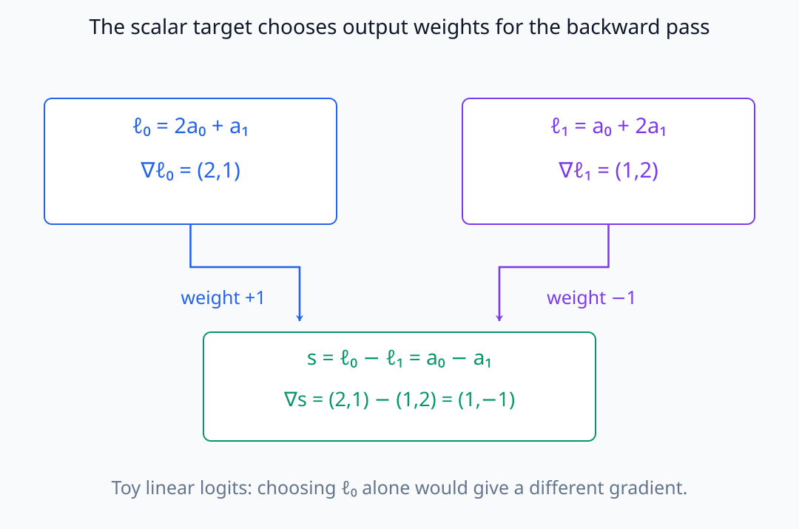
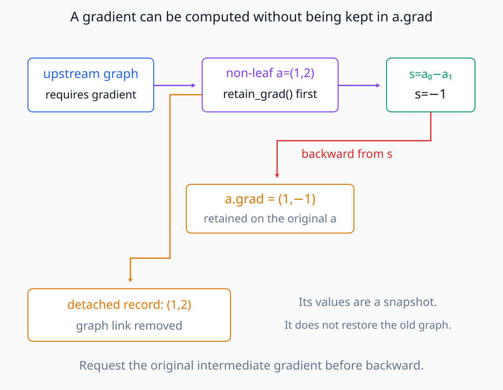
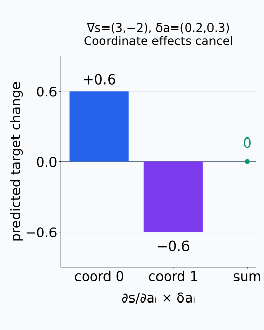
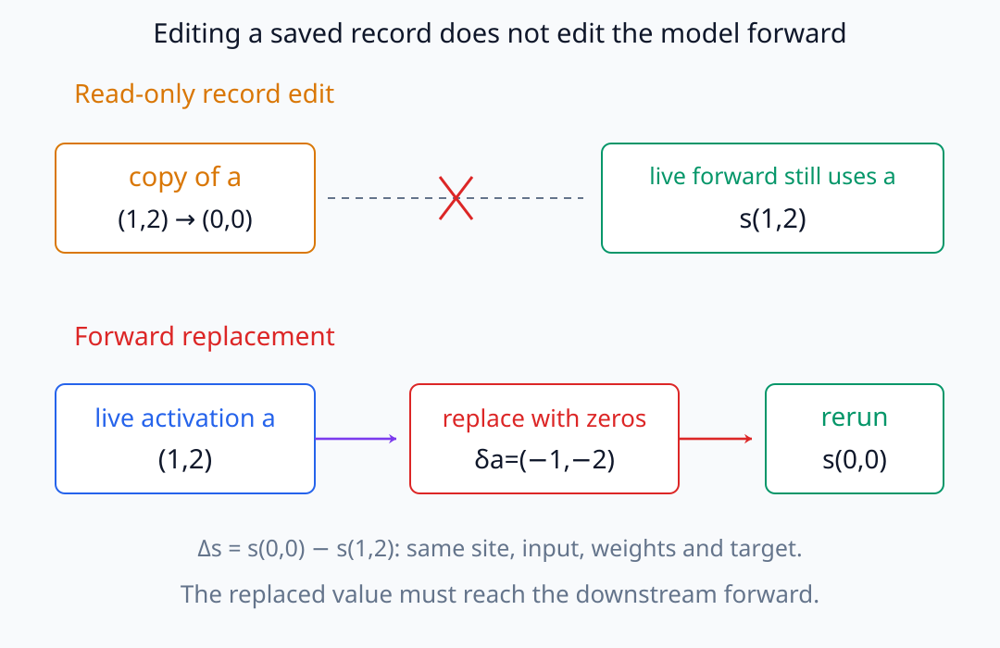
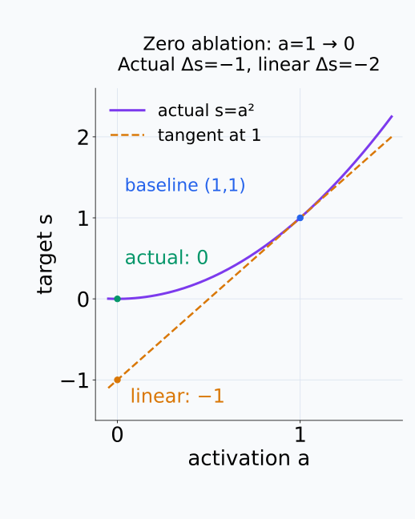

# N05-26. gradient 수집과 개입 준비

## 이 단원이 필요한 이유

activation만 저장하면 model이 무엇을 표현했는지는 볼 수 있지만 특정 output이 그 activation에 국소적으로 얼마나 민감한지는 알 수 없다. scalar target을 정하고 activation gradient를 수집하면 perturbation의 일차 효과를 계산할 수 있다. 실제 intervention과 대조해야 gradient를 인과 효과로 오해하지 않는다.

## 학습 목표

- 분석 질문을 scalar target으로 정의할 수 있다.
- non-leaf activation의 gradient를 수집할 수 있다.
- gradient와 perturbation의 내적으로 일차 변화를 계산할 수 있다.
- read-only gradient 측정과 output-changing intervention을 구분할 수 있다.
- gradient evidence의 국소성과 intervention의 off-manifold 한계를 설명할 수 있다.

## 선수지식 확인

- 선수 단원: [N05-25 hook과 activation 수집](N05-25-hook-activation-collection.md)
- 확인 질문: MLP update의 token vector를 수집하고 hook handle을 제거할 수 있는가?

## 기호와 용어

| 기호·용어 | Common spoken reading | 의미 | shape·범위 |
|---|---|---|---|
| $s(\mathbf a)$ | `s of a` | 분석할 scalar logit·loss target | scalar |
| $\nabla_{\mathbf a}s$ | `the gradient of s with respect to a` | activation에 대한 target의 local sensitivity | activation과 같은 shape |
| $\delta\mathbf a$ | `delta a` | activation에 가할 perturbation | activation과 같은 shape |
| $\nabla_{\mathbf a}s^\top\delta\mathbf a$ | `the gradient of s dot delta a` | target change의 first-order approximation | scalar |
| intervention | `intervention` | forward activation을 지정한 값으로 바꾸는 조작 | experimental operation |

## 핵심 개념 1. scalar target부터 정한다

gradient는 무엇의 derivative인지 반드시 밝혀야 한다. 예를 들어 token $t$에서 정답 $y^+$와 대안 $y^-$의 logit difference를

\[
s=\ell_{t,y^+}-\ell_{t,y^-}
\]

로 정할 수 있다. 정답 logit 하나, cross entropy와 sequence mean loss는 서로 다른 cotangent를 만들므로 질문에 맞춰 선택한다.

여기서 cotangent는 출력의 작은 변화가 선택한 scalar를 얼마나 바꾸는지를 좌표별 가중치로 나타낸다. 이 logit difference는 두 logit에 각각 $+1$과 $-1$을 주므로, activation에 대한 gradient도 $\nabla_{\mathbf a}\ell_{t,y^+}-\nabla_{\mathbf a}\ell_{t,y^-}$가 된다. cross entropy에서는 정답과 예측 확률에 따른 가중치가 쓰이고, 여러 token의 mean loss에서는 위치별 gradient가 평균된다. 같은 activation을 관찰해도 target을 바꾸면 측정하는 민감도가 달라지는 이유다.

작은 선형 logit 두 개에서 +1·−1 가중치가 gradient에 어떻게 전달되는지 보자.

<figure class="lesson-figure lesson-figure--wide" markdown="1">

<figcaption>예시의 ℓ₀ gradient는 (2,1), ℓ₁ gradient는 (1,2)다. target s=ℓ₀−ℓ₁을 선택하면 두 gradient를 빼서 (1,−1)을 얻는다. ℓ₀ 하나를 target으로 삼을 때와 측정량이 다르다.</figcaption>
</figure>

## 핵심 개념 2. activation gradient

중간 activation $\mathbf a$가 leaf tensor가 아니면 PyTorch는 기본적으로 `.grad`를 보존하지 않는다. backward 전에 `retain_grad()`를 요청하거나 `torch.autograd.grad`로 직접 gradient를 구한다.

중간 gradient가 계산되는 것과 그 값이 tensor의 `.grad`에 저장되는 것은 다르다. backpropagation은 activation을 지나며 필요한 미분을 계산하지만, 모든 중간 값을 나중에 읽을 수 있도록 남겨 두지는 않는다. `retain_grad()`는 graph에 연결된 activation의 그 값을 보존하도록 요청한다. 앞 단원처럼 미리 `detach`한 기록용 사본에 이 요청을 한다고 원래 graph가 복원되지는 않는다. 실습은 원래 module output에 gradient를 보존한 뒤, backward가 끝나면 필요한 token의 값과 gradient만 사본으로 가져온다.

graph에 연결된 원래 activation과 관찰 사본의 경로를 나누어 보자.

<figure class="lesson-figure lesson-figure--wide" markdown="1">

<figcaption>예시 target s=a₀−a₁의 backward는 원래 a에서 gradient (1,−1)을 계산한다. backward 전에 retain_grad를 요청하면 그 값을 a.grad에 보존한다. 따로 detach한 (1,2) 기록은 원래 graph를 복원하는 통로가 아니다.</figcaption>
</figure>

작은 perturbation에 대해서는

\[
s(\mathbf a+\delta\mathbf a)-s(\mathbf a)
\approx
\nabla_{\mathbf a}s^\top\delta\mathbf a
\]

이다. 이 값은 기준 activation 주변의 일차 근사다.

내적은 각 좌표의 변화량에 그 좌표의 편미분을 곱해 더한 것이다. gradient의 한 성분이 커도 그 좌표를 거의 바꾸지 않거나 다른 성분의 효과와 상쇄되면 target 변화는 작을 수 있다. 기준점에서 미분 가능한 downstream 함수의 곡선 부분을 접평면으로 근사하므로, 같은 gradient를 멀리 떨어진 activation까지 그대로 적용할 근거는 없다.

좌표별 곱을 따로 그리면, 큰 성분이 있어도 합이 작아지는 경우를 볼 수 있다.

<figure class="lesson-figure" markdown="1">

<figcaption>이 예시의 일차 변화는 3×0.2+(−2)×0.3=0이다. 두 좌표의 기여가 각각 0.6과 −0.6으로 상쇄된다. gradient 크기만 보고 이 perturbation의 target 변화가 크다고 결론낼 수 없다.</figcaption>
</figure>

## 핵심 개념 3. intervention과 비교한다

activation을 0으로 바꾸면 $\delta\mathbf a=-\mathbf a$다. gradient prediction은

\[
\Delta s_{linear}=-\nabla_{\mathbf a}s^\top\mathbf a
\]

이고 실제 forward를 다시 실행해 $\Delta s_{actual}$을 측정한다. 둘의 차이는 비선형성, perturbation 크기와 downstream normalization의 영향을 포함한다.

이 비교에서 $s(\mathbf a)$는 model weight·입력·관찰 위치를 고정하고, 그 위치에 들어가는 activation만 변수로 둔 downstream 계산을 뜻한다. 실제 개입은 해당 activation을 교체한 뒤 이어지는 계산을 다시 수행한다. 저장된 activation 사본의 숫자만 바꾸면 model forward에는 전달되지 않으므로 개입이 아니다. 두 변화량을 비교하려면 같은 위치의 같은 좌표를 교체하고 같은 scalar target을 측정해야 한다.

독립된 기록 사본의 수정과 live activation의 교체는 서로 다른 경로다.

<figure class="lesson-figure lesson-figure--wide" markdown="1">

<figcaption>위쪽에서는 독립된 사본만 0으로 바꾸므로 forward는 여전히 a=(1,2)를 사용한다. 아래쪽에서는 실제 activation을 0으로 교체해 downstream s(0,0)을 다시 계산한다. 변화량은 같은 target의 baseline s(1,2)와 비교한다.</figcaption>
</figure>

zero ablation의 변화량 크기는 $\|\mathbf a\|$다. 제거라는 조작이 간단해 보여도 작은 perturbation이라고 할 수는 없다. 따라서 gradient prediction과 실제 변화가 가까운지는 이 입력과 교체 규칙에서 확인할 결과이지, 미분식만으로 보장되는 성질이 아니다.

한 차원의 downstream 함수에서도 0까지의 유한 제거와 접선 예측이 어긋날 수 있다.

<figure class="lesson-figure" markdown="1">

<figcaption>설명용 함수 s=a²에서 baseline은 (a,s)=(1,1)이다. a를 0으로 바꾸면 실제 s는 0으로 내려가 Δs=−1이다. 같은 점의 gradient 2로 예측하면 Δs≈2×(−1)=−2가 된다. 아래 실습의 수치와 다른, 근사 오차를 드러내는 작은 함수 예시다.</figcaption>
</figure>

## 예제

실습은 token index 2의 MLP update와 target `logit[0] - logit[1]`을 사용한다. activation을 0으로 만들 때 first-order prediction은 약 $-0.03827$, 실제 target 변화는 약 $-0.03975$다. 가까운 값이지만 같은 값으로 강제하지 않는다.

## 실행 실습

### 실행 환경과 원본

- 환경: Python 3.12, PyTorch 2.13.0 CPU, NumPy 2.5.3
- 확인일: 2026-10-01
- 구성요소 등급: PyTorch-specific gradient·intervention API
- 공통 구현: `labs/N05/tiny_decoder.py`
- 예제 ID: `n05_26_gradient_intervention`
- 코드 원본: `labs/N05/n05_26_gradient_intervention.py`
- 테스트: `tests/N05/test_n05_26.py`
- 실행 명령: `.venv\Scripts\python.exe -m labs.N05.n05_26_gradient_intervention`

### 자원 예산

parameter 300개의 model에서 sequence length 4 forward·backward 한 번과 intervention forward 한 번을 실행한다.

### 실제 코드와 실행 결과

<!-- N05_EXAMPLE: n05_26_gradient_intervention -->

### 검사

테스트는 선택 activation gradient의 shape·값, intervention target 변화와 first-order approximation 오차를 확인한다.

## 대조군과 개입 준비

zero ablation은 간단하지만 자연 activation distribution 밖으로 벗어날 수 있다. mean replacement, matched random vector, resampling과 patching을 대조군으로 고려한다. 어떤 baseline이 적절한지는 질문과 component scale에 달려 있다.

intervention 전에는 대상 module path, token, target, replacement rule, paired input, seed와 metric을 고정한다. 여러 layer·token을 탐색한 뒤 가장 큰 효과만 보고하면 다중비교 문제가 생긴다.

## 모델 해석과의 연결

gradient가 0이 아니면 기준점에서 작은 변화가 target에 영향을 줄 수 있다는 local sensitivity evidence다. activation이 행동에 필요하거나 충분하다는 뜻은 아니다.

실제 intervention effect도 선택한 replacement와 입력 분포에 조건부다. 한 예제의 큰 변화에서 일반적인 circuit 역할로 넘어가려면 dataset, control과 uncertainty가 필요하다.

## 흔한 오해

### 오해 1. 큰 gradient는 activation 값이 크다는 뜻이다

gradient는 target의 국소 변화율이고 activation magnitude와 다른 양이다.

### 오해 2. gradient dot activation은 정확한 제거 효과다

일차 Taylor 근사다. perturbation이 크거나 downstream 계산이 비선형이면 오차가 커질 수 있다.

### 오해 3. zero ablation은 중립적인 개입이다

0이 자연스러운 baseline인지 확인해야 한다. normalization과 distribution 때문에 off-manifold input이 될 수 있다.

## 연습문제

### 1. target 선택

두 answer token A와 B의 선호를 분석할 scalar target을 적어라.

해설 보기
$s=\ell_A-\ell_B$ 같은 logit difference를 쓸 수 있다. position도 함께 지정해야 한다.

### 2. gradient shape

activation shape가 `(4,)`이면 scalar target에 대한 gradient shape는?

해설 보기
`(4,)`로 activation과 같다.

### 3. 일차 변화

gradient가 $(2,-1)$, perturbation이 $(0.1,0.3)$이면 predicted change는?

해설 보기
$2(0.1)+(-1)(0.3)=-0.1$이다.

### 4. zero ablation

activation $a=(1,-2)$를 0으로 만들 때 $\delta a$는?

해설 보기
$-a=(-1,2)$다.

### 5. 불일치 진단

first-order prediction과 actual intervention이 크게 다르면 무엇을 의심하는가?

해설 보기
perturbation이 너무 크거나 downstream nonlinear·normalization 효과가 큰지, target과 hook 위치가 같은지 확인한다.

### 6. 주장 범위

한 token에서 zero ablation이 logit을 크게 낮췄다. component가 모든 입력에서 필요하다고 말할 수 있는가?

해설 보기
없다. 해당 입력과 intervention에 대한 효과이며 dataset-level paired experiment와 대조군이 필요하다.

## 근거와 갱신 경계

non-leaf tensor의 gradient 보존과 hook contract는 [PyTorch Tensor 문서](https://docs.pytorch.org/docs/stable/tensors.html)와 [`nn.Module` 문서](https://docs.pytorch.org/docs/stable/generated/torch.nn.Module.html)를 확인했다. hook 실행과 compiled graph 호환성은 framework version별 구현 항목이다.

## 단원 요약

- gradient 수집 전에 scalar target을 명시한다.
- activation gradient는 target의 local sensitivity다.
- gradient와 perturbation의 내적은 first-order change를 근사한다.
- 실제 intervention forward와 근삿값을 대조한다.
- zero ablation의 baseline·off-manifold·다중비교 한계를 기록한다.

## 통과 기준

- 질문을 scalar target으로 쓸 수 있는가?
- non-leaf activation gradient를 수집할 수 있는가?
- 일차 변화를 계산할 수 있는가?
- read-only 측정과 intervention을 구분할 수 있는가?
- 적절한 대조군과 주장 한계를 제시할 수 있는가?

## 다음 단원

- [N05-27 checkpoint와 모델 상태](N05-27-checkpoint-model-state.md)

## 집필자 점검표

- [x] 학습 목표가 관찰 가능한 행동으로 작성됐다.
- [x] scalar target·gradient·intervention을 연결했다.
- [x] 모든 문제에 해설이 있다.
- [x] 모델 해석 주장의 강도를 구분했다.
- [x] 용어집과 표기 규칙을 따랐다.
- [x] Common spoken reading이 실제 영어 학술 발화이며 한글 음역이나 기계적 직역을 포함하지 않는다.
- [x] 선수지식 밖의 내용을 몰래 요구하지 않는다.
- [x] 내부 링크와 수식 렌더링을 확인했다.
- [x] Markdown에 실행 코드를 손으로 복제하지 않았다.
- [x] 코드 원본·테스트 경로·자원 예산·확인일을 기록했다.
- [x] activation-gradient·intervention test가 있다.

