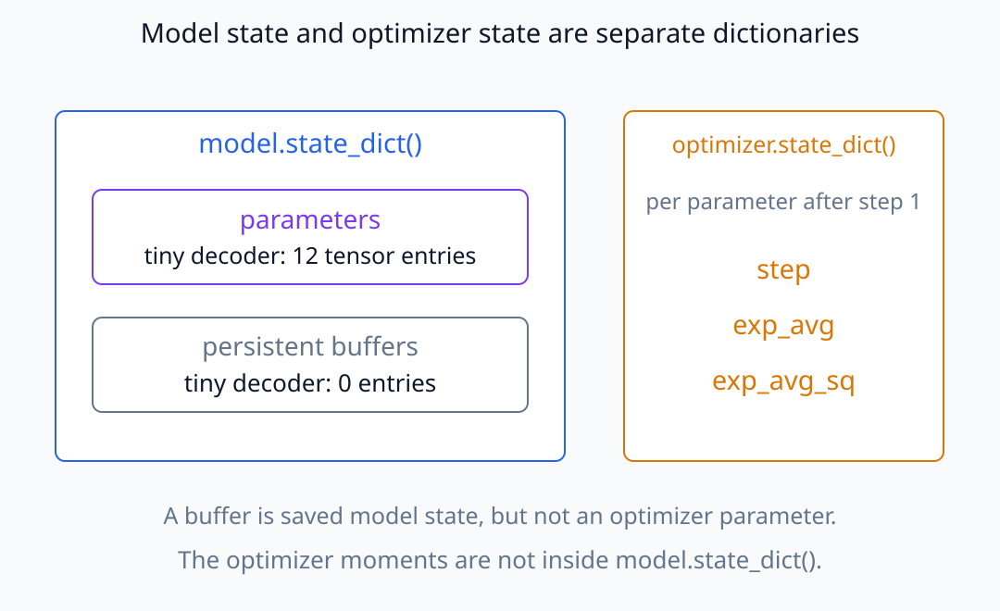
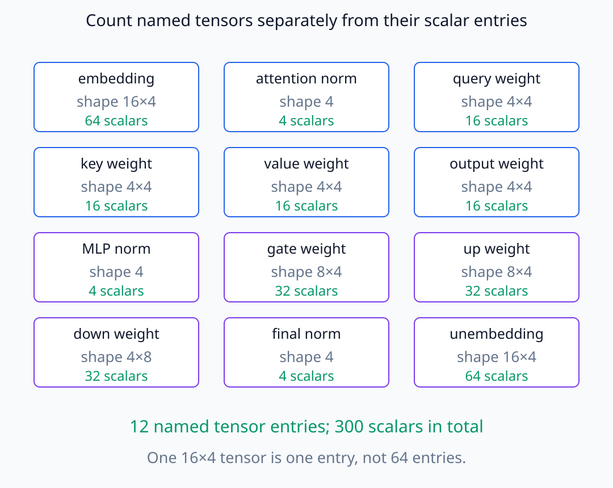
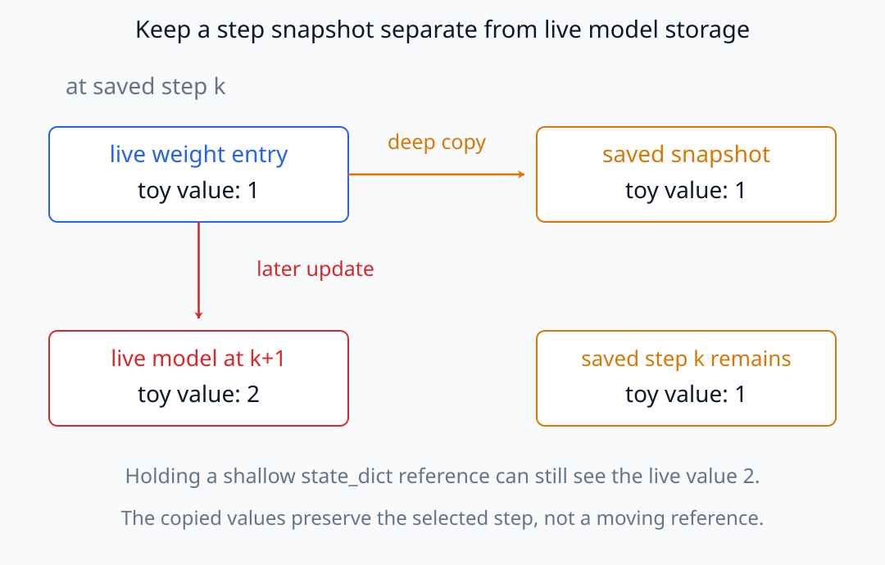
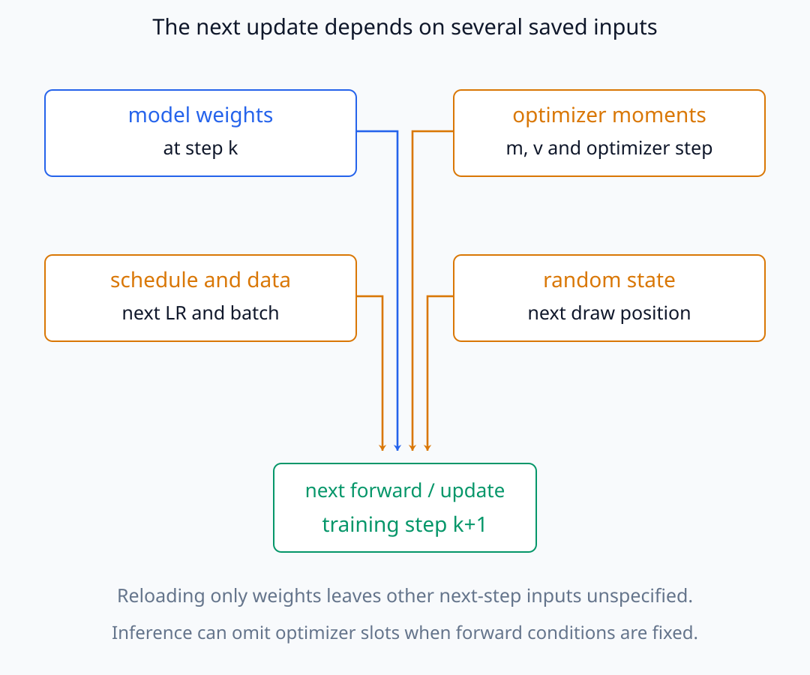
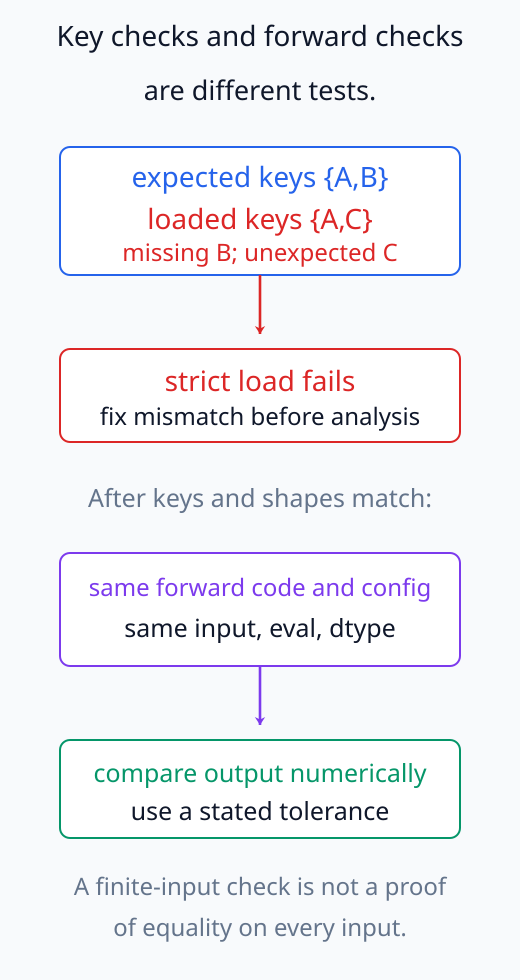

# N05-27. checkpoint와 모델 상태

## 이 단원이 필요한 이유

checkpoint는 단순한 weight 파일이 아니다. inference를 재현할 model state와 training을 이어갈 optimizer·scheduler·step·random state는 서로 다른 항목이다. 분석 대상 checkpoint를 잘못 지정하면 같은 model 이름으로도 다른 학습 시점을 비교하게 된다.

## 학습 목표

- parameter, persistent buffer와 optimizer state를 구분할 수 있다.
- inference checkpoint와 resumable training checkpoint의 요구 항목을 열거할 수 있다.
- `state_dict`를 strict하게 load하고 key 불일치를 검사할 수 있다.
- checkpoint step과 model revision을 분석 provenance에 기록할 수 있다.
- 서로 다른 checkpoint 비교에서 training data·seed·architecture 통제를 설명할 수 있다.

## 선수지식 확인

- 선수 단원: [N05-26 gradient 수집과 개입 준비](N05-26-gradient-collection-intervention-preparation.md)
- 확인 질문: model parameter와 AdamW의 moment estimate가 각각 어떤 계산에 쓰이는가?

## 기호와 용어

| 기호·용어 | Common spoken reading | 의미 | shape·범위 |
|---|---|---|---|
| parameter | `parameter` | gradient update로 학습되는 module tensor | model state |
| persistent buffer | `persistent buffer` | 학습 parameter는 아니지만 `state_dict`에 저장되는 tensor | module state |
| optimizer state | `optimizer state` | moment, step 등 다음 update에 필요한 상태 | training state |
| checkpoint | `checkpoint` | 특정 학습 시점의 재현 항목을 묶은 artifact | serialized state |
| revision | `revision` | repository에서 특정 checkpoint를 가리키는 ref·commit | identifier |
| strict load | `strict load` | expected key와 loaded key의 정확한 일치를 요구하는 load | validation rule |

## 핵심 개념 1. model state

PyTorch module의 `state_dict`에는 parameter와 persistent buffer가 들어간다. parameter는 optimizer가 갱신하는 학습 대상이고 buffer는 running statistic처럼 forward 상태에 영향을 주지만 gradient parameter가 아닌 tensor다.

model이 저장하는 두 종류의 tensor와 optimizer가 따로 저장하는 slot을 구분하자.

<figure class="lesson-figure lesson-figure--wide" markdown="1">

<figcaption>tiny decoder의 model state에는 parameter tensor 12개와 persistent buffer 0개가 있다. optimizer는 step 뒤 각 parameter의 step·exp_avg·exp_avg_sq를 별도 dictionary에 둔다. 다른 architecture의 buffer 개수를 0으로 일반화하지 않는다.</figcaption>
</figure>

교육용 tiny decoder에는 parameter tensor 12개와 persistent buffer 0개가 있다. 여기서 12는 이름을 가진 tensor entry의 수이고, 각 tensor의 원소 수를 모두 더한 학습 scalar 수는 300이다. 다른 architecture에서는 position table, running statistic이나 mask를 buffer로 등록할 수 있으므로 개수를 가정하지 않는다.

실습 구현의 tensor별 shape를 세면 두 가지 개수가 어떻게 다른지 확인할 수 있다.

<figure class="lesson-figure lesson-figure--wide" markdown="1">

<figcaption>각 칸은 이름을 가진 tensor entry 하나다. 예를 들어 embedding의 shape 16×4는 entry 하나이면서 scalar 64개다. 네 attention weight와 세 MLP weight, 세 norm vector 및 embedding·unembedding을 모두 합하면 12 entry와 300 scalar를 얻는다.</figcaption>
</figure>

`state_dict`는 이 이름과 tensor를 연결하여 load할 위치를 정한다. 그렇다고 `state_dict()`를 호출하는 순간 독립된 checkpoint 사본이 만들어지는 것은 아니다. 반환된 tensor는 model의 storage를 참조할 수 있어, memory에 그 dictionary만 보관한 채 training을 계속하면 저장하려던 값도 바뀔 수 있다. 실습에서 state를 깊은 복사한 이유는 선택한 step의 값을 이후 update와 분리하기 위해서다.

값을 선택한 step에 고정하는 사본과 이후 update를 따라가는 참조를 비교하자.

<figure class="lesson-figure lesson-figure--wide" markdown="1">

<figcaption>예시 weight가 step k에서 1이고 이후 2로 바뀌었다고 하자. 독립적으로 복사한 snapshot은 저장하려던 step k의 값 1을 유지한다. live storage를 참조하는 dictionary만 보관하면 이후 값 2를 보게 될 수 있다.</figcaption>
</figure>

## 핵심 개념 2. training을 재개할 상태

AdamW를 같은 update에서 이어가려면 parameter만으로 부족하다. 보통 checkpoint에 다음을 넣는다.

- model `state_dict`
- optimizer `state_dict`
- scheduler와 mixed-precision scaler state
- global step·epoch와 data position
- random number generator state
- model config, tokenizer와 code revision

inference만 재현할 때는 optimizer state가 필요 없을 수 있다. 반면 training trajectory를 분석하거나 정확히 resume하려면 위 항목의 누락이 결과를 바꿀 수 있다.

AdamW의 다음 update는 현재 gradient뿐 아니라 과거 gradient로 만든 moment와 누적 step에 의존한다. weight가 같아도 moment를 0으로 다시 시작하면 이어서 학습한 경우와 update가 달라질 수 있다. scheduler는 다음 learning rate를, data position은 다음에 계산할 gradient의 입력을 정한다. RNG state는 난수열의 현재 위치를 보존하므로, 처음 사용한 seed만 다시 지정하는 것과도 다르다. 정확한 resume은 같은 weight에서 새 학습을 시작하는 것이 아니라 다음 계산에 필요한 상태까지 이어 붙이는 일이다.

다음 step에 들어가는 상태의 의존 관계를 모아 보면 weight만으로 충분하지 않은 이유를 볼 수 있다.

<figure class="lesson-figure lesson-figure--wide" markdown="1">

<figcaption>네 경로는 다음 계산에 필요한 서로 다른 상태다. weight가 같아도 moment·learning rate·다음 batch·난수 위치가 다르면 이어지는 계산이 달라질 수 있다. optimizer state는 고정된 inference만 재현할 때와 정확한 training resume에서 요구가 다르다.</figcaption>
</figure>

## 핵심 개념 3. load 검증

`load_state_dict(..., strict=True)`는 loaded key가 model이 기대하는 key와 정확히 맞는지 검사한다. missing·unexpected key를 무시하면 일부 parameter가 새 초기값인 상태로 남을 수 있다.

같은 architecture·config에 같은 state를 load하고 input·eval mode·dtype 등 forward 조건을 맞췄다면 정한 tolerance 아래 같은 output을 내야 한다. key 일치만 아니라 forward equivalence도 확인한다.

key 검사는 tensor를 어느 이름에 넣을지 확인하지만, 그 이름을 사용하는 forward code가 같다는 것까지 증명하지는 않는다. 같은 shape의 weight를 load해도 residual 순서나 normalization 계산이 다르면 다른 함수가 된다. 또한 state load만으로 평가 모드가 설정되는 것은 아니므로, 실습은 원본과 reload model에 각각 `eval()`을 적용한 뒤 비교한다. 몇 입력의 output 일치는 load 절차를 확인하는 검사이지 모든 입력에서 함수가 같다는 증명은 아니다.

key 불일치를 찾는 검사와 forward 결과를 대조하는 검사를 나누어 수행한다.

<figure class="lesson-figure" markdown="1">

<figcaption>키 이름 A·B·C는 불일치를 설명하는 예시다. 기대한 B가 없고 C가 추가됐다면 strict load를 해결한 뒤 분석한다. key와 shape가 맞아도 같은 config·forward code·입력·eval·dtype에서 output을 별도로 대조한다.</figcaption>
</figure>

## 예제

실습은 AdamW step 한 번 뒤 model state와 optimizer state를 memory에서 복사한다. model parameter entry는 12개, buffer는 0개이고 optimizer에는 12개 parameter 각각의 `step`, `exp_avg`, `exp_avg_sq`가 생긴다. 새 model에 strict load한 뒤 logit 최대 차이는 0이다.

## 실행 실습

### 실행 환경과 원본

- 환경: Python 3.12, PyTorch 2.13.0 CPU, NumPy 2.5.3
- 확인일: 2026-10-01
- 구성요소 등급: PyTorch-specific serialization contract
- 공통 구현: `labs/N05/tiny_decoder.py`
- 예제 ID: `n05_27_checkpoint_state`
- 코드 원본: `labs/N05/n05_27_checkpoint_state.py`
- 테스트: `tests/N05/test_n05_27.py`
- 실행 명령: `.venv\Scripts\python.exe -m labs.N05.n05_27_checkpoint_state`

### 자원 예산

parameter 300개의 model에서 batch 1, sequence length 4의 training step 한 번만 실행한다. checkpoint 파일은 disk에 쓰지 않는다.

### 실제 코드와 실행 결과

<!-- N05_EXAMPLE: n05_27_checkpoint_state -->

### 검사

테스트는 model state key 수, parameter·buffer 수, strict load 결과, reload logit 일치와 optimizer slot·step을 확인한다.

## Pythia checkpoint를 읽는 법

Pythia main suite는 initialization의 step 0, 초기의 촘촘한 step과 이후 1,000-step 간격 checkpoint를 공개한다. 최종 `step143000`은 각 model repository의 `main`과 대응한다고 공식 repository가 설명한다. 분석에서는 model ID만 쓰지 말고 requested revision과 resolved commit SHA를 기록한다.

`v0` 계열은 수정된 main suite와 training setup이 다르므로 섞지 않는다. model과 tokenizer도 같은 repository·revision contract로 고정한다.

## 모델 해석과의 연결

두 checkpoint activation 차이는 학습 중 변화와 연관되지만 data order, optimizer state, seed와 code가 함께 달라졌다면 step 효과만 분리할 수 없다. Pythia처럼 같은 data order와 여러 checkpoint를 제공하는 suite도 비교 질문과 metric을 사전에 정해야 한다.

checkpoint 사이 neuron index가 같다는 사실만으로 같은 feature라고 보장되지 않는다. representation alignment와 function-level behavior를 별도로 측정한다.

## 흔한 오해

### 오해 1. `state_dict`에는 parameter만 있다

persistent buffer도 포함된다. optimizer state는 별도 optimizer `state_dict`에 있다.

### 오해 2. weight만 load하면 training을 정확히 이어갈 수 있다

optimizer moment, scheduler, step, RNG와 data position이 없으면 update trajectory가 달라질 수 있다.

### 오해 3. 같은 model 이름이면 같은 checkpoint다

revision, commit과 training step이 다를 수 있다.

## 연습문제

### 1. 분류

AdamW의 `exp_avg`는 model parameter, buffer와 optimizer state 중 무엇인가?

해설 보기
optimizer state다. 다음 update 계산에 사용된다.

### 2. buffer

BatchNorm running mean은 일반적으로 학습 parameter인가 persistent buffer인가?

해설 보기
persistent buffer다. gradient로 직접 학습하지 않지만 `state_dict`에 저장된다.

### 3. inference

고정 model의 eval output만 재현할 때 AdamW state가 필요한가?

해설 보기
필요하지 않다. inference에는 model state와 config·tokenizer·입력·dtype 등 forward 조건이 필요하다.

### 4. resume

AdamW training을 정확히 이어갈 때 weight 외에 필요한 state 두 가지를 적어라.

해설 보기
optimizer moments·step, scheduler, gradient scaler, RNG와 data position 가운데 두 가지 이상을 들 수 있다.

### 5. strict load

unexpected key가 하나 나왔는데 무시하고 분석을 진행해도 되는가?

해설 보기
먼저 architecture·naming·checkpoint 불일치 원인을 해결해야 한다. key를 임의로 무시하면 어떤 state가 적용됐는지 불분명해진다.

### 6. 시점 비교

step 10,000과 50,000을 비교할 때 model ID 외에 최소 무엇을 고정해야 하는가?

해설 보기
suite·seed·architecture·data order, tokenizer, input dataset와 metric을 고정하고 각 revision·resolved SHA를 기록한다.

## 근거와 갱신 경계

parameter·persistent buffer의 `state_dict` 계약과 training checkpoint 구성은 [PyTorch serialization 문서](https://docs.pytorch.org/docs/stable/notes/serialization)와 [공식 saving·loading tutorial](https://docs.pytorch.org/tutorials/beginner/saving_loading_models.html)을 확인했다. Pythia의 checkpoint 간격과 final revision은 [공식 Pythia repository](https://github.com/EleutherAI/pythia)를 따른다.

## 단원 요약

- model `state_dict`에는 parameter와 persistent buffer가 들어간다.
- optimizer state와 global training state는 model state와 별도다.
- resumable checkpoint는 weight 파일보다 많은 항목이 필요하다.
- strict key 검사와 forward equivalence로 load를 검증한다.
- checkpoint 비교에는 revision, step, seed, data와 code provenance가 필요하다.

## 통과 기준

- 세 state 종류를 분류할 수 있는가?
- inference와 training resume 요구 항목을 나눌 수 있는가?
- strict load를 검증할 수 있는가?
- checkpoint revision을 기록할 수 있는가?
- 학습 시점 비교의 통제 변수를 설명할 수 있는가?

## 다음 단원

- [N05-28 종합 실습: 한 token의 경로](N05-28-one-token-path.md)

## 집필자 점검표

- [x] 학습 목표가 관찰 가능한 행동으로 작성됐다.
- [x] model·buffer·optimizer·global state를 구분했다.
- [x] 모든 문제에 해설이 있다.
- [x] 모델 해석 주장의 강도를 구분했다.
- [x] 용어집과 표기 규칙을 따랐다.
- [x] Common spoken reading이 실제 영어 학술 발화이며 한글 음역이나 기계적 직역을 포함하지 않는다.
- [x] 선수지식 밖의 내용을 몰래 요구하지 않는다.
- [x] 내부 링크와 수식 렌더링을 확인했다.
- [x] Markdown에 실행 코드를 손으로 복제하지 않았다.
- [x] 코드 원본·테스트 경로·자원 예산·확인일을 기록했다.
- [x] state·strict load·optimizer test가 있다.

