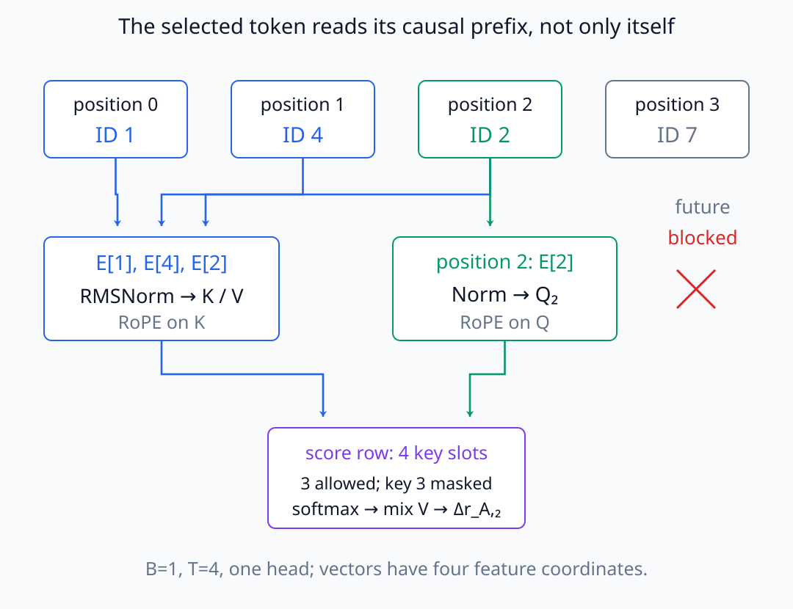
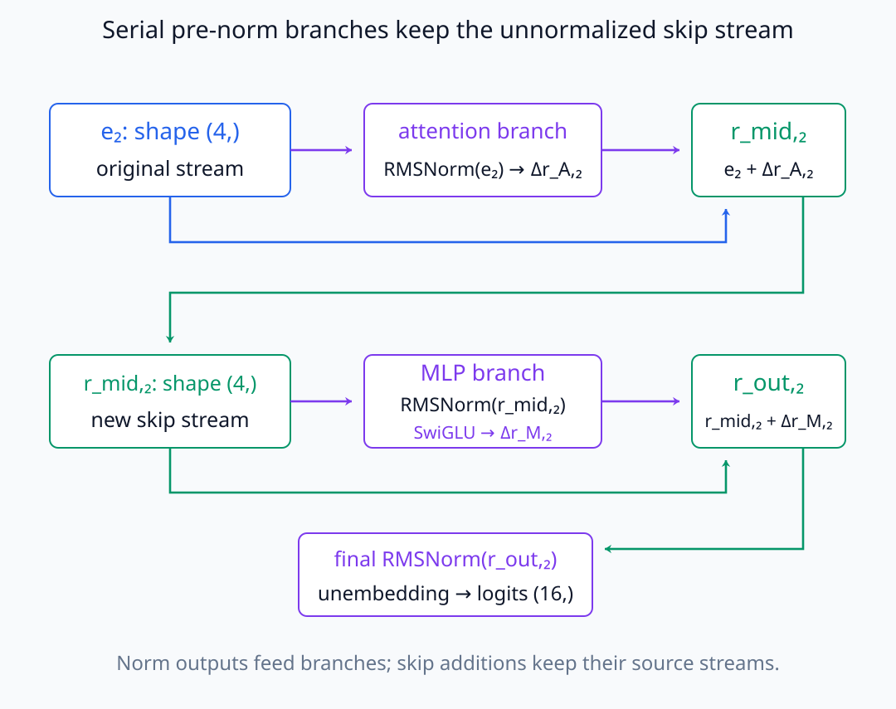
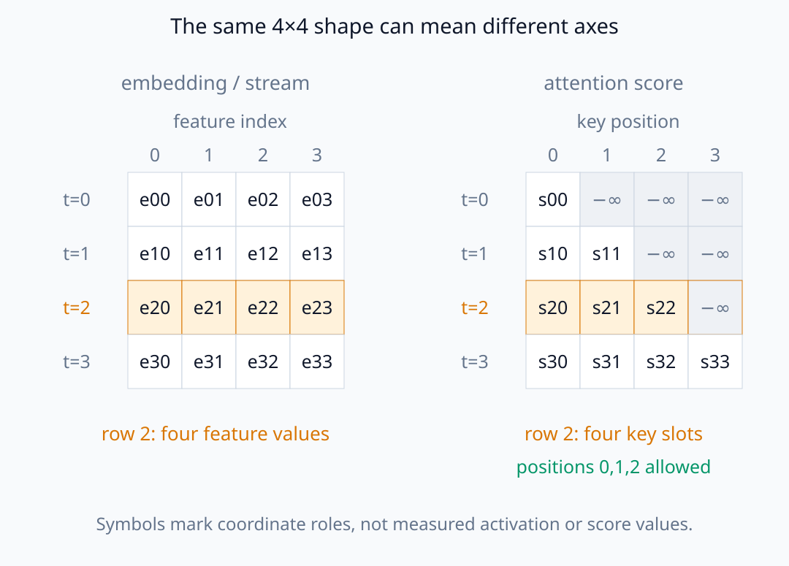
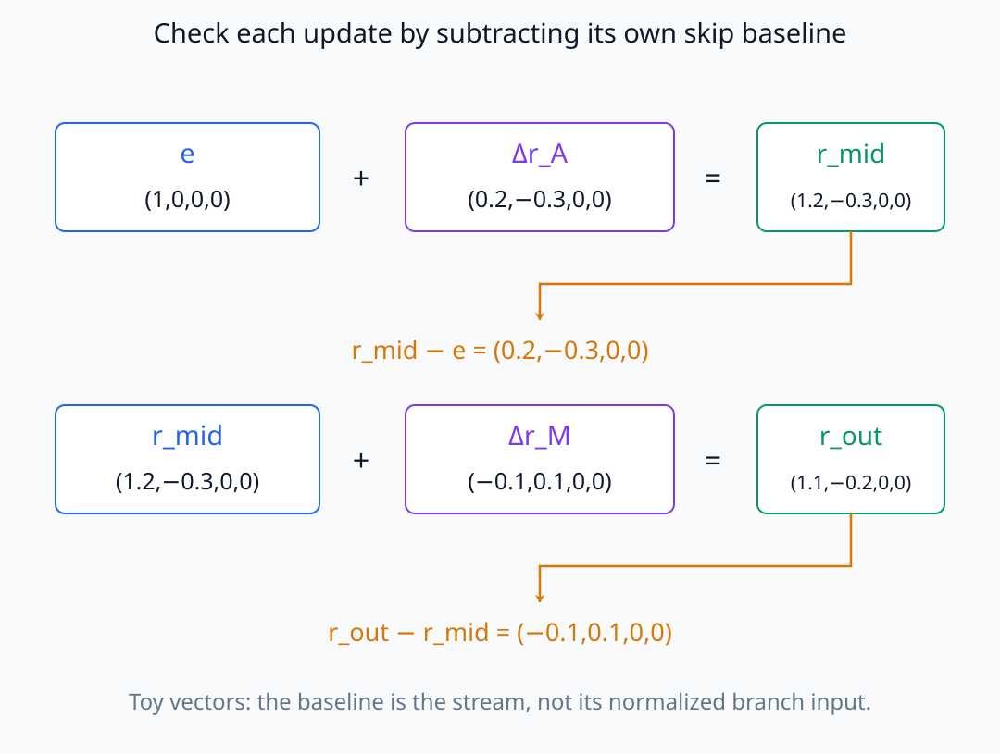
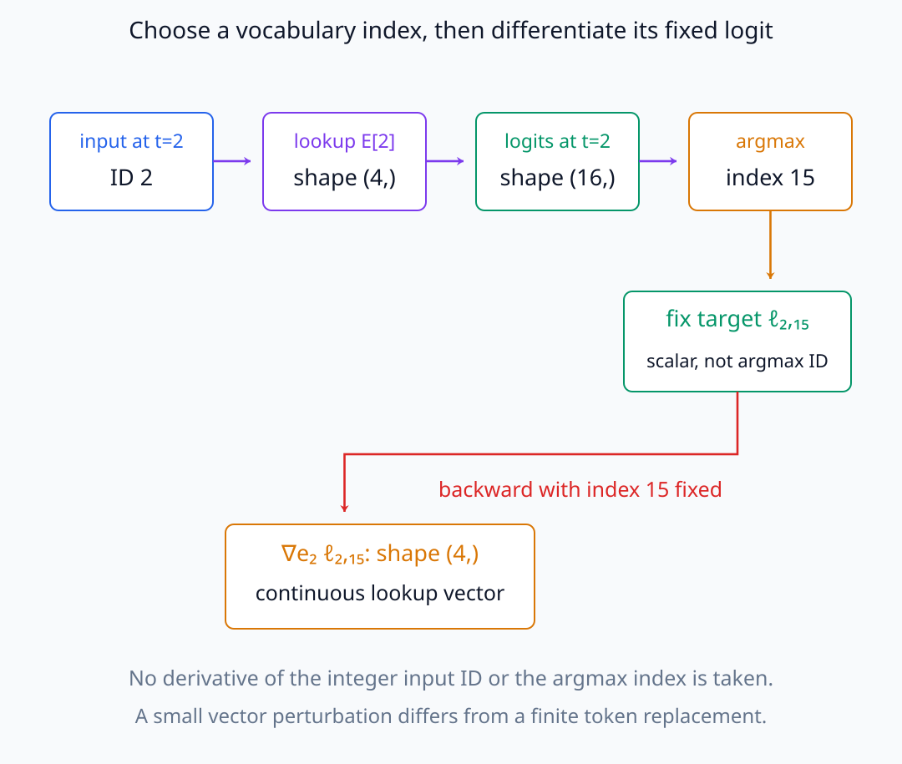
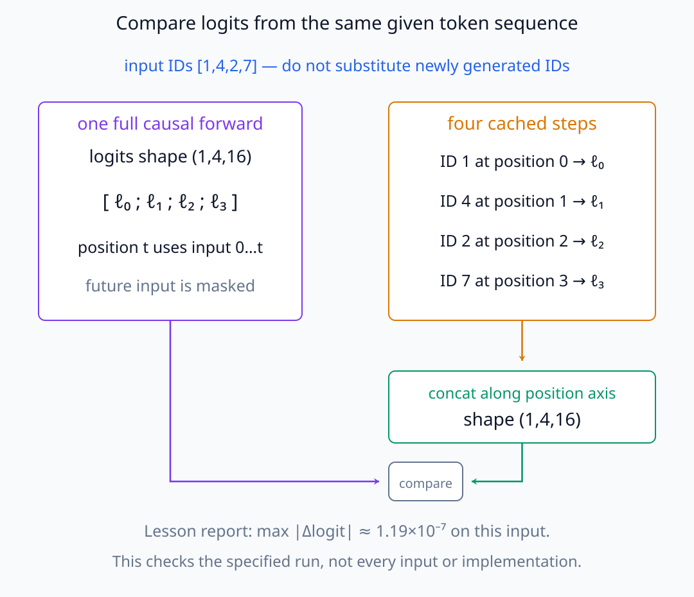

# N05-28. 종합 실습: 한 token의 경로

## 이 단원이 필요한 이유

N05의 마지막 목표는 component 이름을 외우는 것이 아니라 한 token이 ID에서 logit까지 지나가는 tensor 경로를 재현하는 것이다. 이 종합 실습은 forward activation, residual update, output target의 gradient와 inference cache를 같은 model·input에 연결한다.

## 학습 목표

- 선택 token의 ID부터 vocabulary logit까지 tensor 경로를 순서대로 추적할 수 있다.
- 각 지점의 shape와 residual equality를 검산할 수 있다.
- 선택 logit의 embedding gradient를 수집할 수 있다.
- full causal forward와 cached inference를 대조할 수 있다.
- 관찰·local sensitivity·intervention·checkpoint evidence를 서로 다른 주장으로 분류할 수 있다.

## 선수지식 확인

- 선수 단원: [N05-27 checkpoint와 모델 상태](N05-27-checkpoint-model-state.md)
- 확인 질문: activation hook, scalar target, gradient, KV cache와 model state를 각각 한 문장으로 구분할 수 있는가?

## 기호와 용어

| 기호·용어 | Common spoken reading | 의미 | shape·범위 |
|---|---|---|---|
| $x_t$ | `the token at position t` | 선택한 input token ID | integer in $[0,V)$ |
| $\mathbf e_t$ | `the embedding at position t` | embedding table에서 조회한 vector | $\mathbb R^{d_{model}}$ |
| $\Delta\mathbf r_{A,t}$ | `the attention update at position t` | attention이 stream에 쓰는 update | $\mathbb R^{d_{model}}$ |
| $\Delta\mathbf r_{M,t}$ | `the MLP update at position t` | MLP가 stream에 쓰는 update | $\mathbb R^{d_{model}}$ |
| $\ell_{t,v}$ | `the logit for token v at position t` | 선택 position·vocabulary token의 logit | scalar |
| $\nabla_{\mathbf e_t}\ell_{t,v}$ | `the gradient of the logit with respect to the embedding` | selected logit의 embedding local sensitivity | $\mathbb R^{d_{model}}$ |

## 전체 계산 지도

선택 token position $t$의 경로를 다음 순서로 읽는다.

\[
x_t
\rightarrow \mathbf e_t
\rightarrow \operatorname{RMSNorm}
\rightarrow Q_t,K_{\le t},V_{\le t}
\rightarrow \Delta\mathbf r_{A,t}
\rightarrow \mathbf r_{mid,t}
\]

\[
\rightarrow \operatorname{RMSNorm}
\rightarrow \operatorname{SwiGLU}
\rightarrow \Delta\mathbf r_{M,t}
\rightarrow \mathbf r_{out,t}
\rightarrow \operatorname{RMSNorm}
\rightarrow \boldsymbol\ell_t
\]

attention update는 같은 position의 현재 embedding뿐 아니라 causal prefix의 K·V를 통해 앞 token에도 의존한다. 한 token의 경로는 독립된 한 줄 계산이 아니라 다른 position과 연결된 graph의 선택 slice다.

실습의 position 2가 어떤 prefix를 읽는지 token ID와 위치를 구분해 보자.

<figure class="lesson-figure lesson-figure--wide" markdown="1">

<figcaption>입력 ID는 [1,4,2,7]이고 선택 position은 2다. 현재 query는 E[2]에서 만들지만 K·V는 position 0·1·2의 embedding에서도 온다. position 3의 ID 7은 미래라 이 query의 가중합에 들어가지 않는다.</figcaption>
</figure>

계산 지도에서 첫 RMSNorm은 position별 attention 입력을 만들고, 이 입력의 projection과 RoPE가 attention에 사용할 Q·K를 만든다. prefix의 K·V도 각 위치의 입력에서 계산된 것이다. 두 번째 RMSNorm은 attention update를 더한 뒤의 stream을 MLP 입력으로 바꾼다. 이처럼 normalization에 들어가는 stream은 서로 다르며, 정규화된 branch 입력과 residual 덧셈에 남겨 둔 stream도 구분해서 추적해야 한다.

두 branch의 normalization 입력과 덧셈에 남기는 skip stream을 나누어 읽는다.

<figure class="lesson-figure lesson-figure--wide" markdown="1">

<figcaption>첫 skip의 기준은 e₂이고 둘째 skip의 기준은 r_mid,₂다. RMSNorm은 각 branch의 입력을 만들며 skip의 원래 stream을 대신하지 않는다. attention과 MLP의 update를 더한 r_out,₂는 마지막 RMSNorm과 unembedding으로 보낸다.</figcaption>
</figure>

## shape ledger

실습은 $B=1$, $T=4$, $d_{model}=4$, head 1개, layer 1개와 vocabulary 16을 사용한다.

| 대상 | 전체 shape | token $t=2$ slice |
|---|---|---|
| input IDs | $(1,4)$ | scalar ID |
| embedding·residual·update | $(1,4,4)$ | $(4,)$ |
| Q·K·V | $(1,1,4,4)$ | head·position slice $(4,)$ |
| attention score | $(1,1,4,4)$ | allowed prefix 3개 |
| logits | $(1,4,16)$ | $(16,)$ |
| embedding gradient | $(1,4,4)$ | $(4,)$ |

이 실습에서는 sequence length와 feature dimension이 모두 4여서 shape의 숫자만으로 축을 구별할 수 없다. embedding의 마지막 축은 feature 축이지만, attention score의 마지막 두 축은 각각 query와 key position이다. $t=2$의 score row도 길이는 4이며, 그중 position 0·1·2의 세 항만 허용되고 마지막 항은 mask된다. vocabulary 크기 16은 마지막 logit 축의 후보 수이지 실제로 입력한 token 수가 아니다.

같은 4×4 배열에서 열이 가리키는 대상을 비교해 보자.

<figure class="lesson-figure lesson-figure--wide" markdown="1">

<figcaption>왼쪽 행은 token position, 열은 feature다. 오른쪽 행은 query position, 열은 key position이다. t=2 행을 선택하면 왼쪽은 feature 네 개를 모두 남기고, 오른쪽은 네 key slot 중 앞 세 개만 허용한다. e와 s의 첨자는 위치를 설명하는 기호이며 실제 측정값이 아니다.</figcaption>
</figure>

## residual 검산

선택 position에서 반드시

\[
\mathbf r_{mid,t}=\mathbf e_t+\Delta\mathbf r_{A,t}
\]

\[
\mathbf r_{out,t}=\mathbf r_{mid,t}+\Delta\mathbf r_{M,t}
\]

가 성립해야 한다. 이 equality는 component hook을 잘못 잡았는지 찾는 기본 검사다.

첫 덧셈의 기준은 정규화된 attention 입력이 아니라 원래 embedding이고, 둘째 덧셈의 기준은 정규화된 MLP 입력이 아니라 $\mathbf r_{mid,t}$다. 따라서 attention update는 $\mathbf r_{mid,t}-\mathbf e_t$, MLP update는 $\mathbf r_{out,t}-\mathbf r_{mid,t}$와 대조할 수 있다. 모든 vector가 같은 shape여도 서로 같은 계산 지점인 것은 아니다. norm output이나 addition 뒤 stream을 update로 잘못 수집하면 이 관계를 만족하지 않을 수 있다.

설명용 작은 vector를 더한 뒤, 각 덧셈의 기준을 빼서 update를 검산하자.

<figure class="lesson-figure lesson-figure--wide" markdown="1">

<figcaption>위쪽은 r_mid−e에서 attention update를, 아래쪽은 r_out−r_mid에서 MLP update를 복원한다. 숫자는 두 검산의 기준을 설명하는 예시이며 실습의 activation 출력이 아니다. 두 경우 모두 normalized branch 입력을 빼지 않는다.</figcaption>
</figure>

## output과 gradient

실습의 token index 2에서 greedy vocabulary index는 15다. 선택 target을 $\ell_{2,15}$로 두고

\[
\nabla_{\mathbf e_2}\ell_{2,15}
\]

를 backward로 구한다. 이 gradient는 같은 weight·input의 기준점에서 embedding perturbation에 대한 local sensitivity다. token 15가 왜 선택됐는지에 대한 완전한 설명은 아니다.

여기서는 forward에서 선택된 index 15를 고정한 뒤 그 logit을 미분한다. `argmax`의 정수 index 자체를 미분하는 것이 아니다. position 2의 logit은 다음 token의 후보 점수이고, embedding gradient의 변수는 입력 token ID가 아니라 lookup 뒤의 연속 vector다. 이 vector의 작은 변화에 대한 민감도와 입력을 다른 token ID로 교체하는 유한 변화는 같지 않다. 또한 선택 logit만 높아지는 것과 대안 logit보다 더 높아져 선택이 유지되는 것은 다른 질문이다.

index를 고르는 단계와 그 index의 scalar를 미분하는 단계를 분리한다.

<figure class="lesson-figure lesson-figure--wide" markdown="1">

<figcaption>이 실습에서 입력 ID 2의 lookup vector는 shape (4,)이고, position 2의 logit vector는 shape (16,)다. 먼저 선택된 vocabulary index 15를 고정한 뒤 ℓ₂,₁₅를 미분한다. 정수 ID나 argmax index를 미분하는 과정은 아니다.</figcaption>
</figure>

## cache 대조

full forward의 layer별 K·V shape는 `(1,1,4,4)`다. 같은 네 token을 하나씩 넣어 cache를 늘리고 각 step logit을 이어 붙였을 때 full logits와의 최대 절대 차이는 약 $1.19\times10^{-7}$이다. 이 입력에서 두 계산의 output이 tolerance 아래 일치한다.

비교하는 것은 동일한 주어진 token 열이다. cached 경로도 model이 새로 고른 token을 넣는 것이 아니라 원래 입력의 다음 token을 넣어야 같은 prefix를 비교한다. full 경로의 position $t$가 보는 입력은 causal mask로 $0$부터 $t$까지 제한되므로, 같은 위치 정보를 사용하는 cached 경로와 맞출 수 있다. 이 대조는 해당 입력의 계산 재현성을 검사하며, cache의 shape가 같다는 사실만으로 logit 일치가 보장되지는 않는다.

cached step에서 얻은 네 logit을 position 축으로 이어 붙여 full output과 맞춘다.

<figure class="lesson-figure lesson-figure--wide" markdown="1">

<figcaption>두 경로 모두 주어진 ID [1,4,2,7]을 사용한다. cached 경로의 step별 shape (1,1,16) logit을 이어 붙이면 full output과 같은 (1,4,16)이 된다. 그림 아래의 최대 차이는 본문 실습의 보고값이며 같은 입력의 수치 재현성 검사다.</figcaption>
</figure>

## 실행 실습

### 실행 환경과 원본

- 환경: Python 3.12, PyTorch 2.13.0 CPU, NumPy 2.5.3
- 확인일: 2026-10-01
- 구성요소 등급: N05 `Instructional reference` 종합 실습
- 공통 구현: `labs/N05/tiny_decoder.py`
- 예제 ID: `n05_28_token_path`
- 코드 원본: `labs/N05/n05_28_token_path.py`
- 테스트: `tests/N05/test_n05_28.py`
- 실행 명령: `.venv\Scripts\python.exe -m labs.N05.n05_28_token_path`

### 자원 예산

parameter 300개의 model에서 sequence length 4 full forward·backward와 tokenwise cached forward를 실행한다. model download와 training은 없다.

### 실제 코드와 실행 결과

<!-- N05_EXAMPLE: n05_28_token_path -->

### 검사

테스트는 아홉 activation·gradient slice의 shape, 두 residual equality, predicted token, nonzero gradient, K·V cache shape와 cached logit equivalence를 확인한다.

## 증거 층을 분리하기

N05에서 다룬 증거는 다음처럼 구분한다.

- forward trace: 실제로 관찰된 activation과 shape
- gradient: 선택 target의 기준점 주변 local sensitivity
- intervention: activation을 바꾼 뒤 측정한 conditional effect
- checkpoint comparison: 학습 시점 사이의 state·behavior 차이

이번 종합 실습은 forward trace와 gradient를 수집하고 cache 대조를 수행한다. activation을 교체하거나 서로 다른 학습 checkpoint를 비교하지는 않으므로, 이 증거 구분을 배웠다는 것과 이 실행에서 네 종류를 모두 측정했다는 것은 구별한다.

한 층의 결과를 다른 층의 결론으로 자동 승격하지 않는다. 예를 들어 nonzero gradient는 feature의 필요성 증거가 아니고 checkpoint 차이는 특정 training example의 원인 효과가 아니다.

## architecture 경계

교육용 model은 full-dimension RoPE, causal MHA, serial pre-RMSNorm residual과 dense SwiGLU를 사용한다. Pythia는 partial RoPE, GPT-J parallel residual, GELU 계열 MLP와 다른 normalization·implementation profile을 갖는다. 후속 실제 모델 실험에서는 module path와 tensor 위치를 Pythia code에 맞춰 다시 지정한다.

tiny decoder에서 확인한 것은 공통 수학과 검사 절차다. hook 이름과 모든 intermediate value가 architecture를 넘어 그대로 대응한다는 뜻은 아니다.

## 흔한 오해

### 오해 1. 한 token의 경로는 그 token 내부에서만 닫힌다

causal attention으로 과거 token의 K·V와 연결된다.

### 오해 2. predicted token의 gradient만 보면 생성 이유가 완전히 설명된다

한 target의 local sensitivity를 본 것이다. 대안 target, nonlinear effect와 distributed path가 남는다.

### 오해 3. tiny model hook path를 Pythia에 그대로 쓰면 된다

architecture와 implementation이 다르므로 config와 forward code에서 대응 위치를 다시 찾아야 한다.

## 누적 확인과제

### 1. ID에서 embedding

token ID 2가 embedding vector로 바뀌는 연산과 output shape를 적어라.

해설 보기
embedding table의 row lookup $E[2]$다. 한 token slice는 $(d_{model},)=(4,)$다.

### 2. causal prefix

zero-based position 2의 query가 볼 수 있는 key position은?

해설 보기
0, 1, 2다. position 3은 미래라 mask된다.

### 3. residual equality

embedding $(1,0)$과 attention update $(0.2,-0.3)$의 residual mid를 구하라.

해설 보기
원소별로 더해 $(1.2,-0.3)$이다.

### 4. MLP 경로

SwiGLU에서 같은 hidden shape가 필요한 두 tensor는?

해설 보기
$\operatorname{SiLU}(W_gx)$와 $W_ux$다. 둘을 원소별로 곱한다.

### 5. logit 선택

logits shape가 `(16,)`이면 greedy token을 어떻게 구하는가?

해설 보기
vocabulary axis의 `argmax` index를 구한다.

### 6. gradient 해석

$\nabla_{e_t}\ell_{t,v}$가 nonzero라는 가장 제한된 결론은?

해설 보기
기준점에서 embedding의 작은 변화가 선택 logit을 일차적으로 바꿀 수 있다는 local sensitivity evidence다.

### 7. cache 검산

layer 2개, K·V head 2개, length 8, head dimension 4, batch 1의 K와 V 전체 element 수는?

해설 보기
$2\times L\times B\times h_{kv}\times T\times d_h=2\times2\times1\times2\times8\times4=256$개다.

### 8. 실제 모델 이전

Pythia에서 같은 분석을 하기 전에 추가로 확인할 항목 네 가지를 적어라.

해설 보기
model·tokenizer revision, config의 layer·head·RoPE·residual 구조, 정확한 module path·hook output type, dtype·device·cache layout을 확인한다. input token index와 target도 고정한다.

## 근거와 갱신 경계

attention·residual·decoder 계산은 [Attention Is All You Need](https://arxiv.org/abs/1706.03762), 교육용 variant는 [RMSNorm](https://arxiv.org/abs/1910.07467), [RoFormer](https://arxiv.org/abs/2104.09864)와 [GLU Variants Improve Transformer](https://arxiv.org/abs/2002.05202)에 근거한다. Pythia 대응 경계는 [공식 Pythia repository와 config](https://github.com/EleutherAI/pythia)를 확인했다.

## 단원 요약

- 한 token의 경로는 embedding, attention, 두 residual update, final norm과 logits를 잇는다.
- shape ledger와 residual equality가 hook 위치를 검산한다.
- 선택 logit gradient는 embedding의 local sensitivity를 나타낸다.
- cached inference는 full causal logits와 tolerance 아래 일치해야 한다.
- tiny model의 수학적 검사 절차와 실제 model의 module 대응을 분리한다.

## 통과 기준

- token ID부터 logit까지 경로를 재현할 수 있는가?
- 모든 주요 shape와 residual equality를 검산할 수 있는가?
- 선택 logit의 embedding gradient를 수집할 수 있는가?
- cached·full logits와 K·V shape를 대조할 수 있는가?
- 네 증거 층에 맞는 주장 강도를 선택할 수 있는가?

## 다음 단계

- [I06-01 행동 질문과 표현 질문](../../part-3-interpretability/I06/I06-01-behavior-representation-question-design.md)

## 집필자 점검표

- [x] 학습 목표가 관찰 가능한 행동으로 작성됐다.
- [x] token ID부터 logit까지 누적 경로를 연결했다.
- [x] residual·gradient·cache를 같은 input에서 검증했다.
- [x] N05 누적 확인과제를 포함했다.
- [x] 모든 문제에 해설이 있다.
- [x] 모델 해석 주장의 강도를 구분했다.
- [x] 용어집과 표기 규칙을 따랐다.
- [x] Common spoken reading이 실제 영어 학술 발화이며 한글 음역이나 기계적 직역을 포함하지 않는다.
- [x] 선수지식 밖의 내용을 몰래 요구하지 않는다.
- [x] 내부 링크와 수식 렌더링을 확인했다.
- [x] Markdown에 실행 코드를 손으로 복제하지 않았다.
- [x] 코드 원본·테스트 경로·자원 예산·확인일을 기록했다.
- [x] shape·residual·gradient·cache equivalence test가 있다.
