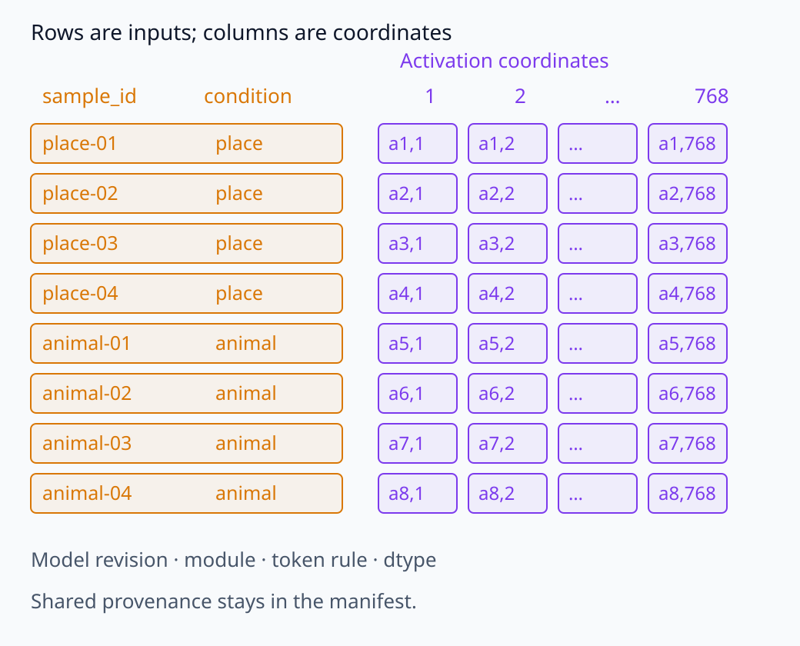
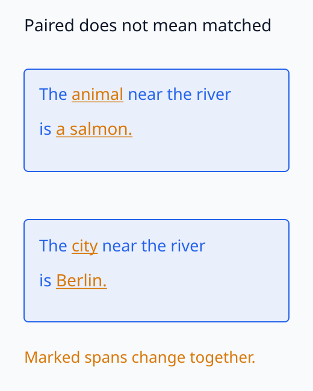
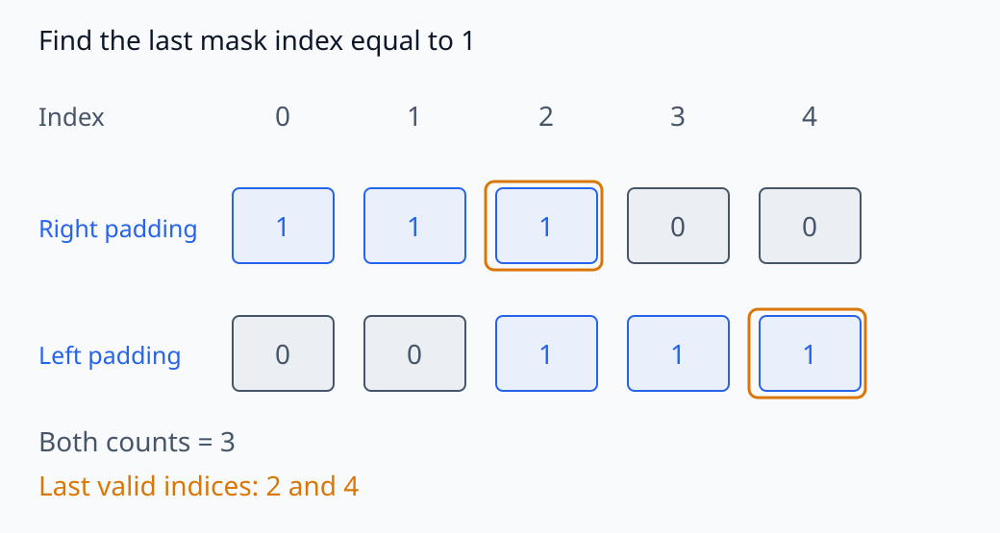
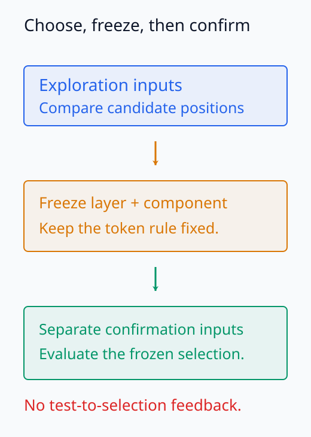
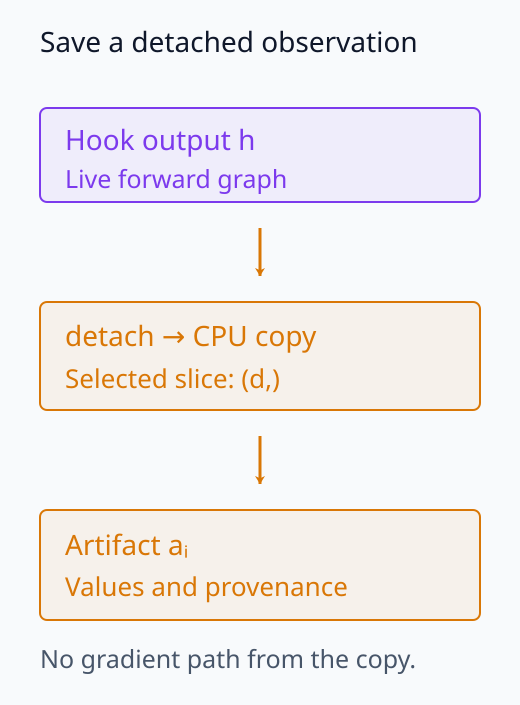
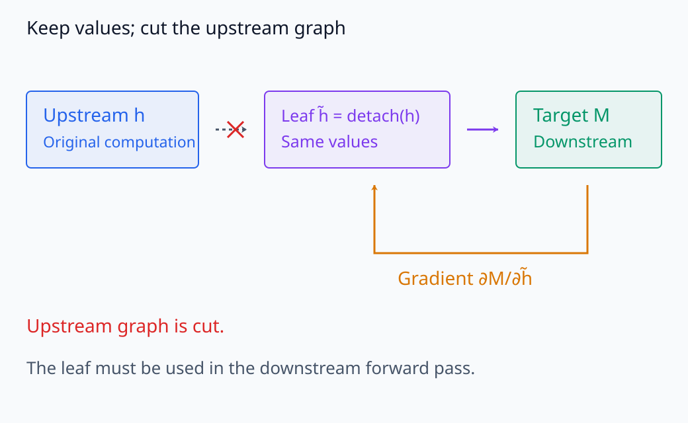
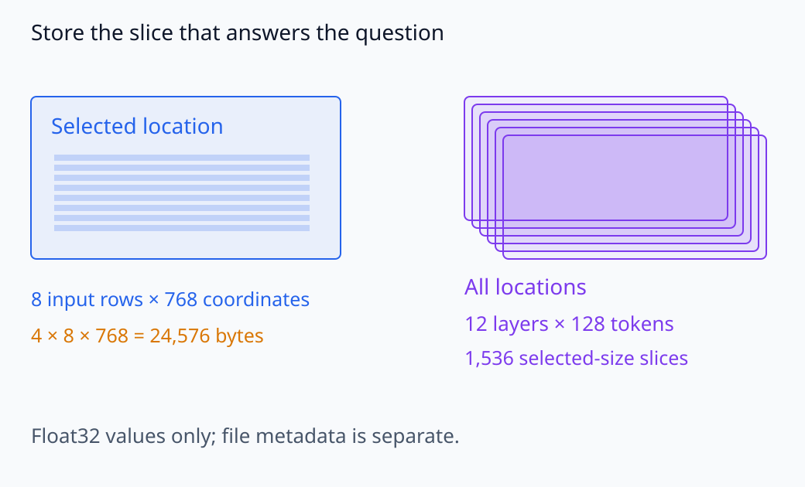
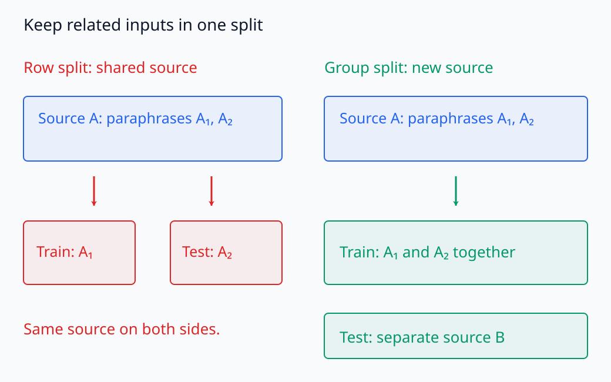

# I06-02. activation dataset

## 이 단원이 필요한 이유

activation vector만 모아 놓으면 어느 입력, model, layer와 token에서 나온 값인지 잃기 쉽다. activation dataset은 tensor와 그 측정 조건을 같은 행에 묶은 자료다. 이 구조가 있어야 조건별 통계, probe와 intervention 후보를 재현할 수 있다.

이 단원에서는 입력 하나를 기본 관찰 단위로 삼아, 입력 metadata와 선택 activation을 연결하는 최소 schema를 만든다. 전체 layer·token dump는 만들지 않는다.

## 학습 목표

- activation dataset의 한 행이 무엇을 나타내는지 정의할 수 있다.
- 입력, model revision, module, layer, token과 조건 label을 함께 기록할 수 있다.
- token 선택 규칙을 tokenizer 결과로 검증할 수 있다.
- 수집 전 split과 분석 계획을 정해 leakage를 줄일 수 있다.
- artifact 크기를 계산하고 필요한 slice만 저장할 수 있다.

## 선수지식 확인

- 선수 단원: [I06-01 행동과 표현 질문 설계](I06-01-behavior-representation-question-design.md)
- 확인 질문: `마지막 단어`와 `마지막 token`이 항상 같은가?

## 기호와 용어

| 기호·용어 | Common spoken reading | 의미 | shape·범위 |
|---|---|---|---|
| $D_A$ | `activation dataset D sub A` | activation과 측정 metadata를 묶은 dataset | $n$ rows |
| $a_i$ | `activation a sub i` | $i$번째 입력에서 선택한 activation | $\mathbb R^d$ |
| $c_i$ | `condition c sub i` | $i$번째 입력의 사전 정의 조건 | finite label set |
| $t_i$ | `token index t sub i` | tokenizer 결과에서 선택한 위치 | $0,\ldots,T_i-1$ |
| provenance | `provenance` | 값이 생성된 model·입력·코드·위치 기록 | metadata |
| leakage | `data leakage` | 평가에 쓰일 정보가 학습·선택 과정에 유입되는 일 | design failure |

## 1. dataset의 한 행

고정된 model과 hook 위치에서 activation dataset을 다음처럼 적는다.

\[
D_A=\{(i,x_i,c_i,l,t_i,a_i)\}_{i=1}^{n},
\qquad a_i\in\mathbb R^d.
\]

실제 행에는 식보다 많은 provenance가 필요하다.

| 필드 | 예 | 이유 |
|---|---|---|
| `sample_id` | `place-01` | 입력과 activation을 다시 연결한다. |
| `text` 또는 input hash | prompt 또는 SHA-256 | 정확한 입력을 식별한다. |
| `condition` | `place` | 비교 집단을 사전에 정한다. |
| `model_id` | `EleutherAI/pythia-160m-deduped` | weight 계열을 고정한다. |
| `resolved_sha` | immutable commit SHA | branch 이름의 변화를 막는다. |
| `module` | `gpt_neox.layers.5.mlp.dense_4h_to_h` | 계산 위치를 고정한다. |
| `token_index` | `6` | 선택한 tensor 위치를 기록한다. |
| `token_id` | tokenizer output | 문자열과 token 정렬을 검증한다. |
| `activation` | 길이 768 vector | 분석 대상이다. |
| `dtype` | `float32` artifact | 저장 정밀도를 기록한다. |

dataset 전체에 공통인 값도 manifest에 한 번은 남겨야 한다. 각 행에 반복할지 별도 table로 둘지는 저장 형식의 선택이다.

식을 행렬로 옮기면 activation은 $n\times d$ 배열이 된다. 행 index $i$는 입력을, 열은 같은 내부 공간의 좌표를 가리킨다. 행 순서를 바꿀 때에는 condition과 sample ID도 함께 바꿔야 한다. vector의 숫자가 그대로여도 label과의 대응이 달라지면 다른 분석 자료가 된다. 입력마다 선택 token index $t_i$가 달라도, 마지막 실제 token 같은 동일한 선택 규칙으로 모았다면 그 규칙이 행들의 비교 의미를 정한다.

행렬의 행과 metadata의 대응을 같은 높이에 놓으면 무엇을 함께 정렬해야 하는지 보인다.

<figure class="lesson-figure lesson-figure--wide" markdown="1">



<figcaption>8×768 activation의 한 행은 한 입력과 연결된다. 행을 옮길 때 sample ID와 condition도 함께 옮겨야 동일한 관측 자료를 유지한다.</figcaption>
</figure>

## 2. 입력과 조건을 먼저 고정하기

조건 label은 activation을 본 뒤 붙이지 않는다. 예를 들어 장소 네 문장과 동물 네 문장을 비교한다면 문장 목록, label과 제외 기준을 수집 전에 고정한다. 문장 길이, 문법 틀과 마지막 token이 조건과 함께 달라지면 activation 차이가 의미 차이 때문인지 형식 차이 때문인지 분리하기 어렵다.

paired input에서는 비교하려는 요소 외의 문장 형식을 가능한 범위에서 맞춘다. 다음 두 문장은 장소·동물 조건을 구체적으로 지정한 예다.

```text
The animal near the river is a salmon.
The city near the river is Berlin.
```

그러나 단어 수가 같아도 tokenizer token 수는 달라질 수 있다. tokenization 결과를 실제로 기록해야 한다.

위 두 문장은 주어뿐 아니라 마지막 이름과 관사도 다르므로, 의미 조건 하나만 바꾼 완전한 matched pair는 아니다. 두 입력을 한 쌍으로 묶는 것과 조건 외의 차이를 통제하는 것은 별개의 판단이다. 두 조건에서 함께 달라진 요소를 기록해야 activation 차이의 해석 범위를 정할 수 있다.

두 입력에서 함께 달라진 부분을 표시해 비교 조건을 확인하자.

<figure class="lesson-figure" markdown="1">



<figcaption>두 문장을 쌍으로 묶어도 animal/city와 마지막 이름·관사가 함께 달라진다. 색과 밑줄로 표시한 차이를 조건 하나의 효과와 혼동하지 않는다.</figcaption>
</figure>

## 3. layer·token·component를 고정하기

같은 입력에서 여러 위치를 탐색하면 비교 횟수가 빠르게 늘어난다. 확인 실험에서는 다음 중 하나를 사용한다.

- 이론이나 선행 결과로 layer와 component를 미리 고정한다.
- 탐색용 split에서 위치를 고르고 별도 확인 split에서 평가한다.
- 모든 위치를 보고할 때 다중비교와 선택 절차를 함께 공개한다.

마지막 token을 선택한다면 문자열의 마지막 공백 기준이 아니라 attention mask에서 마지막 유효 위치를 계산한다. padding이 있으면 tensor의 마지막 열과 마지막 실제 token이 다를 수 있다.

유효 token 개수에서 1을 빼는 계산은 token이 앞에서부터 연속으로 놓이고 뒤에 padding을 붙인 경우에 맞는다. 왼쪽 padding이나 다른 배치에서는 유효 개수가 tensor index와 같지 않다. 선택 규칙은 attention mask가 1인 위치 가운데 마지막 index로 정의하고, 그 위치의 token ID도 함께 확인한다.

padding 위치의 차이와 탐색·확인 절차의 분리를 따로 보자.

<figure class="lesson-figure lesson-figure--wide" markdown="1">



<figcaption>유효 token 수가 같은 두 mask에서도 마지막 유효 index는 다르다. 오른쪽 padding에서만 count−1을 그대로 index로 쓸 수 있다.</figcaption>
</figure>

<figure class="lesson-figure" markdown="1">



<figcaption>탐색 split에서 위치를 고른 뒤 별도 확인 split으로 평가한다. 확인 결과를 다시 위치 선택에 사용하면 두 단계의 분리가 사라진다.</figcaption>
</figure>

## 4. 수집 시 gradient와 저장 수명

관찰만 할 때는 필요한 slice를 `detach`한 뒤 CPU로 옮긴다. gradient가 필요한 한 실험에서는 hook output을 선택 target과 연결한 채 유지한다. 두 목적을 같은 수집 loop에 섞으면 불필요한 graph를 오래 붙잡을 수 있다.

이 프로젝트의 160M 실험은 첫 입력에서만 선택 activation gradient를 계산한다. hook output을 그 위치에서 분리한 leaf로 바꿔 downstream gradient만 구하므로 model parameter gradient와 optimizer state를 만들지 않는다. 나머지 일곱 입력은 `no_grad`에서 수집한다.

이 leaf는 기존 output과 같은 값을 downstream에 전달하되, 그 값 이전의 계산 그래프와는 연결하지 않은 미분 변수다. 그래서 구하는 gradient는 고정한 weight와 입력에서 해당 내부량을 조금 바꾸면 선택 target이 어떻게 변하는지를 나타낸다. 원래 token embedding이나 upstream parameter까지 거슬러 올라가는 gradient와는 대상이 다르다. 관찰용으로 분리해 저장하기만 한 사본과 달리, 이 leaf는 실제 downstream 계산에 사용되어야 한다.

저장용 사본과 downstream 미분 변수의 연결을 비교하자.

<figure class="lesson-figure" markdown="1">



<figcaption>관찰용 사본은 detach한 뒤 CPU에 저장한다. 이 사본의 저장 수명은 forward 계산 그래프의 수명과 분리된다.</figcaption>
</figure>

<figure class="lesson-figure lesson-figure--wide" markdown="1">



<figcaption>leaf는 원래 activation과 같은 값을 downstream에 전달한다. target에서 돌아온 gradient는 이 leaf에서 끝나므로 upstream parameter의 gradient와 대상이 다르다.</figcaption>
</figure>

## 5. 저장량 계산

$n$개 입력에서 $d$차원 float32 activation 하나씩 저장하면 raw array 크기는

\[
4nd\ \text{bytes}
\]

다. $n=8$, $d=768$이면

\[
4\times8\times768=24{,}576\ \text{bytes}
\]

다. 압축 artifact에는 metadata가 더해지지만 값이 반복되면 raw 크기보다 작을 수도 있다.

반면 12개 layer, 128개 token을 모두 저장하면 $12\times128=1{,}536$배의 좌표가 생긴다. 질문이 한 위치에 관한 것이라면 이 증가는 정보가 아니라 불필요한 저장과 선택 기회다.

한 위치의 배열과 전체 layer·token의 배열 수를 비교하자.

<figure class="lesson-figure lesson-figure--wide" markdown="1">



<figcaption>한 위치의 8×768 float32 배열은 24,576 bytes다. 같은 값을 12개 layer·128개 token 위치마다 저장하면 좌표 수가 1,536배로 늘어난다.</figcaption>
</figure>

## 6. split과 leakage

probe를 학습할 계획이라면 activation을 모으기 전에 train, validation과 test의 분리 단위를 정한다. 같은 원문에서 만든 paraphrase가 서로 다른 split에 들어가면 문장 내용이 새어 들어갈 수 있다. token 행을 무작위로 나누는 것도 같은 문장의 다른 token이 양쪽에 들어가는 leakage를 만든다.

group ID가 있다면 원문, 문서, 화자 또는 생성 template 단위로 묶어서 split한다. test activation을 보고 layer를 고른 뒤 같은 test에서 최종 성능을 보고하면 test가 model selection에 사용된 것이다.

같은 원문을 공유하는 변형들이 split 경계를 넘는지 확인하자.

<figure class="lesson-figure lesson-figure--wide" markdown="1">



<figcaption>왼쪽은 같은 원문에서 만든 변형을 train과 test로 나눠 내용이 겹친다. 오른쪽은 원문 group을 함께 배치하고 다른 group으로 평가한다.</figcaption>
</figure>

## 실제 모델 실습

### 고정 수집 계약

이 실험은 Pythia 160M의 layer 5 MLP down projection output에서 마지막 실제 token 하나를 수집한다. 입력은 사전에 고정한 장소 네 문장과 동물 네 문장이다. artifact에는 8×768 activation과 첫 입력의 길이 768 gradient만 들어간다.

<!-- GPU_EXPERIMENT: pythia_160m_activation_dataset -->

로컬 결과의 `sample_count`, `activation_shape`, `hook_calls`와 `sequence_lengths`가 수집 계약을 확인한다. `condition_mean_difference_l2`는 두 표본평균이 다르다는 기술통계일 뿐, 조건의 인과 효과나 개념 사용을 증명하지 않는다.

## 품질 검사

수집 직후 다음을 확인한다.

1. 행 수가 입력 수와 같은가?
2. hook 호출 수가 예상 forward 수와 같은가?
3. 각 activation shape가 $(d,)$이고 모든 값이 유한한가?
4. token index가 각 입력의 유효 길이 안에 있는가?
5. model과 tokenizer의 repository·resolved SHA가 같은가?
6. artifact hash와 byte 수가 manifest에 기록됐는가?
7. hook handle이 제거됐는가?

값의 크기가 그럴듯하다는 확인만으로는 잘못된 module이나 token을 찾지 못한다. shape, 위치와 provenance를 함께 검사해야 한다.

## 흔한 오해

### 오해 1. activation array만 있으면 dataset이다

입력과 위치를 다시 연결할 metadata가 없으면 어떤 질문의 측정값인지 알 수 없다. array와 provenance를 함께 보존해야 한다.

### 오해 2. 전체 activation을 저장하면 나중에 더 안전하다

전체 dump는 자원을 늘리고 사후 선택을 쉽게 만든다. 질문에 필요한 layer·token·component를 먼저 정하는 편이 검증 가능하다.

### 오해 3. test split은 probe 학습에만 쓰지 않으면 된다

test activation을 보고 layer, preprocessing이나 hyperparameter를 고르는 것도 test 정보를 사용한 것이다.

## 연습문제

### 1. 최소 schema

activation vector와 condition label만 저장했다. 어떤 핵심 provenance가 더 필요한가?

<details><summary>해설 보기</summary>입력 또는 input hash, model ID와 resolved revision, tokenizer, module path, layer, token index·ID, dtype, 코드와 실행 환경이 필요하다. 그래야 같은 값을 다시 수집하고 계산 위치를 해석할 수 있다.</details>

### 2. 저장량

입력 100개에서 1,024차원 float32 vector 하나씩 저장할 때 raw 크기는 얼마인가?

<details><summary>해설 보기</summary>$4\times100\times1{,}024=409{,}600$ bytes다. 약 0.391 MiB이며 파일 format metadata는 별도다.</details>

### 3. token 선택

padding을 포함한 batch에서 `output[:, -1, :]`를 사용하면 어떤 문제가 생길 수 있는가?

<details><summary>해설 보기</summary>짧은 입력에서는 마지막 열이 padding 위치일 수 있다. attention mask의 유효 길이로 입력별 마지막 실제 token index를 계산해야 한다.</details>

### 4. leakage

한 문장의 token activation 20개를 무작위로 train과 test에 나눴다. 왜 문제가 되는가?

<details><summary>해설 보기</summary>같은 문장의 내용과 문맥을 공유하는 token이 두 split에 들어간다. 독립 입력에 대한 일반화를 평가하지 못하므로 문장이나 더 상위 group 단위로 나눠야 한다.</details>

### 5. hook 호출

입력 8개를 한 번씩 forward했는데 hook이 16번 호출됐다. 바로 분석해도 되는가?

<details><summary>해설 보기</summary>안 된다. shared module 재사용, 중복 hook 등록 또는 예상과 다른 forward 경로를 조사해야 한다. 호출 계약이 맞기 전에는 행과 입력의 대응이 불확실하다.</details>

### 6. 조건 차이

장소와 동물 activation 평균의 거리가 8.4였다. 어떤 결론까지 가능한가?

<details><summary>해설 보기</summary>고정한 표본과 측정 위치에서 두 표본평균이 그 거리만큼 달랐다는 기술적 진술이 가능하다. 통계적 안정성, 교란 통제, 복원 가능성이나 기능적 사용은 아직 검증되지 않았다.</details>

## 근거와 갱신 경계

model·tokenizer의 동일 revision 사용과 Pythia checkpoint는 [Pythia 공식 repository](https://github.com/EleutherAI/pythia)를 기준으로 한다. tokenizer와 model load 인자는 [Transformers 공식 문서](https://huggingface.co/docs/transformers/index), hook의 tensor 수명은 [PyTorch 공식 문서](https://docs.pytorch.org/docs/stable/generated/torch.nn.Module.html)를 2026-10-01에 확인했다. 구체적인 module path는 Pythia와 Transformers version에 의존하며, 한 행의 관찰 단위와 split 원칙은 model 종류와 무관하다.

## 단원 요약

- activation dataset은 선택 vector와 입력·위치·실행 provenance를 함께 보존한다.
- 조건, split, layer와 token 규칙은 activation을 보기 전에 정한다.
- 마지막 문자열과 마지막 tokenizer token을 구분한다.
- 필요한 slice만 저장하고 byte 수와 hash를 manifest로 검증한다.
- 조건별 평균 차이는 기술통계이며 기능적 사용이나 인과 효과가 아니다.

## 통과 기준

- activation dataset의 한 행과 공통 metadata를 설계할 수 있는가?
- tokenizer 결과에서 목표 token을 검증할 수 있는가?
- split leakage를 입력 group 수준에서 설명할 수 있는가?
- 선택 저장량과 전체 dump의 차이를 계산할 수 있는가?

## 다음 단원

- [I06-03 분포와 기초 통계](I06-03-distributions-basic-statistics.md)

## 집필자 점검표

- [x] 학습 목표가 관찰 가능한 행동으로 작성됐다.
- [x] 입력·조건·model·layer·token·component schema를 정의했다.
- [x] split과 leakage를 분석 단위에 연결했다.
- [x] 저장량과 artifact quota를 계산했다.
- [x] 모든 문제에 해설이 있다.
- [x] 모델 해석 주장의 강도를 구분했다.
- [x] 용어집과 표기 규칙을 따랐다.
- [x] Common spoken reading이 실제 영어 학술 발화이며 한글 음역이나 기계적 직역을 포함하지 않는다.
- [x] 선수지식 밖의 내용을 몰래 요구하지 않는다.
- [x] 내부 링크와 수식 렌더링을 확인했다.
