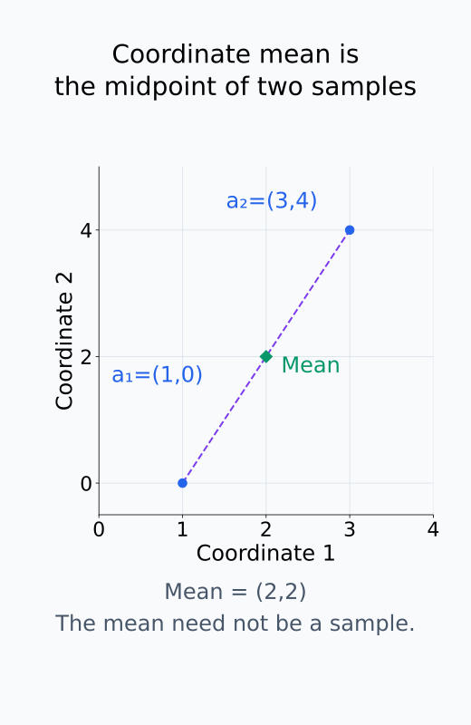
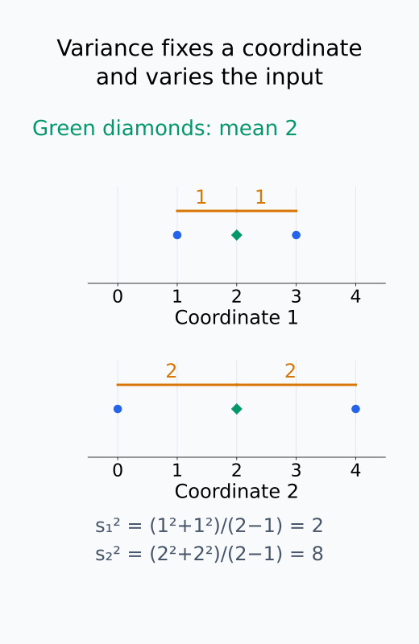
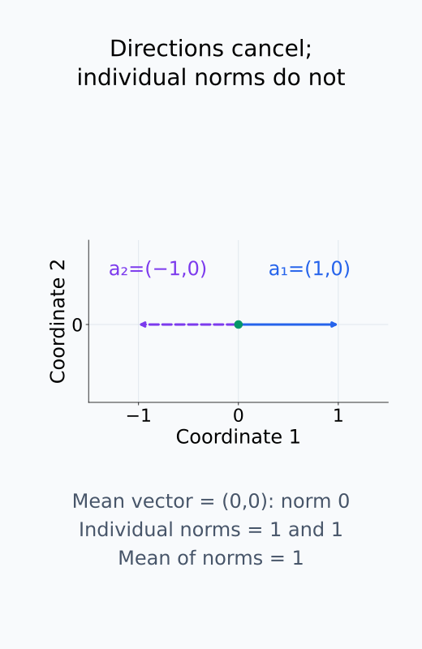
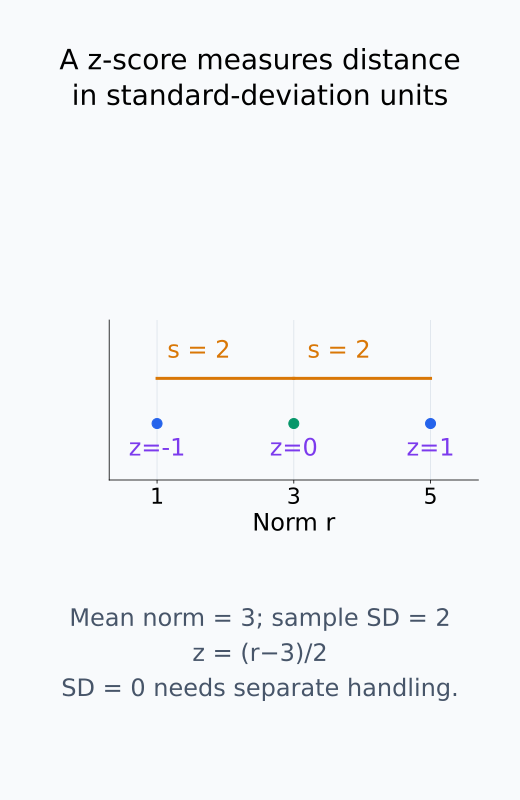
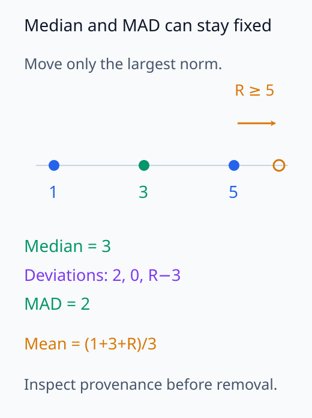
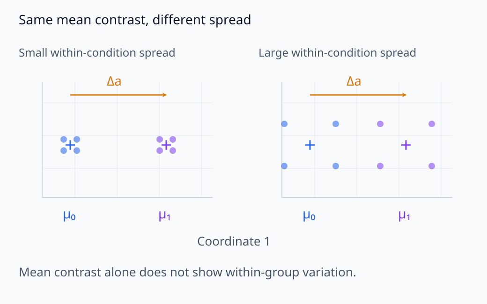
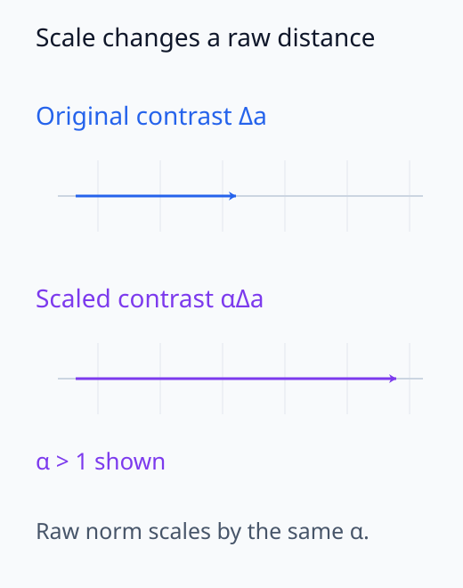
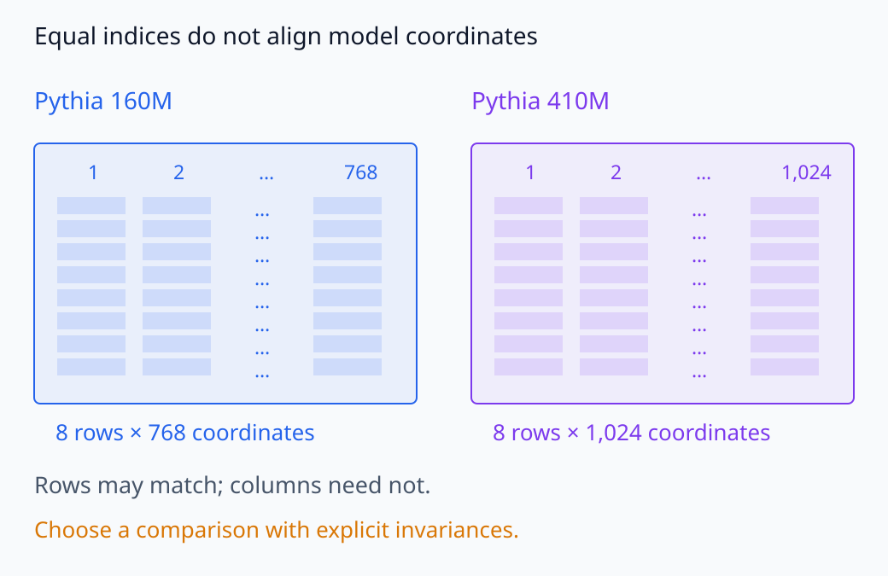

# I06-03. 분포와 기초 통계

## 이 단원이 필요한 이유

activation 하나를 그림으로 보거나 가장 큰 좌표를 읽는 것만으로는 입력 집단의 표현을 알 수 없다. 먼저 표본의 중심, 변동, 이상치와 조건별 차이를 확인해야 한다. 이 단계는 화려한 해석보다 단순하지만, 이후 PCA·probe·SAE 결과가 소수 표본이나 scale 차이에 끌려간 것은 아닌지 판단하는 기준이 된다.

## 학습 목표

- activation vector의 좌표별 평균과 표본분산을 계산할 수 있다.
- vector norm의 분포와 평균 vector를 구분할 수 있다.
- z-score와 robust statistic으로 이상치 후보를 찾을 수 있다.
- 조건별 차이를 effect size, 불확실성과 분석 단위에 연결할 수 있다.
- hidden size가 다른 model의 raw activation을 직접 비교할 수 없는 이유를 설명할 수 있다.

## 선수지식 확인

- 선수 단원: [I06-02 activation dataset](I06-02-activation-dataset.md)
- 확인 질문: $n$개 vector의 평균과 각 vector norm의 평균은 같은 양인가?

## 기호와 용어

| 기호·용어 | Common spoken reading | 의미 | shape·범위 |
|---|---|---|---|
| $\bar a$ | `a bar` | activation의 좌표별 표본평균 | $\mathbb R^d$ |
| $s_j^2$ | `s squared sub j` | $j$번째 좌표의 표본분산 | nonnegative scalar |
| $r_i=\lVert a_i\rVert_2$ | `r sub i equals the L two norm of a sub i` | $i$번째 activation의 Euclidean norm | nonnegative scalar |
| $z_i$ | `z score sub i` | 중심에서 표준편차 단위로 잰 위치 | scalar |
| outlier | `outlier` | 정한 기준에서 다른 표본과 크게 떨어진 관측값 | flagged observation |
| robust statistic | `robust statistic` | 극단값의 영향이 비교적 작은 통계량 | scalar 또는 vector |

## 1. 좌표별 평균과 분산

$n$개 activation $a_1,\ldots,a_n\in\mathbb R^d$의 표본평균은

\[
\bar a=\frac{1}{n}\sum_{i=1}^{n}a_i
\]

다. $j$번째 좌표의 표본분산은

\[
s_j^2=\frac{1}{n-1}\sum_{i=1}^{n}(a_{ij}-\bar a_j)^2
\]

다. 분모 $n-1$은 모집단 분산을 표본으로 추정하는 관례다. 현재 고정된 데이터 자체의 평균제곱편차를 기술하려는 경우에는 분모 $n$을 쓸 수도 있으므로 어떤 정의를 썼는지 적는다.

평균 식의 덧셈은 같은 좌표끼리 수행한다. 분산 식에서도 $j$를 고정하고 입력 index $i$만 바꾸므로, $s_j^2$는 vector 전체의 분산 하나가 아니라 한 좌표의 변동이다. 표본분산에는 $n>1$이 필요하며, $n-1$을 쓴 불편추정의 성질은 같은 모집단에서 독립적으로 뽑은 표본 같은 가정 아래 성립한다. 같은 문장의 여러 token을 모아 분모만 $n-1$로 바꾼다고 독립 표본이 되지는 않는다.

두 activation이 $a_1=(1,0)$, $a_2=(3,4)$라면

\[
\bar a=(2,2),\qquad s^2=(2,8)
\]

이다. 둘째 좌표가 이 두 표본에서 더 많이 변했다. 표본이 둘뿐이므로 일반적인 분포 결론을 내릴 수는 없다.

같은 두 vector의 중심과 좌표별 퍼짐을 나누어 확인하자.

<figure class="lesson-figure" markdown="1">

<figcaption>각 좌표끼리 평균하면 두 점의 중점 (2,2)가 된다. 중심을 나타내는 이 점이 실제 입력의 activation으로 나타날 필요는 없다.</figcaption>
</figure>

<figure class="lesson-figure" markdown="1">

<figcaption>같은 두 입력에서 첫 좌표의 편차는 ±1, 둘째는 ±2다. 각 좌표의 제곱편차 합을 n−1=1로 나누면 분산 2와 8을 얻는다.</figcaption>
</figure>

## 2. norm 분포와 평균 vector

각 vector의 크기는

\[
r_i=\lVert a_i\rVert_2
\]

로 요약할 수 있다. 하지만 $\lVert\bar a\rVert_2$와 $\frac{1}{n}\sum_i\lVert a_i\rVert_2$는 일반적으로 다르다. 반대 방향 vector는 평균에서 상쇄되지만 각 norm은 양수로 남기 때문이다.

예를 들어 $a_1=(1,0)$, $a_2=(-1,0)$이면 평균 vector의 norm은 0이고 norm 평균은 1이다. 따라서 `activation이 크다`는 말은 좌표 평균, vector norm, 특정 방향 projection 중 무엇을 뜻하는지 밝혀야 한다.

방향의 상쇄가 두 통계량에 다르게 반영되는 이유를 그림으로 보자.

<figure class="lesson-figure" markdown="1">

<figcaption>반대 방향 activation은 vector 평균에서 상쇄된다. 개별 norm은 둘 다 1이므로 평균 vector의 norm 0과 norm 평균 1은 다른 요약이다.</figcaption>
</figure>

## 3. 이상치 후보 찾기

norm 값이 $1,3,5$라면 표본평균은 3, 표본표준편차는 2다. 표본표준편차를 사용한 z-score는 $-1,0,1$이다.

\[
z_i=\frac{r_i-\bar r}{s_r}.
\]

분자는 중심에서의 차이이고 분모는 norm 값들 사이의 변동 크기다. 따라서 $z_i=1$은 평균보다 표준편차 하나만큼 큰 위치를 뜻한다. $s_r=0$이면 모든 norm이 같아 이 식으로 나눌 수 없으므로, 그 경우를 별도로 처리해야 한다.

z-score가 크다고 자동으로 오류는 아니다. 긴 문장, 특수 token, 잘못된 token index, domain 차이 또는 실제로 드문 입력일 수 있다. 원인을 확인하고 포함·제외 기준을 기록한다.

평균과 표준편차 자체가 극단값에 민감할 때는 median과 median absolute deviation을 함께 본다. robust statistic도 이상치의 의미를 대신 결정하지는 않는다.

median absolute deviation은 각 값이 median에서 떨어진 절댓값들을 구한 뒤 그 값들의 median을 취한 것이다. 평균과 달리 소수의 큰 편차가 합 전체를 끌어올리지 않지만, 같은 값이 많이 반복되면 이 값도 0이 될 수 있다. robust한 중심·scale을 쓰는 일과 수집 오류를 판별하는 일은 구분한다.

z-score의 단위와 극단값을 옮겼을 때의 robust 요약을 비교하자.

<figure class="lesson-figure" markdown="1">

<figcaption>norm 1,3,5의 평균 3에서 각각 −2,0,2만큼 떨어져 있다. 표본표준편차 2로 나눈 z-score는 −1,0,1이며, 값의 오류 여부를 판정한 결과는 아니다.</figcaption>
</figure>

<figure class="lesson-figure" markdown="1">

<figcaption>본문의 1,3,5에서 가장 큰 값만 R≥5로 옮긴 개념 예다. median은 3, 절대편차의 median은 2로 유지되지만 평균은 (1+3+R)/3으로 달라진다. 이런 요약만으로 값의 오류 여부를 결정하지는 않는다.</figcaption>
</figure>

## 4. 조건별 차이

두 조건의 activation 평균 차이는 vector다.

\[
\Delta_a=\bar a_{C_1}-\bar a_{C_0}.
\]

$\lVert\Delta_a\rVert_2$는 하나의 scalar 요약이지만 방향 정보를 버린다. 또한 activation 전체 scale이 큰 layer에서는 거리도 커질 수 있다. cosine, whitened distance나 standardized effect를 쓰면 다른 불변성을 얻지만, 어느 것도 자동으로 더 옳은 것은 아니다. 질문에 맞는 척도를 사전에 정한다.

평균 차이 vector는 두 집단의 중심을 잇는 방향과 크기를 나타내고, 조건 내 변동은 그 중심 주위에 입력들이 얼마나 퍼졌는지를 측정한다. 같은 평균 차이라도 집단 안의 변동이 크면 새 입력의 조건을 구별하기 어려울 수 있다. activation을 같은 양수 배로 키우면 평균 차이와 Euclidean 거리도 그 배로 커진다. 표준화한 비교에서는 이 차이를 변동 크기와 함께 읽지만, 그 변동을 어느 집단과 좌표에서 추정했는지도 명시해야 한다.

조건별 차이를 보고할 때는 다음을 함께 적는다.

- 각 조건의 입력 수와 입력 선정 규칙
- paired 여부와 실제 분석 단위
- 평균 차이와 조건 내 변동
- confidence interval 또는 bootstrap 절차
- 확인한 layer·token·통계량 수
- 제외한 이상치와 제외 기준

표본이 네 개씩인 파일럿에서는 confidence interval이 넓을 수 있다. 이 결과의 주된 목적은 수집과 통계 절차를 확인하는 것이다.

평균 차이에 남지 않는 조건 내 변동과 전체 scale의 영향을 따로 보자.

<figure class="lesson-figure lesson-figure--wide" markdown="1">

<figcaption>두 패널은 같은 평균 차이 Δa를 갖지만 조건 안의 퍼짐이 다르다. 점들은 관계를 보여 주는 개념도이며 실제 모델 표본이 아니다. 거리 하나에는 이 분포 차이가 남지 않는다.</figcaption>
</figure>

<figure class="lesson-figure" markdown="1">

<figcaption>activation 전체에 같은 양수 α를 곱하면 평균 차이도 αΔa가 된다. 그림은 α>1인 경우의 길이 변화로, 더 긴 raw 거리가 더 뚜렷한 조건 구분을 뜻하지는 않는다.</figcaption>
</figure>

## 5. 좌표를 많이 보면 생기는 문제

768개 좌표에서 각각 조건 차이를 검사하면 우연히 큰 값이 나올 기회도 늘어난다. 가장 큰 좌표를 같은 데이터에서 골라 그 좌표의 차이를 다시 보고하면 선택 편향이 생긴다.

대응 방법은 다음과 같다.

- 사전에 정한 projection이나 summary statistic을 사용한다.
- 탐색 split에서 좌표를 고르고 확인 split에서 평가한다.
- 모든 좌표를 검사했다면 다중비교 보정을 적용한다.
- effect size와 uncertainty를 함께 보고 p-value 하나로 결론내리지 않는다.

## 6. model 규모 비교의 함정

Pythia 160M의 hidden size는 768이고 410M은 1,024다. 두 model의 activation은 차원뿐 아니라 학습된 기저와 layer 의미도 다르다. raw vector를 빼거나 같은 좌표 번호를 대응시키면 안 된다.

규모 비교를 하려면 먼저 비교 가능한 대상을 정한다. norm 분포처럼 scalar summary를 비교할 수는 있지만, model별 scale 차이를 고려해야 한다. 표현 구조를 비교하려면 후속 단원의 CKA, CCA나 RSA처럼 허용할 불변성을 명시한 방법이 필요하다.

입력 행이 같아도 model의 좌표열은 대응하지 않을 수 있다.

<figure class="lesson-figure lesson-figure--wide" markdown="1">

<figcaption>같은 여덟 입력을 사용해도 160M과 410M의 열 수와 학습된 기저는 다르다. 같은 좌표 번호를 대응시키거나 raw vector를 직접 빼는 비교는 성립하지 않는다.</figcaption>
</figure>

## 실제 모델 실습과의 연결

I06-02의 160M activation dataset은 여덟 입력의 norm 평균·분산과 조건별 평균 차이를 기록한다. 그 값은 고정한 파일럿 표본의 기술통계다. I06-08에서는 같은 여덟 입력을 410M에서도 수집해 CKA와 RSA로 비교한다. hidden size가 다른 raw vector를 직접 빼지 않는다.

## 권장 기초 보고서

activation dataset을 받으면 다음 순서로 보고한다.

1. schema, 결측, 중복, shape와 유한값 검사
2. 입력 길이와 조건별 표본 수
3. activation norm의 min, median, mean, max와 분포
4. 좌표별 평균·표준편차의 요약
5. 사전 정의한 조건 contrast와 불확실성
6. 이상치 후보의 input·token provenance 확인
7. 탐색과 확인 분석의 구분

이 보고서가 통과한 뒤 차원축소나 probe로 넘어간다.

## 흔한 오해

### 오해 1. 평균 activation이 대표적인 실제 activation이다

평균은 좌표별 중심이며 어떤 입력에서도 실제로 나타나지 않을 수 있다. 분산과 분포를 함께 봐야 한다.

### 오해 2. norm이 큰 입력이 더 중요한 입력이다

norm은 vector 크기다. 출력 기여도나 인과적 중요도를 직접 측정하지 않는다.

### 오해 3. model 두 개의 같은 layer 번호는 같은 계산 단계다

layer 수, hidden size와 학습된 기저가 다르면 번호만으로 대응되지 않는다. architecture와 비교 방법을 별도로 정해야 한다.

## 연습문제

### 1. 표본평균

$a_1=(1,2)$, $a_2=(3,0)$, $a_3=(2,4)$의 표본평균을 구하라.

해설 보기
좌표별로 더해 3으로 나눈다. 첫 좌표는 $(1+3+2)/3=2$, 둘째 좌표는 $(2+0+4)/3=2$이므로 $\bar a=(2,2)$다.

### 2. 표본분산

scalar 값 $1,3,5$의 표본분산과 표본표준편차를 구하라.

해설 보기
평균은 3이고 제곱편차 합은 $4+0+4=8$이다. 분모 $n-1=2$로 나누면 표본분산은 4, 표본표준편차는 2다.

### 3. norm 평균

$a_1=(1,0)$과 $a_2=(-1,0)$에서 평균 vector의 norm과 norm 평균을 각각 구하라.

해설 보기
평균 vector는 $(0,0)$이므로 norm은 0이다. 각 vector의 norm은 둘 다 1이므로 norm 평균은 1이다. 두 통계량은 다른 질문에 답한다.

### 4. 이상치 처리

activation norm 하나가 매우 크다. 즉시 제거해야 하는가?

해설 보기
아니다. input 길이, 특수 token, token index, 수집 오류와 실제 희귀 사례인지 provenance로 확인한다. 제외 기준은 결과를 보기 전에 정하거나 사후 결정임을 명시해야 한다.

### 5. 다중비교

768개 좌표 중 가장 큰 조건 차이를 같은 표본에서 골랐다. 그 좌표의 차이를 독립적인 확인 결과로 보고할 수 있는가?

해설 보기
그대로는 안 된다. 좌표 선택에 같은 표본을 사용했으므로 값이 과대평가될 수 있다. 별도 확인 split이나 다중비교를 고려한 추론이 필요하다.

### 6. 규모 비교

160M의 768차원 vector와 410M의 1,024차원 vector를 좌표별로 빼도 되는가?

해설 보기
안 된다. 차원이 다르고 기저와 layer 의미도 정렬되지 않았다. 비교하려는 불변성을 정한 scalar summary나 CCA·CKA·RSA 같은 표현 비교 방법이 필요하다.

## 근거와 갱신 경계

평균, 표본분산, 표준화와 다중비교의 기초는 M04의 확률·통계 정의를 따른다. Pythia architecture와 checkpoint는 [Pythia 공식 repository](https://github.com/EleutherAI/pythia), 410M config와 model revision은 [Pythia-410M-deduped model card](https://huggingface.co/EleutherAI/pythia-410m-deduped)를 2026-10-01에 확인했다. hidden size와 module path는 model config와 Transformers 구현에 따라 바뀔 수 있다.

## 단원 요약

- 평균 vector, 좌표별 분산과 vector norm 분포는 서로 다른 통계량이다.
- 이상치 후보는 provenance를 확인한 뒤 사전 기준에 따라 처리한다.
- 조건 차이는 조건 내 변동, 분석 단위와 불확실성 없이 해석하지 않는다.
- 많은 좌표를 탐색하면 선택 편향과 다중비교 문제가 생긴다.
- 다른 model의 raw activation 좌표를 직접 대응시키면 안 된다.

## 통과 기준

- activation의 좌표별 평균과 표본분산을 계산할 수 있는가?
- 평균 vector norm과 norm 평균을 구분할 수 있는가?
- 이상치와 다중비교의 처리 원칙을 설명할 수 있는가?
- model 규모 비교에서 필요한 불변성을 말할 수 있는가?

## 다음 단원

- I06-04 neuron 단위 분석

## 집필자 점검표

- [x] 학습 목표가 관찰 가능한 행동으로 작성됐다.
- [x] 평균·분산·norm·이상치를 구분했다.
- [x] 조건 비교를 분석 단위와 불확실성에 연결했다.
- [x] model 간 raw 좌표 비교의 한계를 설명했다.
- [x] 모든 문제에 해설이 있다.
- [x] 모델 해석 주장의 강도를 구분했다.
- [x] 용어집과 표기 규칙을 따랐다.
- [x] Common spoken reading이 실제 영어 학술 발화이며 한글 음역이나 기계적 직역을 포함하지 않는다.
- [x] 선수지식 밖의 내용을 몰래 요구하지 않는다.
- [x] 내부 링크와 수식 렌더링을 확인했다.
