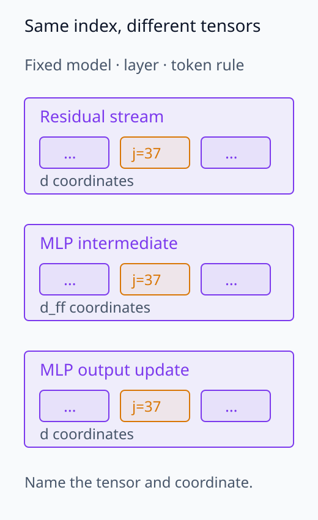
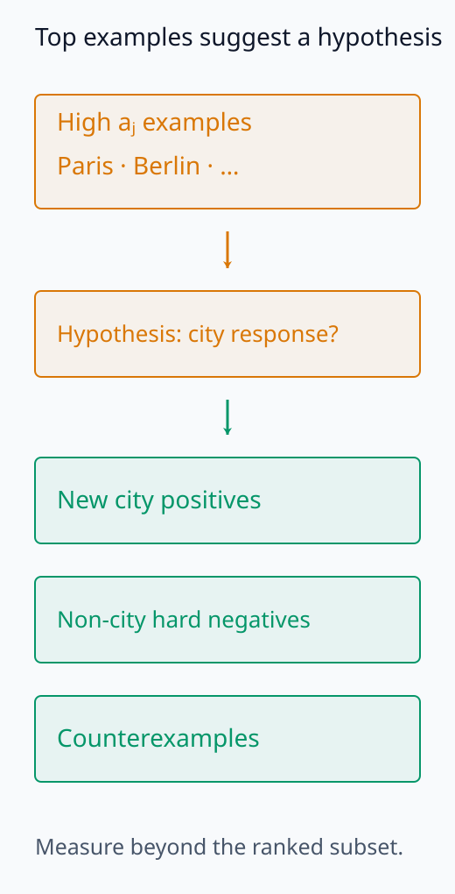
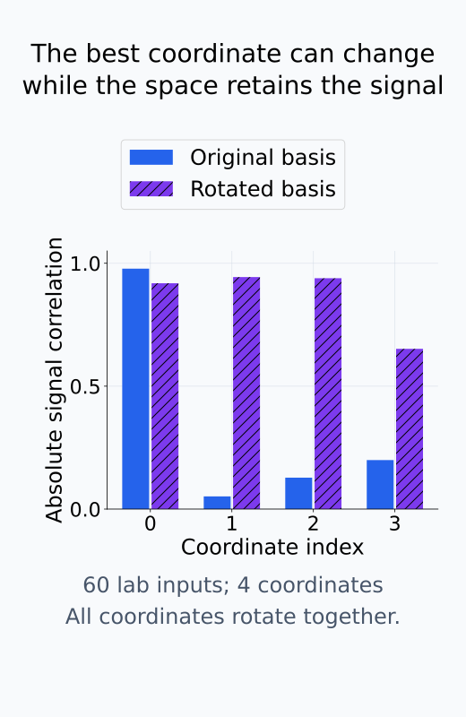
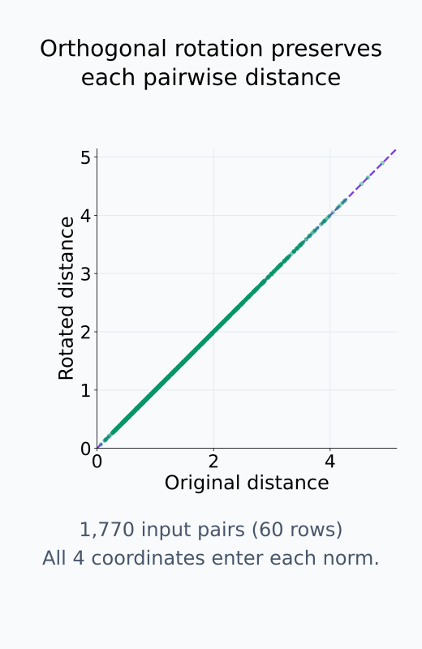
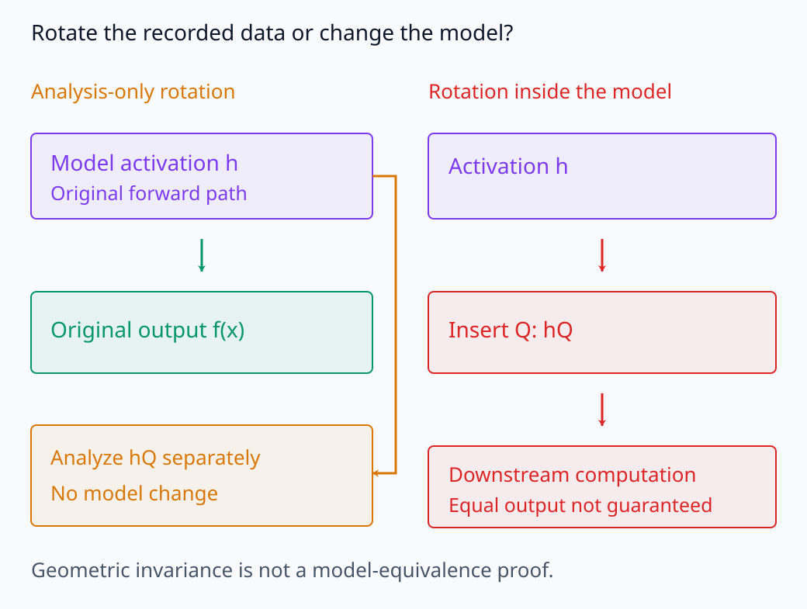
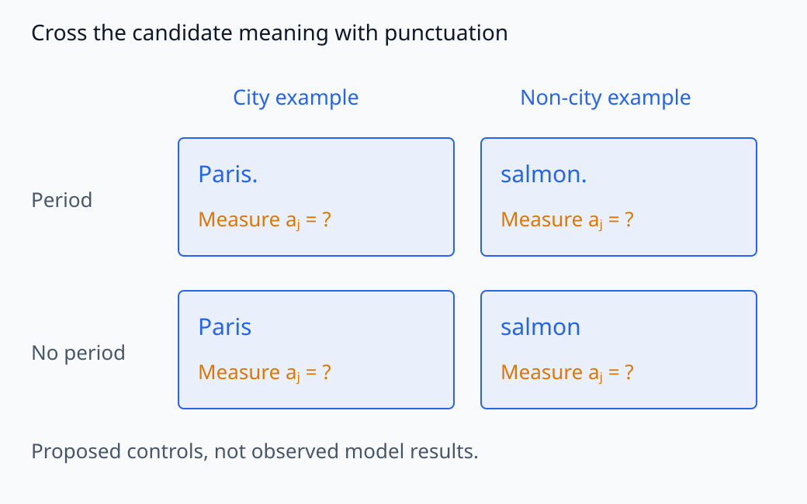

# I06-04. neuron 단위 분석

## 이 단원이 필요한 이유

activation vector의 한 좌표는 구현에서 바로 접근할 수 있어 분석하기 쉽다. 그러나 좌표 하나를 독립된 개념으로 부르려면 기저 의존성과 여러 입력에서의 선택성을 확인해야 한다. 같은 표현 공간을 회전하면 vector 사이 거리와 내적은 보존되지만 어느 좌표가 크게 반응하는지는 달라질 수 있다.

## 학습 목표

- neuron activation을 layer·token·coordinate로 정의할 수 있다.
- top activating example과 조건별 분포를 계산할 수 있다.
- 직교 기저변환이 좌표 해석과 표현 기하에 미치는 영향을 설명할 수 있다.
- polysemantic response와 측정 오류를 구분할 검사 항목을 적을 수 있다.

## 선수지식 확인

- 선수 단원: [I06-03 분포와 기초 통계](I06-03-distributions-basic-statistics.md), [M03-03 기저변환과 좌표 의존성](../../part-1-foundations/M03/M03-03-change-of-basis-coordinate-dependence.md)
- 확인 질문: 직교행렬로 모든 activation을 회전하면 pairwise distance는 변하는가?

## 기호와 용어

| 기호·용어 | Common spoken reading | 의미 | shape·범위 |
|---|---|---|---|
| $a_j(x)$ | `activation coordinate j for x` | 입력 $x$의 선택 위치에서 $j$번째 좌표 | scalar |
| selectivity | `selectivity` | 특정 조건에서 다른 조건보다 일관되게 반응하는 정도 | statistic |
| preferred examples | `preferred examples` | activation이 큰 입력 집합 | ranked samples |
| polysemantic neuron | `polysemantic neuron` | 서로 다른 여러 패턴에 반응하는 좌표 | coordinate-level description |
| $Q$ | `orthogonal matrix Q` | 길이와 내적을 보존하는 기저변환 | $d\times d$ |
| basis dependence | `basis dependence` | 기저가 바뀌면 좌표값·좌표 해석이 달라지는 성질 | property |

## 1. 분석 대상 고정

neuron 분석에서 좌표는 다음 정보로 식별한다.

```text
model@revision / module / layer / token rule / coordinate j
```

같은 `coordinate 37`도 residual stream, MLP intermediate와 MLP output에서 뜻이 다르다. 여러 token을 평균했다면 token별 neuron이 아니라 aggregation된 좌표 통계다.

입력 집합 $D$에서 좌표 $j$의 기본 보고서는 다음을 포함한다.

- min, median, mean, standard deviation과 max
- activation이 큰 예와 작은 예
- 사전 정의 조건별 분포
- 입력 길이·token ID와의 관계
- 여러 seed나 paraphrase에서의 반복성

좌표 번호가 같은 세 component도 서로 다른 vector다.

<figure class="lesson-figure" markdown="1">



<figcaption>같은 coordinate 37도 어느 tensor에서 선택했는지에 따라 다른 측정이다. layer와 token을 고정한 뒤 component와 좌표 번호를 함께 적는다.</figcaption>
</figure>

## 2. top example은 가설 생성 도구다

$a_j(x)$가 큰 입력을 정렬하면 좌표가 반응하는 패턴의 가설을 만들 수 있다. 하지만 상위 예만 보면 base rate를 잃는다. `Paris`, `Berlin`이 상위권이어도 모든 도시 문장에 반응하는지, 도시가 아닌 문장에도 반응하는지 확인해야 한다.

가설은 positive set, hard negative set과 counterexample로 검사한다. 상위 예에서 만든 설명을 같은 상위 예로 평가하지 않는다.

상위 예로 만든 가설과 그다음 검사할 입력을 분리하자.

<figure class="lesson-figure" markdown="1">



<figcaption>상위 activation 예로 도시 반응 가설을 만든다. 다음에는 그 예들을 재사용해 확증하지 않고 새 positive·hard negative·counterexample에서 반응을 확인한다.</figcaption>
</figure>

## 3. 기저 의존성

activation을 행 vector로 모은 행렬을 $A$라고 하자. 직교행렬 $Q$에 대해

\[
A'=AQ
\]

로 좌표를 바꾸면 각 행 사이 거리는 유지된다.

\[
\lVert a_iQ-a_kQ\rVert_2=\lVert a_i-a_k\rVert_2.
\]

행 vector의 차이에 먼저 $Q$를 곱한 것이므로, 제곱 norm을 전개하면

\[
\lVert(a_i-a_k)Q\rVert_2^2
=(a_i-a_k)QQ^\top(a_i-a_k)^\top
=\lVert a_i-a_k\rVert_2^2
\]

이다. 정사각 직교행렬에서는 $QQ^\top=I$가 되어 회전 항이 사라진다. 반면 $A'$의 한 열은 $Q$의 해당 열에 적힌 계수로 원래 좌표들을 섞은 값이다. 거리 보존은 vector 전체의 성질이고, 특정 열의 크기나 label과의 상관을 보존한다는 뜻은 아니다.

일반적인 회전에서 $A$의 coordinate 0과 $A'$의 coordinate 0은 다른 방향을 읽는다. 따라서 특정 좌표와 label의 상관은 바뀔 수 있다. 학습된 architecture가 MLP nonlinearity처럼 특별한 좌표 기저를 부여하는 경우에도, 좌표 하나를 완전한 개념과 동일시하는 결론은 별도 증거가 필요하다.

기존 합성 실습에서 좌표별 상관과 전체 거리의 보존을 나누어 확인하자.

<figure class="lesson-figure" markdown="1">



<figcaption>기존 합성 실습의 60×4 activation을 그대로 회전한 결과다. 같은 signal이 남아 있어도 어느 좌표가 가장 강하게 상관되는지는 달라진다.</figcaption>
</figure>

<figure class="lesson-figure" markdown="1">



<figcaption>같은 합성 실습의 입력 쌍 1,770개에서 회전 전후 거리를 비교했다. 각 거리에는 네 좌표 전체가 들어가며, 좌표 하나의 반응이 달라져도 이 기하는 보존된다.</figcaption>
</figure>

<figure class="lesson-figure lesson-figure--wide" markdown="1">



<figcaption>왼쪽의 Q는 수집한 activation에 적용하는 분석 좌표변환이다. 오른쪽처럼 model 경로에 삽입하면 downstream 연산도 대응시켜야 한다. 원소별 비선형함수는 임의의 회전과 교환되지 않는다.</figcaption>
</figure>

## 4. polysemanticity와 대안 설명

한 좌표의 상위 예가 문법, 주제와 구두점처럼 여러 패턴을 섞어 보일 수 있다. 가능한 설명은 여러 가지다.

- 실제로 여러 feature가 같은 좌표를 공유한다.
- 표본 수가 작아 우연한 공통점이 강조됐다.
- tokenization·position·길이 같은 교란이 있다.
- 더 높은 차원의 한 방향을 좌표 하나로 잘못 잘랐다.

neuron 분석은 이 후보를 좁히는 탐색이다. 인과적 기능은 후속 개입으로 검사한다.

의미와 문장 끝 마침표가 함께 변한 경우에는 두 조건을 교차해 검사할 수 있다.

<figure class="lesson-figure lesson-figure--wide" markdown="1">



<figcaption>도시 조건과 문장 끝 마침표를 교차한 검사 입력의 구조다. 각 칸의 aⱼ는 아직 측정할 값이다. 한 조건에서 함께 나타난 패턴을 분리하려면 이런 대조가 필요하다.</figcaption>
</figure>

## CPU 실습

합성 activation의 coordinate 0에 signal을 넣고 전체 공간을 직교 회전한다. 회전 전후 pairwise distance는 같지만 signal과 가장 강하게 상관된 coordinate 번호가 바뀐다.

<!-- I06_EXAMPLE: i06_04_neuron_basis -->

이 결과는 `좌표 해석이 무의미하다`는 뜻이 아니다. 좌표가 architecture에서 실제 계산 단위일 수 있다는 사실과, 좌표 설명이 기저에 의존한다는 사실을 함께 기록해야 한다.

## 흔한 오해

### 오해 1. 최고 activation 예가 좌표의 정의다

상위 예는 가설을 만든 표본이다. negative와 새 표본에서 설명의 sensitivity와 specificity를 평가해야 한다.

### 오해 2. neuron은 언제나 하나의 feature다

한 좌표가 여러 pattern에 반응하거나 한 feature가 여러 좌표에 분산될 수 있다.

### 오해 3. 회전 뒤 model이 같은 행동을 하므로 좌표는 쓸모없다

수집한 activation의 좌표를 분석용으로 회전하는 것과 model의 내부 계산을 바꾸는 것은 다르다. model 안에서 좌표를 바꾸면 그 좌표를 읽고 쓰는 연산도 대응시켜야 한다. 선형 projection은 weight의 기저변환으로 맞출 수 있지만, 원소별 nonlinearity는 일반적인 회전과 교환되지 않으므로 weight만 바꾼다고 같은 함수가 보장되지는 않는다. 사고실험에서 보존한 기하와 실제 architecture의 좌표별 계산을 구분한다.

## 연습문제

### 1. 위치 명세

`layer 5 neuron 10`에 빠진 정보를 두 가지 적어라.

<details><summary>해설 보기</summary>model과 revision, component 또는 module, token 선택 규칙이 빠졌다. layer 안에도 residual, attention과 MLP의 여러 tensor가 있다.</details>

### 2. top example

상위 20개 입력을 보고 `도시 neuron`이라는 가설을 만들었다. 다음 검사는 무엇인가?

<details><summary>해설 보기</summary>가설 생성에 쓰지 않은 도시 positive, 비도시 hard negative와 최소 대조 입력에서 반응을 평가한다. base rate와 threshold도 함께 정한다.</details>

### 3. 직교 회전

$Q^TQ=I$이면 왜 $\lVert aQ\rVert_2=\lVert a\rVert_2$인가?

<details><summary>해설 보기</summary>$\lVert aQ\rVert_2^2=aQQ^Ta^T=aa^T=\lVert a\rVert_2^2$이기 때문이다.</details>

### 4. 좌표 상관

회전 뒤 label과 가장 상관된 coordinate가 바뀌었다. 표현 정보가 사라졌다고 결론낼 수 있는가?

<details><summary>해설 보기</summary>없다. 정보가 다른 좌표 조합으로 이동했을 수 있다. 전체 공간의 선형 복원 가능성이나 기하를 별도로 검사해야 한다.</details>

### 5. polysemanticity

한 좌표가 도시 이름과 문장 끝 마침표에 모두 반응했다. 가능한 교란 하나를 적어라.

<details><summary>해설 보기</summary>도시 예가 대부분 문장 끝에 배치됐다면 position이나 punctuation 효과가 도시 의미와 섞였을 수 있다. 위치를 맞춘 대조군이 필요하다.</details>

### 6. 주장 범위

좌표를 0으로 만들었더니 정확도가 낮아졌다. 곧바로 그 좌표가 도시 개념인가?

<details><summary>해설 보기</summary>아니다. 개입 효과는 기능적 관련성을 보여주지만 분포 이탈, scale 변화와 다른 기능 손상을 통제해야 한다. 개념 설명은 별도 예제 검증이 필요하다.</details>

## 근거와 갱신 경계

좌표와 feature의 비일대일 가능성은 [Toy Models of Superposition](https://transformer-circuits.pub/2022/toy_model/index.html)을 참고했다. 기저변환의 거리 보존은 M03의 선형대수 결과다. 2026년의 neuron-basis circuit 증거는 특정 model과 회로에 관한 경험적 결과이며 모든 좌표의 단일 의미를 보장하지 않는다.

## 단원 요약

- neuron은 model·module·layer·token·coordinate로 식별한다.
- top example은 설명이 아니라 검증할 가설을 준다.
- 좌표 반응은 기저 의존적이지만 model의 실제 좌표 계산도 분석 대상이다.
- 좌표와 feature는 일대일이라고 가정하지 않는다.

## 통과 기준

- neuron 분석 위치를 빠짐없이 명세할 수 있는가?
- 직교 회전에서 보존되는 양과 바뀌는 양을 구분할 수 있는가?
- top example 가설을 독립 자료로 검증하는 절차를 쓸 수 있는가?

## 다음 단원

- [I06-05 PCA와 SVD 분석](I06-05-pca-svd-analysis.md)

## 집필자 점검표

- [x] 좌표 분석과 기저 의존성을 함께 설명했다.
- [x] 모든 문제에 해설이 있다.
- [x] 모델 해석 주장의 강도를 구분했다.
- [x] 용어집과 표기 규칙을 따랐다.
- [x] Common spoken reading이 실제 영어 학술 발화이며 한글 음역이나 기계적 직역을 포함하지 않는다.
- [x] 선수지식 밖의 내용을 몰래 요구하지 않는다.
- [x] 내부 링크와 수식 렌더링을 확인했다.
