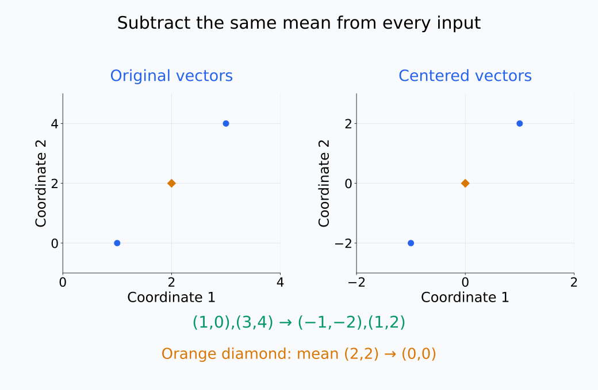
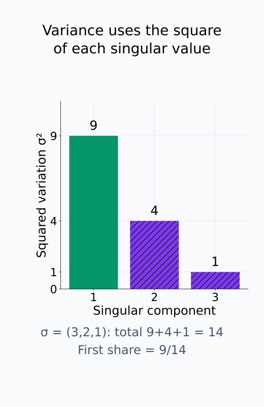
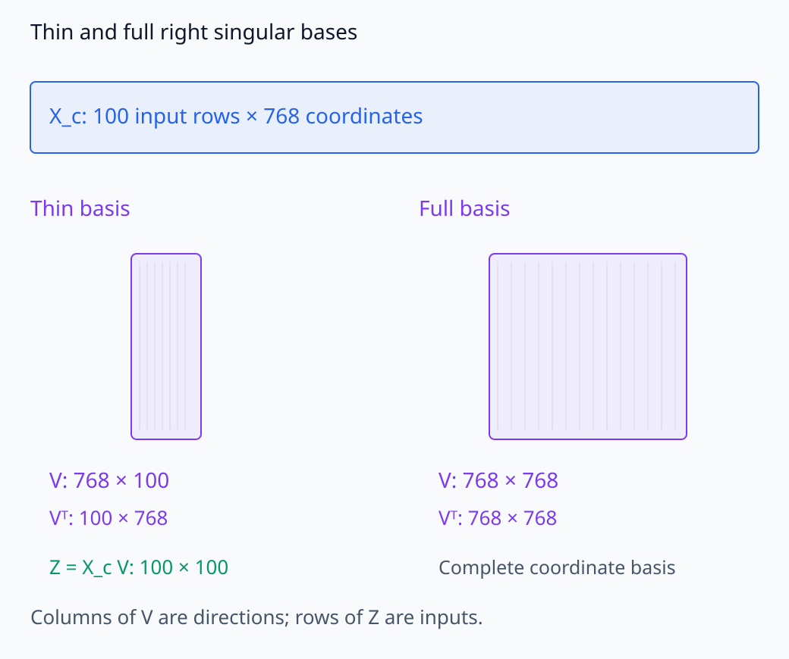
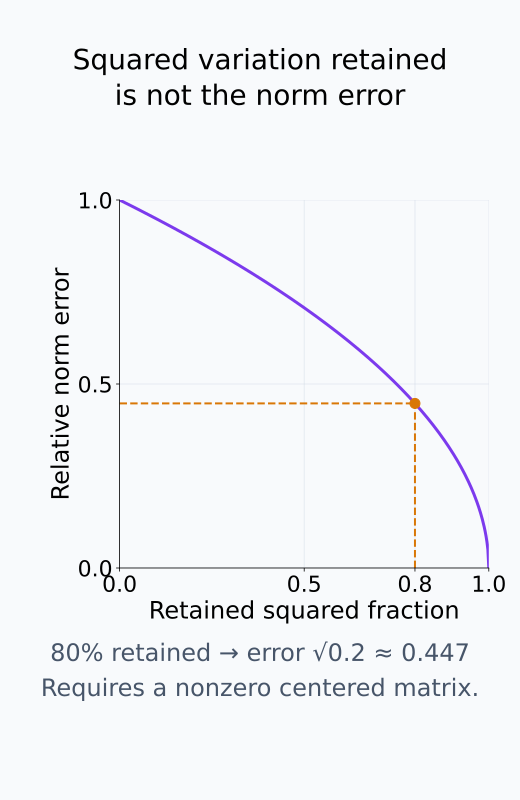
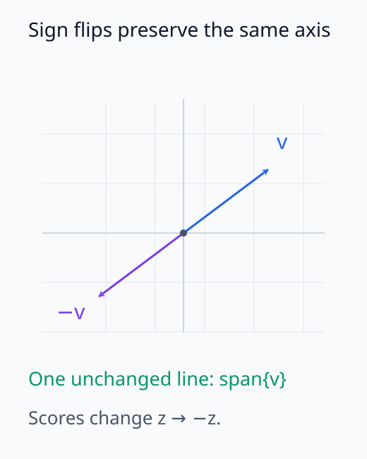
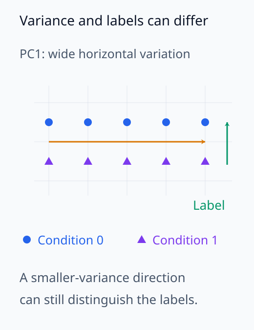
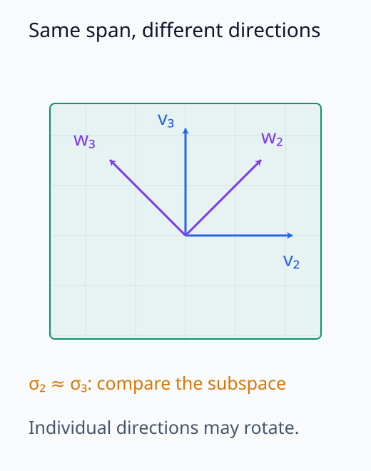

# I06-05. PCA와 SVD 분석

## 이 단원이 필요한 이유

activation은 수백 차원이라 좌표별 표만으로 변동 구조를 보기 어렵다. PCA는 표본에서 변동이 큰 직교 방향을 찾고, SVD는 그 계산을 안정적으로 수행한다. 큰 분산 방향이 곧 의미 있거나 model이 사용하는 방향이라는 보장은 없다.

## 학습 목표

- activation matrix를 중심화하고 SVD를 계산할 수 있다.
- singular value, principal direction과 score의 shape를 설명할 수 있다.
- explained variance와 rank-$k$ reconstruction error를 계산할 수 있다.
- PCA plot이 보존하는 정보와 버리는 정보를 구분할 수 있다.

## 선수지식 확인

- 선수 단원: [I06-04 neuron 단위 분석](I06-04-neuron-level-analysis.md), [M02-13 특이값분해](../../part-1-foundations/M02/M02-13-singular-value-decomposition.md), [M02-14 공분산과 PCA](../../part-1-foundations/M02/M02-14-covariance-pca.md)
- 확인 질문: 중심화하지 않은 첫 singular direction은 무엇에 끌릴 수 있는가?

## 기호와 용어

| 기호·용어 | Common spoken reading | 의미 | shape·범위 |
|---|---|---|---|
| $X_c$ | `X centered` | 행별 activation에서 표본평균을 뺀 행렬 | $n\times d$ |
| $X_c=U\Sigma V^T$ | `X centered equals U Sigma V transpose` | centered activation의 SVD | matrix factorization |
| $v_k$ | `the k-th right singular vector` | $k$번째 principal direction | $\mathbb R^d$ |
| $X_cv_k$ | `X centered times v sub k` | 각 표본의 $k$번째 principal score | $\mathbb R^n$ |
| explained variance ratio | `explained variance ratio` | 전체 제곱 변동 중 한 성분이 차지하는 비율 | $[0,1]$ |
| rank-$k$ approximation | `rank k approximation` | 상위 $k$개 singular triplet만 남긴 근사 | $n\times d$ |

## 1. 행과 열의 의미

activation dataset을

\[
X=\begin{bmatrix}a_1^T\\ \vdots\\ a_n^T\end{bmatrix}\in\mathbb R^{n\times d}
\]

로 둔다. 행은 입력 관찰 단위, 열은 activation 좌표다. 평균 vector $\bar a$를 빼

\[
X_c=X-\mathbf 1\bar a^T
\]

를 만든다. 중심화하지 않으면 원점에서 평균까지의 방향이 변동 방향처럼 나타날 수 있다.

두 행에서 같은 평균을 빼면 점들 사이의 차이는 그대로이고 평균의 위치만 바뀐다.

<figure class="lesson-figure lesson-figure--wide" markdown="1">

<figcaption>중심화의 역할을 선수 단원의 두 vector로 확인한 예다. 두 행에서 같은 평균 (2,2)를 빼면 (−1,−2),(1,2)가 되고 새 평균은 원점으로 옮겨진다.</figcaption>
</figure>

## 2. SVD에서 PCA 읽기

\[
X_c=U\Sigma V^T
\]

에서 $V$의 열은 activation 공간의 직교 방향이다. score matrix는

\[
Z=X_cV=U\Sigma
\]

다. 첫 두 score를 scatter plot에 쓰면 각 입력을 변동이 큰 두 방향에 투영한 그림을 얻는다.

thin SVD에서는 $U$의 shape가 $n\times\min(n,d)$, $\Sigma$가 $\min(n,d)\times\min(n,d)$, $V$가 $d\times\min(n,d)$다. full SVD는 $U$와 $V$를 각각 $n\times n$, $d\times d$의 완전한 직교기저로 확장한다. 이 단원의 $Z=U\Sigma$는 thin 형태의 score를 뜻하며, 구현에서 반환하는 $V^T$의 행들이 principal direction이다. 예를 들어 $n=100$, $d=768$이면 thin $V$는 $768\times100$이고 full $V$는 $768\times768$이다.

$k$번째 score는 각 중심화된 입력의 $v_k$ 방향 성분이다. $X_cv_k=\sigma_ku_k$이고 $u_k$의 제곱 norm은 1이므로, 그 score들의 제곱합은 $\sigma_k^2$다. 표본 공분산에서도

\[
\frac{X_c^TX_c}{n-1}=V\frac{\Sigma^2}{n-1}V^T
\]

가 되어, $v_k$ 방향의 표본분산은 $\sigma_k^2/(n-1)$이다. 이 식에는 $n>1$이 필요하다.

$k$번째 성분의 explained variance ratio는

\[
\rho_k=\frac{\sigma_k^2}{\sum_j\sigma_j^2}
\]

다. 상위 두 비율의 합이 0.8이면 표본의 centered squared variation 중 80%를 두 방향이 설명한다.

분산 비율에서는 공통 분모 $n-1$이 소거되므로 singular value의 제곱 비율만 남는다. 모든 centered activation이 0이면 제곱합도 0이어서 이 비율은 정의되지 않는다. 방향의 부호를 뒤집어도 score의 제곱합은 같으므로 explained variance는 바뀌지 않는다.

방향의 개수와 각 방향이 설명하는 제곱 변동을 따로 확인해 보자.

<figure class="lesson-figure" markdown="1">

<figcaption>기존 문제의 singular value 3,2,1은 제곱 변동 9,4,1에 대응한다. 첫 성분의 비율은 3/6이 아니라 9/14다.</figcaption>
</figure>

<figure class="lesson-figure lesson-figure--wide" markdown="1">

<figcaption>본문의 100×768 예에서 thin V는 100개 방향을, full V는 768개 방향의 완전한 기저를 담는다. thin score Z=UΣ의 행 수는 입력 수 100이며, principal direction은 구현이 돌려주는 Vᵀ의 행이다.</figcaption>
</figure>

## 3. 저랭크 근사와 오차

상위 $k$개 성분만 남기면

\[
X_{c,k}=U_{:,1:k}\Sigma_{1:k,1:k}V_{:,1:k}^T
\]

를 얻는다. Frobenius norm에서 이것은 최적 rank-$k$ 근사다. 상대오차

\[
\frac{\lVert X_c-X_{c,k}\rVert_F}{\lVert X_c\rVert_F}
\]

를 보고 압축 손실을 확인한다.

직교한 singular 성분들의 제곱 오차는 더할 수 있으므로, 버린 성분의 오차는

\[
\lVert X_c-X_{c,k}\rVert_F^2=\sum_{j>k}\sigma_j^2
\]

다. 따라서 $\lVert X_c\rVert_F>0$일 때 상대오차는 $\sqrt{1-\sum_{j=1}^k\rho_j}$다. explained variance가 80%라는 말은 제곱 변동의 20%를 버렸다는 뜻이며, 상대 norm 오차 자체가 20%라는 뜻은 아니다. 원래 activation을 근사하려면 $X_{c,k}$에 뺐던 평균 $\mathbf 1\bar a^T$를 다시 더한다.

남긴 제곱 변동의 비율과 norm 오차는 다음 곡선으로 연결된다.

<figure class="lesson-figure" markdown="1">

<figcaption>제곱 변동의 80%를 남기면 상대 norm 오차는 √0.2≈0.447이다. 남기지 않은 제곱 비율 0.2와 norm 오차를 구분한다. 원래 값의 근사에는 평균을 다시 더해야 한다.</figcaption>
</figure>

## 4. 해석의 한계

PCA는 label을 보지 않고 분산을 크게 만드는 방향을 찾는다. 문장 길이, token position이나 norm scale이 가장 큰 변동이면 첫 성분이 그것을 반영할 수 있다. 작은 분산 방향도 행동에 중요할 수 있다.

principal direction의 부호는 임의다. $v$와 $-v$는 같은 축이다. seed나 표본이 바뀌면 근접한 singular value에 해당하는 개별 direction은 회전할 수 있으므로 subspace 안정성을 함께 본다.

축의 부호, 큰 변동, 개별 방향의 안정성은 서로 구분해야 한다.

<figure class="lesson-figure" markdown="1">

<figcaption>v와 −v는 같은 1차원 축을 정한다. direction과 score의 부호를 함께 뒤집으면 score의 제곱합과 explained variance는 유지된다.</figcaption>
</figure>

<figure class="lesson-figure" markdown="1">

<figcaption>가로 변동이 큰 두 집단을 그린 개념도다. PC1이 큰 변동을 요약해도 label을 구분하는 세로 방향은 다른 역할을 한다. 실제 모델의 사용 여부를 이 그림으로 판정하지 않는다.</figcaption>
</figure>

<figure class="lesson-figure" markdown="1">

<figcaption>파란 방향과 보라 방향은 같은 평면의 서로 다른 직교기저다. singular value가 같으면 같은 재구성 성능을 내고, 값이 가까우면 개별 direction 비교가 불안정할 수 있어 span을 함께 본다.</figcaption>
</figure>

## CPU 실습

2차원 latent를 6차원으로 섞고 작은 noise를 더한다. centered matrix의 상위 두 singular value가 대부분의 변동을 설명하는지 확인한다.

<!-- I06_EXAMPLE: i06_05_pca_svd -->

합성 자료가 low-rank로 만들어졌기 때문에 결과가 좋다. 실제 activation에서 같은 비율이 나올 것이라고 가정하지 않는다.

## 흔한 오해

### 오해 1. PC1은 가장 중요한 feature다

PC1은 이 표본에서 분산이 가장 큰 방향이다. 행동 중요도나 인간이 붙인 개념과는 다른 기준이다.

### 오해 2. 두 차원 그림에서 집단이 겹치면 정보가 없다

버린 나머지 방향에 label 정보가 있을 수 있다. plot은 projection이다.

### 오해 3. loading이 큰 좌표가 원인이다

loading은 principal direction의 좌표 표현이다. 인과 기여를 측정하지 않는다.

## 연습문제

### 1. shape

$X_c$가 $100\times768$이면 $V$의 full SVD shape와 첫 score vector shape는 무엇인가?

해설 보기
full_matrices=False이면 $V$는 보통 $768\times100$에 해당하는 right singular vector 100개를 담고, 첫 score $X_cv_1$은 길이 100이다. 구현의 $V^T$ 반환 shape와 구분한다.

### 2. 중심화

모든 activation에 같은 vector $c$를 더했다. 중심화한 PCA 결과는 어떻게 되는가?

해설 보기
새 평균에도 $c$가 더해지므로 중심화하면 상쇄된다. 수치오차를 제외하면 centered matrix와 PCA는 같다.

### 3. explained variance

singular value가 $3,2,1$이면 첫 성분의 explained variance ratio는 얼마인가?

해설 보기
$3^2/(3^2+2^2+1^2)=9/14$다. singular value가 아니라 제곱을 사용한다.

### 4. 부호

다른 실행에서 $v_1$이 $-v_1$로 나왔다. 다른 축인가?

해설 보기
같은 1차원 축이다. score 부호도 함께 뒤집히므로 부호 정렬 뒤 비교한다.

### 5. plot 해석

PC1·PC2에서 두 조건이 분리됐다. linear probe가 test에서도 성공한다고 보장되는가?

해설 보기
보장되지 않는다. 같은 표본을 보고 만든 그림일 수 있고, held-out 성능과 control이 없다. 별도 split에서 probe를 평가해야 한다.

### 6. 가까운 singular value

$\sigma_2\approx\sigma_3$일 때 개별 $v_2,v_3$ 비교가 불안정한 이유는 무엇인가?

해설 보기
두 값이 같거나 가까우면 그 2차원 subspace 안의 여러 직교 기저가 비슷한 재구성 오차를 낸다. 개별 방향보다 span을 비교한다.

## 근거와 갱신 경계

SVD와 PCA의 수학은 M02-13~14의 정의를 따른다. 표현 비교에서 subspace와 불변성을 구분하는 문제는 [Similarity of Neural Network Representations Revisited](https://proceedings.mlr.press/v97/kornblith19a.html)와 연결된다. library별 randomized SVD 옵션은 구현 항목이다.

## 단원 요약

- activation 행렬을 중심화한 뒤 SVD에서 principal direction과 score를 얻는다.
- singular value 제곱으로 explained variance를 계산한다.
- PCA는 큰 변동을 요약하며 의미·사용·인과를 직접 측정하지 않는다.
- 가까운 singular value에서는 개별 방향보다 subspace가 안정적이다.

## 통과 기준

- SVD factor의 shape와 PCA score를 설명할 수 있는가?
- explained variance와 rank-$k$ 오차를 계산할 수 있는가?
- PCA plot이 허용하지 않는 주장을 적을 수 있는가?

## 다음 단원

- [I06-06 linear probe](I06-06-linear-probe.md)

## 집필자 점검표

- [x] PCA·SVD의 계산과 해석 한계를 연결했다.
- [x] 모든 문제에 해설이 있다.
- [x] 모델 해석 주장의 강도를 구분했다.
- [x] 용어집과 표기 규칙을 따랐다.
- [x] Common spoken reading이 실제 영어 학술 발화이며 한글 음역이나 기계적 직역을 포함하지 않는다.
- [x] 선수지식 밖의 내용을 몰래 요구하지 않는다.
- [x] 내부 링크와 수식 렌더링을 확인했다.
