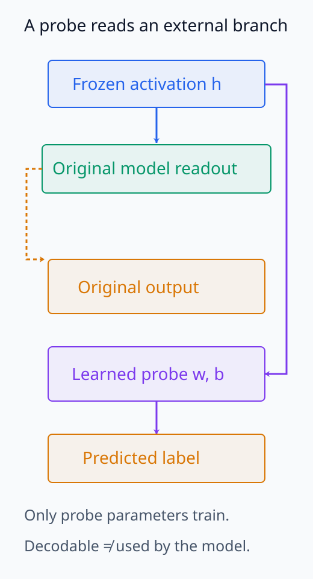
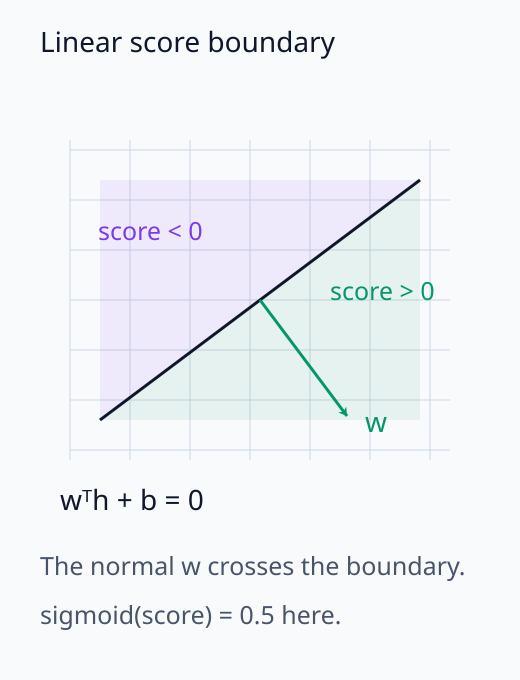
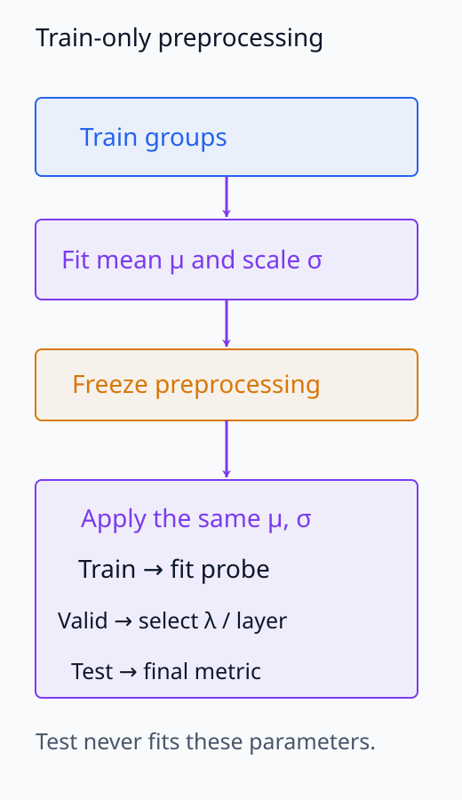
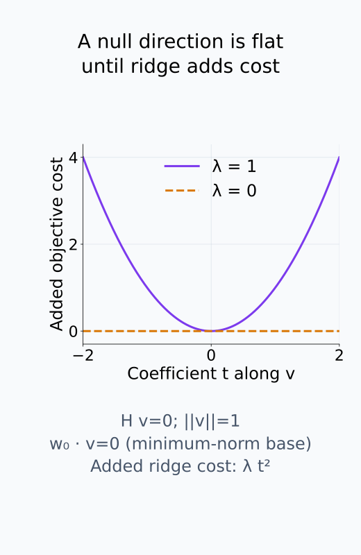
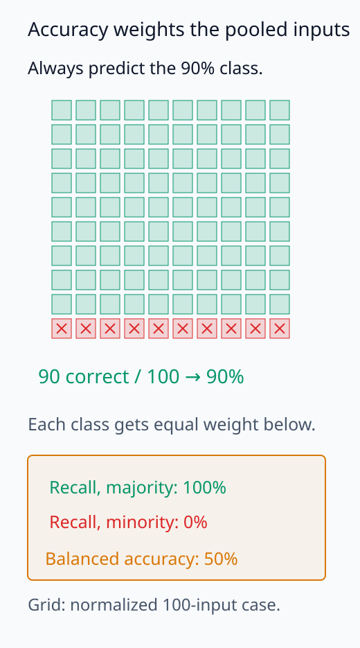

# I06-06. linear probe

## 이 단원이 필요한 이유

linear probe는 activation에서 label을 선형적으로 복원할 수 있는지 측정한다. 좌표 하나보다 전체 방향을 사용하고, 복잡한 nonlinear decoder보다 제한된 함수족을 사용한다. 높은 held-out 정확도는 선형 복원 가능성을 보여주지만 model이 그 정보를 출력에 사용한다는 뜻은 아니다.

## 학습 목표

- linear probe의 입력, target과 평가 단위를 정의할 수 있다.
- train/test 분리 뒤 regularized probe를 학습할 수 있다.
- accuracy를 majority·input-only baseline과 비교할 수 있다.
- 복원 가능성과 기능적 사용을 구분해 결론을 쓸 수 있다.

## 선수지식 확인

- 선수 단원: [I06-05 PCA와 SVD 분석](I06-05-pca-svd-analysis.md), [M04-08 회귀와 분류](../../part-1-foundations/M04/M04-08-regression-classification.md)
- 확인 질문: probe test label을 보고 layer를 고르면 test split은 여전히 독립 평가인가?

## 기호와 용어

| 기호·용어 | Common spoken reading | 의미 | shape·범위 |
|---|---|---|---|
| $h_i$ | `representation h sub i` | $i$번째 입력의 고정 activation | $\mathbb R^d$ |
| $y_i$ | `label y sub i` | 복원하려는 사전 정의 label | finite class set |
| $w^Th_i+b$ | `w transpose h sub i plus b` | binary linear probe score | scalar |
| probe | `linear probe` | 고정 representation 위에서 학습하는 선형 예측기 | auxiliary model |
| held-out accuracy | `held-out accuracy` | probe 선택에 쓰지 않은 표본의 정확도 | $[0,1]$ |
| decodability | `linear decodability` | 정한 함수족으로 정보를 복원할 수 있는 성질 | evidence level |

## 1. probe의 질문

고정된 activation $h_i$에서 label $y_i$를 예측하는 선형 함수를 학습한다. binary case의 score는

\[
s_i=w^Th_i+b
\]

이고 threshold나 logistic probability로 class를 정한다. model weight는 바꾸지 않고 probe parameter만 학습한다.

내적은 각 activation 좌표에 $w$의 계수를 곱해 더한다. 따라서 probe가 읽는 것은 좌표 하나가 아니라 여러 좌표의 선형 조합이다. $w\ne0$이면 $w^Th+b=0$은 두 class를 나누는 hyperplane이고, logistic probability를 쓸 때에는 이 score를 sigmoid에 넣는다. 확률 변환이 nonlinear이어도 0.5를 기준으로 나누는 경계는 같은 hyperplane이다. 최소제곱 score를 쓰는 경우에는 label을 어떻게 숫자로 표현했는지에 맞춰 threshold를 정한다.

질문은 `representation에 정보가 있는가`보다 좁다. 정확히는 **선택한 표본·위치·전처리·선형 함수족에서 label이 held-out 표본으로 복원되는가**이다.

별도 readout과 선형 경계를 나누어 보면 probe가 측정하는 질문이 분명해진다.

<figure class="lesson-figure" markdown="1">

<figcaption>같은 activation을 원래 모델과 별도 probe가 읽는다. probe가 label을 복원해도 원래 readout이 같은 방향을 사용한다는 뜻은 아니다.</figcaption>
</figure>

<figure class="lesson-figure" markdown="1">

<figcaption>2차원 경계의 개념도다. w는 경계에 수직이고 score의 부호가 두 쪽을 나눈다. sigmoid의 0.5 경계도 같은 score=0 경계다.</figcaption>
</figure>

## 2. split과 전처리

split은 입력 group 단위로 만든다. train 평균과 표준편차로 standardization하고 그 값을 validation·test에 적용한다. 전체 dataset 통계를 먼저 계산하면 test 정보가 전처리에 들어간다.

layer, regularization과 threshold는 train·validation에서 고른다. test는 마지막 평가에 한 번 사용한다. 여러 layer를 test accuracy로 비교했다면 그 test는 selection set이 됐다.

데이터마다 새 통계를 맞추는 것이 아니라, train에서 정한 변환을 그대로 전달한다.

<figure class="lesson-figure" markdown="1">

<figcaption>전처리 통계는 train에서만 맞추고 세 split에 같은 값을 적용한다. validation은 선택용이고 test는 최종 평가용이다. 이 도식은 3-split 평가 계약이며 CPU 예제의 2-split 결과를 바꾸지 않는다.</figcaption>
</figure>

## 3. regularization과 probe 용량

선형 probe도 $d$가 크고 $n$이 작으면 label을 외울 수 있다. ridge penalty를 쓴 최소제곱 probe는

\[
\hat w=\arg\min_w\sum_i(y_i-w^Th_i)^2+\lambda\lVert w\rVert_2^2
\]

처럼 쓸 수 있다. $\lambda$는 probe 용량과 수치 안정성에 영향을 준다. 하나의 성능값만 보고 representation과 probe의 기여를 분리할 수 없다.

첫 항은 train 표본의 예측 오차를 합하고, 둘째 항은 weight의 제곱 크기에 비용을 붙인다. 위 최소식은 bias를 생략한 형태다. $\lambda=0$이고 feature 수가 표본 수보다 많으면 train 오차가 같은 여러 weight가 남을 수 있다. $\lambda>0$에서는 $H^TH+\lambda I$가 양의 정부호여서 이 최소제곱 문제의 weight를 유일하게 정할 수 있다. 여기서 $H$의 각 행은 train activation의 전치다. 큰 weight로 train 오차만 줄이는 선택을 제한하지만, label signal까지 줄일 수 있어 held-out 평가가 필요하다.

train 예측에 나타나지 않는 방향에도 ridge 비용은 부과된다.

<figure class="lesson-figure" markdown="1">

<figcaption>H v=0인 unit direction에 t v를 더하면 train 예측이 바뀌지 않는다. 여기서는 minimum-norm base weight w₀가 v와 직교하여 ⟨w₀,v⟩=0이라고 두었다. 이 조건에서 추가 ridge 비용은 λt²이므로 λ=0의 flat 비용과 λ=1의 t²를 비교할 수 있다. 일반 base weight w에서는 추가 비용이 λ(2t⟨w,v⟩+t²)이다. λ>0의 strict convexity는 이런 비유일성을 없애지만 held-out 성능을 보장하지 않는다.</figcaption>
</figure>

## 4. baseline과 metric

class가 불균형하면 accuracy만으로 부족하다. majority baseline, balanced accuracy와 confusion matrix를 함께 본다. input 길이나 token identity만으로 label이 예측되면 activation probe가 새로운 정보를 보여준 것인지 불명확하다. input-only baseline도 필요하다.

accuracy는 모든 입력을 한데 세므로 표본이 많은 class의 결과를 더 크게 반영한다. balanced accuracy는 class별 recall을 같은 비중으로 평균한다. 따라서 다수 class만 맞히는 예측과 두 class를 모두 구별하는 예측을 분리해서 볼 수 있다. input-only baseline과 activation probe를 비교할 때에도 같은 split과 평가 단위를 써야 복원 성능의 차이를 읽을 수 있다.

다수 class의 비중과 두 class를 같은 비중으로 보는 평가를 비교해 보자.

<figure class="lesson-figure" markdown="1">

<figcaption>기존 문제의 90% 다수 class를 100칸으로 정규화한 그림이다. 다수 class만 예측하면 accuracy는 90%지만 두 class의 recall은 100%,0%여서 balanced accuracy는 50%다.</figcaption>
</figure>

## 5. 허용되는 결론

held-out test와 baseline을 통과하면 다음처럼 쓴다.

> 이 dataset과 측정 위치에서 label은 regularized linear probe로 복원 가능했다.

다음 문장은 아직 허용되지 않는다.

> model은 이 방향을 사용해 답을 만든다.

사용 주장은 probe direction에 대한 개입, downstream weight와의 정렬, causal mediation 같은 별도 기능 검사가 필요하다.

## CPU 실습

8차원 합성 representation의 두 좌표 조합에 binary label signal을 넣는다. 60개 train과 20개 test를 고정하고 ridge linear probe를 평가한다.

<!-- I06_EXAMPLE: i06_06_linear_probe -->

합성 생성 과정이 선형 signal을 포함하므로 높은 정확도는 예상된 결과다. 실제 model 결과의 성능 기준으로 사용하지 않는다.

## 흔한 오해

### 오해 1. 선형 probe는 너무 단순해서 외우지 못한다

고차원에서 표본 수가 작으면 선형 분류기도 임의 label을 분리할 수 있다. control task가 필요하다.

### 오해 2. 높은 정확도는 representation의 품질 순위다

dataset, label, layer, probe 용량과 metric에 따라 달라진다. 목적이 다른 representation을 한 숫자로 순위화하지 않는다.

### 오해 3. probe weight는 model의 실제 readout이다

probe가 새로 학습한 방향이다. model의 downstream weight가 같은 방향을 쓰는지는 별도 질문이다.

## 연습문제

### 1. shape

$h_i\in\mathbb R^{768}$인 binary probe의 $w$와 score shape는 무엇인가?

해설 보기
$w\in\mathbb R^{768}$이고 입력 하나의 $w^Th_i+b$는 scalar다. batch $n$개 score는 길이 $n$ vector다.

### 2. leakage

전체 자료로 PCA를 맞춘 뒤 test를 나눴다. 문제가 있는가?

해설 보기
있다. PCA direction이 test activation 분포를 사용했다. split 뒤 train에서 PCA를 맞추고 test에는 같은 변환을 적용해야 한다.

### 3. baseline

positive class가 90%이고 probe accuracy가 90%다. 무엇을 확인해야 하는가?

해설 보기
majority predictor도 90%이므로 개선이 없다. balanced accuracy, class별 recall과 confusion matrix를 본다.

### 4. layer 선택

12개 layer의 test accuracy 중 최고를 보고했다. 왜 과대평가될 수 있는가?

해설 보기
test에서 12번 선택 기회를 사용했다. validation에서 layer를 고르고 별도 test에서 최종 평가하거나 다중 선택을 보고해야 한다.

### 5. 사용 주장

probe test accuracy가 100%다. model이 label을 사용한다고 결론낼 수 있는가?

해설 보기
없다. probe가 읽을 수 있는 정보가 있다는 증거다. model의 실제 계산에 필요한지는 개입이나 downstream 기능 검사가 필요하다.

### 6. regularization

$\lambda$를 크게 하면 일반적으로 어떤 tradeoff가 생기는가?

해설 보기
weight norm과 분산은 줄지만 signal도 과도하게 줄여 bias와 underfitting이 커질 수 있다. validation으로 정한다.

## 근거와 갱신 경계

probe의 질문과 한계는 [Probing Classifiers: Promises, Shortcomings, and Advances](https://arxiv.org/abs/2102.12452)를 참고했다. control과 selectivity의 구체적 설계는 다음 단원에서 [Hewitt and Liang](https://arxiv.org/abs/1909.03368)을 기준으로 다룬다. 특정 solver API는 library version별 구현이다.

## 단원 요약

- linear probe는 고정 activation에서 label의 선형 복원 가능성을 측정한다.
- split, 전처리, layer와 hyperparameter 선택을 test 밖에서 끝낸다.
- probe 용량과 baseline을 함께 평가한다.
- decodability는 model의 기능적 사용이나 인과 효과가 아니다.

## 통과 기준

- probe의 입력·target·split·metric을 명세할 수 있는가?
- leakage 없는 학습·선택·평가 순서를 쓸 수 있는가?
- 높은 정확도에서 허용되는 주장과 금지되는 주장을 구분할 수 있는가?

## 다음 단원

- [I06-07 probe control과 selectivity](I06-07-probe-controls-selectivity.md)

## 집필자 점검표

- [x] 선형 복원과 기능적 사용을 분리했다.
- [x] 모든 문제에 해설이 있다.
- [x] 모델 해석 주장의 강도를 구분했다.
- [x] 용어집과 표기 규칙을 따랐다.
- [x] Common spoken reading이 실제 영어 학술 발화이며 한글 음역이나 기계적 직역을 포함하지 않는다.
- [x] 선수지식 밖의 내용을 몰래 요구하지 않는다.
- [x] 내부 링크와 수식 렌더링을 확인했다.
