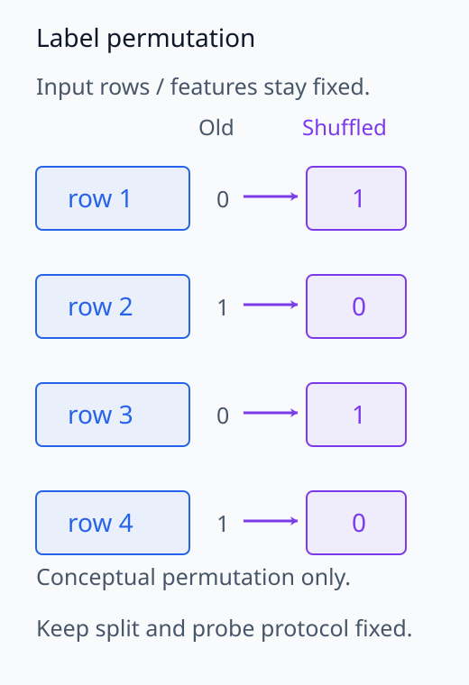
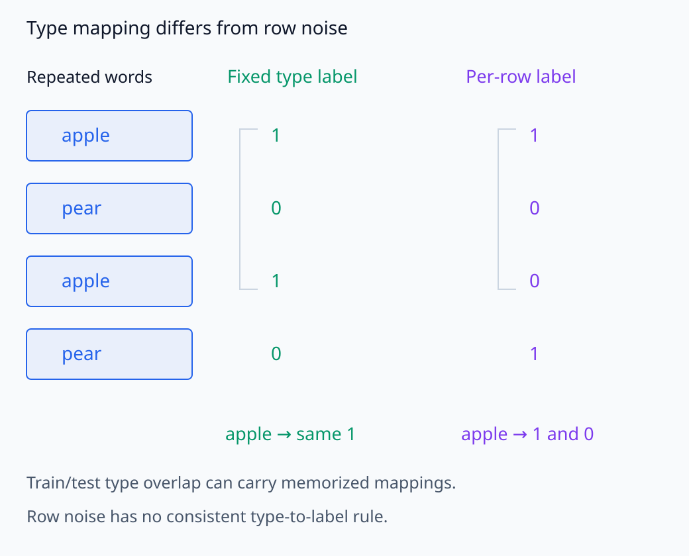
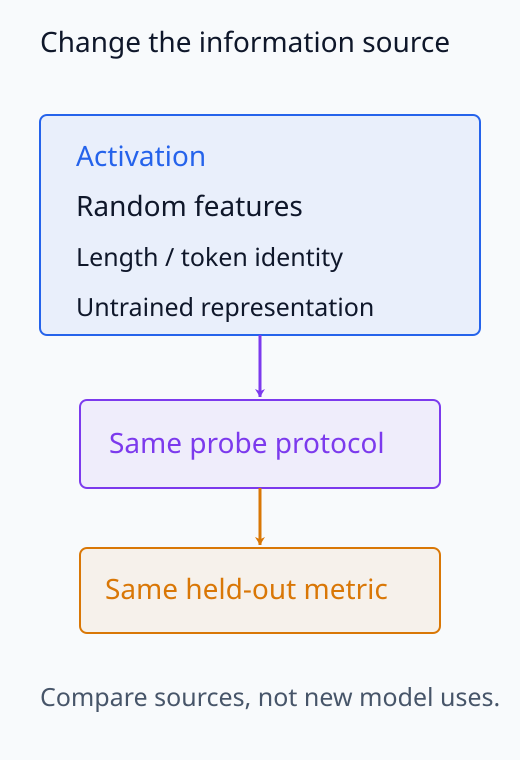
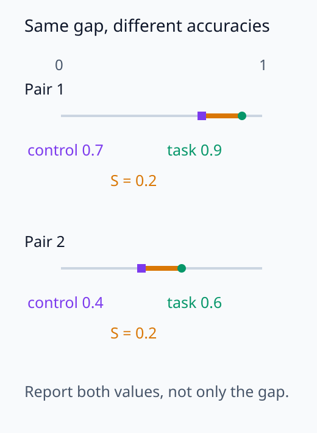
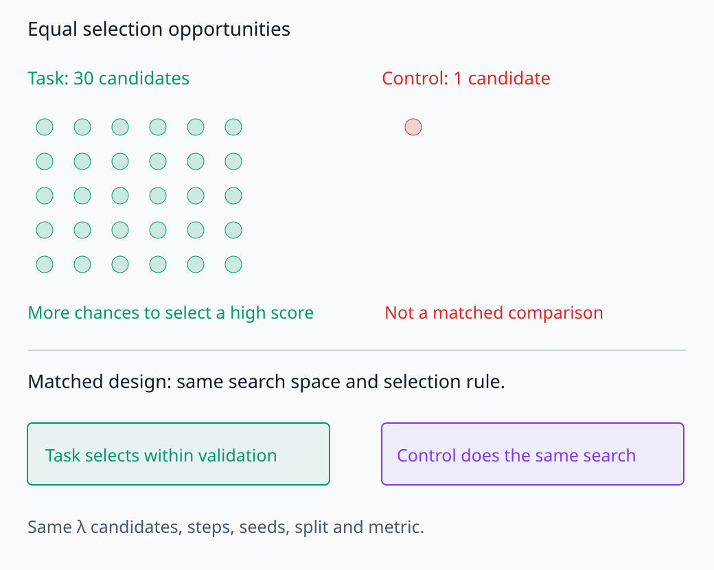
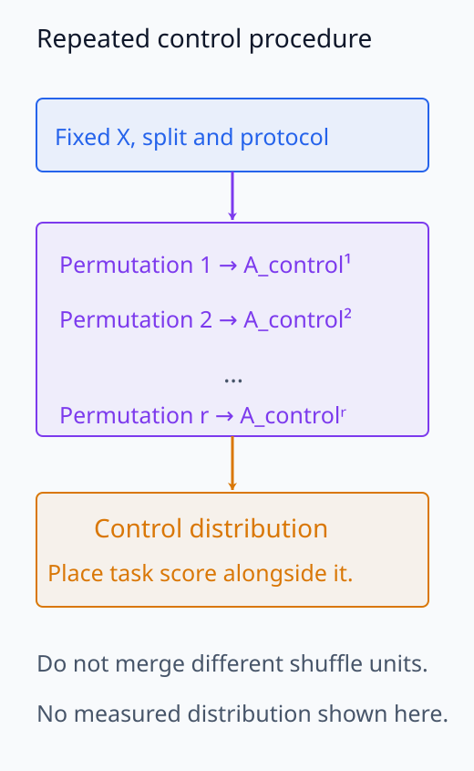

# I06-07. probe control과 selectivity

## 이 단원이 필요한 이유

probe는 representation뿐 아니라 probe 자체의 학습 능력도 측정한다. 고차원 activation과 작은 표본에서는 임의 label도 어느 정도 외울 수 있다. 같은 용량과 학습 절차를 사용한 control task를 두어 실제 task 성능을 문맥화해야 한다.

## 학습 목표

- label control과 representation control의 목적을 구분할 수 있다.
- 실제 task와 control task에 같은 probe protocol을 적용할 수 있다.
- selectivity를 계산하고 불확실성과 함께 해석할 수 있다.
- seed·hyperparameter 선택이 control 비교에 미치는 영향을 설명할 수 있다.

## 선수지식 확인

- 선수 단원: [I06-06 linear probe](I06-06-linear-probe.md)
- 확인 질문: 실제 label probe만 regularization을 튜닝하고 control probe는 고정하면 공정한 비교인가?

## 기호와 용어

| 기호·용어 | Common spoken reading | 의미 | shape·범위 |
|---|---|---|---|
| $A_{task}$ | `task accuracy` | 실제 label에 대한 held-out 정확도 | $[0,1]$ |
| $A_{control}$ | `control accuracy` | 통제 label에 대한 held-out 정확도 | $[0,1]$ |
| $S=A_{task}-A_{control}$ | `selectivity equals task accuracy minus control accuracy` | task와 control 성능 차이 | $[-1,1]$ |
| control task | `control task` | probe가 외울 수 있는 정도를 재는 대조 과제 | evaluation design |
| label permutation | `label permutation` | label과 입력 관계를 끊는 무작위 재배열 | randomized control |
| probe capacity | `probe capacity` | probe 함수족이 자료를 맞출 수 있는 능력 | model property |

## 1. 무엇을 통제하는가

label permutation은 원래 label과 representation의 대응을 무작위로 바꾼다. 실제 task와 같은 입력, split, dimension, probe class와 tuning budget을 유지한 채 train label을 섞는다. control test label도 같은 mapping 규칙으로 만들어야 한다.

언어 probe에서 word type마다 무작위 label을 고정하는 control task는 probe가 type identity를 이용해 외우는 능력을 측정한다. 단순히 각 행 label을 독립적으로 다시 뽑는 방법과 질문이 다르다.

type별 control에서는 같은 단어가 다시 나타나면 같은 random label을 부여한다. train에서 본 type이 test에도 나오면 probe가 외운 mapping을 재사용할 수 있으므로, 이 control은 type identity를 읽는 능력을 드러낸다. 행별 random label에서는 같은 type의 label도 달라질 수 있어 그 mapping이 없다. 원래 논문의 control은 전자에 해당한다. [Hewitt and Liang의 control task](https://aclanthology.org/D19-1275/)

이 단원의 CPU 실습은 전체 label 열을 한 번 재배열하고 원래 train/test index를 그대로 사용한다. word type별 mapping을 만든 실험은 아니며, 한 shuffle에서도 label과 activation의 우연한 상관이 남을 수 있다. 무엇을 무작위화했는지가 control 성능의 의미를 정한다.

representation control도 가능하다. activation 대신 random feature, input length, token identity나 untrained model representation을 넣어 어떤 정보원이 성능을 만드는지 비교한다.

무엇을 섞거나 교체하는지에 따라 control의 질문도 달라진다.

<figure class="lesson-figure" markdown="1">

<figcaption>label 대응을 바꾸되 activation 행과 원래 split은 유지한다. 네 행은 재배열의 개념 예이며 실제 control 정확도를 나타내지 않는다.</figcaption>
</figure>

<figure class="lesson-figure lesson-figure--wide" markdown="1">

<figcaption>단어 type별 control은 apple이 다시 나와도 같은 random label을 쓴다. 행별 random label은 같은 단어에도 다른 label을 줄 수 있으므로, 외운 type mapping이 test로 전달되는지를 묻는 질문과 다르다.</figcaption>
</figure>

<figure class="lesson-figure" markdown="1">

<figcaption>representation control에서는 probe의 입력 정보원을 바꾼다. 같은 split과 평가 규칙을 유지해야 activation 성능이 길이·identity 같은 정보원을 넘어서는지 비교할 수 있다.</figcaption>
</figure>

## 2. selectivity

같은 metric을 사용하면

\[
S=A_{task}-A_{control}
\]

로 selectivity를 정의할 수 있다. task accuracy가 높고 control accuracy가 낮을수록 probe가 실제 representation-label 관계를 이용했다는 해석이 강해진다.

selectivity 하나만으로 충분하지 않다. 두 accuracy와 class balance, seed별 분산을 함께 보고한다. $S=0.2$가 $0.9-0.7$인지 $0.6-0.4$인지에 따라 실용적 의미가 다르다.

차이가 같더라도 두 성능값의 위치는 같지 않다.

<figure class="lesson-figure" markdown="1">

<figcaption>본문의 두 예는 같은 selectivity 0.2를 갖지만 task와 control의 성능 위치가 다르다. 두 원래 값과 class balance·seed 분산을 함께 보고한다.</figcaption>
</figure>

## 3. 공정한 비교 계약

task와 control에는 다음을 같게 둔다.

- train·validation·test 행과 group split
- probe architecture와 parameter 수
- regularization 후보와 tuning 횟수
- optimizer·step·early stopping
- metric과 class weighting
- seed 수와 보고 방식

control만 덜 튜닝하면 control 성능을 인위적으로 낮출 수 있다. 반대로 task hyperparameter를 control에 그대로 복사하는 것이 각 과제에 같은 selection budget을 주는 것과 같은지도 명시한다.

같은 parameter 수뿐 아니라 높은 값을 선택할 기회도 맞춰야 한다.

<figure class="lesson-figure lesson-figure--wide" markdown="1">

<figcaption>기존 문제의 30 대 1 탐색 기회는 같은 probe 용량만으로 공정해지지 않음을 보여 준다. 두 과제에 같은 후보·selection budget을 주고 각 control 반복에도 같은 선택 절차를 적용한다.</figcaption>
</figure>

## 4. permutation 분포

한 번의 shuffle은 우연히 쉽거나 어려울 수 있다. 여러 permutation에서 $A_{control}^{(r)}$를 얻으면 control 분포와 task 성능의 위치를 볼 수 있다. 이때 split과 permutation seed를 manifest에 기록한다.

반복마다 달라지는 것은 label 대응이고, 원래 representation과 비교 절차는 고정한다. 같은 문장이나 type의 반복 측정이 있으면 그 묶음을 유지할지, 어떤 단위를 섞을지 정해야 한다. 독립 행 shuffle과 group별 고정 mapping은 서로 다른 대조이므로 결과를 같은 control 분포로 합치지 않는다.

layer 12개, label 5개와 probe 3개를 모두 탐색했다면 control도 같은 선택 절차를 거쳐야 한다. 최고 task score와 평균 control score만 비교하면 선택 기회가 맞지 않는다.

한 번의 대조를 반복할 때에는 무엇이 바뀌고 무엇이 고정되는지 추적한다.

<figure class="lesson-figure" markdown="1">

<figcaption>반복마다 바꾸는 것은 label 대응이며 나머지 계약은 고정한다. 그림은 분포를 만드는 절차이지 실제 측정값이나 significance 결과가 아니다. 독립 행 shuffle과 group mapping을 같은 분포로 합치지 않는다.</figcaption>
</figure>

## CPU 실습

I06-06과 같은 8차원 representation에 같은 ridge probe를 학습한다. 실제 label과 고정 seed로 섞은 label의 test accuracy 차이를 계산한다.

<!-- I06_EXAMPLE: i06_07_probe_control -->

이 예제는 control 한 번만 사용하므로 파일럿이다. 실제 보고서는 여러 shuffle의 분포와 confidence interval을 포함해야 한다.

## 흔한 오해

### 오해 1. random label accuracy는 언제나 chance다

고차원 probe가 random train label을 맞히는 능력과 독립 test label을 예측하는 능력은 다르다. test label이 입력과 독립이면 train 암기만으로 test의 체계적인 개선을 기대할 수 없지만, 작은 test에서는 우연히 높은 정확도가 나올 수 있다. type별 고정 label control에서는 train/test에 겹친 identity를 통해 외운 mapping이 전달될 수도 있다.

### 오해 2. selectivity가 양수면 model이 정보를 사용한다

representation에서 task label이 control보다 더 잘 복원된다는 증거다. model의 downstream 사용 증거는 아니다.

### 오해 3. probe parameter 수만 같으면 공정하다

tuning budget, step, early stopping과 selection 횟수도 맞춰야 한다.

## 연습문제

### 1. 계산

$A_{task}=0.84$, $A_{control}=0.57$이면 selectivity는 얼마인가?

해설 보기
$0.84-0.57=0.27$이다. 두 원래 정확도도 함께 보고한다.

### 2. 해석

task 0.95, control 0.90인 probe와 task 0.75, control 0.50인 probe 중 selectivity가 큰 것은 무엇인가?

해설 보기
첫 probe는 0.05, 둘째는 0.25다. 다만 task 성능과 목적도 다르므로 selectivity 하나로 우열을 끝내지 않는다.

### 3. group control

같은 word type에 서로 다른 random label을 매번 주면 type memorization을 측정할 수 있는가?

해설 보기
그 control은 일관된 type-label mapping 암기를 측정하지 못한다. word type마다 하나의 random label을 고정해야 한다.

### 4. tuning budget

task에는 30개 hyperparameter를 시험하고 control에는 하나만 시험했다. 어떤 편향이 생기는가?

해설 보기
task가 더 많은 선택 기회를 가져 성능 차이가 커질 수 있다. 동일한 search space와 selection protocol을 사용한다.

### 5. 여러 layer

최고 selectivity layer를 고를 때 control은 어떻게 처리해야 하는가?

해설 보기
각 control 반복에서도 같은 layer 선택 절차를 적용하거나, validation에서 layer를 고정한 뒤 test에서 비교한다.

### 6. 주장 범위

selectivity가 안정적으로 양수였다. 허용되는 주장은 무엇인가?

해설 보기
정한 probe class와 control protocol에서 실제 label 관계가 control mapping보다 더 잘 복원됐다는 주장이다. 기능적 사용과 인과는 아직 검사하지 않았다.

## 근거와 갱신 경계

control task와 selectivity는 [Designing and Interpreting Probes with Control Tasks](https://arxiv.org/abs/1909.03368)를 기준으로 설명했다. control 종류와 probe selection protocol은 연구 질문에 따라 달라지므로 보고서에 명시한다.

## 단원 요약

- control은 probe가 representation과 무관한 mapping을 학습하는 능력을 잰다.
- task와 control의 split, 용량, tuning과 selection budget을 맞춘다.
- selectivity는 두 성능의 차이이며 원래 값과 seed 분포를 함께 본다.
- control을 통과한 probe도 model의 기능적 사용을 증명하지 않는다.

## 통과 기준

- 질문에 맞는 label·representation control을 설계할 수 있는가?
- 동일한 probe protocol로 selectivity를 계산할 수 있는가?
- control 결과에 맞는 강도의 결론을 쓸 수 있는가?

## 다음 단원

- [I06-08 CCA, CKA와 RSA](I06-08-cca-cka-rsa.md)

## 집필자 점검표

- [x] control과 selectivity의 비교 계약을 명시했다.
- [x] 모든 문제에 해설이 있다.
- [x] 모델 해석 주장의 강도를 구분했다.
- [x] 용어집과 표기 규칙을 따랐다.
- [x] Common spoken reading이 실제 영어 학술 발화이며 한글 음역이나 기계적 직역을 포함하지 않는다.
- [x] 선수지식 밖의 내용을 몰래 요구하지 않는다.
- [x] 내부 링크와 수식 렌더링을 확인했다.
