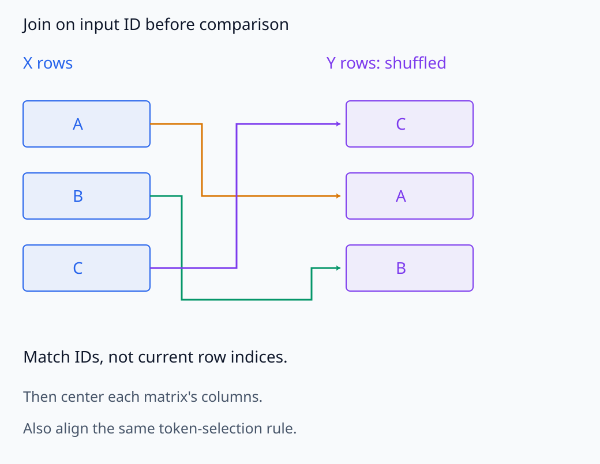
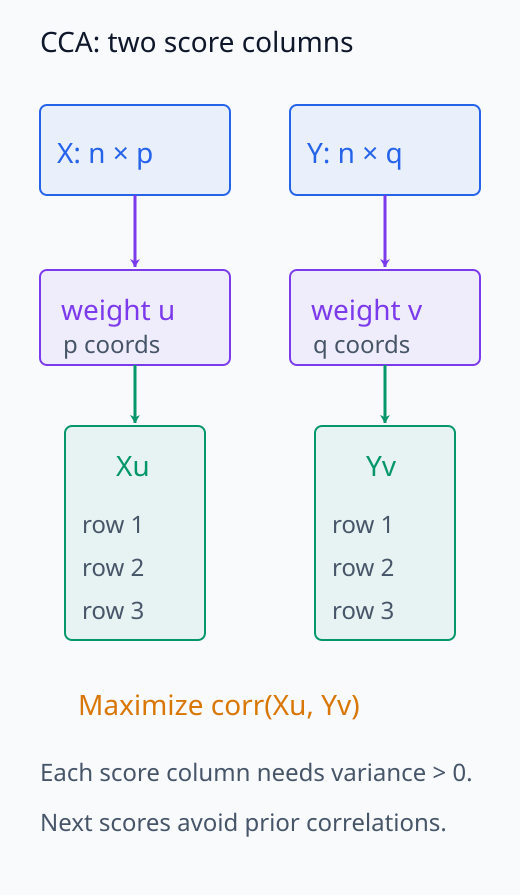
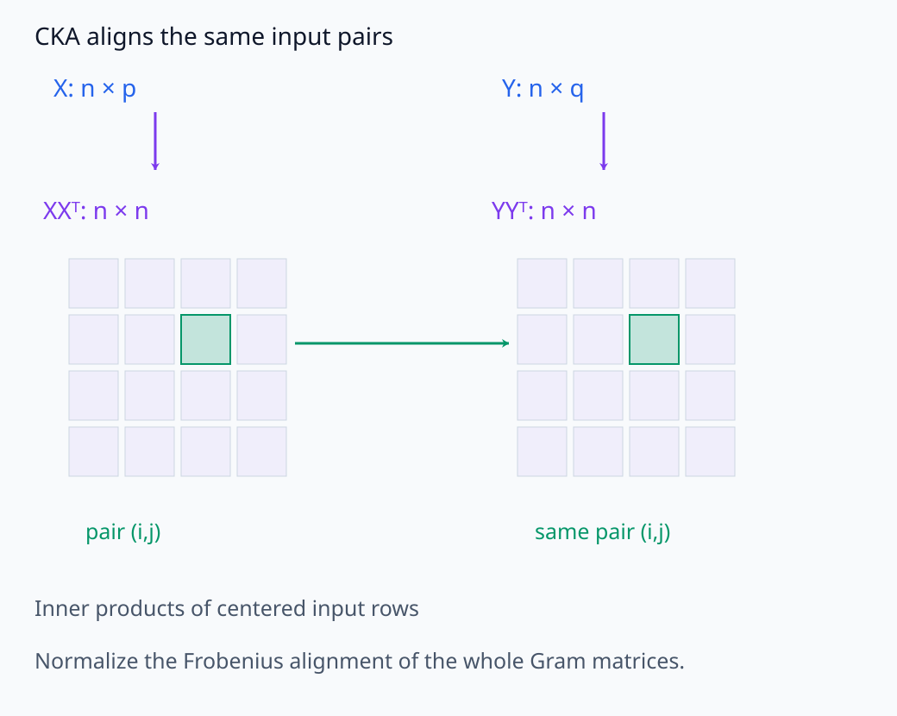
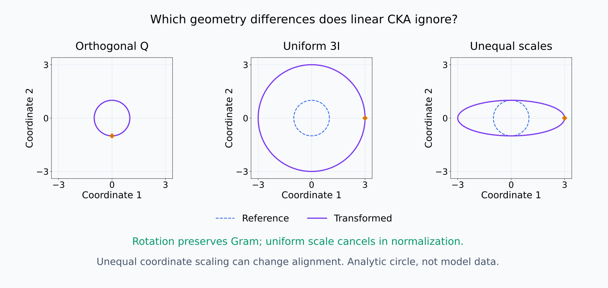
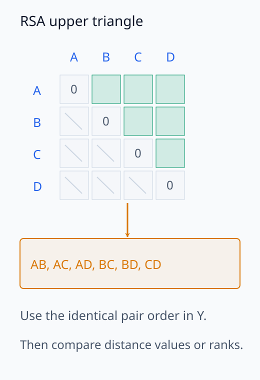
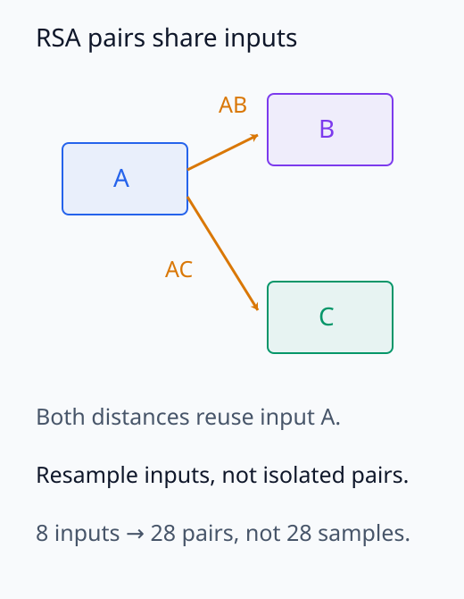

# I06-08. CCA, CKA와 RSA

## 이 단원이 필요한 이유

서로 다른 layer·seed·model의 activation은 좌표 수와 기저가 다를 수 있다. raw 좌표를 직접 빼는 대신 어떤 변환에 불변인 비교를 원하는지 정해야 한다. CCA, CKA와 RSA는 서로 다른 관계를 보존하며, 같은 `표현 유사도`라는 말로 합치면 안 된다.

## 학습 목표

- 두 representation matrix의 행 정렬 조건을 확인할 수 있다.
- CCA, linear CKA와 RSA가 비교하는 대상을 구분할 수 있다.
- linear CKA와 distance RSA를 작은 행렬에서 계산할 수 있다.
- 불변성이 너무 강하거나 표본 수가 작은 경우의 한계를 설명할 수 있다.

## 선수지식 확인

- 선수 단원: [I06-07 probe control과 selectivity](I06-07-probe-controls-selectivity.md), [M02-14 공분산과 PCA](../../part-1-foundations/M02/M02-14-covariance-pca.md)
- 확인 질문: $X$와 $Y$의 행이 서로 다른 입력 순서라면 유사도 계산 전에 무엇을 해야 하는가?

## 기호와 용어

| 기호·용어 | Common spoken reading | 의미 | shape·범위 |
|---|---|---|---|
| $X\in\mathbb R^{n\times p}$ | `X in R n by p` | 같은 $n$개 입력의 첫 representation | matrix |
| $Y\in\mathbb R^{n\times q}$ | `Y in R n by q` | 같은 $n$개 입력의 둘째 representation | matrix |
| CCA | `canonical correlation analysis` | 두 선형 projection 사이 상관을 최대화하는 분석 | canonical correlations |
| CKA | `centered kernel alignment` | centered Gram matrix의 정렬 정도 | $[0,1]$ for linear CKA |
| RSA | `representational similarity analysis` | 입력 쌍의 유사도·거리 구조를 비교하는 분석 | correlation statistic |
| invariance | `invariance` | 특정 변환 뒤에도 비교값이 유지되는 성질 | method property |

## 1. 먼저 행을 맞춘다

$X$와 $Y$의 $i$번째 행은 같은 입력, 같은 token 선택 규칙을 나타내야 한다. 한쪽 tokenizer에서 token alignment가 달라지면 문자열 위치가 아니라 비교 단위를 다시 정의해야 한다. 입력 순서를 잘못 맞춘 상태의 낮은 유사도는 model 차이가 아니라 join 오류다.

각 matrix는 열별로 중심화한다. model별 scale, whitening과 dimension reduction을 적용했다면 그 선택도 비교 방법의 일부다.

비교 전에 같은 입력이 같은 pair의 자리를 차지하도록 정렬한다.

<figure class="lesson-figure lesson-figure--wide" markdown="1">

<figcaption>좌표 열 수가 달라도 같은 입력 ID를 같은 행으로 맞춰야 한다. 표시한 A/B/C는 join의 개념 예이며 token 선택 규칙도 동일한 비교 단위로 정해야 한다.</figcaption>
</figure>

## 2. CCA

CCA는 projection $u,v$를 골라

\[
\operatorname{corr}(Xu,Yv)
\]

를 최대화하고 직교 조건 아래 다음 쌍을 찾는다. 다른 좌표 수를 허용하고 선형 subspace 관계를 본다. 그러나 $p,q$가 $n$보다 매우 크면 regularization과 dimension reduction 없이 상관이 과대평가되거나 비유일해질 수 있다.

$u$는 $p$차원, $v$는 $q$차원 weight이고 $Xu,Yv$는 같은 $n$개 입력에 대한 scalar score 열이다. 상관을 정의하려면 두 score의 분산이 0보다 커야 한다. 다음 쌍을 찾을 때의 직교 조건은 $u,v$ 자체의 Euclidean 직교가 아니라, 각 representation 안에서 이전에 얻은 score들과 새 score가 무상관이 되도록 하는 조건이다. feature가 많으면 표본에서 같은 score를 만드는 projection을 찾기 쉬워져, 높은 상관이 새로운 입력에서도 유지된다는 보장은 없다. [CCA의 표본·불변성 경계](https://proceedings.mlr.press/v97/kornblith19a.html)

좌표 수가 달라도 projection 뒤에는 같은 입력 수의 score 두 열이 남는다.

<figure class="lesson-figure" markdown="1">

<figcaption>u,v가 각각 다른 좌표 공간을 읽어도 Xu,Yv는 같은 n개 입력의 score 열이다. 분산이 양수인 score들의 상관을 최대화하며 다음 score는 기존 score와 무상관이 되도록 한다.</figcaption>
</figure>

## 3. linear CKA

중심화한 $X,Y$에 대해 linear CKA는

\[
\operatorname{CKA}(X,Y)=
\frac{\lVert X^TY\rVert_F^2}
{\lVert X^TX\rVert_F\lVert Y^TY\rVert_F}
\]

로 계산할 수 있다. 직교변환과 등방 scale에 불변이다. 모든 invertible linear transform에 불변인 것은 아니다. 이 제한은 representation의 geometry 차이를 남겨 두려는 선택이다.

$X^TY$는 $p\times q$의 교차 행렬이지만, 같은 계산을 입력 간 Gram matrix의 비교로도 쓸 수 있다.

\[
\operatorname{CKA}(X,Y)=
\frac{\langle XX^T,YY^T\rangle_F}
{\lVert XX^T\rVert_F\lVert YY^T\rVert_F}.
\]

두 Gram matrix는 모두 $n\times n$이고, 각 원소는 중심화한 입력 두 개의 내적이다. Frobenius 내적은 같은 위치의 원소를 곱해 모두 더하므로, 같은 입력 쌍들의 유사도 구조를 비교하는 식이다. 분모가 0이면 CKA는 정의되지 않는다.

정사각 직교행렬 $Q$에서는 $(XQ)(XQ)^T=XQQ^TX^T=XX^T$여서 Gram matrix가 그대로다. 행렬 전체를 0이 아닌 scalar 배로 키우면 Gram matrix가 그 scalar의 제곱 배가 되고, 정규화한 비율에서 약분된다. 좌표마다 다른 배율을 주면 이 공통 인수가 없어져 값이 달라질 수 있다.

Gram의 대응 칸과 무시하려는 geometry 변화를 분리해서 보자.

<figure class="lesson-figure lesson-figure--wide" markdown="1">

<figcaption>XXᵀ와 YYᵀ는 hidden dimension이 아니라 같은 입력 쌍의 내적을 담는다. 초록 칸의 pair (i,j)를 포함한 모든 대응 칸의 Frobenius alignment를 정규화한다.</figcaption>
</figure>

<figure class="lesson-figure lesson-figure--wide" markdown="1">

<figcaption>기준 unit circle의 수학적 개념도다. 직교회전은 Gram을 보존하고 등방 scale은 정규화에서 약분된다. 좌표마다 다른 scale은 원을 타원으로 바꾸듯 geometry를 달리할 수 있다. 실제 모델 data나 CKA 측정값은 아니다.</figcaption>
</figure>

## 4. RSA

RSA는 각 representation에서 입력 쌍의 거리 또는 비유사도 matrix를 만든다. upper triangle을 vector로 펼쳐 두 vector의 Pearson 또는 Spearman correlation을 계산한다. metric과 correlation 종류를 명시해야 한다.

RSA는 hidden dimension이 달라도 입력 쌍 구조를 비교할 수 있다. 반면 $n$이 작으면 쌍이 $n(n-1)/2$개여도 같은 입력을 공유하므로 완전히 독립인 관측이 아니다.

대각선은 자기 자신과의 거리이고, 아래·위 삼각형은 같은 쌍을 반복하므로 한쪽 삼각형만 사용한다. 두 vector에서 같은 index는 반드시 같은 입력 쌍이어야 한다. Pearson은 거리값 사이의 선형 관계를, Spearman은 거리 순서의 관계를 비교한다. 한쪽 거리 vector의 변동이 0이면 상관을 정의할 수 없고, 높은 상관도 개별 feature의 일대일 대응을 뜻하지는 않는다.

삼각형을 펼칠 때의 pair 순서와 pair들이 공유하는 입력을 함께 확인한다.

<figure class="lesson-figure" markdown="1">

<figcaption>대각선과 중복된 아래 삼각형을 제외하고 위 삼각형을 같은 pair 순서로 펼친다. 네 입력의 여섯 pair는 구조를 보여 주는 개념 예이며 본문의 8개 입력은 28개 pair를 갖는다.</figcaption>
</figure>

<figure class="lesson-figure" markdown="1">

<figcaption>AB와 AC는 A를 공유한다. pair 수가 많아져도 독립 입력이 그만큼 늘지 않으므로 uncertainty를 평가할 때 입력 단위를 보존한다.</figcaption>
</figure>

## 5. 어떤 방법을 고를까

| 질문 | 적합한 출발점 |
|---|---|
| 선형 subspace가 대응하는가? | regularized CCA 또는 SVCCA |
| 직교 회전·등방 scale을 무시하고 전체 geometry를 비교하는가? | linear CKA |
| 입력 쌍의 거리 순서가 비슷한가? | RSA |

결과가 다르면 한 방법이 틀렸다고 단정하지 않는다. 서로 다른 불변성과 요약을 사용했기 때문이다.

## CPU 실습

$Y=XQ+$ 작은 noise인 aligned representation과 독립 random representation을 만든다. CKA와 distance RSA가 aligned pair를 더 높게 평가하는지 확인한다.

<!-- I06_EXAMPLE: i06_08_similarity -->

## 실제 Pythia 규모 비교

I06-02의 Pythia 160M과 같은 여덟 prompt를 Pythia 410M layer 11에서도 수집한다. 두 matrix는 각각 $8\times768$, $8\times1024$이므로 raw 좌표 subtraction을 하지 않는다. 410M은 inference-only로 실행하고, 160M artifact와 linear CKA·distance RSA를 계산한다.

<!-- GPU_EXPERIMENT: pythia_410m_scale_smoke -->

표본이 여덟 개뿐인 결과는 runner와 비교 계약을 검증하는 파일럿이다. model 규모가 유사도를 일으켰다는 인과 결론이나 다른 prompt 모집단으로의 일반화는 허용되지 않는다.

## 흔한 오해

### 오해 1. 유사도 1이면 두 model이 같은 계산을 한다

선택한 방법이 요약한 관계를 먼저 밝혀야 한다. CCA의 projection 상관, linear CKA의 Gram 정렬과 RSA의 거리 상관은 서로 다른 양이다. 그 값이 1이라는 사실에서 downstream algorithm이나 행동의 동일성이 나오지는 않는다.

### 오해 2. RSA의 모든 pair는 독립 표본이다

한 입력이 여러 pair에 반복되므로 의존한다. bootstrap도 입력 단위로 해야 한다.

### 오해 3. 가장 높은 metric이 가장 좋은 metric이다

metric은 목표가 아니다. 질문에 필요한 불변성을 먼저 정한다.

## 연습문제

### 1. 행 정렬

$X$의 행은 prompt ID 순, $Y$의 행은 길이 순이다. 바로 CKA를 계산해도 되는가?

해설 보기
안 된다. 동일 prompt ID가 같은 행에 오도록 join하고 중복·누락을 검사한 뒤 계산한다.

### 2. 직교변환

$Y=XQ$이고 $Q^TQ=I$이면 linear CKA는 noise가 없을 때 얼마인가?

해설 보기
1이다. $Q$는 Gram geometry를 보존하며 linear CKA는 직교변환에 불변이다.

### 3. scale

$Y=3X$일 때 linear CKA는 어떻게 되는가?

해설 보기
1이다. 분자와 분모의 scale이 상쇄되어 등방 scale에 불변이다.

### 4. RSA pair 수

입력 8개면 upper triangle의 서로 다른 pair는 몇 개인가?

해설 보기
$8\times7/2=28$개다. 그러나 이 28개는 입력을 공유하므로 독립 표본 28개로 취급하지 않는다.

### 5. dimension

768차원과 1,024차원 representation에 RSA를 적용할 수 있는 이유는 무엇인가?

해설 보기
각 공간 안에서 같은 입력 쌍의 scalar 거리를 계산한 뒤 거리 구조를 비교하기 때문이다. raw 좌표 대응이 필요 없다.

### 6. 주장 범위

160M과 410M의 CKA가 높았다. `같은 feature를 학습했다`고 써도 되는가?

해설 보기
그대로는 안 된다. 고정 표본에서 정한 geometry가 유사했다는 증거다. 개별 feature 대응과 기능적 역할은 추가 분석이 필요하다.

## 근거와 갱신 경계

CKA의 정의와 불변성 선택은 [Similarity of Neural Network Representations Revisited](https://proceedings.mlr.press/v97/kornblith19a.html)를 기준으로 한다. CKA·RSA·CCA 관계의 후속 정리는 [Williams 2024](https://proceedings.mlr.press/v285/williams24a.html)를 참고했다. library 구현마다 centering과 unbiased estimator 선택이 다를 수 있으므로 공식을 기록한다.

## 단원 요약

- 두 matrix의 행은 같은 입력과 측정 단위로 정렬해야 한다.
- CCA는 선형 subspace, CKA는 centered geometry, RSA는 pairwise 구조를 비교한다.
- 방법마다 허용하는 불변성이 다르다.
- 작은 표본의 높은 유사도는 계산 동일성이나 일반화 증거가 아니다.

## 통과 기준

- CCA·CKA·RSA의 비교 대상을 구분할 수 있는가?
- linear CKA와 RSA의 입력 shape를 검사할 수 있는가?
- 질문에 맞는 불변성을 선택하고 한계를 쓸 수 있는가?

## 다음 단원

- [I06-09 feature visualization](I06-09-feature-visualization.md)

## 집필자 점검표

- [x] 표현 비교 방법과 불변성을 연결했다.
- [x] 160M·410M 비교의 표본 한계를 명시했다.
- [x] 모든 문제에 해설이 있다.
- [x] 모델 해석 주장의 강도를 구분했다.
- [x] 용어집과 표기 규칙을 따랐다.
- [x] Common spoken reading이 실제 영어 학술 발화이며 한글 음역이나 기계적 직역을 포함하지 않는다.
- [x] 선수지식 밖의 내용을 몰래 요구하지 않는다.
- [x] 내부 링크와 수식 렌더링을 확인했다.
