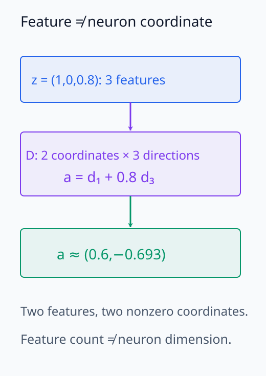
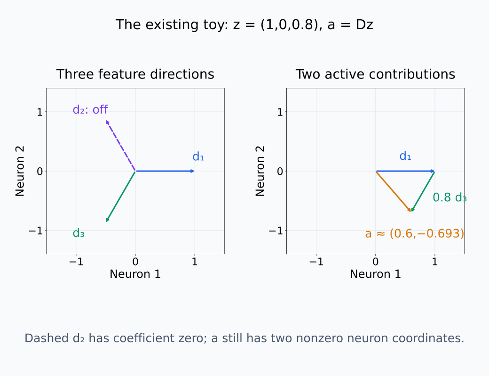
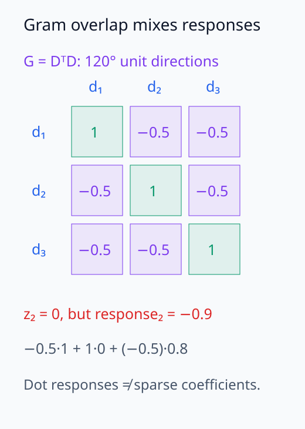
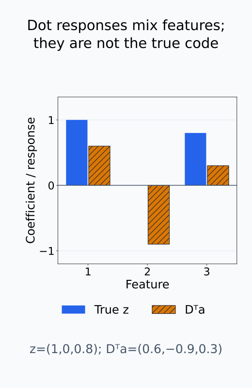
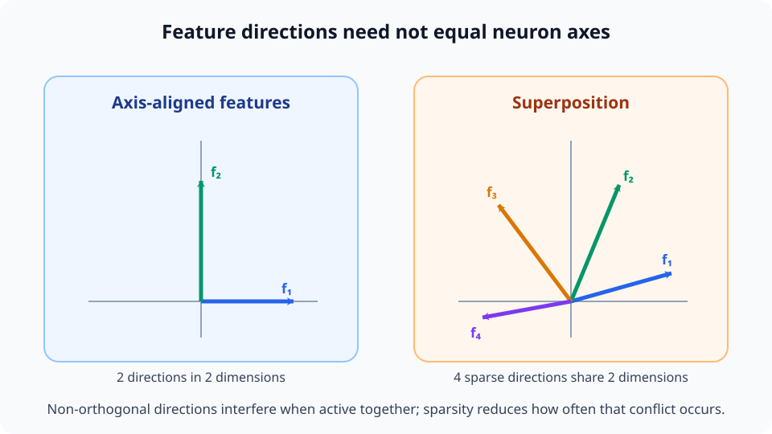
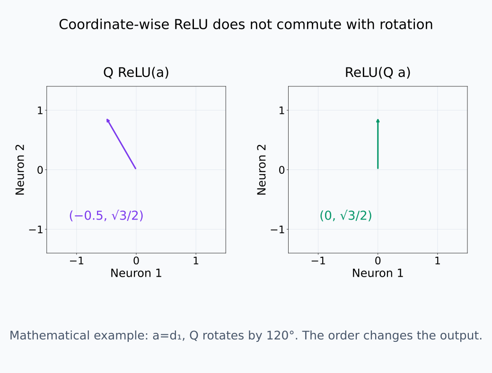

# I06-10. superposition

## 이 단원이 필요한 이유

feature 수가 representation dimension보다 많으면 모든 feature를 서로 직교한 좌표에 하나씩 놓을 수 없다. 입력마다 소수 feature만 활성화된다면 여러 feature direction을 같은 공간에 겹쳐 넣고 간섭을 감수하는 해가 유용할 수 있다. 이 관점은 neuron과 feature가 일대일이 아닐 수 있는 수학적 이유를 준다.

## 학습 목표

- overcomplete feature dictionary와 sparse coefficient를 구분할 수 있다.
- feature 수가 차원보다 많을 때 직교 배치가 불가능함을 설명할 수 있다.
- Gram matrix로 feature direction 사이 간섭을 계산할 수 있다.
- toy model의 superposition 결과를 실제 LLM의 확정 사실로 과장하지 않을 수 있다.

## 선수지식 확인

- 선수 단원: [I06-09 feature visualization](I06-09-feature-visualization.md), [M02-02 선형결합과 생성공간](../../part-1-foundations/M02/M02-02-linear-combinations-span.md)
- 확인 질문: 2차원 공간에 서로 직교한 nonzero vector를 세 개 둘 수 있는가?

## 기호와 용어

| 기호·용어 | Common spoken reading | 의미 | shape·범위 |
|---|---|---|---|
| $D=[d_1,\ldots,d_m]$ | `dictionary D with columns d one through d m` | feature direction을 열로 둔 dictionary | $d\times m$ |
| $z$ | `sparse feature vector z` | 입력에서 활성화된 feature coefficient | $\mathbb R^m$ |
| $a=Dz$ | `a equals D z` | feature 조합으로 만든 representation | $\mathbb R^d$ |
| overcomplete dictionary | `overcomplete dictionary` | 열 수가 ambient dimension보다 많은 dictionary | $m>d$ |
| $G=D^TD$ | `Gram matrix D transpose D` | feature direction 사이 내적 | $m\times m$ |
| interference | `feature interference` | 다른 feature가 dot-product decoding에 섞이는 효과 | scalar 또는 vector |

## 1. feature와 neuron을 분리한다

feature를 입력의 의미 있는 속성, neuron을 representation의 좌표라고 부르자. feature coefficient $z$가 sparse이고 dictionary $D$가 있으면

\[
a=Dz
\]

로 dense activation을 만들 수 있다. $m>d$이면 feature가 coordinate보다 많다. 각 feature를 별도 coordinate에 놓는 monosemantic 배치는 불가능하지만, 동시에 활성화되는 feature가 적다면 비직교 방향으로 저장할 수 있다.

$D$의 열 하나가 feature 하나의 방향이고, $z_j$가 그 방향의 기여량이다. neuron 좌표는 활성화된 방향들의 같은 좌표 성분을 더한 값이므로, sparse한 $z$도 dense한 $a$를 만들 수 있다. 서로 직교한 nonzero 방향들은 선형독립이어서 $d$차원에는 최대 $d$개만 둘 수 있다. $m>d$인 dictionary에는 선형종속이 남으므로 제약 없는 $z$를 $a$에서 유일하게 복원할 수는 없다. sparsity는 그 많은 후보 가운데 어떤 조합을 고려할지를 제한하는 추가 조건이다.

같은 toy에서 coefficient의 자리와 합벡터의 좌표를 구분해 보자.

<figure class="lesson-figure" markdown="1">

<figcaption>기존 CPU code z=(1,0,0.8)는 세 feature 중 두 개를 쓰지만 두 neuron 좌표 모두에 값이 생긴다. feature coefficient의 sparsity와 activation coordinate의 sparsity는 같은 성질이 아니다.</figcaption>
</figure>

<figure class="lesson-figure lesson-figure--wide" markdown="1">

<figcaption>같은 CPU dictionary의 방향과 합벡터다. d₂의 coefficient는 0이고 d₁+0.8d₃가 a를 만든다. sparse feature 조합이 dense neuron coordinate를 만들 수 있음을 보인다.</figcaption>
</figure>

## 2. Gram matrix와 간섭

dictionary column이 unit norm일 때 $G=D^TD$의 대각은 1이다. 비대각 $G_{jk}=d_j^Td_k$는 두 feature direction의 겹침이다. 단순 dot-product decoder는

\[
D^Ta=D^TDz=Gz
\]

를 낸다. $G=I$이면 정확하지만 overcomplete dictionary에서는 모든 비대각을 0으로 만들 수 없다. $Gz-z$가 간섭을 보여준다.

unit column 조건에서 decoder의 $j$번째 출력을 풀면

\[
(D^Ta)_j=z_j+\sum_{k\ne j}G_{jk}z_k
\]

다. 첫 항은 읽으려는 coefficient이고 나머지는 다른 active feature가 섞인 양이다. $z_j=0$인 feature도 다른 항 때문에 출력이 0이 아닐 수 있다. 따라서 $D^Ta$는 direction별 반응을 읽은 결과이며, 일반적인 overcomplete dictionary의 정확한 sparse coefficient 복원과 같지는 않다.

Gram의 비대각이 참 code와 단순 decoder 출력의 차이를 만든다.

<figure class="lesson-figure" markdown="1">

<figcaption>세 unit direction의 Gram 비대각은 모두 −0.5다. z₂=0이어도 두 active feature가 섞여 dot-product response₂=−0.9가 된다. 이것은 정확한 sparse coefficient 복원이 아니다.</figcaption>
</figure>

<figure class="lesson-figure" markdown="1">

<figcaption>기존 toy의 참 coefficient와 dot response를 같은 축에서 비교했다. 두 번째 feature가 inactive인데 음수 반응이 생기고 다른 두 값도 줄어든다. active support의 복원과 단순 내적 반응은 다르다.</figcaption>
</figure>

## 3. sparsity가 주는 여지

모든 feature가 항상 동시에 활성화되면 간섭이 누적된다. 각 입력에서 소수 feature만 켜지면 동시에 충돌하는 방향 수가 줄어든다. feature importance, sparsity와 상관구조에 따라 어떤 direction을 거의 직교하게 둘지 달라질 수 있다.

이 설명은 최적화된 toy model에서 관찰되는 geometry를 이해하기 위한 것이다. 실제 model에서 superposition을 입증하려면 feature 정의와 대안 가설, 재현 실험이 필요하다.

### 시각적 직관: 좌표축보다 많은 방향을 공유한다

<figure class="lesson-figure lesson-figure--wide" markdown="1">

<figcaption>왼쪽은 feature 두 개가 neuron 축과 일치하는 경우이고, 오른쪽은 네 feature 방향이 같은 2차원 공간을 비직교하게 공유하는 경우다.</figcaption>
</figure>

그림 오른쪽의 feature 수가 dimension보다 많다는 사실만으로 유용한 표현이 되는 것은 아니다. 동시에 켜지는 두 방향이 거의 평행하면 한 feature의 계수를 읽을 때 다른 feature가 크게 섞인다. 학습은 자주 함께 나타나거나 중요한 feature 사이의 각도를 더 벌리고, 드물게 함께 나타나는 feature가 더 많은 간섭을 나누어 부담하게 할 수 있다.

예를 들어 unit direction $d_1,d_2$만 활성화되어 $z_1=z_2=1$이면 $d_1$ 방향의 단순 decoder 출력은

\[
d_1^\top a
=
1+d_1^\top d_2
\]

이다. 두 방향이 직교하면 두 번째 항은 0이지만, 내적이 $-0.5$이면 읽힌 값은 $0.5$가 된다. 간섭은 그림의 겹침을 수치로 나타낸 Gram matrix의 비대각 항이다.

## 4. privileged basis

ReLU처럼 coordinate-wise nonlinearity가 있으면 neuron basis가 계산에서 특별한 역할을 갖는다. 그렇더라도 입력 feature가 반드시 개별 neuron과 일치하지는 않는다. `기저 의존적이다`와 `실제 기저가 중요하지 않다`는 다른 문장이다.

임의의 직교회전은 선형 층 사이에서 상쇄시킬 수 있는 경우가 있지만, coordinate-wise ReLU 앞뒤에 같은 방식으로 삽입하면 일반적으로 원래 함수가 보존되지 않는다. 따라서 representation을 분석할 때는 basis-free한 부분공간 주장과 실제 neuron 좌표에서만 성립하는 sparsity·gating 주장을 구분해야 한다.

순서를 바꾼 두 계산의 출력 vector를 직접 비교하면 차이가 드러난다.

<figure class="lesson-figure lesson-figure--wide" markdown="1">

<figcaption>기존 toy의 d₁와 120° 회전을 사용한 수학적 순서 비교다. Q ReLU(a)의 첫 성분은 −0.5지만 ReLU(Qa)는 이를 0으로 만든다. neuron basis의 coordinate-wise 연산이 일반 회전과 commute하지 않음을 보인다.</figcaption>
</figure>

## CPU 실습

2차원 원 위에 120도 간격으로 세 unit feature direction을 둔다. 세 feature 중 두 개를 활성화하고 단순 dot-product decoding의 간섭을 계산한다.

<!-- I06_EXAMPLE: i06_10_superposition -->

Gram matrix의 비대각 $-0.5$는 세 방향이 직교하지 않음을 보여준다. 이 구성은 원리를 보이는 toy example이지 실제 model feature의 추정치가 아니다.

## 흔한 오해

### 오해 1. hidden dimension이 768이면 feature도 최대 768개다

서로 직교한 direction은 최대 768개지만 sparse·비직교 표현은 더 많은 feature 후보를 담을 수 있다.

### 오해 2. 비직교 direction은 모두 오류다

간섭과 capacity 사이 tradeoff일 수 있다. decoder와 nonlinear computation이 이를 이용할 수 있다.

### 오해 3. SAE feature가 많으면 superposition이 증명된다

SAE는 선택한 목적함수의 dictionary를 학습한다. latent 수 자체는 원래 model의 ground-truth feature 수를 증명하지 않는다.

## 연습문제

### 1. 차원

$d=3$, $m=5$인 dictionary에서 모든 다섯 column을 서로 직교하게 둘 수 있는가?

해설 보기
없다. 3차원 공간의 서로 독립인 nonzero 직교 vector는 최대 3개다.

### 2. Gram matrix

unit dictionary에서 $G_{12}=0$이면 두 feature direction의 관계는 무엇인가?

해설 보기
서로 직교한다. 하나의 coefficient를 dot product로 읽을 때 다른 하나가 선형 간섭하지 않는다.

### 3. decoding

$G=I$이면 $D^Ta$는 무엇인가?

해설 보기
$D^Ta=Gz=z$이므로 단순 dot-product decoder가 coefficient를 정확히 복원한다.

### 4. sparsity

왜 입력별 active feature 수가 적으면 비직교 저장이 쉬워지는가?

해설 보기
한 입력에서 동시에 간섭하는 direction 수가 줄어든다. 서로 충돌하는 feature가 자주 함께 켜지지 않으면 평균 손실을 낮게 유지할 수 있다.

### 5. basis

coordinate-wise ReLU가 neuron basis를 특별하게 만드는 이유는 무엇인가?

해설 보기
임의 회전은 ReLU와 일반적으로 commute하지 않는다. 각 coordinate에 비선형성을 적용하는 계산 구조가 그 기저를 privileged하게 만든다.

### 6. 증거

한 neuron의 top example이 여러 주제를 포함했다. 이것만으로 superposition을 입증했는가?

해설 보기
아니다. 표본·교란·설명 실패도 가능하다. feature direction, sparsity, 간섭과 대안 설명을 체계적으로 검사해야 한다.

## 근거와 갱신 경계

toy model의 feature sparsity·importance·superposition geometry는 [Toy Models of Superposition](https://transformer-circuits.pub/2022/toy_model/index.html)을 기준으로 한다. toy model에서의 구성과 실제 LLM의 feature 존재론을 구분한다.

## 단원 요약

- feature direction과 neuron coordinate는 같은 개념이 아니다.
- overcomplete dictionary는 차원보다 많은 비직교 direction을 갖는다.
- Gram matrix의 비대각이 선형 간섭을 나타낸다.
- sparsity는 capacity와 interference의 tradeoff를 바꾼다.

## 통과 기준

- $a=Dz$에서 feature, coefficient와 neuron coordinate를 구분할 수 있는가?
- Gram matrix로 간섭을 계산할 수 있는가?
- toy superposition 결과의 주장 범위를 제한할 수 있는가?

## 다음 단원

- [I06-11 sparse coding](I06-11-sparse-coding.md)

## 집필자 점검표

- [x] superposition을 dictionary·sparsity·간섭으로 설명했다.
- [x] 모든 문제에 해설이 있다.
- [x] 모델 해석 주장의 강도를 구분했다.
- [x] 용어집과 표기 규칙을 따랐다.
- [x] Common spoken reading이 실제 영어 학술 발화이며 한글 음역이나 기계적 직역을 포함하지 않는다.
- [x] 선수지식 밖의 내용을 몰래 요구하지 않는다.
- [x] 내부 링크와 수식 렌더링을 확인했다.
