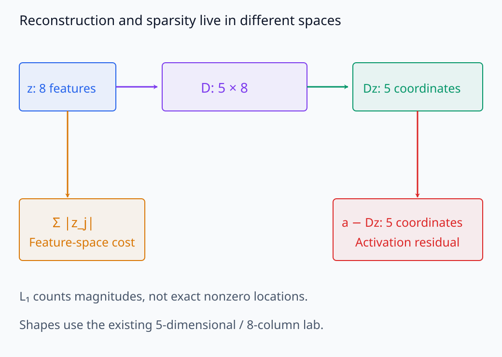
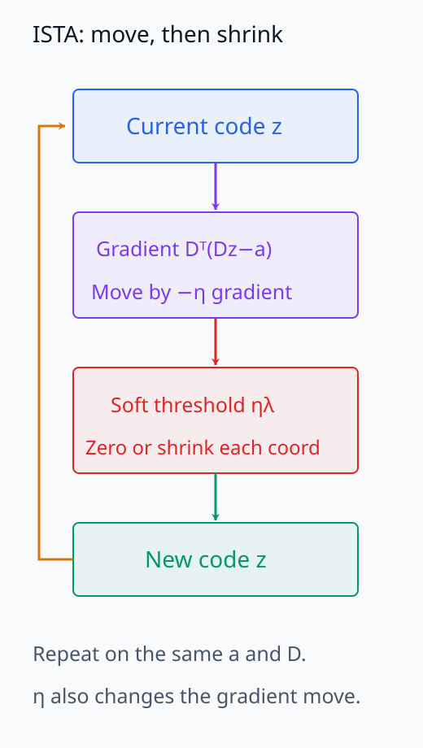
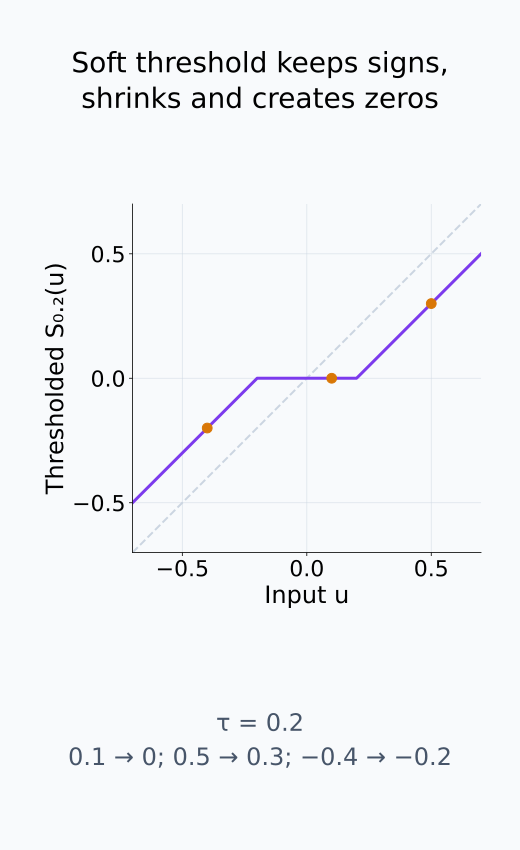
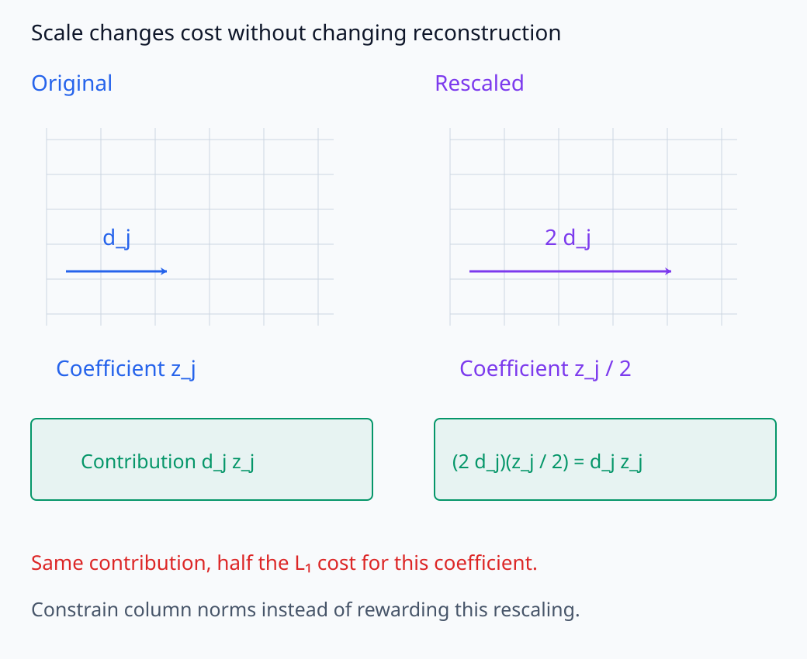
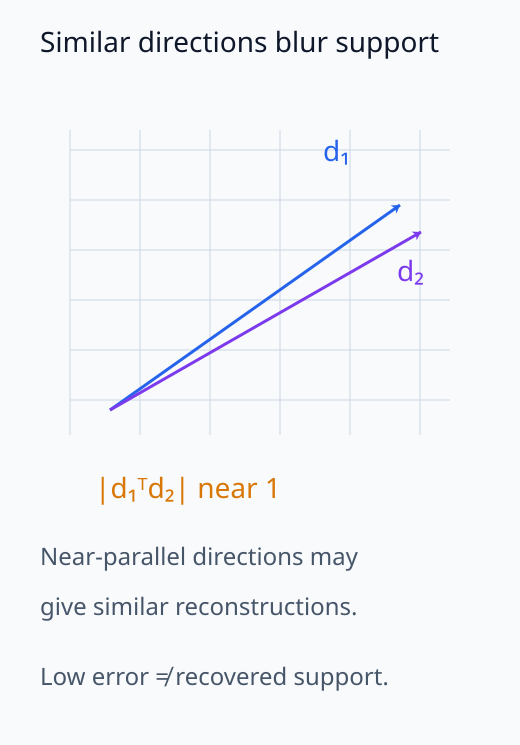
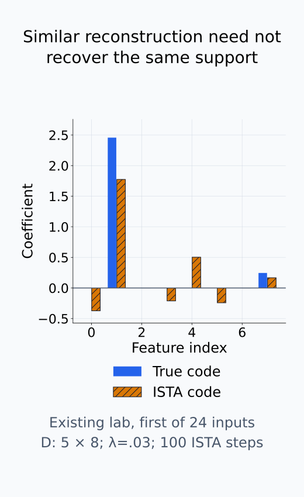

# I06-11. sparse coding

## 이 단원이 필요한 이유

sparse coding은 dense activation을 적은 수의 dictionary feature 조합으로 근사한다. reconstruction만 최소화하면 많은 coefficient를 사용할 수 있으므로 sparsity penalty를 함께 둔다. dictionary와 code가 유일하다고 가정하면 안 된다.

## 학습 목표

- reconstruction과 sparsity가 결합된 목적함수를 해석할 수 있다.
- 고정 dictionary에서 sparse code를 반복 갱신할 수 있다.
- reconstruction error, active fraction과 dictionary coherence를 평가할 수 있다.
- sparse solution의 비유일성과 scale 모호성을 설명할 수 있다.

## 선수지식 확인

- 선수 단원: [I06-10 superposition](I06-10-superposition.md), [M01-04 도함수와 그래프](../../part-1-foundations/M01/M01-04-derivative-and-graphs.md)
- 확인 질문: dictionary column을 두 배하고 coefficient를 절반으로 만들면 reconstruction은 변하는가?

## 기호와 용어

| 기호·용어 | Common spoken reading | 의미 | shape·범위 |
|---|---|---|---|
| $\hat z$ | `z hat` | 주어진 activation에서 추정한 sparse code | $\mathbb R^m$ |
| $\lVert a-Dz\rVert_2^2$ | `the squared reconstruction error` | 원 activation과 reconstruction의 제곱오차 | nonnegative scalar |
| $\lVert z\rVert_1$ | `the L one norm of z` | coefficient 절댓값 합 | nonnegative scalar |
| $\lambda$ | `lambda` | reconstruction과 sparsity의 tradeoff | nonnegative scalar |
| soft thresholding | `soft thresholding` | 작은 coefficient를 0으로 줄이는 proximal 연산 | elementwise map |
| $S_\tau(u)$ | `soft thresholding of u at tau` | scalar $u$를 threshold $\tau$로 줄이는 함수 | $\mathbb R\to\mathbb R$, $\tau\ge0$ |
| $\eta$ | `eta` | reconstruction gradient step의 크기 | positive scalar |
| dictionary coherence | `dictionary coherence` | 서로 다른 normalized column 내적의 최대 절댓값 | $[0,1]$ |

## 1. 고정 dictionary에서 code 찾기

activation $a$와 dictionary $D$가 주어졌을 때

\[
\hat z=\arg\min_z\frac12\lVert a-Dz\rVert_2^2+\lambda\lVert z\rVert_1
\]

을 푼다. 첫 항은 reconstruction, 둘째 항은 sparse coefficient를 선호한다. $\lambda=0$이면 reconstruction만 맞추고, 너무 크면 모든 code가 0이 될 수 있다.

$Dz$는 추정한 activation이고 $a-Dz$는 입력 공간에 남은 residual이다. 반면 $\lVert z\rVert_1$은 feature 공간의 coefficient 절댓값을 더하므로, 같은 reconstruction을 내는 후보라도 coefficient를 많이 쓰거나 크게 쓰면 비용이 달라진다. 이 penalty는 nonzero 개수를 직접 세지 않는다. 따라서 해석할 active feature의 기준과 수치적으로 작은 coefficient를 0으로 볼 threshold도 따로 정해야 한다.

두 항이 서로 다른 공간에 있는 값을 벌점으로 계산한다는 점을 먼저 보자.

<figure class="lesson-figure lesson-figure--wide" markdown="1">

<figcaption>기존 실습의 8개 feature와 5개 activation coordinate를 이용해 두 비용의 공간을 구분했다. L₁은 feature 계수 크기의 합이고 residual은 activation 공간에 남는다. L₁을 nonzero 개수로 읽지 않는다.</figcaption>
</figure>

## 2. ISTA

reconstruction 항의 gradient는

\[
\nabla_z\frac12\lVert a-Dz\rVert_2^2=D^T(Dz-a)
\]

다. gradient step 뒤 soft thresholding을 적용하면

\[
z^{(k+1)}=S_{\eta\lambda}\left(z^{(k)}-\eta D^T(Dz^{(k)}-a)\right)
\]

을 얻는다. ISTA는 iterative shrinkage-thresholding algorithm의 약어다. residual $Dz-a$에 $D^T$를 곱하면 각 dictionary 방향으로 오차를 얼마나 줄여야 하는지를 code 공간의 gradient로 옮긴다. 앞의 $1/2$는 제곱을 미분할 때 나오는 2와 약분된다.

scalar에 대한 soft thresholding은

\[
S_\tau(u)=\operatorname{sign}(u)\max(\lvert u\rvert-\tau,0)
\]

이며 vector에는 좌표별로 적용한다. 절댓값이 threshold 이하인 값은 0이 되고, 나머지는 부호를 유지한 채 크기가 줄어든다. 따라서 한 step은 reconstruction 오차를 줄이는 방향으로 이동한 뒤, $\eta\lambda$만큼 coefficient를 줄이는 두 계산이다. $L_1$은 0에서 미분 가능하지 않으므로 두 항의 평범한 gradient를 한 번 더하는 대신 이 threshold 연산을 쓴다.

$D\ne0$인 고정 dictionary에서 $D^TD$의 spectral norm은 reconstruction gradient가 변하는 최대 배율이다. $0<\eta\le1/\lVert D^TD\rVert_2$로 정하면 이 convex 목적함수에 대한 표준적인 ISTA step을 사용할 수 있다. 큰 $\eta$는 penalty threshold뿐 아니라 오차 방향 이동도 함께 키우므로, threshold만 보고 step을 고르지 않는다.

한 반복의 두 단계와 scalar threshold의 곡선을 분리해서 확인한다.

<figure class="lesson-figure" markdown="1">

<figcaption>ISTA의 한 반복은 reconstruction gradient 이동 뒤 ηλ threshold를 적용한다. η는 threshold뿐 아니라 gradient 이동도 바꾸므로 두 효과를 함께 읽는다.</figcaption>
</figure>

<figure class="lesson-figure" markdown="1">

<figcaption>기존 문제의 τ=0.2를 곡선으로 그렸다. 중앙 구간은 0이 되고 양쪽은 부호를 유지한 채 크기가 줄어든다. 회색 점선은 아무 변화 없는 S(u)=u와 비교하기 위한 선이다.</figcaption>
</figure>

## 3. dictionary도 학습할 때

code와 dictionary를 번갈아 갱신할 수 있다. scale 모호성을 막기 위해 dictionary column norm을 제한한다. column permutation과 sign·scale 변환은 같은 reconstruction을 만들 수 있으므로 feature ID는 학습 실행 사이에서 자동으로 정렬되지 않는다.

column $d_j$를 크게 하고 $z_j$를 그만큼 줄이면 곱 $d_jz_j$는 그대로지만 $L_1$ 비용은 내려간다. column 크기를 제한하지 않으면 실제로 더 적은 feature를 쓰지 않고도 이 비용을 줄일 수 있다. 또한 $D$를 고정한 code 문제와 두 변수를 함께 학습하는 문제는 다르다. 번갈아 갱신한 결과가 seed마다 같은 dictionary나 동일한 feature ID를 주는 것은 아니다.

scale만 바꾸어 같은 contribution의 비용을 낮추는 경우를 비교한다.

<figure class="lesson-figure lesson-figure--wide" markdown="1">

<figcaption>기존 문제처럼 d_j를 두 배하고 z_j를 절반으로 하면 contribution은 그대로지만 이 계수의 L₁ 비용은 줄어든다. column norm을 제한하지 않으면 sparse해진 것이 아니라 scale만 바꿔 비용을 줄일 수 있다.</figcaption>
</figure>

## 4. 평가

최소한 다음을 함께 본다.

- reconstruction MSE 또는 explained variance
- 표본당 nonzero 수 $L_0$
- coefficient magnitude 분포
- 거의 사용되지 않는 dictionary column
- dictionary coherence
- seed·dictionary size·$\lambda$에 대한 안정성

낮은 reconstruction error만으로 해석 가능한 feature를 얻었다고 결론낼 수 없다.

reconstruction, code support와 dictionary 방향의 구별 가능성을 따로 확인한다.

<figure class="lesson-figure" markdown="1">

<figcaption>거의 평행한 column들은 비슷한 activation을 설명할 수 있어 support를 구별하기 어렵다. 방향의 각도를 보여 주는 개념도이며 기존 문제의 정확한 coherence 0.99를 추정한 그림은 아니다.</figcaption>
</figure>

<figure class="lesson-figure" markdown="1">

<figcaption>기존 24개 CPU 입력 중 첫 행의 참 code와 같은 100-step ISTA 결과다. reconstruction을 잘 근사해도 선택된 feature support가 원래 code와 같다는 보장은 없다. ground truth는 합성 입력의 생성 code일 뿐 실제 모델 feature가 아니다.</figcaption>
</figure>

## CPU 실습

5차원 activation을 8개 dictionary column 중 두 개의 조합으로 생성한다. 고정 dictionary에서 ISTA로 code를 추정하고 reconstruction과 active fraction을 기록한다.

<!-- I06_EXAMPLE: i06_11_sparse_coding -->

추정 code가 ground truth보다 덜 sparse할 수 있다. dictionary coherence와 penalty가 support recovery에 영향을 주기 때문이다.

## 흔한 오해

### 오해 1. sparse code는 언제나 유일하다

dictionary column이 비슷하거나 목적함수 조건이 부족하면 여러 code가 비슷한 reconstruction을 낼 수 있다.

### 오해 2. $L_1$은 정확한 $L_0$와 같다

$L_1$은 convex surrogate다. 작은 nonzero coefficient가 남을 수 있어 threshold를 명시한다.

### 오해 3. reconstruction이 좋으면 feature 의미도 좋다

재구성은 fidelity metric이다. human interpretability, stability와 downstream effect는 별도 평가다.

## 연습문제

### 1. tradeoff

$\lambda$를 크게 하면 일반적으로 reconstruction과 sparsity는 어떻게 변하는가?

해설 보기
code가 더 작고 sparse해지는 대신 reconstruction error가 커질 수 있다. 둘의 frontier를 보고 선택한다.

### 2. gradient

$f(z)=\frac12\lVert a-Dz\rVert^2$의 gradient는 무엇인가?

해설 보기
$D^T(Dz-a)$다. residual을 dictionary direction으로 다시 투영한다.

### 3. soft threshold

threshold가 0.2일 때 값 $0.1,0.5,-0.4$는 어떻게 되는가?

해설 보기
$0,0.3,-0.2$가 된다. 절댓값에서 threshold를 빼고 0 아래는 제거한다.

### 4. scale 모호성

$d_j$를 2배하고 해당 $z_j$를 절반으로 만들면 무엇이 유지되는가?

해설 보기
$d_jz_j$와 reconstruction은 유지된다. 하지만 $L_1$ penalty는 달라지므로 column norm 제약이 필요하다.

### 5. coherence

두 normalized column의 내적 절댓값이 0.99이면 support recovery가 어려운 이유는 무엇인가?

해설 보기
두 방향이 거의 같아 어느 column이 activation을 설명했는지 구분하기 어렵다.

### 6. 해석 주장

MSE가 거의 0이고 평균 $L_0$가 5다. 다섯 latent가 인간 개념이라고 결론낼 수 있는가?

해설 보기
없다. reconstruction과 sparsity만 확인했다. activating example, 설명 평가, 안정성과 기능적 검사가 더 필요하다.

## 근거와 갱신 경계

sparse coding 목적함수는 고전적 dictionary learning의 기본형이다. LLM activation에 적용한 modern SAE는 다음 단원에서 별도 model과 평가 지표로 다룬다. solver별 convergence 조건과 stopping rule은 구현 항목이다.

## 단원 요약

- sparse coding은 reconstruction error와 sparsity penalty를 함께 최소화한다.
- ISTA는 gradient step과 soft thresholding을 번갈아 적용한다.
- dictionary scale·permutation과 유사 column 때문에 feature가 비유일할 수 있다.
- reconstruction, sparsity, dead usage와 안정성을 함께 본다.

## 통과 기준

- sparse coding 목적함수의 두 항을 설명할 수 있는가?
- ISTA 한 step을 계산할 수 있는가?
- sparse code의 비유일성과 평가 한계를 쓸 수 있는가?

## 다음 단원

- [I06-12 sparse autoencoder](I06-12-sparse-autoencoder.md)

## 집필자 점검표

- [x] reconstruction·sparsity·비유일성을 연결했다.
- [x] 모든 문제에 해설이 있다.
- [x] 모델 해석 주장의 강도를 구분했다.
- [x] 용어집과 표기 규칙을 따랐다.
- [x] Common spoken reading이 실제 영어 학술 발화이며 한글 음역이나 기계적 직역을 포함하지 않는다.
- [x] 선수지식 밖의 내용을 몰래 요구하지 않는다.
- [x] 내부 링크와 수식 렌더링을 확인했다.
