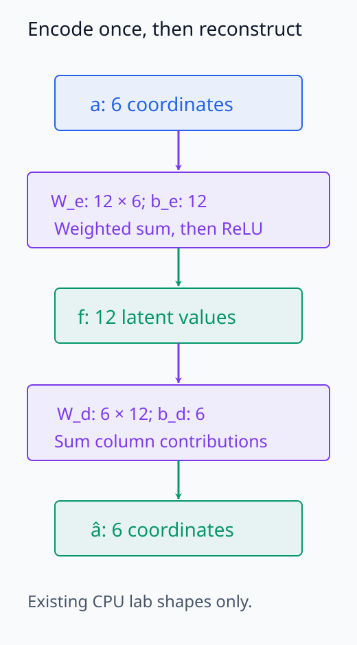
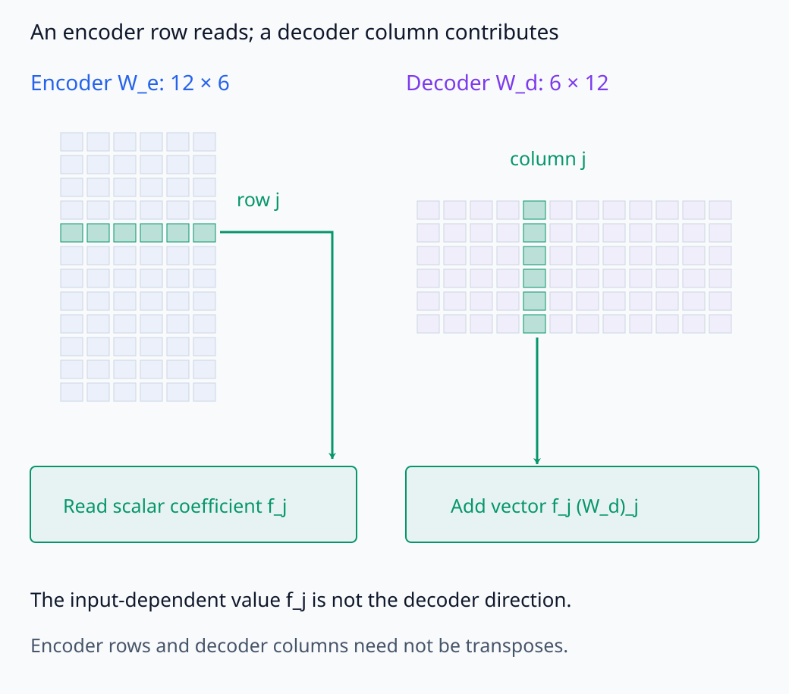
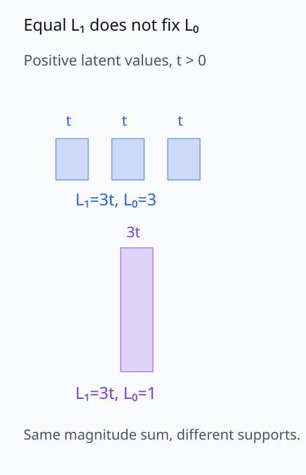
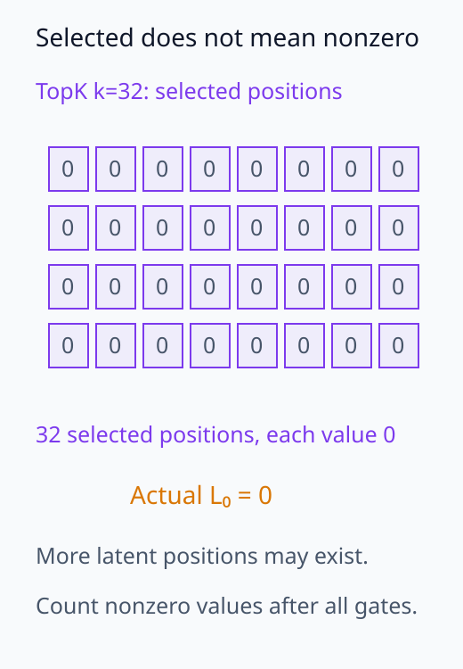
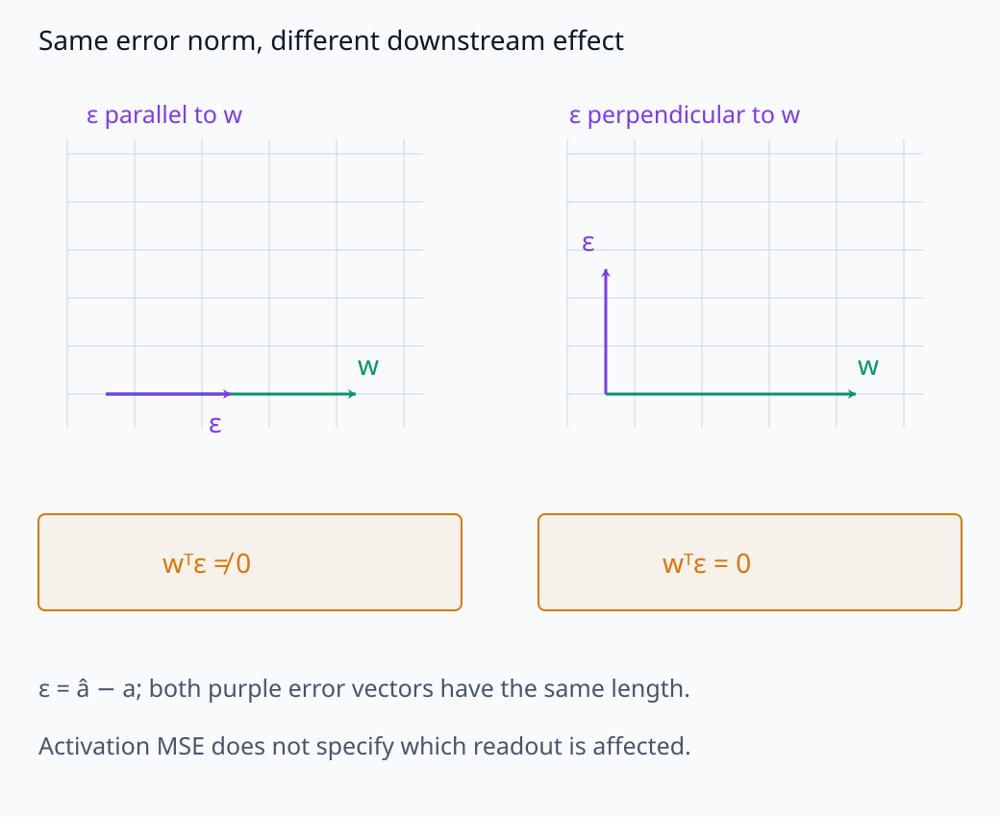
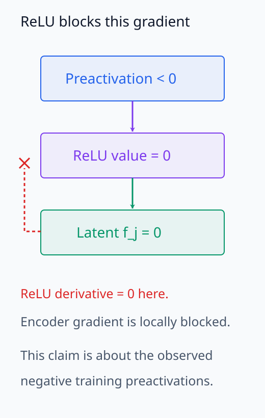
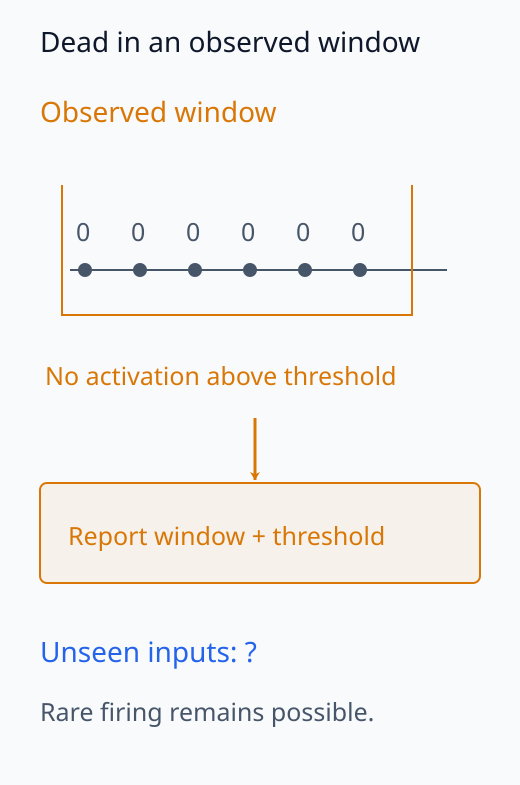

# I06-12. sparse autoencoder

## 이 단원이 필요한 이유

sparse autoencoder는 activation에서 sparse latent를 직접 추론하는 encoder와 원래 activation을 복원하는 decoder를 함께 학습한다. 많은 latent를 사용해 overcomplete dictionary를 만들 수 있지만, reconstruction과 sparsity 사이 tradeoff, dead feature와 해석 안정성을 모두 검사해야 한다.

## 학습 목표

- SAE encoder·decoder의 shape와 목적함수를 설명할 수 있다.
- $L_1$ SAE와 TopK SAE의 sparsity 통제를 구분할 수 있다.
- reconstruction, $L_0$, dead feature와 downstream fidelity를 계산할 수 있다.
- SAE latent를 ground-truth concept로 취급하면 안 되는 이유를 설명할 수 있다.

## 선수지식 확인

- 선수 단원: [I06-11 sparse coding](I06-11-sparse-coding.md), [N05-07 mini-batch gradient descent](../../part-2-neural-computation/N05/N05-07-gradient-descent-mini-batch.md)
- 확인 질문: reconstruction MSE가 낮아도 모든 latent가 사용된다고 보장되는가?

## 기호와 용어

| 기호·용어 | Common spoken reading | 의미 | shape·범위 |
|---|---|---|---|
| $f=\operatorname{ReLU}(W_ea+b_e)$ | `f equals ReLU of W e a plus b e` | activation을 sparse latent로 encode | $\mathbb R^m$ |
| $\hat a=W_df+b_d$ | `a hat equals W d f plus b d` | latent에서 activation을 reconstruct | $\mathbb R^d$ |
| reconstruction loss | `reconstruction loss` | $a$와 $\hat a$의 차이 | nonnegative scalar |
| mean $L_0$ | `mean L zero` | 표본당 활성 latent 수의 평균 | $[0,m]$ |
| dead feature | `dead feature` | 평가 구간에서 한 번도 활성화되지 않은 latent | latent status |
| loss recovered | `loss recovered` | SAE reconstruction이 원 model loss를 얼마나 보존하는지 나타내는 지표 | normalized statistic |

## 1. 구조와 shape

$a\in\mathbb R^d$를 $m$개 latent로 encode한다. 보통 $m>d$인 overcomplete 설정을 쓴다.

\[
f=\operatorname{ReLU}(W_ea+b_e),\qquad
\hat a=W_df+b_d.
\]

$W_e\in\mathbb R^{m\times d}$, $W_d\in\mathbb R^{d\times m}$다. decoder column은 latent 하나가 activation 공간에 더하는 direction으로 볼 수 있다.

encoder의 $j$번째 행은 입력 $a$에서 weighted sum을 읽고, bias와 ReLU를 거쳐 계수 $f_j$를 만든다. decoder는 자신의 $j$번째 열에 이 계수를 곱한 벡터들을 합하고 $b_d$를 더한다. 따라서 latent의 값과 decoder direction은 서로 다르다. 값은 표본마다 바뀌지만, 학습을 마친 decoder의 열은 고정돼 있다. encoder의 행과 decoder의 열이 서로 transpose이거나 직교해야 하는 것은 아니다.

I06-11에서는 새로운 입력마다 반복 계산으로 sparse code를 찾았다. SAE는 여러 입력에서 좋은 code와 reconstruction을 만들도록 encoder·decoder를 학습한 뒤, 새 입력의 code를 encoder의 한 번의 순방향 계산으로 얻는다. 이 code가 매 입력에서 고정 dictionary의 sparse coding 목적함수를 정확히 최소화한다는 보장은 없다.

code의 값, encoder의 행과 decoder의 열이 담당하는 역할을 구분해 보자.

<figure class="lesson-figure" markdown="1">

<figcaption>기존 CPU 실습의 6→12→6 shape다. SAE는 학습 뒤 새 code를 한 번의 encoder 계산으로 얻지만, 매 입력의 sparse coding 최솟값을 정확히 찾는다는 보장은 없다.</figcaption>
</figure>

<figure class="lesson-figure lesson-figure--wide" markdown="1">

<figcaption>같은 latent j도 encoder에서는 한 행의 readout이고 decoder에서는 한 열의 direction이다. f_j는 표본마다 변하지만 학습 뒤 decoder direction은 고정된다. 두 matrix가 서로 transpose인 것은 아니다.</figcaption>
</figure>

## 2. 목적함수

ReLU SAE의 한 기본형은

\[
\mathcal L=\mathbb E\lVert a-\hat a\rVert_2^2+\lambda\mathbb E\lVert f\rVert_1
\]

이다. 첫 항은 activation 공간의 reconstruction 오차를, 두 번째 항은 latent 공간에서 사용한 계수의 크기를 비용으로 부과한다. ReLU 출력은 음수가 아니므로 $\lVert f\rVert_1=\sum_j f_j$다. 이 합은 nonzero의 개수인 $L_0$와 다르다. 여러 작은 값과 하나의 큰 값이 같은 합을 가질 수 있어, $\lambda$를 정하는 것만으로 표본마다 정확히 몇 개가 켜질지 고정할 수는 없다.

TopK SAE는 각 표본에서 값이 가장 큰 $k$개 위치만 남기고 나머지를 0으로 만든다. 선택한 위치가 $k$개여도 남은 값이 모두 nonzero일 때만 $L_0=k$다. 선택된 값이 0이거나 추가 ReLU가 값을 0으로 만들면 실제 nonzero 수는 $k$보다 작다. [Scaling and Evaluating Sparse Autoencoders의 TopK](https://arxiv.org/html/2406.04093v1#S2.SS3)는 선택에 ReLU도 적용한다. 따라서 선택 개수와 실제 nonzero 개수를 구분하고, $L_1$ 비용과 TopK의 $k$를 같은 sparsity 숫자로 비교하지 않는다.

decoder의 열을 크게 만들고 해당 계수를 작게 만들면 reconstruction을 유지하면서 $L_1$ 비용만 낮출 수 있다. I06-11의 dictionary scale 문제와 같으므로 decoder norm을 어떻게 제약하는지도 목적함수와 함께 읽는다. 위 식은 성분의 제곱과 절댓값을 합한 뒤 표본 평균을 취한 형태다. 실습처럼 각 공간의 성분 평균을 사용하면 차원에 따른 계수가 달라지므로, 같은 수치의 $\lambda$가 같은 tradeoff를 뜻하지 않는다.

계수의 합, 선택한 위치 수와 실제 nonzero 수를 같은 숫자로 읽지 않는다.

<figure class="lesson-figure" markdown="1">

<figcaption>t>0일 때 세 작은 coefficient와 한 큰 coefficient가 같은 L₁=3t를 가질 수 있다. L₀는 각각 3과 1이므로 L₁ 비용은 정확한 활성 개수를 고정하지 않는다. 수학적 개념도다.</figcaption>
</figure>

<figure class="lesson-figure" markdown="1">

<figcaption>본문의 예외를 보이는 개념도다. 상위 32개 위치를 선택해도 그 값이 모두 0이면 실제 L₀는 0이다. 그림은 선택된 위치만 보여 주며 전체 latent 개수나 실제 SAE 결과를 새로 정하지 않는다.</figcaption>
</figure>

## 3. 필수 평가 묶음

SAE 하나를 다음 네 숫자만으로 평가할 수는 없지만, 최소 gate로 사용한다.

1. reconstruction MSE 또는 explained variance
2. mean $L_0$와 activation magnitude 분포
3. dead feature 수와 firing frequency
4. reconstructed activation을 model에 넣었을 때 downstream loss 또는 행동 보존

reconstruction MSE는 오차 벡터의 크기를 요약하지만 그 방향을 구분하지 않는다. 뒤의 계산이 $w^Ta$를 읽는다면 reconstruction으로 바꿨을 때의 차이는 $w^T(\hat a-a)$다. 같은 크기의 오차도 $w$에 수직인지 나란한지에 따라 이 값이 달라진다. 그래서 입력 표본과 삽입 위치를 고정해 원 activation과 reconstruction의 downstream 결과를 직접 비교한다. 이는 새 feature의 의미를 평가하는 것과 별도로, SAE로 바꾼 계산이 원 model을 얼마나 보존하는지 확인하는 절차다.

추가로 seed·width·sparsity가 바뀔 때 dictionary와 subspace 안정성을 본다. feature explanation score도 sampling과 evaluator에 의존한다.

오차 크기를 같게 놓아도 downstream에 미치는 영향은 방향에 따라 달라진다.

<figure class="lesson-figure lesson-figure--wide" markdown="1">

<figcaption>같은 norm의 오차 ε=â−a라도 readout w에 나란한지 수직인지에 따라 downstream score 변화 wᵀε가 달라진다. 오차 공간의 개념도이며 activation과 모델 loss의 실제 값을 비교한 결과는 아니다.</figcaption>
</figure>

## 4. dead feature

ReLU latent가 모든 관찰에서 0이면 gradient와 initialization에 따라 다시 살아나기 어렵다. dead threshold는 dataset 크기와 관찰 window를 포함해 정의한다. 희귀하지만 의미 있는 feature를 짧은 sample에서 dead로 잘못 분류할 수 있다.

이 기본형에서 어떤 latent의 ReLU 입력이 모든 학습 표본에서 음수라면, 그 표본들에서는 ReLU의 미분이 0이다. reconstruction loss가 encoder의 해당 행에 보내는 gradient도 이 지점에서 끊긴다. 반면 평가 표본에서 한 번도 켜지지 않았다는 기록은, 모든 가능한 입력에서 ReLU 입력이 음수라는 증명이 아니다. 학습에서의 gradient 문제와 관찰 범위에서의 dead 판정을 구분해야 한다.

학습의 gradient 차단과 평가 window의 dead 판정을 나누어 본다.

<figure class="lesson-figure" markdown="1">

<figcaption>이 학습 표본에서 preactivation이 음수이면 ReLU 미분이 0이라 encoder로 가는 reconstruction gradient가 끊긴다. 모든 가능한 입력에서 feature가 죽었다는 주장은 아니다.</figcaption>
</figure>

<figure class="lesson-figure" markdown="1">

<figcaption>한 관찰 window에서 threshold 위 activation이 없었다는 기록이다. 더 넓은 입력에서 희귀하게 켜질 가능성까지 부정하지 않는다. 이 timeline은 판정 조건의 개념도이며 실제 firing trace가 아니다.</figcaption>
</figure>

## 5. feature 해석과 기능

latent의 top activating context에서 일관된 주제가 보여도 다음을 분리한다.

- **coherence**: 상위 예가 하나의 설명과 맞는가?
- **sensitivity**: 설명에 맞는 새 예에서 실제로 켜지는가?
- **specificity**: hard negative에서 꺼지는가?
- **causal effect**: latent intervention이 행동을 선택적으로 바꾸는가?

reconstruction과 sparsity는 이 질문의 대체물이 아니다.

## CPU 실습

10개 nonnegative sparse source를 6차원으로 섞은 128개 표본에 12-latent ReLU SAE를 50 step 학습한다. MSE, mean $L_0$와 dead feature를 동시에 출력한다.

<!-- I06_EXAMPLE: i06_12_sparse_autoencoder -->

작은 학습에서 dead feature가 생기는 것은 실패를 숨길 항목이 아니라 평가 결과다. step을 무한히 늘려 숫자를 좋게 만드는 대신 정한 자원 상한 안에서 보고한다.

## 흔한 오해

### 오해 1. latent가 sparse하면 monosemantic하다

sparsity는 동시에 켜지는 수를 제한한다. 각 latent가 하나의 인간 개념에 대응한다는 보장은 없다.

### 오해 2. width를 키우면 항상 더 좋은 feature가 나온다

reconstruction은 좋아질 수 있지만 dead feature, 계산비용과 stability가 달라진다. 여러 metric의 frontier를 본다.

### 오해 3. SAE reconstruction을 원 activation과 완전히 같은 것으로 써도 된다

오차가 downstream 계산에 미치는 영향을 측정해야 한다. 작은 MSE가 작은 행동 변화와 항상 같지는 않다.

## 연습문제

### 1. shape

$d=768$, $m=4096$이면 $W_e$와 $W_d$ shape는 무엇인가?

해설 보기
$W_e$는 $4096\times768$, $W_d$는 $768\times4096$이다.

### 2. sparsity

latent 100개 중 표본마다 평균 8개가 threshold 위라면 mean $L_0$와 active fraction은 얼마인가?

해설 보기
mean $L_0$는 8, active fraction은 $8/100=0.08$이다.

### 3. dead threshold

작은 dataset에서 한 번도 켜지지 않은 latent가 영구적으로 dead라고 단정할 수 있는가?

해설 보기
없다. 희귀 feature일 수 있다. 관찰 dataset, token 수와 threshold를 함께 보고 더 넓은 표본에서 재검사한다.

### 4. reconstruction

두 SAE의 MSE가 같고 하나의 mean $L_0$가 절반이다. 무조건 더 좋은가?

해설 보기
더 sparse한 frontier 점이지만 dead feature, downstream fidelity, feature quality와 안정성도 비교해야 한다.

### 5. TopK

TopK에서 $k=32$이면 모든 표본의 정확한 nonzero 수가 항상 32인가?

해설 보기
구현이 정확히 상위 32개를 남기고 tie·mask 예외가 없다면 그렇다. ReLU $L_1$ SAE처럼 penalty로 간접 통제하는 방식과 다르다.

### 6. 주장 범위

top context가 모두 코드와 관련됐다. `coding feature`라고 확정할 수 있는가?

해설 보기
설명 가설은 강해지지만 독립 positive·hard negative, sensitivity·specificity와 개입을 확인해야 한다. 상위 예 coherence만 측정한 상태다.

## 근거와 갱신 경계

SAE의 reconstruction·$L_1$ 구조는 [Towards Monosemanticity](https://transformer-circuits.pub/2023/monosemantic-features/)를, TopK·dead latent와 scaling metric은 [Scaling and Evaluating Sparse Autoencoders](https://arxiv.org/abs/2406.04093)를 참고했다. 2025년 SAEBench는 completeness·isolation 등 여러 metric이 서로 다른 품질을 측정함을 보여준다. 특정 architecture의 우열은 고정 결론으로 쓰지 않는다.

## 단원 요약

- SAE는 sparse encoder와 activation reconstruction decoder를 함께 학습한다.
- reconstruction, sparsity, dead feature와 downstream fidelity를 함께 평가한다.
- ReLU+$L_1$과 TopK는 sparsity 통제 방식이 다르다.
- SAE latent의 의미·안정성·인과 효과는 별도 검사다.

## 통과 기준

- SAE parameter shape와 loss 항을 설명할 수 있는가?
- MSE, mean $L_0$, dead feature와 downstream fidelity를 계산할 수 있는가?
- sparse latent에 허용되는 주장 범위를 쓸 수 있는가?

## 다음 단원

- [I06-13 feature 안정성과 identifiability](I06-13-feature-stability-identifiability.md)

## 집필자 점검표

- [x] reconstruction·sparsity·dead feature·stability를 함께 평가했다.
- [x] 모든 문제에 해설이 있다.
- [x] 모델 해석 주장의 강도를 구분했다.
- [x] 용어집과 표기 규칙을 따랐다.
- [x] Common spoken reading이 실제 영어 학술 발화이며 한글 음역이나 기계적 직역을 포함하지 않는다.
- [x] 선수지식 밖의 내용을 몰래 요구하지 않는다.
- [x] 내부 링크와 수식 렌더링을 확인했다.
