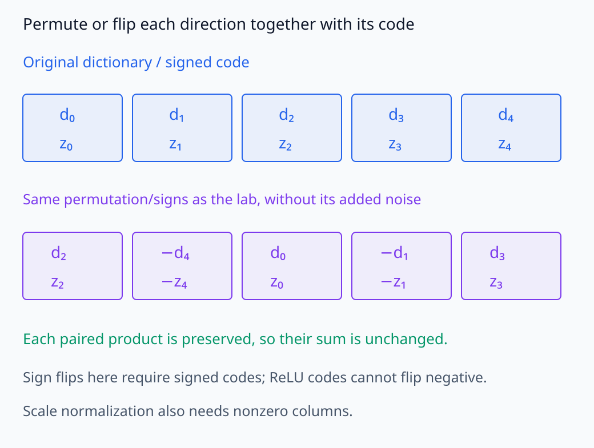
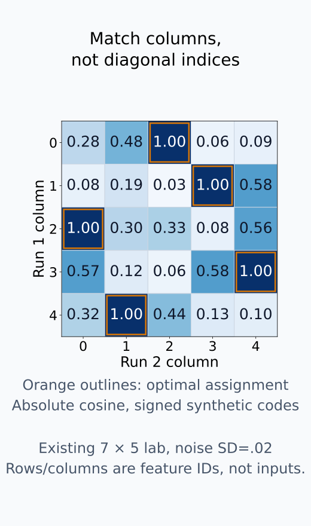
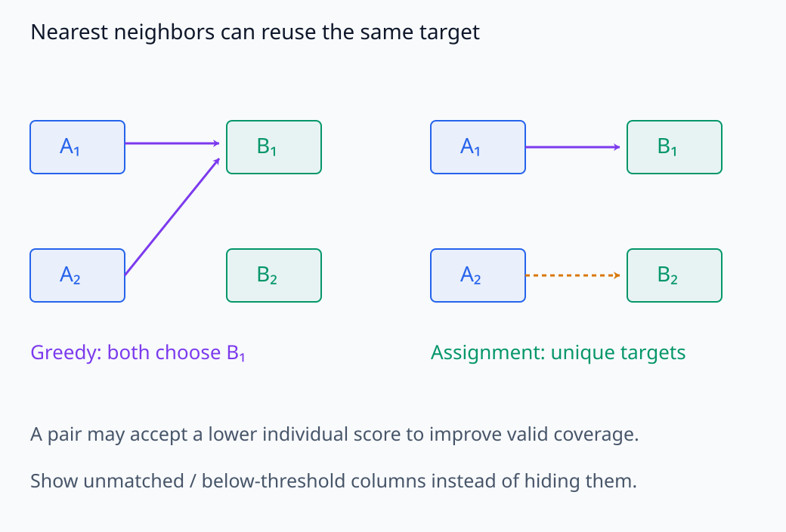
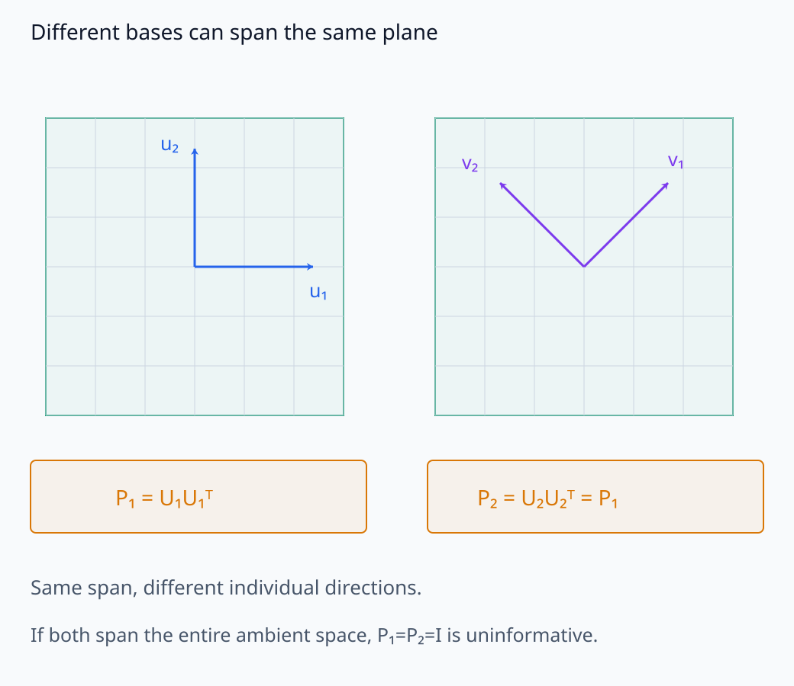
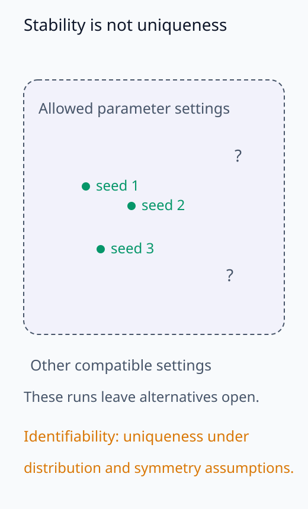

# I06-13. feature 안정성과 identifiability

## 이 단원이 필요한 이유

SAE나 dictionary learning을 다시 학습했을 때 같은 feature가 나오지 않으면 개별 latent에 붙인 설명의 재현성이 약하다. permutation, sign과 scale처럼 예측 가능한 대칭을 정렬한 뒤에도 feature가 달라질 수 있다. 개별 direction이 불안정해도 그들이 span하는 subspace는 안정적일 수 있다.

## 학습 목표

- dictionary 비교 전에 permutation·sign·scale 모호성을 정렬할 수 있다.
- cosine matching과 one-to-one assignment를 구분할 수 있다.
- 개별 feature 안정성과 subspace 안정성을 별도로 평가할 수 있다.
- empirical stability와 mathematical identifiability를 구분할 수 있다.

## 선수지식 확인

- 선수 단원: [I06-12 sparse autoencoder](I06-12-sparse-autoencoder.md), [M03-15 재매개화와 model symmetry](../../part-1-foundations/M03/M03-15-reparameterization-model-symmetries.md)
- 확인 질문: dictionary column 순서만 바뀐 두 SAE를 다른 feature set이라고 해야 하는가?

## 기호와 용어

| 기호·용어 | Common spoken reading | 의미 | shape·범위 |
|---|---|---|---|
| $d_j^{(1)}$ | `feature direction j from run one` | 첫 학습 실행의 decoder direction | $\mathbb R^d$ |
| $M_{jk}$ | `matching score M sub j k` | 두 실행 feature direction의 유사도 | $[0,1]$ for absolute cosine |
| assignment | `one-to-one assignment` | feature를 중복 없이 대응시키는 matching | permutation |
| feature stability | `feature stability` | 독립 학습에서 비슷한 feature가 다시 나타나는 정도 | empirical property |
| subspace stability | `subspace stability` | feature 묶음의 span이 유지되는 정도 | empirical property |
| identifiability | `identifiability` | 관찰 분포와 가정에서 parameter를 유일하게 정할 수 있는 성질 | theoretical property |

## 1. 대칭을 먼저 제거한다

dictionary column 순서는 loss에 영향을 주지 않는다. encoder·decoder scale을 반대로 바꾸어 같은 reconstruction을 만들 수도 있다. signed feature에서는 부호도 함께 바꿀 수 있다. 따라서 raw column index 비교는 안정성 검사가 아니다.

이 대칭에서는 decoder column뿐 아니라 그 column에 곱하는 code도 함께 바꾼다. column 순서를 바꿨으면 code의 순서도 같게 바꾸고, column을 양수 배율로 늘렸으면 code를 그 배율로 나눈다. 각 column과 code의 곱이 같아서 합인 reconstruction도 유지된다. 다만 $L_1$ 비용이나 decoder norm 제약까지 항상 유지되는 것은 아니다. 같은 reconstruction 함수와 같은 학습 목적함수의 대칭을 구분한다.

normalized direction에 대해

\[
M_{jk}=\left|\frac{(d_j^{(1)})^Td_k^{(2)}}{\lVert d_j^{(1)}\rVert\lVert d_k^{(2)}\rVert}\right|
\]

를 계산하고 one-to-one assignment의 총 score를 최대화한다. absolute value를 쓸지는 activation의 부호 의미에 따라 정한다.

분모로 두 norm을 나누면 양수 scale의 차이가 사라지고 방향만 비교된다. norm이 0인 column에는 cosine이 정의되지 않으므로 별도로 분류한다. signed code에서는 column과 code의 부호를 함께 뒤집어 같은 곱을 만들 수 있다. 그러나 ReLU code는 음수가 될 수 없으므로 반대 방향을 같은 feature로 취급할 근거가 없다. 이 경우에는 signed cosine을 유지하고, 높은 direction score와 함께 같은 입력에서의 activation pattern도 확인한다.

direction과 code를 함께 바꾼 대칭을 확인한 뒤 column 대응을 찾는다.

<figure class="lesson-figure lesson-figure--wide" markdown="1">

<figcaption>기존 lab의 permutation·sign 순서에서 noise를 빼고 대칭 자체를 그렸다. direction과 code를 함께 바꾸면 contribution 합은 유지된다. signed code의 부호 대칭을 ReLU code에 그대로 적용하지 않는다.</figcaption>
</figure>

<figure class="lesson-figure" markdown="1">

<figcaption>기존 7×5 signed fixture의 absolute cosine을 소수 둘째 자리까지 반올림했다. 주황 outline은 총 score가 최대인 one-to-one assignment이며 raw diagonal과 다르다. 이 합성 변환의 복원은 실제 SAE feature 안정성이나 theoretical identifiability의 증명이 아니다.</figcaption>
</figure>

## 2. greedy matching과 assignment

각 feature가 가장 가까운 상대를 독립적으로 고르면 여러 feature가 같은 column에 몰릴 수 있다. dictionary 전체 대응을 원하면 Hungarian algorithm 같은 one-to-one assignment가 필요하다. unmatched feature 비율도 결과다.

독립적인 최근접 선택은 각 행의 최댓값을 따로 고른다. one-to-one assignment는 같은 target column을 두 번 쓰지 않는 조건 아래 전체 score의 합을 최대화한다. 따라서 어떤 feature는 자신의 최고 score가 아닌 상대와 연결될 수 있다. 두 dictionary의 크기가 같아도, 형식상 모든 column을 대응시켰다는 사실만으로 좋은 match라고 할 수는 없다. 미리 정한 threshold를 통과한 대응만 유효 match로 세고, 크기가 다른 경우에는 대응되지 않은 column도 보고한다.

matching threshold는 결과를 본 뒤 정하지 않는다. null dictionary나 random direction에서 나오는 cosine 분포를 기준으로 false match를 확인할 수 있다.

null에서도 실제 비교와 같은 column 수·차원·matching 절차를 사용한다. 임의의 한 pair의 cosine 분포만 기준으로 삼으면, 많은 후보 중 가장 좋은 값을 골랐다는 효과가 빠진다.

개별 최댓값 선택과 중복 없는 전체 대응은 다른 제약이다.

<figure class="lesson-figure lesson-figure--wide" markdown="1">

<figcaption>왼쪽은 두 source가 같은 target을 독립적으로 고르는 실패 가능성이다. 오른쪽은 target을 중복 사용하지 않는 제약을 보여 준다. 실제 score나 최적 assignment를 임의로 정한 결과는 아니며 threshold와 coverage를 함께 보고한다.</figcaption>
</figure>

## 3. feature와 subspace 안정성

두 실행에서 개별 direction이 다르지만 그 묶음들이 같은 저차원 span을 만들 수 있다. 이때 principal angle이나 projection matrix 거리로 subspace 안정성을 본다. 개별 feature가 identifiable하다는 주장은 못 하지만 같은 subspace가 재현된다는 증거는 남는다.

column들이 만드는 subspace의 orthonormal basis를 $U$라 하면 projection matrix는 $P=UU^T$다. 이 matrix는 입력 vector를 그 subspace로 투영하며, basis를 같은 subspace 안에서 직교 회전해도 바뀌지 않는다. 따라서 두 실행의 $P$가 비슷한지는 개별 basis direction이 일치하는지와 다른 질문이다. principal angle도 두 subspace 사이의 방향 차이를 측정한다. 어느 feature 묶음을 비교하는지 먼저 고정해야 한다. 두 dictionary 전체가 모두 입력 공간을 span하면 둘의 $P$가 identity여서, 개별 feature가 달라도 이 검사는 차이를 찾지 못한다.

I06-08의 CKA는 같은 표본에서 얻은 activation 배열의 Gram 구조를 비교하는 데 사용할 수 있다. 하지만 column마다 서로 다른 scale을 주는 변환에 일반적으로 불변인 것은 아니므로 순수한 subspace 지표는 아니다. CKA로 표현 유사성을 보는 것과 decoder span 자체를 비교하는 것을 구분한다.

같은 평면 안에서 basis만 달라질 수 있으므로 direction과 projection을 따로 비교한다.

<figure class="lesson-figure lesson-figure--wide" markdown="1">

<figcaption>두 basis가 같은 평면을 span하면 개별 direction이 달라도 projection matrix는 같다. 전체 ambient space를 모두 span한 경우 P=I이므로 이 검사는 feature 차이를 구별하지 못한다. 기저의 회전 관계를 보이는 개념도다.</figcaption>
</figure>

## 4. identifiability는 더 강한 말이다

여러 seed에서 비슷한 feature가 나온 empirical stability는 유용하지만, 가능한 모든 solution 중 유일하다는 증명은 아니다. mathematical identifiability는 가정한 관찰 분포를 똑같이 만드는 다른 parameter가 허용된 대칭 이외에도 존재하는지를 묻는다. 대칭을 제외하고 유일하다고 할 때도 어떤 대칭까지 제외하는지 명시해야 한다.

dictionary learning에서는 데이터 생성 가정, dictionary incoherence와 sparsity 같은 조건 아래 유일성을 다룬다. 정확한 조건은 정리마다 다르며, 이 항목들을 나열한 것만으로 식별성이 증명되지는 않는다. 충분한 유한 표본으로 그 dictionary를 실제 복원할 수 있는지는 별도의 추정 문제다. 모집단 분포에서 유일하게 정해지는 것과 지금 관측한 표본에서 정확히 찾아낸 것은 같은 말이 아니다.

반대로 이론적으로 identifiable한 설정도 finite sample, optimization failure와 local minimum 때문에 실험에서 불안정할 수 있다.

반복해서 얻은 해와 모든 동등 해를 배제한 유일성을 구분한다.

<figure class="lesson-figure" markdown="1">

<figcaption>세 seed가 비슷한 결과를 내도 가능한 다른 설정을 모두 배제한 것은 아니다. 물음표는 아직 배제하지 못한 대안의 가능성이지 다른 solution이 실제로 존재한다는 측정 결과가 아니다. identifiability는 분포 가정과 허용 대칭 아래의 유일성을 묻는다.</figcaption>
</figure>

## CPU 실습

첫 dictionary를 permutation·sign change하고 작은 noise를 더해 둘째 dictionary를 만든다. raw diagonal cosine과 optimal one-to-one matching 뒤 cosine을 비교한다.

<!-- I06_EXAMPLE: i06_13_feature_stability -->

높은 matched score는 이 합성 변환을 복원했다는 뜻이다. 실제 SAE에서는 unmatched, split·merge와 subspace-only correspondence를 함께 보고한다.

## 흔한 오해

### 오해 1. index가 같아야 같은 feature다

latent permutation은 기본 대칭이다. direction과 activation pattern을 정렬해야 한다.

### 오해 2. cosine이 높은 pair가 많으면 전체 dictionary가 안정적이다

여러 source feature가 한 target에 몰릴 수 있다. one-to-one coverage와 unmatched 비율을 본다.

### 오해 3. seed 두 개가 일치하면 identifiable하다

그 두 최적화 실행의 안정성 증거다. 유일성에 관한 수학적 결론은 아니다.

## 연습문제

### 1. permutation

두 dictionary가 column 순서만 다르면 reconstruction model은 달라졌는가?

해설 보기
encoder latent와 decoder column을 같은 permutation으로 바꾸면 함수는 같다. raw index 차이는 feature 차이가 아니다.

### 2. absolute cosine

왜 absolute cosine을 쓸 수 있으며 언제 부적절할 수 있는가?

해설 보기
부호를 함께 뒤집어도 같은 signed direction으로 볼 때 사용한다. ReLU nonnegative feature처럼 부호가 기능적으로 비대칭이면 절댓값이 다른 feature를 합칠 수 있다.

### 3. many-to-one

greedy nearest neighbor가 안정성을 과대평가하는 경우를 설명하라.

해설 보기
첫 dictionary의 여러 feature가 둘째 dictionary의 같은 feature를 가장 가깝다고 고르면 높은 pair score가 반복된다. one-to-one assignment와 coverage가 이를 막는다.

### 4. subspace

개별 match는 낮지만 projection matrix가 비슷하다. 어떤 주장이 가능한가?

해설 보기
개별 basis direction은 불안정하지만 그 feature 묶음이 span하는 subspace는 재현될 수 있다는 주장이다.

### 5. null match

matching threshold를 random dictionary와 비교하는 이유는 무엇인가?

해설 보기
고차원·많은 후보에서는 우연히 높은 최대 cosine이 생긴다. null 분포가 false match의 기준을 준다.

### 6. identifiability

세 seed에서 같은 feature가 나왔다. `유일하게 식별됐다`고 써도 되는가?

해설 보기
경험적 재현성은 높아졌지만 모든 동등 solution을 배제한 것은 아니다. 가정 아래 identifiability 증명과 구분한다.

## 근거와 갱신 경계

SAE dictionary의 seed 불안정성은 [Archetypal SAE](https://openreview.net/forum?id=9v1eW8HgMU)와 2026년 preprint [Unstable Features, Reproducible Subspaces](https://arxiv.org/abs/2606.12138)를 확인했다. 후자는 최신 preprint이므로 개별 결론을 확정된 일반 법칙으로 사용하지 않고 feature·subspace 안정성을 분리해야 할 근거로만 쓴다.

## 단원 요약

- dictionary 비교 전에 permutation·sign·scale 대칭을 처리한다.
- one-to-one assignment, coverage와 null match를 함께 본다.
- 개별 feature와 subspace의 안정성은 다를 수 있다.
- empirical stability는 mathematical identifiability보다 약한 주장이다.

## 통과 기준

- 두 dictionary를 symmetry-aware matching으로 비교할 수 있는가?
- feature와 subspace 안정성을 구분할 수 있는가?
- stability 결과를 identifiability로 과장하지 않을 수 있는가?

## 다음 단원

- [I06-14 표현 주장 작성](I06-14-writing-representation-claims.md)

## 집필자 점검표

- [x] feature·subspace 안정성과 identifiability를 분리했다.
- [x] 모든 문제에 해설이 있다.
- [x] 모델 해석 주장의 강도를 구분했다.
- [x] 용어집과 표기 규칙을 따랐다.
- [x] Common spoken reading이 실제 영어 학술 발화이며 한글 음역이나 기계적 직역을 포함하지 않는다.
- [x] 선수지식 밖의 내용을 몰래 요구하지 않는다.
- [x] 내부 링크와 수식 렌더링을 확인했다.
