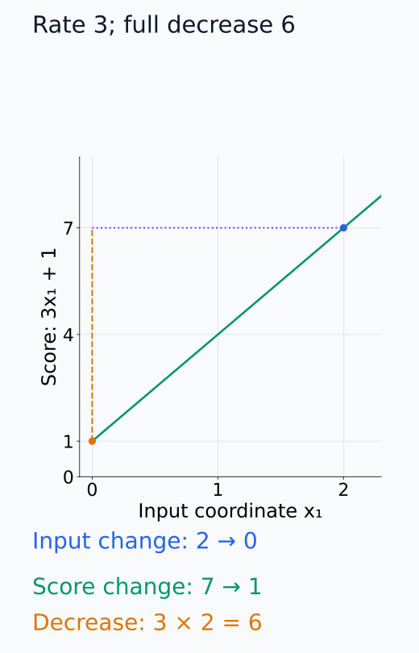
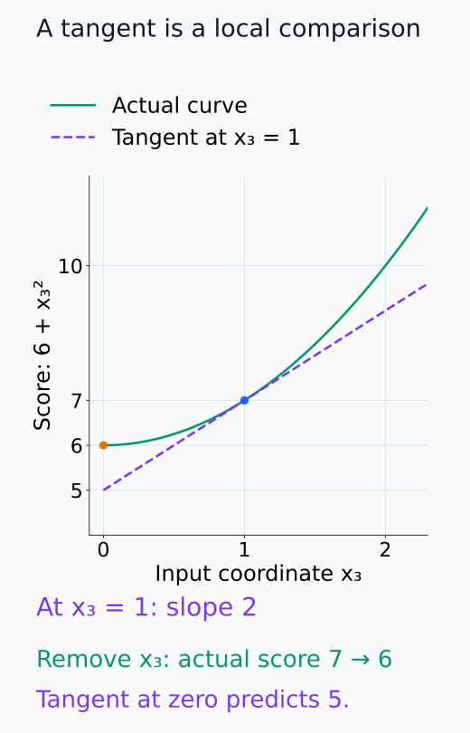
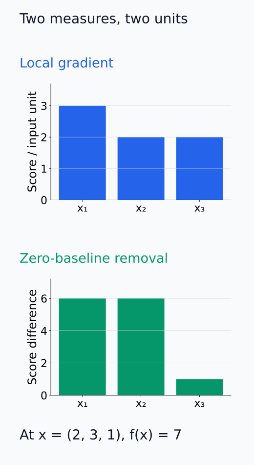
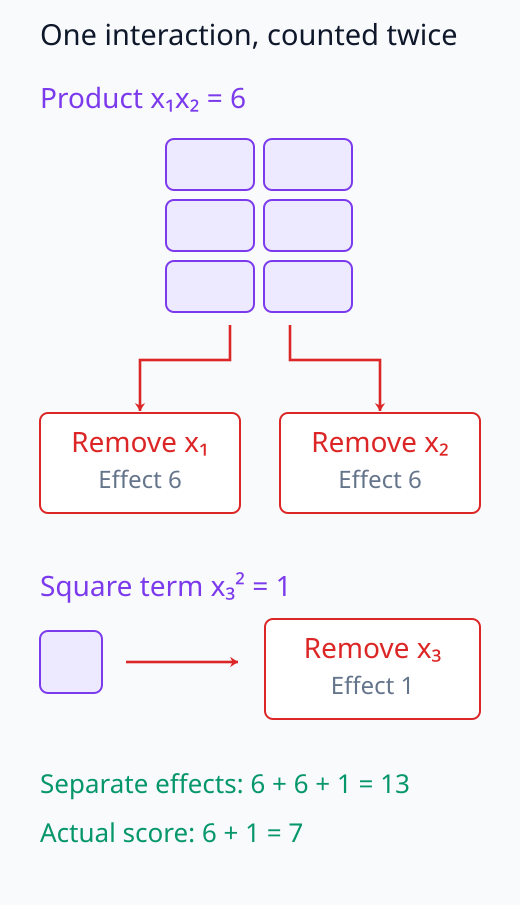
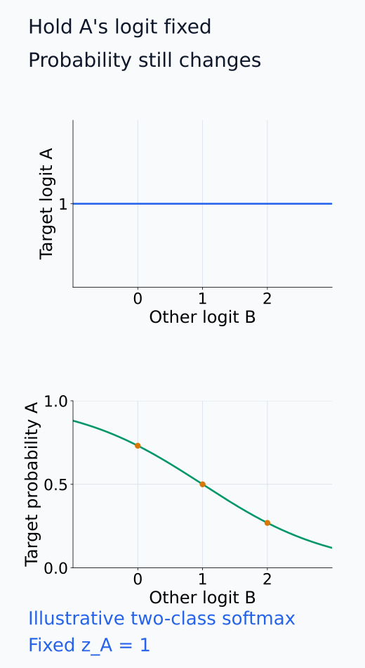

# I07-01. 민감도와 귀인

## 이 단원이 필요한 이유

모델 출력이 입력이나 내부 상태에 따라 달라진다는 사실과 그 출력을 특정 요소에 설명 몫으로 배분하는 일은 다르다. 미분은 한 점의 작은 변화에 대한 민감도를 주고, 귀인(attribution)은 기준점·대상 출력·배분 규칙을 추가로 정해야 한다. 이 구분이 없으면 gradient 크기를 곧바로 원인이나 기여도로 부르게 된다.

## 학습 목표

- 국소 민감도와 귀인 문제를 서로 다른 질문으로 쓸 수 있다.
- 출력 scalar, 분석 위치와 기준점을 명시할 수 있다.
- 작은 함수의 gradient와 feature 제거 효과를 계산해 비교할 수 있다.
- 귀인 결과가 허용하는 주장 범위를 제한할 수 있다.

## 선수지식 확인

- 선수 단원: [I06-15 종합 실습: 표현 보고서](../I06/I06-15-capstone-representation-report.md), [M03-11 Jacobian](../../part-1-foundations/M03/M03-11-jacobian.md)
- 확인 질문: $f:\mathbb R^d\to\mathbb R$의 gradient는 어느 점에서 정의되며 어떤 shape을 가지는가?

## 기호와 용어

| 기호·용어 | Common spoken reading | 의미 | shape·범위 |
|---|---|---|---|
| $s=f(x)$ | `s equals f of x` | 설명하려는 scalar score | $s\in\mathbb R$ |
| $S_i(x)=\frac{\partial f}{\partial x_i}(x)$ | `S sub i of x equals partial f over partial x sub i at x` | $x_i$ 방향의 국소 민감도 | scalar |
| $\phi_i(x;x')$ | `phi sub i of x relative to x prime` | 기준점 $x'$에 대한 $i$번째 귀인값 | scalar |
| target | `target` | 설명할 logit·확률·loss 등 | scalar function |
| baseline | `baseline` | 비교 기준 입력이나 상태 | $x'\in\mathbb R^d$ |

## 1. 질문부터 고정한다

민감도는 현재 점 $x$에서 $x_i$를 아주 조금 바꿀 때 score가 얼마나 변하는지 묻는다.

$$
f(x+\varepsilon e_i)
=
f(x)+\varepsilon S_i(x)+o(\varepsilon)
$$

$e_i$는 $i$번째 성분만 1이고 나머지는 0인 basis vector다. 따라서 $x+\varepsilon e_i$에서는 다른 좌표를 고정하고 $x_i$만 $\varepsilon$만큼 늘린다. $S_i(x)$는 단위 변화당 score의 변화율이고, 실제 작은 변화량은 $\varepsilon S_i(x)$로 근사한다. 나머지 항 $o(\varepsilon)$은 $\varepsilon$로 나눈 값이 0에 가까워지는 오차를 뜻한다. 이 식은 현재 점에서 미분 가능할 때의 국소 근사이므로, 큰 이동까지 같은 변화율을 적용하는 식은 아니다.

귀인은 보통 $f(x)$ 또는 $f(x)-f(x')$를 feature별 값으로 배분하려 한다. 어떤 배분이 옳은지는 함수만으로 정해지지 않는다. baseline, feature 단위와 상호작용 처리 규칙이 필요하다.

## 2. 같은 함수, 다른 답

$$
f(x_1,x_2,x_3)=x_1x_2+x_3^2
$$

$x=(2,3,1)$에서 gradient는 $(3,2,2)$이다. 반면 각 좌표를 0으로 바꿀 때의 score 감소는 $(6,6,1)$이다. gradient는 무한소 변화율이고 제거 효과는 0이라는 먼 기준점까지 이동한 유한 차이이므로 값이 같을 이유가 없다.

첫 두 편미분은 각각 $x_2$, $x_1$이고 세 번째는 $2x_3$이므로 이 점에서 $(3,2,2)$를 얻는다. 원래 score는 $2\cdot3+1^2=7$이다. 첫째 또는 둘째 좌표를 0으로 바꾸면 곱 항 전체가 사라져 score는 1이고 감소량은 6이다. 셋째 좌표를 0으로 바꾸면 score는 6이어서 감소량은 1이다.

세 제거 효과의 합은 13이지만 모든 좌표를 함께 0으로 바꿀 때의 감소량은 7이다. $x_1x_2$라는 상호작용 항을 첫째·둘째 좌표의 개별 제거에서 각각 세었기 때문이다. 각 좌표를 없앴을 때의 효과를 나열하는 것과, 총 score 차이를 중복 없이 배분하는 귀인 규칙을 정하는 것은 구분해야 한다.

아래 직선 단면에서는 변화율과 유한 score 감소를 다른 눈금으로 읽는다.

<figure class="lesson-figure" markdown="1">

<figcaption>x₂ = 3, x₃ = 1을 고정한 단면이다. 현재 x₁ = 2에서 기울기는 3이지만, 0까지 가는 이동량은 −2이므로 실제 score 감소는 6이다. 변화율과 전체 변화량의 단위도 다르다.</figcaption>
</figure>

제곱 항의 아래 곡선에서는 현재 접선을 먼 기준점까지 적용한 오차를 본다.

<figure class="lesson-figure" markdown="1">

<figcaption>x₁ = 2, x₂ = 3을 고정했다. x₃ = 1의 local gradient는 2이지만 0까지 제거하면 score 감소는 1이다. 접선을 0까지 연장하면 5를 예측해 실제 곡선의 score 6과 차이가 난다.</figcaption>
</figure>

세 좌표를 비교한 아래 두 패널은 변화율과 score 차이의 단위를 분리한다.

<figure class="lesson-figure" markdown="1">

<figcaption>위는 현재 점의 단위 입력 변화당 민감도, 아래는 각 좌표를 0으로 바꾼 score 차이다. gradient에서는 x₁이 x₂보다 크고, 제거 효과에서는 둘이 같은 6이다. 서로 다른 단위를 한 점수처럼 섞지 않는다.</figcaption>
</figure>

아래 분기 그림에서는 두 제거가 같은 상호작용 항을 각각 세는 지점을 확인한다.

<figure class="lesson-figure" markdown="1">

<figcaption>곱 항 6의 같은 여섯 셀에서 두 제거 경로가 출발한다. x₁ 또는 x₂를 0으로 바꾸면 각각 이 전체 곱 항이 사라져 둘 다 감소량 6을 센다. 실제 원래 score는 곱 항 6과 제곱 항 1의 합 7이다.</figcaption>
</figure>

## 3. 분석 계약

귀인 결과에는 최소한 다음을 함께 기록한다.

- 설명할 scalar: 특정 token logit, 두 token의 logit 차이, loss 등
- feature 단위: 입력 좌표, token, neuron, head 또는 subspace
- 평가점과 baseline
- 부호를 유지할지 절댓값을 볼지
- 데이터와 반복 단위
- 귀인인지 실제 개입 효과인지

softmax 확률은 다른 logit에도 의존한다. 특정 logit의 민감도와 그 token 확률의 민감도는 같은 질문이 아니다.

아래 두 target 곡선에서는 같은 class의 logit과 probability가 다른 질문임을 비교한다.

<figure class="lesson-figure" markdown="1">

<figcaption>두 class의 설명용 계산으로 z_A = 1을 고정하고 z_B만 바꿨다. 위 target logit은 변하지 않지만 아래 target probability는 분모 때문에 변한다. 같은 class를 골라도 어느 scalar를 측정하는지에 따라 질문이 달라진다.</figcaption>
</figure>

## 4. CPU 실습

<!-- I07_EXAMPLE: i07_01_sensitivity_attribution -->

코드는 중심차분 gradient와 zero-baseline 제거 효과를 같은 함수에서 계산한다. 두 결과의 차이는 구현 오류가 아니라 질문의 차이이다.

## 흔한 오해

### 오해 1. gradient가 크면 그 feature가 출력을 만들었다

gradient는 현재 점의 국소 변화율이다. 입력이 실제로 그 경로를 사용했는지, 제거했을 때 행동이 유지되는지까지 말하지 않는다.

### 오해 2. 귀인값은 모델에 내장된 객관적 분해다

baseline과 feature grouping을 바꾸면 값도 바뀔 수 있다. 귀인은 분석 규칙을 포함한 결과다.

## 연습문제

### 1. 질문 분류

“$x_i$를 $0.01$ 늘릴 때 logit이 얼마나 변하는가?”는 민감도인가 귀인인가?

해설 보기

현재 점의 작은 변화에 대한 질문이므로 민감도이다. feature별 설명 몫을 배분하려면 baseline과 배분 규칙이 더 필요하다.

### 2. gradient 계산

$f(x_1,x_2)=x_1x_2$에서 $x=(2,4)$의 gradient를 구하라.

해설 보기

$\partial f/\partial x_1=x_2$, $\partial f/\partial x_2=x_1$이므로 gradient는 $(4,2)$이다.

### 3. 제거 효과

같은 함수에서 각 좌표를 0으로 바꿀 때 score 감소를 구하라.

해설 보기

원래 score는 8이다. 어느 좌표를 0으로 바꿔도 score는 0이므로 두 제거 효과는 모두 8이다. gradient $(4,2)$와 다르다.

### 4. target 선택

분류 모델에서 class A의 logit과 class A 확률을 설명하는 일이 왜 다른가?

해설 보기

확률은 softmax 분모를 통해 모든 class logit에 의존한다. A logit이 같아도 다른 logit이 바뀌면 A 확률은 달라진다.

### 5. 주장 비판

“saliency가 큰 token이 답변의 원인이다”라는 문장을 비판하라.

해설 보기

saliency는 지정 score의 국소 gradient 크기일 수 있다. 인과 주장을 하려면 token 또는 내부 상태의 개입, 대조군과 행동 변화가 필요하다.

### 6. 분석 계약

다음-token 예측 하나를 귀인하려 할 때 반드시 고정할 항목 세 가지를 적어라.

해설 보기

예를 들어 target-minus-foil logit, token 또는 embedding 좌표라는 feature 단위, baseline 입력을 고정한다. 데이터와 부호 처리도 함께 기록하면 재현성이 높아진다.

## 근거와 갱신 경계

입력 gradient를 시각화한 초기 연구는 [Simonyan et al. (2013)](https://arxiv.org/abs/1312.6034), baseline을 포함한 공리적 귀인은 [Sundararajan et al. (2017)](https://proceedings.mlr.press/v70/sundararajan17a.html)을 기준으로 한다. 특정 귀인법을 인과 설명으로 승격하지 않는다.

## 단원 요약

- 민감도는 한 점의 국소 변화율이고 귀인은 명시한 규칙 아래의 설명 배분이다.
- target, feature 단위와 baseline이 바뀌면 질문이 바뀐다.
- gradient와 유한 제거 효과는 일반적으로 일치하지 않는다.
- 귀인값만으로 기능적 사용이나 인과를 주장하지 않는다.

## 통과 기준

- 민감도와 귀인을 한 문장씩 구분할 수 있는가?
- 작은 함수의 gradient와 제거 효과를 따로 계산할 수 있는가?
- 귀인 분석 계약을 작성할 수 있는가?

## 다음 단원

- [I07-02 gradient 기반 귀인](I07-02-gradient-attribution.md)

## 집필자 점검표

- [x] 학습 목표가 관찰 가능한 행동으로 작성됐다.
- [x] 민감도와 귀인의 질문을 구분했다.
- [x] target·baseline·feature 단위를 명시했다.
- [x] 모든 문제에 해설이 있다.
- [x] 모델 해석 주장의 강도를 구분했다.
- [x] 용어집과 표기 규칙을 따랐다.
- [x] Common spoken reading이 실제 영어 학술 발화이며 한글 음역이나 기계적 직역을 포함하지 않는다.
- [x] 선수지식 밖의 내용을 몰래 요구하지 않는다.
- [x] 내부 링크와 수식 렌더링을 확인했다.
