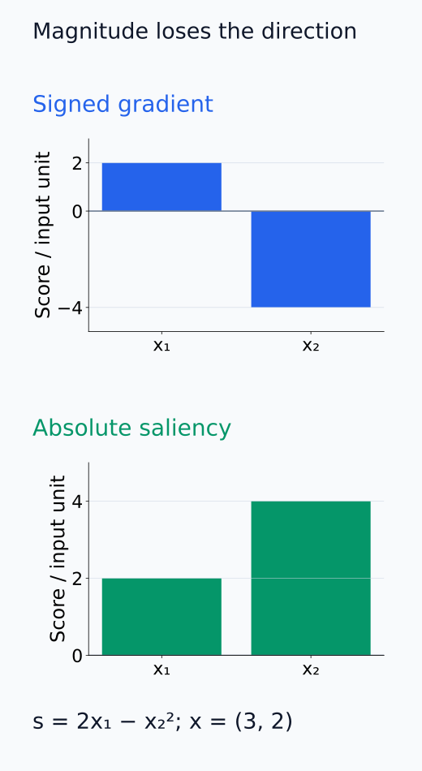
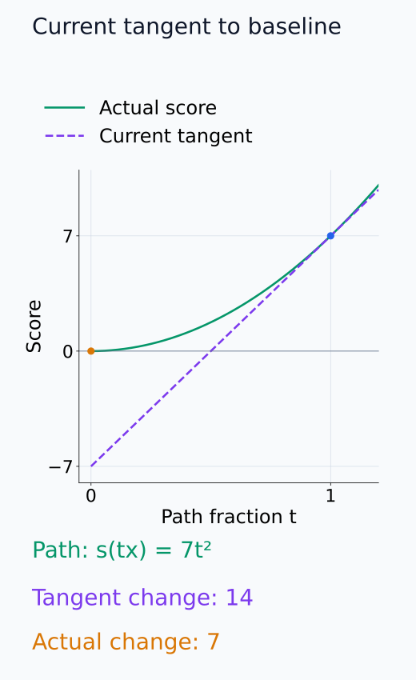
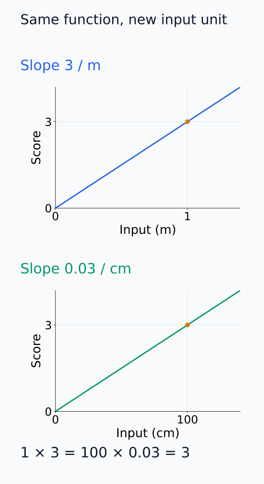
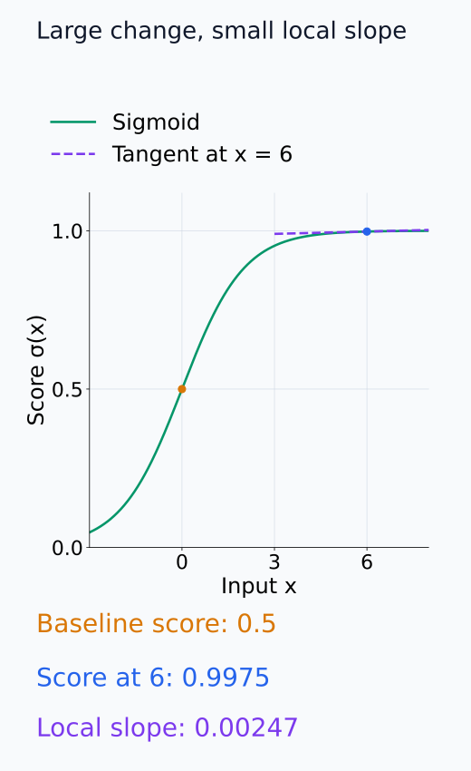

# I07-02. gradient 기반 귀인

## 이 단원이 필요한 이유

gradient는 역전파 한 번으로 많은 입력 좌표의 민감도를 동시에 계산한다. 하지만 raw gradient, saliency와 gradient×input은 서로 다른 값을 보고하며 saturation, 입력 단위와 부호 처리에 영향을 받는다. 계산이 빠르다는 사실과 설명이 타당하다는 주장을 분리해야 한다.

## 학습 목표

- raw gradient, saliency와 gradient×input을 계산할 수 있다.
- 부호와 절댓값이 답하는 질문을 구분할 수 있다.
- saturation과 입력 scale이 gradient 해석에 미치는 영향을 설명할 수 있다.
- autograd 결과를 작은 손계산으로 검산할 수 있다.

## 선수지식 확인

- 선수 단원: [I07-01 민감도와 귀인](I07-01-sensitivity-attribution.md), [N05-26 activation gradient와 intervention](../../part-2-neural-computation/N05/N05-26-gradient-collection-intervention-preparation.md)
- 확인 질문: scalar score를 선택해야 `backward()` 뒤 입력과 같은 shape의 gradient를 얻는 이유는 무엇인가?

## 기호와 용어

| 기호·용어 | Common spoken reading | 의미 | shape·범위 |
|---|---|---|---|
| $g_i=\frac{\partial s}{\partial x_i}$ | `g sub i equals partial s over partial x sub i` | signed local sensitivity | scalar |
| $\lvert g_i\rvert$ | `the absolute value of g sub i` | saliency magnitude | nonnegative scalar |
| $x_i g_i$ | `x sub i times g sub i` | zero-baseline gradient×input | scalar |
| $\nabla_x s$ | `the gradient of s with respect to x` | 모든 좌표의 gradient | $\mathbb R^d$ |
| saturation | `saturation` | 출력 변화에 비해 국소 gradient가 작은 영역 | local property |

## 1. 세 가지 출력

raw gradient는 증가 방향과 감소 방향을 부호로 보존한다. saliency는 $|g_i|$로 방향을 버리고 크기만 본다. gradient×input은 zero baseline에서 현재 입력까지의 변위를 곱한 일차 Taylor 항이다.

$$
s(x)-s(0)\approx \nabla_x s(x)^\top x=\sum_i x_i g_i
$$

여기서는 gradient를 baseline 0이 아니라 현재 점 $x$에서 계산한다. $x$에서 0으로 이동하는 변위가 $-x$이므로 일차 근사는 $s(0)\approx s(x)-\nabla_xs(x)^\top x$이고, 이를 옮기면 위 식을 얻는다. 각 $x_i g_i$는 이 선형근사 안에서 좌표별 항을 나눈 값이다. 0이 현재 점에서 멀면 두 점 사이의 gradient 변화까지 이 한 번의 평가로 나타낼 수는 없다. affine 함수에서는 gradient가 일정하고 bias가 차이에서 소거되므로 이 합이 정확한 score 차이가 된다.

비선형 함수에서는 근사일 뿐이다. 항의 합이 실제 score 차이와 같지 않아도 autograd가 틀린 것은 아니다.

다음 두 패널은 signed gradient에서 saliency로 바꿀 때 없어진 정보를 보여 준다.

<figure class="lesson-figure" markdown="1">

<figcaption>연습문제의 s = 2x₁ − x₂², x = (3, 2)를 사용했다. 위에서는 x₂의 증가가 score를 낮추는 음의 방향이 남아 있고, 아래에서는 그 부호가 사라진다.</figcaption>

</figure>

## 2. 손계산

$s=x_1x_2+x_3^2$, $x=(2,3,1)$이면

$$
\nabla_x s=(3,2,2),\qquad x\odot\nabla_xs=(6,6,2).
$$

gradient×input 합은 14이고 $s(x)-s(0)=7$이다. 곱과 제곱의 중복 계수 때문에 completeness가 성립하지 않는다.

일반적인 입력에서도 이 합은 $x_1x_2+x_2x_1+2x_3^2=2s(x)$다. 첫 곱 항은 두 좌표의 미분에 각각 나타나고, 제곱 항은 미분의 계수 2를 갖는다. 현재 점의 변화율에 입력을 곱하는 규칙이 이 계수들을 없애 주지는 않는다. completeness는 귀인값의 합이 기준점 대비 score 차이와 같다는 조건이므로, 여기서는 정확한 gradient를 계산했어도 그 조건을 만족하지 않는다.

다음 경로 그림에서 현재 점의 접선을 baseline까지 연장한 값과 실제 score 곡선을 비교할 수 있다.

<figure class="lesson-figure" markdown="1">

<figcaption>현재 입력을 t배 하는 경로에서는 s(tx) = 7t²다. t = 1의 접선 기울기 14가 gradient×input의 합이고, 접선을 t = 0까지 연장하면 −7을 예측한다. 실제 baseline score는 0이어서 두 점 사이의 차이는 7이다.</figcaption>

</figure>

## 3. scale과 saturation

단위를 $x_i'=c x_i$로 바꾸면 raw gradient는 chain rule에 따라 $1/c$ 배 변할 수 있다. 서로 다른 feature의 gradient 절댓값을 비교할 때 입력 단위를 확인해야 한다.

이 비교는 $c>0$이고 같은 물리적 입력과 함수를 새 단위로 표현하는 경우다. 새 좌표에서 원래 좌표로 돌아가는 미분이 $1/c$이므로, 같은 score를 한 새 단위당 읽는 gradient도 $g_i/c$가 된다. 이때 $x_i'g_i'=cx_i\cdot g_i/c=x_i g_i$여서 gradient×input은 이 원점 보존 배율 변환에 불변이다. 입력 숫자만 바꾸고 model의 함수를 같은 의미로 변환하지 않으면, 단위 비교가 아니라 실제 입력을 바꾼 실험이 된다.

sigmoid처럼 포화되는 함수는 출력이 baseline과 크게 달라도 현재 점의 gradient가 거의 0일 수 있다. 이는 해당 feature가 역사적으로 중요하지 않았다는 뜻이 아니다.

예를 들어 $s(x)=\sigma(x)$에서 baseline이 0이면 baseline score는 0.5다. 양수인 큰 $x$에서는 score가 1에 가까워져 차이가 약 0.5지만, 현재 gradient $\sigma(x)(1-\sigma(x))$는 거의 0이다. 두 점 사이에서 score가 변한 사실과 현재 점 근처가 평평한 사실을 함께 만족할 수 있다.

다음 두 그림은 입력 단위를 바꾸는 것과 포화 영역에 들어가는 것을 각각 보여 준다.

<figure class="lesson-figure" markdown="1">

<figcaption>설명용 같은 함수 s = 3x를 meter와 centimeter로 다시 썼다. 같은 입력 1 m = 100 cm에서 score는 3이지만, 한 단위당 gradient는 3과 0.03이다. xg는 두 표현 모두 3으로 같다.</figcaption>

</figure>

<figure class="lesson-figure" markdown="1">

<figcaption>σ(0) = 0.5와 σ(6) ≈ 0.9975 사이의 차이는 약 0.4975지만, x = 6의 현재 기울기는 약 0.00247이다. baseline 이후의 누적 변화와 현재 주변의 변화율은 별개다.</figcaption>

</figure>

## 4. CPU 실습

<!-- I07_EXAMPLE: i07_02_gradient_attribution -->

PyTorch가 계산한 gradient $(3,2,2)$를 손계산과 대조한다. `gradient_times_input_sum`은 score 차이와 같지 않으며 그 차이를 숨기지 않는다.

## 흔한 오해

### 오해 1. 절댓값을 취해도 정보가 줄지 않는다

절댓값은 score를 올리는 방향과 내리는 방향을 합친다. 질문이 방향을 포함하면 signed gradient를 보존해야 한다.

### 오해 2. gradient×input은 언제나 완전한 분해다

선형 동차 함수 등 특정 조건에서는 맞지만 일반 비선형 함수에는 보장되지 않는다.

## 연습문제

### 1. raw gradient

$s=2x_1-x_2^2$에서 $x=(3,2)$의 gradient를 구하라.

해설 보기

$\partial s/\partial x_1=2$, $\partial s/\partial x_2=-2x_2=-4$이므로 $(2,-4)$이다.

### 2. saliency

앞 문제의 saliency와 raw gradient가 잃고 보존하는 정보를 설명하라.

해설 보기

saliency는 $(2,4)$이며 두 번째 좌표가 더 민감하다는 크기는 보존하지만, 그 좌표를 늘리면 score가 감소한다는 부호는 잃는다.

### 3. gradient×input

앞 함수와 점에서 gradient×input을 계산하라.

해설 보기

$(3,2)\odot(2,-4)=(6,-8)$이다. 합은 $-2$이고 실제 $s(3,2)-s(0,0)=2$와 다르다.

### 4. saturation

sigmoid 출력이 거의 1인 점에서 gradient가 작은 이유를 설명하라.

해설 보기

sigmoid 도함수는 $\sigma(z)(1-\sigma(z))$이다. $\sigma(z)\approx1$이면 두 번째 인자가 거의 0이므로 국소 gradient가 작다.

### 5. 단위 변경

meter 입력을 centimeter로 바꿀 때 raw gradient 크기가 달라질 수 있는 이유는 무엇인가?

해설 보기

같은 물리량을 $x'=100x$로 쓰면 $\partial s/\partial x'=(1/100)\partial s/\partial x$이다. 숫자 크기 비교에는 입력 단위가 포함된다.

### 6. 주장 범위

높은 gradient를 발견한 뒤 기능적 사용을 확인하려면 무엇을 추가해야 하는가?

해설 보기

해당 입력 또는 내부 상태를 조작하고 동일 입력의 출력 변화를 paired하게 측정해야 한다. 현실적인 baseline과 무작위·matched control도 필요하다.

## 근거와 갱신 경계

입력 gradient 기반 시각화는 [Simonyan et al. (2013)](https://arxiv.org/abs/1312.6034)을 출발점으로 삼는다. 이 단원은 gradient를 local sensitivity로 다루며 이후 개입 결과와 동일시하지 않는다.

## 단원 요약

- raw gradient는 부호 있는 국소 민감도이고 saliency는 그 절댓값이다.
- gradient×input은 zero-baseline 일차 근사이며 일반적으로 완전한 분해가 아니다.
- saturation과 입력 단위가 결과를 바꾼다.
- 빠른 계산은 인과 타당성을 보장하지 않는다.

## 통과 기준

- 세 gradient 기반 값을 손으로 계산할 수 있는가?
- saturation과 scale 문제를 설명할 수 있는가?
- autograd 결과를 손계산과 대조할 수 있는가?

## 다음 단원

- [I07-03 integrated gradients와 baseline](I07-03-integrated-gradients-baseline.md)

## 집필자 점검표

- [x] 학습 목표가 관찰 가능한 행동으로 작성됐다.
- [x] raw gradient·saliency·gradient×input을 구분했다.
- [x] saturation과 scale 한계를 포함했다.
- [x] 모든 문제에 해설이 있다.
- [x] 모델 해석 주장의 강도를 구분했다.
- [x] 용어집과 표기 규칙을 따랐다.
- [x] Common spoken reading이 실제 영어 학술 발화이며 한글 음역이나 기계적 직역을 포함하지 않는다.
- [x] 선수지식 밖의 내용을 몰래 요구하지 않는다.
- [x] 내부 링크와 수식 렌더링을 확인했다.
