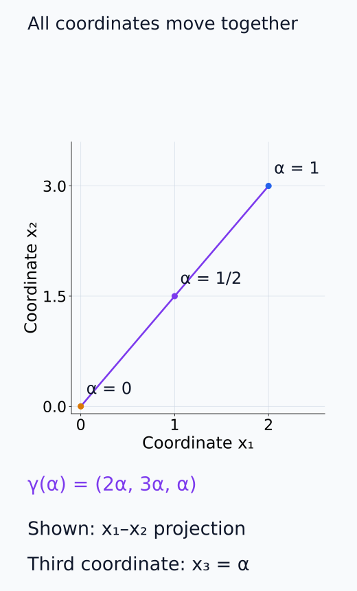
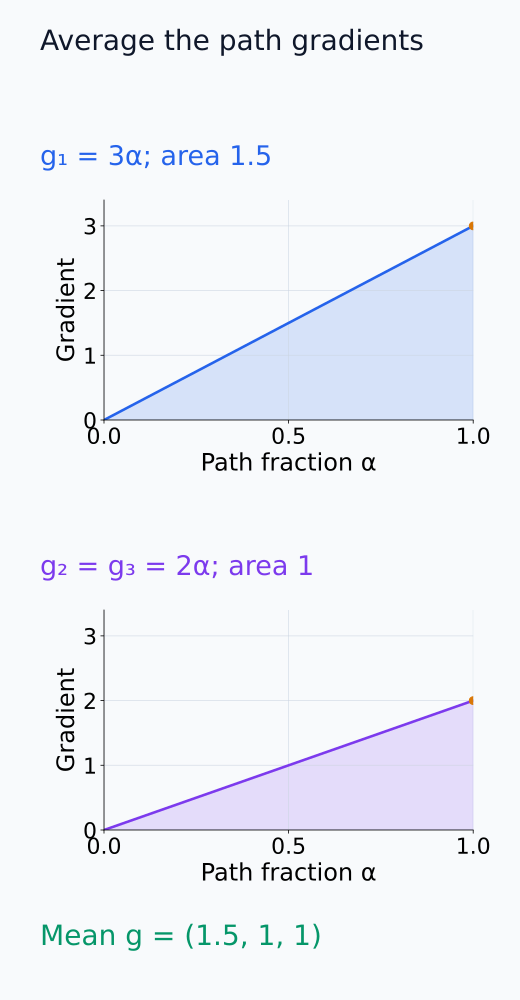
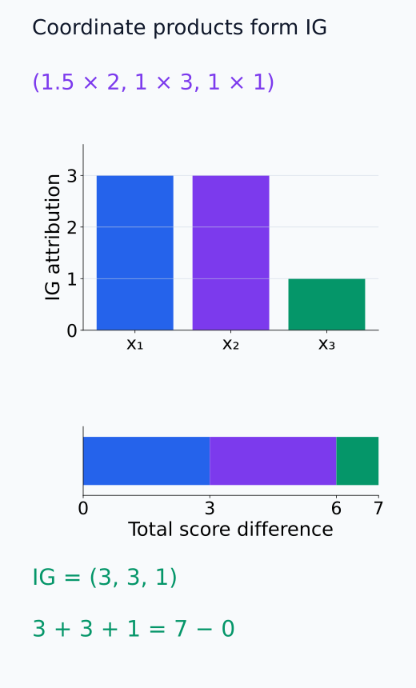
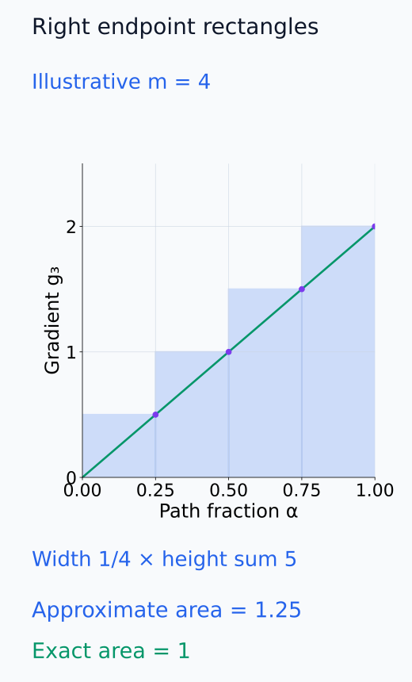
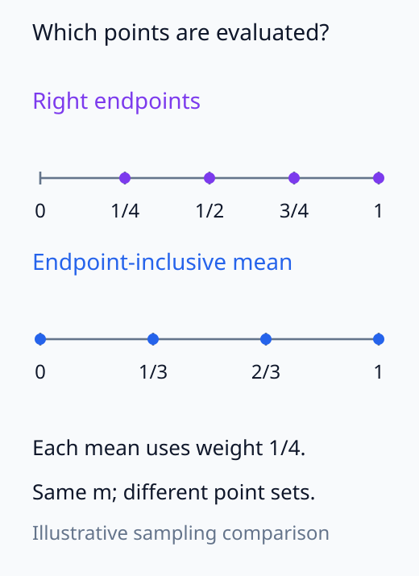
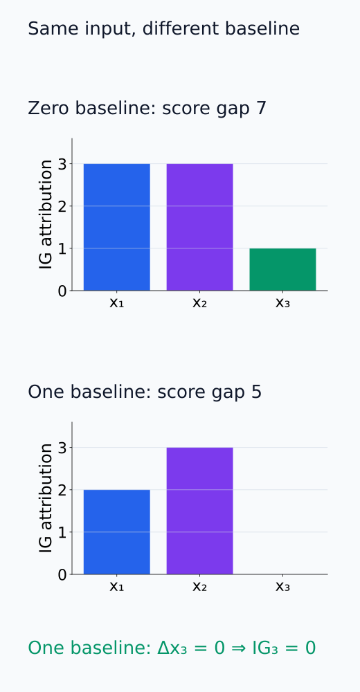

# I07-03. integrated gradients와 baseline

## 이 단원이 필요한 이유

현재 점의 gradient가 saturation 때문에 작을 때, baseline에서 입력까지 이동하며 gradient를 누적할 수 있다. Integrated gradients(IG)는 이 경로 적분을 feature별 귀인값으로 만든다. completeness라는 유용한 성질이 있지만 baseline과 경로가 분석 질문의 일부라는 사실은 사라지지 않는다.

## 학습 목표

- IG 수식의 경로, gradient와 변위 항을 설명할 수 있다.
- 작은 함수의 IG를 계산하고 completeness를 확인할 수 있다.
- baseline을 바꿨을 때 귀인과 해석이 바뀌는 이유를 설명할 수 있다.
- 수치 적분 step과 근사 오차를 보고할 수 있다.

## 선수지식 확인

- 선수 단원: [I07-02 gradient 기반 귀인](I07-02-gradient-attribution.md), [M01-08 적분과 누적](../../part-1-foundations/M01/M01-08-integration-accumulation.md)
- 확인 질문: 선분 $\gamma(\alpha)=x'+\alpha(x-x')$에서 $\alpha=0,1$은 각각 어느 점인가?

## 기호와 용어

| 기호·용어 | Common spoken reading | 의미 | shape·범위 |
|---|---|---|---|
| $x'$ | `x prime` | baseline input | $\mathbb R^d$ |
| $\gamma(\alpha)$ | `gamma of alpha` | baseline과 입력을 잇는 경로 | $\alpha\in[0,1]$ |
| $\operatorname{IG}_i(x;x')$ | `integrated gradients sub i of x relative to x prime` | $i$번째 feature의 경로 적분 귀인 | scalar |
| $m$ | `m` | 수치 적분 step 수 | positive integer |
| completeness | `completeness` | 귀인 합이 score 차이와 같은 성질 | equality |

## 1. 정의

직선 경로 IG는 다음과 같다.

$$
\operatorname{IG}_i(x;x')
=
(x_i-x_i')
\int_0^1
\frac{\partial f(\gamma(\alpha))}{\partial x_i}
\,d\alpha,
\qquad
\gamma(\alpha)=x'+\alpha(x-x').
$$

앞의 변위는 feature가 baseline에서 얼마나 이동했는지 나타내고, 적분은 그 이동 동안의 평균 gradient를 모은다.

적분 안에서는 먼저 $f$를 입력의 $i$번째 좌표로 편미분한 뒤, 그 값을 경로 위 점 $\gamma(\alpha)$에서 평가한다. $\alpha$로 직접 미분한 값과는 다르다. 모든 좌표가 baseline에서 입력까지 함께 이동하는 동안 각 좌표의 민감도를 읽는다. 적분 구간 길이가 1이므로 이 적분은 $\alpha$에 따른 평균 gradient이고, 좌표의 전체 변위를 곱하면 signed 귀인값이 된다. 변위가 0인 좌표의 IG는 0이다.

다음 그림에서 경로의 중간 점과 각 입력 좌표의 공동 이동을 확인할 수 있다.

<figure class="lesson-figure" markdown="1">

<figcaption>zero baseline의 경로 γ(α) = (2α, 3α, α)를 x₁–x₂ 평면에 투영했다. 중간 점에서는 모든 좌표가 함께 이동하며, 생략한 세 번째 좌표는 x₃ = α다.</figcaption>

</figure>

## 2. completeness

적절한 미분 가능성 조건 아래 모든 feature 귀인의 합은 경로 양 끝의 score 차이와 같다.

$$
\sum_i\operatorname{IG}_i(x;x')=f(x)-f(x').
$$

예를 들어 경로 주변에서 $f$가 연속 미분 가능하면 chain rule로

\[
\frac{d}{d\alpha}f(\gamma(\alpha))
=\sum_i\frac{\partial f}{\partial x_i}(\gamma(\alpha))(x_i-x_i')
\]

를 얻는다. 직선 경로의 각 좌표 변화율이 $x_i-x_i'$이기 때문이다. 이를 0부터 1까지 적분하면 왼쪽은 미적분의 기본정리에 따라 $f(\gamma(1))-f(\gamma(0))=f(x)-f(x')$다. 오른쪽은 유한 합과 적분을 바꾸고 상수 변위를 밖으로 꺼내면 각 IG의 합이 된다. 현재 점 한 곳의 gradient 대신 경로 전체의 변화를 누적하므로 I07-02의 gradient×input과 다른 합계가 나온다.

앞 단원의 $f=x_1x_2+x_3^2$, $x=(2,3,1)$과 zero baseline에서는 경로가 $(2\alpha,3\alpha,\alpha)$이고 gradient는 $(3\alpha,2\alpha,2\alpha)$다. $\int_0^1\alpha\,d\alpha=1/2$이므로 평균 gradient는 $(1.5,1,1)$이고, 변위를 곱한 IG는 $(3,3,1)$이다. 합은 7로 score 차이와 같다. gradient×input의 $(6,6,2)$와 비교하면 이 경로에서 평균한 변화율이 현재 점의 변화율보다 절반임을 확인할 수 있다.

이는 baseline 대비 차이의 회계식이다. 각 feature 귀인이 현실 세계의 독립적 원인이라는 뜻은 아니다.

다음 두 그림은 경로의 평균 gradient를 구하는 과정과 변위를 곱해 합계를 만드는 과정을 구분한다.

<figure class="lesson-figure" markdown="1">

<figcaption>경로 위 g₁ = 3α의 넓이는 1.5이고, g₂ = g₃ = 2α의 넓이는 1이다. 구간 길이가 1이므로 이 넓이가 평균 gradient다. 끝점의 gradient (3, 2, 2)를 그대로 쓰는 것과 다르다.</figcaption>

</figure>

<figure class="lesson-figure" markdown="1">

<figcaption>평균 gradient (1.5, 1, 1)에 변위 (2, 3, 1)를 곱하면 IG = (3, 3, 1)이다. 아래 길이 막대에서 세 항이 score 차이 7을 분해하며, 독립적인 인과 효과를 나타내는 막대는 아니다.</figcaption>

</figure>

## 3. 수치 근사

실제 코드는 적분을 $m$개 점의 평균으로 근사한다.

$$
\widehat{\operatorname{IG}}_i
=
(x_i-x_i')\frac1m
\sum_{k=1}^{m}
\frac{\partial f}{\partial x_i}
\left(x'+\frac{k}{m}(x-x')\right).
$$

위 식은 $[0,1]$을 폭 $1/m$인 구간으로 나누고 각 구간의 오른쪽 끝 $k/m$에서 gradient를 읽는 Riemann sum이다. $1/m$은 단순한 평균 계수인 동시에 적분 구간의 폭이다. 각 점의 gradient를 합하기만 하면 이 폭이 빠져 잘못된 크기를 얻는다.

$m$을 늘려 completeness error가 충분히 작아지는지 확인한다. step 수를 결과를 좋게 보이도록 test 데이터에서만 선택하지 않는다.

개별 좌표의 적분 오차가 합에서 상쇄될 수 있으므로 작은 completeness error만으로 모든 좌표값의 정확성을 확정하지 않는다. step 수를 늘렸을 때 귀인 vector도 안정되는지 함께 확인하고, 사용한 점 선택 규칙을 기록한다. 실습은 양 끝을 포함해 균등 배치한 $m$개 점의 gradient를 평균하므로, 오른쪽 끝만 쓰는 위 Riemann sum과 점 선택·가중 방식이 다르다.

다음 그림은 직사각형의 폭과 코드의 평가점 선택을 각각 보여 준다.

<figure class="lesson-figure" markdown="1">

<figcaption>g₃(α) = 2α를 설명용 m = 4로 근사했다. 각 직사각형의 폭 1/4를 곱한 넓이 합은 1.25로, 실제 적분 1보다 크다. 높이 네 개만 더한 5는 적분이 아니다.</figcaption>

</figure>

<figure class="lesson-figure" markdown="1">

<figcaption>설명용 m = 4다. 위 수식의 점은 1/4, 1/2, 3/4, 1이고, 실습처럼 양끝을 포함하면 0, 1/3, 2/3, 1이다. 실습은 네 값을 같은 1/4 가중치로 평균하며, trapezoidal 가중치로 적분하는 코드는 아니다.</figcaption>

</figure>

## 4. baseline은 무정보와 동의어가 아니다

검은 이미지, zero embedding, padding token과 평균 activation은 서로 다른 counterfactual을 만든다. 자연어에서 embedding을 0으로 두는 상태가 실제 token 입력과 대응하지 않을 수 있다. 여러 정당한 baseline을 sensitivity analysis로 비교할 수 있지만 사후적으로 유리한 것만 보고하면 안 된다.

다음 비교는 실습의 두 baseline이 서로 다른 score 차이를 분해하는 모습을 보여 준다.

<figure class="lesson-figure" markdown="1">

<figcaption>실습과 같은 입력 x = (2, 3, 1)이다. zero baseline은 IG = (3, 3, 1), score 차이 7이고, one baseline은 IG = (2, 3, 0), score 차이 5다. one baseline에서는 x₃의 변위가 0이어서 그 귀인도 0이다.</figcaption>

</figure>

## 5. CPU 실습

<!-- I07_EXAMPLE: i07_03_integrated_gradients -->

같은 입력에 zero baseline과 one baseline을 사용한다. 두 경우 모두 completeness error는 작지만 feature별 귀인은 다르다.

## 흔한 오해

### 오해 1. completeness가 faithfulness를 증명한다

합계 보존은 정의한 baseline과 경로에 대한 수학적 성질이다. feature 의미, 현실적인 counterfactual과 모델의 인과 구조를 자동 검증하지 않는다.

### 오해 2. baseline은 구현 세부사항이다

귀인이 어떤 차이를 설명하는지 결정하므로 연구 질문의 일부다.

## 연습문제

### 1. 일차 함수

$f(x)=3x$, baseline $0$, 입력 $2$의 IG를 구하라.

해설 보기

gradient는 경로 전체에서 3이다. 변위는 2이므로 IG는 $2\times3=6$이고 $f(2)-f(0)=6$과 같다.

### 2. 제곱 함수

$f(x)=x^2$, baseline $0$, 입력 $2$의 IG를 적분으로 계산하라.

해설 보기

$\gamma(\alpha)=2\alpha$, gradient는 $2\gamma=4\alpha$이다. $2\int_0^1 4\alpha\,d\alpha=4$이며 score 차이도 4이다.

### 3. baseline 변경

앞 문제에서 baseline을 1로 바꾸면 IG는 얼마인가?

해설 보기

completeness에 따라 $f(2)-f(1)=4-1=3$이다. 직접 적분해도 같은 값이 나온다.

### 4. 수치 검사

IG 구현에서 가장 먼저 확인할 scalar 오차는 무엇인가?

해설 보기

$|\sum_i\widehat{\operatorname{IG}}_i-[f(x)-f(x')]|$인 completeness error를 확인한다. step을 늘렸을 때 감소하는지도 본다.

### 5. 자연어 baseline

zero embedding이 항상 좋은 baseline이 아닌 이유를 설명하라.

해설 보기

zero vector가 tokenizer가 만들 수 있는 실제 token embedding이 아닐 수 있다. 경로 중간점도 학습 분포 밖 상태일 수 있어 해석이 baseline 선택에 의존한다.

### 6. 주장 비판

“IG 합이 logit 차이와 같으므로 각 token의 인과 효과를 얻었다”가 왜 과한가?

해설 보기

completeness는 선택한 연속 경로의 gradient 회계식이다. token을 실제로 바꾸는 개입, 상호작용과 입력 타당성을 검증하지 않았으므로 인과 효과라고 부를 수 없다.

## 근거와 갱신 경계

정의, sensitivity·implementation invariance 공리와 completeness는 [Sundararajan, Taly and Yan (2017)](https://proceedings.mlr.press/v70/sundararajan17a.html)을 기준으로 한다. 이후 변형은 baseline·경로와 보장 조건이 달라질 수 있으므로 같은 이름으로 합치지 않는다.

## 단원 요약

- IG는 baseline에서 입력까지 gradient를 적분하고 feature 변위를 곱한다.
- 귀인 합은 baseline 대비 score 차이와 일치한다.
- baseline과 경로는 해석 질문의 일부다.
- completeness는 인과적 faithfulness의 충분조건이 아니다.

## 통과 기준

- 일변수 함수의 IG를 손으로 계산할 수 있는가?
- completeness error를 구현 검산에 사용할 수 있는가?
- baseline 선택을 분석 계약에 포함할 수 있는가?

## 다음 단원

- [I07-04 perturbation 기반 귀인](I07-04-perturbation-attribution.md)

## 집필자 점검표

- [x] 학습 목표가 관찰 가능한 행동으로 작성됐다.
- [x] IG 정의와 completeness를 구분했다.
- [x] baseline·경로·수치오차를 포함했다.
- [x] 모든 문제에 해설이 있다.
- [x] 모델 해석 주장의 강도를 구분했다.
- [x] 용어집과 표기 규칙을 따랐다.
- [x] Common spoken reading이 실제 영어 학술 발화이며 한글 음역이나 기계적 직역을 포함하지 않는다.
- [x] 선수지식 밖의 내용을 몰래 요구하지 않는다.
- [x] 내부 링크와 수식 렌더링을 확인했다.
