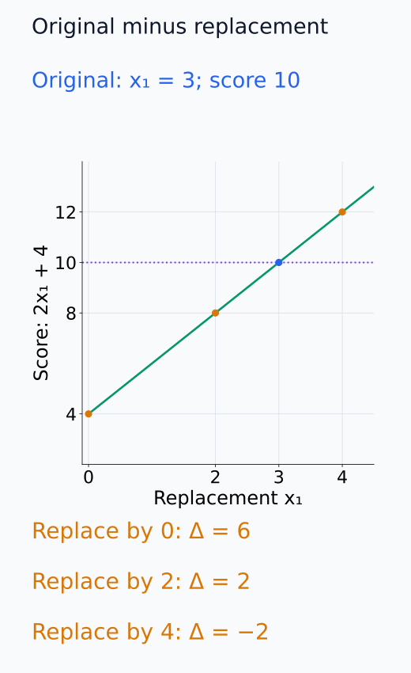
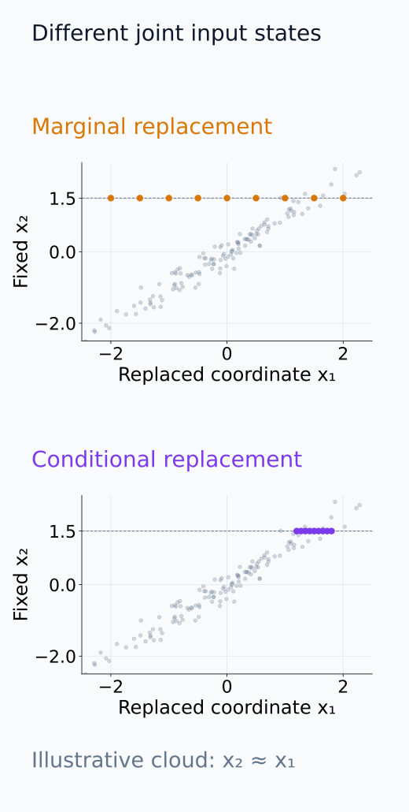
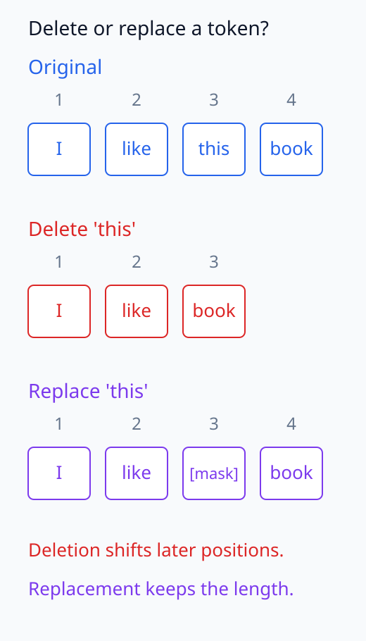
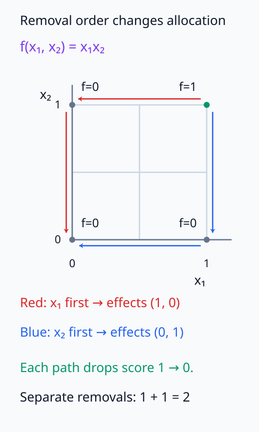
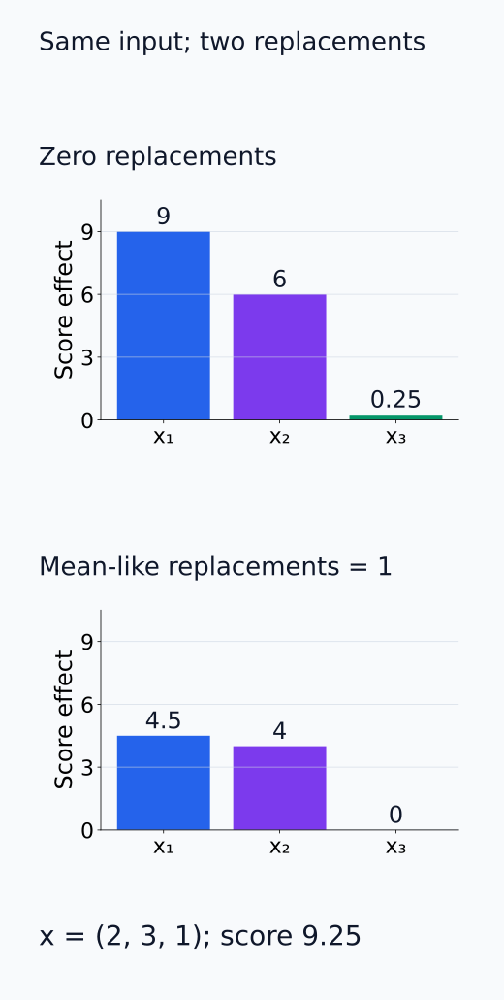

# I07-04. perturbation 기반 귀인

## 이 단원이 필요한 이유

Perturbation 기반 귀인은 feature를 가리거나 다른 값으로 바꾼 뒤 출력 차이를 측정한다. 미분이 필요 없고 유한한 변화에 답하지만, 무엇으로 대체했는지와 상호작용을 어떤 순서로 끊었는지에 결과가 의존한다. 자연어에서는 token 삭제 자체가 문법과 길이를 바꿀 수 있다.

## 학습 목표

- 단일 feature perturbation effect를 계산할 수 있다.
- zero·mean·resampled baseline의 차이를 설명할 수 있다.
- 상호작용 때문에 단일 효과의 합이 전체 효과와 달라지는 예를 만들 수 있다.
- 입력이 분포 밖으로 이동했는지 검사할 항목을 제시할 수 있다.

## 선수지식 확인

- 선수 단원: [I07-03 integrated gradients와 baseline](I07-03-integrated-gradients-baseline.md)
- 확인 질문: baseline을 바꾸면 어떤 score 차이를 설명하는지가 왜 달라지는가?

## 기호와 용어

| 기호·용어 | Common spoken reading | 의미 | shape·범위 |
|---|---|---|---|
| $x^{(i\leftarrow b_i)}$ | `x with coordinate i replaced by b sub i` | $i$번째 feature를 baseline으로 바꾼 입력 | $\mathbb R^d$ |
| $\Delta_i$ | `delta sub i` | 단일 perturbation의 score 차이 | scalar |
| occlusion | `occlusion` | feature를 가리거나 대체하는 개입 | operation |
| resampling | `resampling` | 참조분포에서 대체값을 뽑는 방법 | stochastic operation |
| interaction | `interaction` | 여러 feature 효과가 더해지지 않는 성질 | joint effect |

## 1. 기본 효과

$$
\Delta_i(x;b_i)
=
f(x)-f\bigl(x^{(i\leftarrow b_i)}\bigr).
$$

두 실행에서는 같은 함수와 다른 좌표를 유지하고 $i$번째 값만 바꾼다. 이는 미분에 변위를 곱한 근사가 아니라, 대체 입력에서도 함수를 다시 평가한 유한 차이다. 이 식은 원래 score에서 대체 뒤 score를 빼는 부호를 사용한다. 따라서 대체 뒤 score가 더 높아지면 $\Delta_i$는 음수다.

$\Delta_i>0$이면 그 대체 규칙 아래 원래 feature가 score를 높였다는 뜻이다. feature 자체의 문맥 독립적 가치라는 뜻은 아니다.

다음 단면에서 원래 score를 기준으로 서로 다른 대체값의 유한 차이를 비교한다.

<figure class="lesson-figure" markdown="1">

<figcaption>연습문제의 f = 2x₁ + x₂, x₂ = 4에서 원래 x₁ = 3을 고정했다. 0 또는 2로 바꾸는 효과는 6과 2이고, 설명용 비교값 4로 바꾸면 대체 score가 높아져 효과는 −2다.</figcaption>

</figure>

## 2. 대체값이 질문을 만든다

- zero: 계산은 단순하지만 실제 입력이 아닐 수 있다.
- mean: 평균적인 상태와 비교하지만 다봉 분포에서는 대표성이 낮다.
- marginal resampling: 주변분포는 따르지만 다른 feature와의 관계를 깨뜨릴 수 있다.
- conditional resampling: 문맥을 보존하려 하지만 별도 생성모형이 필요하다.

token 삭제, mask token, 공백과 다른 token 치환은 서로 다른 개입이다.

marginal resampling은 나머지 입력을 보지 않고 해당 feature의 주변분포에서 값을 뽑는다. conditional resampling은 나머지 feature를 지금 입력처럼 고정했을 때의 조건부분포에서 뽑는다. 둘은 같은 feature 값을 바꾸더라도 서로 다른 결합 상태를 만든다. 조건부분포를 사용한다고 원래 입력과 같은 정보가 반드시 제거되는 것도 아니다. 어떤 정보가 대체 뒤에도 남는지는 다른 feature와의 의존관계에 달려 있다.

무작위 대체에서는 같은 입력도 draw마다 score 차이가 바뀐다. 여러 draw의 평균은 정한 대체분포에 대한 평균 효과이고, 서로 다른 입력에서의 일반화를 위한 독립 반복과는 구분한다.

다음 두 그림은 대체분포의 조건과 token 위치 변화라는 서로 다른 결합 상태를 보여 준다.

<figure class="lesson-figure" markdown="1">

<figcaption>설명용 x₂ ≈ x₁ 분포에서 x₂ = 1.5를 고정했다. 위 marginal draw는 x₂를 보지 않아 결합분포에서 멀어질 수 있고, 아래 conditional draw는 이 x₂와 맞는 x₁ 주변에서 뽑는다. 실제 모델이나 입력 데이터의 관측 결과가 아니다.</figcaption>

</figure>

<figure class="lesson-figure" markdown="1">

<figcaption>설명용 네 token을 비교했다. 삭제는 뒤의 book을 4번에서 3번 위치로 옮기지만, 치환은 3번 자리를 남긴다. [mask]라는 대체 기호를 쓸 수 있다는 사실이 그 모델에서 학습된 token이라는 보장은 아니다.</figcaption>

</figure>

## 3. 상호작용

$f(x_1,x_2)=x_1x_2$에서 $(1,1)$의 score는 1이다. 각 좌표를 0으로 바꾸면 효과가 각각 1이므로 단일 효과 합은 2이다. 둘을 함께 제거한 전체 효과 1보다 크다. 같은 상호작용을 두 번 센 결과다.

순서대로 제거하면 합계는 달라진다. 첫째 좌표를 먼저 제거하면 score가 $1\to0$으로 내려가고, 그 상태에서 둘째 좌표를 제거하면 $0\to0$으로 유지된다. 두 차이의 합은 1이지만 각각에 배분한 값은 $(1,0)$이다. 순서를 바꾸면 $(0,1)$이 된다. 연속된 score 차이는 중간값이 소거돼 전체 차이와 같아지지만, 어느 feature에 얼마를 배분할지는 제거 순서에 의존한다.

다음 좌표 경로는 제거 순서에 따라 어느 feature가 먼저 score를 없애는지 보여 준다.

<figure class="lesson-figure" markdown="1">

<figcaption>(1, 1)의 score 1에서 (0, 0)의 score 0으로 가는 두 경로다. 첫 제거에서 전체 곱 항이 사라지므로 순차 배분은 (1, 0) 또는 (0, 1)이고, 각 경로의 전체 감소는 1이다. 두 단일 제거를 각각 원래 점에서 측정해 더한 2와 다르다.</figcaption>

</figure>

## 4. CPU 실습

<!-- I07_EXAMPLE: i07_04_perturbation_attribution -->

zero baseline과 mean-like baseline의 단일 feature 효과가 달라지는 것을 확인한다. 어느 쪽이 자동으로 정답인지는 결정하지 않는다.

다음 비교는 실습 함수에서 대체값만 바꾼 단일 feature 효과다.

<figure class="lesson-figure" markdown="1">

<figcaption>실습 함수 1.5x₁ + x₁x₂ + 0.25x₃²의 x = (2, 3, 1), score 9.25를 사용했다. 좌표별 zero 대체 효과는 (9, 6, 0.25), mean-like 1 대체 효과는 (4.5, 4, 0)이다. 이 값들은 각각 원래 입력에서 한 좌표만 바꾼 결과다.</figcaption>

</figure>

## 흔한 오해

### 오해 1. perturbation은 gradient보다 항상 인과적이다

실제로 값을 바꾸지만 개입 대상, 대체 분포와 downstream 계산을 명확히 해야 한다. 분포 밖 입력의 출력 차이는 원하는 causal estimand와 다를 수 있다.

### 오해 2. 단일 feature 효과를 더하면 전체 설명이 된다

상호작용이 있으면 순서나 grouping 규칙 없이는 가산 분해가 성립하지 않는다.

## 연습문제

### 1. 단일 효과

$f(x)=2x_1+x_2$, $x=(3,4)$에서 $x_1$을 0으로 바꾼 효과를 구하라.

해설 보기

원래 score는 10, 대체 뒤 score는 4이므로 $\Delta_1=6$이다.

### 2. baseline 변경

앞 문제에서 $x_1$을 2로 바꾸면 효과는 얼마인가?

해설 보기

대체 score는 $2\cdot2+4=8$이므로 효과는 2이다. 같은 feature도 비교값에 따라 효과가 달라진다.

### 3. 상호작용

$f=x_1x_2$의 단일 제거 효과 합이 joint 제거 효과와 다른 이유를 설명하라.

해설 보기

곱 항은 두 feature가 함께 있을 때 한 번 생긴다. 각 단일 제거는 같은 곱 항 전체를 없애므로 둘을 더하면 상호작용을 두 번 센다.

### 4. 자연어 개입

token 삭제와 mask token 치환이 같은 실험이 아닌 이유는 무엇인가?

해설 보기

삭제는 뒤 token 위치와 sequence length를 바꾼다. mask 치환은 길이는 유지하지만 모델이 mask token을 학습하지 않았을 수 있다. 서로 다른 분포 이동을 만든다.

### 5. 대조군

특정 token을 바꿨을 때 큰 효과가 나왔다. 어떤 matched control을 둘 수 있는가?

해설 보기

같은 위치·빈도·품사처럼 교란 요인을 맞춘 다른 token을 같은 규칙으로 바꾼다. 단순 무작위 위치 control도 함께 보고할 수 있다.

### 6. 주장 범위

perturbation effect가 크면 해당 feature가 필요하다고 말할 수 있는가?

해설 보기

정의한 대체 개입 아래 출력이 변했다는 증거는 된다. 원래 feature만 제거한 현실적인 counterfactual인지, 다른 정보도 함께 파괴했는지 확인해야 necessity 주장을 제한할 수 있다.

## 근거와 갱신 경계

입력 일부를 가려 예측 변화를 보는 접근의 대표적 초기 사례는 [Zeiler and Fergus (2014)](https://arxiv.org/abs/1311.2901)이다. 이 단원은 특정 occlusion 값을 보편적 baseline으로 고정하지 않는다.

## 단원 요약

- perturbation effect는 원래 입력과 명시한 대체 입력의 score 차이다.
- 대체값과 resampling 분포가 질문을 결정한다.
- 상호작용이 있으면 단일 효과는 가산적이지 않다.
- 분포 이동과 matched control을 함께 검사해야 한다.

## 통과 기준

- 작은 perturbation effect를 계산할 수 있는가?
- 대체값 세 종류의 장단점을 설명할 수 있는가?
- 상호작용 반례와 대조군을 설계할 수 있는가?

## 다음 단원

- [I07-05 관찰과 개입](I07-05-observation-intervention.md)

## 집필자 점검표

- [x] 학습 목표가 관찰 가능한 행동으로 작성됐다.
- [x] 대체값과 상호작용을 명시했다.
- [x] 분포 이동과 대조군을 포함했다.
- [x] 모든 문제에 해설이 있다.
- [x] 모델 해석 주장의 강도를 구분했다.
- [x] 용어집과 표기 규칙을 따랐다.
- [x] Common spoken reading이 실제 영어 학술 발화이며 한글 음역이나 기계적 직역을 포함하지 않는다.
- [x] 선수지식 밖의 내용을 몰래 요구하지 않는다.
- [x] 내부 링크와 수식 렌더링을 확인했다.
