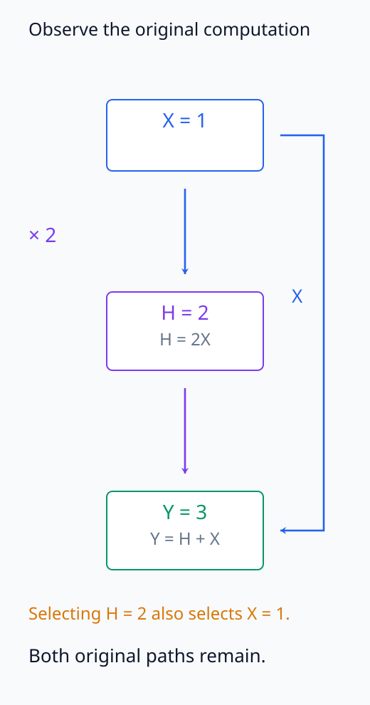
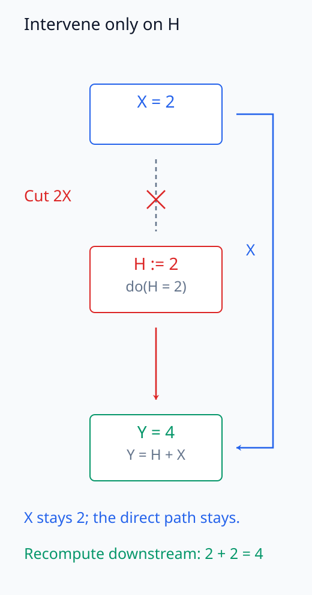
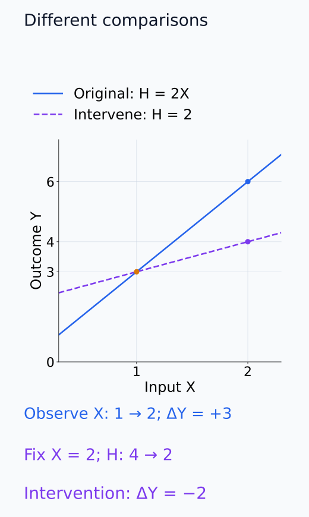
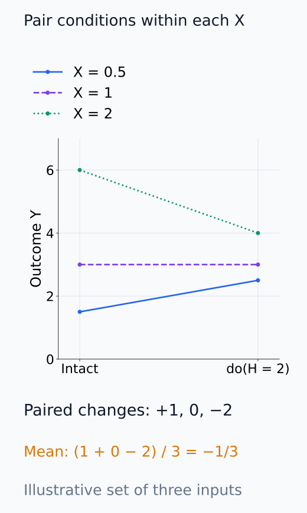
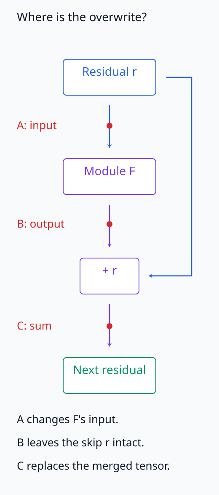

# I07-05. 관찰과 개입

## 이 단원이 필요한 이유

어떤 activation이 행동과 함께 변한다는 관찰은 그 activation을 고정했을 때 행동이 변한다는 결론과 다르다. 모델 내부에서는 forward pass가 알려져 있어 node 값을 강제로 바꾸는 개입을 직접 구현할 수 있지만, 그 결과의 범위는 선택한 입력·node·대체값과 metric에 묶인다.

## 학습 목표

- 조건부 관찰과 $do$ 개입을 구분할 수 있다.
- 계산 그래프에서 개입 시 들어오는 edge를 끊는다는 뜻을 설명할 수 있다.
- total effect를 paired 실행 차이로 정의할 수 있다.
- 내부 개입과 외부 세계 인과 주장을 구분할 수 있다.

## 선수지식 확인

- 선수 단원: [I07-04 perturbation 기반 귀인](I07-04-perturbation-attribution.md), [M04-16 상관, 예측과 인과](../../part-1-foundations/M04/M04-16-correlation-causation.md)
- 확인 질문: $P(Y\mid H=h)$와 $P(Y\mid do(H=h))$가 다른 이유는 무엇인가?

## 기호와 용어

| 기호·용어 | Common spoken reading | 의미 | shape·범위 |
|---|---|---|---|
| $H$ | `H` | 개입할 내부 node | tensor |
| $do(H=h^*)$ | `do H equals h star` | $H$를 $h^*$로 강제 설정 | intervention |
| $Y_{do(H=h^*)}$ | `Y under do H equals h star` | 개입 실행의 출력 | outcome |
| $\tau$ | `tau` | 두 개입 결과의 평균 차이 | scalar estimand |
| paired run | `paired run` | 같은 입력에 두 조건을 적용한 실행 | design |

## 1. 관찰은 경로를 유지한다

$X\to H\to Y$와 $X\to Y$가 함께 있으면 $H=h$를 관찰한 표본은 $X$의 분포도 달라질 수 있다. 반면 $do(H=h^*)$는 원래 $H$를 만들던 계산을 덮어쓰고 downstream만 다시 실행한다.

관찰에서 $H=h$인 표본을 고르는 동안에는 $H$를 만들던 식이 그대로 성립한다. 예를 들어 아래 실습의 $H=2X$, $Y=H+X$에서 $H=2$를 관찰하면 $X=1$이고 $Y=3$이다. 하지만 $X=2$인 실행에 $do(H=2)$를 적용하면 $H=2X$라는 식만 대체하므로 $Y=2+2=4$다. $X\to H$ 계산은 끊어도 $X\to Y$의 직접 경로는 남는다.

node 개입 뒤에는 그 node의 값을 사용하는 downstream node를 원래 계산식으로 다시 계산한다. 이들의 후속 변화까지 포함한 것이 해당 node 조작의 total effect다. 아래 식의 $Y$는 logit이나 행동 metric처럼 비교할 scalar이고, $h_i^{(1)}$, $h_i^{(0)}$는 같은 입력 $i$에 적용할 두 대체값이다.

$$
\tau
=
\mathbb E_i\left[
Y_i\bigl(do(H=h_i^{(1)})\bigr)
-Y_i\bigl(do(H=h_i^{(0)})\bigr)
\right].
$$

같은 입력 $i$에 두 조건을 적용하면 입력 난이도 차이를 paired difference에서 제거할 수 있다.

먼저 각 입력에서 두 outcome의 차이를 구한 뒤, 명세한 입력 모집단에 대해 평균한다. 두 조건에 서로 다른 prompt 집합을 쓰면서 생기는 구성 차이를 피할 수 있지만, 입력마다 개입 효과가 달라지는 변이는 남는다. 결정론적 모델의 고정 입력·대체값에서는 개별 차이가 계산으로 정해지고, 다른 입력으로 일반화할 평균과 uncertainty에는 표본 선택이 포함된다.

다음 네 그림은 유지되는 계산 경로, 덮어쓴 경로, 비교한 출력 차이와 paired 평균을 차례로 보여 준다.

<figure class="lesson-figure" markdown="1">

<figcaption>원래 식 H = 2X에서 H = 2인 실행을 관찰하면 X = 1이다. X→H→Y와 X→Y가 모두 유지되어 Y = 2 + 1 = 3이다.</figcaption>

</figure>

<figure class="lesson-figure" markdown="1">

<figcaption>X = 2 실행에 do(H = 2)를 적용했다. 회색 점선과 × 표시의 X→H 계산만 덮어쓰고, 직접 경로 X→Y와 H→Y의 덧셈을 다시 계산해 Y = 4를 얻는다.</figcaption>

</figure>

<figure class="lesson-figure" markdown="1">

<figcaption>원래 계산의 Y = 3X와 do(H = 2) 뒤의 Y = X + 2다. X를 1에서 2로 바꾸는 원래 출력 차이는 +3이고, X = 2를 고정한 H 개입 차이는 4 − 6 = −2다.</figcaption>

</figure>

<figure class="lesson-figure" markdown="1">

<figcaption>같은 toy 함수에서 설명용 입력 X = 0.5, 1, 2를 두 조건으로 반복했다. 각 선이 같은 입력의 paired 실행이고, 개입−intact 차이 (+1, 0, −2)를 먼저 구한 뒤 평균하면 −1/3이다. 이 세 입력의 평균을 다른 입력 모집단으로 일반화하지 않는다.</figcaption>

</figure>

## 2. 모델 내부 인과

결정론적 forward pass에서도 intervention effect를 측정할 수 있다. 이는 고정된 모델 계산 안에서 node 조작이 출력에 미친 효과다. 학습 데이터, 인간 개념이나 현실 세계 변수의 인과관계까지 자동으로 확장되지 않는다.

## 3. 개입 계약

- node의 정확한 module·layer·token·좌표
- source 값과 base 실행
- 덮어쓰기 시점: module 입력, 출력 또는 residual 합 이후
- outcome과 aggregation
- clean·corrupt·patched 입력의 관계
- random·matched·resampled control

같은 “activation patching”이라는 이름도 이 항목이 다르면 다른 estimand를 측정한다.

다음 residual 계산에서 개입 시점에 따라 실제로 바꾸는 tensor가 달라지는 것을 확인할 수 있다.

<figure class="lesson-figure" markdown="1">

<figcaption>위치 A는 F의 입력, B는 F의 출력, C는 residual 합 뒤의 tensor다. B의 덮어쓰기는 skip 경로의 r을 남기지만 C는 합쳐진 전체 tensor를 바꾼다. 같은 layer라도 세 위치는 같은 개입이 아니다.</figcaption>

</figure>

## 4. CPU 실습

<!-- I07_EXAMPLE: i07_05_observation_intervention -->

$H=2X$, $Y=H+X$에서 $X$를 1에서 2로 바꾸는 관찰 차이와, $X=2$를 유지하면서 $H$만 $X=1$ 실행의 값으로 바꾸는 개입 효과를 비교한다.

## 흔한 오해

### 오해 1. 계산 그래프를 알면 모든 인과 질문이 해결된다

그래프는 모델 계산의 구조를 주지만, 어떤 개입이 연구 개념을 대표하는지와 입력 모집단은 별도로 정해야 한다.

### 오해 2. 내부 node 개입 결과는 외부 세계의 인과 효과다

고정 모델 안의 counterfactual 계산과 현실 세계 데이터 생성과정은 다른 시스템이다.

## 연습문제

### 1. 관찰과 개입

$H=2X$, $Y=H+X$에서 $X=1$과 $X=2$의 관찰된 $Y$ 차이를 구하라.

해설 보기

$X=1$이면 $H=2,Y=3$이고 $X=2$이면 $H=4,Y=6$이다. 관찰 차이는 3이다.

### 2. node 개입

$X=2$를 유지하고 $H$를 2로 고정하면 $Y$는 얼마이며 원래 $X=2$ 실행과의 차이는 얼마인가?

해설 보기

$Y=2+2=4$이다. 원래 값 6에 비해 $-2$ 변한다. $X$의 직접 경로는 그대로 남는다.

### 3. edge 끊기

$do(H=2)$가 끊는 계산과 유지하는 계산을 설명하라.

해설 보기

$X\to H$ 계산을 덮어쓴다. $H\to Y$와 $X\to Y$ 계산은 유지한다.

### 4. paired design

같은 prompt에 intact와 patched 조건을 모두 적용하는 이점은 무엇인가?

해설 보기

prompt별 난이도와 baseline score가 두 조건에 공통으로 들어간다. 조건 차이를 prompt 안에서 계산하면 그 변이를 줄일 수 있다.

### 5. 범위 제한

attention head 개입이 logit을 바꿨을 때 정당한 결론을 써라.

해설 보기

지정한 입력 모집단, patch 값과 logit metric에서 그 head 출력 개입이 결과를 바꿨다고 쓴다. head가 인간 개념의 원인이라고 일반화하지 않는다.

### 6. 계약 작성

내부 node 개입에서 위치 외에 기록할 항목 세 가지를 적어라.

해설 보기

source와 base 실행, 덮어쓰기 시점, outcome metric을 적는다. 입력 쌍과 control도 함께 고정해야 한다.

## 근거와 갱신 경계

신경망 표현과 해석 가능한 변수 사이의 interchange intervention은 [Geiger et al. (2021)](https://arxiv.org/abs/2106.02997)을 기준으로 한다. 이 단원은 모델 내부 계산의 개입을 현실 세계 causal effect와 구분한다.

## 단원 요약

- 관찰은 원래 생성 경로를 유지하고 개입은 선택 node의 들어오는 계산을 덮어쓴다.
- paired run은 같은 입력에서 조건 차이를 측정한다.
- 개입 위치·값·시점·metric이 estimand를 결정한다.
- 모델 내부 인과 효과를 외부 세계 인과로 확장하지 않는다.

## 통과 기준

- 조건부 관찰과 $do$ 개입을 구분할 수 있는가?
- 작은 계산 그래프의 개입 결과를 계산할 수 있는가?
- 내부 개입 계약과 주장 범위를 쓸 수 있는가?

## 다음 단원

- [I07-06 ablation](I07-06-ablation.md)

## 집필자 점검표

- [x] 학습 목표가 관찰 가능한 행동으로 작성됐다.
- [x] 관찰과 개입을 계산 그래프로 구분했다.
- [x] paired effect와 범위 제한을 포함했다.
- [x] 모든 문제에 해설이 있다.
- [x] 모델 해석 주장의 강도를 구분했다.
- [x] 용어집과 표기 규칙을 따랐다.
- [x] Common spoken reading이 실제 영어 학술 발화이며 한글 음역이나 기계적 직역을 포함하지 않는다.
- [x] 선수지식 밖의 내용을 몰래 요구하지 않는다.
- [x] 내부 링크와 수식 렌더링을 확인했다.
