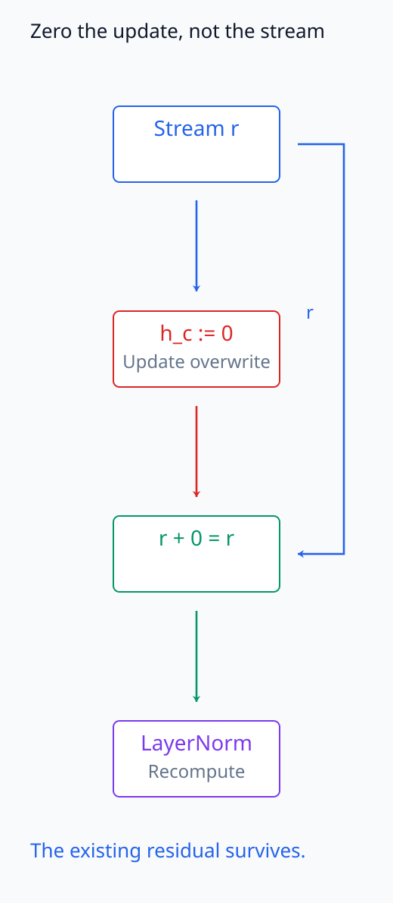
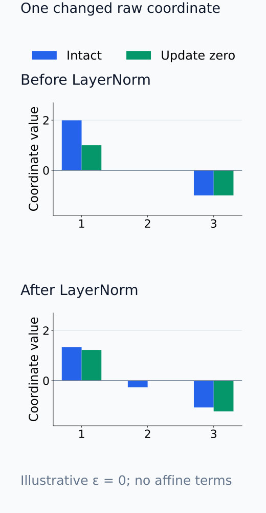
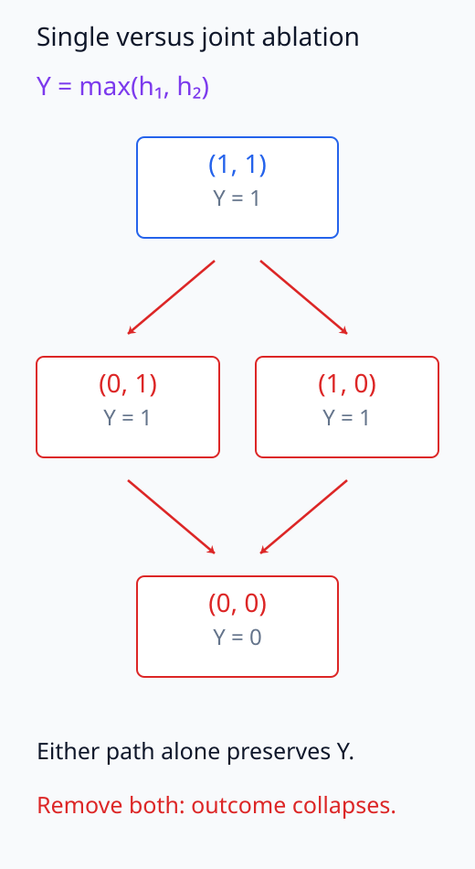
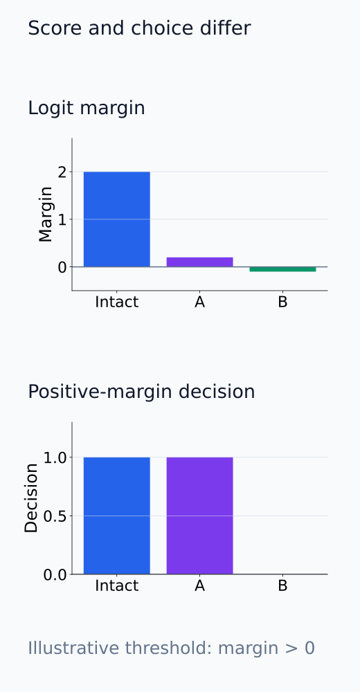
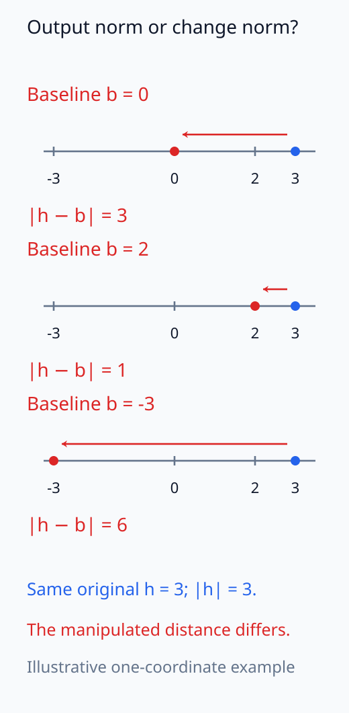
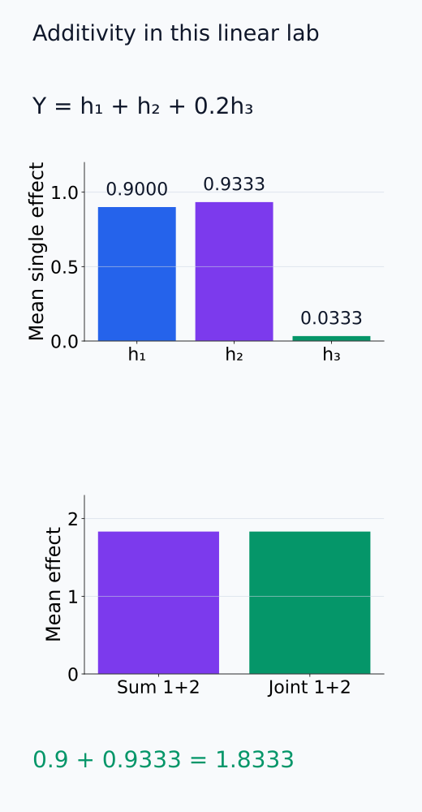

# I07-06. ablation

## 이 단원이 필요한 이유

Ablation은 neuron, attention head 또는 component의 출력을 제거하거나 기준값으로 바꾸고 행동 변화를 측정한다. 구현은 간단하지만 zeroing, mean replacement와 resampling은 서로 다른 개입이다. 중복 경로가 있으면 개별 component를 제거해도 효과가 작을 수 있으므로 “효과가 작다”와 “사용하지 않는다”도 구분해야 한다.

## 학습 목표

- single·joint ablation effect를 계산할 수 있다.
- zero·mean·resample ablation을 구분할 수 있다.
- redundancy와 compensation이 necessity 판정을 어렵게 하는 이유를 설명할 수 있다.
- random component와 magnitude-matched control을 설계할 수 있다.

## 선수지식 확인

- 선수 단원: [I07-05 관찰과 개입](I07-05-observation-intervention.md)
- 확인 질문: 내부 node 값을 바꾸는 실험에서 source 값과 base 실행을 왜 함께 기록해야 하는가?

## 기호와 용어

| 기호·용어 | Common spoken reading | 의미 | shape·범위 |
|---|---|---|---|
| $Y$ | `Y` | intact outcome | scalar metric |
| $Y_{-c}$ | `Y with component c ablated` | component $c$를 제거한 outcome | scalar metric |
| $\Delta_c=Y-Y_{-c}$ | `delta sub c equals Y minus Y sub minus c` | ablation effect | scalar |
| joint ablation | `joint ablation` | 여러 component를 함께 제거 | intervention set |
| redundancy | `redundancy` | 다른 component가 같은 기능을 대신할 수 있음 | circuit property |

## 1. 무엇을 제거하는가

component 출력 $h_c$를 baseline $b_c$로 바꾸면

$$
\Delta_c(x;b_c)=Y(x)-Y\bigl(x;do(h_c=b_c)\bigr).
$$

zero ablation은 $b_c=0$, mean ablation은 참조 데이터의 평균, resample ablation은 다른 실행에서 얻은 값을 사용한다. LayerNorm이나 residual stream 때문에 0이 “없음”을 뜻하지 않을 수도 있다.

residual에 더하는 update가 $h_c$이면 원래 합 $r+h_c$를 $r+b_c$로 바꾼다. zero ablation에서는 그 update만 빠지고 기존 stream $r$은 남는다. 합 이후의 residual 전체를 0으로 만드는 개입과는 다르다. downstream LayerNorm은 바뀐 합의 평균·분산을 다시 계산하므로, 한 update의 대체가 이후 여러 좌표의 값도 바꿀 수 있다.

다음 두 그림은 남는 residual 경로와 downstream 정규화의 재계산을 각각 보여 준다.

<figure class="lesson-figure" markdown="1">

<figcaption>component 출력 h_c만 0으로 덮어쓴다. 파란 skip 경로의 r은 그대로 합에 들어와 r + 0 = r이 되며, LayerNorm은 이 바뀐 합으로 통계를 다시 계산한다. residual 합 전체를 0으로 만드는 개입과 다르다.</figcaption>

</figure>

<figure class="lesson-figure" markdown="1">

<figcaption>설명용 r = (1, 0, −1), h_c = (1, 0, 0)이다. update 제거는 합의 첫 좌표만 바꾸지만, 평균·표준편차를 다시 계산한 정규화에서는 세 좌표가 모두 바뀐다. 표시한 수치는 양의 분산에서 ε = 0, affine 항 없는 계산이다.</figcaption>

</figure>

## 2. 필요성과 중복

개별 ablation 효과가 크면 그 조건에서 component가 필요하다는 증거가 된다. 효과가 작을 때는 다음이 모두 가능하다.

- 원래 행동에 거의 관여하지 않는다.
- 다른 component가 중복된 기능을 제공한다.
- metric이 역할을 포착하지 못한다.
- ablation 값이 downstream에서 보정된다.

joint ablation과 restore 실험을 함께 보아야 한다.

필요성은 먼저 정한 행동 기준에 대해 판단한다. logit이 내려갔어도 정답 선택이 유지된다면 score에 대한 효과는 있지만, 그 component 없이는 정답을 낼 수 없었다고 말할 근거는 아니다. 단일 제거로 행동이 유지되는 경우에도 집합 제거의 결과는 다를 수 있다. 연습문제의 $Y=\max(h_1,h_2)$에서 두 값이 모두 1이면 하나를 0으로 바꿔도 다른 값이 1을 유지하지만, 둘을 함께 0으로 바꾸면 $Y=0$이다.

고정 model의 ablation에서는 weights를 다시 학습하지 않는다. 이때 downstream 보상은 바뀐 activation에 기존 계산이 반응하는 현상이다. component를 제거한 뒤 재학습해 얻은 성능 회복은 다른 학습 실험으로 구분한다.

다음 두 비교는 중복 경로의 공동 제거와 행동 기준의 경계를 분리한다.

<figure class="lesson-figure" markdown="1">

<figcaption>본문의 max 예제다. 각 단일 제거 뒤에도 값 1인 경로 하나가 남지만, 둘을 함께 제거하면 outcome이 0이다. 개별 효과 0이 두 component의 기능 부재를 뜻하지 않는다.</figcaption>

</figure>

<figure class="lesson-figure" markdown="1">

<figcaption>설명용 margin을 2, 0.2, −0.1로 두고 양수면 정답을 선택하는 기준을 사용했다. 2→0.2는 큰 score 감소여도 선택은 유지되며, 0.2→−0.1은 0 경계를 지나 선택이 바뀐다.</figcaption>

</figure>

## 3. 대조군

- 같은 layer에서 무작위 component ablation
- activation norm이나 output variance가 비슷한 component
- 같은 수의 node를 무작위로 고른 집합
- 입력 label을 섞은 행동 metric
- 여러 seed와 prompt의 paired effect

선택한 component만 보고 무작위 선택 분포를 생략하면 selection bias가 생긴다.

magnitude matching에서는 무엇의 크기를 맞췄는지 밝힌다. 원래 출력 $h_c$의 norm과 실제 바꾼 양 $h_c-b_c$의 norm은 mean·resample ablation에서 다를 수 있다. 같은 대체 규칙과 component 수를 적용한 대조군에서 실제 변화량도 비교해야, target 선택 효과와 더 큰 조작량의 효과를 구분할 수 있다.

다음 좌표 그림은 원래 activation 크기가 같아도 실제 조작량은 달라지는 경우를 보여 준다.

<figure class="lesson-figure" markdown="1">

<figcaption>설명용 한 좌표 h = 3의 원래 norm은 항상 3이다. b = 0, 2, −3으로 바꾸는 실제 변화량 |h − b|는 3, 1, 6으로 다르다. 대조군에서 어느 norm을 맞췄는지 구분해야 한다.</figcaption>

</figure>

## 4. CPU 실습

<!-- I07_EXAMPLE: i07_06_ablation -->

세 component의 단일 평균 효과와 앞의 두 component를 함께 제거한 효과를 계산한다. 이 합성 예제는 선형 합이므로 앞 두 단일 효과 합과 joint effect가 일치한다. 비선형 downstream에서는 보장되지 않는다.

다음 막대는 실습의 단일·공동 ablation 효과를 같은 입력 세 개에서 비교한다.

<figure class="lesson-figure" markdown="1">

<figcaption>실습의 Y = h₁ + h₂ + 0.2h₃와 세 입력을 사용했다. 첫 두 mean single effect 0.9와 약 0.9333의 합 약 1.8333이 같은 baseline의 joint effect와 같다. 이 일치는 이 실습의 선형 downstream에 한정된다.</figcaption>

</figure>

## 흔한 오해

### 오해 1. zero ablation은 component를 깨끗하게 삭제한다

0은 모델이 학습 중 본 적 없는 상태일 수 있고 normalization 통계를 바꿀 수 있다.

### 오해 2. 효과가 작은 component는 회로 밖이다

중복과 보상 경로가 있으면 개별 necessity가 드러나지 않는다.

## 연습문제

### 1. 단일 ablation

$Y=h_1+2h_2$, $(h_1,h_2)=(3,1)$에서 $h_1$ zero ablation effect를 구하라.

해설 보기

intact $Y=5$, ablated $Y=2$이므로 효과는 3이다.

### 2. mean ablation

같은 예제에서 $h_1$을 평균값 2로 바꾸면 효과는 얼마인가?

해설 보기

대체 outcome은 4이므로 효과는 1이다. zero ablation과 다른 estimand다.

### 3. redundancy

$Y=\max(h_1,h_2)$이고 둘 다 1일 때 각 단일 ablation과 joint ablation 결과를 구하라.

해설 보기

하나만 0으로 바꾸면 다른 하나가 1이므로 outcome은 유지된다. 둘을 함께 0으로 바꾸면 outcome이 0이 된다. 개별 효과 0이 기능 부재를 뜻하지 않는다.

### 4. control 선택

큰 norm을 가진 head를 ablate했다. 어떤 control이 필요한가?

해설 보기

같은 layer에서 output norm이나 variance가 비슷한 head를 ablate해 단순 규모 효과와 선택한 head의 특이성을 구분한다.

### 5. metric 선택

accuracy만 ablation outcome으로 쓰는 단점을 설명하라.

해설 보기

정답 class가 유지되면 logit margin의 큰 변화가 가려진다. 반대로 작은 margin 변화가 threshold를 넘으면 accuracy가 불연속적으로 변한다. 사전 정의한 연속 metric을 함께 본다.

### 6. 주장 작성

joint ablation만 행동을 무너뜨렸을 때 정당한 결론을 써라.

해설 보기

지정한 component 집합이 해당 개입과 metric에서 집합 수준의 necessity 증거를 보였다고 쓴다. 각 component가 개별적으로 필요하다고 쓰지 않는다.

## 근거와 갱신 경계

Transformer circuit의 node 제거와 복원 평가 사례는 [Wang et al. (2022)](https://arxiv.org/abs/2211.00593)을 참고한다. 이 단원은 ablation 한 종류를 보편적인 삭제 연산으로 간주하지 않는다.

## 단원 요약

- ablation effect는 intact와 명시한 대체 개입의 outcome 차이다.
- zero·mean·resample은 다른 질문을 측정한다.
- 개별 효과가 작아도 redundancy와 compensation을 배제할 수 없다.
- joint ablation, restore와 matched control이 필요하다.

## 통과 기준

- single·joint ablation effect를 계산할 수 있는가?
- 세 baseline의 차이를 설명할 수 있는가?
- redundancy 반례와 대조군을 설계할 수 있는가?

## 다음 단원

- [I07-07 activation patching](I07-07-activation-patching.md)

## 집필자 점검표

- [x] 학습 목표가 관찰 가능한 행동으로 작성됐다.
- [x] ablation baseline과 redundancy를 구분했다.
- [x] joint intervention과 control을 포함했다.
- [x] 모든 문제에 해설이 있다.
- [x] 모델 해석 주장의 강도를 구분했다.
- [x] 용어집과 표기 규칙을 따랐다.
- [x] Common spoken reading이 실제 영어 학술 발화이며 한글 음역이나 기계적 직역을 포함하지 않는다.
- [x] 선수지식 밖의 내용을 몰래 요구하지 않는다.
- [x] 내부 링크와 수식 렌더링을 확인했다.
