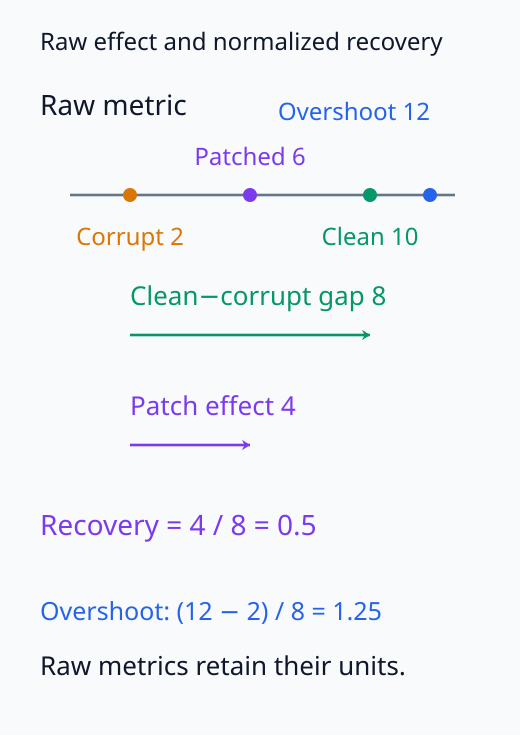
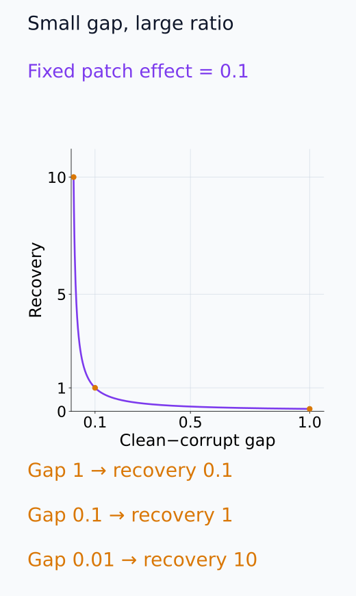
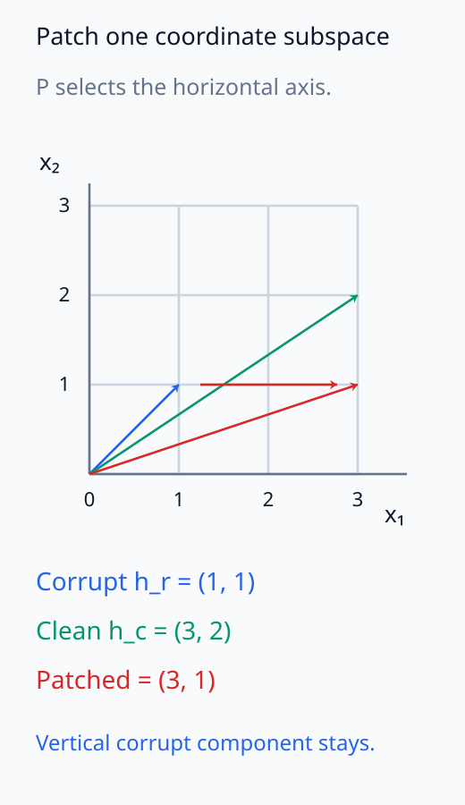
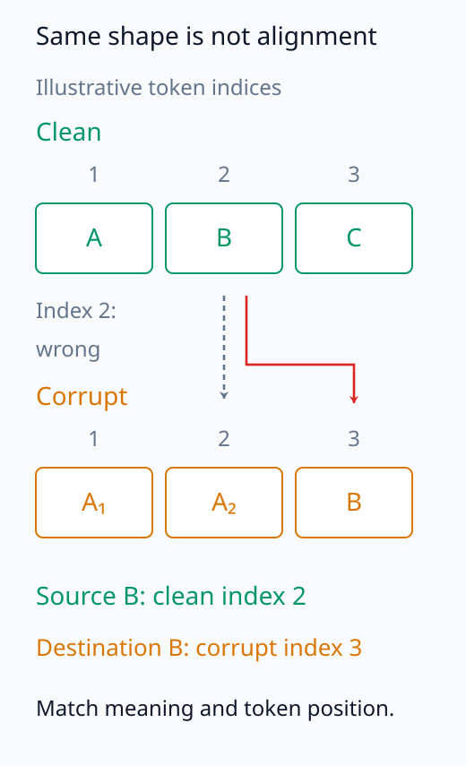
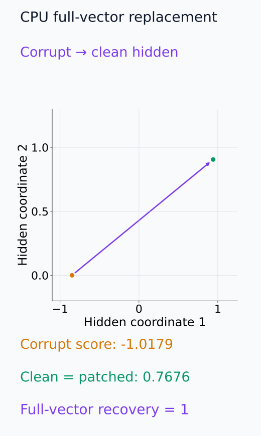

# I07-07. activation patching

## 이 단원이 필요한 이유

Activation patching은 clean 실행에서 얻은 내부 상태를 corrupt 실행의 같은 위치에 넣고 행동이 얼마나 회복되는지 측정한다. 표현을 읽어내는 probe와 달리 실제 forward 계산을 바꾸지만, 결과는 clean·corrupt 쌍, patch 위치와 metric에 민감하다. 회복률 하나를 component의 보편적 중요도로 읽지 않는다.

## 학습 목표

- clean·corrupt·patched 세 실행을 정확히 정의할 수 있다.
- patch effect와 normalized recovery를 계산할 수 있다.
- module 입력·출력과 residual 위치를 구분할 수 있다.
- patching 결과가 허용하는 국소 인과 주장을 쓸 수 있다.

## 선수지식 확인

- 선수 단원: [I07-06 ablation](I07-06-ablation.md), [N05-25 forward hook과 activation 수집](../../part-2-neural-computation/N05/N05-25-hook-activation-collection.md)
- 확인 질문: forward hook에서 module 입력과 출력 중 무엇을 저장했는지 왜 기록해야 하는가?

## 기호와 용어

| 기호·용어 | Common spoken reading | 의미 | shape·범위 |
|---|---|---|---|
| $x_c,x_r$ | `x clean and x corrupt` | clean·corrupt 입력 | input pair |
| $h_j(x_c)$ | `h sub j of x clean` | clean 실행의 node $j$ activation | node tensor |
| $m_c,m_r,m_p$ | `m clean, m corrupt, and m patched` | 세 실행의 행동 metric | scalars |
| $R_j$ | `R sub j` | node $j$ patch의 normalized recovery | scalar |
| interchange intervention | `interchange intervention` | 다른 실행의 내부값으로 교체 | intervention |

## 1. 세 실행

1. clean: 원하는 행동이 나타나는 $x_c$를 실행해 $h_j(x_c)$와 $m_c$를 얻는다.
2. corrupt: 대비 입력 $x_r$를 실행해 $m_r$를 얻는다.
3. patched: $x_r$ 실행 중 $h_j$를 $h_j(x_c)$로 덮어쓰고 $m_p$를 얻는다.

<figure class="lesson-figure lesson-figure--wide" markdown="1">

<figcaption>patched 실행은 corrupt 입력을 유지하되 지정한 layer·token·component의 activation만 clean 실행 값으로 교체한다.</figcaption>
</figure>

세 실행은 같은 모델 파라미터와 같은 metric을 사용해야 한다. clean 실행은 교체할 값을 제공하고 목표 행동의 기준을 정한다. corrupt 실행은 개입 전 baseline이며, patched 실행과의 차이가 해당 교체가 만든 효과다. clean과 patched를 직접 비교하면 “얼마나 회복했는가”는 볼 수 있지만 개입 전 baseline에서 얼마나 변했는지를 놓칠 수 있다.

$$
R_j
=
\frac{m_p-m_r}{m_c-m_r}.
$$

$R_j=1$이면 지정 metric이 clean 수준으로 회복됐고 0이면 변화가 없다. 분모가 작으면 비율이 불안정하므로 원시 metric도 함께 보고한다. 0보다 작거나 1보다 큰 값도 가능한 실제 결과다.

$m_c=m_r$이면 분모가 0이어서 recovery는 정의되지 않는다. 이 경우에도 원시 patch effect $m_p-m_r$는 계산할 수 있지만, 0인 baseline 간격의 몇 배를 회복했다고 표현할 수는 없다.

normalized recovery가 답하는 질문은 “이 node가 일반적으로 얼마나 중요한가”가 아니다. 정확히는 선택한 clean-corrupt 대비에서 node $j$의 값을 교환했을 때, 선택한 metric의 두 baseline 사이 간격을 얼마나 이동했는가를 묻는다. 입력 쌍, node의 범위 또는 metric을 바꾸면 estimand도 바뀐다.

예를 들어 $m_c=10,m_r=2$에서 $m_p=6$이면 원시 patch effect는 $m_p-m_r=4$이고 recovery는 $4/8=0.5$다. 원시 효과는 metric 단위를 유지하고, recovery는 clean-corrupt 간격을 기준으로 조건 사이 비교를 돕는다. 둘을 함께 제시해야 분모가 작은 실험과 실제 변화량이 큰 실험을 구분할 수 있다.

다음 두 그림에서 원시 metric 간격과 작은 분모에 따른 recovery 변화를 비교할 수 있다.

<figure class="lesson-figure" markdown="1">

<figcaption>본문의 m_c = 10, m_r = 2, m_p = 6을 같은 metric 축에 놓았다. 보라색 변화량 4가 분자이고 초록색 baseline 간격 8이 분모다. m_p = 12의 overshoot도 1.25로 남기며 1에서 잘라내지 않는다.</figcaption>

</figure>

<figure class="lesson-figure" markdown="1">

<figcaption>설명용 원시 patch effect를 0.1로 고정했다. clean−corrupt 간격이 1, 0.1, 0.01이면 recovery는 0.1, 1, 10이다. 간격이 0이면 이 곡선의 비율은 정의되지 않는다.</figcaption>

</figure>

## 2. patch 위치

Transformer에서 “layer 5를 patch했다”만으로는 부족하다.

- residual stream의 layer 입력 또는 출력
- attention·MLP의 입력 또는 출력
- 전체 token tensor 또는 특정 token
- 전체 hidden vector, neuron 좌표 또는 subspace
- normalization 전 또는 후

서로 다른 위치는 다른 edge 집합과 downstream 계산을 바꾼다.

patch 위치는 tensor 주소만이 아니라 개입의 의미를 정한다. residual stream 전체를 교체하면 그 시점까지 누적된 여러 component의 결과를 함께 바꾼다. 특정 attention head output만 교체하면 더 좁은 update를 바꾸지만, 이후 residual addition과 MLP가 그 값을 읽는 방식은 그대로 남는다. neuron 하나나 subspace만 교체할 때는 선택한 좌표계와 projection 정의까지 기록해야 한다.

같은 위치의 clean·corrupt hidden vector를 $h_c,h_r$라 하고 선택 subspace의 orthogonal projection을 $P$라 하면, 부분 교체값은 $h_r+P(h_c-h_r)$로 만들 수 있다. 선택 subspace 성분은 clean 값으로 바뀌고 그 직교 여공간 성분은 corrupt 값으로 남는다. $P$가 identity이면 전체 vector 교체이고, 특정 좌표만 남기는 projection이면 그 좌표들만 교체한다. 어느 경우에도 이 값 뒤의 downstream 계산은 patched 상태에서 다시 진행한다.

다음 좌표 그림은 부분 projection 교체에서 남는 corrupt 성분을 보여 준다.

<figure class="lesson-figure" markdown="1">

<figcaption>설명용 h_r = (1, 1), h_c = (3, 2)와 첫 좌표 projection P를 사용했다. P(h_c − h_r) = (2, 0)을 더해 (3, 1)을 얻으며, 두 번째 corrupt 성분 1은 남는다. 전체 vector 교체 (3, 2)와 다르다.</figcaption>

</figure>

## 3. clean·corrupt 쌍

두 입력은 목표 feature만 다르고 길이·형식·난이도는 가능한 한 맞춰야 한다. corruption이 여러 정보를 함께 바꾸면 patch가 회복한 대상도 모호해진다. 여러 입력 쌍에 대해 paired effect와 불확실성을 계산한다.

정렬은 문장 글자 수뿐 아니라 tokenization 뒤의 위치에서 확인한다. 같은 단어 위치도 한 입력에서는 여러 token으로 나뉠 수 있고, 같은 tensor index가 서로 다른 문맥을 가리킬 수 있다. clean 값을 가져오는 source 위치와 corrupt 실행에서 바꿀 destination 위치를 명시해야, shape가 같다는 사실을 의미 대응으로 오해하지 않는다.

다음 token 배열에서 같은 shape와 의미가 맞는 source/destination 위치를 구분한다.

<figure class="lesson-figure" markdown="1">

<figcaption>실제 tokenizer 결과가 아닌 설명용 분할이다. 두 tensor의 길이는 3으로 같지만 clean 2번의 B는 corrupt 3번에 있다. 같은 index 2를 기계적으로 교환하면 B를 A₂ 위치에 넣는 다른 개입이 된다.</figcaption>

</figure>

## 4. CPU 실습

<!-- I07_EXAMPLE: i07_07_activation_patching -->

작은 MLP의 전체 hidden vector를 clean 값으로 바꾸면 합성 예제에서는 recovery가 1이다. 전체 vector를 교체했으므로 개별 neuron의 역할은 결론 내리지 않는다.

다음 hidden 좌표 그림은 CPU 실습의 전체 vector 교체가 고정 readout에 주는 결과를 보여 준다.

<figure class="lesson-figure" markdown="1">

<figcaption>기존 CPU 실습의 tanh(W_IN x) 좌표를 그대로 계산했다. full hidden vector를 clean 점으로 교체하면 고정 W_OUT이 같은 vector를 읽어 patched score가 clean score와 같아진다. 이 결과만으로 어느 neuron이 개별적으로 필요한지는 알 수 없다.</figcaption>

</figure>

## 5. Pythia-160M 실제 모델 실험

`The capital of France is`와 `The capital of Germany is`를 clean·corrupt 쌍으로 두고 layer 5 MLP down-projection의 마지막-token 출력을 patch한다. metric은 `Paris` minus `Berlin` next-token logit이다.

<!-- GPU_EXPERIMENT: pythia_160m_activation_patching -->

고정 실행에서 clean metric은 5.0, corrupt metric은 -3.0, patched metric은 -2.5였고 recovery는 0.0625였다. 이 작은 회복은 해당 한 node patch가 이 대비를 일부만 바꿨다는 결과다. 다른 layer·component가 회로라는 결론이나 Pythia가 사실을 같은 방식으로 저장한다는 결론은 아니다.

## 흔한 오해

### 오해 1. recovery가 가장 큰 위치가 정보를 저장하는 유일한 장소다

patch effect는 downstream 경로, corruption과 metric을 포함한다. 분산 표현과 중복 경로에서는 여러 위치가 효과를 보일 수 있다.

### 오해 2. recovery 0은 component가 사용되지 않는다는 뜻이다

patch 값이 receiver가 사용할 수 없는 상태이거나 다른 경로가 동시에 손상됐을 수 있다. null result에도 검출력과 개입 타당성 검사가 필요하다.

## 연습문제

### 1. recovery 계산

$m_c=10,m_r=2,m_p=6$일 때 recovery를 구하라.

해설 보기

$(6-2)/(10-2)=4/8=0.5$이다.

### 2. overshoot

$m_p=12$라면 recovery가 1보다 큰 이유를 설명하라.

해설 보기

patch 실행이 clean metric 10을 넘어섰기 때문이다. 비율은 $(12-2)/8=1.25$이며 계산 오류라고 잘라내지 않는다.

### 3. 불안정한 분모

$m_c$와 $m_r$가 거의 같을 때 어떤 문제가 생기는가?

해설 보기

작은 측정 오차도 recovery 비율을 크게 바꾼다. clean·corrupt 대비가 행동을 충분히 분리하는지 먼저 검사하고 원시 차이를 함께 보고한다.

### 4. 위치 계약

“attention head 3을 patch했다”에 더 필요한 위치 정보 세 가지를 적어라.

해설 보기

layer, token 위치, head의 value/output 또는 residual 기여 중 무엇인지 적는다. normalization 전후와 전체 vector인지도 명시한다.

### 5. Pythia 결과

recovery 0.0625에서 직접 말할 수 있는 것을 한 문장으로 써라.

해설 보기

고정된 France/Germany prompt 쌍에서 layer 5 MLP 마지막-token 출력 patch가 Paris–Berlin logit 대비의 clean-corrupt 차이 중 6.25%를 회복했다.

### 6. 대조군

선택한 node patch의 특이성을 검사할 control 두 가지를 제시하라.

해설 보기

같은 layer의 무작위 token이나 norm-matched activation을 patch할 수 있다. clean source를 다른 무관 prompt에서 가져오는 resampled control도 가능하다.

## 근거와 갱신 경계

Interchange intervention의 인과적 틀은 [Geiger et al. (2021)](https://arxiv.org/abs/2106.02997), metric·corruption 선택이 결과에 미치는 영향은 [Zhang and Nanda (2023)](https://arxiv.org/abs/2309.16042)을 기준으로 한다. 실제 모델 결과는 고정 Pythia revision과 local manifest 범위에 한정한다.

## 단원 요약

- activation patching은 clean 값을 corrupt forward pass에 넣는 interchange intervention이다.
- normalized recovery는 원시 clean·corrupt·patched metric과 함께 본다.
- module·layer·token·좌표와 normalization 위치가 estimand를 결정한다.
- 한 patch 결과는 지정한 입력과 metric에 대한 국소 인과 증거다.

## 통과 기준

- 세 실행과 recovery를 계산할 수 있는가?
- patch 위치 계약을 완전하게 쓸 수 있는가?
- Pythia 결과의 주장 범위를 제한할 수 있는가?

## 다음 단원

- [I07-08 causal tracing](I07-08-causal-tracing.md)

## 집필자 점검표

- [x] 학습 목표가 관찰 가능한 행동으로 작성됐다.
- [x] clean·corrupt·patched 실행을 구분했다.
- [x] 실제 Pythia 결과와 범위를 명시했다.
- [x] 모든 문제에 해설이 있다.
- [x] 모델 해석 주장의 강도를 구분했다.
- [x] 용어집과 표기 규칙을 따랐다.
- [x] Common spoken reading이 실제 영어 학술 발화이며 한글 음역이나 기계적 직역을 포함하지 않는다.
- [x] 선수지식 밖의 내용을 몰래 요구하지 않는다.
- [x] 내부 링크와 수식 렌더링을 확인했다.
