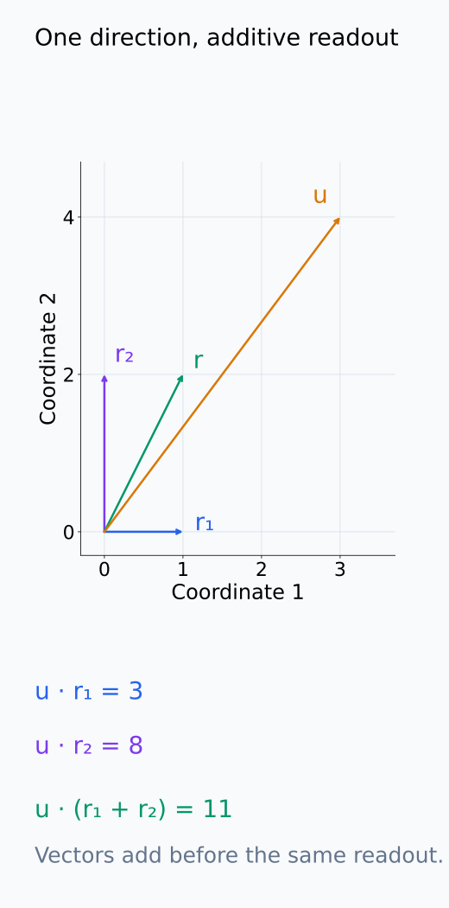
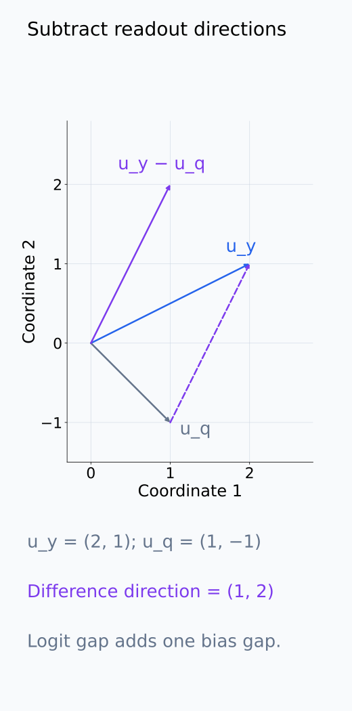
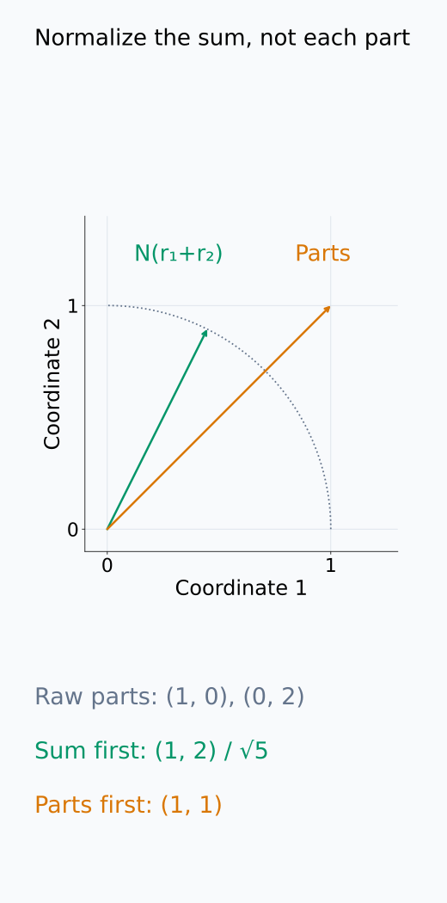
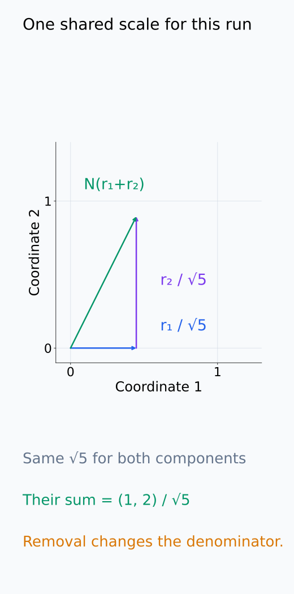
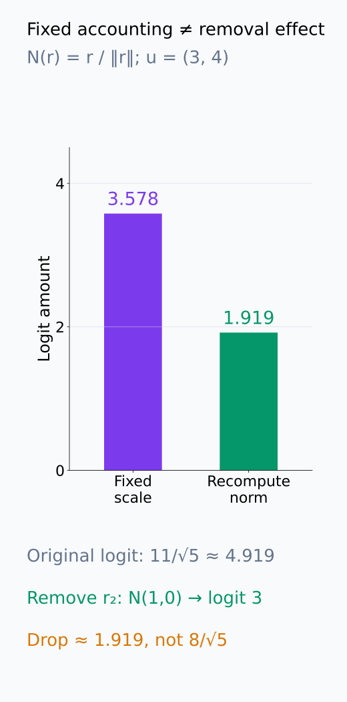
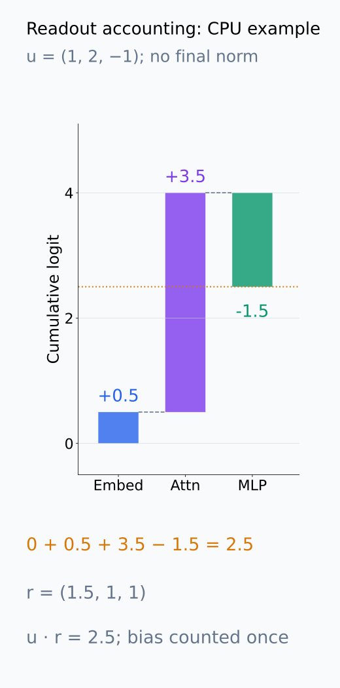

# I07-10. residual·logit attribution

## 이 단원이 필요한 이유

Transformer residual stream은 embedding, attention과 MLP update의 합으로 쓸 수 있다. 최종 logit readout이 선형인 지점에서는 각 residual 성분의 직접 logit 기여를 내적으로 분해할 수 있다. 이 계산은 빠른 회계 도구이지만 downstream nonlinear interaction과 component의 필요성을 측정하지 않는다.

## 학습 목표

- residual 성분과 logit direction의 내적을 계산할 수 있다.
- 선형 readout에서 기여 합이 전체 logit과 일치함을 확인할 수 있다.
- LayerNorm·RMSNorm 때문에 정확한 가산 분해가 깨지는 위치를 설명할 수 있다.
- direct attribution과 causal effect를 구분할 수 있다.

## 선수지식 확인

- 선수 단원: [I07-09 path patching](I07-09-path-patching.md), [N05-17 residual stream](../../part-2-neural-computation/N05/N05-17-residual-stream.md)
- 확인 질문: residual update가 합으로 누적될 때 최종 residual vector를 component별 합으로 쓰는 방법은 무엇인가?

## 기호와 용어

| 기호·용어 | Common spoken reading | 의미 | shape·범위 |
|---|---|---|---|
| $r=\sum_c r_c$ | `r equals the sum over c of r sub c` | residual 성분의 합 | $r,r_c\in\mathbb R^d$ |
| $u_y$ | `u sub y` | token $y$의 unembedding direction | $\mathbb R^d$ |
| $a_{c,y}=u_y^\top r_c$ | `a sub c y equals u sub y transpose r sub c` | component의 direct logit 기여 | scalar |
| logit difference | `logit difference` | target logit minus foil logit | scalar |
| direct logit attribution | `direct logit attribution` | 선택 readout에서의 선형 기여 | decomposition |

## 1. 선형 readout

정규화 이후 vector $z$에 unembedding을 적용하면 token $y$ logit은

$$
\ell_y=u_y^\top z+b_y
$$

이다. $z$가 component 합 $\sum_c z_c$라면

$$
\ell_y-b_y=\sum_c u_y^\top z_c.
$$

$u_y$와 $z_c$는 같은 길이의 vector이고 내적은 scalar다. 내적이 vector 합에 분배되므로 $u_y^\top\sum_c z_c=\sum_c u_y^\top z_c$가 된다. bias는 이 성분 합 밖에 한 번만 더한다. component마다 같은 bias를 붙이면 전체 logit을 중복 계산한다. 이 등식에 쓰는 $z_c$는 실제 readout 입력 $z$를 합으로 만드는 성분이어야 한다.

target $y$와 foil $q$의 logit 차이는 $u_y-u_q$라는 한 direction으로 분석할 수 있다.

두 logit 식을 빼면 $\ell_y-\ell_q=(u_y-u_q)^\top z+(b_y-b_q)$다. 따라서 성분별 내적은 bias 차이를 제외한 대비를 분해한다. unembedding bias가 없거나 두 bias가 같을 때에만 이 합만으로 전체 logit 차이가 된다.

다음 두 그림은 같은 readout에 대한 내적의 가산성과 target-minus-foil 방향을 각각 보여 준다.

<figure class="lesson-figure" markdown="1">

<figcaption>기존 문제의 r₁ = (1,0), r₂ = (0,2), u = (3,4)를 한 좌표계에 표시했다. 내적 기여 3과 8의 합은 합벡터의 readout 11과 같다. bias가 있다면 성분별로 반복하지 않고 한 번만 더한다.</figcaption>

</figure>

<figure class="lesson-figure" markdown="1">

<figcaption>기존 문제의 u_y = (2,1), u_q = (1,−1)이다. 점선은 두 끝점 사이의 차이를 나타내고, 원점의 보라색 벡터도 같은 차이 (1,2)를 갖는다. 이 방향의 내적은 bias 차이를 제외한 target-minus-foil logit을 계산한다.</figcaption>

</figure>

## 2. normalization 경계

최종 residual $r$에 LayerNorm이나 RMSNorm을 적용해 $z=N(r)$를 만든다면 일반적으로

$$
N\left(\sum_c r_c\right)\ne\sum_c N(r_c).
$$

각 raw component를 독립적으로 normalize해 더하는 것은 실제 forward pass와 다르다. 고정된 local linearization이나 특정 decomposition 관례를 쓰면 그 근사와 조건을 명시한다.

예를 들어 $N(r)=r/\lVert r\rVert$에서 $r_1=(1,0)$, $r_2=(0,2)$이면 실제 합의 정규화는 $(1,2)/\sqrt5$지만 각 성분을 따로 정규화한 합은 $(1,1)$이다. 반면 현재 실행의 전체 norm $\sqrt5$를 고정해 두 성분을 모두 같은 분모로 나누면 그 합은 실제 $N(r)$와 같다. 이는 이 실행의 가산 회계는 만들 수 있다는 뜻이다. 성분을 제거한 실행에서는 전체 norm도 달라지므로 같은 고정 분모의 분해를 그대로 개입 예측으로 쓰지는 않는다.

다음 좌표 그림에서 전체 정규화와 성분별 정규화를 비교하고, 같은 전체 분모를 쓴 경우만 따로 확인한다.

<figure class="lesson-figure" markdown="1">

<figcaption>본문의 N(r) = r/‖r‖ 예시다. 합벡터를 먼저 정규화한 (1,2)/√5는 단위원 위에 있고, 각 성분을 별도로 정규화한 합 (1,1)은 단위원 밖에 있다. 서로 다른 분모를 쓴 연산이므로 같은 벡터가 아니다.</figcaption>

</figure>

<figure class="lesson-figure" markdown="1">

<figcaption>같은 실행의 전체 norm √5를 고정해 두 성분 모두에 쓰면 파란 성분과 보라 성분이 초록 정규화 벡터를 정확히 만든다. 성분 제거 후에는 전체 norm이 달라질 수 있으므로 이 고정 분모의 회계만으로 개입 결과를 예측하지 않는다.</figcaption>

</figure>

## 3. direct와 total effect

direct logit attribution은 component vector가 현재 readout direction과 정렬된 정도다. component를 제거하면 downstream attention·MLP와 normalization이 다시 계산되므로 ablation effect와 같지 않다. 큰 direct contribution은 개입 증거가 아니다.

후속 계산 없이 고정 vector들을 더하는 선형 예제에서는 한 성분의 zero ablation 차이가 그 성분의 내적 기여와 일치한다. 그러나 중간 component를 제거하면 원래 실행에서 측정한 다른 성분들도 그대로 남는다고 가정할 수 없다. 직접 기여는 원래 실행의 값을 분해하고, total effect는 그 개입 뒤 다시 계산한 실행과 비교한다는 차이가 있다.

다음 그림은 성분 제거 뒤 norm을 다시 계산한 값과 원래 실행의 고정 분모 기여를 비교한다.

<figure class="lesson-figure" markdown="1">

<figcaption>본문의 정규화 예시와 기존 문제의 u = (3,4)를 함께 계산했다. 원래 logit은 11/√5 ≈ 4.919이고 r₂ 제거 뒤에는 3이다. 실제 감소 약 1.919는 원래 고정 분모로 계산한 r₂ 기여 8/√5 ≈ 3.578과 다르다.</figcaption>

</figure>

## 4. CPU 실습

<!-- I07_EXAMPLE: i07_10_residual_logit_attribution -->

세 residual 성분의 내적 합과 전체 residual logit이 같은지 확인한다. 코드는 final nonlinearity를 포함하지 않았다고 결과에 명시한다.

다음 누적 그림에서 기존 CPU 실습의 세 성분 기여가 전체 logit을 만드는 과정을 따라간다.

<figure class="lesson-figure" markdown="1">

<figcaption>기존 CPU 실습의 u = (1,2,−1)에서 embedding, attention, MLP의 내적은 0.5, 3.5, −1.5다. 위아래 누적 변화가 전체 residual (1.5,1,1)의 logit 2.5를 만든다. final normalization이나 후속 nonlinear 계산을 포함한 효과가 아니다.</figcaption>

</figure>

## 흔한 오해

### 오해 1. direct contribution이 큰 head가 필수다

다른 component가 상쇄하거나 대체할 수 있고, head를 제거하면 downstream 계산도 달라진다.

### 오해 2. 모든 layer의 residual 성분을 그대로 최종 logit에 투영하면 정확하다

중간 성분은 이후 layer와 최종 normalization을 통과한다. direct projection은 정한 관례의 진단값이다.

## 연습문제

### 1. 내적

$r_c=(1,2)$, $u_y=(3,-1)$일 때 direct contribution을 구하라.

해설 보기

$3\cdot1+(-1)\cdot2=1$이다.

### 2. 합 검산

$r_1=(1,0)$, $r_2=(0,2)$, $u=(3,4)$일 때 각 기여와 전체 logit을 구하라.

해설 보기

기여는 3과 8이고 합은 11이다. 전체 residual $(1,2)$와 $u$의 내적도 11이다.

### 3. logit difference

target direction $u_y=(2,1)$, foil direction $u_q=(1,-1)$이면 차이 direction은 무엇인가?

해설 보기

$u_y-u_q=(1,2)$이다. residual과 이 vector의 내적이 bias를 제외한 logit 차이 기여다.

### 4. normalization

$N(r)=r/\|r\|$일 때 일반적으로 $N(r_1+r_2)=N(r_1)+N(r_2)$가 아닌 이유를 설명하라.

해설 보기

왼쪽 분모는 합 vector의 norm이고 오른쪽은 각 vector의 norm을 따로 쓴다. normalization은 선형 연산이 아니다.

### 5. causal claim

한 MLP가 target logit에 큰 양의 direct contribution을 보였다. 다음 검사는 무엇인가?

해설 보기

해당 MLP 출력의 ablation 또는 matched activation patch를 하고 같은 logit difference와 행동 metric 변화를 paired하게 측정한다.

### 6. 음의 기여

음의 direct contribution을 “해로운 component”로 부르면 안 되는 이유는 무엇인가?

해설 보기

선택한 한 token 대비를 낮춘다는 뜻일 뿐 다른 token, calibration이나 downstream 계산에 필요한 역할을 할 수 있다. 전체 기능 평가는 별도다.

## 근거와 갱신 경계

Residual stream을 통신 채널로 보고 component를 readout direction에 투영하는 틀은 [Elhage et al. (2021)](https://transformer-circuits.pub/2021/framework/index.html)을 기준으로 한다. 선형 분해가 정확한 계산 위치와 normalization 관례를 항상 함께 기록한다.

## 단원 요약

- 선형 readout에서는 residual component의 내적 기여가 logit을 가산 분해한다.
- logit difference는 target-minus-foil direction으로 계산한다.
- normalization은 raw residual 성분의 단순 가산 투영을 어렵게 한다.
- direct attribution과 ablation·patching effect는 다른 값이다.

## 통과 기준

- component logit 기여를 계산할 수 있는가?
- 가산성이 성립하는 위치를 말할 수 있는가?
- direct contribution과 causal effect를 구분할 수 있는가?

## 다음 단원

- [I07-11 circuit을 그래프로 표현하기](I07-11-circuit-graph.md)

## 집필자 점검표

- [x] 학습 목표가 관찰 가능한 행동으로 작성됐다.
- [x] 선형 readout과 normalization 경계를 구분했다.
- [x] direct와 causal effect를 분리했다.
- [x] 모든 문제에 해설이 있다.
- [x] 모델 해석 주장의 강도를 구분했다.
- [x] 용어집과 표기 규칙을 따랐다.
- [x] Common spoken reading이 실제 영어 학술 발화이며 한글 음역이나 기계적 직역을 포함하지 않는다.
- [x] 선수지식 밖의 내용을 몰래 요구하지 않는다.
- [x] 내부 링크와 수식 렌더링을 확인했다.
