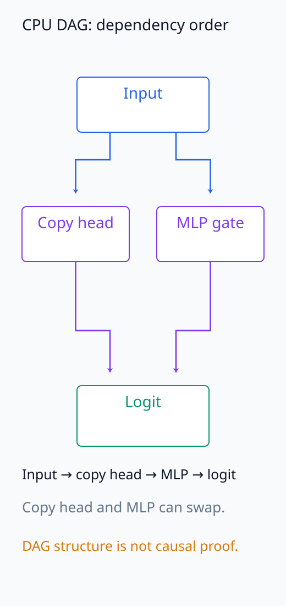
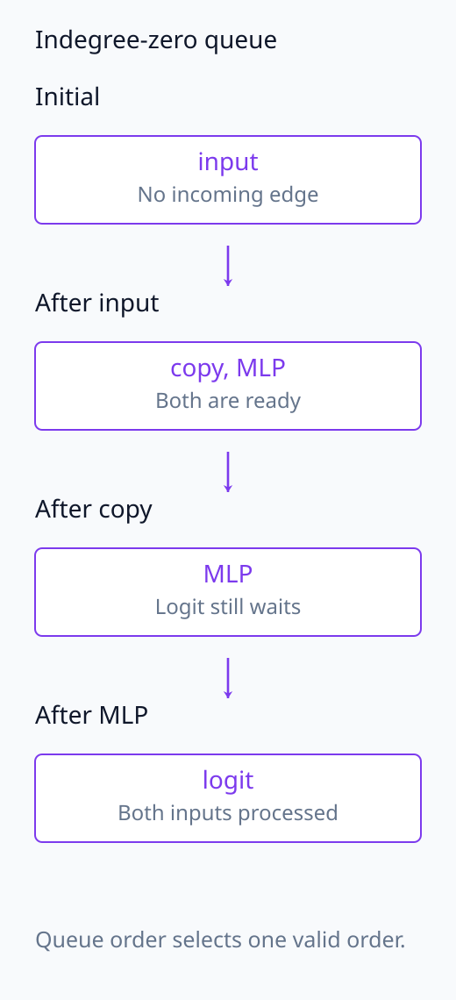
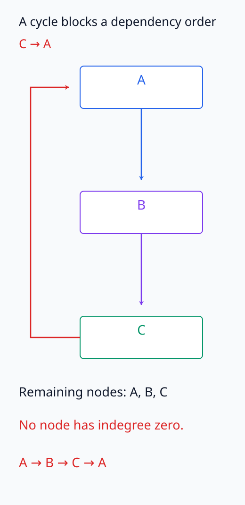
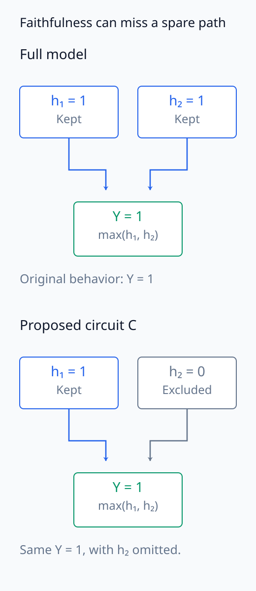
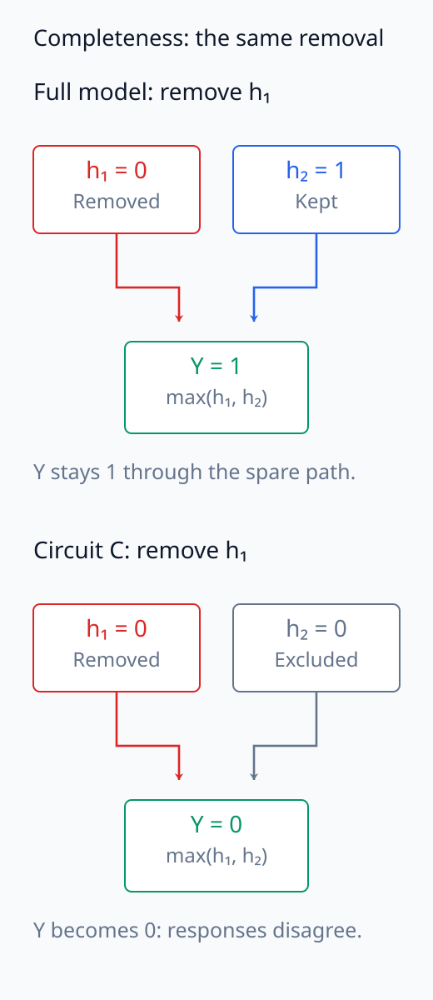
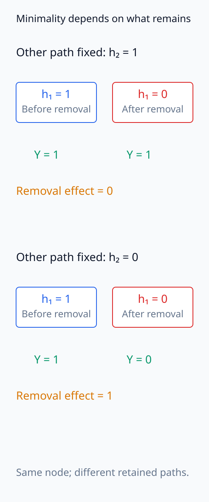

# I07-11. circuit을 그래프로 표현하기

## 이 단원이 필요한 이유

Circuit 주장은 component 목록이 아니라 어떤 행동을 어떤 node와 edge의 계산으로 설명하는지 적는 가설이다. 그래프를 쓰면 node의 granularity, edge message와 검증하지 않은 빈틈을 드러낼 수 있다. 모델 전체 계산 그래프와 분석자가 제안한 sparse circuit을 구분해야 한다.

## 학습 목표

- 행동 metric과 입력 분포를 먼저 정의할 수 있다.
- node·edge·message를 명시한 directed graph를 만들 수 있다.
- topological order와 경로를 계산할 수 있다.
- faithfulness·completeness·minimality 검사를 구분할 수 있다.

## 선수지식 확인

- 선수 단원: [I07-10 residual·logit attribution](I07-10-residual-logit-attribution.md)
- 확인 질문: component의 direct logit contribution과 그 component를 제거한 total effect가 왜 다른가?

## 기호와 용어

| 기호·용어 | Common spoken reading | 의미 | shape·범위 |
|---|---|---|---|
| $G=(V,E)$ | `G equals V E` | circuit graph | directed graph |
| $v\in V$ | `v in V` | neuron·head·MLP·subspace 등 node | component |
| $(u,v)\in E$ | `the edge from u to v is in E` | 검증할 directed message path | edge |
| faithfulness | `faithfulness` | 제안 circuit이 행동을 재현하는 정도 | metric |
| completeness | `completeness` | 제거 실험에서도 circuit이 model의 기능 경로를 빠뜨리지 않는 정도 | metric |
| minimality | `minimality` | 불필요 node·edge가 없는 정도 | property |

## 1. 행동이 먼저다

“수도 회로”보다 다음처럼 쓴다.

> 고정 prompt 모집단에서 target-minus-foil next-token logit이 양수인 행동을 설명한다.

입력 포함·제외, tokenization, outcome과 성공 threshold를 고정해야 graph 검증 결과를 해석할 수 있다.

## 2. node와 edge

Node는 분석 granularity에 따라 attention head 전체, 특정 token의 head output, MLP, neuron 또는 learned feature가 될 수 있다. Edge는 source node의 어떤 message가 receiver의 어느 입력에 들어가는지 나타낸다. 단순히 layer 순서가 앞선다고 edge가 검증된 것은 아니다.

$$
G_C=(V_C,E_C)\subseteq G_{\mathrm{model}}.
$$

제안 circuit $G_C$는 전체 계산 그래프의 부분 가설이다.

feed-forward 실행의 그래프에서는 sender의 값을 계산한 뒤 그 값을 읽는 receiver를 계산해야 한다. 모든 edge가 이 순서를 따르도록 node를 나열한 것이 topological order다. 들어오는 edge가 없는 node부터 선택하고 그 node에서 나가는 edge를 제거하는 절차를 반복하면 순서를 얻는다. 동시에 선택할 수 있는 node가 여럿이면 순서도 여럿일 수 있다. 아직 남은 node가 있는데 선택 가능한 node가 없으면 그 부분에 directed cycle이 있다. 이는 계산 순서를 확인하는 구조 검사이며, 각 edge가 목표 행동에 기능적으로 필요한지는 개입으로 따로 검사한다.

다음 그림에서 실제 CPU DAG의 의존 관계와 queue 변화를 따라가고, cycle이 생긴 경우를 따로 비교한다.

<figure class="lesson-figure" markdown="1">

<figcaption>기존 CPU 실습의 네 node와 네 edge다. input 뒤 copy_head와 mlp_gate는 서로의 값을 읽지 않으므로 두 node의 순서를 바꿀 수 있고, logit은 둘을 모두 기다린다. 이 도식은 구조 검사이며 각 edge의 목표 행동 효과를 증명하지 않는다.</figcaption>

</figure>

<figure class="lesson-figure" markdown="1">

<figcaption>같은 CPU DAG의 indegree-0 queue를 따라갔다. input을 처리하면 copy와 MLP가 함께 준비되고, copy만 처리한 때에는 logit이 MLP의 입력을 기다린다. 코드의 FIFO 선택은 여러 가능한 순서 중 하나를 반환한다.</figcaption>

</figure>

<figure class="lesson-figure" markdown="1">

<figcaption>기존 문제의 A→B→C에 C→A를 추가했다. 첫 node를 고르려 해도 A는 C, B는 A, C는 B를 기다려 indegree 0 node가 없다. 방향 cycle이 있는 구조의 실패이지 어떤 기능이 중요하다는 효과 검사는 아니다.</figcaption>

</figure>

## 3. 세 검증 질문

- faithfulness: circuit만 유지했을 때 원래 행동을 얼마나 재현하는가?
- completeness: circuit 내부의 같은 부분을 제거했을 때, 전체 model과 circuit의 행동이 계속 비슷한가?
- minimality: 각 node·edge가 없을 때 행동 metric이 달라지는 조건을 확인했는가?

circuit 밖 부분을 제거한 실행에서 행동이 재현됐다는 것만으로 faithfulness와 completeness를 함께 통과한 것은 아니다. I07-06의 $Y=\max(h_1,h_2)$에서 두 값이 1이고 zero ablation을 사용한다고 하자. $h_1$만 남긴 circuit도 $Y=1$을 재현한다. 그러나 $h_1$을 제거하면 이 circuit은 0이 되고, 전체 model은 $h_2$가 남아 1을 유지한다. 같은 내부 제거에 다르게 반응하므로 이 circuit은 중복 경로를 빠뜨렸다. [Wang et al.의 completeness 검사](https://arxiv.org/html/2211.00593v1#S4.SS1)는 이런 차이를 확인한다.

minimality에서는 다른 component가 남아 있는 조건도 중요하다. 위 예에서 둘을 모두 포함한 circuit은 개별 제거 효과가 0이지만, 한 경로를 제거한 조건에서는 다른 경로의 제거가 행동을 바꾼다. 중복을 먼저 제거하는 조건부 검사와 원래 circuit에서의 단일 제거를 구분한다. node 하나를 제거해 metric이 바뀌었다는 결과가 가능한 모든 graph 중 가장 작은 circuit을 찾았다는 증명은 아니다.

이 세 값은 개입 방식과 baseline에 의존한다.

검사한 제거 집합과 입력 범위를 기록하고, 일부 집합에서의 성공을 모든 가능한 제거에 대한 보장으로 넓히지 않는다. 이 단원의 completeness는 기능 경로의 누락에 관한 기준으로, I07-03의 귀인 합계 등식과도 다른 의미다.

다음 세 그림은 같은 max 예시에서 행동 재현, 같은 내부 제거의 반응, 중복 경로 조건을 각각 비교한다.

<figure class="lesson-figure" markdown="1">

<figcaption>본문의 max 예시에서 h₁과 h₂가 모두 1이면 전체 model은 Y = 1이다. h₂를 zero ablation하여 h₁만 남긴 circuit도 Y = 1을 재현한다. 이 faithfulness 성공만으로 빠진 중복 경로가 없다는 결론은 나오지 않는다.</figcaption>

</figure>

<figure class="lesson-figure" markdown="1">

<figcaption>위의 같은 h₁ 제거를 전체 model과 제안 circuit 양쪽에 적용했다. 전체 model은 h₂ 때문에 1을 유지하지만 circuit은 0이 된다. 같은 내부 제거에 대한 차이가 누락된 기능 경로를 드러낸다.</figcaption>

</figure>

<figure class="lesson-figure" markdown="1">

<figcaption>같은 h₁의 1→0 제거를 두 조건에서 비교했다. h₂ = 1을 남기면 효과 0이고, h₂ = 0으로 먼저 제거해 두면 효과 1이다. 원래 circuit의 단일 제거와 중복 경로를 제거한 조건부 검사를 구분한다.</figcaption>

</figure>

## 4. CPU 실습

<!-- I07_EXAMPLE: i07_11_circuit_graph -->

네 node와 네 edge를 가진 DAG를 만들고 topological order를 계산한다. 그래프가 비순환이라는 구조 검사는 causal sufficiency 검사가 아니다.

## 흔한 오해

### 오해 1. attention pattern이 보이면 edge가 확인됐다

높은 attention weight는 message의 크기나 output effect를 보장하지 않는다. edge intervention이 필요하다.

### 오해 2. sparse graph는 자동으로 좋은 설명이다

너무 sparse하면 행동을 재현하지 못하고, 선택한 데이터에만 맞을 수도 있다.

## 연습문제

### 1. DAG 판정

edge $A\to B$, $B\to C$, $A\to C$는 DAG인가?

해설 보기

방향 cycle이 없으므로 DAG이다. 한 topological order는 $A,B,C$이다.

### 2. cycle

앞 그래프에 $C\to A$를 추가하면 무엇이 달라지는가?

해설 보기

$A\to B\to C\to A$ cycle이 생겨 topological order가 없다. 일반 feed-forward pass의 시간 펼친 그래프와 맞지 않는다.

### 3. node granularity

“layer 5”를 node로 둘 때와 “layer 5 head 2의 마지막-token output”을 node로 둘 때의 tradeoff를 설명하라.

해설 보기

layer node는 실험 수가 적지만 여러 계산을 섞는다. head·token node는 구체적이지만 후보 수와 다중비교 부담이 커진다.

### 4. faithfulness

제안 circuit만 유지한 모델이 원래 logit difference의 90%를 재현했다. 직접 말할 수 있는 것은 무엇인가?

해설 보기

정의한 유지·제거 규칙과 입력에서 circuit이 해당 metric의 90%를 재현했다고 말한다. 다른 행동의 설명까지 일반화하지 않는다.

### 5. minimality

한 edge를 빼도 metric이 변하지 않았다. 가능한 해석 두 가지를 적어라.

해설 보기

그 edge가 불필요하거나 다른 edge가 중복 기능을 제공할 수 있다. 검사 검출력이 낮거나 metric이 역할을 놓쳤을 수도 있다.

### 6. edge 증거

attention weight 외에 edge를 검증할 방법을 제시하라.

해설 보기

sender에서 receiver로 가는 message만 source 값으로 바꾸는 path patch를 수행하고 matched edge control과 outcome 차이를 비교한다.

## 근거와 갱신 경계

Transformer circuit을 node·edge의 계산 가설로 다루는 틀은 [Elhage et al. (2021)](https://transformer-circuits.pub/2021/framework/index.html), end-to-end 회로의 정량 검증 사례는 [Wang et al. (2022)](https://arxiv.org/abs/2211.00593)을 기준으로 한다.

## 단원 요약

- circuit은 명시한 행동을 설명하는 sparse directed graph 가설이다.
- node granularity와 edge message를 구체적으로 적어야 한다.
- faithfulness·completeness·minimality는 서로 다른 검증 질문이다.
- 구조적 DAG 검사만으로 causal circuit이 검증되지는 않는다.

## 통과 기준

- 행동 정의와 graph를 함께 쓸 수 있는가?
- topological order를 계산할 수 있는가?
- 세 circuit 검증 기준을 구분할 수 있는가?

## 다음 단원

- [I07-12 necessity와 sufficiency](I07-12-necessity-sufficiency.md)

## 집필자 점검표

- [x] 학습 목표가 관찰 가능한 행동으로 작성됐다.
- [x] 행동·node·edge 정의를 연결했다.
- [x] 세 circuit 검증 기준을 구분했다.
- [x] 모든 문제에 해설이 있다.
- [x] 모델 해석 주장의 강도를 구분했다.
- [x] 용어집과 표기 규칙을 따랐다.
- [x] Common spoken reading이 실제 영어 학술 발화이며 한글 음역이나 기계적 직역을 포함하지 않는다.
- [x] 선수지식 밖의 내용을 몰래 요구하지 않는다.
- [x] 내부 링크와 수식 렌더링을 확인했다.
