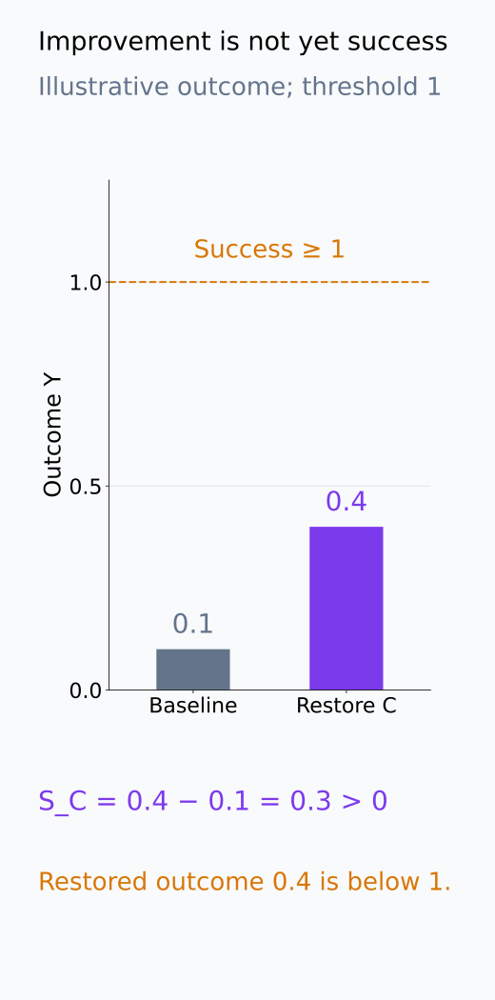
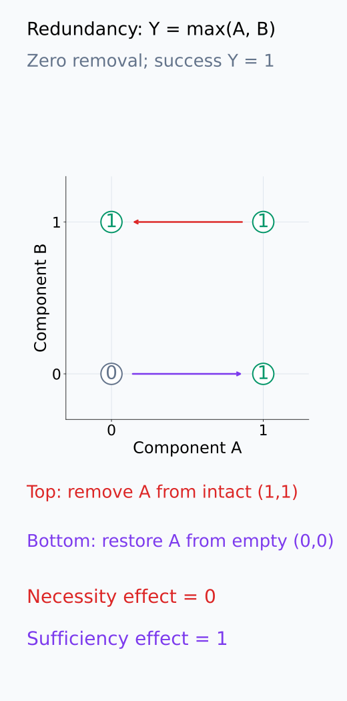
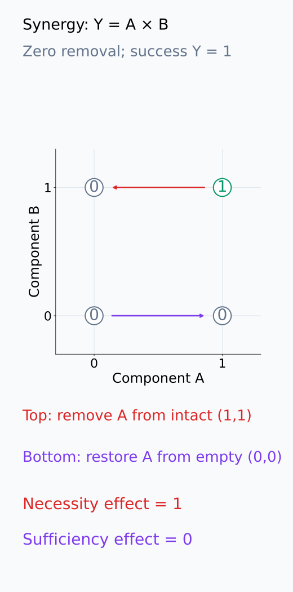
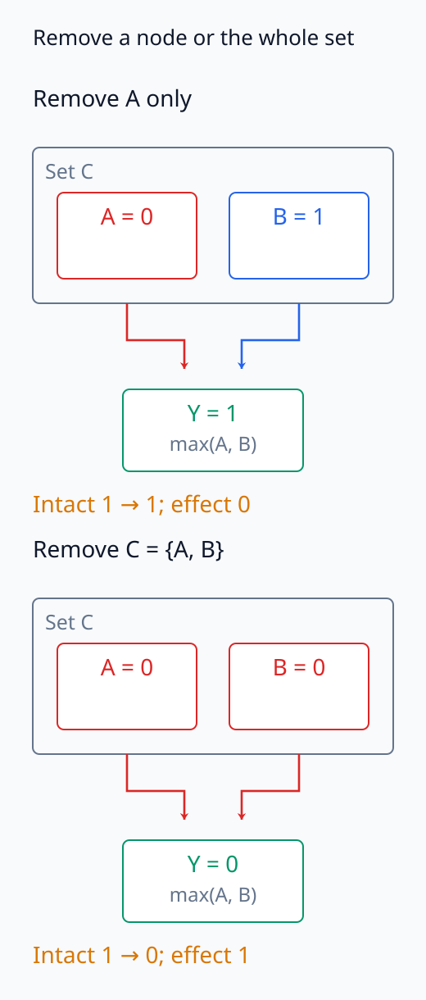

# I07-12. necessity와 sufficiency

## 이 단원이 필요한 이유

Component를 제거했을 때 행동이 무너지는지와, 빈약한 baseline에 그 component만 복원했을 때 행동이 나타나는지는 다른 질문이다. 앞은 necessity, 뒤는 sufficiency 증거다. 중복 경로가 있으면 필요하지 않지만 충분할 수 있고, 여러 요소가 함께 있어야 하면 필요하지만 단독으로 충분하지 않을 수 있다.

## 학습 목표

- necessity와 sufficiency의 개입 조건을 각각 정의할 수 있다.
- redundancy와 synergy 반례를 계산할 수 있다.
- empty baseline과 intact baseline의 역할을 설명할 수 있다.
- 두 주장에 필요한 대조군을 따로 설계할 수 있다.

## 선수지식 확인

- 선수 단원: [I07-11 circuit을 그래프로 표현하기](I07-11-circuit-graph.md)
- 확인 질문: 전체 model과 circuit에 같은 내부 제거를 적용하는 completeness 검사와, circuit 안 요소의 필요성을 평가하는 minimality 검사는 어떻게 다른가?

## 기호와 용어

| 기호·용어 | Common spoken reading | 의미 | shape·범위 |
|---|---|---|---|
| $Y_{\mathrm{intact}}$ | `Y intact` | 원래 계산의 outcome | scalar |
| $Y_{-C}$ | `Y with C removed` | 후보 $C$를 제거한 outcome | scalar |
| $Y_{+C\mid B}$ | `Y with C added to baseline B` | baseline $B$에 $C$만 복원한 outcome | scalar |
| necessity | `necessity` | 제거가 행동을 약화시키는 성질 | intervention claim |
| sufficiency | `sufficiency` | 복원이 행동을 만들어내는 성질 | intervention claim |

## 1. 두 효과

Necessity effect는 intact에서 후보를 제거한다.

$$
N_C=Y_{\mathrm{intact}}-Y_{-C}.
$$

Sufficiency effect는 명시한 baseline $B$에 후보를 복원한다.

$$
S_C=Y_{+C\mid B}-Y_B.
$$

$B$가 무엇인지에 따라 sufficiency가 달라진다. 나머지 모델을 mean ablation한 경우와 resampled 상태로 둔 경우는 다른 질문이다.

두 식의 출발점은 다르다. $N_C$에서는 나머지 intact 계산을 둔 채 $C$를 제거하고, $S_C$에서는 약화한 baseline을 둔 채 $C$만 복원한다. 위 부호는 outcome이 클수록 원하는 행동이 강하다는 기준에서 읽는다. $S_C$가 양수여도 행동 성공 기준에 도달하지 못했다면, 복원이 개선을 만들었다는 결과와 단독으로 충분했다는 판정을 구분한다. 원시 효과와 함께 제거·복원 뒤의 outcome 및 사전 성공 기준을 보고한다.

다음 그림은 양의 개선 효과와 사전 성공 기준 도달을 따로 읽는 방법을 보여 준다.

<figure class="lesson-figure" markdown="1">

<figcaption>설명용 outcome은 baseline 0.1에서 복원 후 0.4로 늘어 S_C = 0.3이다. 사전 성공 기준을 1 이상으로 정했다면 개선은 생겼지만 성공에 도달한 것은 아니다. 이 수치는 실제 model 실험 결과가 아니다.</figcaption>

</figure>

## 2. redundancy와 synergy

$Y=\max(A,B)$, $A=B=1$이면 A와 B 각각은 필요하지 않지만 빈 baseline에서 각각 충분하다. 반대로 $Y=A\cdot B$이면 둘 다 1일 때 각 요소는 필요하지만 혼자서는 충분하지 않다.

이 절의 $A,B$는 두 component의 값이며, 제거는 0으로 바꾸고 성공은 $Y=1$을 얻는 것으로 정한다. max 함수에서는 intact 값 1과 A 제거 뒤 $\max(0,1)=1$이 같아서 necessity effect는 0이다. 빈 상태에서 A만 복원하면 $\max(1,0)-\max(0,0)=1$이어서 성공한다. 곱 함수에서는 A 제거 뒤 $0\cdot1=0$이므로 effect는 1이지만, 빈 상태에서 A만 복원해도 $1\cdot0=0$이다. 두 요소가 함께 있어야 한다는 관계 때문에 단독 복원이 실패한다.

다음 두 상태 그림에서 위쪽 제거와 아래쪽 복원의 출발점 및 Y 변화를 비교한다.

<figure class="lesson-figure" markdown="1">

<figcaption>각 원 안의 숫자는 Y이고 축은 component A, B의 값이다. 위 빨간 화살표는 intact (1,1)에서 A를 제거해 (0,1)로 가도 Y = 1임을 보여 준다. 아래 보라 화살표는 empty (0,0)에 A를 복원해 (1,0)으로 가며 Y를 0→1로 만든다.</figcaption>

</figure>

<figure class="lesson-figure" markdown="1">

<figcaption>같은 축과 개입 방향을 Y = A×B에 적용했다. intact에서 A를 제거하면 Y가 1→0이어서 필요하지만, empty 상태에 A만 복원하면 B = 0이 남아 Y = 0이다. 여기의 두 효과는 서로 다른 출발점에서 계산한다.</figcaption>

</figure>

## 3. 집합 수준 주장

개별 node보다 circuit 집합 $C$가 분석 단위일 수 있다. 집합 제거와 집합 복원을 먼저 평가하고, 내부 minimality는 별도 분석한다. component별 p-value를 대량 보고하면서 집합 효과를 주장하지 않는다.

다음 그림에서는 개별 A 제거와 C 집합 전체 제거가 서로 다른 경로를 남기는지 확인한다.

<figure class="lesson-figure" markdown="1">

<figcaption>기존 max 회로에서 intact outcome은 1이다. A만 제거하면 B 경로가 남아 효과 0이지만, C = {A,B}를 함께 제거하면 두 값이 0이 되어 효과 1이다. 집합 효과는 각 node의 독립 p-value나 개별 제거 효과를 나열한 것과 다른 분석 대상이다.</figcaption>

</figure>

## 4. CPU 실습

<!-- I07_EXAMPLE: i07_12_necessity_sufficiency -->

중복된 두 경로의 max 회로에서 A는 개별적으로 필요하지 않지만 empty baseline에서 충분하다. joint ablation이 redundancy를 드러낸다.

## 흔한 오해

### 오해 1. 충분하면 필요하다

중복 경로가 있으면 한 경로가 단독으로 행동을 만들 수 있어도 제거했을 때 다른 경로가 대신한다.

### 오해 2. necessity와 sufficiency는 같은 baseline을 쓴다

Necessity는 intact에서 제거하고 sufficiency는 명시한 약화 baseline에 복원한다. 출발 조건이 다르다.

## 연습문제

### 1. redundancy

$Y=\max(A,B)$, $A=B=1$에서 A의 necessity effect를 구하라.

해설 보기

intact outcome은 1이고 A를 0으로 해도 B가 1이므로 outcome은 1이다. necessity effect는 0이다.

### 2. sufficiency

앞 회로에서 baseline $(A,B)=(0,0)$에 A만 1로 복원하면 sufficiency effect는 얼마인가?

해설 보기

baseline outcome은 0, 복원 outcome은 1이므로 effect는 1이다.

### 3. synergy

$Y=A\cdot B$, $A=B=1$에서 A는 필요한가, 단독으로 충분한가?

해설 보기

A를 제거하면 outcome이 0이므로 필요하다. empty baseline에서 A만 복원하고 B=0이면 outcome은 0이므로 단독으로 충분하지 않다.

### 4. baseline 의존성

Sufficiency 실험의 baseline을 바꾸면 결론이 달라질 수 있는 이유는 무엇인가?

해설 보기

후보가 작동하려면 다른 보조 경로가 필요할 수 있다. baseline이 그 경로를 유지하는지 제거하는지에 따라 복원 효과가 달라진다.

### 5. circuit 집합

집합 $C$가 필요하지만 각 node의 개별 효과가 작을 수 있는 이유를 설명하라.

해설 보기

집합 내부에 중복이 있으면 하나를 제거해도 나머지가 보상한다. 집합 전체를 제거하면 공통 기능이 사라진다.

### 6. 보고 문장

후보 circuit이 necessity와 sufficiency를 모두 통과했다. 안전한 결론을 써라.

해설 보기

정의한 입력, outcome, 제거·복원 baseline에서 그 circuit 집합이 행동에 필요하고 해당 baseline에서 충분했다는 증거를 얻었다고 쓴다. 모든 입력의 유일한 mechanism이라고 쓰지 않는다.

## 근거와 갱신 경계

Circuit의 faithfulness·completeness·minimality와 개입 평가 사례는 [Wang et al. (2022)](https://arxiv.org/abs/2211.00593)을 참고한다. Necessity와 sufficiency는 사용한 baseline과 입력 모집단을 생략하지 않는다.

## 단원 요약

- necessity는 intact에서 제거하고 sufficiency는 약화 baseline에 복원한다.
- redundancy는 충분하지만 필요하지 않은 경로를 만들 수 있다.
- synergy는 필요하지만 단독으로 충분하지 않은 요소를 만들 수 있다.
- node와 circuit 집합 수준의 주장을 구분한다.

## 통과 기준

- 두 effect를 다른 실험으로 정의할 수 있는가?
- redundancy와 synergy 반례를 계산할 수 있는가?
- baseline이 포함된 제한된 결론을 쓸 수 있는가?

## 다음 단원

- [I07-13 mediation과 counterfactual](I07-13-mediation-counterfactual.md)

## 집필자 점검표

- [x] 학습 목표가 관찰 가능한 행동으로 작성됐다.
- [x] necessity와 sufficiency의 baseline을 구분했다.
- [x] redundancy·synergy 반례를 포함했다.
- [x] 모든 문제에 해설이 있다.
- [x] 모델 해석 주장의 강도를 구분했다.
- [x] 용어집과 표기 규칙을 따랐다.
- [x] Common spoken reading이 실제 영어 학술 발화이며 한글 음역이나 기계적 직역을 포함하지 않는다.
- [x] 선수지식 밖의 내용을 몰래 요구하지 않는다.
- [x] 내부 링크와 수식 렌더링을 확인했다.
