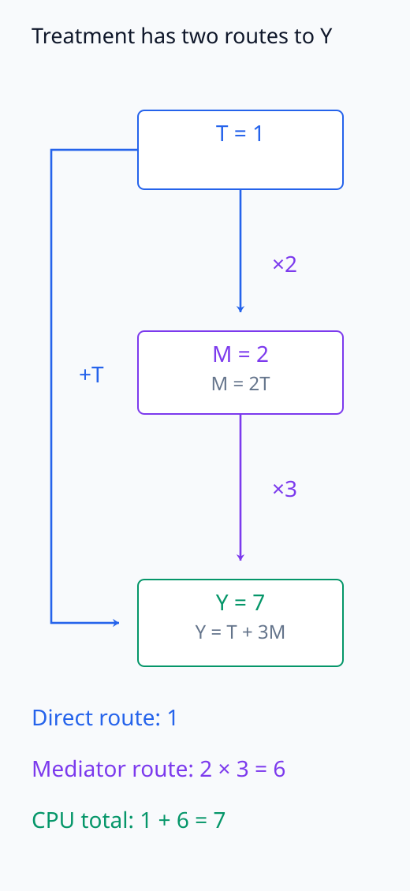
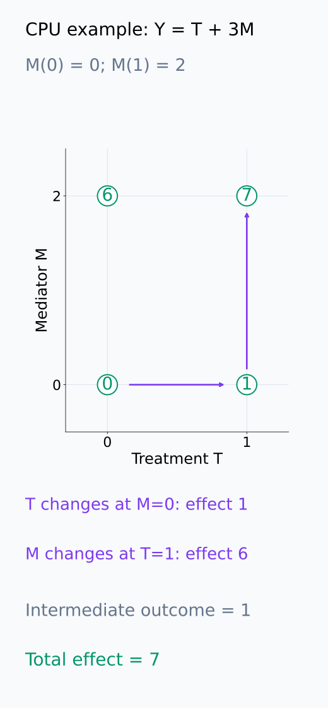
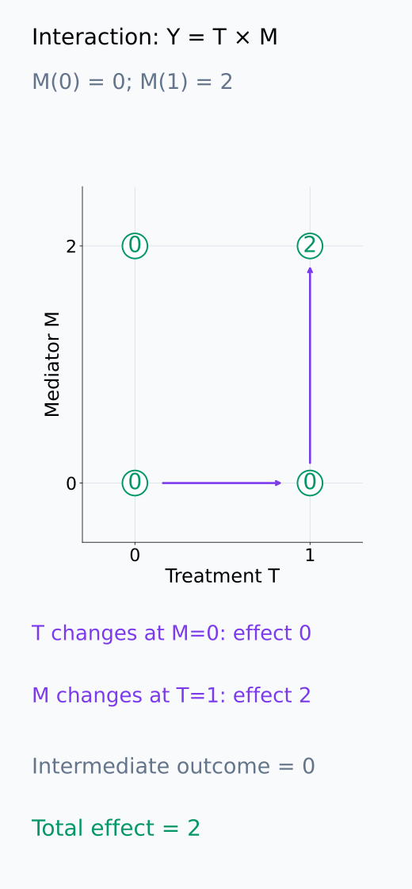
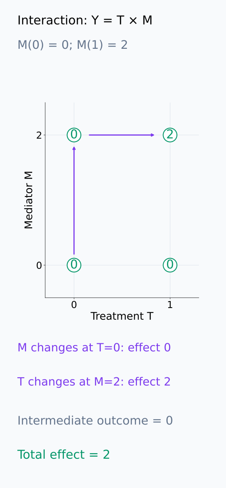
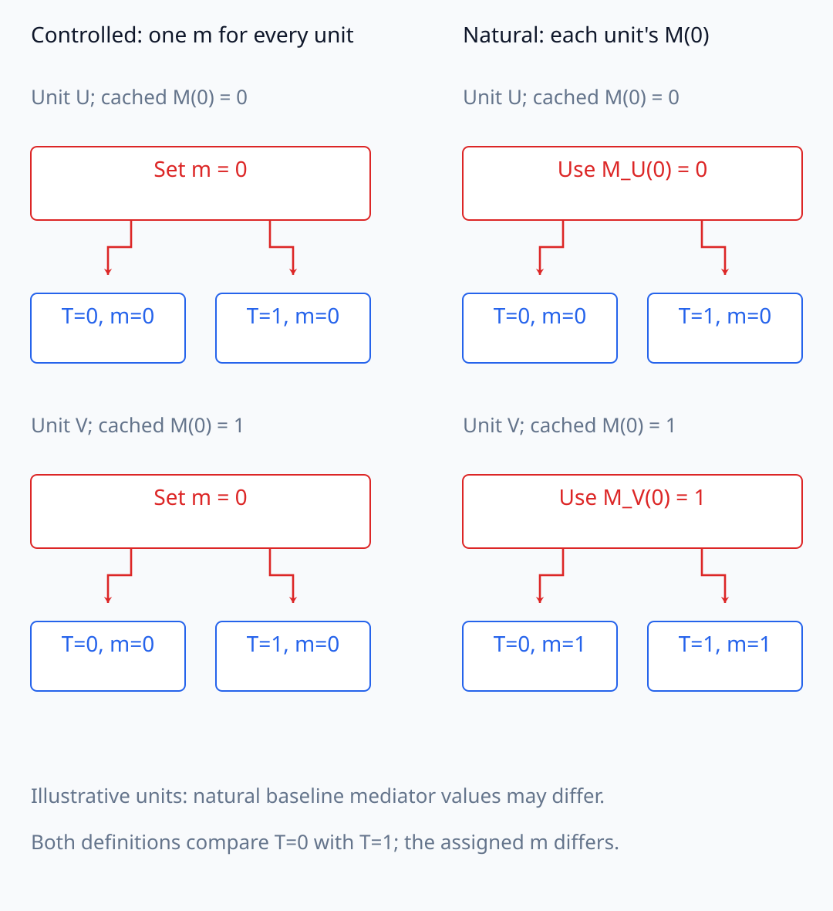
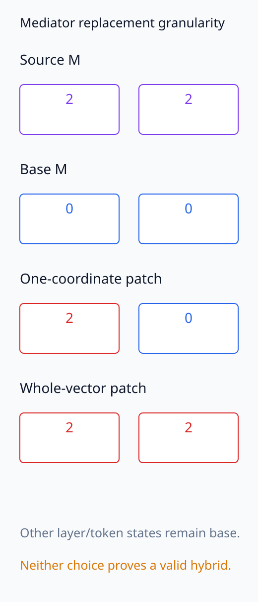

# I07-13. mediation과 counterfactual

## 이 단원이 필요한 이유

입력 변화가 출력에 미치는 효과 중 얼마가 특정 내부 mediator를 통해 흐르는지 묻는 것이 mediation 분석이다. 모델 내부에서는 counterfactual activation을 덮어쓸 수 있지만, direct·indirect effect의 정의는 어떤 treatment 상태와 mediator 값을 섞는지에 의존한다. 단순한 차이 분해와 통계적 식별을 같은 것으로 취급하지 않는다.

## 학습 목표

- treatment, mediator와 outcome을 계산 그래프에 표시할 수 있다.
- total·direct·mediated effect를 작은 구조방정식에서 계산할 수 있다.
- natural·controlled effect의 개입 차이를 설명할 수 있다.
- 모델 내부 mediation 결과의 범위를 제한할 수 있다.

## 선수지식 확인

- 선수 단원: [I07-12 necessity와 sufficiency](I07-12-necessity-sufficiency.md), [M04-16 상관, 예측과 인과](../../part-1-foundations/M04/M04-16-correlation-causation.md)
- 확인 질문: node 전체를 source 값으로 바꾸는 개입과 특정 edge message만 바꾸는 개입은 어떤 경로를 다르게 건드리는가?

## 기호와 용어

| 기호·용어 | Common spoken reading | 의미 | shape·범위 |
|---|---|---|---|
| $T$ | `T` | treatment 또는 입력 조건 | binary or categorical |
| $M(t)$ | `M of t` | treatment $t$ 아래 mediator 값 | tensor |
| $Y(t,m)$ | `Y of t m` | treatment와 mediator를 정한 counterfactual outcome | scalar |
| total effect | `total effect` | treatment 전체 변화 효과 | scalar |
| mediated effect | `mediated effect` | mediator 경로를 통해 전달된 효과 | scalar |

## 1. 구조와 counterfactual

$T\to M\to Y$와 $T\to Y$가 함께 있다고 하자.

같은 분석 단위에서 나머지 조건을 유지한 채 treatment를 바꾼 두 실행을 비교한다. $M(t)$는 treatment가 $t$일 때 원래 계산으로 얻은 mediator이고, $Y(t,m)$는 treatment를 $t$로 둔 실행에서 mediator만 $m$으로 강제 대체한 뒤 계산한 outcome이다.

Total effect는

$$
\operatorname{TE}=Y(1,M(1))-Y(0,M(0))
$$

이다. Treatment를 1로 고정한 상태에서 mediator만 $M(0)$에서 $M(1)$로 바꾸는 mediated effect는

$$
\operatorname{ME}_1=Y(1,M(1))-Y(1,M(0))
$$

이다. 이때 대응 direct effect를 $Y(1,M(0))-Y(0,M(0))$로 두면 두 차이의 합은 TE와 같다. 중간값 $Y(1,M(0))$이 더해졌다가 빠지므로 이 등식 자체에는 가산 구조를 가정할 필요가 없다.

하지만 분해가 유일한 것은 아니다. mediator를 $M(1)$에 고정한 direct effect와, treatment를 0에 고정한 mediated effect를 짝지어도 TE를 분해할 수 있다. $T$와 $M$의 상호작용이 있으면 두 방식의 개별 값이 달라진다. 합의 항등식과 어떤 조건에서 측정한 경로 효과인지를 구분한다.

다음 그림에서 treatment의 두 경로와 중간 counterfactual을 거치는 차이의 합을 추적한다. 상호작용 예시는 같은 total effect의 서로 다른 두 분해를 비교한다.

<figure class="lesson-figure" markdown="1">

<figcaption>기존 CPU 구조식 M = 2T, Y = T + 3M이다. T = 1일 때 직접 항은 1, mediator 항은 3×2 = 6으로 Y = 7을 만든다. 효과 분해의 값은 아래의 어떤 counterfactual 차이를 비교하는지와 함께 읽는다.</figcaption>

</figure>

<figure class="lesson-figure" markdown="1">

<figcaption>원 안의 숫자는 outcome이다. 아래쪽 T 변화는 Y(1,0) − Y(0,0) = 1이고, 오른쪽 M 변화는 Y(1,2) − Y(1,0) = 6이다. 중간값 1을 더했다 빼면 total effect 7이 된다.</figcaption>

</figure>

<figure class="lesson-figure" markdown="1">

<figcaption>기존 문제의 Y = T×M을 M(0) = 0, M(1) = 2에 적용했다. T를 먼저 바꾸면 direct effect 0, T = 1에서 M을 바꾸면 mediated effect 2다. total effect는 2다.</figcaption>

</figure>

<figure class="lesson-figure" markdown="1">

<figcaption>같은 네 outcome에서 왼쪽 M 변화를 먼저 계산하면 mediated effect 0이고, M = 2에 고정한 T 변화는 direct effect 2다. 합은 여전히 2지만 앞 그림의 개별 값과 다르므로 분해가 유일하다는 뜻은 아니다.</figcaption>

</figure>

## 2. controlled와 natural

Controlled direct effect는 mediator를 모든 단위에서 같은 $m$으로 고정한다. Natural effect는 각 treatment에서 자연히 생길 $M(t)$를 교차해서 사용한다. 후자는 한 단위가 동시에 두 treatment 아래 갖는 값을 포함하는 cross-world 정의이며 관찰자료 식별에는 추가 가정이 필요하다.

controlled 비교는 $Y(1,m)-Y(0,m)$처럼 같은 지정값을 두 실행에 넣는다. 위 direct effect는 대신 해당 단위의 $M(0)$를 넣는다. $M(0)$는 단위마다 다를 수 있어, 모든 단위에 하나의 $m$을 지정하는 실험과 다르다. 관찰자료에서 treatment별 사람이나 입력 집단을 고르는 것만으로는 같은 단위의 교차 outcome $Y(1,M(0))$를 직접 관측할 수 없다.

모델 내부에서는 두 forward pass에서 값을 얻어 교차 patch할 수 있지만, 그 hybrid state가 의미 있는 counterfactual인지 별도 검사가 필요하다.

다음 그림은 controlled 비교의 공통 m과 natural 비교의 단위별 M(0) 지정 위치를 나란히 보여 준다.

<figure class="lesson-figure lesson-figure--wide" markdown="1">

<figcaption>설명용 단위 U, V의 M(0)를 각각 0, 1로 두었다. controlled 비교는 모든 단위의 두 treatment 실행에 같은 m = 0을 지정하고, natural 비교는 각 단위 자신의 M(0)를 두 실행에 쓴다. 두 집단의 관찰 평균만으로 같은 단위의 hybrid outcome을 직접 관측했다는 뜻은 아니다.</figcaption>

</figure>

## 3. mediator의 granularity

Mediator를 한 neuron, head 전체, token별 residual vector 또는 subspace로 정의할 수 있다. 작은 단위는 정밀하지만 다른 상태와의 관계를 깨뜨릴 수 있고, 후보가 많아지면 다중비교 부담도 커진다. 큰 단위는 여러 경로를 함께 바꾼다.

한 좌표만 clean 값으로 바꾸면 같은 vector의 다른 좌표는 base 값으로 남는다. 전체 vector를 교체하면 vector 안의 관계는 source 실행대로 유지되지만, 다른 layer·token의 base 상태와 맞는지는 여전히 별도 문제다. 개입 크기가 작다는 사실이나 전체 vector를 썼다는 사실만으로 counterfactual의 타당성을 정하지 않는다.

다음 그림에서 한 좌표 교체와 전체 vector 교체가 가져오는 mediator 성분을 비교한다.

<figure class="lesson-figure" markdown="1">

<figcaption>설명용 source M = (2,2), base M = (0,0)이다. 한 좌표 교체는 (2,0)처럼 source와 base 성분을 섞고, 전체 vector 교체는 source 내부의 (2,2) 관계를 함께 가져온다. 다른 layer·token은 여전히 base 상태이므로 어느 선택도 hybrid 타당성을 자동 보장하지 않는다.</figcaption>

</figure>

## 4. CPU 실습

<!-- I07_EXAMPLE: i07_13_mediation_counterfactual -->

$M=2T$, $Y=T+3M$에서 total effect 7, direct effect 1, mediated effect 6을 계산한다. 합계 등식은 위에서 짝지은 차이들의 항등식이다. 이 가산 예제에서는 treatment와 mediator 사이의 상호작용이 없어, 어느 treatment에서 mediator 변화를 측정하는지에 따른 차이도 없다.

## 흔한 오해

### 오해 1. total effect는 언제나 direct와 indirect로 유일하게 나뉜다

상호작용과 effect 정의에 따라 분해가 달라질 수 있다. treatment를 어느 값에 고정했는지도 필요하다.

### 오해 2. mediator를 patch할 수 있으면 counterfactual이 타당하다

기술적으로 넣을 수 있다는 사실과 학습 분포에서 의미 있는 상태라는 사실은 다르다.

## 연습문제

### 1. total effect

$M=2T$, $Y=T+3M$에서 $T:0\to1$의 total effect를 구하라.

해설 보기

$T=0$이면 $M=0,Y=0$, $T=1$이면 $M=2,Y=7$이므로 total effect는 7이다.

### 2. mediated effect

$T=1$을 유지하고 mediator를 $M(0)=0$에서 $M(1)=2$로 바꿀 때 효과를 구하라.

해설 보기

$Y(1,2)-Y(1,0)=7-1=6$이다.

### 3. direct effect

Mediator를 $M(0)=0$에 고정하고 treatment만 0에서 1로 바꾸면 효과는 얼마인가?

해설 보기

$Y(1,0)-Y(0,0)=1-0=1$이다. 이 가산 예제에서는 direct 1과 mediated 6의 합이 total 7이다.

### 4. 상호작용

$Y=T\cdot M$이면 mediated effect가 treatment 고정값에 의존하는 이유를 설명하라.

해설 보기

$T=0$에 고정하면 mediator를 바꿔도 outcome은 0이다. $T=1$에서는 mediator 변화가 그대로 outcome에 나타난다.

### 5. 모델 개입

두 prompt의 head output을 교차 patch할 때 생길 수 있는 타당성 문제는 무엇인가?

해설 보기

다른 downstream state와 일관되지 않은 hybrid activation을 만들 수 있다. source·base 입력을 맞추고 manifold 거리나 resampled control을 검사한다.

### 6. 주장 작성

특정 head를 통한 mediated effect가 반복됐다. 안전한 결론을 써라.

해설 보기

정의한 treatment pair, mediator patch와 outcome에서 그 head 경로가 측정한 효과 일부를 매개했다는 증거를 얻었다고 쓴다. 인간 개념의 보편적 mediator라고 일반화하지 않는다.

## 근거와 갱신 경계

Language model 내부 component에 causal mediation을 적용한 방법은 [Vig et al. (2020)](https://proceedings.neurips.cc/paper_files/paper/2020/hash/92650b2e92217715fe312e6fa7b90d82-Abstract.html)을 기준으로 한다. 자연효과의 식별 가정과 모델 내부 hybrid state의 타당성을 분리한다.

## 단원 요약

- mediation은 treatment 효과가 내부 mediator를 통해 흐르는 부분을 묻는다.
- direct·mediated effect는 어떤 값을 고정하고 교차하는지에 의존한다.
- 짝지은 두 차이는 TE로 합쳐지지만 상호작용이 있으면 분해 방식별 개별 값은 달라진다.
- 실행 가능한 patch와 의미 있는 counterfactual은 다르다.

## 통과 기준

- 작은 구조방정식의 세 effect를 계산할 수 있는가?
- controlled와 natural effect를 구분할 수 있는가?
- mediator granularity와 타당성 한계를 쓸 수 있는가?

## 다음 단원

- [I07-14 off-manifold intervention](I07-14-off-manifold-intervention.md)

## 집필자 점검표

- [x] 학습 목표가 관찰 가능한 행동으로 작성됐다.
- [x] treatment·mediator·outcome을 정의했다.
- [x] effect 정의와 식별 한계를 구분했다.
- [x] 모든 문제에 해설이 있다.
- [x] 모델 해석 주장의 강도를 구분했다.
- [x] 용어집과 표기 규칙을 따랐다.
- [x] Common spoken reading이 실제 영어 학술 발화이며 한글 음역이나 기계적 직역을 포함하지 않는다.
- [x] 선수지식 밖의 내용을 몰래 요구하지 않는다.
- [x] 내부 링크와 수식 렌더링을 확인했다.
