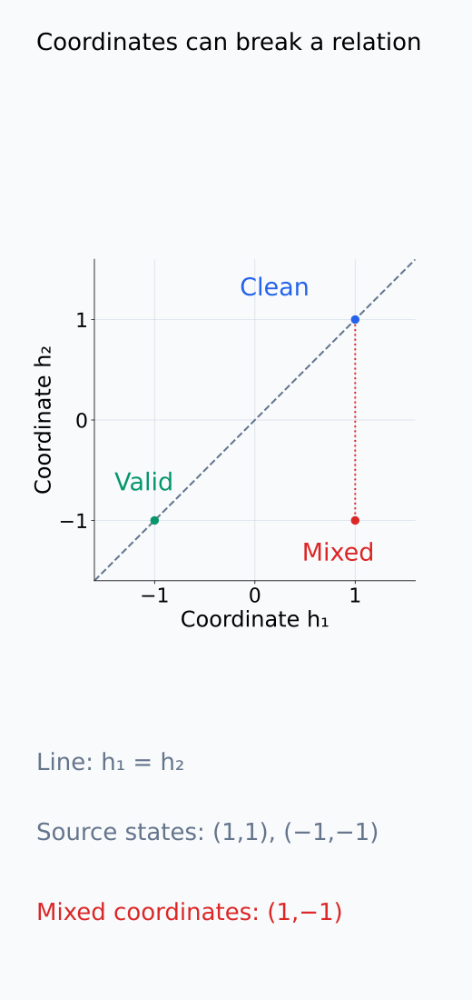
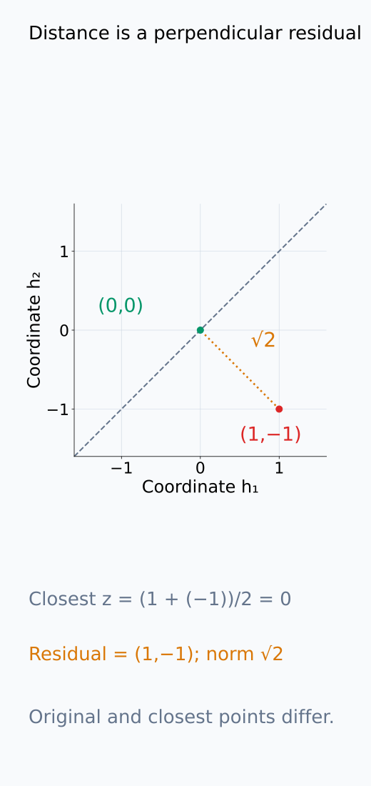
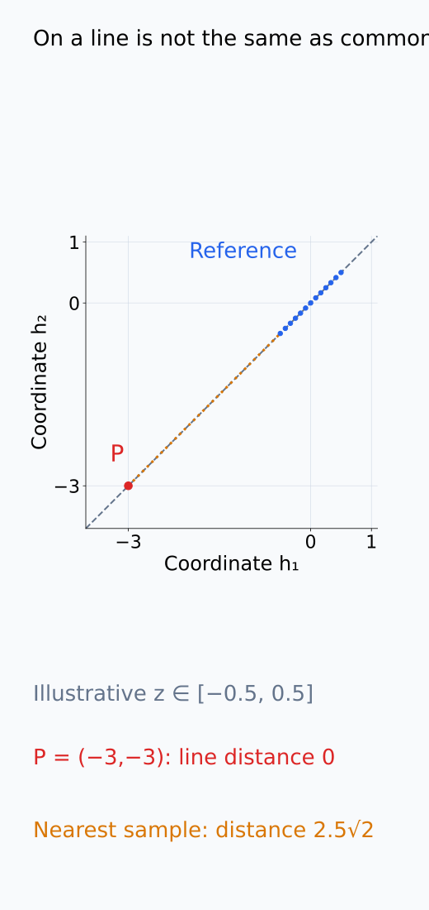
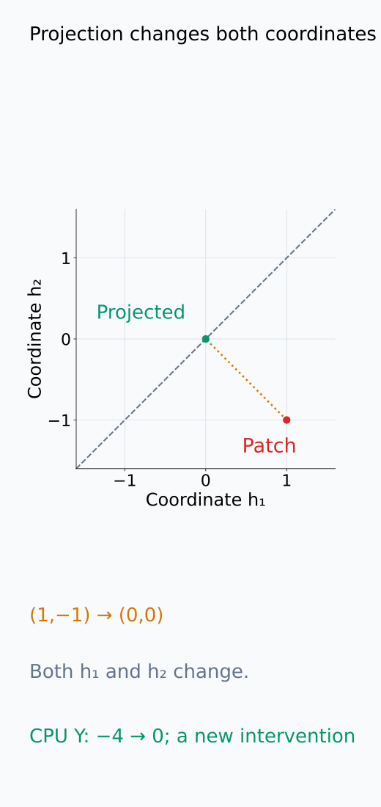
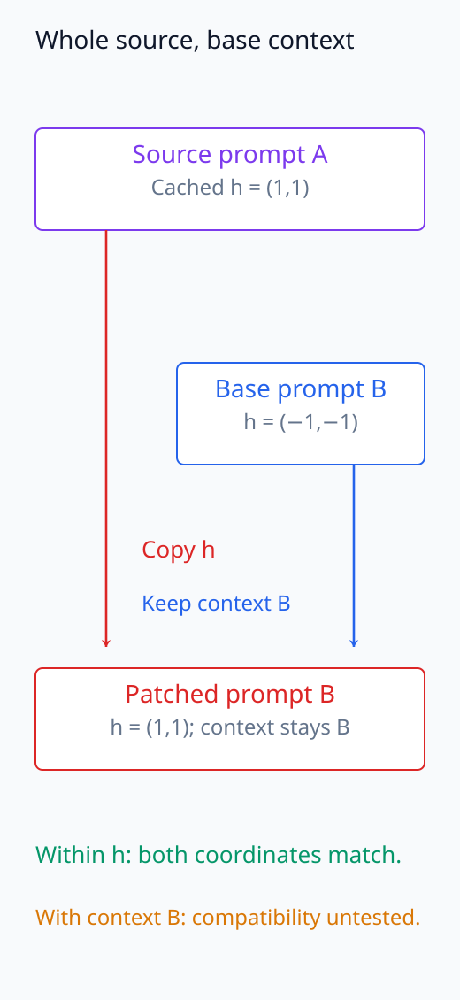
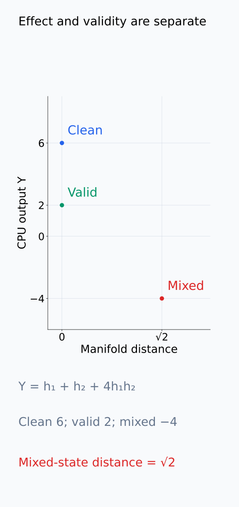

# I07-14. off-manifold intervention

## 이 단원이 필요한 이유

Neuron 하나만 0으로 만들거나 서로 다른 prompt의 좌표를 섞으면 학습 중 나타나지 않은 내부 상태를 만들 수 있다. Downstream model은 그런 상태에서 임의적인 출력을 낼 수 있다. 큰 intervention effect가 발견돼도 먼저 개입 상태가 원래 activation 분포와 얼마나 벗어났는지 확인해야 한다.

## 학습 목표

- activation manifold와 off-manifold 상태를 조작적으로 정의할 수 있다.
- 작은 예제에서 manifold distance를 계산할 수 있다.
- resample·projection·subspace intervention의 tradeoff를 설명할 수 있다.
- 개입 효과와 개입 타당성을 별도 표에 보고할 수 있다.

## 선수지식 확인

- 선수 단원: [I07-13 mediation과 counterfactual](I07-13-mediation-counterfactual.md), [I06-13 feature 안정성과 identifiability](../I06/I06-13-feature-stability-identifiability.md)
- 확인 질문: 두 실행의 activation 좌표를 일부씩 섞을 때 원래 공분산 구조가 깨질 수 있는 이유는 무엇인가?

## 기호와 용어

| 기호·용어 | Common spoken reading | 의미 | shape·범위 |
|---|---|---|---|
| $\mathcal M$ | `calligraphic M` | 관찰 activation이 놓인 집합·근사 manifold | subset of $\mathbb R^d$ |
| $\tilde h$ | `h tilde` | 개입으로 만든 activation | $\mathbb R^d$ |
| $d(\tilde h,\mathcal M)$ | `the distance from h tilde to calligraphic M` | 개입 상태의 manifold 거리 | nonnegative scalar |
| on-manifold | `on manifold` | 참조 activation 구조와 양립하는 상태 | validity label |
| off-manifold | `off manifold` | 참조분포에서 벗어난 상태 | validity warning |

## 1. 간단한 반례

관찰 activation이 항상 $h=(z,z)$ 꼴이면 manifold는 직선

$$
\mathcal M=\{(z,z):z\in\mathbb R\}
$$

이다. 두 좌표가 각각 어떤 값을 가질 수 있는지가 아니라, 같은 실행에서 두 값이 어떤 관계를 만족하는지가 핵심이다. $(1,1)$과 $(-1,-1)$은 모두 이 직선 위에 있지만, 첫 실행의 첫 좌표와 둘째 실행의 둘째 좌표를 섞은 $(1,-1)$은 원래 관계를 깨뜨린다.

직선까지의 거리는 직선 위에서 가장 가까운 점을 찾아 계산한다. $(h_1,h_2)$에 가장 가까운 점 $(z,z)$의 좌표는 두 좌표의 평균 $z=(h_1+h_2)/2$이다. 원래 점에서 이 점을 빼면 두 residual 좌표는 $(h_1-h_2)/2$와 그 음수가 된다. 따라서 residual의 Euclidean norm은

$$
d((h_1,h_2),\mathcal M)=\frac{|h_1-h_2|}{\sqrt2}
$$

이므로 $(1,-1)$의 거리는 $\sqrt2$이다.

이 예제의 $\mathcal M$은 좌표 관계를 표현하는 기하학적 집합이다. 실제 activation에서 모든 $z$가 똑같이 자주 나타난다는 뜻은 아니다. 직선 위에서도 참조 입력으로 거의 나오지 않는 값이 있을 수 있으므로, 거리 0과 참조분포에서 흔한 상태를 구분해야 한다. 실제 모델에서는 전체 activation 집합을 알 수 없어 관찰한 표본이나 그 근사로 이 관계를 추정한다.

다음 좌표 그림에서 좌표 혼합이 직선 관계를 깨는 위치와 가장 가까운 점까지의 residual을 확인한다.

<figure class="lesson-figure" markdown="1">

<figcaption>본문의 clean (1,1), valid (−1,−1)은 h₁ = h₂ 직선 위에 있다. 빨간 점 (1,−1)은 각 좌표가 실제 source 값이어도 그 둘의 결합이 관계를 만족하지 않는 반례다. 점선은 첫 좌표를 유지하며 둘째 좌표만 바꾼 비교다.</figcaption>

</figure>

<figure class="lesson-figure" markdown="1">

<figcaption>점 (1,−1)의 두 좌표 평균은 0이므로 가장 가까운 직선 위 점은 (0,0)이다. 주황 점선은 그 residual (1,−1)을 표시하며 길이는 √2다. 원래 점의 두 좌표를 같은 평균으로 바꾸어 얻은 정사영이다.</figcaption>

</figure>

## 2. 타당성 진단

- 참조 activation의 nearest-neighbor distance
- PCA residual 또는 covariance Mahalanobis distance
- decoder reconstruction error
- density model score
- downstream norm·normalization 통계
- 동일 의미를 가진 실제 source activation과의 비교

각 지표는 서로 다른 불일치를 측정한다. Nearest-neighbor distance는 관찰한 표본 중 가까운 상태가 있는지를 본다. 참조 표본이 드문 영역에서는 실제로 가능한 상태도 멀게 측정될 수 있다. PCA residual은 상위 subspace 밖으로 벗어난 성분을 측정한다. Subspace 안에서 지나치게 멀리 이동한 상태는 residual이 작아도 참조분포에서 드물 수 있다. Covariance 기반 거리는 좌표별 분산과 함께 나타나는 관계를 반영하지만, 그 공분산만으로 비선형 관계 전체를 표현하지는 못한다.

Decoder reconstruction error가 작다는 것은 decoder가 그 상태를 잘 재구성한다는 뜻이다. 실제 입력이 그 상태를 만든다는 보장은 아니다. 마찬가지로 downstream norm이 정상 범위에 있어도 정보의 조합이 정상이라고 단정할 수 없다. 어떤 참조 입력과 위치에서 만든 지표인지 고정하고, 지표가 확인하는 관계와 확인하지 못하는 관계를 구분한다.

다음 그림은 기하학적 직선 거리와 관찰 참조표본까지의 거리가 서로 다른 질문임을 보여 준다.

<figure class="lesson-figure" markdown="1">

<figcaption>참조 표본을 설명용 z ∈ [−0.5,0.5]의 직선 위 점들로 두었다. 기존 문제의 (−3,−3)은 직선 거리 0이지만 가장 가까운 참조점 (−0.5,−0.5)까지는 2.5√2다. 기하학적 관계 만족과 이 참조분포에서 흔한 상태라는 판단은 다르다.</figcaption>

</figure>

## 3. 완화 방법

- 다른 실제 입력에서 얻은 activation을 resample한다.
- feature subspace 안에서 이동하고 나머지는 조건부 복원한다.
- decoder를 거쳐 reconstruction한 값을 사용한다.
- 여러 baseline과 patch granularity로 sensitivity analysis를 한다.

전체 source activation을 resample하면 source 내부 좌표들의 관계를 함께 가져올 수 있다. 하지만 이를 받는 base 실행의 다른 상태는 그대로이므로 두 실행 사이의 문맥 불일치는 남는다. Subspace 개입은 바꿀 성분을 좁히지만, 나머지 성분과의 의존 관계까지 자동으로 보존하지는 않는다.

Projection이나 reconstruction으로 원래 개입값을 바꾸면 출력 효과가 달라진 이유도 다시 구분해야 한다. 위 예제에서 $(1,-1)$을 직선에 정사영하면 $(0,0)$이 된다. 거리는 줄었지만 두 좌표를 모두 바꿨으므로, 첫 좌표만 교체한 원래 실험과 같은 개입이 아니다. 조건부 복원도 지우려던 정보와 연결된 성분을 다시 채울 수 있다. 따라서 효과와 거리 지표뿐 아니라 보정 전후에 실제로 어떤 값을 교체했는지를 함께 보고한다.

다음 그림에서 정사영 전후의 실제 좌표 변화와 whole-source를 받아도 남는 base 문맥을 각각 확인한다.

<figure class="lesson-figure" markdown="1">

<figcaption>원래 patch (1,−1)을 (0,0)으로 정사영하면 두 좌표를 모두 바꾼다. 기존 CPU 함수 Y = h₁ + h₂ + 4h₁h₂의 출력도 −4→0으로 변한다. 거리 감소와 효과 변화는 확인할 수 있지만 첫 좌표만 교체한 원래 개입과 같은 실험은 아니다.</figcaption>

</figure>

<figure class="lesson-figure" markdown="1">

<figcaption>source A의 h = (1,1) 전체를 base B의 h = (−1,−1)에 복사한다. source vector 안의 좌표 관계는 함께 가져오지만 나머지 prompt B 문맥은 그대로다. 좌표 조합의 문제를 줄이는 것과 base 문맥과의 양립성을 검증하는 것은 별도다.</figcaption>

</figure>

## 4. CPU 실습

<!-- I07_EXAMPLE: i07_14_off_manifold -->

합성 manifold 위의 clean·valid counterfactual과 좌표 혼합 patch를 비교한다. Off-manifold patch의 downstream output이 크게 달라도 의미 있는 counterfactual이라고 결론 내리지 않는다.

다음 그림은 기존 CPU 예시의 output과 manifold 거리를 서로 다른 축에 놓는다.

<figure class="lesson-figure" markdown="1">

<figcaption>기존 CPU 함수에서 clean (1,1)은 output 6, valid (−1,−1)은 2, 좌표 혼합 (1,−1)은 −4다. 앞의 두 점은 직선 거리 0이고 혼합점만 √2다. clean 대비 output 변화가 −10으로 커도 혼합점의 counterfactual 타당성이 자동으로 입증되지는 않는다.</figcaption>

</figure>

## 흔한 오해

### 오해 1. 큰 효과는 강한 causal evidence다

분포 밖 상태에 대한 비정상 반응일 수 있다. 효과 크기와 개입 타당성은 별도 축이다.

### 오해 2. 실제 activation에서 좌표를 가져왔으니 on-manifold다

좌표별 source가 다르면 결합이 한 번도 관찰되지 않은 상태일 수 있다.

## 연습문제

### 1. 거리 계산

$h=(2,0)$의 $\mathcal M=\{(z,z)\}$까지 거리를 구하라.

해설 보기

$|2-0|/\sqrt2=\sqrt2$이다.

### 2. on-manifold 판정

점 $(-3,-3)$은 위 manifold 위에 있는가?

해설 보기

$z=-3$으로 쓸 수 있으므로 manifold 위에 있고 거리는 0이다.

### 3. coordinate patch

실행 A의 첫 좌표와 실행 B의 둘째 좌표를 합치는 것이 위험한 이유를 설명하라.

해설 보기

각 좌표는 실제 값이어도 둘의 결합은 학습된 공분산과 feature 관계를 깨뜨릴 수 있다.

### 4. 진단 선택

선형 subspace 근사에서 사용할 수 있는 off-manifold 진단은 무엇인가?

해설 보기

PCA 상위 subspace에 정사영한 뒤 남는 residual norm을 사용할 수 있다. 비선형 manifold에는 제한적임을 함께 적는다.

### 5. resampling

실제 source activation 전체를 patch하면 어떤 문제를 줄이고 무엇은 남기는가?

해설 보기

좌표 조합의 비현실성은 줄인다. 그러나 source와 base의 문맥 불일치, downstream state와의 hybrid 문제는 남는다.

### 6. 보고 방식

큰 effect와 큰 manifold distance가 함께 나왔다. 결론을 어떻게 제한해야 하는가?

해설 보기

개입이 출력을 크게 바꿨지만 참조 activation 분포에서 멀어 mechanism 증거로 해석하기 어렵다고 보고한다. 더 현실적인 patch로 재검증한다.

## 근거와 갱신 경계

Activation patching 방법 선택이 localization을 바꾼다는 실증은 [Zhang and Nanda (2023)](https://arxiv.org/abs/2309.16042), causal abstraction의 aligned intervention 조건은 [Geiger et al. (2021)](https://arxiv.org/abs/2106.02997)을 기준으로 한다. Manifold 진단 하나를 보편적 타당성 증명으로 쓰지 않는다.

## 단원 요약

- 좌표별 개입은 관찰 activation 관계를 깨뜨릴 수 있다.
- 큰 output effect와 on-manifold 타당성은 다른 평가 축이다.
- 거리·reconstruction·resampling 등 여러 진단을 함께 본다.
- 실제 source activation도 base 문맥과 불일치할 수 있다.

## 통과 기준

- 간단한 manifold distance를 계산할 수 있는가?
- off-manifold 반례를 만들 수 있는가?
- 효과와 타당성을 분리해 보고할 수 있는가?

## 다음 단원

- [I07-15 대조군과 통계 검증](I07-15-controls-statistical-validation.md)

## 집필자 점검표

- [x] 학습 목표가 관찰 가능한 행동으로 작성됐다.
- [x] 효과 크기와 개입 타당성을 분리했다.
- [x] 여러 manifold 진단의 한계를 포함했다.
- [x] 모든 문제에 해설이 있다.
- [x] 모델 해석 주장의 강도를 구분했다.
- [x] 용어집과 표기 규칙을 따랐다.
- [x] Common spoken reading이 실제 영어 학술 발화이며 한글 음역이나 기계적 직역을 포함하지 않는다.
- [x] 선수지식 밖의 내용을 몰래 요구하지 않는다.
- [x] 내부 링크와 수식 렌더링을 확인했다.
