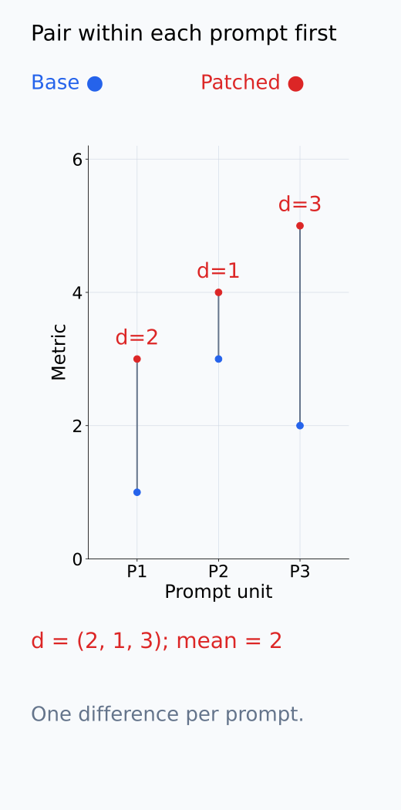
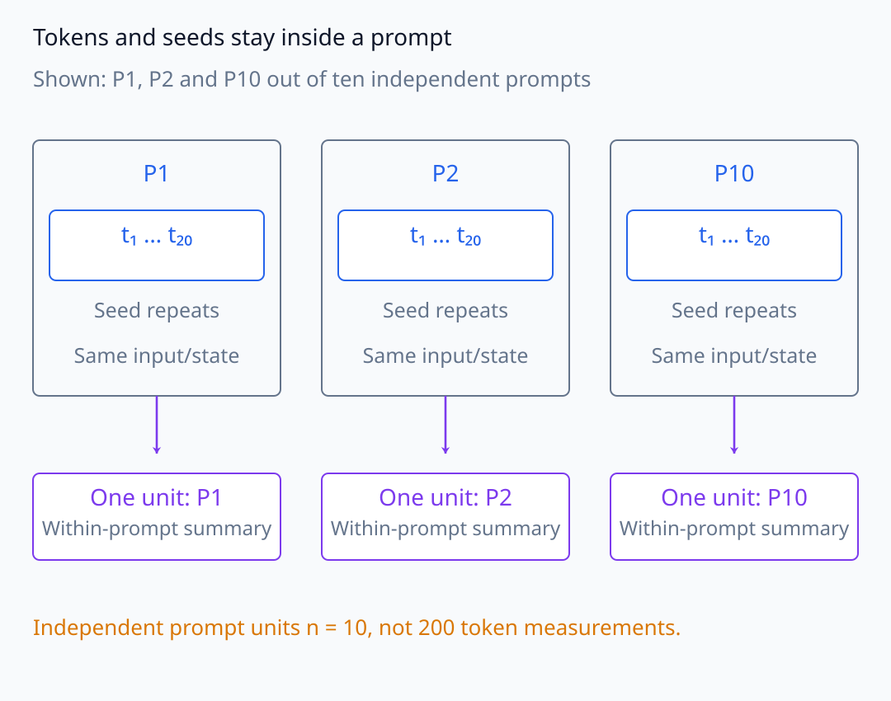
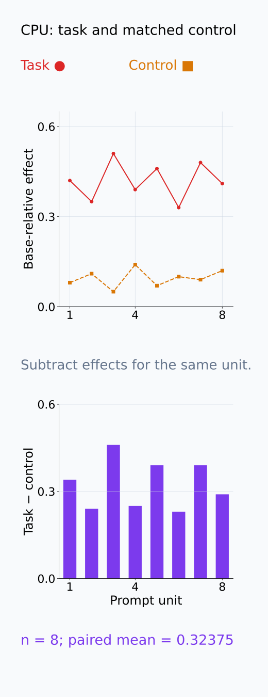
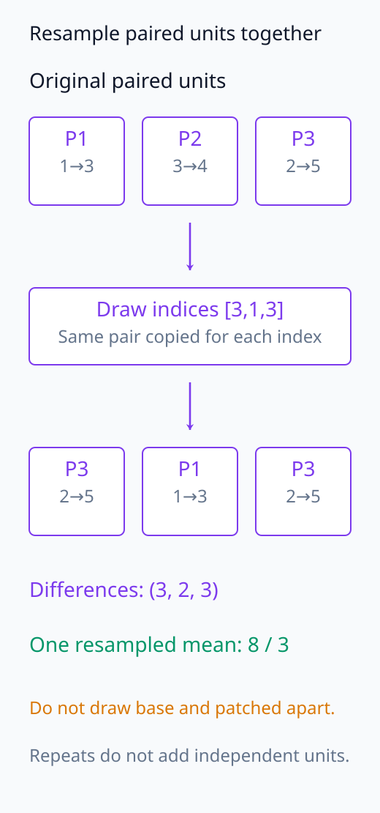
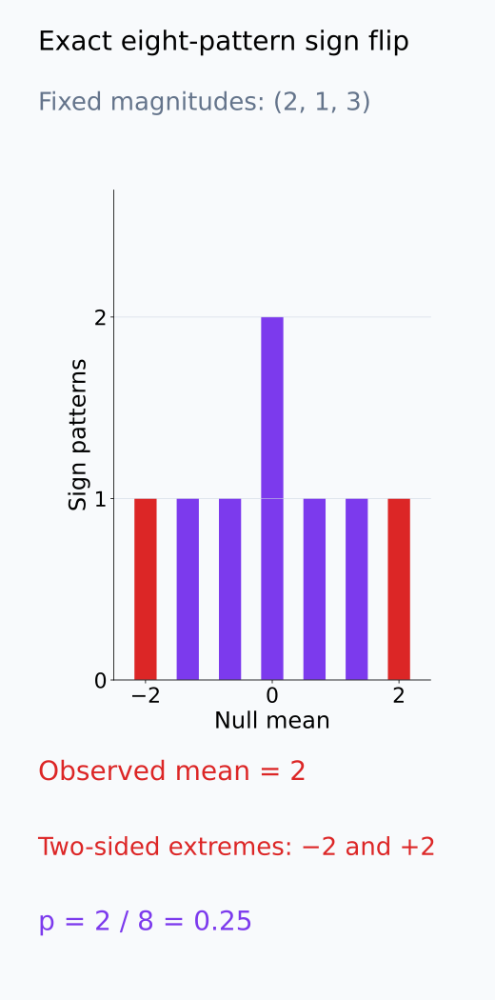
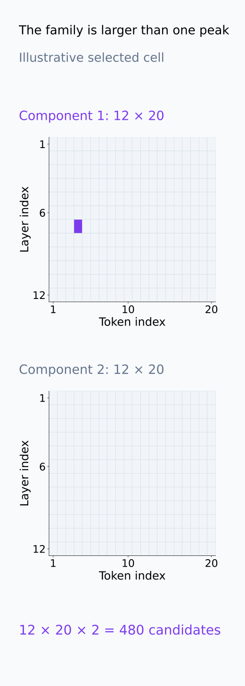

# I07-15. 대조군과 통계 검증

## 이 단원이 필요한 이유

한 prompt와 한 component에서 큰 patch effect를 얻는 것은 재현 가능한 circuit 증거가 아니다. 입력이 experimental unit인지, seed가 반복인지, token별 값이 독립 표본인지 먼저 정해야 한다. Matched control, paired design, 불확실성과 다중비교를 개입 설계에 연결한다.

## 학습 목표

- 개입 실험의 experimental unit을 정의할 수 있다.
- random·matched·resampled control을 목적별로 설계할 수 있다.
- paired effect의 평균, bootstrap interval과 sign-flip 검정을 해석할 수 있다.
- 위치 탐색과 confirmatory 평가를 분리할 수 있다.

## 선수지식 확인

- 선수 단원: [I07-14 off-manifold intervention](I07-14-off-manifold-intervention.md), [M04-17 실험 설계와 재현성](../../part-1-foundations/M04/M04-17-experimental-design-reproducibility.md)
- 확인 질문: 한 prompt 안의 여러 token effect를 독립 표본처럼 세면 pseudoreplication이 되는 이유는 무엇인가?

## 기호와 용어

| 기호·용어 | Common spoken reading | 의미 | shape·범위 |
|---|---|---|---|
| $d_i=y_i^{(1)}-y_i^{(0)}$ | `d sub i equals y sub i one minus y sub i zero` | unit $i$의 paired effect | scalar |
| $\bar d$ | `d bar` | paired effect 평균 | scalar |
| $H_0:\mathbb E[d]=0$ | `H naught: the expectation of d equals zero` | 평균 개입 효과가 0이라는 귀무가설 | hypothesis |
| sign-flip test | `sign flip test` | paired 차이 부호를 무작위화하는 검정 | randomization test |
| family-wise search | `family-wise search` | 여러 node·edge를 함께 탐색하는 분석 | comparison family |

## 1. 분석 단위

Prompt가 독립적으로 표집됐다면 같은 prompt의 intact와 patched metric 차이

$$
d_i=m_i^{\mathrm{patched}}-m_i^{\mathrm{base}}
$$

를 prompt별로 계산한다. 여기서 unit은 prompt이고 $d_i$는 그 unit에서 얻은 측정값이다. 같은 입력의 base와 patched 결과를 먼저 빼면 서로 다른 prompt의 원래 난이도 차이를 개입 효과에 섞지 않을 수 있다. 독립 prompt가 $n$개라면 평균 $\bar d=\frac1n\sum_{i=1}^n d_i$에서 각 prompt에 같은 가중치를 준다.

한 prompt의 20개 token을 20개 독립 unit로 세면 공통 입력과 forward state를 무시한다. 같은 prompt에 여러 corruption seed를 적용한 경우에도, 입력에 대한 평균 효과를 추정하려면 prompt별 seed 평균을 먼저 계산하거나 prompt 안의 반복을 함께 묶어 다룬다. Seed 수가 늘어나는 것은 같은 입력의 무작위 개입 효과를 더 자세히 측정하는 것이지, 새로운 입력을 표집하는 것이 아니다.

다음 그림에서 같은 prompt의 쌍을 먼저 비교하고, prompt 안의 token·seed 반복을 독립 unit과 구분한다.

<figure class="lesson-figure" markdown="1">

<figcaption>기존 문제의 base (1,3,2), patched (3,4,5)를 같은 prompt끼리 연결했다. 먼저 d = (2,1,3)를 만든 뒤 prompt별 같은 가중치로 평균 2를 계산한다. 서로 다른 prompt 사이를 연결한 차이가 아니다.</figcaption>

</figure>

<figure class="lesson-figure lesson-figure--wide" markdown="1">

<figcaption>기존 문제의 독립 prompt 10개 중 P1, P2, P10을 대표로 표시했다. 각 prompt 안의 20 token과 seed 반복은 같은 입력·forward state를 공유한다. prompt가 표집 단위라면 이를 묶어 처리한 독립 unit 수는 10이지 200이 아니다.</figcaption>

</figure>

## 2. control의 역할

- random location: 어디를 바꿔도 생기는 일반 교란과 비교
- magnitude-matched: activation 규모 차이와 비교
- resampled source: 특정 clean pair의 우연한 일치를 검사
- sham intervention: hook·복사 과정 자체의 변화를 검사
- label permutation: 행동 metric과 component 선택의 연결을 끊음

Control도 task condition과 같은 tuning budget을 사용한다.

선택 component의 특이적인 효과를 묻는다면 base 대비 task 효과만으로는 부족하다. 같은 prompt에서 task 개입 효과와 control 개입 효과를 각각 구한 뒤 두 값을 뺀다. 두 효과가 같은 base를 쓰면 base metric이 소거되어 task metric과 control metric의 차이가 된다. 두 개입이 모두 base 출력을 크게 바꾸더라도 이 차이가 0에 가까우면, 선택한 component가 control보다 더 큰 효과를 냈다는 근거는 약하다.

Matching은 무엇을 맞췄는지에 따라 해석이 달라진다. Activation norm을 맞추면 규모 차이를 줄일 수 있지만, 서로 다른 layer의 downstream 계산이나 token 역할까지 같아지는 것은 아니다. 비교할 속성과 대체 규칙은 결과를 본 뒤 유리하게 바꾸지 않고 고정한다.

다음 그림은 같은 unit의 task effect에서 matched-control effect를 빼는 기존 CPU 수치를 보여 준다.

<figure class="lesson-figure" markdown="1">

<figcaption>기존 CPU 실습의 8개 task effect와 matched-control effect를 위에서 비교하고, 아래에서는 같은 unit끼리 뺀 차이를 표시했다. 평균은 0.32375다. 두 값은 이미 각각 base 대비 효과이며 원래 raw metric 자체를 그린 것이 아니다.</figcaption>

</figure>

## 3. 불확실성과 검정

Paired bootstrap은 $n$개 unit index에서 복원추출로 $n$개를 뽑고, 선택한 unit의 $d_i$들로 평균을 다시 계산한다. 이를 반복해 평균의 변동을 근사한다. Base와 patched 값을 따로 재표집하면 같은 입력의 대응이 끊어지므로, 차이를 재표집하거나 원래 쌍을 함께 가져온다. 실습의 percentile interval은 재표집 평균의 2.5%와 97.5% 분위수로 만든다. Bootstrap 반복을 늘려도 독립 입력 수가 늘어나는 것은 아니다.

Sign-flip test에서는 각 unit의 차이 크기는 유지하고 양·음 부호를 무작위로 붙여 null 평균들을 만든다. 독립 unit의 차이가 귀무 아래 0을 중심으로 대칭이라는 조건이 필요하다. 평균이 0이라는 $H_0$만으로 이 대칭성이 따라오지는 않는다. 양측 검정은 null 평균의 절댓값이 관찰 평균의 절댓값 이상인 비율을 본다.

예를 들어 $d=(2,1,3)$이면 관찰 평균은 2이고 가능한 부호 조합은 $2^3=8$개다. 모두 양수인 조합과 모두 음수인 조합만 평균의 절댓값이 2이므로, 전체 조합을 열거한 양측 p-value는 $2/8=0.25$이다. 작은 표본에서 가능한 null 값이 얼마나 제한되는지 보여 준다. CPU 실습은 전체 열거 대신 4,096개 부호 조합을 무작위로 뽑고 보정된 비율을 계산한다.

다음 그림에서는 bootstrap이 같은 쌍을 함께 재표집하는 절차와 sign-flip이 차이의 크기를 유지하는 절차를 구분한다.

<figure class="lesson-figure" markdown="1">

<figcaption>기존 세 prompt 쌍을 설명용 bootstrap index [3,1,3]으로 복원추출했다. P3가 두 번 골라져도 base 2와 patched 5를 함께 가져오므로 차이는 (3,2,3), 재표집 평균은 8/3이다. base와 patched를 따로 뽑아 새로운 쌍을 만드는 절차가 아니다.</figcaption>

</figure>

<figure class="lesson-figure" markdown="1">

<figcaption>본문 d = (2,1,3)의 8개 가능한 부호조합을 모두 계산했다. 막대 높이는 해당 null 평균을 만드는 부호조합 수이며, 0에서는 두 조합이 겹친다. 관찰 평균의 절댓값 2 이상인 조합은 양끝 두 개라 p = 2/8 = 0.25다. CPU의 4,096회 무작위 근사와는 구분한다.</figcaption>

</figure>

## 4. 다중비교와 holdout

Layer×token×component를 훑어 peak를 찾았다면 그 전체가 selection family다. Discovery set에서 후보를 고르고 confirmatory set에서 위치와 metric을 고정해 평가한다. 같은 데이터를 여러 번 보며 후보를 바꾸면 holdout이 아니다.

후보별 효과가 서로 의존해도 가장 큰 값을 보고 선택했다는 사실은 남는다. 따라서 한 위치만 최종 보고했다고 해서 그 위치가 사전에 정해진 단일 검정이 되지는 않는다. Confirmatory 입력에서 후보를 다시 고르거나 metric을 바꿨다면 그 입력도 탐색에 사용한 셈이다. 어떤 선택을 discovery에서 마쳤고 어떤 비교만 confirmatory에서 수행했는지 구분해 기록한다.

다음 두 격자는 선택 위치 하나의 뒤에 있는 전체 탐색 family를 보여 준다.

<figure class="lesson-figure" markdown="1">

<figcaption>기존 문제의 12 layer×20 token×2 component 전체를 두 격자로 표시했다. 보라 셀은 설명용 선택 위치일 뿐 측정된 effect가 아니다. 보고할 peak가 하나여도 selection family는 480개이며 confirmatory 입력에서 위치나 metric을 다시 고르면 그 입력도 탐색에 사용한 것이다.</figcaption>

</figure>

## 5. CPU 실습

<!-- I07_EXAMPLE: i07_15_controls_statistics -->

8개 독립 unit의 task effect와 matched control을 paired하게 빼고 bootstrap 95% interval과 sign-flip p-value를 계산한다. 이 예제의 unit 수는 8이며 effect vector의 내부 숫자를 독립 표본으로 늘리지 않는다.

## 흔한 오해

### 오해 1. token 수가 많으면 표본 수도 많다

같은 prompt와 실행에서 나온 token은 강하게 의존한다. 표집 단위와 개입 배정 단위를 기준으로 experimental unit을 정한다.

### 오해 2. p-value가 작으면 circuit이 맞다

검정은 정의한 effect가 null과 양립하는지 평가할 뿐, graph의 완전성·타당성·일반화를 보장하지 않는다.

## 연습문제

### 1. paired effect

세 prompt의 patched metric이 $(3,4,5)$, base metric이 $(1,3,2)$일 때 $d_i$와 평균을 구하라.

해설 보기

$d=(2,1,3)$이고 평균은 2이다.

### 2. pseudoreplication

10개 prompt마다 20개 token effect가 있을 때 독립 unit이 자동으로 200개가 아닌 이유를 설명하라.

해설 보기

같은 prompt의 token은 입력, model state와 corruption을 공유한다. 독립 표집 단위가 prompt라면 기본 unit 수는 10이다.

### 3. matched control

큰 activation norm의 head를 선택한 실험에 적절한 control을 제시하라.

해설 보기

같은 layer에서 norm이나 output variance가 비슷한 head를 무작위 선택해 동일 개입을 적용한다.

### 4. sign flip

모든 paired difference의 부호를 뒤집어도 된다는 null 가정은 무엇을 뜻하는가?

해설 보기

귀무 아래 effect distribution이 0을 중심으로 대칭이라 양·음 부호가 교환 가능하다는 뜻이다.

### 5. selection family

12 layer×20 token×2 component를 탐색했다면 후보 검정 수는 얼마인가?

해설 보기

$12\times20\times2=480$이다. peak 하나만 보고해도 선택은 480개 family에서 일어났다.

### 6. 결과 해석

Effect interval이 0을 제외하지만 random control도 같은 크기다. 어떤 결론이 적절한가?

해설 보기

개입은 재현 가능한 변화를 만들었지만 선택 component에 특이적인 효과라는 증거는 없다. 일반적인 교란 또는 규모 효과를 배제하지 못했다고 쓴다.

## 근거와 갱신 경계

Activation patching의 metric·corruption 선택 민감성은 [Zhang and Nanda (2023)](https://arxiv.org/abs/2309.16042), circuit의 held-out 정량 검증은 [Wang et al. (2022)](https://arxiv.org/abs/2211.00593)을 기준으로 한다. 통계 검정은 실험 설계의 결함을 대체하지 않는다.

## 단원 요약

- 분석 단위는 표집·개입 배정 단위로 정한다.
- random·matched·resampled·sham control은 서로 다른 교란을 검사한다.
- paired bootstrap과 sign-flip test는 unit-level effect에 적용한다.
- 탐색 family와 confirmatory holdout을 분리해야 한다.

## 통과 기준

- experimental unit과 paired effect를 정의할 수 있는가?
- 목적이 다른 control을 설계할 수 있는가?
- selection family와 held-out 검증을 설명할 수 있는가?

## 다음 단원

- [I07-16 CoT faithfulness 평가](I07-16-cot-faithfulness.md)

## 집필자 점검표

- [x] 학습 목표가 관찰 가능한 행동으로 작성됐다.
- [x] experimental unit과 pseudoreplication을 구분했다.
- [x] control·paired design·다중비교를 연결했다.
- [x] 모든 문제에 해설이 있다.
- [x] 모델 해석 주장의 강도를 구분했다.
- [x] 용어집과 표기 규칙을 따랐다.
- [x] Common spoken reading이 실제 영어 학술 발화이며 한글 음역이나 기계적 직역을 포함하지 않는다.
- [x] 선수지식 밖의 내용을 몰래 요구하지 않는다.
- [x] 내부 링크와 수식 렌더링을 확인했다.
