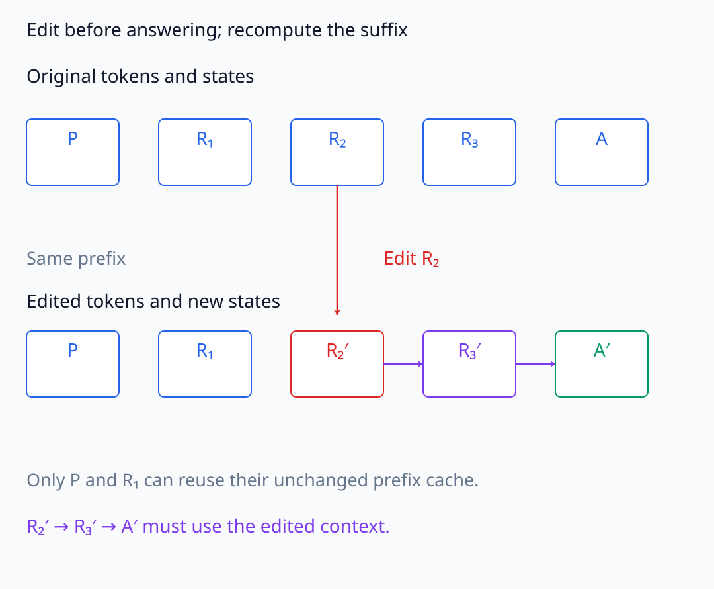
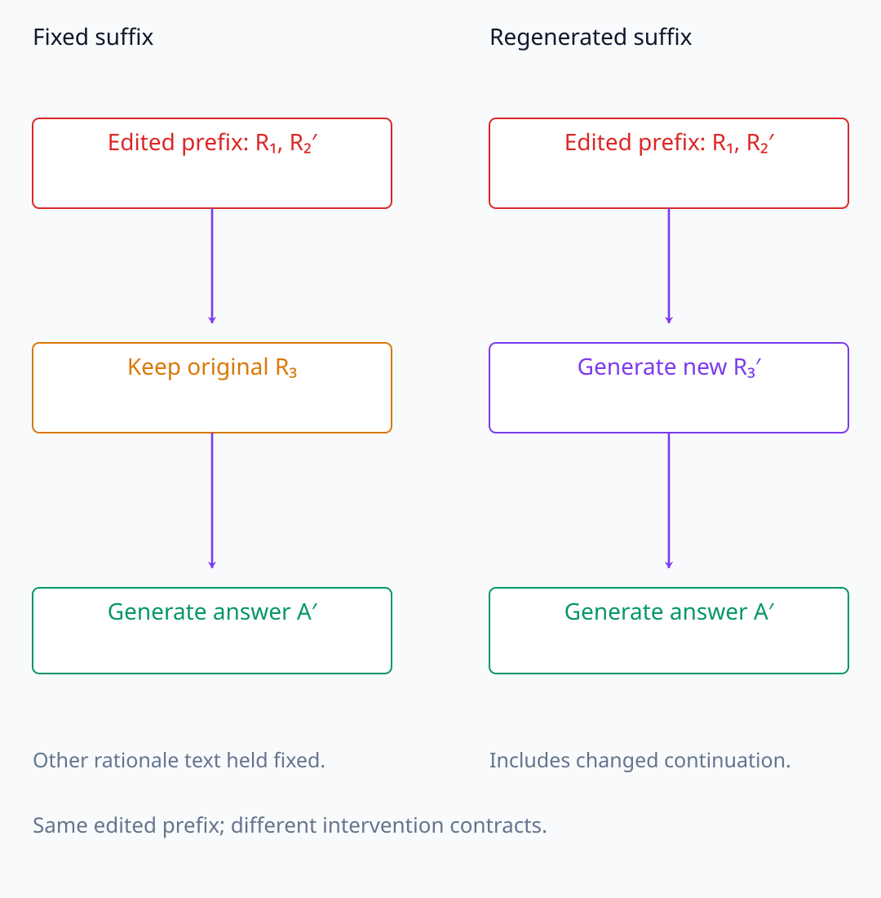
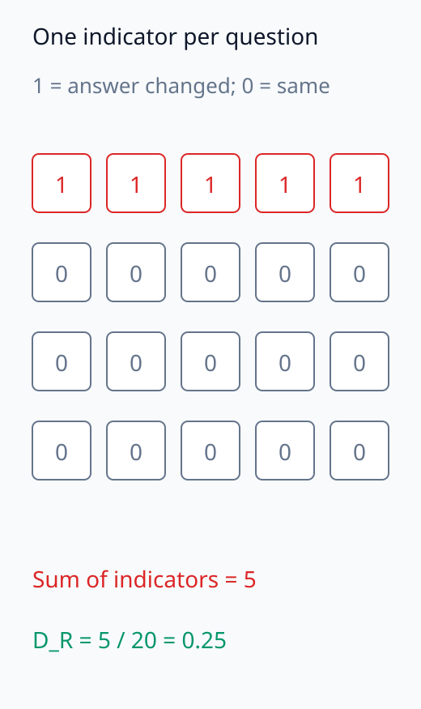
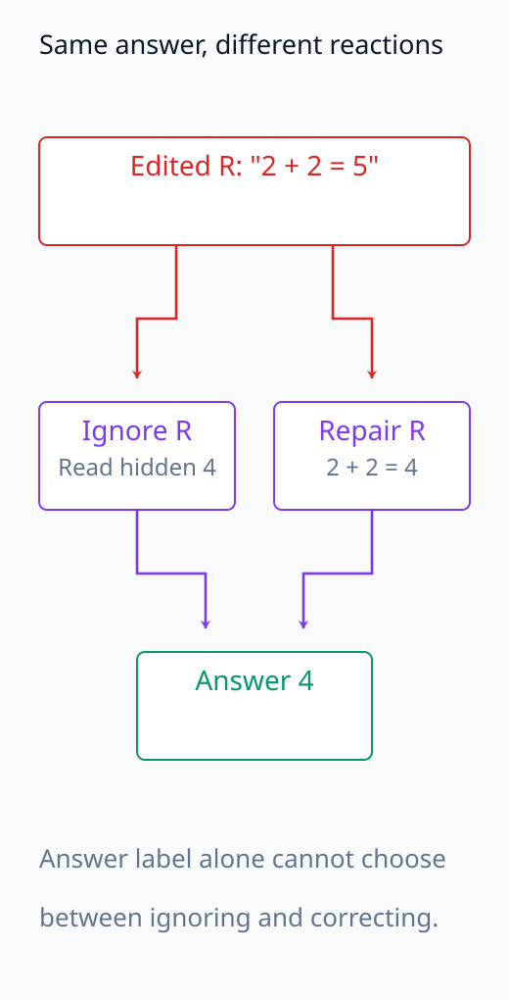
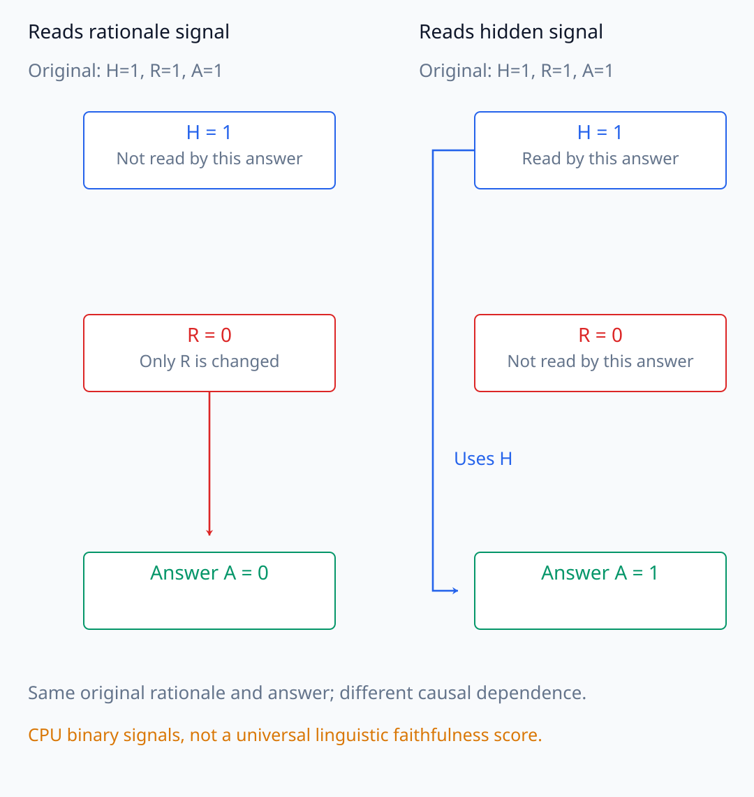

# I07-16. CoT faithfulness 평가

## 이 단원이 필요한 이유

Chain-of-thought(CoT)는 모델이 출력한 언어 문자열이다. 정답과 함께 그럴듯한 이유를 말한다고 해서 그 문자열이 답을 만든 내부 계산을 충실하게 보고한다는 보장은 없다. Faithfulness는 문장 품질보다 rationale을 바꾸거나 제거했을 때 답이 어떻게 달라지는지, 숨은 bias가 설명에 반영되는지 같은 관찰 가능한 검사로 다룬다.

## 학습 목표

- plausibility와 faithfulness를 구분할 수 있다.
- rationale intervention에 대한 answer dependence metric을 정의할 수 있다.
- truncation·paraphrase·error insertion 검사의 해석 범위를 설명할 수 있다.
- CoT와 내부 activation 증거를 같은 것으로 취급하지 않을 수 있다.

## 선수지식 확인

- 선수 단원: [I07-15 대조군과 통계 검증](I07-15-controls-statistical-validation.md), [N05-24 Chain-of-thought의 관찰 지위](../../part-2-neural-computation/N05/N05-24-chain-of-thought-observation-status.md)
- 확인 질문: 출력된 rationale과 그 rationale을 생성한 내부 계산이 같은 객체가 아닌 이유는 무엇인가?

## 기호와 용어

| 기호·용어 | Common spoken reading | 의미 | shape·범위 |
|---|---|---|---|
| $R$ | `R` | 출력된 rationale 문자열 | token sequence |
| $A$ | `A` | 최종 answer | token or label |
| $do(R=r')$ | `do R equals r prime` | rationale을 $r'$로 바꾸는 실험 | intervention |
| $D_R$ | `D sub R` | rationale 개입에 대한 answer dependence | scalar metric |
| plausibility | `plausibility` | 사람이 보기에 설명이 그럴듯한 정도 | judgment |
| faithfulness | `faithfulness` | 설명이 답 생성 요인을 반영하는 정도 | claim family |

## 1. 두 평가축

Plausibility는 문장이 논리적이고 읽기 좋은지 평가한다. Faithfulness는 그 문장이 모델의 답 생성 과정과 어떤 관계가 있는지 평가한다. plausible하지만 post-hoc인 설명과 어색하지만 답 계산에 실제로 사용된 scratchpad가 모두 가능하다.

## 2. 개입 검사

예를 들어 rationale을 유지·변형한 두 조건에서 답 변화율을

$$
D_R
=
\frac1N\sum_{i=1}^{N}
\mathbf 1\left[A_i(r_i)\ne A_i(r_i')\right]
$$

로 측정할 수 있다. $A_i(r_i)$는 문항 $i$에서 원래 rationale을 context로 주고 얻은 답이고, $A_i(r_i')$는 같은 문항에 변형한 rationale을 주고 다시 얻은 답이다. Indicator는 두 답이 다르면 1, 같으면 0이므로 합을 문항 수 $N$으로 나누면 바뀐 답의 비율이 된다. 여기서 답의 같고 다름은 표면 문자열인지 정규화한 answer label인지 미리 정해야 한다.

이 개입은 이미 나온 답은 그대로 둔 채 설명만 편집하는 작업이 아니다. 답이 생성되기 전에 rationale token을 교체하고 이후 계산을 다시 수행한다. 바꾼 token 이후에도 원래 rationale의 KV cache를 그대로 쓰면, 새 문자열을 실제로 읽은 조건과 다른 내부 상태를 비교하게 된다. Model weights와 문항, answer 추출 규칙, decoding 조건을 맞춘다. Sampling을 사용한다면 같은 rationale을 두 번 줘도 답이 달라질 수 있으므로, rationale을 바꾸지 않은 반복 조건과도 비교한다.

높은 $D_R$은 답이 그 개입에 민감하다는 뜻이다. 원래 rationale의 모든 문장이 참된 내부 설명이라는 뜻은 아니다. 반대로 의미를 보존한 paraphrase에서 $D_R$이 낮다면 같은 답을 유지하는 것이 예상되는 결과일 수 있다. 점수의 크기는 어떤 내용을 바꾼 실험인지와 함께 해석한다.

검사 종류는 다음과 같다.

- truncation: 앞부분만 남기거나 중간 이후를 제거
- paraphrase: 의미를 유지하고 표현을 바꿈
- error insertion: 중간 단계에 통제된 오류 삽입
- bias cue: 답을 유도하는 표면 feature를 넣고 설명이 이를 언급하는지 검사
- counterfactual rationale: 다른 답을 지지하는 rationale을 제공

중간 문장을 교체한 뒤 원래 뒷문장을 그대로 붙이는 실험과, 교체 지점에서 남은 rationale을 다시 생성하는 실험도 다르다. 전자는 나머지 문자열을 고정한 효과이고 후자는 후속 reasoning의 변화까지 포함한다. [Lanham et al. (2023)](https://arxiv.org/html/2307.13702v1#S2.SS4)의 오류 삽입 검사는 바꾼 단계 뒤의 rationale을 다시 생성한다. 어떤 후속 계산을 고정했는지 명시해야 같은 이름의 검사끼리 결과를 비교할 수 있다.

다음 그림에서 답 생성 전 편집 위치와 후속 재계산 범위를 확인하고, indicator가 세는 문항별 답 변화를 읽는다.

<figure class="lesson-figure lesson-figure--wide" markdown="1">

<figcaption>P는 문항, R₁–R₃는 설명용 rationale token 위치다. R₂를 답 생성 전에 바꾸면 P와 R₁의 같은 prefix는 재사용할 수 있지만 R₂′ 이후 상태와 답은 바뀐 context로 계산해야 한다. 원래 R₂ 이후의 KV cache를 그대로 사용하는 비교가 아니다.</figcaption>

</figure>

<figure class="lesson-figure lesson-figure--wide" markdown="1">

<figcaption>같은 R₂′ 뒤에 왼쪽은 원래 R₃를 그대로 붙이고 오른쪽은 R₃′를 새로 생성한다. 왼쪽은 다른 문자열을 고정한 효과, 오른쪽은 후속 rationale 변화까지 포함한 효과를 측정한다. 두 조건의 답이 같거나 다를지는 그림에서 가정하지 않는다.</figcaption>

</figure>

<figure class="lesson-figure" markdown="1">

<figcaption>기존 문제의 20문항 가운데 바뀐 다섯 답을 위줄에 모아 표시했다. 칸 하나는 사전 정의한 answer 비교 규칙의 indicator이며 합은 5다. 이를 문항 수 20으로 나누어 D_R = 0.25를 얻는다. 어느 실제 문항이 바뀌었는지의 순서를 나타낸 것은 아니다.</figcaption>

</figure>

## 3. 교란과 대조군

Rationale을 바꾸면 길이, token 확률과 prompt 형식도 함께 변할 수 있다. 길이·문체를 맞춘 무관한 문장, 의미 보존 paraphrase와 동일 token budget control을 둔다. 모델이 외부 제공 rationale을 따르는 능력과 스스로 생성한 CoT의 faithfulness도 구분한다.

오류를 삽입했는데 답이 그대로여도 모델이 그 문장을 무시했는지, 오류를 알아차리고 고쳤는지는 결과 label만으로 구분되지 않는다. 의미 보존 대조군이 정말 같은 주장을 유지하는지도 확인해야 한다. 답을 직접 적은 마지막 문장을 남긴 채 앞 설명만 paraphrase했다면, 동일한 답을 단순히 복사하는 경로가 남을 수 있다. 대조군은 token 수뿐 아니라 답 단서가 어디에 남는지까지 맞춰 설계한다.

다음 반례에서 같은 답 유지가 오류 문장을 무시한 것인지 고친 것인지 구분해 주는지 살펴본다.

<figure class="lesson-figure" markdown="1">

<figcaption>설명용 오류 문장 “2 + 2 = 5” 뒤 답 4가 유지되는 두 가능성을 그렸다. 왼쪽은 해당 문장을 무시하고 이미 있는 정답을 읽고, 오른쪽은 오류를 고쳐 계산한다. 같은 최종 label만으로 둘을 고를 수 없으며 실제 모델에서 이 두 경로를 확인한 결과가 아니다.</figcaption>

</figure>

## 4. 내부 증거와의 관계

CoT intervention은 행동 수준 검사다. Activation patching과 circuit 분석은 내부 node 수준 검사다. 둘이 일치하면 더 강한 triangulation이 되지만, CoT token과 특정 내부 feature를 일대일로 대응시키려면 별도 정렬 가설과 개입이 필요하다.

## 5. CPU 실습

<!-- I07_EXAMPLE: i07_16_cot_faithfulness -->

같은 원래 rationale을 출력하는 두 합성 모델을 비교한다. 하나는 rationale signal을 답에 사용하고, 다른 하나는 hidden signal로 답한 뒤 rationale을 붙인다. Rationale을 바꾸었을 때 첫 모델의 답만 변한다.

실습에서 원래 두 signal은 모두 1이므로 두 모델의 답이 같다. Rationale signal만 0으로 바꾸면 이를 읽는 함수는 0을 답하고, hidden signal을 읽는 함수는 여전히 1을 답한다. 같은 원래 문자열과 답만 관찰해서는 이 두 의존 관계를 구분할 수 없다는 합성 반례다. 실제 CoT의 언어적 충실성을 이 이진 signal 예제 하나로 측정한 것은 아니다.

다음 그림은 같은 원래 signal과 답을 내는 두 CPU 합성 모델의 개입 후 의존 관계를 비교한다.

<figure class="lesson-figure lesson-figure--wide" markdown="1">

<figcaption>기존 CPU 합성 모델 두 개는 원래 H = R = 1이어서 같은 답 1을 낸다. R만 0으로 바꾼 뒤 rationale를 읽는 왼쪽 함수는 0, H를 읽는 오른쪽 함수는 1을 답한다. 같은 원래 문자열과 답만으로 이 두 의존 관계를 구분할 수 없다는 반례이며 실제 언어적 faithfulness의 점수가 아니다.</figcaption>

</figure>

## 흔한 오해

### 오해 1. CoT가 정답이면 faithful하다

정답과 일치하는 사후 합리화도 가능하다. 답 생성 요인과의 관계를 개입으로 검사해야 한다.

### 오해 2. rationale을 바꿔도 답이 같으면 unfaithful하다

동일한 정보를 다른 내부 경로가 보존하거나 개입이 약할 수 있다. Null result의 검출력과 의미 보존 여부를 확인한다.

## 연습문제

### 1. 평가축

문법적으로 완벽하지만 답을 낸 뒤 생성된 설명은 plausible한가, faithful한가?

해설 보기

사람에게 plausible할 수 있다. 답 생성에 사용되지 않았다면 process faithfulness 증거는 없다.

### 2. dependence 계산

20개 문항 중 rationale 개입 뒤 5개 답이 바뀌었다. $D_R$은 얼마인가?

해설 보기

$5/20=0.25$이다.

### 3. paraphrase control

오류 삽입 조건과 함께 의미 보존 paraphrase 조건이 필요한 이유는 무엇인가?

해설 보기

답 변화가 오류 의미 때문인지 단순한 문구·길이 변화 때문인지 구분할 수 있다.

### 4. truncation 한계

CoT 뒤 절반을 잘라도 답이 같았다. 가능한 해석 두 가지를 적어라.

해설 보기

뒤 절반이 답에 필요하지 않았거나, 앞부분 또는 hidden state에 필요한 정보가 이미 들어 있을 수 있다. 전체 CoT가 unfaithful하다고 단정할 수 없다.

### 5. bias cue

답이 option 순서에 따라 바뀌지만 CoT가 순서를 언급하지 않았다. 무엇을 시사하는가?

해설 보기

답에 영향을 준 관찰 가능한 cue가 설명에서 누락됐으므로 그 CoT가 결정 요인을 완전하게 보고하지 않을 가능성을 지지한다.

### 6. 내부 연결

CoT 문장 하나를 특정 attention head와 동일시하려면 무엇이 더 필요한가?

해설 보기

문장 내용과 head state의 정렬 가설, held-out 복원, head 개입이 해당 CoT 내용과 답을 선택적으로 바꾸는 증거가 필요하다.

## 근거와 갱신 경계

Biasing feature가 CoT 설명에 드러나지 않는 결과는 [Turpin et al. (2023)](https://arxiv.org/abs/2305.04388), truncation·error·paraphrase 계열 검사는 [Lanham et al. (2023)](https://arxiv.org/abs/2307.13702)을 기준으로 한다. 모델·과제별 차이가 크므로 하나의 검사 점수를 보편적 faithfulness 척도로 취급하지 않는다.

## 단원 요약

- CoT는 관찰 가능한 출력 문자열이며 내부 계산의 직접 기록이라고 가정하지 않는다.
- Plausibility와 faithfulness는 다른 평가축이다.
- Rationale intervention은 답의 의존성을 검사하지만 완전한 process 설명을 보장하지 않는다.
- 행동·내부 개입 증거를 연결하려면 추가 정렬 가설이 필요하다.

## 통과 기준

- plausibility와 faithfulness를 구분할 수 있는가?
- rationale dependence 실험과 control을 설계할 수 있는가?
- null·positive 결과의 범위를 제한할 수 있는가?

## 다음 단원

- [I07-17 종합 실습: 작은 circuit](I07-17-capstone-small-circuit.md)

## 집필자 점검표

- [x] 학습 목표가 관찰 가능한 행동으로 작성됐다.
- [x] CoT 관찰과 내부 계산을 구분했다.
- [x] rationale intervention과 control을 포함했다.
- [x] 모든 문제에 해설이 있다.
- [x] 모델 해석 주장의 강도를 구분했다.
- [x] 용어집과 표기 규칙을 따랐다.
- [x] Common spoken reading이 실제 영어 학술 발화이며 한글 음역이나 기계적 직역을 포함하지 않는다.
- [x] 선수지식 밖의 내용을 몰래 요구하지 않는다.
- [x] 내부 링크와 수식 렌더링을 확인했다.
