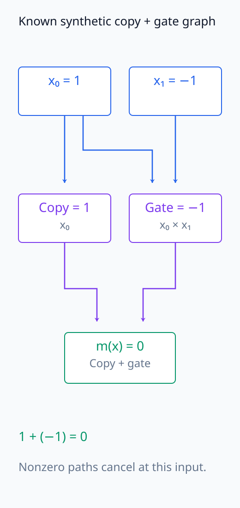
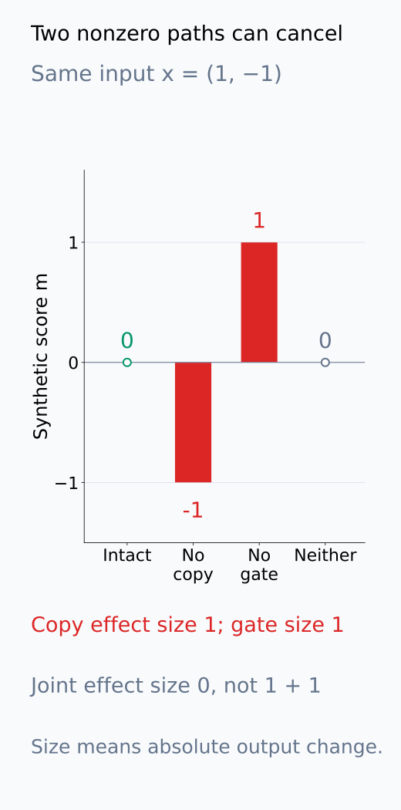
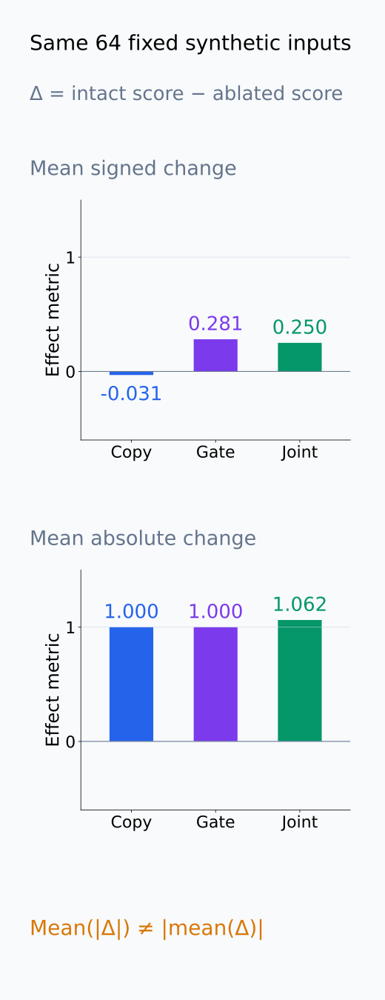
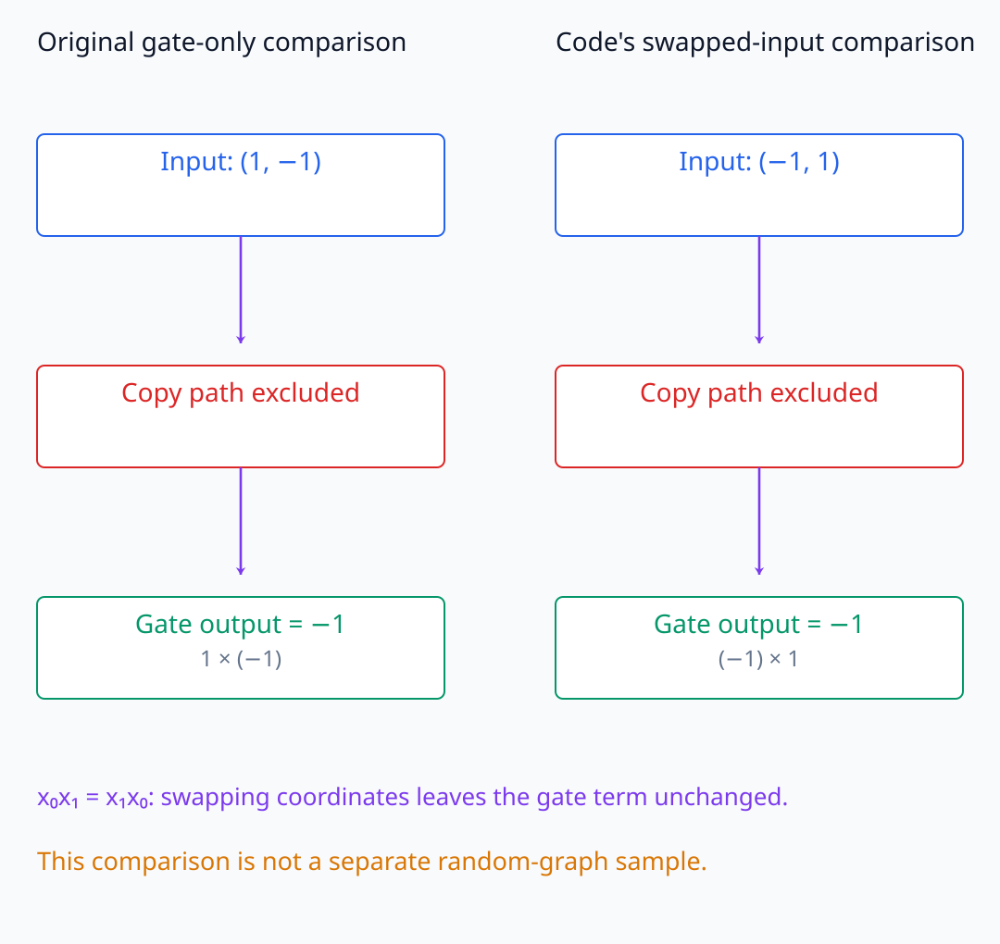

# I07-17. 종합 실습: 작은 circuit

## 이 단원이 필요한 이유

귀인 heatmap, patch effect와 component 목록을 따로 모아서는 circuit 보고서가 되지 않는다. 하나의 행동을 정의하고 node·edge 가설, discovery, necessity·sufficiency, off-manifold 진단, 대조군과 통계를 한 계약으로 연결해야 한다. 이 단원은 I07 전체를 재현 가능한 작은 circuit 보고서로 묶는다.

## 학습 목표

- 행동·입력 모집단·outcome을 사전 정의할 수 있다.
- node·edge graph와 각 개입의 estimand를 연결할 수 있다.
- necessity·sufficiency·faithfulness 검사를 held-out 데이터에 적용할 수 있다.
- 결과와 한계를 manifest·표·bounded claim으로 보고할 수 있다.

## 선수지식 확인

- 선수 단원: [I07-16 CoT faithfulness 평가](I07-16-cot-faithfulness.md)
- 확인 질문: discovery set에서 고른 peak effect를 같은 데이터의 confirmatory effect로 쓰면 왜 과대평가되는가?

## 기호와 용어

| 기호·용어 | Common spoken reading | 의미 | shape·범위 |
|---|---|---|---|
| $G_C=(V_C,E_C)$ | `G sub C equals V sub C E sub C` | 후보 circuit graph | directed graph |
| $m(x)$ | `m of x` | 행동 outcome | scalar |
| $N_C$ | `N sub C` | circuit necessity effect | scalar |
| $S_C$ | `S sub C` | circuit sufficiency effect | scalar |
| $F_C$ | `F sub C` | circuit-only faithfulness score | scalar |
| claim ledger | `claim ledger` | 증거·control·범위를 잇는 표 | report artifact |

## 1. 보고서 질문

예시 질문은 다음 형식을 따른다.

> 고정된 입력 모집단에서 target-minus-foil logit을 만드는 데 후보 copy path와 gate path가 기능적으로 관여하는가?

행동 성공률만 쓰지 않고 연속 logit metric, 포함·제외 기준과 experimental unit을 함께 적는다.

## 2. 단계별 계약

### A. 행동과 데이터

- 입력 source, group과 held-out split
- target·foil tokenization
- primary outcome과 실패 threshold
- 독립 experimental unit

### B. 후보 발견

- gradient·perturbation은 search 도구로 사용
- activation tracing으로 node 후보 선택
- path patching으로 edge 후보 선택
- discovery 데이터 밖에서 후보를 바꾸지 않음

### C. circuit 검증

- necessity: intact에서 $C$ 제거
- sufficiency: 사전 정의 baseline에 $C$ 복원
- faithfulness: $C$만 유지한 계산과 intact 비교
- completeness: 같은 circuit 내부 제거를 전체 모델과 $C$에 적용해 비교
- minimality: node·edge별 기여 확인; 중복이 있으면 다른 일부 경로를 제거한 조건에서도 검사
- off-manifold distance와 matched control

Necessity는 원래 잘 작동하던 계산에서 제거했을 때 무엇을 잃는지 묻고, sufficiency는 약화한 baseline에서 복원했을 때 무엇을 얻는지 묻는다. 출발 상태가 다르므로 두 수치를 같은 원인의 양·음 효과처럼 취급하지 않는다. Faithfulness를 통과한 후보도 내부 경로를 제거하면 전체 모델에 남아 있는 보조 경로를 재현하지 못할 수 있다. 그 누락을 completeness로 확인한다. 각 비교의 base와 제거·복원 규칙은 같은 graph 목록만으로 정해지지 않는다.

### D. 통계와 주장

- unit별 paired effect와 interval
- random graph·magnitude-matched control
- 탐색 family와 multiplicity 처리
- 성공·실패한 gate 모두 보고
- 지원되는 입력·모델 범위만 claim에 포함

## 3. 합성 circuit

CPU 실습의 행동은

$$
m(x)=x_0+x_0x_1
$$

이다. Copy path는 $x_0$, gate path는 $x_0x_1$을 전달한다. 두 path의 합이 정의한 전체 그래프를 정확히 재현하지만, 이는 구조를 알고 만든 합성 예제의 ground truth다.

<!-- I07_EXAMPLE: i07_17_circuit_report -->

64개 독립 합성 입력에서 copy·gate·joint ablation과 random control을 계산한다. 결론은 이 합성 행동의 두 지정 경로가 인과적으로 관여한다는 범위로 제한한다.

실습 입력의 두 좌표는 각각 $-1$ 또는 $1$이다. Copy를 제거하면 $x_0x_1$만 남고, gate를 제거하면 $x_0$만 남는다. 두 경로를 모두 제거하면 출력은 0이다. 예를 들어 $x=(1,-1)$에서는 intact 출력이 $1-1=0$이고, copy 제거 출력은 $-1$, gate 제거 출력은 $1$이다. 두 경로는 각각 출력을 바꾸지만 원래 상태에서는 서로 상쇄된다. 그래서 joint 제거 효과가 각 제거 효과의 크기를 더한 값과 같지 않을 수 있다.

실습은 intact와 ablated 출력 차이의 절댓값을 입력별로 구한 뒤 평균낸다. 이는 출력이 얼마나 바뀌었는지를 측정하며, target-minus-foil logit이 평균적으로 얼마나 낮아졌는지와 다른 metric이다. 부호 있는 차이의 평균에서는 증가와 감소가 상쇄될 수 있지만 절댓값의 평균에서는 상쇄되지 않는다. 이 결과만으로 행동 성공 threshold를 통과하는 데 각 경로가 필요한지까지 판정하지 않는다.

코드의 `complete_for_defined_graph`는 intact와 두 경로의 기여 합이 같은지 검산하는 flag다. 알려진 합성식의 분해를 확인하는 것이며, 일반적인 모델에서 누락된 경로가 없는지 검사하는 completeness 절차 전체를 수행한 것은 아니다. `random_control`도 입력 두 좌표를 뒤집은 뒤 copy를 제외하는 코드상의 비교 조건이다. 이 식에서는 곱 $x_0x_1$이 좌표 교환으로 바뀌지 않으므로 gate-only 조건과 같다. 별도의 random graph 표집으로 특이성을 확인한 결과로 해석하지 않는다.

다음 그림에서 알려진 합성 경로의 상쇄와 제거 결과를 추적한다. 같은 입력에서 효과의 부호와 크기를 구분하고, 코드의 swapped-input control이 실제로 남기는 항을 확인한다.

<figure class="lesson-figure" markdown="1">

<figcaption>본문의 x = (1,−1)이다. x₀는 copy 값 1로도 전달되고 x₁와 곱해 gate 값 −1도 만든다. 두 경로가 합쳐져 intact output은 0이다. 알려진 합성 구조의 ground truth 도식이지 실제 모델에서 발견한 circuit이 아니다.</figcaption>

</figure>

<figure class="lesson-figure" markdown="1">

<figcaption>같은 x = (1,−1)에서 copy 제거 후 −1, gate 제거 후 1, 두 경로 제거 후 0이다. intact 0과의 절댓값 차이는 각각 1, 1, 0이므로 joint 크기는 1 + 1과 같지 않다. 행동 성공의 necessity 판정 자체를 그린 것은 아니다.</figcaption>

</figure>

<figure class="lesson-figure" markdown="1">

<figcaption>기존 CPU와 같은 seed 20261001의 64개 합성 입력에서 Δ = intact − ablated를 계산했다. 위는 부호 있는 평균, 아래는 실습이 사용하는 절댓값 평균이다. 변화의 방향이 상쇄되는 정도와 변화 크기는 다른 metric이며, 이 값을 실제 모델의 target-minus-foil 감소로 해석하지 않는다.</figcaption>

</figure>

<figure class="lesson-figure lesson-figure--wide" markdown="1">

<figcaption>코드의 random_control은 좌표를 뒤집은 뒤 copy를 제외하는 비교다. 이 합성식에서는 x₀x₁ = x₁x₀이므로 두 조건 모두 gate-only output −1을 낸다. 별도의 random graph를 표집해 특이성을 검증한 결과로 읽지 않는다.</figcaption>

</figure>

## 4. Pythia 파일럿 연결

I07-07의 Pythia 결과는 실제 모델 개입 pipeline을 검증한다. Layer 5 MLP patch recovery 0.0625만으로 작은 circuit을 발견했다고 하지 않는다. 실제 circuit 연구로 확장하려면 다음이 추가로 필요하다.

- 여러 독립 prompt pair와 held-out split
- layer·token discovery와 confirmatory 분리
- attention·MLP node와 edge별 patch
- necessity·sufficiency와 random graph control
- manifold 진단, bootstrap interval과 실패 사례

## 5. claim ledger

| 증거 | 직접 지원하는 주장 | 아직 지원하지 않는 주장 |
|---|---|---|
| gradient·DLA | target score와의 국소·직접 정렬 | component necessity |
| activation patch | 지정 patch의 국소 causal effect | 유일한 저장 위치 |
| ablation | 지정 baseline 아래 necessity | sufficiency |
| restore | 지정 baseline 아래 sufficiency | 다른 입력 일반화 |
| held-out paired test | 입력 모집단 안의 반복성 | 다른 모델 일반화 |

## 흔한 오해

### 오해 1. 여러 방법이 같은 component를 고르면 circuit이 증명된다

방법들이 같은 metric과 corruption을 공유하면 오류도 공유할 수 있다. 독립 control과 held-out 개입이 필요하다.

### 오해 2. synthetic ground truth에서 맞았으니 실제 모델도 맞다

합성 예제는 구현 검산이다. 실제 모델의 분산 표현, 중복과 off-manifold 문제를 제거하지 않는다.

## 연습문제

### 1. 행동 정의

“복사 회로를 찾는다”를 관찰 가능한 질문으로 바꿔라.

해설 보기

예: 고정된 repeated-token prompt 모집단에서 source token과 같은 next token의 target-minus-foil logit을 높이는 node·edge 집합을 찾고 held-out prompt에서 검증한다고 쓴다.

### 2. node와 edge

Copy head를 node로 제안했다. edge 가설에 더 필요한 것은 무엇인가?

해설 보기

어느 source token의 어떤 head output이 어떤 receiver의 Q·K·V 또는 residual 입력으로 전달되는지 명시한다.

### 3. necessity·sufficiency

후보를 ablate하면 metric이 떨어지지만 empty baseline에 후보만 복원해도 회복되지 않았다. 무엇을 뜻하는가?

해설 보기

정의한 조건에서 necessity 증거는 있지만 단독 sufficiency 증거는 없다. 다른 보조 component가 필요할 수 있다.

### 4. control 실패

후보 graph와 random graph의 effect가 비슷했다. 보고서 결론은 어떻게 바뀌는가?

해설 보기

제안 graph의 특이성이 입증되지 않았다고 쓴다. 탐색 규칙이나 개입 규모가 일반적인 교란을 고른 가능성을 검토한다.

### 5. held-out 실패

Discovery prompt에서는 effect가 컸지만 held-out에서는 0에 가까웠다. 정당한 결론을 써라.

해설 보기

후보가 discovery 표본에는 맞았지만 사전 정의한 모집단으로 일반화되지 않았다고 쓴다. 최종 circuit 주장 조건을 통과하지 못했다.

### 6. 최종 claim

필요성·충분성·held-out control을 모두 통과했을 때도 남겨야 할 범위 제한 세 가지를 적어라.

해설 보기

모델 revision, 입력 모집단과 행동 metric, 사용한 ablation·restore baseline을 남긴다. Graph가 유일하거나 모든 모델에 일반화된다는 주장은 별도다.

## 근거와 갱신 경계

End-to-end circuit의 faithfulness·completeness·minimality 평가는 [Wang et al. (2022)](https://arxiv.org/abs/2211.00593), patching 설계 민감성은 [Zhang and Nanda (2023)](https://arxiv.org/abs/2309.16042)을 기준으로 한다. 새로운 자동 circuit discovery 방법이 나와도 이 보고서 gate를 생략하지 않는다.

## 단원 요약

- 작은 circuit 보고서는 행동, graph, 개입, control과 통계를 한 계약으로 연결한다.
- 귀인·localization은 discovery이고 necessity·sufficiency·held-out 검증이 뒤따른다.
- Off-manifold 진단과 random graph control이 개입 특이성을 제한한다.
- 실제 모델 claim은 model revision·입력·metric·baseline 범위에 묶인다.

## 통과 기준

- 행동부터 circuit graph까지 재현 가능한 계획을 쓸 수 있는가?
- necessity·sufficiency·faithfulness gate를 구분할 수 있는가?
- 실패한 control과 held-out 결과를 포함해 bounded claim을 쓸 수 있는가?

## 다음 단계

[I08-01 checkpoint 연구 설계](../I08/I08-01-checkpoint-study-design.md)부터 여러 checkpoint를 비교해 feature와 행동이 언제 형성되는지 추적한다.

## 집필자 점검표

- [x] 학습 목표가 관찰 가능한 행동으로 작성됐다.
- [x] 행동·node·edge·개입·control·통계를 연결했다.
- [x] necessity·sufficiency·faithfulness를 구분했다.
- [x] off-manifold와 held-out failure gate를 포함했다.
- [x] 모든 문제에 해설이 있다.
- [x] 모델 해석 주장의 강도를 구분했다.
- [x] 용어집과 표기 규칙을 따랐다.
- [x] Common spoken reading이 실제 영어 학술 발화이며 한글 음역이나 기계적 직역을 포함하지 않는다.
- [x] 선수지식 밖의 내용을 몰래 요구하지 않는다.
- [x] 내부 링크와 수식 렌더링을 확인했다.
