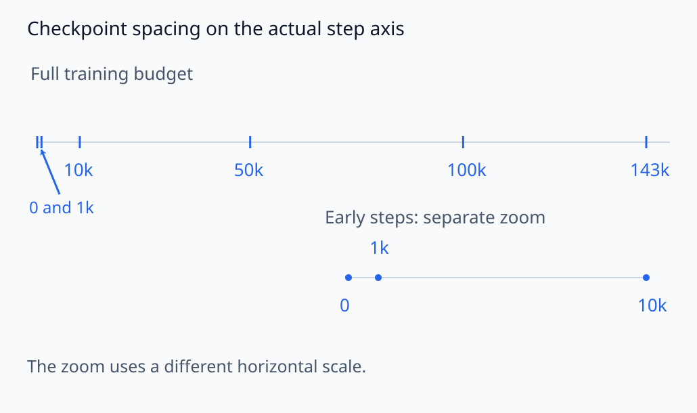
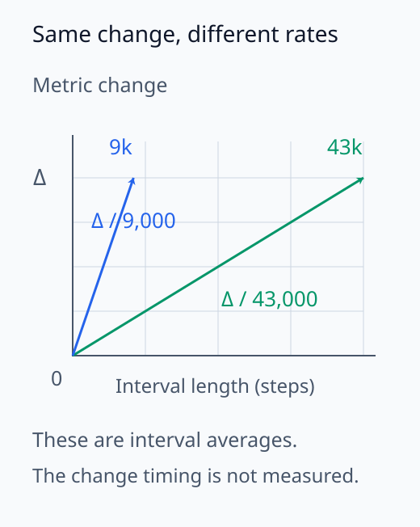
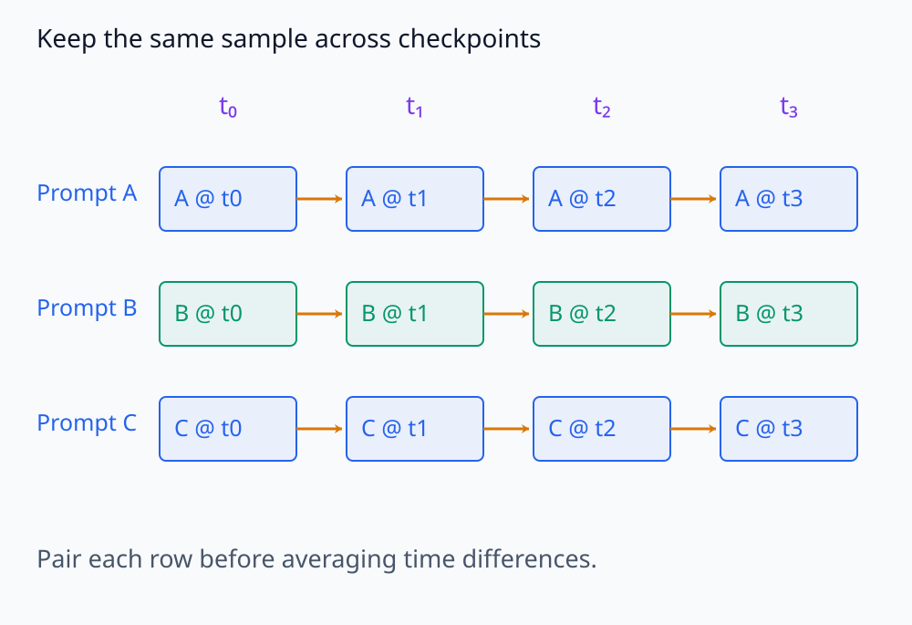
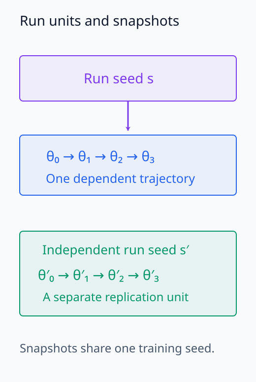
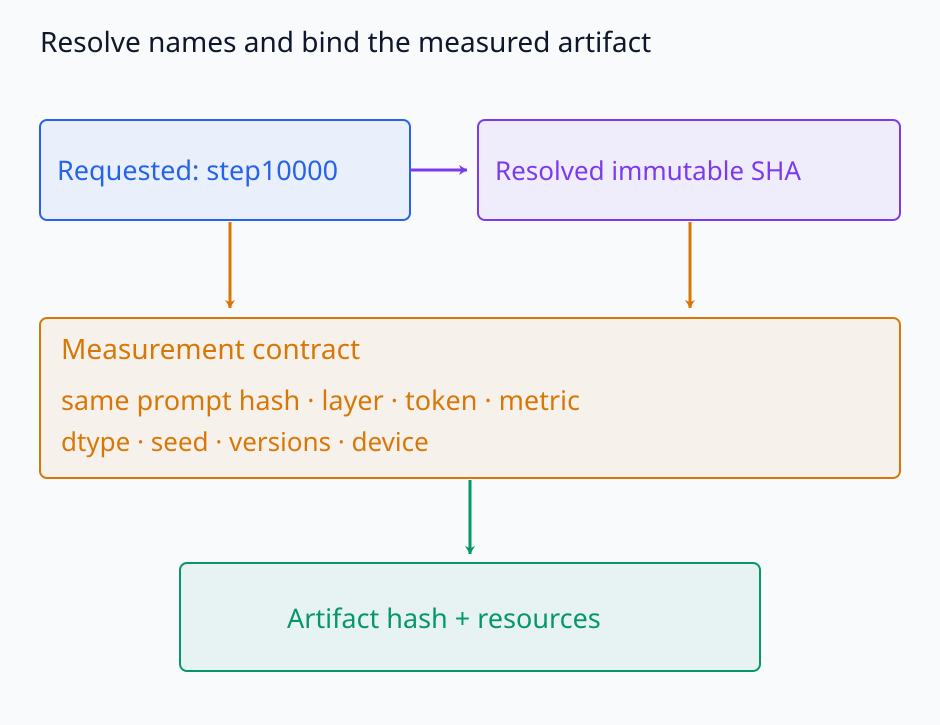
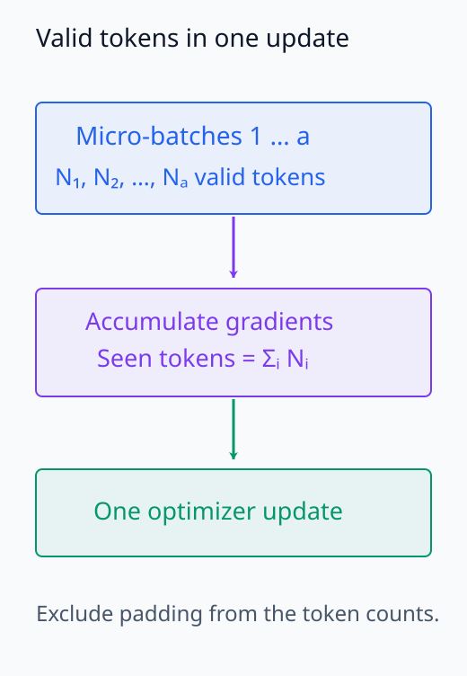
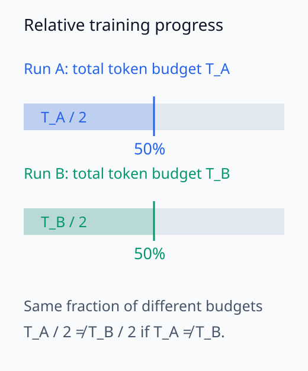

# I08-01. checkpoint 연구 설계

## 이 단원이 필요한 이유

학습 동역학 연구는 완성된 모델 두 개를 비교하는 일이 아니다. 시간축의 표본인 checkpoint, 고정된 입력, 동일한 측정 위치와 행동 지표를 먼저 정해야 한다. 이 계약이 없으면 checkpoint마다 다른 데이터나 token을 재어 생긴 차이를 학습 변화로 오해한다.

## 학습 목표

- checkpoint 연구의 분석 단위와 비교 대상을 명시할 수 있다.
- revision·data·seed·metric을 재현 가능한 manifest로 쓸 수 있다.
- 절대 step과 학습 진척률을 구분할 수 있다.
- 탐색적 관찰과 사전 고정한 검정을 구분할 수 있다.

## 선수지식 확인

- 선수 단원: [N05-27 checkpoint와 모델 상태](../../part-2-neural-computation/N05/N05-27-checkpoint-model-state.md), [I07-15 control과 통계 검증](../I07/I07-15-controls-statistical-validation.md)
- 확인 질문: checkpoint 두 개가 같은 학습 실행의 서로 다른 시점임을 확인하려면 어떤 상태를 기록해야 하는가?

## 기호와 용어

| 기호·용어 | Common spoken reading | 의미 | shape·범위 |
|---|---|---|---|
| $\theta_t$ | `theta sub t` | step $t$의 모델 파라미터 | $\mathbb R^p$ |
| $C=\{t_0,\ldots,t_K\}$ | `C equals the set of t sub zero through t sub K` | 선택한 checkpoint step 집합 | $K+1$개 step |
| $m(\theta_t;D)$ | `m of theta sub t on D` | 고정 데이터 $D$에서 잰 지표 | scalar 또는 vector |
| revision | `revision` | 저장소가 가리키는 모델 상태 | branch 이름 또는 commit SHA |
| manifest | `manifest` | 실행 조건과 결과의 구조화된 기록 | JSON object |

## 1. 시간축의 표본을 고정한다

이 교재의 실제 모델 실습은 Pythia-160M의 다음 여섯 checkpoint를 쓴다.

$$
C=\{0,1000,10000,50000,100000,143000\}.
$$

간격은 균등하지 않다. 따라서 이 여섯 점만으로 변화가 선형이거나 특정 구간에서 갑자기 일어났다고 단정할 수 없다. 관찰된 두 checkpoint 사이에 측정하지 않은 변화가 있을 수 있다.

두 시점의 지표 차이는 그 구간의 총 변화량이다. 이를 step 차이로 나누면 구간 평균 변화율을 얻지만, 구간 안의 어느 시점에서 변화했는지는 알 수 없다. 예를 들어 1,000~10,000 step의 변화량과 100,000~143,000 step의 변화량이 같아도 뒤 구간은 더 긴 학습 동안 누적된 값이다. 두 점을 선으로 연결한 것은 관찰하지 않은 시점의 측정값을 추가한 것이 아니다.

그림의 전체 시간축과 초기 확대 축을 구분해 checkpoint 간격을 읽는다.

<figure class="lesson-figure lesson-figure--wide" markdown="1">

<figcaption>전체 축에서는 후반부의 긴 간격을, 별도 확대 축에서는 0·1,000·10,000 step의 초기 간격을 확인한다. 두 축의 가로 척도는 다르다.</figcaption>
</figure>

두 구간의 변화량과 평균 변화율을 아래에서 따로 비교한다.

<figure class="lesson-figure" markdown="1">

<figcaption>같은 양의 변화량 Δ를 9,000 step과 43,000 step에 나눈 평균 변화율을 비교한다. 선은 구간 평균의 차이를 보여 주며 실제 구간 내 궤적을 측정한 것이 아니다.</figcaption>
</figure>

## 2. 같은 것을 다시 잰다

checkpoint $t$의 측정값을

$$
y_t=m(\theta_t;D,\ell,j,s)
$$

로 쓴다. $D$는 입력 집합, $\ell$은 layer, $j$는 token 위치, $s$는 seed이다. $t$만 바꾸고 나머지는 고정해야 $y_t$의 차이를 학습 시점과 연결할 수 있다.

같은 prompt를 여러 시점에서 재면 각 prompt의 값들이 하나의 시간 궤적을 이룬다. Checkpoint별 평균을 비교할 때도 같은 prompt들의 차이를 먼저 구할 수 있어야 하므로 sample ID와 대응 관계를 보존한다. 여러 checkpoint는 서로 독립적으로 학습한 모델들이 아니다. 이 궤적은 지정한 학습 실행의 변화를 보여 주며, 다른 학습 seed에서도 같은 변화가 반복되는지는 별도의 실행 비교로 확인한다.

최소 manifest는 다음을 포함한다.

- repository와 요청 revision, resolved commit SHA
- prompt·label의 hash와 sample 수
- layer·component·token 위치
- seed, dtype, library version과 device
- metric 정의와 방향
- artifact hash, 실행 시간과 자원 상한

아래 행별 연결은 같은 prompt의 시간 대응을 나타낸다.

<figure class="lesson-figure lesson-figure--wide" markdown="1">

<figcaption>가로로 이어진 한 행은 같은 prompt의 반복측정이다. checkpoint 평균을 비교하기 전에 sample ID별 시간 대응을 보존한다.</figcaption>
</figure>

학습 실행과 그 실행의 checkpoint를 다음처럼 구분한다.

<figure class="lesson-figure" markdown="1">

<figcaption>한 실행의 여러 checkpoint는 하나의 학습 궤적에 속한다. seed 일반화는 별도의 학습 실행을 비교하는 질문이다.</figcaption>
</figure>

측정값을 재현하려면 revision 이름과 실제 객체, 실행 계약을 연결해야 한다.

<figure class="lesson-figure lesson-figure--wide" markdown="1">

<figcaption>step 이름과 resolved SHA를 함께 기록하고, 같은 입력·측정 위치·지표로 만든 artifact에 연결한다.</figcaption>
</figure>

## 3. step은 완전한 시간 좌표가 아니다

서로 다른 학습 실행의 같은 step은 같은 양의 token을 보았다는 뜻이 아닐 수 있다. batch size, sequence length, gradient accumulation과 학습률 schedule이 다르면 진척률도 다르다. 서로 다른 suite를 비교할 때는 seen token, processed example 또는 전체 예산 대비 비율을 함께 기록한다.

한 optimizer step에서 처리한 token 수는 누적한 micro-batch의 실제 token 수를 합한 값이다. Padding이나 가변 길이 입력이 있으면 최대 sequence length와 batch size의 곱만으로 유효 token 수를 계산할 수 없다. 또한 총 예산의 50%라는 비율은 실행별 상대 위치를 맞추지만, 총 예산 자체가 다르면 같은 양의 학습을 뜻하지 않는다. 어떤 시간 좌표를 맞췄는지와 나머지 학습 조건을 함께 남긴다.

아래 계산에서 micro-batch별 유효 token을 더한 뒤 한 번의 update를 수행한다.

<figure class="lesson-figure" markdown="1">

<figcaption>한 optimizer step의 유효 token 수는 누적 micro-batch의 실제 token 수를 더한 값이다. padding을 포함한 최대 크기와 구분한다.</figcaption>
</figure>

상대 진척률을 맞춘 두 실행에서도 총 token 예산은 별도로 비교한다.

<figure class="lesson-figure" markdown="1">

<figcaption>두 실행의 50% 위치를 맞춰도 총 예산이 다르면 처리한 token 수는 다르다.</figcaption>
</figure>

## 4. CPU 실습

<!-- I08_EXAMPLE: i08_01_checkpoint_design -->

코드는 여섯 revision과 고정할 데이터·seed·layer·metric을 하나의 계약으로 출력한다. 이 출력은 실제 GPU 결과가 아니라 실행 전에 검토할 설계 문서이다.

## 흔한 오해

### 오해 1. checkpoint가 많으면 인과관계를 안다

촘촘한 관찰은 변화 시점을 좁히지만, optimizer나 데이터가 원인이라는 결론에는 대조 실험이 필요하다.

### 오해 2. final checkpoint를 기준으로 고르면 편향이 없다

최종 결과를 본 뒤 흥미로운 prompt나 feature만 고르면 선택 편향이 생긴다. 탐색 결과는 독립 데이터나 별도 실행에서 다시 확인한다.

## 연습문제

### 1. 비교 계약

두 checkpoint의 activation norm을 비교할 때 $t$ 외에 고정할 항목 네 가지를 적어라.

해설 보기

입력 데이터, layer·component, token 위치와 dtype을 고정한다. seed와 전처리, norm 정의도 기록한다.

### 2. 불균등 간격

$1000$과 $10000$ 사이 변화량을 $100000$과 $143000$ 사이 변화량과 그대로 비교하면 안 되는 이유는 무엇인가?

해설 보기

step 간격이 각각 9000과 43000으로 다르다. 변화율을 비교하려면 step 차이로 나누거나 학습 예산에 맞춘 좌표를 써야 한다.

### 3. revision

`step10000`과 resolved commit SHA를 모두 기록하는 이유를 설명하라.

해설 보기

branch 이름은 사람이 읽는 학습 시점이고 SHA는 실제 내려받은 불변 객체를 식별한다. 둘을 함께 기록하면 의미와 재현성을 보존한다.

### 4. 분석 단위

같은 prompt 100개를 여섯 checkpoint에서 재면 독립 표본은 600개인가?

해설 보기

아니다. 같은 prompt가 반복 측정되므로 prompt가 paired experimental unit이다. checkpoint별 600개 독립 표본처럼 다루면 pseudoreplication이 된다.

### 5. 탐색과 확인

final checkpoint에서 가장 분리도가 큰 layer를 찾은 뒤 같은 데이터로 유의성을 검정했다. 무엇이 문제인가?

해설 보기

같은 데이터가 선택과 검정에 함께 쓰였다. layer 선택의 다중비교를 반영하거나 독립 확인 데이터를 사용해야 한다.

### 6. 누락된 상태

모델 weight만 같고 tokenizer revision이 다른 비교가 왜 위험한가?

해설 보기

같은 문자열이 다른 token ID와 위치로 바뀔 수 있다. 입력 자체가 달라져 checkpoint 효과와 tokenizer 효과를 분리할 수 없다.

## 근거와 갱신 경계

Pythia의 공개 checkpoint 체계와 동일 데이터 순서는 [Biderman et al. (2023)](https://proceedings.mlr.press/v202/biderman23a.html)을 기준으로 한다. 이 교재의 여섯 checkpoint는 교육용 표본이며 Pythia가 제공하는 전체 checkpoint를 대표한다고 가정하지 않는다.

## 단원 요약

- 학습 동역학 측정은 checkpoint 외의 조건을 고정한 반복 측정이다.
- revision 이름과 resolved SHA를 함께 기록한다.
- 불균등 checkpoint로 관찰한 궤적의 시간 해상도에는 한계가 있다.
- 탐색에서 고른 feature는 독립 조건에서 확인한다.

## 통과 기준

- checkpoint 연구 manifest의 필수 항목을 쓸 수 있는가?
- paired unit과 checkpoint 측정값을 구분할 수 있는가?
- 관찰 궤적이 허용하지 않는 인과 주장을 지적할 수 있는가?

## 다음 단원

- [I08-02 파라미터 거리와 함수 거리](I08-02-parameter-function-distance.md)

## 집필자 점검표

- [x] checkpoint·data·seed·metric 계약을 명시했다.
- [x] 여섯 Pythia revision을 고정했다.
- [x] 모든 문제에 해설이 있다.
- [x] Common spoken reading이 실제 영어 학술 발화이며 한글 음역이나 기계적 직역을 포함하지 않는다.
- [x] 내부 링크와 수식 구분자를 확인했다.
