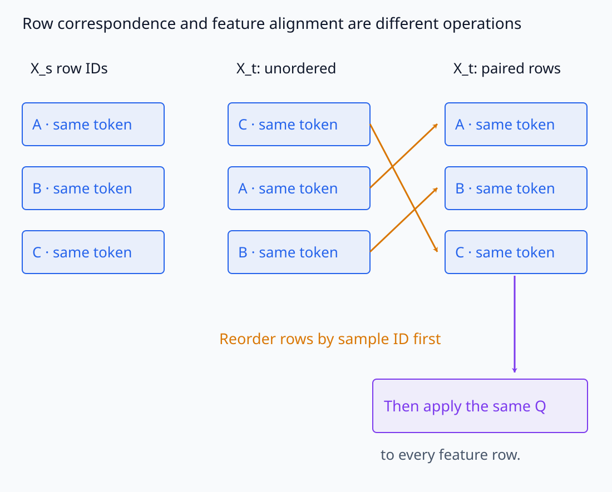
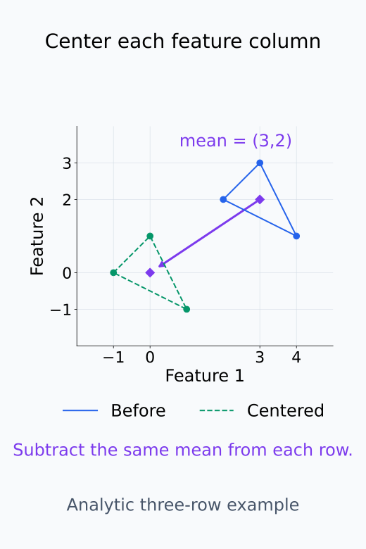
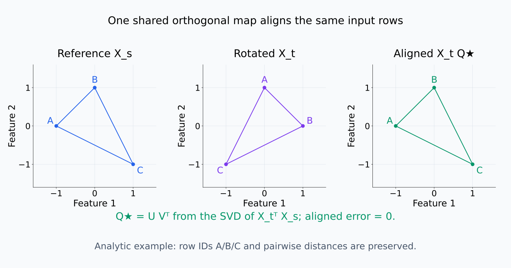
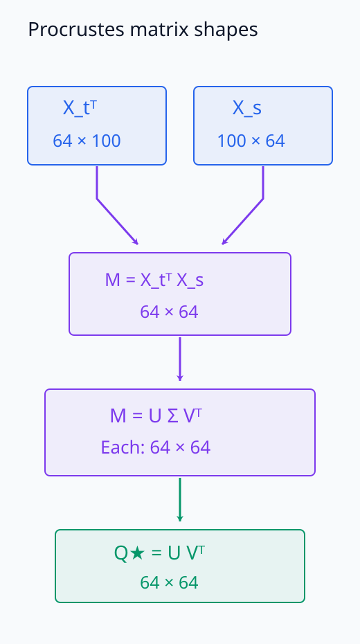
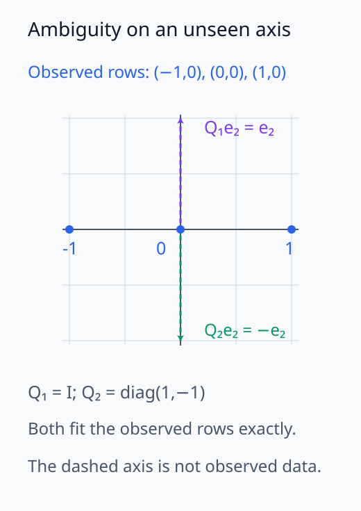
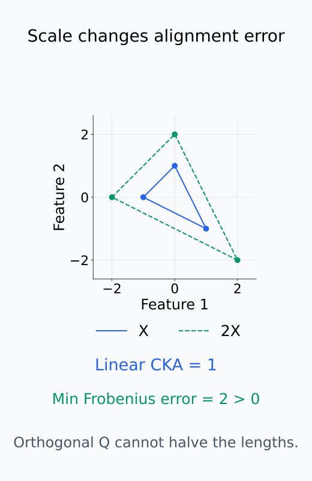
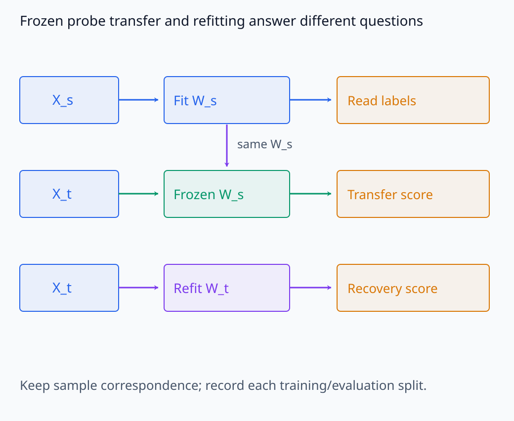

# I08-03. representation alignment

## 이 단원이 필요한 이유

같은 정보를 담은 두 representation도 좌표축이 회전하거나 unit이 순열되면 좌표별 비교가 실패한다. checkpoint feature를 시간축으로 추적하려면 어떤 변환을 같은 표현으로 볼지 정하고, 같은 입력 행을 대응시킨 뒤 정렬해야 한다.

## 학습 목표

- row correspondence와 feature-axis alignment를 구분할 수 있다.
- orthogonal Procrustes 목적함수를 설명할 수 있다.
- 정렬 전후 오차와 CKA를 계산해 해석할 수 있다.
- 정렬이 feature 동일성을 증명하지 않음을 설명할 수 있다.

## 선수지식 확인

- 선수 단원: [I08-02 파라미터 거리와 함수 거리](I08-02-parameter-function-distance.md), [I06-08 CCA·CKA·RSA](../I06/I06-08-cca-cka-rsa.md), [M02-13 특이값분해](../../part-1-foundations/M02/M02-13-singular-value-decomposition.md)
- 확인 질문: orthogonal matrix가 vector의 길이와 내적을 보존하는 이유는 무엇인가?

## 기호와 용어

| 기호·용어 | Common spoken reading | 의미 | shape·범위 |
|---|---|---|---|
| $X_t$ | `X sub t` | checkpoint $t$의 centered activation | $n\times d$ |
| $Q^\star$ | `Q star` | 최적 orthogonal alignment | $d\times d$ |
| $\|X_s-X_tQ\|_F$ | `the Frobenius norm of X sub s minus X sub t Q` | 정렬 뒤 좌표 오차 | scalar |
| Procrustes | `Procrustes` | 회전·반사로 두 행렬을 맞추는 문제 | optimization problem |
| correspondence | `correspondence` | 두 행렬의 같은 row가 같은 입력을 뜻하는 조건 | one-to-one pairing |

## 1. 입력 대응이 먼저다

$X_s$와 $X_t$의 $i$번째 row는 같은 prompt와 같은 token 위치여야 한다. row 순서가 다르면 feature 축을 아무리 잘 정렬해도 잘못된 sample을 맞춘다. 결측 token이나 tokenizer 차이가 있으면 먼저 대응 규칙을 정의한다.

이 표의 centered activation은 각 checkpoint에서 열별 sample 평균을 뺀 행렬이다. 따라서 정렬은 입력들 사이의 상대적인 배치를 비교하고, checkpoint 사이의 평균 activation 이동은 따로 측정한다. 오른쪽의 $Q$는 모든 row에 같은 feature-axis 변환을 적용한다. 서로 다른 입력 row를 바꾸는 연산을 대신하지 않는다.

두 정렬 연산의 순서를 sample ID와 feature 축으로 구분한다.

<figure class="lesson-figure lesson-figure--wide" markdown="1">

<figcaption>먼저 같은 prompt·token의 행을 대응시킨 뒤 모든 행에 같은 Q를 적용한다. Q는 feature 축을 바꾸며 sample 행의 잘못된 순서를 대신 고치지 않는다.</figcaption>
</figure>

열 평균을 빼면 다음 예시처럼 공통 위치 이동을 제거한다.

<figure class="lesson-figure" markdown="1">

<figcaption>명시적 세 행 예시에서 열 평균 (3,2)를 모든 행에서 뺀다. 보라색은 평균의 이동이고 두 삼각형의 상대 배치는 같다. checkpoint 사이의 평균 이동은 centered 정렬에서 따로 측정해야 한다.</figcaption>
</figure>

## 2. Orthogonal Procrustes

두 representation의 차원이 같을 때

$$
Q^\star=\arg\min_{Q^\top Q=I}\|X_s-X_tQ\|_F
$$

를 푼다. $Q$가 square orthogonal matrix이므로 $X_tQ$는 각 row의 길이를 보존한다. 목적함수의 제곱을 전개하면

$$
\|X_s-X_tQ\|_F^2
=\|X_s\|_F^2+\|X_t\|_F^2
-2\operatorname{tr}(Q^\top X_t^\top X_s).
$$

앞의 두 항은 $Q$와 무관하다. 따라서 오차를 최소화하는 일은 마지막 trace를 최대화하는 일과 같다. Full SVD $X_t^\top X_s=U\Sigma V^\top$를 넣고 trace의 순환 성질을 쓰면 최대화할 항은 $\operatorname{tr}(V^\top Q^\top U\Sigma)$가 된다. $V^\top Q^\top U$도 orthogonal이므로 각 대각 원소가 1 이하이고, $\Sigma$의 대각 원소는 음수가 아니다. Trace는 singular value들의 합을 넘을 수 없다. 이 상한은 $V^\top Q^\top U=I$일 때 얻으므로 한 해는

$$
Q^\star=UV^\top
$$

이다. orthogonal constraint는 길이와 각도를 보존한다. 일반 invertible transform까지 허용하는 정렬보다 구조를 덜 지운다.

이 조건은 회전과 반사를 모두 허용한다. Singular value가 0인 방향은 trace에 기여하지 않으므로 최적 정렬이 하나로 결정되지 않을 수 있다. 정렬 오차가 작다는 사실과 유일한 좌표 대응이 정해졌다는 주장은 구분한다.

아래 세 좌표계에서는 같은 입력 행의 회전과 정렬을 비교한다.

<figure class="lesson-figure lesson-figure--wide" markdown="1">

<figcaption>같은 행 A·B·C를 회전한 뒤 하나의 orthogonal Q로 다시 맞춘 수학적 예시다. 길이와 각도를 유지하면서 좌표 오차를 줄이는 연산을 비교한다. 모델 실측값은 아니다.</figcaption>
</figure>

문제의 shape를 cross matrix부터 Q까지 따라간다.

<figure class="lesson-figure" markdown="1">

<figcaption>문제의 100×64 representation에서는 cross matrix와 full SVD의 U·Σ·Vᵀ, 최종 Q가 모두 64×64이다. Q는 입력 행 수가 아니라 feature 차원에 맞춘다.</figcaption>
</figure>

자료가 없는 방향에서 두 정렬이 같은 오차를 내는 예시를 본다.

<figure class="lesson-figure" markdown="1">

<figcaption>명시적 2차원 예시에서 자료는 첫째 축에만 놓인다. 항등과 둘째 축 반사는 모두 자료를 정확히 맞추지만, 자료에 없는 방향의 대응은 다르다. 0 singular value 방향의 비유일성을 보여 준다.</figcaption>
</figure>

## 3. 정렬 없는 metric과 함께 본다

linear CKA는 isotropic scaling과 orthogonal transform에 불변이다. Procrustes 오차는 실제 좌표 대응을 만들 때 유용하고, CKA는 representation 관계를 scalar로 요약한다. 두 metric이 답하는 질문은 같지 않다.

같은 nonzero representation의 모든 좌표를 두 배로 키우면 linear CKA는 변하지 않는다. 하지만 orthogonal $Q$는 길이를 줄이지 못하므로 Procrustes 오차에는 이 scale 차이가 남는다. CKA 값 하나로 실제 정렬 matrix를 얻는 것도 아니다. 어느 변환까지 같은 것으로 처리하는지와 좌표 대응이 필요한지를 구분해 metric을 선택한다.

checkpoint마다 별도 probe를 학습하면 probe 자체의 회전과 과적합이 섞인다. 고정 probe의 전달, 재학습 probe의 복원 가능성과 alignment metric을 나눠 기록한다.

동일한 두 representation도 metric에 따라 다른 결과를 갖는다.

<figure class="lesson-figure" markdown="1">

<figcaption>중심이 0인 예시 X와 2X의 linear CKA는 1이다. orthogonal 변환으로 길이를 반으로 줄일 수 없어 최소 Frobenius 오차 2는 남는다. 두 숫자는 서로 다른 질문에 대한 값이다.</figcaption>
</figure>

고정 probe와 새로 학습한 probe를 아래 경로로 비교한다.

<figure class="lesson-figure lesson-figure--wide" markdown="1">

<figcaption>위에서 학습한 W_s를 고정해 다음 checkpoint에 전달한 점수와, 새 W_t를 학습한 복원 점수를 구분한다. 어느 경로에서도 평가할 입력 대응과 분할 조건을 유지한다.</figcaption>
</figure>

## 4. CPU 실습

<!-- I08_EXAMPLE: i08_03_representation_alignment -->

무작위 representation을 orthogonal matrix로 회전한다. raw RMSE는 크지만 Procrustes 뒤 RMSE는 수치 오차 수준이며 linear CKA는 1에 가깝다.

## 흔한 오해

### 오해 1. 정렬되면 같은 feature다

전체 sample geometry가 맞는다는 사실만으로 개별 feature의 의미와 사용 경로가 같다고 결론낼 수 없다. feature-level 대응에는 활성 예시와 개입 증거가 더 필요하다.

### 오해 2. 가장 자유로운 정렬이 가장 공정하다

자유도가 큰 변환은 실제 차이까지 지울 수 있다. 연구 질문이 허용하는 invariance만 선택한다.

## 연습문제

### 1. shape

$X_s,X_t\in\mathbb R^{100\times64}$이면 $Q$의 shape은 무엇인가?

해설 보기

$X_tQ$가 $100\times64$여야 하므로 $Q\in\mathbb R^{64\times64}$이다.

### 2. row correspondence

두 checkpoint에서 prompt 순서만 다르다. 먼저 무엇을 해야 하는가?

해설 보기

동일 prompt·token끼리 row를 재정렬한다. feature alignment는 그 다음이다.

### 3. orthogonal 조건

$Q^\top Q=I$가 보존하는 양 두 가지를 적어라.

해설 보기

vector의 L2 norm과 두 vector의 inner product를 보존한다. 따라서 각도와 Euclidean distance도 보존된다.

### 4. CKA

$Y=XQ$이고 $Q$가 orthogonal이면 linear CKA가 높을 것으로 기대하는 이유는 무엇인가?

해설 보기

orthogonal 변환은 sample Gram geometry를 보존하므로 centered representation의 관계가 바뀌지 않는다.

### 5. 과도한 정렬

임의의 invertible transform을 허용할 때 생길 수 있는 문제를 설명하라.

해설 보기

scale과 shear까지 흡수해 checkpoint 사이의 의미 있는 geometry 차이를 제거할 수 있다.

### 6. 주장 설계

“feature가 유지됐다”를 주장하려면 alignment 외에 어떤 증거가 필요한가?

해설 보기

독립 데이터에서의 활성 패턴, matching 안정성, probe 전달과 해당 방향에 대한 개입 효과를 함께 확인한다.

## 근거와 갱신 경계

representation 비교의 invariance와 CKA는 [Kornblith et al. (2019)](https://proceedings.mlr.press/v97/kornblith19a.html)을 기준으로 한다. 이 단원은 동일 차원 orthogonal alignment를 중심으로 하며 서로 다른 차원의 일반 정렬은 다루지 않는다.

## 단원 요약

- 같은 입력 row를 먼저 대응시킨다.
- Procrustes는 orthogonal 변환 아래 좌표 오차를 최소화한다.
- alignment error와 CKA는 서로 다른 질문에 답한다.
- 정렬 성공만으로 feature 의미나 기능의 지속성을 주장하지 않는다.

## 통과 기준

- Procrustes 목적함수와 shape을 쓸 수 있는가?
- row와 feature-axis 정렬을 구분할 수 있는가?
- 허용 invariance가 결과를 바꾸는 이유를 설명할 수 있는가?

## 다음 단원

- [I08-04 SGD를 동역학으로 보기](I08-04-sgd-as-dynamics.md)

## 집필자 점검표

- [x] 정렬의 대상과 불변성을 명시했다.
- [x] SVD 해와 CKA를 연결했다.
- [x] 모든 문제에 해설이 있다.
- [x] Common spoken reading이 실제 영어 학술 발화이며 한글 음역이나 기계적 직역을 포함하지 않는다.
- [x] 주장 강도와 읽기 표기를 확인했다.
- [x] 내부 링크와 수식을 확인했다.
