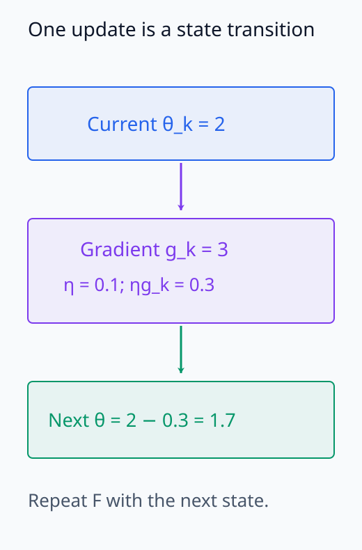
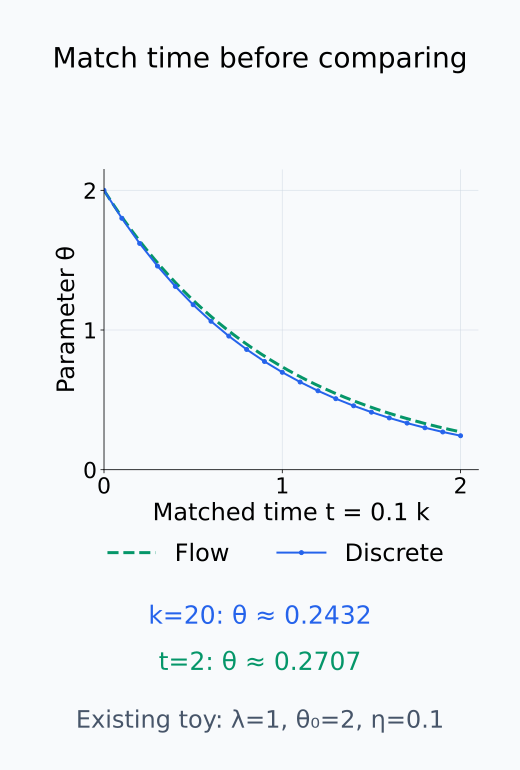
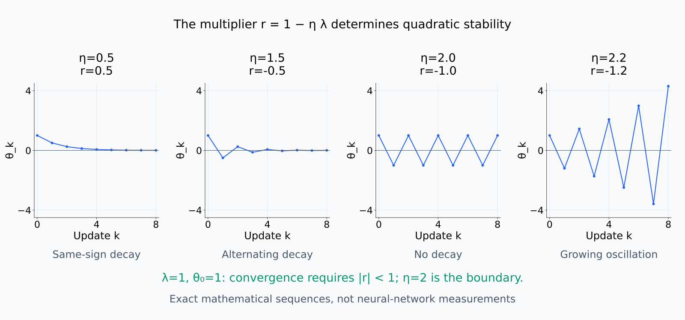
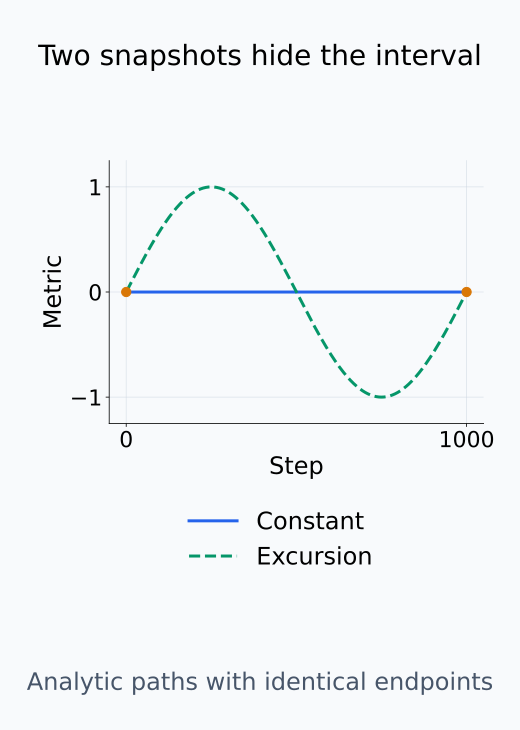
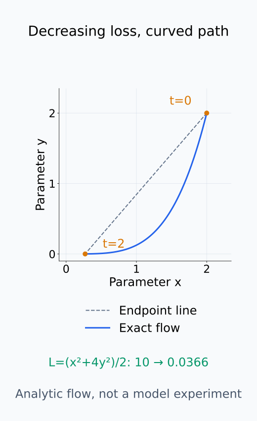

# I08-04. SGD를 동역학으로 보기

## 이 단원이 필요한 이유

checkpoint sequence는 서로 독립인 모델 목록이 아니라 update rule이 만든 궤적이다. gradient descent를 이산 동역학으로 보면 학습률, 곡률과 저장 간격이 관측된 경로를 어떻게 제한하는지 설명할 수 있다. 연속시간 gradient flow는 유용한 근사이지만 실제 optimizer와 동일하지 않다.

## 학습 목표

- gradient descent update를 상태 전이로 쓸 수 있다.
- 이산 update와 gradient flow를 연결할 수 있다.
- quadratic loss에서 안정 학습률 조건을 계산할 수 있다.
- 연속시간 근사의 한계를 설명할 수 있다.

## 선수지식 확인

- 선수 단원: [I08-03 representation alignment](I08-03-representation-alignment.md), [N05-07 mini-batch gradient descent](../../part-2-neural-computation/N05/N05-07-gradient-descent-mini-batch.md), [M01-11 방향미분과 gradient](../../part-1-foundations/M01/M01-11-directional-derivative-gradient.md)
- 확인 질문: $\theta_{k+1}=\theta_k-\eta\nabla L(\theta_k)$에서 각 항의 shape은 무엇인가?

## 기호와 용어

| 기호·용어 | Common spoken reading | 의미 | shape·범위 |
|---|---|---|---|
| $\theta_{k+1}=\theta_k-\eta g_k$ | `theta sub k plus one equals theta sub k minus eta g sub k` | 한 번의 이산 update | $\theta,g\in\mathbb R^p$ |
| $\dot\theta(t)$ | `theta dot of t` | 연속시간 파라미터 속도 | $\mathbb R^p$ |
| $\dot\theta=-\nabla L(\theta)$ | `theta dot equals minus the gradient of L of theta` | gradient flow | ordinary differential equation |
| $\eta$ | `eta` | learning rate | positive scalar |
| trajectory | `trajectory` | update가 만든 상태의 순서 | sequence or curve |

## 1. 이산 상태 전이

full-batch gradient descent는

$$
\theta_{k+1}=F(\theta_k)=\theta_k-\eta\nabla L(\theta_k)
$$

이다. 같은 초기값과 결정적인 $F$를 알면 전체 궤적이 정해진다. checkpoint는 이 궤적을 드문드문 저장한 것이다.

한 update의 입력 상태와 계산된 다음 상태를 분리해 읽는다.

<figure class="lesson-figure" markdown="1">

<figcaption>문제의 한 step에서 현재 파라미터 2에 update −0.3을 적용하면 1.7이 된다. 다음 전이는 이 새 상태에서 다시 계산한다.</figcaption>
</figure>

## 2. Gradient flow

$\eta$가 작을 때 $t=k\eta$로 놓으면

$$
\frac{\theta_{k+1}-\theta_k}{\eta}\approx\dot\theta(t)
$$

이므로 $\dot\theta=-\nabla L(\theta)$를 얻는다. 이 근사는 방향장을 이해하게 하지만 finite learning rate, momentum, adaptive state와 mini-batch noise를 지운다.

여기서 $k$는 update 횟수이고 $t=k\eta$는 각 update 사이 시간을 $\eta$로 잡은 연속시간 좌표다. 분자는 한 step의 파라미터 이동이고 이를 $\eta$로 나누면 그 구간의 평균 속도가 된다. Update 식을 대입하면 이 속도는 $-\nabla L(\theta_k)$이다. Gradient가 매끄럽게 변하고 step이 충분히 작을 때 이를 현재 시점의 미분 속도로 근사한다. 실제 step 수 $k$와 flow의 시간 $t$를 그대로 같은 숫자로 비교하지 않는다.

미분 가능한 loss의 flow를 따라 chain rule을 적용하면 $\frac{d}{dt}L(\theta(t))=\nabla L(\theta(t))^\top\dot\theta(t)=-\|\nabla L(\theta(t))\|_2^2$이다. 이 연속 궤적에서는 loss가 증가하지 않는다. 이 성질을 유한한 learning rate의 이산 update에 그대로 적용할 수는 없다.

$\lambda>0$인 quadratic loss $L(\theta)=\frac12\lambda\theta^2$에서는 gradient가 $\lambda\theta$이므로

$$
\theta_{k+1}=(1-\eta\lambda)\theta_k.
$$

이다. 같은 상수를 반복해서 곱하므로 $\theta_k=(1-\eta\lambda)^k\theta_0$이다. 일반적인 nonzero 초기값에서 0으로 수렴하려면 곱하는 상수의 절댓값이 1보다 작아야 한다. $|1-\eta\lambda|<1$을 풀면 $0<\eta<2/\lambda$이다. 상수가 양수면 부호를 유지하며 줄고, 음수면 부호를 바꾸며 줄어든다. 경계 $\eta=2/\lambda$에서는 상수가 $-1$이라 진폭이 줄지 않는다.

같은 quadratic의 flow 해는 $\theta(t)=\theta_0e^{-\lambda t}$이다. 이를 미분하면 $\dot\theta=-\lambda\theta$와 초기조건을 만족한다. 실습에서 $\lambda=1$, $\theta_0=2$, $\eta=0.1$이므로 20 step 뒤 이산 값은 $2(0.9)^{20}$이고, 대응 시간 $t=2$의 flow 값은 $2e^{-2}$이다. 작은 step에서 두 값이 가까워지는 이유와, 유한한 step에서 같지 않은 이유를 구분할 수 있다.

같은 시간 척도에서 이산 점과 연속 flow를 비교한다.

<figure class="lesson-figure" markdown="1">

<figcaption>기존 quadratic 예제에서 이산 점의 k=20과 flow의 t=2를 비교한다. 가로축을 t=0.1k로 맞춰도 유한 step의 값은 정확히 같지 않다.</figcaption>
</figure>

아래 네 경우에서는 같은 quadratic의 learning rate만 바꾼다.

<figure class="lesson-figure lesson-figure--wide" markdown="1">

<figcaption>같은 λ=1 quadratic에서 곱하는 상수 r=1−ηλ를 바꾼 수학적 예시다. |r|<1인 두 감소, |r|=1인 경계와 |r|>1인 발산을 구분한다.</figcaption>
</figure>

## 3. 저장 간격과 aliasing

1000 step마다 저장한 checkpoint로는 그 사이의 진동이나 일시적 overshoot를 볼 수 없다. metric이 두 저장점에서 같아도 중간 경로가 같다는 뜻이 아니다. 급격한 transition을 주장하려면 관측 간격보다 변화 구간이 충분히 넓은지 확인한다.

같은 두 checkpoint를 지나는 서로 다른 경로를 비교한다.

<figure class="lesson-figure" markdown="1">

<figcaption>step 0과 1,000의 주황색 관찰점만 같아도 사이 경로는 일정하거나 변했다가 돌아올 수 있다. 두 곡선은 미관측 구간의 가능성을 보여 주는 해석용 예시다.</figcaption>
</figure>

## 4. CPU 실습

<!-- I08_EXAMPLE: i08_04_sgd_dynamics -->

$L(\theta)=\theta^2/2$에서 learning rate 0.1의 이산 궤적과 같은 시간의 $2e^{-t}$를 비교한다. 둘은 가깝지만 정확히 같지 않다.

## 흔한 오해

### 오해 1. gradient flow가 AdamW의 정확한 방정식이다

AdamW는 moment state, 좌표별 scaling과 weight decay를 가진다. 단순 gradient flow는 그 일부 구조만 근사한다.

### 오해 2. loss가 감소하면 경로가 직선이다

gradient 방향은 위치마다 바뀐다. scalar loss의 단조 감소만으로 parameter path geometry를 알 수 없다.

loss 감소와 경로 모양을 다음 좌표계에서 따로 확인한다.

<figure class="lesson-figure" markdown="1">

<figcaption>L=(x²+4y²)/2의 해석용 flow 예시에서는 loss가 감소하면서도 경로가 휘어진다. 점선은 두 끝을 이은 분석용 직선이고 실제 flow는 파란 곡선이다.</figcaption>
</figure>

## 연습문제

### 1. 한 step

$\theta=2$, gradient $3$, $\eta=0.1$일 때 다음 $\theta$를 구하라.

해설 보기

$2-0.1\times3=1.7$이다.

### 2. 안정 조건

$\lambda=4$인 quadratic에서 안정적인 constant learning rate 범위를 구하라.

해설 보기

$0<\eta<2/4=0.5$이다.

### 3. 진동

$1-\eta\lambda<0$이면서 절댓값이 1보다 작으면 궤적은 어떻게 되는가?

해설 보기

부호를 번갈아 바꾸며 진폭이 줄어 0으로 수렴한다.

### 4. flow 해

$\dot\theta=-\theta$, $\theta(0)=a$의 해를 써라.

해설 보기

$\theta(t)=ae^{-t}$이다.

### 5. aliasing

metric이 step 0과 1000에서 같다는 사실로 중간에도 일정했다고 말할 수 있는가?

해설 보기

말할 수 없다. 중간에 변했다가 돌아왔을 수 있다. 더 촘촘한 checkpoint가 필요하다.

### 6. 주장 비판

“두 checkpoint 사이 직선 보간이 학습 경로다”를 비판하라.

해설 보기

직선 보간은 분석자가 만든 경로이다. 실제 optimizer trajectory는 저장하지 않은 update sequence이며 일반적으로 직선이 아니다.

## 근거와 갱신 경계

stochastic gradient algorithm의 연속시간 근사는 [Li, Tai and E (2019)](https://www.jmlr.org/papers/v20/17-526.html)을 참고한다. 이 단원은 결정론적 quadratic 예제로 연결만 보이며 현대 optimizer의 정확한 SDE를 유도하지 않는다.

## 단원 요약

- gradient descent는 파라미터 공간의 이산 동역학이다.
- gradient flow는 작은 step의 연속시간 근사이다.
- 안정성은 learning rate와 곡률에 함께 의존한다.
- sparse checkpoint는 중간 경로를 숨긴다.

## 통과 기준

- update와 gradient flow를 연결할 수 있는가?
- quadratic 안정 조건을 계산할 수 있는가?
- checkpoint 간격의 해석 한계를 설명할 수 있는가?

## 다음 단원

- [I08-05 mini-batch noise와 optimizer state](I08-05-minibatch-noise-optimizer-state.md)

## 집필자 점검표

- [x] 이산 update와 flow를 구분했다.
- [x] 안정 조건을 검산했다.
- [x] 모든 문제에 해설이 있다.
- [x] Common spoken reading이 실제 영어 학술 발화이며 한글 음역이나 기계적 직역을 포함하지 않는다.
- [x] 주장 강도와 읽기 표기를 확인했다.
- [x] 내부 링크와 수식을 확인했다.
