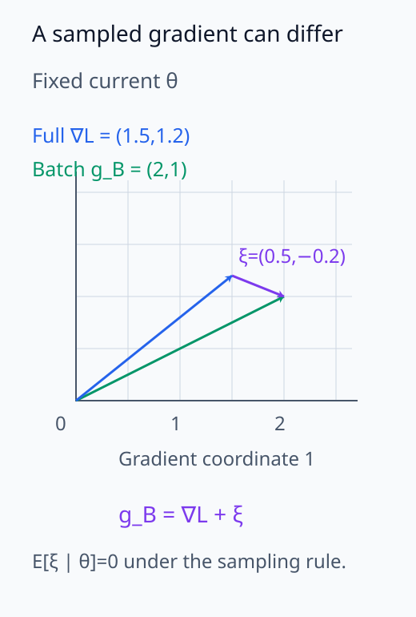
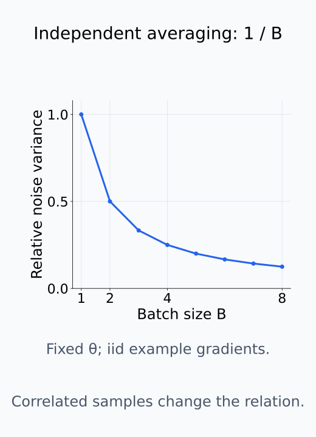
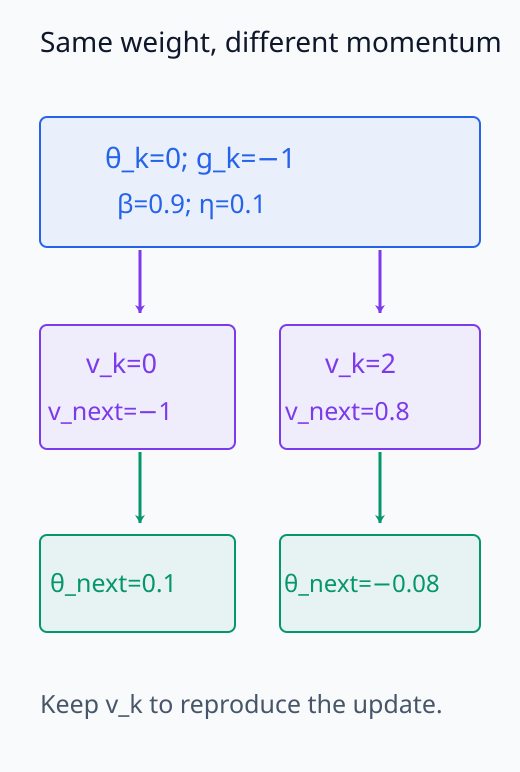
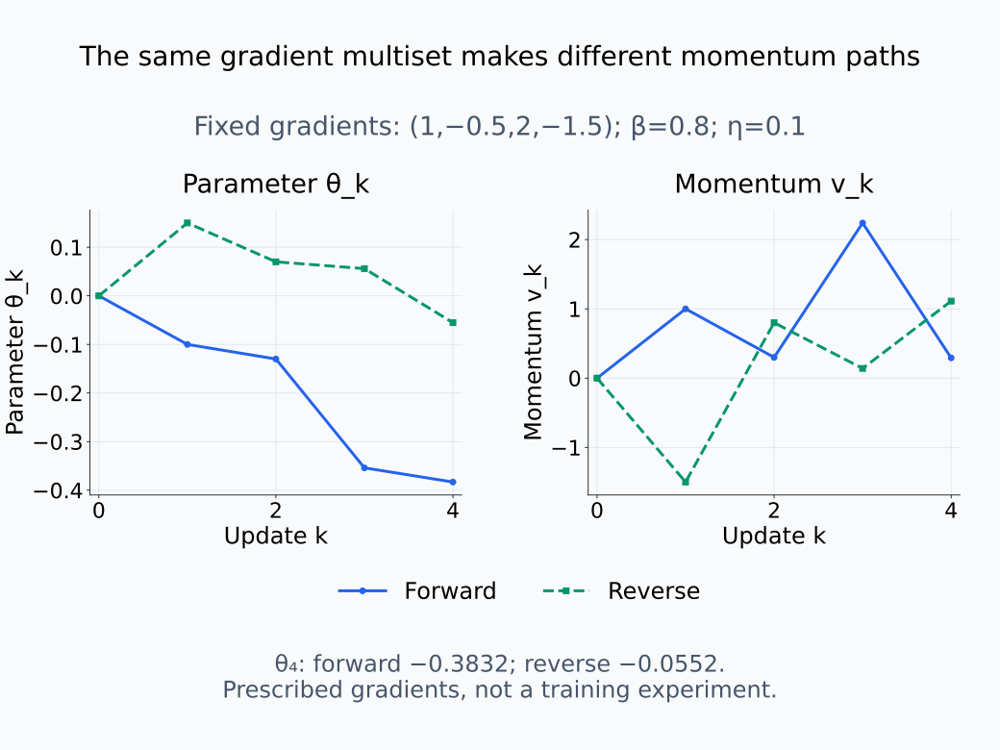
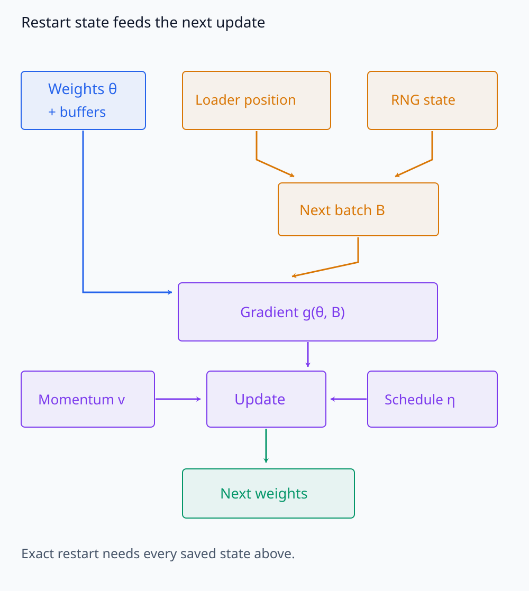
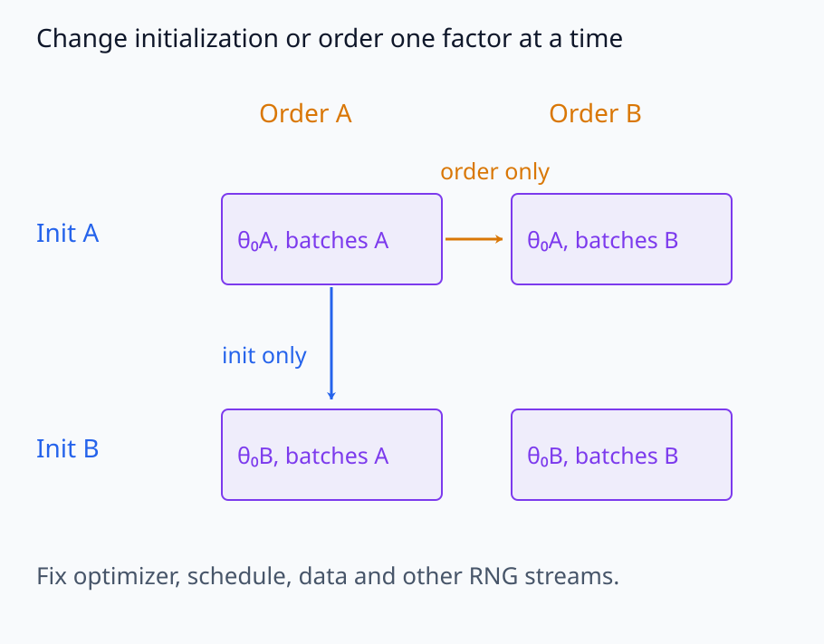

# I08-05. mini-batch noise와 optimizer state

## 이 단원이 필요한 이유

같은 데이터와 초기 weight를 써도 mini-batch 순서가 다르면 gradient sequence가 달라진다. momentum과 Adam 계열에서는 과거 gradient를 담은 optimizer state 때문에 현재 weight만으로 다음 update를 재현할 수 없다. checkpoint 동역학을 연구하려면 이 숨은 상태를 구분해야 한다.

## 학습 목표

- mini-batch gradient를 full gradient와 noise 항으로 분해할 수 있다.
- momentum state가 경로 의존성을 만드는 과정을 계산할 수 있다.
- 재시작용 checkpoint와 분석용 weight snapshot을 구분할 수 있다.
- seed 효과와 data-order 효과를 실험적으로 분리할 수 있다.

## 선수지식 확인

- 선수 단원: [I08-04 SGD를 동역학으로 보기](I08-04-sgd-as-dynamics.md), [N05-08 momentum·AdamW](../../part-2-neural-computation/N05/N05-08-momentum-adamw-optimizer-state.md), [M04-04 기댓값·분산·공분산](../../part-1-foundations/M04/M04-04-expectation-variance-covariance.md)
- 확인 질문: unbiased mini-batch gradient의 기댓값은 무엇인가?

## 기호와 용어

| 기호·용어 | Common spoken reading | 의미 | shape·범위 |
|---|---|---|---|
| $g_{B_k}(\theta_k)$ | `g sub B sub k of theta sub k` | batch $B_k$의 gradient | $\mathbb R^p$ |
| $\xi_k$ | `xi sub k` | full gradient와의 차이 | $\mathbb R^p$ |
| $v_k$ | `v sub k` | momentum state | $\mathbb R^p$ |
| $v_{k+1}=\beta v_k+g_k$ | `v sub k plus one equals beta v sub k plus g sub k` | momentum 누적 | vector recurrence |
| RNG state | `R N G state` | 다음 난수를 정하는 상태 | implementation-specific |

## 1. Gradient noise

mini-batch gradient를

$$
g_{B_k}(\theta_k)=\nabla L(\theta_k)+\xi_k
$$

로 쓴다. $\xi_k$는 같은 현재 weight에서 계산한 batch gradient와 full gradient의 차이로 정의한다. 데이터별 loss의 평균을 $L$로 쓰고, 현재 weight를 고정한 채 전체 데이터에서 각 예제를 같은 확률로 새로 뽑는다면 batch gradient의 평균은 full gradient가 된다. 이 조건에서 $\mathbb E[\xi_k\mid\theta_k]=0$이지만, 개별 batch의 $\xi_k$가 0일 필요는 없다.

기댓값은 여러 batch 선택에 대한 평균이다. 다음 위치는 선택한 batch gradient로 이동한 결과이므로, 다음 gradient를 평가하는 weight도 실행마다 달라진다. 따라서 매 step의 unbiased 조건만으로 noisy 궤적의 평균이 full-batch 궤적과 같다고 결론낼 수 없다. Epoch 안에서 이미 사용한 예제를 제외해 순서대로 뽑는 방식은 현재 weight와 남은 데이터가 연결될 수 있으므로 같은 조건부 평균을 자동으로 가정하지 않는다.

독립적인 예제 gradient를 평균내는 경우에는 batch size가 커질수록 noise covariance가 batch size의 역수에 비례해 줄어든다. 이 관계는 sample 사이의 독립성과 같은 sampling 규칙을 전제로 한다. Batch 내 상관이나 sampling 방식이 달라지면 batch size만으로 covariance를 정할 수 없다.

같은 현재 weight에서 gradient와 noise의 벡터 관계를 비교한다.

<figure class="lesson-figure" markdown="1">

<figcaption>같은 θ에서 문제의 batch gradient와 full gradient를 비교한다. 보라색 차이 ξ는 0이 아니며, 조건부 평균 0은 본문에서 정한 sampling 규칙 아래의 반복 평균이다.</figcaption>
</figure>

독립 평균의 batch size 효과를 아래 곡선에서 읽는다.

<figure class="lesson-figure" markdown="1">

<figcaption>고정 θ에서 독립적이고 같은 규칙으로 뽑은 예제 gradient를 평균낼 때의 상대 noise 분산 1/B를 그린다. 상관이나 sampling 조건이 달라진 실측 관계를 뜻하지 않는다.</figcaption>
</figure>

## 2. Weight만으로는 상태가 부족하다

momentum update는

$$
v_{k+1}=\beta v_k+g_{B_k}(\theta_k),\qquad
\theta_{k+1}=\theta_k-\eta v_{k+1}
$$

이다. 같은 $\theta_k$에서도 $v_k$가 다르면 다음 weight가 다르다. AdamW는 first·second moment와 step counter까지 필요하다.

초기 $v_0=0$에서 두 gradient를 $g_1$, $g_2$ 순서로 넣으면 $v_1=g_1$, $v_2=\beta g_1+g_2$가 된다. 첫 weight 이동에도 $g_1$을 사용했으므로 두 step 뒤 weight는 $\theta_0-\eta[(1+\beta)g_1+g_2]$이다. 순서를 뒤집으면 $\theta_0-\eta[(1+\beta)g_2+g_1]$이 된다. Gradient 합은 같아도 누적 이동에서 각 gradient에 붙는 계수가 다르다. 실습은 주어진 gradient 목록을 이 식에 넣어 순서 효과를 분리하며, 실제 학습에서는 바뀐 weight가 이후 gradient 값도 바꿀 수 있다.

정확한 재시작에는 model parameters, buffers, optimizer state, scheduler state, data-loader position과 RNG state가 필요하다. 표현 분석만 한다면 weight와 tokenizer로 충분할 수 있지만 그것은 재시작 가능하다는 뜻이 아니다.

현재 weight 외에 저장한 momentum이 다음 계산에 들어간다.

<figure class="lesson-figure" markdown="1">

<figcaption>문제의 β=0.9·gradient −1을 고정한 계산 예시에서 momentum state만 바꾼다. 같은 현재 weight 0이라도 다음 weight는 0.1 또는 −0.08로 달라진다.</figcaption>
</figure>

같은 gradient 목록의 순서를 바꾼 실습 계산을 비교한다.

<figure class="lesson-figure lesson-figure--wide" markdown="1">

<figcaption>기존 실습의 gradient 목록과 β=0.8·η=0.1을 그대로 사용한다. 목록을 뒤집으면 각 step의 momentum과 누적 weight 이동이 달라진다. 실제 학습 gradient를 새로 실행한 결과는 아니다.</figcaption>
</figure>

재시작에 필요한 상태가 다음 batch와 update로 연결되는 경로를 본다.

<figure class="lesson-figure lesson-figure--wide" markdown="1">

<figcaption>loader·RNG가 다음 batch를 정하고, 현재 weight·buffer와 함께 gradient를 계산한다. momentum과 schedule까지 연결해야 다음 update를 재현할 수 있다.</figcaption>
</figure>

## 3. Order effect를 설계한다

초기화 효과를 보려면 data order를 고정하고 initialization seed만 바꾼다. order 효과를 보려면 같은 초기 weight에서 shuffle seed만 바꾼다. 둘을 동시에 바꾸면 변동의 원인을 분리할 수 없다.

비교할 요인을 한 번에 하나씩 바꾸는 배치를 확인한다.

<figure class="lesson-figure lesson-figure--wide" markdown="1">

<figcaption>같은 행에서는 초기 weight를 고정하고 order만 바꾼다. 같은 열에서는 order를 고정하고 초기화만 바꾼다. 나머지 optimizer·schedule·데이터·난수원 조건은 함께 유지한다.</figcaption>
</figure>

## 4. CPU 실습

<!-- I08_EXAMPLE: i08_05_minibatch_optimizer_state -->

같은 gradient multiset을 정순과 역순으로 momentum update에 넣는다. 합은 같아도 오래된 gradient와 최근 gradient의 가중치가 달라 최종 파라미터가 달라진다.

## 흔한 오해

### 오해 1. seed 하나만 기록하면 실행이 결정적이다

initialization, shuffle, dropout과 library kernel의 난수원은 별개일 수 있다. 환경과 deterministic 설정도 기록한다.

### 오해 2. unbiased gradient면 경로도 full-batch와 같다

기댓값이 같다는 사실은 한 표본 경로가 같다는 뜻이 아니다. 비선형 loss에서는 noise가 다음 위치와 미래 gradient를 바꾼다.

## 연습문제

### 1. noise 정의

$g_B=(2,1)$, full gradient가 $(1.5,1.2)$일 때 $\xi$를 구하라.

해설 보기

$\xi=(0.5,-0.2)$이다.

### 2. momentum 한 step

$v_k=2$, $g_k=-1$, $\beta=0.9$이면 $v_{k+1}$은 얼마인가?

해설 보기

$0.9\times2-1=0.8$이다.

### 3. 재시작

weight와 optimizer state가 있지만 data-loader 위치가 없다. 정확한 재시작이 어려운 이유는 무엇인가?

해설 보기

다음 batch가 달라질 수 있어 다음 gradient와 이후 궤적이 바뀐다.

### 4. 조건부 기댓값

$\mathbb E[\xi_k\mid\theta_k]=0$은 실제 $\xi_k=0$을 뜻하는가?

해설 보기

아니다. 반복 sampling의 평균이 0이라는 뜻이며 개별 batch noise는 0이 아닐 수 있다.

### 5. 실험 설계

shuffle order 효과만 재려면 무엇을 고정해야 하는가?

해설 보기

초기 weight, 데이터 집합, optimizer·schedule, augmentation과 다른 난수원을 고정하고 shuffle seed만 바꾼다.

### 6. 주장 비판

“같은 final loss이므로 같은 학습 경로다”를 비판하라.

해설 보기

여러 경로와 파라미터가 같은 scalar loss에 도달할 수 있다. 중간 checkpoint와 함수·표현 지표를 비교해야 한다.

## 근거와 갱신 경계

SGD의 stochastic modified equation 관점은 [Li, Tai and E (2019)](https://www.jmlr.org/papers/v20/17-526.html)을 참고한다. 이 단원은 noise를 독립 Gaussian으로 가정하지 않으며 optimizer별 장기 분포를 주장하지 않는다.

## 단원 요약

- mini-batch gradient는 full gradient와 표본 noise로 분해할 수 있다.
- optimizer state는 weight에 없는 경로 정보를 담는다.
- 정확한 재시작에는 data order와 RNG state도 필요하다.
- initialization과 order 효과는 한 번에 하나씩 바꿔야 한다.

## 통과 기준

- gradient noise와 momentum recurrence를 계산할 수 있는가?
- snapshot과 재시작 checkpoint를 구분할 수 있는가?
- seed와 order 효과를 분리하는 실험을 설계할 수 있는가?

## 다음 단원

- [I08-06 Hessian spectrum](I08-06-hessian-spectrum.md)

## 집필자 점검표

- [x] mini-batch noise와 state를 구분했다.
- [x] 재시작 조건을 명시했다.
- [x] 모든 문제에 해설이 있다.
- [x] Common spoken reading이 실제 영어 학술 발화이며 한글 음역이나 기계적 직역을 포함하지 않는다.
- [x] 주장 강도와 읽기 표기를 확인했다.
- [x] 내부 링크와 수식을 확인했다.
