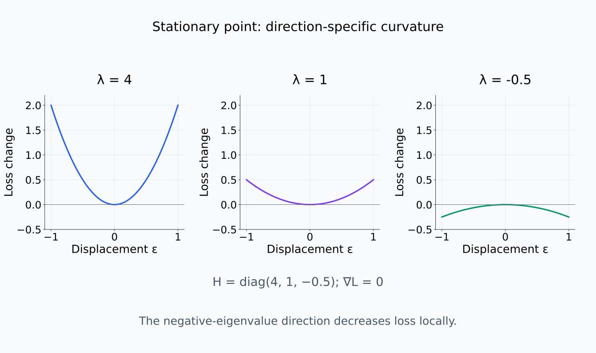
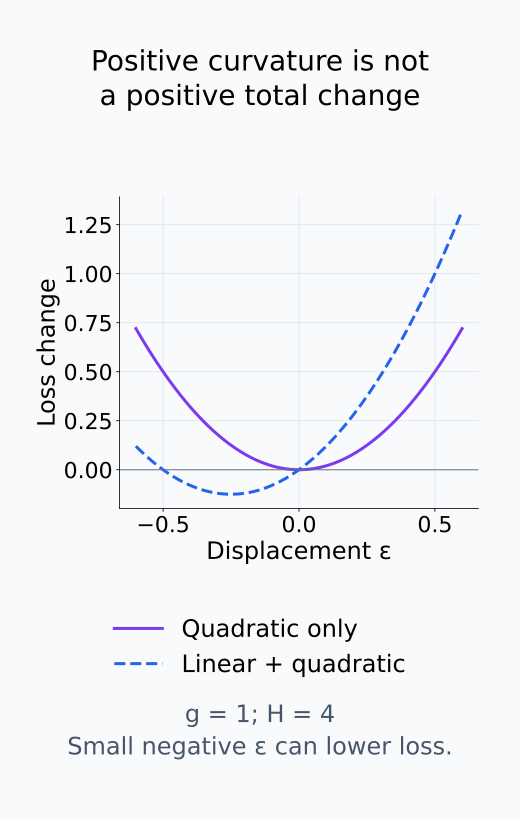
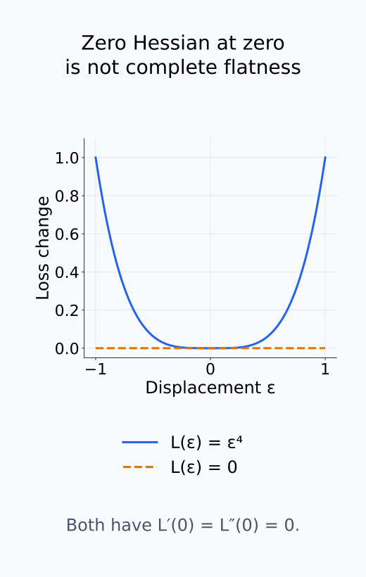
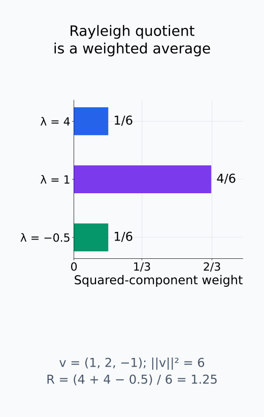
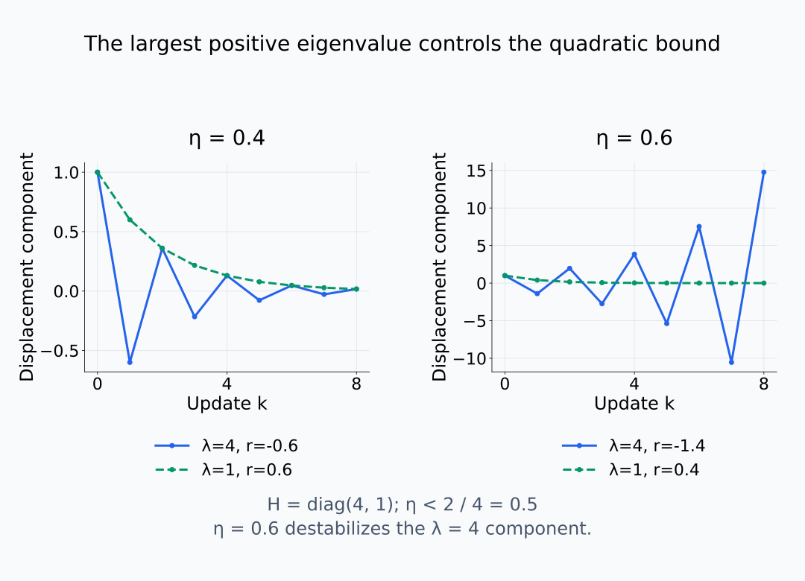
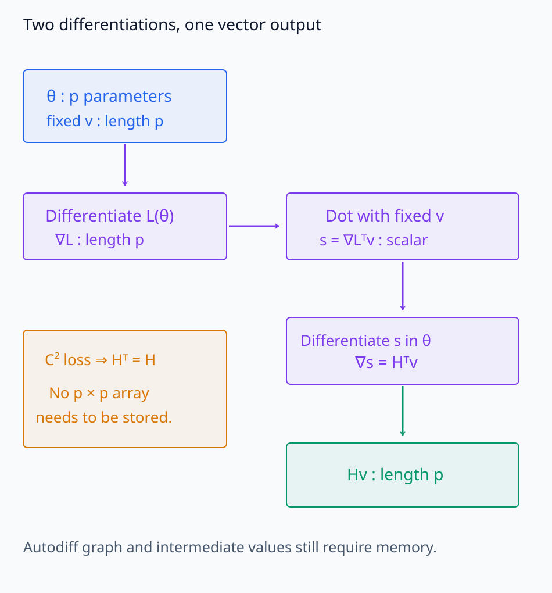
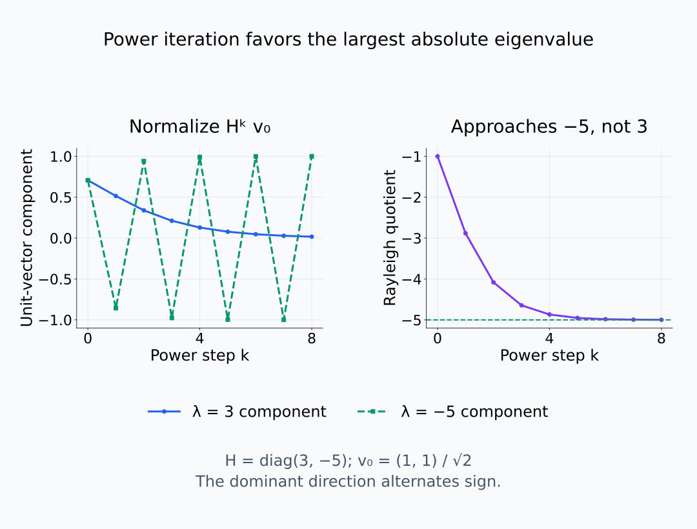

# I08-06. Hessian spectrum

## 이 단원이 필요한 이유

gradient는 현재 기울기를 주지만 방향별 gradient 변화는 말하지 않는다. Hessian eigenvalue는 선택한 파라미터화와 지점에서 loss의 국소 곡률을 요약한다. 큰 모델에서는 Hessian 전체를 만들지 않고 Hessian-vector product로 일부 spectrum을 근사한다.

## 학습 목표

- Hessian과 방향 이차미분의 관계를 설명할 수 있다.
- eigenvalue 부호를 국소 곡률로 해석할 수 있다.
- Hessian-vector product를 전체 행렬 구성과 구분할 수 있다.
- sharpness와 generalization을 곧바로 동일시하지 않을 수 있다.

## 선수지식 확인

- 선수 단원: [I08-05 mini-batch noise와 optimizer state](I08-05-minibatch-noise-optimizer-state.md), [M03-12 Hessian](../../part-1-foundations/M03/M03-12-hessian.md), [M02-11 고유값과 고유벡터](../../part-1-foundations/M02/M02-11-eigenvalues-eigenvectors.md)
- 확인 질문: symmetric matrix의 eigenvalue와 Rayleigh quotient는 어떻게 연결되는가?

## 기호와 용어

| 기호·용어 | Common spoken reading | 의미 | shape·범위 |
|---|---|---|---|
| $H(\theta)=\nabla^2L(\theta)$ | `H of theta equals the Hessian of L at theta` | loss Hessian | $p\times p$ |
| $v^\top Hv$ | `v transpose H v` | $v$ 방향의 이차 곡률 | scalar |
| $Hv$ | `H v` | Hessian-vector product | $\mathbb R^p$ |
| $\lambda_{\max}$ | `lambda max` | 최대 eigenvalue | scalar |
| spectrum | `spectrum` | eigenvalue의 multiset | $p$ real values for symmetric $H$ |

## 1. 국소 이차 근사

작은 $\delta$에 대해

$$
L(\theta+\delta)\approx L(\theta)
+\nabla L(\theta)^\top\delta
+\frac12\delta^\top H(\theta)\delta.
$$

이 근사는 loss가 해당 지점 주변에서 연속인 이계미분을 갖는 경우에 사용한다. 단위 vector $v$ 방향으로 $\delta=\varepsilon v$만큼 움직이면 선형항은 $\varepsilon\nabla L(\theta)^\top v$이고 이차항은 $\frac12\varepsilon^2v^\top Hv$이다. 따라서 $v^\top Hv$는 이 방향의 이차미분이다. 크기가 다른 vector를 비교할 때는 $v$를 정규화하거나 $v^\top Hv/(v^\top v)$인 Rayleigh quotient를 사용한다.

Stationary point에서는 선형항이 사라진다. 단위 eigenvector에 $Hv=\lambda v$를 대입하면 $v^\top Hv=\lambda$이므로 eigenvalue가 그 방향의 곡률이 된다. 양수면 작은 이동의 이차항이 loss를 높이고, 음수면 낮춘다. Gradient가 0이 아닌 지점에서는 선형항도 함께 보아야 한다. Eigenvalue가 0인 방향은 이차항이 사라질 뿐, 더 높은 차수까지 평평하다는 보장은 아니다.

같은 지점에서도 이동 방향에 따라 곡률의 부호가 달라진다.

<figure class="lesson-figure lesson-figure--wide" markdown="1">

<figcaption>기존 CPU 예제의 diagonal Hessian에 대응하는 세 단위 eigenvector 방향의 이차항 ½λε²를 그렸다. gradient가 0일 때 음의 곡률 방향은 작은 이동으로 loss를 낮춘다. 실제 모델의 전역 landscape가 아니라 국소 quadratic의 수학적 예시다.</figcaption>
</figure>

gradient가 0이 아닐 때에는 선형항을 함께 읽는다.

<figure class="lesson-figure" markdown="1">

<figcaption>H=4가 양수여도 gradient g=1이면 총 변화는 ε+2ε²이다. 작은 음의 ε에서는 선형항 때문에 loss가 감소한다. 따라서 nonstationary point의 변화는 Hessian 부호만으로 정하지 않는다.</figcaption>
</figure>

이차항이 사라지는 경우를 두 함수로 비교한다.

<figure class="lesson-figure" markdown="1">

<figcaption>ε⁴과 상수 0은 원점에서 gradient와 Hessian이 모두 0이지만 원점 밖의 값은 다르다. eigenvalue 0은 이차항이 없다는 뜻이며 모든 차수에서 flat하다는 뜻은 아니다.</figcaption>
</figure>

## 2. Spectrum이 주는 정보

$\lambda_{\max}$는 가장 큰 eigenvalue이며 단위 방향들의 Rayleigh quotient 중 최대값이다. Orthogonal eigenbasis로 vector를 분해하면 Rayleigh quotient는 eigenvalue들의 가중 평균이 된다. 각 가중치는 해당 성분 계수의 제곱이고 합이 1이므로 최대 eigenvalue를 넘지 못한다. 가장 큰 eigenvalue도 음수일 수 있으므로, 이를 항상 가장 큰 양의 값이라고 부르지는 않는다.

양의 eigenvalue들로 이루어진 quadratic에서는 최소점으로부터의 변위를 eigenvector 방향으로 나눌 수 있다. Gradient descent는 각 변위 성분에 $1-\eta\lambda$를 곱한다. I08-04의 안정 조건을 모든 방향에서 만족하려면 $0<\eta<2/\lambda_{\max}$여야 한다. 일반 신경망에서는 이동하면서 Hessian도 바뀌므로 한 지점의 spectrum으로 전체 학습 궤적의 안정성을 보장하지 않는다.

0에 가까운 eigenvalue가 많으면 이차 근사에서 평평한 방향이 많다는 뜻이다. 그러나 scale symmetry와 parameterization이 eigenvalue를 바꾸므로 모델 간 raw sharpness 비교는 조심해야 한다.

정규화한 제곱 성분이 방향 곡률의 가중치가 된다.

<figure class="lesson-figure" markdown="1">

<figcaption>기존 CPU vector v=(1,2,−1)의 제곱 성분을 합 6으로 나누면 가중치가 된다. eigenvalue에 이 가중치를 곱한 합은 Rayleigh quotient 1.25로, 가장 작은 값 −0.5와 가장 큰 값 4 사이에 있다.</figcaption>
</figure>

같은 learning rate가 모든 eigenmode에 똑같이 안전한 것은 아니다.

<figure class="lesson-figure lesson-figure--wide" markdown="1">

<figcaption>H=diag(4,1)인 수학적 quadratic에서 각 변위 성분은 1−ηλ배 된다. η=0.4에서는 두 성분이 감소하지만 η=0.6에서는 λ=4 성분이 부호를 바꾸며 커진다. 한 지점의 이런 조건을 일반 신경망의 전역 안정 보장으로 확대하지 않는다.</figcaption>
</figure>

## 3. 전체 Hessian을 만들지 않는다

$p$가 크면 $p^2$개 원소를 저장하기 어렵다. 고정한 vector $v$에 대해 scalar $\nabla L(\theta)^\top v$를 파라미터로 다시 미분하면 $H(\theta)^\top v$를 얻는다. 위의 매끄러움 조건에서 Hessian은 symmetric이므로 이는 $Hv$이다. Automatic differentiation은 이 scalar 미분을 계산해 전체 행렬 대신 길이 $p$의 곱을 얻는다. 계산 graph와 중간값의 메모리는 별도로 필요하다.

Power iteration은 $Hv$를 구하고 길이를 정규화하는 일을 반복한다. 초기 vector의 eigenvector 성분들은 반복 곱에서 eigenvalue의 거듭제곱으로 가중된다. 절댓값이 가장 큰 eigenvalue가 하나이고 초기 vector에 그 방향의 성분이 있다면 해당 방향이 우세해진다. 큰 음의 eigenvalue가 있으면 이것이 가장 큰 양의 곡률 방향과 다를 수 있다.

Lanczos는 여러 HVP로 만든 부분공간에서 작은 행렬의 spectrum을 계산한다. [Ghorbani et al. (2019)](https://proceedings.mlr.press/v97/ghorbani19b/ghorbani19b.pdf)의 density 추정은 여러 random probe와 Lanczos 결과의 가중치를 이용한다. 단일 dominant eigenvalue 추정과 전체 밀도 추정은 같은 산출물이 아니다. 근사에는 iteration 수, tolerance, probe vector seed와 측정한 loss·데이터를 기록한다.

전체 Hessian 대신 어떤 scalar를 다시 미분하는지 따라간다.

<figure class="lesson-figure lesson-figure--wide" markdown="1">

<figcaption>loss를 미분한 gradient와 고정 v의 내적은 scalar다. 이를 다시 θ로 미분하면 Hᵀv를 얻으며 C² 조건에서 Hᵀ=H이므로 Hv가 된다. p×p 행렬 저장을 피하지만 autodiff의 graph와 중간값 메모리는 별도로 필요하다.</figcaption>
</figure>

최대값과 최대 절댓값이 다른 예시에서 반복 곱을 확인한다.

<figure class="lesson-figure lesson-figure--wide" markdown="1">

<figcaption>H=diag(3,−5)에 power iteration을 적용한 수학적 예시다. 절댓값 5인 음의 방향이 우세해져 Rayleigh quotient가 −5로 접근하고 vector 부호는 교대로 바뀐다. 최대 eigenvalue 3과 절댓값이 가장 큰 eigenvalue −5를 구분해야 한다.</figcaption>
</figure>

## 4. CPU 실습

<!-- I08_EXAMPLE: i08_06_hessian_spectrum -->

대각 Hessian $\operatorname{diag}(4,1,-0.5)$의 spectrum과 한 vector의 $Hv$, Rayleigh quotient를 계산한다. 음의 eigenvalue는 이 점이 모든 방향의 local minimum이 아님을 보인다.

## 흔한 오해

### 오해 1. 큰 eigenvalue면 반드시 일반화가 나쁘다

parameterization, scale과 측정 loss에 따라 sharpness가 달라진다. 일반화는 독립 test metric으로 측정해야 한다.

### 오해 2. Hessian spectrum이 전역 loss landscape다

Hessian은 한 점의 국소 이차 정보다. 먼 지점과 다른 basin의 구조는 직접 말하지 않는다.

## 연습문제

### 1. 방향 곡률

$H=\operatorname{diag}(3,-1)$, $v=(0,1)$일 때 $v^\top Hv$를 구하라.

해설 보기

$-1$이다. 두 번째 좌표 방향에는 음의 곡률이 있다.

### 2. shape

$\theta\in\mathbb R^p$일 때 $H$, $v$, $Hv$의 shape을 적어라.

해설 보기

$H$는 $p\times p$, $v$와 $Hv$는 길이 $p$ vector이다.

### 3. stationary point

gradient가 0이고 Hessian에 음의 eigenvalue가 있으면 strict local minimum인가?

해설 보기

아니다. 음의 곡률 방향으로 작은 이동을 하면 이차항이 loss를 낮춘다.

### 4. HVP

HVP가 전체 Hessian보다 메모리를 덜 쓰는 이유는 무엇인가?

해설 보기

$p^2$ 원소를 저장하지 않고 주어진 vector에 대한 곱 $p$개만 계산·보관하기 때문이다.

### 5. 최대 eigenvalue

power iteration이 주로 찾는 것은 무엇인가?

해설 보기

절댓값이 가장 큰 dominant eigenvalue와 그 eigenvector 방향이다. 조건에 따라 부호 해석을 함께 확인해야 한다.

### 6. 주장 비판

“checkpoint $t$의 $\lambda_{\max}$가 작으므로 더 잘 일반화한다”를 비판하라.

해설 보기

국소 곡률 하나와 일반화 사이에는 자동적인 함의가 없다. 같은 parameterization인지 확인하고 독립 test 성능을 측정해야 한다.

## 근거와 갱신 경계

신경망 학습 중 Hessian eigenvalue density의 수치 추정은 [Ghorbani, Krishnan and Xiao (2019)](https://proceedings.mlr.press/v97/ghorbani19b.html)을 기준으로 한다. 이 단원의 CPU 예제는 exact diagonal Hessian이며 대규모 spectrum 근사 정확도를 재현하지 않는다.

## 단원 요약

- Hessian은 loss의 국소 이차 변화를 나타낸다.
- eigenvalue 부호와 크기는 방향별 곡률을 준다.
- 큰 모델에서는 HVP로 spectrum 일부를 근사한다.
- sharpness와 일반화는 별도 지표로 검증한다.

## 통과 기준

- 이차 근사와 방향 곡률을 설명할 수 있는가?
- 작은 Hessian의 eigenvalue를 해석할 수 있는가?
- HVP 근사의 기록 항목과 주장 한계를 말할 수 있는가?

## 다음 단원

- [I08-07 loss landscape와 mode connectivity](I08-07-loss-landscape-mode-connectivity.md)

## 집필자 점검표

- [x] 국소 곡률과 전역 landscape를 구분했다.
- [x] HVP와 spectrum 근사를 설명했다.
- [x] 모든 문제에 해설이 있다.
- [x] Common spoken reading이 실제 영어 학술 발화이며 한글 음역이나 기계적 직역을 포함하지 않는다.
- [x] 주장 강도와 읽기 표기를 확인했다.
- [x] 내부 링크와 수식을 확인했다.
